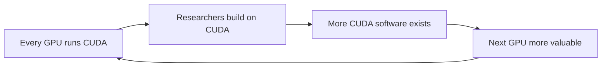

## Why this episode matters

No other episode in this track puts you in the room with the person who made the calls. The three-part Nvidia series tells you what happened. This episode tells you how Jensen decided. You get his rule for betting the company, his definition of a moat, his org chart, and his arithmetic for why Nvidia stopped pricing like a chip company. If you only internalize one idea from the whole track, make it this one: pull the future forward and simulate it before you bet.

At recording time (October 2023), Nvidia was worth about 1.1 trillion dollars, the sixth most valuable company in the world. Ben and David say they researched Nvidia for roughly 500 hours over two years before this interview, and Jensen still surprised them.

## The story

### 1993: the founding bet on a market that did not exist

Jensen founded Nvidia in 1993 with Chris Malachowsky and Curtis Priem. In the episode he says Nvidia was the only consumer 3D graphics company ever created at that time. Their thesis: the PC should become an accelerated PC, because Windows was still a software-rendered system.

Their first architecture bet was wrong. The first chips (NV1, NV2) used forward texture mapping: they drew curves and tessellated them, which avoided Z-buffers. Jensen says they thought avoiding Z-buffers was clever. It was the wrong answer. By the time they admitted it, Microsoft had shipped DirectX, which was fundamentally incompatible with Nvidia's architecture, and about 30 competitors had entered the field. Nvidia had months of cash left.

Definition: a Z-buffer is a piece of memory that stores how far away each pixel is, so the chip can decide which surface is in front. Skipping it seemed efficient. The industry standardized on it anyway.

### 1997: RIVA 128, the bet-the-company chip

With cash running out, Nvidia made what Jensen calls probably the company's best moment. They decided not to fight DirectX. They decided to build the best chip in the world for it: the RIVA 128, the first fully hardware-accelerated 3D pipeline for a PC. Transform, projection, lighting, frame buffer: every stage in hardware.

They had one constraint that changed everything. They could afford exactly one tape-out.

Definition: taping out a chip means sending the final design to the factory (the fab) to be manufactured. Each tape-out costs millions of dollars and months. A mistake means starting over.

The normal industry process was: build the chip, write the software, find the bugs, tape out again, repeat. Jensen says that method would have put them out of business. So they bought an emulator from a company called iSOS, which was shutting down that same day. Jensen called, bought their inventory, no promises. Dwight Diercks and the software team wrote the entire software stack and ran it on the emulator. It rendered about one frame per hour. They sat in the lab and watched Windows paint, one frame at a time, until they believed the chip was perfect.

Then they taped out once and went straight to production, marketing blitz, developer relations, everything. Jensen's line: "I know it is going to be perfect because if it is not we will be out of business, so let us make it perfect."

The chip came back supporting 8 of the 32 DirectX blend modes. Jensen says he learned too late that they should have implemented all 32. So they did the only thing left: they convinced the market and the developers that the other 24 did not matter.

Figure 1. The RIVA 128 decision. AI Podcast Curriculum, ep01 (Jensen Huang interview, 2023-10-16); toy built from episode claims.


Figure 2. Before and after the emulation bet. AI Podcast Curriculum, ep01 (Jensen Huang interview, 2023-10-16); toy built from episode claims.
| Step | Normal industry process | Nvidia, 1997 |
|---|---|---|
| Test | On physical prototypes | On emulator, 1 frame per hour |
| Tape-outs | Several, fix bugs between | Exactly one |
| Software | Written after silicon | Written before silicon |
| Outcome if wrong | Lose months | Lose the company |

### The lesson: only bet the company when you know it will work

Ben asks the obvious question. Jensen keeps pushing all the chips in, and it keeps working. Is the lesson just "bet big"? Jensen says no.

His rule: when you bet the farm, you are pulling everything risky from the future into the present. Everything they could prefetch, they prefetched. Everything they could simulate, they simulated. In his words, you push your chips in when you know it is going to work, because you already simulated it.

This is a decision rule you can reuse. A bet is not brave because it is large. A bet is sound because the uncertainty was removed before the money moved.

### CUDA: the ten-thousand-person-year bet

After RIVA 128, Nvidia won graphics. Then Jensen made a stranger bet: CUDA, a programming model that let developers run general computation on the graphics chip. The investment was on the order of 10,000 person-years, poured in before any market existed.

### CUDA: the first-principles case

Why did he believe? Two reasons from the episode.

First, the hardware was already right. A programmable shader is a massively parallel processor. Before CUDA there was Cg, an early attempt at a higher-level abstraction above the chip. Nvidia had already tested the idea on CT reconstruction and image processing. The pipeline of a programmable shader is a processor: highly parallel, massively threaded. Jensen calls the GPU the only processor in the world that works that way.

Second, Jensen went back to first principles after AlexNet (2012). AlexNet was a neural network that crushed 30 years of computer vision work overnight. Jensen asked why it worked. His answer: deep learning is a universal function approximator. Give it enough example data and enough layers, and there is no reason it cannot keep getting better as data and models grow. Then the hinge: for most valuable problems, causality does not matter. Prediction is enough. Do you care why someone prefers one toothpaste over another? No. You care that you can predict the choice. The same holds for movies, music, weather, and which item to show next in a social feed.

If prediction is the product and examples are the fuel, then almost every piece of software in the world would eventually be programmed this way. That is the market that justified 10,000 person-years before it existed.

### CUDA: winning the researchers

The early believers were researchers. Jensen says CUDA democratized supercomputing, and researchers were the first users: molecular dynamics, CT reconstruction, seismic processing, weather simulation, quantum chemistry. When deep learning arrived, Nvidia went to every AI researcher on the planet and asked how to help: Yann LeCun, Andrew Ng, Geoff Hinton, Ilya Sutskever. Jensen met Ilya at AI conferences. He read the papers himself. Papers came every three months, then every day. He watched progress compound in real time, exponentially.

### CUDA: the emergence evidence

He describes seeing a GAN for the first time as a 32 by 32 blurry image of a cat. It looked like a toy. His question was: how far can it go? His answer: scale the data, scale the model, and it gets better. Once models crossed 10 billion parameters, and certainly at 100 billion, they became magically more accurate, more useful, more lifelike.

On language models, his first reaction to BERT was about how clever the trick was: mask out words, make the model guess them. Self-supervised learning at its best. Text encodes reasoning, he argues. Humans get common sense from reading. Why would a machine not learn reasoning from reading too? Emergent abilities follow from reasoning ability. The fact that it is sensible does not make it less amazing.

Definition: emergent abilities are capabilities a model shows at large scale that it did not show at small scale, and that nobody explicitly programmed.

Figure 3. The CUDA flywheel. AI Podcast Curriculum, ep01 (Jensen Huang interview, 2023-10-16); toy built from episode claims.


### The one non-negotiable rule

Jensen states exactly one rule that is not negotiable in the company: every accelerator Nvidia makes must be architecturally compatible with every other one. He says Nvidia is the only accelerator company on the planet where that is true. The installed base he cites: 250 to 300 million active CUDA GPUs, all compatible. Everything else in the company is negotiable.

Why does this matter? A computing platform cannot exist if each generation breaks the last. Developers invest years learning CUDA and writing CUDA code. If a new chip invalidates that investment, the platform dies. Compatibility is what turns a product line into a platform. Note the lineage: CUDA's "UDA" (unified device architecture) goes back to the company's first days. Jensen says Nvidia was always a platform company internally, even when its products were just technology.

Ben makes the point that every big tech company started as a technology company serving developers, and that companies that try to start as platform companies fail. Jensen agrees with the sequence but corrects the framing: inside Nvidia, the platform architecture (UDA) was there from day one.

### The data center: separating compute from the screen

About 17 years before the interview (so around 2006), Jensen started the data center journey. His reasoning: Nvidia's technology was plugged into a computer that had to sit next to you, because it had to connect to your monitor. Desktops are a bounded market. There are only so many PCs and only so many displays to drive.

The insight: what if the computer does not have to be near the viewing device? One of his engineers showed him a demo: capture the frame buffer, encode it as video, stream it to a thin device. That became GeForce NOW, Nvidia's cloud gaming product, and a much bigger idea: compute can happen anywhere, and the screen can be anywhere else.

The physics objection is latency, specifically the speed of light. Jensen's answer: the speed of light end to end is roughly 70 to 120 milliseconds across the planet. That is not that long. If you remove every other obstacle, light speed is fine. So build data centers as large as you like, and every small device instantly becomes amazing.

Nvidia's first data center product, then a second (OEM graphics for enterprise data centers), then a third: CUDA plus GPU as a supercomputer. Jensen's point is that the data center business looks like it is about AI, but that is a false equivalence. Nvidia could explode into AI only because it had spent years learning to build data center computers in smaller markets first. His decision rule: you cannot wait until the opportunity is in front of you. Position the company near where the apple will fall, close enough to make the diving catch. You do not have to be perfect. You have to be near.

Figure 4. The separation insight. AI Podcast Curriculum, ep01 (Jensen Huang interview, 2023-10-16); toy built from episode claims.
```
Before:  [GPU]--cable--[monitor]     compute must sit next to the screen
After:   [GPU farm]--network--[any screen]   compute can sit anywhere
Rule:    light speed (~100 ms planet-wide) is fast enough; kill other latencies
```

### Mellanox: the network is the computer

In 2019 Nvidia bought Mellanox, the Israeli high-performance networking company, for about 7 billion dollars. Jensen calls it one of the best strategic decisions he ever made. The company had about 3,200 people in Israel.

His reasoning has two parts.

First: a data center is not distinguished from a desktop by its processor. Desktops and data centers use nearly the same CPUs and GPUs. What makes a data center a data center is the networking and infrastructure: how computing is distributed, how security is provided, how the network moves data. Those characteristics belonged to Mellanox, not Nvidia. If Nvidia wanted to build the computers of the future, and the computers of the future are data centers, then Nvidia had to own networking.

Second: AI training is the inverse of hyperscale cloud. Hyperscale takes commodity components and virtualizes many users onto one computer. AI training takes one job and orchestrates it across millions of processors. Commodity Ethernet is fine for Hadoop and search queries. It is not fine for sharding a model across thousands of GPUs. Supercomputing-style networking (InfiniBand) is ideal for that. Jensen saw this before others because he was standing near the opportunity: large language models were about to need exactly this.

Figure 5. Hyperscale versus AI training. AI Podcast Curriculum, ep01 (Jensen Huang interview, 2023-10-16); toy built from episode claims.
| | Hyperscale cloud | AI training |
|---|---|---|
| Shape | Many users on one computer | One job across millions of processors |
| Network need | Commodity Ethernet is fine | Supercomputing fabric (InfiniBand) |
| Example workloads | Search, Hadoop | LLM training |

### Zero-billion-dollar markets

Jensen uses the phrase "zero-billion-dollar market" for a market with no revenue yet that he believes will exist. Nvidia positions itself in these deliberately: PC gaming, the design workstation, supercomputing, the software-defined car, Omniverse. When Nvidia entered automotive, a CTO told him cars cannot tolerate the blue screen of death. Jensen's answer: someday every car will be software-defined, and a software-defined car needs an incredible computer. Fifteen years later, he says, they were largely right.

The structural logic: enter before the market exists, and by the time it emerges there are few competitors shaped like you. Omniverse, at the time of the interview, had about 40 customers, including Amazon and BMW. It looked tiny. That is the point. You navigate the company toward non-consumption, places where nobody is buying yet.

Definition: non-consumption means potential customers who buy nothing today because no good product exists for them yet.

### Moats are networks, not walls

Ben asks how a company that creates a market keeps its lead. Jensen dislikes the word moat, because it frames strategy as building walls around a castle. He prefers to think in networks. If you build the product right and an ecosystem grows around it, developers and customers build on you, and that network of networks is the moat. You enjoy the market together with everyone in the network, not alone behind a wall.

This is the economics behind Nvidia's pricing power. The moat is not one chip. It is 250 to 300 million compatible GPUs, the CUDA software stack, the developers trained on it, the libraries, the Mellanox fabric tying it together, and the switching cost of rewriting all of it. That is why the next chapters of this track spend so long on whether the moat persists.

### The org chart: mission is the boss

Jensen has more than 40 direct reports. He rejects the standard org chart. His argument: a company is the machinery for building its product, so the org should mirror the product's architecture. It makes no sense that every company's chart looks the same when they all build different things.

Instead, Nvidia wires itself like a neural network around missions. The phrase inside the company is "mission is the boss." They figure out the mission, then wire the best skills and teams across the whole organization to achieve it, cutting across reporting lines. Information moves fast and flat: Jensen describes a robotics meeting with new college graduates, vice presidents, and executive staff in one room, deciding together, everyone hearing the decision at the same moment. Nobody has power from privileged information. Leaders earn their jobs by reasoning well and helping others succeed, not by knowing something others do not.

The price: pressure on leaders is high. In a command-and-control system, your boss has more power because they are closer to the information. At Nvidia, information is everywhere, so leaders have to actually lead.

Figure 6. The org wiring. AI Podcast Curriculum, ep01 (Jensen Huang interview, 2023-10-16); toy built from episode claims.
```ascii
Standard:   CEO -> VP -> director -> manager -> you   (information trickles)
Nvidia:     mission pulls the best people from everywhere at once
            grads, VPs, and execs decide in the same room
```

### What he reads, what he fears, what he would tell a founder

Books: Jensen says Clay Christensen's series is the best, no contest: intuitive, sensible, approachable. He also likes Andy Grove's books. His method for reading business books: enjoy them, be inspired, but never adopt. Ask what it means for you, in your context, at your company's age. Learn from everyone, including competitors and adjacent industries. Education is free. Then come back and design your own strategy.

Don Valentine of Sequoia, Nvidia's first investor, told Jensen: "if you lose my money I will kill you." Then, over the decades, mailed him newspaper clippings with "good job" written over them in crayon. Both founding VCs, Sutter Hill and Sequoia (Tench Coxe, Mark Stevens), were still on the board 30 years later. Jensen says that almost never happens.

His greatest fear is letting employees down. People joined because they believed in his hopes and dreams, and adopted them as their own. On time: there is plenty of time in the day if you prioritize and refuse to let Outlook control you. He admits he was late to the interview itself.

His advice on business plans: they should be much shorter. A financial forecast nobody can verify is not the point. The plan must answer: what is the true problem, what unmet need will emerge, and what will you do that is sufficiently hard that competitors cannot swarm it once they see it works. Product, positioning, pricing, and go-to-market are skills you can learn. The essence is hard.

On luck: you can do all the right smart things and still fail. You can do dumb things, and Jensen says he did many, and still succeed. Skill matters, but circumstances have to cooperate at the important moments.

On LSI Logic, where he worked before Nvidia: it taught him that you can express chip design in high-level languages and let optimizing compilers do the work. Harvey Jones coined "high-level design." Jensen was 21, at ground zero of the EDA revolution, and watched one industry revolutionize another. He wants the same to happen in digital biology, with large language models as the high-level language for biology.

### AI safety and jobs

On safety, Jensen splits the problem. In robotics and self-driving: functional safety, active safety, when a human must be in the loop and when not. In information: bias, false information, artists' rights. Nvidia partnered with Getty and Shutterstock to train generative image models on licensed data instead of scraping the internet. For increasingly agentic AI: keep the human in the loop as long as it is sensible. Collect data, curate it, train, test, validate, then release. Do not let models self-learn in the wild.

On jobs: productivity creates prosperity, and prosperous companies hire more people to expand into new areas. The failure mode in the fear is assuming companies have no more ideas. History says otherwise: industry today is vastly larger than industry a thousand years ago because humans have infinite ambition. Net job growth does not guarantee no individual gets fired. His practical advice: you are more likely to lose your job to another human who uses AI than to an AI. Learn to use AI. Every company should use it to become more productive.

Ben names the pattern the Moritz corollary to Moore's law, after Mike Moritz of Sequoia. When Moritz took over from Don Valentine, he looked at Sequoia's early funds, including the one with Cisco, and asked how they could ever top it. His answer: as compute gets cheaper, it reaches more of the economy, so the addressable markets get bigger. AI does the same thing.

### Why Nvidia is not a chip company

The last idea is the pricing key for the whole track. Jensen was told long ago that video could never be a billion-dollar market, and that no chip company could ever be that big. His answer: stop being a chip company. Nvidia manufactures intelligence now. It manufactures productive work.

His arithmetic: if you build a chip for a car, your market is the number of cars times chips per car. If you build a system that acts as a chauffeur whenever needed, your market is the value of a chauffeur for everyone who has a car. The second market is enormously larger. By building on top of the chip, Nvidia grew its opportunity by roughly a thousand times.

Do not be surprised, he says, if technology companies become much larger than chip companies ever could. What they produce is something very different.

Figure 7. The thousand-times market. AI Podcast Curriculum, ep01 (Jensen Huang interview, 2023-10-16); toy built from episode claims.
```ascii
Chip company:      market = cars x chips per car            (bounded)
Intelligence co:   market = value of a chauffeur x everyone (vast)
Jensen's estimate: ~1000x larger opportunity
```

He closes with the people. Thirty years in, he is surrounded by colleagues who have been there 25 to 30 years: Chris, Jeff Fisher, Dwight, Jonah, Brian, Joe. Not one of them ever gave up on him. "That is the entire ball of wax."

## Questions and answers

> [!QA]
> Q: Explain the RIVA 128 story like I am new. Why does it matter?
> A: In 1997 Nvidia was months from dying. Its first chip designs were wrong, Microsoft's DirectX made them obsolete, and 30 competitors existed. Nvidia could afford to manufacture a chip exactly once. So the team bought an emulator from a dying company, ran the whole chip design plus all its software on it at one frame per hour, and only manufactured when they believed it was perfect. It worked and saved the company. It matters because it created Nvidia's permanent method: simulate the future before you bet on it.
> Follow-up: What is the reusable rule? Only bet the company when you have pulled the risk forward. A big bet is justified by preparation, not by courage. Jensen: bet when you know it will work, because you simulated it.

> [!QA]
> Q: What is CUDA, in one paragraph?
> A: CUDA is a programming model that lets developers write general-purpose programs that run on Nvidia's graphics chips. Before CUDA, the chip only drew pictures. After CUDA, the same massively parallel hardware could do science, simulation, and machine learning. Every Nvidia accelerator runs it, and every generation stays compatible with the last, so 250 to 300 million GPUs form one platform that developers build on.
> Follow-up: Why did researchers adopt it first? CUDA democratized supercomputing. A researcher could buy one GPU instead of booking time on a supercomputer, and it worked for molecular dynamics, imaging, weather, and chemistry long before deep learning arrived.

> [!QA]
> Q: Why did Jensen invest 10,000 person-years in CUDA before the market existed?
> A: After AlexNet (2012), he reasoned from first principles. Deep learning is a universal function approximator: more data plus deeper networks keeps improving it. For most valuable problems, prediction beats causal explanation: nobody cares why you prefer a toothpaste, only that the prediction is right. If that is true, almost all software gets rewritten this way, and the computer itself must change. The market would be enormous, so the investment was rational before revenue existed.
> Follow-up: What is the trap in this reasoning? It only works if the scaling holds. Jensen's evidence was the research community: papers every three months, then every day, progress visibly exponential. He did not bet on a theory alone. He bet on a measured trend.

> [!QA]
> Q: What is the one non-negotiable rule at Nvidia, and why?
> A: Every accelerator must be architecturally compatible with every other accelerator. No exceptions. Everything else is negotiable. The reason: a computing platform dies if each generation breaks developers' past work. Compatibility is what converts a product line into a platform and protects 250 to 300 million GPUs of installed software investment.
> Follow-up: How would you test whether a competitor has this? Ask whether code written five years ago runs unchanged on their newest chip. If not, they sell products, not a platform.

> [!QA]
> Q: Why did Nvidia buy Mellanox?
> A: Two reasons. First, a data center is defined by its networking and infrastructure, not its processor: desktops and data centers use nearly the same chips. To be a data center company, Nvidia had to own networking. Second, AI training is the inverse of hyperscale: one job spread across millions of processors, which commodity Ethernet cannot handle. Supercomputing fabric (InfiniBand) can. Jensen saw large language models coming and bought the network they would need.
> Follow-up: What is the general lesson? Define a system by what differentiates it, not by its most famous part. The chip gets the glory. The network decides whether ten thousand chips can act as one.

> [!QA]
> Q: What does "mission is the boss" mean in practice?
> A: Nvidia has 40+ direct reports to Jensen and no standard hierarchy. Work organizes around missions: the company figures out the mission, then wires the best people and teams to it across all reporting lines, like a neural network. Information spreads fast and flat: new graduates and executives can hear a decision at the same time. Leaders earn authority by reasoning well, not by hoarding information.
> Follow-up: What is the price? High pressure on leaders. In command-and-control, your boss's power comes from being closer to information. When information is everywhere, leaders must actually lead.

> [!QA]
> Q: What is a zero-billion-dollar market, and why does Nvidia chase them?
> A: A market with zero revenue today that you believe will exist tomorrow: PC gaming in the 1990s, the software-defined car, Omniverse. Nvidia enters early, so when the market emerges, few competitors are shaped for it. The discipline is navigating toward non-consumption: people who buy nothing today because no good product exists yet.
> Follow-up: How do you avoid fooling yourself? Jensen's filter is the unmet need plus sufficient hardness: pick problems hard enough that competitors cannot swarm you once they see it works.

> [!QA]
> Q: Walk me through Jensen's "thousand times" market arithmetic.
> A: A chip company selling into cars is bounded: cars times chips per car. A company selling a chauffeur on demand prices against the value of a human driver for everyone with a car. Same technology, different market definition, roughly a thousand times larger. Nvidia stopped pricing like a chip company the day it started manufacturing intelligence instead of silicon.
> Follow-up: Apply it once yourself. Pick a product you know. Price it as a component, then price it as the outcome it produces. The gap between those two numbers is the opportunity Jensen is describing.

## Memory aids

- The RIVA rule: one tape-out, one frame per hour, zero excuses. Simulate before you bet.
- Compatibility is the platform: 250 to 300 million GPUs, one architecture, one non-negotiable rule.
- Moat as network: walls keep people out. Networks pull people in. Nvidia chose the network.
- Mission is the boss: 40+ direct reports, information flat, leaders earn it by reasoning.
- The thousand-times flip: price the outcome (the chauffeur), not the component (the chip).
- Never-confuse pair: hyperscale (many users, one computer, Ethernet is fine) versus AI training (one job, millions of processors, needs InfiniBand).
- Trap card: "Nvidia's data center revenue means AI is the whole story." Jensen says that equivalence is false: the data center was a 17-year journey through gaming, OEM graphics, and supercomputing before AI arrived.
- Quote to keep: "if you lose my money I will kill you." Don Valentine to Jensen, followed by decades of crayon "good job" clippings.

## How to imbibe this

- This week: pick one decision you are about to make and "pull it forward." Write the failure modes on paper before you commit money or time. Ask: what would I simulate if I could only afford one tape-out? Do the cheap simulation first. Notice the urge to skip it.
- Catch yourself: the next time you feel the pull to bet big on low information, say Jensen's sentence out loud: "we assume it is perfect because we emulated the whole thing." If you cannot say it honestly, shrink the bet or buy the emulator.
- Behavior change per major idea:
  - RIVA 128: before any irreversible decision, list what a perfect simulation would look like, and run the cheapest version of it.
  - CUDA compatibility: when you build anything others will build on, write down your one non-negotiable compatibility promise. Everything else stays negotiable.
  - Mission is the boss: in your next team discussion, share the raw information with everyone at once instead of filtering it down a chain. Watch what changes.
  - Zero-billion markets: spend 30 minutes listing where your field has non-consumption: people buying nothing because nothing good exists. Keep the list.
  - Thousand-times flip: take one thing you price as a component and reprice it as an outcome. Write both numbers down.
- Monthly: reread your "one non-negotiable rule" for your own work. If the list has grown past one, you do not have a rule. Cut it back to one.

## Think it yourself

Guided drills. Do these with your own brain before touching AI. Write answers by hand.

1. Fermi: RIVA 128 rendered one frame per hour on the emulator. A game needs 30 frames per second. How many times slower was the emulator than the real chip? Show the arithmetic. (Answer: 30 frames per second is 108,000 frames per hour. The emulator was roughly 100,000 times slower, and they still shipped on it.)
2. Reason it through: Jensen says bet the company only when you know it will work. Argue the other side: name one situation where betting without full simulation is the right move. When does waiting for certainty cost more than the bet?
3. Journal: "What is my one non-negotiable rule?" Write it in one sentence. Then list three things you currently treat as non-negotiable. Cut two. How does it feel?
4. Both sides: Jensen dislikes "moat" and prefers "network." Argue for moats: when is a wall better than a network? Name a real company where the wall worked and the network would have failed.
5. First principles: pick a product you use daily. Price it as a component, then as an outcome (the chauffeur flip). Compute the ratio. Is it closer to 1x or 1000x? What would have to change to push it toward 1000x?
6. Observe: in your next meeting, notice who learns information first and who learns it last. Map the delay. What would "everyone hears it at the same time" cost in your organization? What would it buy?

## Skills you can now use

- Size a market two ways: as components times units, and as outcome value times beneficiaries. Quote both numbers before choosing a strategy.
- Sanity-check any "bet the company" story: ask what was simulated before the bet. No simulation, no admiration.
- Test a platform claim: ask whether five-year-old code runs on the newest hardware unchanged. That single test separates platforms from products.
- Diagnose a system by its differentiator: when someone pitches "the chip" (or the model, or the app), ask what actually distinguishes the system: the network, the distribution, the data flywheel. Price the differentiator.
- Run a mission-based review: state the mission in one sentence, list the skills it needs, and check whether the people assigned match the mission or just the org chart.

## Go deeper

- Ben Gilbert and David Rosenthal's three-part Nvidia series on Acquired (episodes 8 to 10 of this track) covers the full company history behind these decisions.
- Clay Christensen's "The Innovator's Dilemma" (Jensen's pick for the best business book series, no contest): https://en.wikipedia.org/wiki/The_Innovator%27s_Dilemma, start with the overview, then read the book itself.

## Figure audit

| Unit | Claim | Before | After | Figure | Medium |
|---|---|---|---|---|---|
| u01 | One tape-out forced emulation | Normal multi-tape-out flow | Single emulated tape-out | fig1 | mermaid |
| u02 | Emulation replaced prototypes | Physical prototypes | Emulator at 1 frame/hour | fig2 | table |
| u03 | CUDA compatibility compounds | Isolated chips | 250-300M compatible GPUs | fig3 | mermaid |
| u04 | Compute separated from screen | GPU cabled to monitor | GPU farm over network | fig4 | ascii |
| u05 | AI training inverts hyperscale | Many users, one box | One job, millions of chips | fig5 | table |
| u06 | Nvidia org mirrors its product | Standard hierarchy | Mission-wired network | fig6 | ascii |
| u07 | Intelligence market dwarfs chip market | Cars x chips per car | Chauffeur x everyone | fig7 | ascii |

All 7 units mapped. No blank cells.
