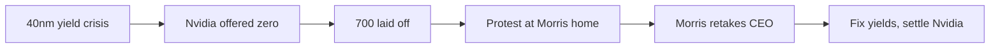
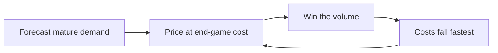

## Why this episode matters

Every chip in the AI boom passes through one company's factories. This episode explains why that company exists, and no other episode gives you the founder's own account. You get the invention of the pure-play foundry, a masterclass in settling a nine-figure dispute over pizza, and the inside story of how TSMC won Apple while a successor's mistake nearly broke the Nvidia relationship. The through-line: Morris saw the future (fabless chip companies), did unglamorous work for years to be ready for it, and never competed with his own customers.

Ben and David flew to Taipei for a 48-hour trip and recorded in Morris's office. He was 93. He had just published Volume 2 of his autobiography after a 26-year gap. It exists only in traditional Chinese, so they worked from an unpublished translation by Karina Bao, funded by Tyler Cowen's Emergent Ventures. Jensen Huang personally asked Morris to do the interview.

## The story

### 1987: inventing the pure-play foundry

Definition: a foundry manufactures chips designed by other companies. A pure-play foundry does only manufacturing and never sells its own chip designs, so it never competes with its customers. An IDM (integrated device manufacturer) like Intel designs and manufactures its own chips.

Morris founded TSMC in 1987 at age 56. Everyone thought the idea was crazy. The industry was vertically integrated: you designed your chips and you built your own fabs. A company that only manufactured, for anyone who walked in, seemed like a contradiction.

Morris had seen the future before founding. At General Instrument, a founder came asking for a 50 million dollar investment, then called back to say he only needed 5 million. Why? "I am not going to build a fab." That was the start for Morris: chip companies without factories, fabless companies, were coming. Another company, ATM, had no fabs and wanted General Instrument's empty fabs to make its wafers. The difficulty of the foundry business appeared immediately: every customer wants the fab run their way, but you can only run it one way. The advantage appeared too: many customers, one factory, enormous scale.

Don Valentine's line about Sequoia, which Morris quotes: "I had an advantage. I knew the future." Morris says he had a glimpse of it.

The timing was close. Morris says he was within about 12 months of when he thought fabless would arrive. But the first five-plus years were unglamorous. TSMC's real business was taking other IDMs' least critical, least interesting overflow orders. Ben calls the original business plan kind of bad: rent out spare capacity for anyone's boring chips. Morris does not dispute it. He did the unglamorous business deliberately to build competency, volume, capacity, and literal fabs, so TSMC would be standing there when the fabless revolution arrived.

Figure 1. The foundry bet. AI Podcast Curriculum, ep02 (Morris Chang interview, 2025-01-27). Shell 1. Show the toy. Source: original toy, from episode claims.
| Axis | IDM model (Intel) | Pure-play foundry (TSMC) |
|---|---|---|
| Designs chips | Yes | Never |
| Manufactures | Its own designs | Anyone's designs |
| Competes with customers | Structurally yes | Structurally no |
| Old fabs | Repurposed for leading edge | Kept running, fully depreciated |

That last row matters more than it looks. Intel constantly repurposes old fabs for the newest node, which means it loses the ability to make older chips. Demand for old chips fades slowly: replacement parts for cars and machines built decades ago, camera sensors, and countless unglamorous components. TSMC still runs fabs 2 and 3 from the late 1980s. On an accounting basis they are fully depreciated, so they generate nearly free high-margin revenue. Keeping every generation running is a philosophical choice, and it compounds.

### The golden accident of the 1980s

Ben and David note that TSMC, ARM, Synopsys, Cadence, and ASML were all founded within a couple of years of each other in the mid to late 1980s. The industry disintegrated into layers at once: architecture, manufacturing, design software, and equipment each became standalone businesses. ARM and TSMC are, in Ben's phrase, coupled at the hip of history. The x86 world never disintegrated this way, which is why Intel stayed fully integrated and why AMD, the x86 exception, is a TSMC customer.

### 1997: the letter from Jensen

Morris's relationship with Jensen started with a letter in 1997. Nvidia was four years old, had 50 or 60 employees, and was facing bankruptcy. TSMC had a few thousand employees and had passed 1 billion dollars in revenue in 1995. Nvidia had approached TSMC's San Jose office and gotten no answer.

Morris had always told his salespeople never to ignore a future customer, even a tiny one, so the silence irritated him. The letter also raised his curiosity. He was flying to California the next week anyway. He called Jensen with no advance notice. Jensen picked up himself, background noise of an argument in progress, and shouted to his people: quiet, Morris Chang is calling.

Jensen impressed Morris with articulateness and optimism, and with frankness: Nvidia was in financial difficulty, but the chip he wanted built would not only save the company, it would make Nvidia a major TSMC customer. Major meant at least 50 million dollars a year in TSMC revenue. Morris calls it quite a bold statement from a company that size.

The prediction came true. The chip was a successful games chip, it solved Nvidia's financial problems, and within two or three years Nvidia was one of TSMC's five biggest customers. The partnership has run from that day to the present at immense scale.

The decision rule underneath: never be negligent with a future customer, no matter how small they look today. The San Jose office's non-answer nearly cost TSMC the most valuable customer relationship in its history.

### 2009: the 40-nanometer crisis and the comeback

Morris had handed the CEO job to a successor, Rick Tsai, while keeping the chairmanship. In Taiwan, he notes, the chairman is the top person anyway. During those years, TSMC hit a crisis on the 40-nanometer node: manufacturing problems and, worse, quality problems. Yields were low.

Definition: yield is the percentage of chips on a wafer that actually work. A yield problem means you are paying to manufacture chips you must throw away.

Nvidia was perhaps the biggest customer on that node, and it was losing time and money. But the CEO insisted TSMC was not at fault and offered Nvidia nothing. Zero. Morris, watching as chairman, grew impatient. Other problems piled up: pricing was falling faster than manufacturing cost, so gross margin kept dropping, and the CEO had laid off 600 to 700 people.

The layoffs violated Morris's deepest management principle, learned at Texas Instruments in the early 1970s. TI's first instinct in a downturn was to lay off by performance rating. Morris was the only one who objected. His argument: performance ratings are subjective. Seven hundred bad ratings come from seven hundred supervisors. Nobody will respect the decision. Worse, the arithmetic fails: separation costs about half a year of pay, and training a replacement takes at least half a year. If you need the people back within a year, the layoff was stupid. At TSMC, the worst outcome for a struggling employee was six months of probation, after which most returned to their jobs and some were transferred to better-fitting roles. Under Morris, TSMC essentially never did layoffs.

The 600 to 700 laid-off employees came to Morris's home to protest. The company called the police, who sent 50 to 60 officers. Morris had food prepared for 25 to 30 people and served pizza and salad to the protesters in the park. They were thankful, and they told his wife they would not march on the presidential palace that day. Morris had warned the previous CEO before the layoffs happened. The episode, he says, precipitated his return.

At 78, in 2009, Morris took the CEO job back.

Figure 2. The 2009 return. AI Podcast Curriculum, ep02 (Morris Chang interview, 2025-01-27). Shell 3. Apply the one rule. Source: original toy, from episode claims.

His first days: he called every major customer, including Jensen. Jensen was friendly but serious: the 40-nanometer quality, delivery, and manufacturing problems were real. Morris said: give me a couple of weeks.

Then the famous dinner. Morris invited Jensen to his home at 6:00 for salad and pizza, something they had done many times before. Jensen emailed back: when do we discuss business? Morris answered: 6:30 we eat, 8:00 we go to your home office and discuss business. Ninety minutes of family dinner with no business talk. Then the negotiation.

Morris offered more than 100 million dollars. The offer expired in 48 hours. No bargaining, no arguing. If Jensen refused, they would go to arbitration, which Jensen himself had proposed to the previous CEO, who had not even named a number. Morris had spent weeks arriving at the figure and believed it was fair to both sides. Jensen accepted within two days.

Since then, the two companies have done many billions of dollars of business together. Morris included the story in his autobiography because it shows what a long partnership makes possible: a large sum, a hard deadline, and a relationship strong enough to survive both.

### 2010: the 28-nanometer bet

After fixing 40nm, Morris committed to the 28-nanometer node with everything TSMC had. Two numbers define the bet.

First, R and D at 8 percent of revenue, set by fiat, recession or not. The origin: at Texas Instruments, Morris ran worldwide semiconductors and asked to raise R and D from 4.8 to 5.5 percent. Denied, every time. At TSMC he refused to repeat the annual argument. The company was running 6 or 7 percent, negotiated yearly between the R and D director and the CEO. Morris said: 8 percent, no negotiation, no annual fight. He calls it the best news the R and D organization ever got. Freed from budget warfare, the engineers started thinking big. Their phrase for 28nm: the sweet spot, like a tennis racket.

Second, capital expenditure of almost 6 billion dollars in 2010, roughly triple the 2 to 2.5 billion TSMC had spent yearly for the previous decade. Morris calls it a mutual feeding: secure the R and D budget, the engineers bring bigger ideas, the bigger ideas justify the capex.

At 28nm, TSMC became the clear leader among foundries. Not Intel, not yet. But among foundries, definitely. Morris dates TSMC's technology leadership to this node.

Figure 3. The 28nm commitment. AI Podcast Curriculum, ep02 (Morris Chang interview, 2025-01-27). Shell 1. Show the toy. Source: original toy, from episode claims.
| Input | Before | 2010 decision |
|---|---|---|
| R and D | 6-7%, renegotiated yearly | 8% of revenue, fixed |
| Annual capex | 2 to 2.5 billion dollars | Almost 6 billion dollars |
| Position | One of several foundries | The foundry leader |

### Winning Apple: the 20-nanometer detour

The Apple story starts with a surprise dinner. Terry Gou, the founder of Foxconn and a second cousin of Morris's wife Sophie, called to say he was coming to dinner and bringing an Apple vice president. Morris assumed it would not be an ordinary VP. At 8 p.m., Jeff Williams walked in. He was Apple's chief operating officer.

Williams barely made small talk. He talked 80 percent of the dinner. His pitch: Apple wanted TSMC to make iPhone wafers. On economics, he said Apple would let TSMC have 40 percent gross margin. Morris said nothing at the time, but his thought was: we are already at 45 percent, and I am pushing for 50.

The surprise: Apple did not want 28nm. It wanted 20nm, a half step. In Moore's-law progression, 28 was supposed to go to 16. A half step is a detour: TSMC would spend effort on 20 that would help 16 later, but it would delay 16, and at the time TSMC's R and D could not do two nodes at once. The cost of the detour: on the order of 10 billion dollars over the next few years. And TSMC had planned its 28nm capex without Apple in mind. Apple was a pure surprise on top.

So Morris did the financial planning. Options: cut the dividend, sell new stock, borrow, or take only part of Apple's order. He had planted a relationship with Goldman Sachs early in TSMC's life and had even served on Goldman's board, so high-level advice was a phone call away. Decision: keep the dividend, sell no stock, borrow billions, and take half of what Apple said it needed. His reasoning on the half: customers have no skin in the game when they state demand. They will happily take your billions in capacity and leave you holding it.

C.C. Wei, the business development director, first carried the "half" message to Apple's purchasing people. Their answer: you must be crazy. Morris went to Cupertino himself and told Jeff Williams: after prudent financial planning, we will issue corporate bonds and take half. Williams's only suggestion was to eliminate the dividend. Morris refused. About a third of TSMC's shareholders cared seriously about dividends, and cutting would crash the stock. Williams let it lie. The deal was set.

Then, in February 2011, Williams called: pause discussions for two months. The highest level of Intel had approached Tim Cook about making Apple's chips. Morris was not worried. In the 1990s, hearing Intel's name made competitors tremble. By 2011, Intel was no longer that name. Morris's read of what Apple wanted: technology at parity with Intel (he believed TSMC was at parity or better), and customer trust. He knew Intel's customers in Taiwan, the PC makers. None of them liked or trusted Intel. Intel always acted like the only supplier. And Intel had a structural conflict: it designs chips that compete with its foundry customers' designs. TSMC's extreme core discipline is never competing with customers.

A month later Morris visited. Williams was away and had Tim Cook meet him instead, an unusual upward delegation. Cook took him to the Apple cafeteria, they carried their trays back to Cook's office, and Cook said: do not worry, Intel just does not know how to be a foundry. Morris's interpretation: a foundry must respond to every customer request, even the crazy and irrational ones, courteously. Intel had never learned that.

Figure 4. Why Intel could not be the foundry. AI Podcast Curriculum, ep02 (Morris Chang interview, 2025-01-27). Shell 1. Show the toy. Source: original toy, from episode claims.
| Layer | TSMC | Intel |
|---|---|---|
| Technology | At parity or better | The feared incumbent, no longer so |
| Trust | Apple's customers trusted it | Its own customers did not trust it |
| Structure | Never designs chips, no conflict | Designs chips that compete with customers |

Pricing was settled separately, after homework on costs and yields. When it closed, Morris invited Williams to a three-star Taipei restaurant. Williams joked: if you had not liked the pricing, we would probably be going to McDonald's.

The tradeoff was real. TSMC spent the billions on 20nm, which delayed 16nm. Samsung skipped 20, went straight to 16, and won Apple's first 16nm orders. Morris describes the shock plainly: TSMC had invested tens of billions counting on converting 80 to 90 percent of its 20nm equipment to 16. If Apple bought 16 from Samsung, where did that leave TSMC? He emailed Williams immediately. Williams replied: do not worry, I will be in Taiwan next week to explain. He came, and he said: as soon as you are ready with 16, we will buy all our needs from you. Half a year later TSMC had its own 16nm, and most of Apple's 16nm business stayed with TSMC.

Figure 5. The Apple detour. AI Podcast Curriculum, ep02 (Morris Chang interview, 2025-01-27). Shell 3. Apply the one rule. Source: original toy, from episode claims.

### The learning curve, from the man who refined it

Morris did not invent the learning curve, but he refined it into a weapon at Texas Instruments. The simple version: as you make more of anything, unit cost falls. It started with refrigerators and cars. Bruce Henderson, the founder of the Boston Consulting Group, brought the theory to TI around 1970 with Bill Bain. TI's Mark Shepherd agreed to work with them. Morris was TI's guy, and Bain worked three days a week from a small office next to Morris's.

Morris's warning: anyone who takes the simple explanation and thinks that is all there is has learned nothing. The real learning curve is a strategy, and Ben and David spell out how TSMC plays it. The goal is to be the largest-volume player at the end of the game, because this is a fixed-cost business and the winner spreads fixed costs over the most customers. So you price early at where costs will be at the end. You cut prices aggressively, even starting unprofitable on a new node, to win the volume that drives you down the curve fastest. It works backward from a forecast of mature demand.

That is why the Apple decision was so delicate. The learning curve says take all of Apple's order: maximum volume, fastest trip down the curve. But taking it all exposes the company to existential risk if your forecast of iPhone demand is off by 5 or 10 percent. Miss the forecast and the node generation's profitability collapses, free cash flow collapses, and you cannot fund the next node. Morris's "take half and borrow" was the compromise between the curve and survival.

Get the forecasting and execution right, and the story flips from surprising to inevitable. Ben's summary: of course the company that takes all the orders gets the lowest price. Of course the industry ends with a dominant player. A fab costs 20 billion dollars today and will cost 40, 80, 100 billion. Almost nobody else can deploy that. TSMC's capex grows alongside its net income, and on top of that it funds separate R and D for the next node. Add proprietary packaging like CoWoS for AI chips, which makes it even harder for customers to dual-source, and the leader pulls away every year.

Figure 6. The learning curve as a loop. AI Podcast Curriculum, ep02 (Morris Chang interview, 2025-01-27). Shell 3. Apply the one rule. Source: original toy, from episode claims.

The numbers Ben and David cite: since TSMC's founding in 1987, the world semiconductor market grew from 26 billion to 527 billion dollars. Moore's law is undefeated, not as a physics law but as a demand law: the world wants roughly twice the computing power every two years, and has for 50 to 60 years.

### Organization: combine, do not split

Rick Tsai, the CEO between 2005 and 2009, split operations into advanced technology (led by Mark Liu) and mainstream technology (led by C.C. Wei), each with its own small business development group. Morris never thought the split was a good idea. When he returned, he recombined them: about 10,000 people in advanced, 7,000 to 8,000 in mainstream.

The mainstream group is the old fabs finding customers who do not need the leading edge: automotive, sensors, replacement parts. It is the institutional form of the "keep every generation running" philosophy.

He had fought the same battle in 1996, when McKinsey's Don Brooks proposed a functional organization. Asked to name one big functional company, McKinsey answered Boeing. Morris's reply: Boeing has commercial and government divisions, not a 707 division and a 747 division. Splitting by fab would be like splitting Boeing by airplane model. As chairman, his principle had been to let the CEO make his own mistakes and learn from them, unless the company was going down the drain. The split was a mistake he let happen, then fixed.

On C.C. Wei: Morris once offered him the business development job to round him out as an executive. Wei had 10,000 people reporting to him and balked at a 60-to-70-person department. Morris's analogy: Kissinger had a couple hundred people as National Security Advisor while the Secretary of State had thousands worldwide. Power is not headcount. Wei took the job, and he is now TSMC's chairman and CEO.

### What Morris never compromised

Two through-lines. First, never compete with your customers. It is the pure-play foundry's founding promise, and it is why Apple trusted TSMC over Intel. Second, never be negligent with a future customer. The San Jose office ignoring Nvidia's 1997 letter is the cautionary tale inside the success story.

On margins, Morris is philosophical. TSMC earns mid-50s gross margins today (he retired just short of 50, still pushing). Its customers earn 70 to 80. Pricing, he says, comes down to cost plus what the customer will accept. Value is created jointly. The split is negotiated, and it is personal to each CEO.

## Questions and answers

> [!QA]
> Q: Explain the pure-play foundry like I am new.
> A: Before TSMC, every chip company designed its chips and built its own factories. Morris split the two jobs. TSMC builds factories and manufactures chips designed by anyone: Apple, Nvidia, Qualcomm. It never designs its own chips, so it never competes with its customers. That promise is the whole business model. Every AI chip you have heard of is made this way.
> Follow-up: Why did everyone think it was crazy in 1987? The industry believed manufacturing skill and design skill had to live in one company. Morris bet they could be separated, and that separation would let one factory serve the entire industry's volume.

> [!QA]
> Q: Why did Morris take the CEO job back at 78?
> A: Three failures under his successor: the 40-nanometer yield crisis with Nvidia offered zero compensation, pricing falling faster than costs so margins shrank, and 600 to 700 employees laid off by performance rating. The layoffs violated his core principle from Texas Instruments: never lay people off by subjective ratings, and never lay off when you will need people back within a year. He returned in 2009 and fixed all three.
> Follow-up: What is the layoff arithmetic? Separation costs about half a year of pay. Training a replacement takes at least half a year. If the business needs those people back within a year, the layoff destroys value twice: once in cash, once in capability.

> [!QA]
> Q: Walk me through the 100-million-dollar pizza dinner.
> A: Morris invited Jensen to his home: 6:00 salad and pizza, no business. Jensen asked when they would discuss business. Morris said 8:00, at Jensen's home office. After ninety minutes of family dinner, Morris offered more than 100 million dollars, expiring in 48 hours, no bargaining, or they go to arbitration. Jensen accepted within two days. The relationship, built over a decade, made a hard offer possible without breaking trust.
> Follow-up: Why the 48-hour deadline? Morris had spent weeks finding the fair number. A deadline converts a fair number into a decision. Without it, a dispute with your biggest customer becomes a permanent tax on the relationship.

> [!QA]
> Q: Why did TSMC spend 10 billion dollars on 20 nanometers, a node nobody planned?
> A: Apple demanded it as the price of the iPhone business. The natural progression was 28 to 16, and TSMC's R and D could not do two nodes at once, so 20 delayed 16. Morris funded it with debt, kept the dividend, sold no stock, and took only half of Apple's stated demand, because customers state demand with no skin in the game. Samsung skipped 20 and won Apple's first 16nm orders, but Williams promised all of Apple's 16nm once TSMC was ready, and the promise held.
> Follow-up: What is the general rule? When a whale customer demands a detour, take enough to win them and not so much that a wrong forecast kills you. Half the stated demand, funded with debt, dividend intact.

> [!QA]
> Q: What is the learning curve as a strategy, not a slogan?
> A: Unit cost falls as cumulative volume rises. The strategy: decide you will be the largest-volume player at the end, then price early at end-game costs, even unprofitably, to win the volume that gets you there fastest. TSMC pairs this with forecasting: you must predict mature demand for the node, because being off by 5 to 10 percent destroys the node's profitability and your ability to fund the next one.
> Follow-up: Apply it. Name a fixed-cost business you know. What would "price at end-game cost today" look like, and what forecast would you be betting the company on?

> [!QA]
> Q: Why couldn't Intel be Apple's foundry?
> A: Tim Cook's answer to Morris: Intel just does not know how to be a foundry. Morris's interpretation has three layers. Technology: TSMC was at parity or better. Trust: Intel's own customers in Taiwan neither liked nor trusted Intel. Structure: Intel designs chips that compete with its foundry customers' designs, a conflict TSMC avoids by never designing chips. And craft: a foundry answers every customer request, even the irrational ones, courteously. Intel never learned that.
> Follow-up: Which of the three layers is hardest to copy? The third. Technology can be bought, trust can be rebuilt, but a culture of courteous responsiveness to thousands of demanding customers is a decade of habit.

> [!QA]
> Q: Why does TSMC keep ancient fabs running?
> A: Two reasons. Demand for old nodes fades slowly: replacement parts, cars, sensors, cameras. And the fabs are fully depreciated, so their revenue is nearly pure margin. Intel repurposes old fabs for new nodes and loses old-node capability. TSMC keeps every generation alive, which also keeps every generation's customers.
> Follow-up: What is the trap? Maintenance capex is real, and talent wants to work on the leading edge. The mainstream group exists so old fabs get real leadership, not leftovers.

## Memory aids

- The foundry promise: never design, never compete with customers. Everything else follows.
- The letter rule: never ignore a future customer, even a 50-person company facing bankruptcy. San Jose's silence nearly cost TSMC Nvidia.
- The layoff test: separation costs half a year, training costs half a year. Need them back within a year? Do not lay off.
- The 8 percent rule: fix R and D as a share of revenue so nobody argues about it yearly. Morris picked 8 and ended the war.
- The half order: whale customers state demand with no skin in the game. Take half, borrow the rest.
- Never-confuse pair: IDM (designs and builds its own chips, competes with customers) versus pure-play foundry (builds anyone's chips, competes with no one).
- Trap card: "TSMC won because of cheap Taiwanese labor." The episode's answer is technology leadership, the learning curve, and customer trust. Labor cost is not the story.
- The number: 26 billion to 527 billion dollars. The semiconductor market from TSMC's founding to 2024.

## How to imbibe this

- This week: identify one "future customer" you are currently ignoring because they look too small. A junior colleague, a tiny client, a side project. Give them a real answer within 48 hours. Log what happens over the next month.
- Catch yourself: the next time a downturn tempts you to cut people or spending by a spreadsheet rule, run Morris's test. Is the rating subjective? Will you need the capacity back within a year? If yes to either, find another cut.
- Behavior change per major idea:
  - Foundry promise: write down who your "customers" are and check whether any of your side projects compete with them. Kill the conflict or disclose it.
  - The letter: answer one message you have been ignoring because the sender seemed unimportant. Small senders become large.
  - 48-hour offers: the next time you owe someone a hard answer, name a fair number and a deadline instead of negotiating forever. Watch how fast things move.
  - 8 percent rule: pick one important budget in your life (learning, health, savings) and fix it as a percentage. No annual renegotiation with yourself.
  - Half the whale: when someone promises huge future volume, discount it by half in your planning until they show skin in the game.
- Monthly: ask whether you are doing "crappy work" that builds capability for a future you can see, or crappy work that is just crappy. Morris's early years were the first kind. Know which kind yours is.

## Think it yourself

Drills get slightly harder from here. Still guided, but fewer handrails.

1. Fermi: a fab costs 20 billion dollars and a leading-edge wafer sells for roughly 15,000 to 20,000 dollars. How many wafers must the fab sell to pay for itself? What does that imply about how many customers a fab needs? (Work it: 20 billion divided by 20,000 is 1 million wafers. One fab needs a million wafers of demand. That is why volume aggregation is existential.)
2. Argue both sides: Morris refused to cut the dividend to fund Apple. Argue he was wrong: the iPhone business would have dwarfed the dividend signaling. Then argue he was right. Which argument would you have made in the room?
3. Journal: "Who is my San Jose office ignoring?" Write about one relationship you are neglecting because the other party seems small. What would the 1997 letter look like in your life?
4. First principles: the learning curve says price at end-game cost. Pick a product with high fixed costs and low marginal costs that you know well. Sketch what end-game pricing would be and who would die first if someone did it.
5. Observe: find a company that competes with its own customers (an IDM in your field). List three ways the conflict shows up. Then list what a pure-play version of that industry would look like.

## Skills you can now use

- Evaluate a manufacturing partnership: check the three layers (technology parity, customer trust, structural conflict). One failing layer is a warning. Two is a no.
- Price with the learning curve: estimate mature volume, compute end-game unit cost, and decide whether you can afford to price there early.
- Discount whale demand: halve any customer forecast that comes with no deposit or penalty, and require deposits where you can. Morris coined "confiscate the deposit" as a negotiating sentence, even though he never used it.
- Settle disputes like Morris: do weeks of homework, name one fair number, attach a short deadline, and keep the relationship strong enough to survive the hardness.
- Design an org around the product's architecture: if two groups serve different generations of the same system, ask whether the split helps customers or just managers.

## Go deeper

- The Acquired TSMC remastered episode (the full company history this interview builds on): https://www.youtube.com/watch?v=FZItbr4ZJnc, start from the interview, then work backward through the series.
- Asianometry on YouTube (recommended in the episode by Ben): the best free explainer of how fabs actually work, from wafers to EUV: https://www.youtube.com/@Asianometry

## Figure audit

| Unit | Claim | Before | After | Figure | Medium | Source |
|---|---|---|---|---|---|---|
| u01 | Pure-play foundry splits design from manufacturing | IDM does both | Foundry does one, never competes | fig1 | table | episode claims |
| u02 | 2009 crisis forced Morris back at 78 | 40nm failure, zero offered, 700 laid off | Yields fixed, Nvidia settled | fig2 | mermaid | episode claims |
| u03 | 28nm was a full-commit bet | 6-7% R and D, 2B capex | 8% R and D, 6B capex | fig3 | table | episode claims |
| u04 | Intel could not be Apple's foundry | Intel the feared incumbent | Trust and structure favored TSMC | fig4 | table | episode claims |
| u05 | Apple demanded a 20nm detour | Plan was 28 to 16 | 20 built, 16 delayed, Apple stayed | fig5 | mermaid | episode claims |
| u06 | Learning curve is a priced loop | Cost-plus pricing | Price at end-game cost, win volume | fig6 | mermaid | episode claims |
| u07 | Old fabs are profit centers | Intel repurposes old fabs | TSMC keeps them, depreciated | fig1 | table row | episode claims |

All 7 units mapped. No blank cells.
