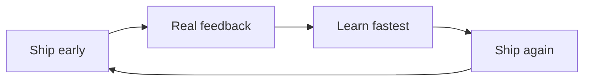
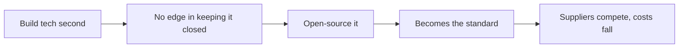

## Why this episode matters

This is the only episode where a founder-CEO explains, live and unscripted, how his company survived being declared dead nine times. No other episode gives you the operating system: define yourself by the human need, not the app; learn faster than everyone else; ship before you are proud of it. You also get his two biggest self-declared mistakes (the mobile rewrite and the 20-year political miscalculation), his open-source strategy for Llama, and why he thinks Apple is a bigger competitor than people realize. The through-line: Meta is a vehicle for maximizing his degrees of freedom, and he is still driving it.

The setting: Acquired Live at Chase Center, fall 2024, in front of about 6,000 people. Jamie Dimon opened the show. Mark wore a custom shirt he designed with fashion designer Mike Amiri, printed with a family saying in Greek: pathei mathos, learning through suffering.

## The story

### He did not try to start a company

Ben asks the Jensen question: knowing what you know now, would you still start Facebook? Mark's answer is honest. The early startup years were not fun. Everything could die at any moment. He does not wish to relive them. It is good, he says, that humans underestimate how painful things will be, or nobody would do good things.

Then the twist: he did not try to start Facebook. In school he built about 12 different things he wanted to exist. He came to Silicon Valley with Dustin Moskovitz and a handful of people because that is where startups came from. Driving down Highway 101 past eBay and Yahoo, he thought: one day maybe we will build a company like this. Facebook already had scale, and he still thought of it as a great project, not a company. He lacked the ambition to turn it into one. It just happened.

His summary line: "I hated being a startup and wanted to stop being a startup as fast as possible." He is, Ben notes, the iconic startup founder of the century, and he wanted out of startup-ness immediately. What he wanted was a going concern: cash-generative, durable, able to fund the next idea without selling the company.

### Why Meta kept winning: the formula

Ben's question for the night: why has Meta worked so spectacularly well through wave after wave that was supposed to kill it? He names them: MySpace, first-generation Twitter, Instagram, Snapchat, WhatsApp, TikTok, Apple's App Tracking Transparency, ChatGPT. Nine moments when the consensus said Facebook was finished.

Mark's answer has three parts.

First, identity. "We are a technology company focused on human connection, not a specific type of app." Meta never defined itself as a website or a social network. Building glasses that let people feel present with each other is, to him, the natural continuation of the apps. How you define yourself determines what you are allowed to become. Companies that define themselves as one thing cannot cross platforms.

Second, real technical depth. Mark was an engineer; he took systems engineering classes. He observed that most companies calling themselves technology companies were not: the CEO was not technical, the board had nobody technical, one head of engineering carried it all. At Meta, the management team is heavily technical across product groups. Friendster and MySpace died partly on graph computation: calculating who-knows-whom at scale is brutally hard, a combined product and technology problem. Meta held itself to being better than everyone else at the technology, because the product is just an implementation on top of the foundation.

Third, the learn-faster loop. Mark's formula: "If we can learn faster than every other company, we are going to win." Ship early, get feedback, learn what people actually want, ship again. By version three, four, or five (and versions are not even discrete, they ship so often), the product is better because it has absorbed more reality than any competitor's.

Ben adds the strategy gloss from his research: Mark plays the company like a turn-based strategy game. Get more turns than anyone else. Learn more from each turn than the next player. Jensen's version from Episode 1: position your hand near where the apple will fall. Same idea.

Figure 1. The learn-faster loop. Source: episode.

Figure 2. The nine waves. Source: episode.

| # | Wave | The death sentence |
|---|---|---|
| 1 | MySpace | The original social network wins |
| 2 | Twitter gen 1 | Real-time beats social graph |
| 3 | Instagram | Mobile-native kills the website |
| 4 | Snapchat | Ephemeral kills permanent |
| 5 | WhatsApp | Messaging unbundles social |
| 6 | TikTok | Algorithmic feed beats friend graph |
| 7 | Apple ATT | Privacy rules kill the ad engine |
| 8 | ChatGPT | AI assistants replace apps |
| 9 | (Reality Labs losses) | The metaverse bet bankrupts focus |

Mark's point: none of them killed Meta, because Meta was never the app under attack. It was the learning machine underneath.

### Ship before you are proud

The culture behind the loop is explicit: value shipping and feedback more than praise. Mark says many internal conversations sit near the line of embarrassment about what they are putting out. Not shipping things they think are bad. Shipping things early enough to learn what they are actually for. With AI especially, it is clear the technology is transformative and unclear what the first valuable use cases are, so the only way to find out is to ship and watch where it resonates.

He contrasts this with Apple: long polish cycles, ship when perfect. That works for Apple and fits its culture. It is the opposite of Meta's. The price of Meta's way is small brand damage with every early ship. The price of waiting is missing the learning time you can never get back.

The decision rule: if you want praise every time you ship, you will ship too late to learn.

### Invention versus discovery

David asks whether product creation is invention (you conceive it fully, then build it) or discovery (the statue is inside the marble; you chip away with feedback until it appears). Mark says it is a combination, and each side alone fails.

Pure discovery, shipping only what resonates, gives you no conviction to push through hard things. Pure invention, building only your vision, never finds product-market fit because you are not focused on customers. You need values about what should exist (the invention side) matched against what actually resonates (the discovery side).

Examples: News Feed in 2006 was closer to invention. Before it, social networks were profiles; nobody asked for a feed, and showing people updates turned out to be what they wanted. Stories was closer to discovery: Snapchat found the format, Meta learned from it and built the better version. Mark is unembarrassed about this: "There are more smart people outside your company than inside your company." If you do not learn from the market, you are ignoring free signal.

Figure 3. Invention versus discovery. Source: episode.

| | Invention | Discovery |
|---|---|---|
| Source | Your values about what should exist | Market signal about what resonates |
| Strength | Conviction to survive hard things | Product-market fit |
| Failure mode | Nobody wants it | No backbone when it gets hard |
| Meta example | News Feed (2006) | Stories (from Snapchat) |

### Open source as strategy: Open Compute and Llama

Ben proposes that Meta is the largest beneficiary of open source in the modern world. Mark agrees with the mechanism if not the superlative. Every company since the late 1990s is built on open source stacks. Meta was the first big company built on the LAMP stack.

The strategic logic is second-mover logic. Google built distributed computing infrastructure first and kept it proprietary, because it was an advantage. Meta needed the same infrastructure, built it second, and realized keeping it closed bought nothing against Google. So they open-sourced it. Open Compute became the industry standard. The supply chain standardized around Meta's designs. Result: vastly more supply, cheaper hardware, higher quality, billions of dollars saved. Open-sourcing what is not your differentiator commoditizes your supplier's market in your favor.

Llama follows the same logic. Meta wants guaranteed access to a leading AI model and has been burned by platforms too many times to depend on anyone else. It is big enough to build its own core technology. But AI models are not monolithic software; they are ecosystems, and ecosystems get better when others use them. Open-sourcing Llama builds the ecosystem around Meta's stack, exactly as Open Compute did for hardware.

Figure 4. The open-source play. Source: episode.

The trap to avoid: open-sourcing your actual differentiator. Meta open-sources infrastructure and models, not the social graph or the ranking systems that monetize it.

### The mobile rewrite: the year-and-a-half mistake

In 2012, Facebook on mobile was HTML5 inside a native shell. The reasoning: Meta's culture was web iteration, ship daily. App stores meant building separately for iPhone, Android, BlackBerry, and Windows Mobile, then waiting weeks for approval. The plan: build one web platform, ship once, update everywhere daily. Velocity would beat nativeness.

They were wrong. Native integration turned out to be critical for how interactions feel. So they rewrote the apps from scratch and, crucially, paused all feature development for about a year. Mark cites Netscape: rewrites that also add features never terminate. The only safe rewrite is a pure rewrite.

The timing was brutal. Mobile was growing fast and had zero revenue. On desktop, ads lived in a side column. On mobile, nobody had invented the feed ad yet, and advertisers hated the idea that their ad would look like a feed story. Users hated ads in the organic feed. So the share of traffic Meta could monetize was shrinking while it rebuilt. The company IPO'd at a 100 billion dollar market cap and lost half of it in three months.

Mark's reflection: "When you are losing, it is usually pretty clear what you have to do. The question is whether you have the pain tolerance to do it." A year and a half of pain, then they emerged in great shape. In retrospect, he says, getting cut in half for a year and a half looks quaint. Later they would lose 80 percent.

The general rule he offers: it is harder to know what to do when you are winning. Jumping from one local hill to a taller one is culturally hard. When you are losing, the move is obvious; only courage is scarce.

### The 20-year mistake: politics

Ben asks for the most legitimate criticism. Mark names the political miscalculation. Before 2016, outside the IPO period, public sentiment about the company was positive essentially every month. After the 2016 election, it was negative essentially every month for years.

His diagnosis: he treated a political crisis as a corporate crisis. The corporate instinct is to take ownership: something is wrong, we will fix it. But many attackers were not operating in good faith; they wanted someone to blame. Accepting responsibility for things Meta did not do became an invitation to be kicked for more. "We should have been firmer and clearer about which of the things we actually felt like we had a part in and which ones we did not."

His verdict: "If the IPO was a year-and-a-half mistake, the political miscalculation was a 20-year mistake." It started in 2016, and he estimates another 10 years to fully work through it before the brand recovers. Twenty years sounds long, but in the grand scheme, he says, they will get through it and come out stronger.

The operational lesson: fund independent academic research before you need it. When you are accused of something, defending yourself is not credible. Third-party researchers debating the evidence is. Years of research now exist on social media's effects, and Meta learned to push back harder on claims with no factual basis.

Figure 5. Two mistakes, two timescales. Source: episode.

| Mistake | Duration of pain | Nature |
|---|---|---|
| HTML5 mobile | 1.5 years | Technical, clear fix, needed pain tolerance |
| Political miscalculation | ~20 years | Treated politics as corporate crisis, owned blame that was not theirs |

### Control: the Yahoo billion and super-voting shares

In 2006, Yahoo offered 1 billion dollars for Facebook. Everyone on the management team wanted to sell. The board tried to fire Mark. His failure, by his own account: he had not communicated a long-term vision, because he was not thinking in terms of a company at all. He could not articulate why turning down the money was right. Understandably, the team wanted their startup dream payout.

Afterward, he fixed the governance so it would be harder to fire him for wanting to build. Super-voting shares. Mark is explicit about what control buys: the ability to make 10-to-20-year bets that no hired CEO could survive. Reality Labs, 50 billion dollars and counting, exists because he controls the company. He can at least articulate the case now, which he could not in the Yahoo days.

The through-line Ben names: Meta is Mark's vehicle for maximizing degrees of freedom. He wants his hands on many controls, wants to see where the world is going, and wants the best spaceship to maneuver there. Ben's image: put a wall in front of Mark and there will be a Mark-shaped hole in it.

### Reality Labs and the glasses: good versus awesome

Mark draws a distinction he returns to all night. Good is useful: 3.3 billion people use Meta's apps daily because they help them stay connected, build businesses, form communities. Nobody wakes up excited about social media, but it is good. Awesome is different: uplifting, inspiring, optimistic about the future.

For the next 15 years, he wants Meta to build awesome things alongside good things. Reality Labs is the awesome bucket. The thesis: the ideal social experience is not a phone you look down at. It is glasses that see what you see and hear what you hear, acting as the perfect AI assistant with full context, projecting holograms into the world so presence is not constrained to a small screen. A conversation where one person is a hologram and an AI participates as a presence: that is the ultimate social experience and the ultimate incarnation of AI.

The engineering is brutal: a novel display stack (not phone screens), miniaturized chips, microphones, speakers, cameras, eye tracking, all-day batteries, new radio protocols, all in glasses that must look good. Ten years of work. Two tracks: the full holographic glasses, and the constrained version with EssilorLuxottica (Ray-Ban). The Ray-Bans started as a practice project for the ultimate glasses. Then AI transformed them: cameras plus microphones plus speakers turned out to be the perfect AI device form factor. Mark called the product lead on a Saturday from the highway: put Meta AI in the glasses, on device, and ship it. The prototype was ready Tuesday.

His market math: everyone who wears glasses today is a candidate to upgrade to AI glasses. Even that alone makes it one of the most successful products in history. And it will go further.

The strategic math is about control. Mark estimates Meta might be twice as profitable if it owned the platform instead of paying platform taxes: app store rules blocking ads, shipping restrictions, products it cannot build. "We have been through too much with the other platforms to fully depend on anyone else." Reality Labs is expensive because owning the next platform is worth it.

On the "willing it into existence" question: at Meta's scale, some bets are about what you want the next 10 to 20 years to hold. You do not discover your way to a new computing platform. You decide, then you build.

### Apple: the ideological competitor

Mark says Apple is a bigger competitor than people realize. The fight is not just products. Over the next 10 to 15 years, it is an ideological battle over the architecture of the next platforms: Apple's closed, integrated model versus open platforms. Every computing generation has had both versions. The iPhone's dominance creates recency bias that closed is simply superior. Mark's counterexample: in the PC era, Windows with the open ecosystem won.

His stated goal: build the next generation of open platforms and have open win, so that a kid in a dorm room can build without asking permission. Llama, the glasses, AI: all pointed at openness. Expect Apple to be the primary competitor, and expect the competition to be about values as much as products.

Figure 6. Open versus closed, by era. Source: episode.

| Era | Closed/integrated | Open ecosystem | Winner |
|---|---|---|---|
| PC | Mac | Windows | Open |
| Mobile | iPhone | Android | Mixed, closed led mindshare |
| Next (AI, AR) | Apple's vision | Meta's bet (Llama, glasses) | Undecided |

### The personal layer

A few details that show the man, not the CEO. He is introverted and guards alone time; COVID gave him reflection space that led to doubling down on AI infrastructure and Reality Labs. He knew investors would hate it; he did not know a recession would arrive at the same time. Losing 80 percent of the market cap taught him who he was: "You learn who you are through challenges."

He renamed the company Meta not to run from the Facebook brand but to run toward the future. "We run towards something. We do not run away from things." He only rebrands when the new name is evocative of what they are building.

His daughter, after a Taylor Swift concert, said she wanted to be like Taylor Swift. Mark said that was not available to her. She thought, then said: when I grow up, I want people to want to be like August Chan Zuckerberg. His advice to founders in the audience: "Learn from other people's successes and failures, but do your own thing."

Ben and David's closing reflection: Mark is still in it. Most founders of his vintage stepped back, took board roles, or started side vehicles. Mark's Blue Origin is inside Meta: Reality Labs. Meta is an amplifier that turns Mark's output up 10,000 times, and he shows no sign of being halfway done.

The gift Ben and David gave him: a custom shirt with two sets of GPS coordinates. Kirkland House, Harvard, where he wrote Facebook's first line of code. And Chase Center, where he told this story.

## Questions and answers

> [!QA]
> Q: Why did Meta survive nine waves that were supposed to kill it?
> A: Because Meta never defined itself as the thing under attack. It defined itself as a technology company for human connection, with real engineering depth and a learn-faster loop: ship early, absorb feedback, ship again. Each wave attacked an app. The learning machine underneath kept producing the next app.
> Follow-up: Test the identity claim on yourself. Write what your company or career is "for" without naming any product. If you cannot, you are defined by your current app, and the next wave owns you.

> [!QA]
> Q: Explain the learn-faster formula like I am new.
> A: Ship a product early, before it is polished. Watch what real people actually do with it. Learn faster than any competitor from that reality. Ship the improved version. Repeat so often that versions blur together. Whoever completes the most learning cycles wins, because their product has absorbed more truth about users.
> Follow-up: What is the most common way companies break the loop? They wait for praise. Waiting for praise feels safe and costs the one thing competitors cannot give back: learning time.

> [!QA]
> Q: When should you open-source something, in Meta's logic?
> A: When you built it second and keeping it closed buys you nothing. Google's infrastructure advantage was already taken, so Meta open-sourced Open Compute and made it the standard, which commoditized its supply chain and saved billions. Same with Llama: Meta needs a leading model it controls, and models improve as ecosystems, so open-sourcing builds the ecosystem around Meta.
> Follow-up: When should you not? When it is your differentiator. Meta open-sources infrastructure and models, not the social graph or the ad-ranking systems. Open the commodity, guard the moat.

> [!QA]
> Q: What went wrong with HTML5 mobile, and what is the general lesson?
> A: Meta bet that shipping one web codebase daily across all phones would beat native quality. Wrong: native feel turned out to be critical. They rewrote from scratch, paused all features for a year (a rewrite that adds features never ships; Netscape proved it), and endured 18 months with no mobile revenue while the stock halved. The general lesson: when you are losing, the move is usually obvious. The scarce resource is pain tolerance, not strategy.
> Follow-up: Name a rewrite happening near you right now. Is it a pure rewrite, or is it smuggling in features? If the latter, what does the Netscape rule predict?

> [!QA]
> Q: What was the 20-year mistake?
> A: After 2016, Mark treated political attacks as a corporate crisis: take ownership, fix everything. But many attackers wanted blame, not fixes, and owning things Meta did not do invited more kicking. He should have distinguished what was actually theirs from what was not, and pushed back on unfounded claims. He estimates 20 years total to work through it, with 10 still to go.
> Follow-up: What is the operational fix? Fund independent research before you need it. Self-defense is not credible under accusation. Third-party evidence is.

> [!QA]
> Q: Why does Mark want to own the next platform?
> A: Two maths. Product: glasses with AI and holograms are the ideal social experience, and even an upgrade cycle among current glasses wearers makes it historic. Economics: platform taxes cost Meta enormously; he estimates the company might be twice as profitable owning its platform. And control: no more asking Apple for permission to build.
> Follow-up: Apply the "twice as profitable" test to your own work. What percentage of your output goes to platform taxes: app stores, algorithms, gatekeepers? What would owning the platform be worth?

> [!QA]
> Q: What is the open-versus-closed fight about?
> A: Whether the next computing platforms (AI, AR glasses) follow Apple's closed integrated model or an open ecosystem model. Mark argues recency bias favors closed because of the iPhone, but the PC era went to open Windows. His goal is to build open platforms and have open win, so a kid in a dorm room can build without permission.
> Follow-up: Argue Apple's side. When does closed win for users? Name what openness costs in coherence, safety, and quality, and decide which you would bet on for glasses people wear on their faces.

## Memory aids

- The formula: technology company plus human connection plus learn faster than everyone.
- Pathei mathos: learning through suffering. The shirt, the Yahoo billion, the 80 percent drawdown.
- Ship embarrassed: if you are never near embarrassment, you are shipping too late to learn.
- Invention needs conviction, discovery needs customers. One without the other fails.
- Open the commodity, guard the moat: Open Compute and Llama are open; the graph and ranking are not.
- Never-confuse pair: a year-and-a-half mistake (mobile rewrite: clear fix, needed pain tolerance) versus a 20-year mistake (politics: misdiagnosed the crisis type).
- Trap card: "Meta won because it copied." The episode's answer: copying without the learning machine is nothing. Stories succeeded because the iteration engine underneath was faster.
- The number: 3.3 billion people daily. Four apps over a billion users. Nine death waves survived.

## How to imbibe this

- This week: ship one thing before you feel ready. A draft, a prototype, a message. Note exactly where the embarrassment sits. Then collect one piece of real feedback within 48 hours. That is one turn of the loop.
- Catch yourself: the next time you polish instead of shipping, ask whose praise you are waiting for. Name them. Then ask what you would learn this week if you shipped today.
- Behavior change per major idea:
  - Identity: rewrite your one-line professional identity without naming any product or employer. If you cannot, you are an app, not a company.
  - Learn faster: start a feedback log. Every shipped thing gets one entry: what you expected, what happened, what changed. Review monthly.
  - Open source logic: find one thing you keep proprietary out of habit, not advantage. Ask what would happen if you gave it away and commoditized your suppliers.
  - Pain tolerance: the next time the right move is obvious but painful, set a timer: decide in 48 hours, then endure. Do not confuse delay with diligence.
  - Political vs corporate: when attacked, sort blame into "actually mine" and "not mine" before responding. Own the first fully. Contest the second promptly.
- Monthly: count your turns. How many ship-learn cycles did you complete this month? More turns, more learning. That is the whole game.

## Think it yourself

Drills continue the arc: less guidance, more reasoning from scratch.

1. Fermi: 3.3 billion daily users. If each generates 1 dollar of annual profit, what is Meta's profit? If the platform tax is really "twice as profitable without it," what fraction of value do gatekeepers capture? Show the arithmetic, then sanity-check against Meta's actual reported profit band.
2. Argue both sides: Mark says ship near embarrassment. Argue the Apple side: for products people wear on their faces or trust with their children, early shipping destroys trust permanently. Where is the line? Draw it with two real examples.
3. Journal: "What am I waiting for praise on?" Write the thing you keep polishing. Write what you would learn if you shipped it tomorrow. Then write why you have not.
4. First principles: define yourself as Mark defines Meta: the human need, not the app. Write yours in one sentence. Now list three decisions you made this month. How many served the sentence versus the app?
5. Observe: find a company currently treating a political problem as a corporate one (or the reverse). Map which responses are ownership and which are blame-acceptance. What would Mark's sorted response look like?

## Skills you can now use

- Run the identity test: define any team or company by its human need, not its products, and check whether its roadmap serves the definition.
- Price openness: for any technology you built second, compute what open-sourcing would do to your supply chain versus what secrecy protects.
- Diagnose a rewrite: ask whether it ships features too. If yes, predict the Netscape outcome and say so early.
- Sort a crisis: separate "actually ours" from "not ours" before responding to any attack, and fund the third-party evidence before you need it.
- Count platform taxes: estimate what share of your margin goes to gatekeepers, and price what owning the platform would be worth.

## Go deeper

- The Acquired Meta episode (the full company history this interview builds toward, referenced throughout the night).
- Mike Amiri's design work (the shirt collaborator Mark name-checks): https://www.amiri.com, study how a founder borrows craft from adjacent disciplines.

## Figure audit

| Unit | Claim | Before | After | Figure | Medium |
|---|---|---|---|---|---|
| u01 | Learn-faster loop wins | Ship polished, rare | Ship early, iterate | fig1 | mermaid |
| u02 | Nine waves failed to kill Meta | Each wave a death sentence | Identity survived all | fig2 | table |
| u03 | Invention plus discovery | One or the other | Conviction plus resonance | fig3 | table |
| u04 | Open-source second-mover logic | Keep closed, no advantage | Open, standardize, save billions | fig4 | mermaid |
| u05 | Two mistakes, two timescales | Both look like failures | 1.5 years vs 20 years | fig5 | table |
| u06 | Open vs closed by era | Recency says closed wins | PC went open; next undecided | fig6 | table |

All 6 units mapped. No blank cells.
