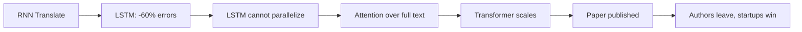

## Why this episode matters

No other episode poses the question this cleanly: what do you do when your own research lab invents the thing that could kill your monopoly? Google had 90 percent of search, the best AI talent ever assembled, invented the transformer, published it for free, watched its people leave to commercialize it, and then had to decide whether to go all-in on AI at the risk of its cash machine. This episode is the innovator's dilemma with real names, real numbers, and no resolution yet. You also get the full prehistory: how Google Brain started, why the TPU exists, and Waymo's 100-million-mile grind.

This is the third part of Acquired's Google series (Part I is Episode 5 of this track). It assumes the search monopoly story and picks up the AI thread.

## The story

### The dilemma, stated plainly

Ben opens with a thought experiment. Imagine a profitable monopoly: 90 percent share of a giant market, huge margins, deep lock-in. The US government agrees it is a monopoly. Then your own scientists invent something that, combined with your older inventions, makes a product better than your current one for most purposes. Your scientists published the research openly, out of benevolence. Startups are commercializing it fast.

Do you rebuild your whole product around the new invention? The catch: you have no idea how to make the new product as profitable as the old one.

That is Google in 2025. The invention is the transformer, from Google Brain's 2017 paper "Attention Is All You Need." OpenAI, Anthropic, and Nvidia's all-time highs all depend on it. And Google published it.

Figure 1. The dilemma. AI Podcast Curriculum, ep04 (Google Part III: The AI Company, 2025-10-06). Shell 1. Show the toy. Source: original toy, from episode claims.
| Dimension | Old product: Search | New product: AI |
|---|---|---|
| Market share | ~90%, government-defined monopoly | Not 90% of anything |
| Profitability | Best business in history | Unknown |
| Invented by | Google, 1998 | Google Brain, 2017 |
| Commercialized by | Google | Startups founded by ex-Googlers |

### Larry always thought it was an AI company

The AI thread goes back to the founding. Larry Page always described Google as an artificial intelligence company. His father was a computer science professor who did his PhD in machine learning at the University of Michigan, when AI was deeply unfashionable.

In late 2000 or early 2001, Google engineer Urs Hölzle had lunch with Ben Gomes and a new hire, Noam Shazeer. Noam also had a machine learning PhD. The company was already accumulating the rare people who took the field seriously.

The 2003-2013 decade was the hit factory: Gmail, Maps, and a run of products no company has matched in a ten-year span. Then, strikingly, about ten years with no new famous products until Gemini. The episode treats that gap as part of the story: the company that could ship anything stopped shipping, right as its research lab produced the most important invention in decades.

### Google Brain: how the talent assembled

The institutional history matters because it explains the exodus later.

2007: Larry Page hires Sebastian Thrun from Stanford, part-time then full-time, to work on machine learning applications. Thrun ran Stanford's AI lab (SAIL). His model: bring professors in as contractors, part-timers, or interns, and let them keep their academic posts. Geoff Hinton joined as, technically, a summer intern around 2011-2012. He was about 60 years old.

2010-2011: Andrew Ng, spending a day a week on Google's campus, bumps into Jeff Dean. Dean describes the language-model work. Ng describes Stanford's work. They found Google Brain in 2011.

2012: AlexNet. The Toronto team buys two Nvidia GeForce GTX 580 gaming cards off the shelf, rewrites its neural net in CUDA, and wins the ImageNet competition with a 15 percent error rate against the previous best of 25 percent. A 40 percent improvement in one year, on consumer hardware. Jensen Huang calls it the big bang of AI, and the episode agrees: it showed everyone that two gaming cards could overturn decades of computer vision.

Google's response was money. The company ordered 40,000 GPUs from Nvidia for 130 million dollars. Finance wanted to kill it. Larry Page personally approved it: the future of Google is deep learning. Context: Nvidia's total revenue was 4 billion dollars and its market cap was 10 billion. One order was over 3 percent of Nvidia's revenue. Ben's observation: Google handed Nvidia the tell that neural networks were not a research toy but a business-grade investment.

The DNNResearch auction: four bidders chased Hinton's lab, including DeepMind. The researchers chose Google and stopped the bidding at 44 million dollars: "This is more than enough money. We are going with you."

### DeepMind: the one that got away, then didn't

DeepMind was founded as an AGI startup. Peter Thiel, after a talk, invited them to pitch Founders Fund the next day. Founders Fund led the seed round: about 2 million dollars. In late 2013, Elon Musk called Demis Hassabis and offered to buy the company on the spot with Tesla stock. Tesla's market cap was about 20 billion then. The stock has run about 70 times since. DeepMind declined, partly because Musk wanted them working on Tesla autonomous driving and they did not want that.

Google acquired DeepMind in 2014. The episode's framing: the fourth bidder in the DNNResearch auction was itself acquired by Google. The talent concentration became total.

### The TPU: why Google builds its own chips

Definition: a TPU (tensor processing unit) is Google's custom chip for neural networks. It does one thing, matrix multiplication, extremely efficiently.

The core insight is reduced precision. Neural networks do not need exact arithmetic. The TPU takes a number like 4586.8272 and rounds it to 4586.8, or even 4586. Less precision means less silicon per operation, which means more operations per chip, which means Google can scale its data centers without doubling its footprint.

The tradeoff: a TPU cannot do graphics or general GPU workloads. It is useless for anything but neural nets. Google accepted that because its data centers run neural nets at planetary scale. The TPU is the only scaled deployment of AI chips in the world besides Nvidia GPUs, and it makes Google the only company with both a frontier model and its own AI chip. Someone in Ben's research put it as a rule: without a frontier model or an AI chip, you are a commodity in the AI market.

Figure 2. The TPU trade. AI Podcast Curriculum, ep04 (Google Part III: The AI Company, 2025-10-06). Shell 1. Show the toy. Source: original toy, from episode claims.
| Axis | General chip (GPU) | TPU |
|---|---|---|
| Arithmetic | Exact (4586.8272) | Rounded (4586) |
| Workload | Any: graphics, compute | One: matrix multiplication |
| The bet | Generality | One workload at planetary scale |

### The parallelization wall: why LSTMs had to go

The technical story is the episode's centerpiece, told as a chain of failures.

Google Translate was the test bed. Jeff Dean took its training time from 12 hours to 100 milliseconds. It became, in the episode's phrase, the first large language model used in production: it predicted search queries as you typed.

The team rebuilt Translate on recurrent neural networks, throwing away the old codebase wholesale. Big improvement. But RNNs forgot things too quickly: their effective context window was short. The fix was LSTMs (long short-term memory networks), which keep a persistent memory as they process text. In 2016, LSTMs cut Translate's error rate by 60 percent.

The problem: LSTMs are computationally intense and parallelize poorly. Everything post-AlexNet pointed toward parallelization as the future. So a Google Brain team searched for an architecture with LSTM-like memory that could parallelize.

### The attention idea: read everything first

The idea, from researcher Jakob Uszkoreit: broaden attention. Instead of focusing on the immediate words, tell the model to pay attention to the entire text, then predict the next word from the whole context. This is how professional human translators work: read everything first, understand the passage, then translate with full context in mind. It needs enormous compute, but it parallelizes beautifully.

They called it the transformer. Two reasons: it literally transforms a chunk of information, and they loved Transformers as kids.

### The rewrite and the scaling: Noam's version wins

Noam Shazeer, the lunch-table PhD from 2001, joined the project. Before him, the transformer implementation existed but did not beat LSTMs. Noam rewrote the entire codebase from scratch ("pulled a Jeff Dean"), and the transformer crushed the LSTM system. Bigger models kept getting better. It scaled.

Greg Corrado, a Google Brain founder, told Ben the elegance was suspicious: "This can't work. It is too simple. Transformers are barely a neural network architecture." His pattern from the lab: the right solution is usually the simplest and most efficient one, the way evolution favors energy efficiency. The episode connects this to Rich Sutton's 2019 essay "The Bitter Lesson": researchers keep believing clever algorithms win, but in field after field, the scalable architecture plus more data plus more compute wins.

Within a year, the team built BERT, one of the first large language models. The episode corrects a false narrative: Google did plenty with the transformer. BERT and MUM went into search quality and moved the needle on query comprehension. What Google did not do was treat it as a wholesale platform change.

### The publication and its cost: the paper that left the building

Then the fateful decision: publish. "Attention Is All You Need," a nod to the Beatles song, went out to the world. By 2025 it had over 173,000 citations, the seventh most cited paper of the 21st century, with every paper above it much older. Within a couple of years, all eight authors had left Google for AI startups, including OpenAI. Noam founded Character AI.

Ben's verdict: one of the greatest decisions ever for humanity, and possibly the worst corporate decision ever for Google. It gave OpenAI the opportunity to build the next Google.

Figure 3. The talent exodus. AI Podcast Curriculum, ep04 (Google Part III: The AI Company, 2025-10-06). Shell 1. Show the toy. Source: original toy, from episode claims.
| Asset | Before (2017) | After (by 2019) |
|---|---|---|
| The 8 transformer authors | At Google Brain | 0 at Google; startups incl. OpenAI |
| Noam Shazeer | On the project | Left 2021, founded Character AI |
| LaMDA | Internal chat interface | Not shipped; ChatGPT won the release |

Figure 4. The transformer chain. AI Podcast Curriculum, ep04 (Google Part III: The AI Company, 2025-10-06). Shell 3. Apply the one rule. Source: original toy, from episode claims.

### OpenAI: Google's talent, Microsoft's money

The episode tells OpenAI's early history as Google's shadow. The original pledge: 1 billion dollars from Elon Musk, Sam Altman, Reid Hoffman, Jessica Livingston, and Peter Thiel. Only about 130 million was actually collected.

In July 2018, at the Sun Valley conference, Sam Altman and Satya Nadella hashed out a 1 billion dollar investment: cash plus Azure credits, in exchange for access and an exclusive license. OpenAI created a captive for-profit, OpenAI LP, controlled by the nonprofit. Reid Hoffman joined the board.

Why Microsoft was the perfect partner: not just money, but Azure. OpenAI in 2018 could not buy GPUs and build data centers. It needed a cloud. The only non-Google options at scale were the two Seattle clouds, and Microsoft wanted in. Ben notes the Easter egg that AWS may have been in OpenAI's earliest nonprofit round.

Then the ChatGPT moment: November 30, 2022. One million users in under a week. Thirty million by year end. One hundred million by January 2023. Microsoft announced another 10 billion dollars that same month.

Google's internal timeline is the painful mirror. LaMDA, its conversational model, had an internal chat interface. Noam Shazeer advocated releasing it, left in 2021, and founded Character AI. Google's public release was AI Test Kitchen in May 2022, which did predate ChatGPT but was a sandbox, not a product. After ChatGPT, Code Red went out in December 2022, and Bard launched rushed. In 2024, Google paid 2.7 billion dollars in a licensing deal with Character AI that brought Noam back. Ben's phrase: Larry and Sergey decided that competing seriously required Noam back, so they wrote a blank check.

### Waymo: the 100-million-mile grind

The self-driving story starts with the DARPA Grand Challenge: 2004, a 132-mile desert course, 1 million dollar prize authorized by an act of Congress. Zero of 100 teams finished. In 2005, with the prize doubled, they did.

Sebastian Thrun's team set the "Larry 1000": 1,000 miles of California's hardest driving, from Tahoe to Lombard Street to Highway 1 to the Bay Bridge. The project started in 2009 with about a dozen people. Within 18 months they had something real.

Milestones: 2013, convolutional nets for perception, right as the 40,000 GPUs arrived. 2016, Waymo becomes its own Alphabet company. 2017, transformer learnings folded into prediction and planning. March 2020: 3.2 billion dollar raise. October 2020: the first public commercial rides with no human behind the wheel, in Phoenix, eleven years after the start.

Today: five cities (Phoenix, San Francisco, Los Angeles, Austin, Atlanta), hundreds of thousands of paid rides per week, over 100 million driverless miles growing at 2 million a week, 10 million paid rides on a 2,000-vehicle fleet. Tokyo is next. The lesson Ben draws: slowly, then all at once.

The economics: the CDC put 2022 US crash costs at 470 billion dollars. Waymo's data suggests roughly a 10-times crash reduction. The hosts note the 10 to 15 billion dollars Waymo burned is, in their words, "one year of Uber's profits."

Figure 5. Waymo's grind. AI Podcast Curriculum, ep04 (Google Part III: The AI Company, 2025-10-06). Shell 2. Count the toy. Source: original toy, from episode claims.
| Year | Milestone |
|---|---|
| 2004-05 | DARPA challenge: 0 finishers, then success |
| 2009 | "Larry 1000" project starts, ~12 people |
| 2013 | CNNs for perception |
| 2016 | Waymo becomes Alphabet company |
| 2020 | First driverless commercial rides (Phoenix) |
| 2025 | 100M+ driverless miles, 5 cities, Tokyo next |

### Gemini and the threading of the needle

In mid-2023, Sundar Pichai made two decrees: merge Brain and DeepMind into one AI team, and standardize the whole company on one model, Gemini. Gemini was announced in May 2023 as multimodal from birth: one model for text, images, video, and audio. Early public access shipped in December 2023, six months after announcement. Gemini 1.5 (February 2024) brought a 1-million-token context window, far larger than anything else. Gemini 2.0 (February 2025), 2.5 Pro (March 2025, GA in June). In March 2025, google.com gained AI Mode, a chatbot view of search, with Google split-testing auto-enrollment. Ben calls the shipping cadence "Nvidia pace."

The business underneath, per the episode: 370 billion dollars in trailing-twelve-month revenue, 140 billion in earnings, more profit than any tech company on earth (only Saudi Aramco earns more). The core business grew 5 times since 2016. Market cap crossed 3 trillion dollars in September 2025, fourth behind Nvidia, Microsoft, and Apple. From the November 2021 peak of 2 trillion, the stock had halved within a year on the "Google is slow" narrative. It recovered by doing the work.

Two more assets. Google Cloud: Thomas Kurian, the former Oracle president, was hired in late 2018 to teach Google the enterprise. Revenue went from 13 billion (2020) to 26 billion (2022) to profitability in 2023 to a 50-billion-plus run rate growing 30 percent, the fastest-growing major cloud, up 5 times in five years. Subscriptions: 150 million subscribers growing nearly 50 percent yearly, with premium AI features on the 20-dollar tier.

And the antitrust irony: the episode notes the DOJ case's downstream effect is that Google is not broken up. The AI wave, by creating credible competition, saved the monopoly's structure.

### The value-capture problem

The bear case, which Ben states carefully: Google makes roughly 400 dollars per user per year in the US from a free product. Who pays 400 dollars a year for AI? A thin slice of the population. When Google launched in 1998, AdWords followed within two years, and the product was immediately obviously superior. Today there are four or five great AI products, Google's was initially obviously inferior, and it owns 90 percent of search but nowhere near 90 percent of AI.

The scale numbers are staggering anyway. In April 2024, Google served 10 trillion tokens a month across its surfaces. In April 2025, nearly 500 trillion: 50 times in one year. By June 2025, 980 trillion, approaching a quadrillion. Training costs amortize over an ocean of inference.

Figure 6. The token scale explosion. AI Podcast Curriculum, ep04 (Google Part III: The AI Company, 2025-10-06). Shell 2. Count the toy. Source: original toy, from episode claims.
| Month | Tokens served |
|---|---|
| April 2024 | 10 trillion |
| April 2025 | ~500 trillion (50x in one year) |
| June 2025 | 980 trillion, near one quadrillion |

Ben runs the moat analysis (Hamilton Helmer's seven powers). Scale economies are the biggest. Branding is net positive (people trust Google more than unknown AI companies). Distribution and search are a cornered resource. Switching costs are low today but will come with personal AI wired into calendar and mail. No network economies yet. No counterpositioning (Google is being counterpositioned). No process power unless it invents the next transformer reliably. Telling, Ben says: in search, Google had nearly all seven. In AI, it has three or four.

Figure 7. Seven powers: search era versus AI era. AI Podcast Curriculum, ep04 (Google Part III: The AI Company, 2025-10-06). Shell 2. Count the toy. Source: original toy, from episode claims.
| Power | Search era | AI era |
|---|---|---|
| Scale economies | Yes, the biggest | Yes, the biggest |
| Branding | Yes | Net positive |
| Distribution / cornered resource | Yes | Yes, the search box |
| Switching costs | Yes | Later, via calendar and mail |
| Network economies | Yes | Not yet |
| Counterpositioning | Yes | No, being counterpositioned |
| Process power | Yes | Unproven |

The closing question has no answer. Larry and Sergey have been quoted saying they would rather go bankrupt than lose at AI. But if AI is a worse business than search, which wins: the mission (organize the world's information) or the franchise (the most profitable company in the world)? If it were purely the mission, Google would flip entirely to AI Mode today. It has not. David's verdict: Google is threading the needle better than any big tech company, rapid but not rash, and Sundar deserves credit, especially given where things stood five years ago.

## Questions and answers

> [!QA]
> Q: What is the innovator's dilemma in Google's case, precisely?
> A: Google owns 90 percent of search and earns the best profits in tech history. Its own lab invented the transformer, which enables products better than search for many purposes. Commercializing it fully means risking the search monopoly before anyone knows how to make AI as profitable. So Google moves carefully while ex-employees move fast. The dilemma is not whether AI matters. It is whether the mission or the franchise wins.
> Follow-up: What would "mission wins" look like? Google.com becomes AI Mode by default tomorrow, search ads shrink, and the company bets the franchise that AI monetizes. What stops them is not technology. It is 140 billion dollars in annual earnings.

> [!QA]
> Q: Why did publishing the transformer paper matter so much?
> A: The paper gave every startup the recipe. It has 173,000+ citations, and within two years all eight authors had left Google, several for OpenAI. Google kept the prestige and lost the people. The publication was optimal for humanity and costly for Google: it handed competitors the architecture and the talent pipeline at once.
> Follow-up: Should Google have kept it secret? Argue both sides. Secrecy might have kept the lead but violated the research culture that attracted the talent in the first place. You cannot have the lab without the publishing.

> [!QA]
> Q: Explain the transformer idea like I am new.
> A: Older language models read text word by word and forgot earlier words quickly. LSTMs added a memory but could not use many processors at once. The transformer tells the model to look at the entire text at once, decide which parts matter for each word (attention), and predict from the full context. Looking at everything is expensive but splits perfectly across processors, and bigger models keep getting better.
> Follow-up: Why did simplicity win? Greg Corrado's rule from the lab: the right solution is usually the simplest and most efficient, the way evolution favors energy efficiency. "This can't work, it is too simple" is often the signal you are close.

> [!QA]
> Q: Why does Google build its own AI chips?
> A: Because at Google's scale, exact arithmetic is wasteful. The TPU rounds aggressively (4586.8272 becomes 4586) and does only matrix multiplication, which lets Google serve AI without doubling its data centers. The strategic result: Google is the only company with both a frontier model and its own AI chip, which one researcher called the two things you need to avoid becoming a commodity.
> Follow-up: What is the price of specialization? A TPU cannot do graphics or general computing. Specialization is a bet that your workload is big enough to deserve its own silicon. At a quadrillion tokens a month, it is.

> [!QA]
> Q: What are Google's real advantages in AI, ranked?
> A: Per the episode's moat analysis: (1) scale economies, amortizing training over ~1 quadrillion tokens a month. (2) Distribution, the search box as a cornered resource. (3) Brand trust versus unknown AI startups. (4) Future switching costs once AI integrates with calendar and mail. Missing: network economies, counterpositioning, and proven process power.
> Follow-up: Which advantage is most fragile? Distribution: it depends on the search box remaining the front door to the internet. If AI Mode or agents replace the box, the cornered resource moves.

> [!QA]
> Q: What does Waymo's history teach about hard technology?
> A: That the timeline is a decade, not a demo. DARPA 2004: zero finishers. Google's project 2009: a dozen people. First driverless commercial rides 2020: eleven years later. One hundred million miles 2025: sixteen years later. "Slowly, then all at once" is not a slogan. It is the schedule.
> Follow-up: Apply it. Pick an AI capability people call "just around the corner." Add the Waymo ratio: a decade from serious start to scaled deployment. What date do you get?

> [!QA]
> Q: Why did all eight transformer authors leave, and what does it teach?
> A: Google treated the transformer as a research result to publish and a feature to add to search. Startups treated it as a company to build. Ambitious researchers follow the steepest mission gradient. The lesson: a lab that publishes everything but commercializes cautiously will train its competitors' founders.
> Follow-up: How would you keep them? You cannot pay your way out of a mission gap. The episode's answer is Noam Shazeer: a 2.7-billion-dollar licensing deal to bring one researcher back. That is the market price of the lesson.

## Memory aids

- The dilemma in one line: 90 percent of search, 0 percent of the future, invented by us.
- 173,000 citations, 8 authors, 0 still at Google (within two years).
- The TPU rule: round aggressively, do one thing, own the silicon.
- Larry's 130-million-dollar override: "the future of Google is deep learning." Finance wanted to kill it.
- The Bitter Lesson: scalable architecture plus data plus compute beats clever algorithms.
- Never-confuse pair: BERT/MUM (Google used the transformer plenty as a feature) versus the platform bet (treating it as the new foundation, which Google did not do).
- Trap card: "Google did nothing with the transformer." False. It shipped BERT within a year and improved search with it. What it did not do was bet the company on it.
- The number: 10 trillion to 980 trillion tokens a month in 14 months. The scale over which Google amortizes everything.

## How to imbibe this

- This week: find your own innovator's dilemma. Name one thing you do that is profitable but declining, and one thing you have invented (or learned) that could replace it but pays nothing yet. Write both down with numbers. Notice which one gets your calendar time.
- Catch yourself: the next time you sit on an idea because publishing or sharing it feels generous but risky, ask the transformer question: am I optimizing for humanity or for my franchise? Both are legitimate. Name which one you are choosing.
- Behavior change per major idea:
  - The dilemma: schedule one hour a month for the thing that could kill your current income. Protect it like Larry's GPU order against Finance.
  - Elegance: when a problem feels thorny, ask what the embarrassingly simple solution would be. Write it before the clever one.
  - Bitter Lesson: when choosing tools, prefer the scalable boring one over the clever fragile one. Data and compute compound. Cleverness does not.
  - Waymo schedule: take any "two years away" technology claim and apply the 10-to-16-year grind ratio. Write the honest date.
  - Value capture: for anything free you love, compute the revenue per user per year. Ask who pays and why. If you cannot answer, you are the product or the subsidy.
- Monthly: reread your "mission versus franchise" note. If every decision favored the franchise for a year, say so out loud. That is how incumbents lose.

## Think it yourself

The arc steepens: these drills ask for judgments with no clean answer.

1. Fermi: Google serves ~1 quadrillion tokens a month. If inference costs a tenth of a cent per thousand tokens, what is the monthly inference bill? Compare it to 140 billion dollars in annual earnings. What does the ratio tell you about why scale economies decide this market?
2. Argue both sides: Google should flip google.com to AI Mode by default tomorrow. Argue for the mission. Argue for the franchise. Then decide, and name the single fact that would change your mind.
3. Journal: "What am I not publishing?" Write about knowledge you hoard because it feels like an edge. Would publishing it build the ecosystem around you (Open Compute logic) or arm your competitors (transformer logic)? How do you tell the difference?
4. First principles: derive the TPU from scratch. You run a data center doing one computation billions of times a day. List every precision and generality you can throw away. What is left? That is your chip.
5. Observe: find a company living Ben's "seven powers" gap: strong in its old market's powers, weak in the new one's. Score it 0-7 on both. Where would you invest: defending the old powers or buying the new ones?

## Skills you can now use

- Diagnose an innovator's dilemma: map the old product's share and profit against the new product's, and ask whether leadership serves the mission or the franchise.
- Price a platform decision: compute tokens or users over which fixed costs amortize, and compare the amortization math across competitors.
- Evaluate a research lab: check whether breakthroughs become products or papers, and track where the authors go. Author departures are the leading indicator.
- Apply the elegance test: when two architectures compete, bet on the simpler one that parallelizes, and distrust the clever one that does not.
- Schedule like Waymo: convert any demo into a deployment date by adding the grind ratio, and plan budgets against the honest date.

## Go deeper

- Rich Sutton's "The Bitter Lesson" (2019), the essay the episode invokes: http://www.incompleteideas.net/IncBits/TheBitterLesson.html
- "Attention Is All You Need" (Vaswani et al., 2017), the paper itself: https://arxiv.org/abs/1706.03762

## Figure audit

| Unit | Claim | Before | After | Figure | Medium | Source |
|---|---|---|---|---|---|---|
| u01 | Monopoly faces its own invention | 90% search, best profits | Transformer enables better products | fig1 | table | episode claims |
| u02 | TPU trades generality for scale | Exact arithmetic, general chips | Rounded precision, one workload | fig2 | table | episode claims |
| u03 | Transformer solved the parallelization wall | RNN forgets, LSTM cannot parallelize | Attention over full text, scales | fig4 | mermaid | episode claims |
| u04 | Talent assembled then scattered | Everyone at Google | Founders of OpenAI, Character AI | fig3 | table | episode claims |
| u05 | Waymo's decade-plus grind | 0 DARPA finishers | 100M driverless miles | fig5 | table | episode claims |
| u06 | Moat powers in AI vs search | 7 of 7 in search | 3-4 of 7 in AI | fig7 | table | episode claims |
| u07 | Token scale explosion | 10T/month | ~1Q/month in 14 months | fig6 | table | episode claims |

All 7 units mapped. No blank cells.
