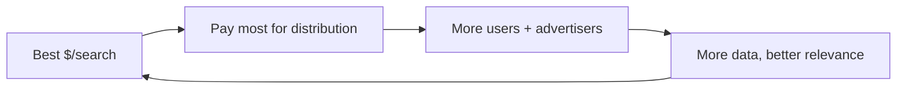

## Why this episode matters

This is the foundation the whole track stands on. Episode 4 asked what Google should do about AI. This episode explains what there is to protect: the best business in human history, built from a graduate-school insight about academic citations. No other episode gives you the complete mechanics of the AdWords auction, the bet-the-company AOL deal, or the playbook Ben distilled from the entire story. The through-line: Google was not the first search engine. It was the last. And the reasons it won are the same reasons its moat is now under attack.

## The story

### Two ambitious kids, not bumbling academics

The episode opens by killing a myth: Larry Page and Sergey Brin were not accidental billionaires. Everyone the hosts interviewed described them as hugely ambitious, for the business as well as the product. Larry at age 12: "I knew I was going to start a company eventually. I wanted to make the world better. In order to do that, you need to do more than just invent things." And later: "You need to use business and entrepreneurship to make these things real. It is not enough just to invent them."

Larry was born in March 1973 in Lansing, Michigan, to two computer science academics. His father Carl did his PhD at the University of Michigan; his mother Gloria also earned a CS degree there and taught programming. In 1979-80, when Larry was six, the family spent a sabbatical year at Stanford, and early Silicon Valley made its impression. His older brother Carl Jr., nine years older, worked at Microsoft and Mentor Graphics, then co-founded eGroups, which Yahoo bought for about 400 million dollars as Yahoo Groups.

Sergey was born a few months later in 1973. The two met at Stanford in the fall of 1995, argued constantly, and became true partners. Ben's line: one plus one equaled 100. The hosts compare the partnership's rarity to Jensen, Chris, and Curtis at Nvidia, and note that even Warren Buffett and Charlie Munger were never both full-time in one company.

The timing: from 1993 to 1996, the web grew from 130 sites to over 600,000, about 723 percent a year for four years. Larry and Sergey were watching the largest communication phenomenon in history compound in real time, from inside Stanford's computer science department.

### PageRank: links are citations

The core insight came from an old field: the study of academic citations. Scholars had long known how to rank papers by who cites whom. Larry and Sergey's leap: a hyperlink is the exact same thing as an academic citation. A link from page A to page B is page A's vote that B matters.

But links carry something citations do not: anchor text. When someone links to you, the clickable words they choose are usually a better description of your page than anything you wrote about yourself. Google's ranking combined the citation graph (PageRank) with the anchor-text descriptions, and it worked. The technical underpinnings were brutal: crawling the whole web, storing the graph, computing the scores. By 2007, Google used 200 different signals to rank a query, but the citation idea was the seed.

Figure 1. PageRank as citations. Source: episode.

```ascii
Academia:   paper A cites paper B  ->  B matters
Web:       page A links page B     ->  B matters
Bonus:     anchor text = author's description of B (free metadata)
Result:    rank by the citation graph, describe by anchor text
```

Larry wrote the first PageRank implementation and crawler in Java. It was super buggy and barely worked. They tried to sell the technology to Yahoo for 1 million dollars. Yahoo said no.

The episode stresses two underappreciated points. First, ranking was only one of three innovations; the others were speed and the clean page. Second, Google's aversion to paid inclusion, holding out against polluting organic results with paid placement, served it enormously. Trust in the results was the product.

### The seed round: a $100,000 check to a company that did not exist

At 8 a.m. one morning, Larry and Sergey demoed Google to Andy Bechtolsheim at his house in Palo Alto. Andy was in a hurry. He loved it. He wrote a check for 100,000 dollars made out to "Google Inc." Google Inc. did not exist. No documents, no valuation. Andy told them to figure it out. That check forced the company's founding.

The full seed round: 1 million dollars at a 10 million post-money valuation, from four investors. Andy Bechtolsheim, Dave Cheriton, Ram Shriram (250,000), and Jeff Bezos. Bezos asked Ram what he was in for, heard 250,000, and said he was in for 250,000 (the episode quotes 252,000 in one telling). A quarter of Google's seed round was the Amazon CEO. Ben's math: if Bezos never sold, the stake is worth about 20 billion dollars today. If he sold at the IPO, the 250,000 became roughly 200 million.

By spring 1998, google.com was doing 10,000 queries a day, spreading virally through Stanford. The first revenue was gloriously unglamorous: a 20,000-dollar enterprise search deal with Red Hat.

The Series A: 25 million dollars at a 100 million post-money valuation from Sequoia and Kleiner Perkins. Wild for the time, even in the bubble. A competing 150-million term sheet arrived mid-negotiation. They stayed with Sequoia and Kleiner.

### The portal deals that bought survival

In June 2000, as the dot-com bubble burst (NASDAQ peaked March 2000), Google signed Yahoo: Google would power all of Yahoo's organic search with "Powered by Google" branding, and Yahoo would invest 10 million dollars. Traffic doubled to 14 million searches a day on day one. The deal saved the company through the dot-com winter.

2001 numbers: 86 million dollars in revenue, 10 million in profit. Profitable in the nuclear winter of the internet economy, almost entirely on portal deals and the old ad system.

### Stealing the business model: GoTo, Overture, and the auction

The business model came from Bill Gross's GoTo, later Overture. The idea: paid search results, sold through a self-serve website with a real-time auction. Highest bid wins the top spot. GoTo did 100 million dollars in revenue in its first year. When Gross demoed it at TED in 1998, the audience booed; the web was still an academic utopia, and paid results felt like sacrilege. (OpenText had tried paid results in 1996 and been kneecapped by the same sentiment.)

Google's version was better in the way that mattered. The episode walks through the auction's beauty: it is not just highest bid wins. Google ranks ads by bid times expected click-through rate, and charges per click. This aligns every incentive. Advertisers bid only on relevant keywords and write relevant ads, because relevance lowers what they pay. Users see ads they might actually want. Google maximizes its expected value per search. Ben calls it a harmonious system: the algorithm literally maximizes Google's expected revenue while making ads better for everyone.

Yahoo ended up buying Overture for 1.6 billion dollars. At one point paid search was about 75 percent of Yahoo's revenue. When Google offered to buy Overture and the board refused to give up 10 percent of a 2-billion-dollar company to a zero-revenue startup, Ben's comment stands: there is almost zero chance Google becomes Google if that deal happens.

Figure 2. The auction's alignment. Source: episode.

| Player | Incentive under Google's auction |
|---|---|
| Advertiser | Bid on relevant keywords, write relevant ads, pay less per click |
| User | See ads matched to intent, not just to money |
| Google | Expected value per search is maximized by the ranking formula |

### The AOL bet: $100 million Google did not have

By mid-2002 the new AdWords model was working. Google went to AOL, with 34 million users, whose search ran on Inktomi. The deal Google signed: a 100-million-dollar revenue guarantee to AOL plus 85 percent revenue share, plus a 22-million-dollar investment.

Google did not have 100 million dollars. Sergey Brin's quote: "We could have gone bankrupt. This is quite literally Google betting the company." They were certain the ads would perform, because their monetization per search was the best in the industry.

It worked beyond anyone's model. AOL made 35 million dollars in the second half of 2002 alone, then 200 million in 2003, blowing through the guarantee. Google took the inventory straight from Overture and became a major paid-listings player overnight.

Around the same time, Yahoo offered 3 billion dollars to buy Google. Google countered: how about 5 billion, with the unspoken punchline being that at that price it would be Google buying Yahoo. No deal. It was the last serious acquisition attempt.

The distribution logic behind all of it: whoever monetizes each search best can pay the most for distribution. Google paid everyone to bundle the Google Toolbar: Adobe, RealNetworks, WinZip. Average revenue per user went from 8 dollars toward 10, 20, 30. Toolbar users were stickier. Google Earth shipped with the toolbar bundled and more than paid for itself. The flywheel: better monetization buys more distribution, which brings more users and advertisers, which improves monetization.

Figure 3. The distribution flywheel. Source: episode.



### AdSense and the end of trade-offs

In early 2003, Google launched AdSense: ads on other people's websites, matched to page content. By year end it was doing over 1 million dollars a day. The idea came from Gmail prototyping: Paul Buchheit, in his 20 percent time, built search over his Unix mail folder, then tried showing ads from Google's database against email content. Larry and Sergey saw it and asked: does this work on websites too?

The numbers: 2002 was 440 million in revenue and 185 million in profit. 2003 exploded to 1.5 billion in revenue and about 350 million in operating income. AdWords stayed an 85-percent gross margin business; AdSense kept only about 20 percent but added half a billion in a year.

Ben's line: after roughly the end of 2002, Google never faced a capital constraint again. Every idea could be funded. The business flipped from making trade-offs to funding everything.

International mattered too: Omid Kordestani spent a year on planes building country teams as tiny startups. International went from 18 percent of revenue to 22 to 29 percent, toward half the business today. China ran until the 2010 withdrawal over censorship.

### The IPO and the Gmail teaser

The 2004 IPO used a Dutch auction. The indicative range was 108 to 135 dollars a share. It priced at 85: a 23-billion-dollar market cap, raising 1.7 billion. It popped to 100 the same day, up 18 percent, then nearly 5-timed in 16 months. Roughly 100 times since the IPO. The auction was supposed to price perfectly. It did not.

The episode's sting: at recording, Alphabet traded at a 20 price-to-earnings ratio versus 35 for Amazon, 37 for Microsoft, 46 for Nvidia, 30 for Apple, 27 for Meta. Revenue grows as fast as anyone's. The market is pricing a bleaker future. "Never mind that Google invented AI and published the transformer paper." That is Episode 4's story.

The teaser for Part II: Gmail launched April 1, 2004, a terrible date given Google's history of April Fool's jokes. One gigabyte of free storage when Yahoo and Hotmail offered two megabytes. Web-based, with Google search across all your mail. The strategic point Ben makes: what a great reason to be logged into Google, and what a great entry point to attach more of your life to search ads.

### The playbook: why Google worked

Ben's seven-point playbook, the episode's capstone:

1. The best original algorithm insight. PageRank gave the best organic relevance, which made the product fast, clean, and delightful.
2. The best execution of the search advertising model. The auction plus click-through-rate relevance is a beautiful, harmonious system.
3. Clever infrastructure advantages. First-principles engineering, inventing what did not exist.
4. Hiring only world-class people. During the crash, Google could hire anyone.
5. Culture: insanely big thinking by inexperienced, untainted people, matched with top PhDs, always asking "will this work at scale?"
6. Self-reinforcing data network effects. More users and advertisers make the product better, which brings more users and advertisers.
7. A mission that lasted: organize the world's information. Not too broad, not too narrow, altruistic on the surface, covering the best business ever underneath.

David adds the quintessence: these are economies of scale that do not just cut costs as you grow, they increase your revenue as you grow. And the meta-lesson: 1996 to 2002 rhymes with 2021 to today. Study how search monetization enabled distribution, and you have the template for how AI monetization will enable AI distribution. His provocative analogy: GoTo putting paid results in search was sacrilege in 1998. What would the equivalent be today? An LLM that tells you what advertisers paid it to tell you. People would go crazy. But should somebody try it?

## Questions and answers

> [!QA]
> Q: Explain PageRank like I am new.
> A: Scholars rank papers by citations: important papers get cited a lot. PageRank treats a hyperlink the same way: a link from page A to page B is A's vote that B matters. Pages with many votes from important pages rank highest. The bonus insight: the clickable words of a link (anchor text) are usually a better description of the target page than the page's own text, so Google used them as free descriptions.
> Follow-up: Why did this beat counting keywords? Keywords can be stuffed by the page owner. Inbound links and anchor text are written by other people, so they are much harder to fake. The ranking moved from what you say about yourself to what the web says about you.

> [!QA]
> Q: Why was Google's ad auction beautiful?
> A: Three aligned incentives. Advertisers pay per click and are ranked by bid times expected click-through rate, so relevance lowers their cost. Users see ads matched to their intent. Google's expected revenue per search is maximized by the same formula. Every player wants the same thing: the most relevant ad winning.
> Follow-up: Contrast it with GoTo's version. Highest bid won, period. That rewards money over relevance and degrades the product. Google's multiplication by click-through rate is the one-line difference between an auction and a good auction.

> [!QA]
> Q: Walk me through the AOL bet.
> A: In May 2002, Google promised AOL a 100-million-dollar revenue guarantee it did not have, plus 85 percent revenue share, to win 34 million users' searches from Inktomi. Sergey's line: "We could have gone bankrupt." AOL earned 35 million in half a year and 200 million the next year. Google took Overture's inventory and became a paid-search power overnight.
> Follow-up: When is a bet like this rational? When your monetization per unit is provably the best in the industry. Google knew its dollars-per-search beat everyone, so the guarantee was arithmetic, not hope.

> [!QA]
> Q: How did distribution actually work? Nobody advertises a search box.
> A: The toolbar. Google paid software companies (Adobe, RealNetworks, WinZip) to bundle the Google Toolbar with their installers. Average revenue per user climbed from 8 dollars toward 30, so the budget for buying distribution kept growing. Stickier users searched more, which funded more distribution. Nobody needed to see an ad for Google. Google was inside the software they already installed.
> Follow-up: What is the modern equivalent? Defaults. The search box that ships pre-installed, the assistant that answers first. Distribution is still bought; the currency just changed from toolbar bundles to default placements.

> [!QA]
> Q: Why did the IPO "fail" and then 100x?
> A: The Dutch auction was supposed to find the true price. Indicated range 108 to 135, priced at 85, popped 18 percent day one, 5-timed in 16 months. The mechanism underpriced because demand was misjudged. The 100x since is the business compounding, not the IPO mechanics. Price discovery on day one is noise; the flywheel is signal.
> Follow-up: What does the current PE of 20 tell you? The market believes the flywheel is under threat. Revenue growth matches peers, but the multiple says the future is bleaker. That discount is the AI fear, priced.

> [!QA]
> Q: What are "economies of scale that increase revenue," and why does it matter?
> A: Normal scale economies cut your costs as you grow. Google's went further: more users and advertisers made the product better (more data, more relevant ads), which grew revenue per user, which funded more distribution. Scale did not just make Google cheaper. It made Google richer per user.
> Follow-up: Name a business you know with only cost-side scale. Now ask what a revenue-side scale effect would look like for it. Most companies never find one. That is why Google's is special.

> [!QA]
> Q: What is the rhyme between 1998 and today?
> A: In 1998, paid results in search were sacrilege; by 2003 they were the best business ever. Today, an LLM that answers based on advertiser payment sounds outrageous. David's question: should somebody try it? The pattern is that the monetization everyone finds distasteful becomes the distribution engine for the next era, once the product is good enough that users accept the trade.
> Follow-up: Argue against trying it. What breaks? Trust in the answer is the whole product for an assistant, the way trust in results was the product for search. Paid answers might kill the thing they monetize. Decide where the line is.

## Memory aids

- Links are citations, anchor text is the description. That is the whole seed of Google.
- The check to a company that did not exist: 100,000 dollars, no documents, no valuation.
- Bezos bought a quarter of the seed round for 250,000 dollars. Math it: ~20 billion if held.
- The AOL guarantee: 100 million promised, 100 million not had. "We could have gone bankrupt."
- The auction formula: bid times click-through rate. Relevance is priced in.
- Never-confuse pair: PageRank (ranks organic results by the citation graph) versus AdWords (ranks ads by bid times relevance). One built trust, the other built the fortune. Confusing them misses why both were needed.
- Trap card: "Google won because it was first." It was nearly last. A dozen search engines existed. It won on relevance plus the auction plus distribution, in that order.
- The numbers: 86M (2001) to 440M (2002) to 1.5B (2003). The three-year detonation.

## How to imbibe this

- This week: find one thing you rank by self-description and re-rank it by what others say. Candidates: your resume (rewrite one bullet using only others' words about you), a vendor choice (ask users, not the vendor), a restaurant (reviews, not the menu). Feel the PageRank shift.
- Catch yourself: the next time you defend being first to something, stop. Ask whether you are Google (best, last, won) or AltaVista (first, lost). First is not a strategy.
- Behavior change per major idea:
  - PageRank: for your next decision, weight outside citations over inside claims. Write both lists.
  - The auction: design one incentive in your life so that doing the right thing is also the cheapest thing. That is the bid-times-relevance trick.
  - The AOL bet: before any big commitment, compute your dollars-per-unit versus the best alternative. If yours is provably best, the bet is arithmetic.
  - Distribution: list where your "users" actually come from. If the answer is hope, buy distribution the way Google bought toolbar bundles: pay for the default.
  - Never capital-constrained: notice when a constraint disappears in your work. The danger after the flip is funding everything, including bad ideas. Add a kill rule.
- Monthly: recompute your flywheel. What got better because it got bigger last month? If nothing, you have scale without the flywheel.

## Think it yourself

1. Fermi: Google went from 10,000 queries a day (spring 1998) to 14 million searches a day (June 2000, day one of Yahoo). What is the daily growth factor over those ~800 days? What does that imply about infrastructure planning? (Work it: 1,400x in 800 days is ~0.9% daily compounding. Miss capacity planning by a month and you are down.)
2. Argue both sides: Yahoo rejecting the 1-million-dollar PageRank purchase. Argue it was rational in 1998 (a directory company, no need). Argue it was the worst decision in business history. What information would have changed the call?
3. Journal: "What is my AdWords?" Write about the thing you do that monetizes best per unit of effort. Are you distributing it as aggressively as Google distributed search? If not, what is your toolbar bundle?
4. First principles: derive the ad auction from scratch. You have a search page and advertisers. Design the ranking formula. Start with highest bid. Find what breaks. Add the fix. You should arrive near bid times click-through rate on your own.
5. Observe: find a product whose "organic results" are polluted by paid placement. How does it feel versus Google's separation? Write the trust difference in one paragraph.

## Skills you can now use

- Explain any ranking system: separate what the owner says (gameable) from what others say (trustworthy), and weight accordingly.
- Design an aligned auction: multiply willingness to pay by a quality score so that quality lowers cost, and check that every player wants the same outcome.
- Size a distribution bet: compute your revenue per user, then compute the maximum you can pay per acquired user, then buy the default.
- Read a flywheel: test whether scale cuts costs only, or grows revenue per user too. Only the second is a Google-class moat.
- Date a bubble: map any "sacrilege" monetization (1998 paid search, today's paid answers) and ask what has to be true for it to become the business model.

## Go deeper

- John Battelle's "The Search" (the book Ben cites for the 130-to-600,000-sites stat): https://www.penguinrandomhouse.com/books/292517/the-search-by-john-battelle/
- Paul Buchheit on building Gmail (the 20-percent-time origin story): search his blog for the Gmail retrospective.

## Figure audit

| Unit | Claim | Before | After | Figure | Medium |
|---|---|---|---|---|---|
| u01 | Links are academic citations | Keyword counting | Citation graph plus anchor text | fig1 | ascii |
| u02 | Auction aligns all incentives | Highest bid wins (GoTo) | Bid times relevance (Google) | fig2 | table |
| u03 | Distribution flywheel | Best product, no distribution | Toolbar bundles fund growth | fig3 | mermaid |
| u04 | AOL bet arithmetic | No $100M, biggest deal ever | $35M in 6 months, $200M next year | text | table in Q&A |
| u05 | Revenue detonation 2001-03 | $86M, portal-dependent | $1.5B, never constrained again | text | list in Q&A |
| u06 | Seven-point playbook | "Best product won" | Algorithm, auction, infra, people, culture, data, mission | text | list |

All 6 units mapped. No blank cells.
