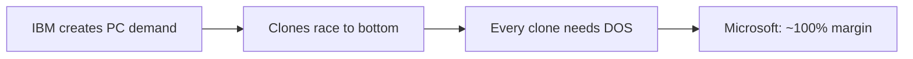

## Why this episode matters

Selling software is the best business model of all time, and this is the story of the company that invented it. No other episode shows you the actual mechanics: a $180,000 revenue cap that nearly killed them, a "best efforts" clause written by a lawyer's son that saved them, a $75,000 operating system bought from a neighbor, and a fixed-fee deal with IBM that transferred the most valuable monopoly in business into their hands. The through-line: Microsoft made itself the point of integration for an entire industry, then let everyone else do the scaling.

At recording (2024), Microsoft was worth over 3 trillion dollars, the most valuable company in the world, with 49 years of history. Acquired waited ten years to attempt the story.

## The story

### The household that bred a CEO

Bill Gates III, "Trey," was born in 1955 in Seattle. His father, Bill Gates Sr., came from Bremerton, served in the Army in World War II, then earned an undergraduate and law degree at the University of Washington in four years on the GI Bill. He co-founded the firm Preston Gates and Ellis, today K&L Gates, one of the world's largest law firms. He later joined Costco's board, started Seattle's Tech Alliance, and became a prolific angel investor.

His mother, Mary Maxwell Gates, was, in the episode's word, a force. From a banking family (National City Bank's founders), she joined nonprofit boards as a young woman: the Seattle Symphony, the Chamber of Commerce, Children's Hospital, the United Way. She was so effective that corporate boards recruited her: First Interstate Bank, KIRO television, Pacific Northwest Bell Telephone, the University of Washington Board of Regents, the national United Way board. She never worked full-time in a corporation and became one of the most powerful business people in the Pacific Northwest.

Young Bill grew up with CEOs, senators, and governors at the dinner table, absorbing business conversation nightly. At 13, he and his best friend Paul Allen discussed not whether but which company Bill would be CEO of someday. He was insanely competitive about everything.

### Lakeside: the teletype and the first business model

In 1968, the Lakeside mothers' club bought the school a teletype terminal and rented time on a GE PDP-10 downtown. Bill and Paul fell in. Their first venture, Traf-O-Data, analyzed traffic data. The key decision: instead of charging hourly for their time, they took a royalty on the revenue their software generated. Teenagers, inventing the software business model. They made over 10,000 dollars when average US household income was below 10,000.

### The Altair: code to the manual

In 1975, Popular Electronics put the Altair 8800 on its cover: a $397 computer kit from Ed Roberts's MITS. The next cheapest computer anyone could buy cost around $120,000. Paul saw the cover and knew: the microcomputer era had started, and it needed software.

They had no Altair. Paul wrote an emulator for the Intel 8080 chip on Harvard's PDP-10, working from the chip manual. Bill wrote the BASIC interpreter against the emulator in a few weeks. They were coding to a machine they had never touched, hoping the manual was right.

The partnership started at 60/40 (Bill/Paul), later 64/36. Bill's argument: Paul had taken a job and worked on the side. Bill was all in. Paul agreed.

The MITS contract had two fateful terms. First, Microsoft's lifetime revenue from MITS was capped at $180,000: effectively, Ed Roberts offered $180,000 for exclusive rights to everything. Second, the contract required MITS to use its "best efforts" to license and commercialize BASIC broadly, with failure as grounds for termination. Thank God, the hosts say, Bill's dad was a lawyer.

Reality: 1975 revenue was $16,000. 1976 was $22,000, less than Traf-O-Data money. MITS controlled sales, sat on licensing deals with NCR, GE, and Control Data (each worth ~$100,000), and turned most away. Then in May 1977, Pertec bought MITS for $6.5 million. Pertec figured it could handle "this kid." Ed Roberts later said it was like Roosevelt telling Churchill he could deal with Stalin.

Microsoft invoked the best-efforts clause, won free of MITS at the end of 1977, and could finally sell. Revenue that year: $381,000, nearly all of it in the last month. Bill bought a green Porsche 911 and collected speeding tickets around Albuquerque.

Figure 1. The MITS trap and escape. AI Podcast Curriculum, ep06 (Microsoft Volume I, 2024-04-22). Shell 1. Show the toy. Source: original toy, from episode claims.
| Term | Effect |
|---|---|
| Lifetime revenue cap: $180,000 | MITS owned the upside |
| "Best efforts" to commercialize | The escape hatch |
| MITS sits on deals | Microsoft starves: $22K in 1976 |
| Arbitration victory, end of 1977 | Freedom; $381K revenue |

### 1978-1980: the team assembles

Revenue: $1.3 million in 1978 (13 employees), $2.4 million in 1979 (25 employees). The company moved from Albuquerque to Seattle. In 1980, two pillars arrived: Steve Ballmer joined in June as employee number 30, and Charles Simonyi, from Xerox PARC, brought structured programming discipline.

Context the episode insists on: in 1980, IBM was the most valuable company in the world, worth $150 billion, bigger than all the oil companies. The IBM PC project, codenamed Project Chess, was Big Blue's skunkworks attempt to enter microcomputers in a year.

The technical opening: Intel's 8086, a 16-bit processor. With 16 bits you can represent 65,536 values and pass real data around at once, enough for business software. The 8-bit 8080 had 9 pins. The 8086 was a long rectangle with around 20. Moore's law was compounding invisibly underneath everything.

### The IBM deal: the best negotiation in business history

By August 1980, Microsoft and IBM were in serious talks. The whole 30-person company pivoted to Project Chess, a bigger team than IBM's own.

Microsoft needed an operating system for the 16-bit machine and had none. Tim Paterson at nearby Seattle Computer Products had written QDOS, the "quick and dirty operating system." Microsoft first licensed it, then paid another $50,000 for full rights to sell and license it indefinitely. Total changing hands: about $75,000. Microsoft did substantial work turning it into DOS, but the seed was $75,000.

The IBM contract's shape is the whole story. IBM paid a fixed fee (the episode cites $775,000 for testing and consultation, $45,000 for DOS, and $310,000 for languages [uncertain: the episode's own stated total does not match these components]) with no per-copy royalties. Every copy IBM sold paid Microsoft nothing more.

Then IBM's price sheet did Microsoft's work. On the IBM PC, the operating system was a menu: Pascal for an extra $450, CP/M-86 for $175, DOS for $60. DOS was built for the machine and cheapest. IBM kept the $60 as pure margin, so its incentives pointed customers at DOS. Everyone chose DOS.

And the masterstroke: the deal let Microsoft license DOS to anyone else. IBM created the demand. The clone makers would let Microsoft capture the value.

Figure 2. The IBM deal structure. AI Podcast Curriculum, ep06 (Microsoft Volume I, 2024-04-22). Shell 3. Apply the one rule. Source: original toy, from episode claims.
```ascii
IBM pays:     fixed fee, no royalties per copy
IBM charges:  DOS $60 | CP/M $175 | Pascal $450
IBM keeps:    $60 pure margin per DOS sale -> pushes DOS
Microsoft:    free to license DOS to every clone maker
Result:       IBM builds the market; Microsoft taxes it
```

Ben calls it arguably the single best business negotiation of all time. It created not just Microsoft's $3 trillion but at least twice that in value built on top.

### The clones: value flows to software

Compaq was founded in 1982 by three Texas Instruments engineers who reverse-engineered the IBM PC's BIOS legally and sold the same machine cheaper. First-year revenue: $111 million. Public in 1983, before Microsoft. By 1994, the largest PC maker in the world, the youngest Fortune 500 entrant, the fastest to $1 billion in revenue.

But hardware is a race to the bottom. Compaq's $111 million came with real cost of goods. Microsoft's revenue in the same era: $25 million in 1982, $98 million in fiscal 1984, essentially 100 percent gross margin software. Every clone sold needed DOS. Every DOS sale was nearly pure profit.

The episode's formula: Microsoft used IBM to generate demand for its software, then used every other PC manufacturer to capture the value that demand created. The PC industry's profits flowed uphill to the one company with zero marginal cost.

Figure 3. Where the value went. AI Podcast Curriculum, ep06 (Microsoft Volume I, 2024-04-22). Shell 3. Apply the one rule. Source: original toy, from episode claims.


### Windows: the hedge that won

Microsoft never bet on just one future. While contractually building OS/2 with IBM, it kept building Windows. The hosts call this the key lesson: conviction that software would be huge, flexibility about the exact path, and the hedge far enough along to jump to.

IBM tried to reassert control with the PC AT and the Intel 286, a chip Gates called "brain dead": not powerful enough for a real graphical interface or multitasking. Windows 1.0 and 2.0 were weak, reaching only 5 percent of the DOS installed base. They were, the episode notes, an interface running on top of DOS.

Windows 3.0, May 1990, changed everything. It doubled Windows penetration in six months. PC Computing wrote that May 22, 1990 marked "the first day of the second era of IBM-compatible PCs." Revenue: fiscal 1990, $1.2 billion, the first software company ever past a billion. Fiscal 1991: $1.8 billion. In 1992, Microsoft won Apple's look-and-feel lawsuit. Apple had agreed future Windows versions could use its UI paradigms. The Supreme Court declined Apple's appeal. Both had borrowed from Xerox PARC's Alto, the 1973 machine that was, in the episode's phrase, "the Mac with the monitor turned on its side". Fiscal 1992: $2.8 billion.

Windows 95 launched August 24, 1995: 1 million copies the first week, 7 million the first month. The Rolling Stones' "Start Me Up" as an operating system's theme song. Technically, it was the first true 32-bit Windows, with DOS only as fallback for old drivers. Brad Silverberg's management: lay out product principles, push responsibility down, let developers be their own PMs. Everyone felt personally responsible. Fiscal 1995: $5.9 billion. Fiscal 1996: $8.7 billion. Fiscal 1997: about $12 billion.

The episode notes what did not ship: Cairo, the grand ambitious future, never arrived. Chicago (Windows 95), the concrete near-term goal you could drive to, did. Name your projects accordingly.

Figure 4. The hedge: OS/2 versus Windows. AI Podcast Curriculum, ep06 (Microsoft Volume I, 2024-04-22). Shell 1. Show the toy. Source: original toy, from episode claims.
| Axis | OS/2 (consensus bet) | Windows (independent bet) |
|---|---|---|
| Relationship | The IBM partnership | Independence |
| Early state | The respectable choice | Weak, 5 percent of the DOS base |
| Outcome | The world did not choose it | 3.0 and 95 won the platform |

### Capital efficiency: the 49-percent company

The cap table is unlike anything today. The partnership became a corporation in 1981. Ballmer got about 8.75 percent in 1980. The venture firm TVI invested $1 million for 5 percent ($20 million post). The employee option pool was created late, yet produced 10,000 Seattle-area millionaires. At the 1986 IPO ($750 million market cap on $200 million of trailing revenue, growing 100 percent), Gates still owned 49 percent, Allen 28 percent, Ballmer 7.5 percent, TVI about 6 percent.

The hosts' point: not a single dollar of investment was ever actually needed. The 1986 raise ($45 million) was never spent. Free cash flow exceeded it that year. Microsoft went public because option grants were about to breach the SEC's 500-shareholder rule, and because a company negotiating with Fortune 500 CEOs and governments needed to be public.

Why it worked: software's zero marginal cost met a moment when the minimum investment to compete was two founders' time. Nobody else could write language interpreters. The skill was unbuyable. Moore's law compounded underneath. The episode frames it as two freak laws of nature multiplying: Moore's law and zero marginal cost.

Figure 5. Ownership at the 1986 IPO. AI Podcast Curriculum, ep06 (Microsoft Volume I, 2024-04-22). Shell 2. Count the toy. Source: original toy, from episode claims.
| Holder | Share at IPO |
|---|---|
| Bill Gates | 49 percent |
| Paul Allen | 28 percent |
| Steve Ballmer | 7.5 percent |
| TVI (venture firm) | About 6 percent |
| Employee option pool | Created late; 10,000 Seattle-area millionaires |

The tailwind stat: from 1975 to 1986, PCs grew from 4,000 units a year to 9 million, a 98 percent compound annual growth rate. "You can almost not mess up" with that behind you, if you are the lynchpin.

Figure 6. Revenue, 1975-1997. AI Podcast Curriculum, ep06 (Microsoft Volume I, 2024-04-22). Shell 2. Count the toy. Source: original toy, from episode claims.
| Year | Revenue | Note |
|---|---|---|
| 1975 | $16,000 | Altair BASIC |
| 1976 | $22,000 | MITS strangles sales |
| 1977 | $381,000 | Free of MITS |
| 1978 | $1.3M | 13 employees |
| 1979 | $2.4M | Move to Seattle |
| 1982 | $25M | IBM PC + clones |
| FY1984 | $98M | Clone wave |
| FY1990 | $1.2B | First software $1B (Win 3.0) |
| FY1992 | $2.8B | Lawsuit won |
| FY1995 | $5.9B | Pre-Win 95 |
| FY1997 | ~$12B | Post-Win 95 |

### The playbook

Capital efficiency buys founder control. Owning 49 percent at IPO meant Gates could make audacious pivots no hired CEO could. The hosts contrast founder-CEOs (Zuckerberg's metaverse bet, Jensen's AI bet) with professional CEOs (Cook, Pichai). You cannot hedge and pivot like Microsoft did without control.

Hedge, then read the world. Conviction about the direction (software eats everything), flexibility about the path (OS/2 and Windows both). Keep the hedge alive enough to jump.

Platform shifts move the point of integration. Mainframes: IBM owned it. PCs: whoever owned the operating system owned it. New generations let outsiders seize the choke point. But incumbents die slowly: IBM's revenue did not peak until 2012, and Microsoft did not pass IBM's revenue until 2015. "Over" in the press and over in the accounts are decades apart.

Scale through others. The Windows OEM team was about 20 people. HP, Compaq, Dell, and Gateway did the scaling, like Visa's banks. Apple, building everything itself, was structurally niche.

Go international early. Country subsidiaries with local owners, real localization treated as a strategic pillar, not an afterthought. Every product after that inherited global readiness, and development costs amortized across every country.

Copy without shame, win on the platform shift. Microsoft was rarely first: Multiplan lost to Lotus 1-2-3 until the graphical paradigm let Excel win. It kept Lotus's keyboard shortcuts so switching was painless. First versions were bad. Third versions were good. The strategy: no market risk (you know what works), just execution risk, and be positioned when the paradigm shifts.

Software is never done. Hardware companies ship and move on. Microsoft shipped and kept shipping: versions, patches, Office every three years (a 6,000-person org hitting an RTM date set three years in advance). The hosts note Apple still ships yearly, which they call ridiculous, while Microsoft went continuous. "Software is never done" is now the industry's water.

### The seven powers

The episode runs Hamilton Helmer's framework. Microsoft 1975-1995 scores all seven:

- Counter-positioning: no hardware baggage. Microsoft could be the ecosystem's point of integration by shipping bits. Gates's line: the ecosystem around you should generate more revenue than you take.
- Scale economies: one Excel feature's dev cost amortized over tens of millions of users.
- Switching costs: "there is nothing to switch to."
- Network economies: developers, OEMs, applications, and file formats. Word documents were a network effect before networks.
- Process power: weakest early, real later. Office's three-year RTM discipline is the exhibit.
- Branding: "nobody gets fired for buying Microsoft," plus the Windows 95 consumer brand. The power they relied on least.
- Cornered resource: DOS. Not born cornered. IBM's distribution made it so.

The takeaway the hosts cannot shake: Microsoft figured out how to take someone else's dominance and transfer it wholesale into dominance for the next generation. Project Chess's irony is the epitaph: IBM played checkers. Bill played chess.

Figure 7. The seven powers, 1975-1995. AI Podcast Curriculum, ep06 (Microsoft Volume I, 2024-04-22). Shell 2. Count the toy. Source: original toy, from episode claims.
| Power | Microsoft's exhibit |
|---|---|
| Counter-positioning | No hardware baggage; the ecosystem's point of integration |
| Scale economies | One Excel feature's cost over tens of millions of users |
| Switching costs | "There is nothing to switch to" |
| Network economies | Developers, OEMs, applications, file formats |
| Process power | Office's three-year RTM discipline |
| Branding | "Nobody gets fired for buying Microsoft" |
| Cornered resource | DOS, made cornered by IBM's distribution |

## Questions and answers

> [!QA]
> Q: Why was the IBM deal the best negotiation in business history?
> A: Microsoft bought an operating system for about $75,000, got IBM to pay a fixed fee with no per-copy royalties, got IBM's price sheet ($60 DOS vs $175 CP/M vs $450 Pascal) to push every buyer to DOS, and kept the right to license DOS to every clone maker. IBM built the market. Microsoft taxed it forever. The deal created trillions in value.
> Follow-up: What did IBM get wrong? It optimized for control of the hardware and treated software as a component. The component became the platform. Never let the complement become the point of integration.

> [!QA]
> Q: How did the clones make Microsoft rich instead of killing it?
> A: Clones commoditized hardware, which is exactly what a software monopolist wants. Every clone needed DOS, and DOS had ~100 percent margins. Compaq did $111M in year one with real costs. Microsoft's $25M was nearly pure profit. The race to the bottom in hardware was a race to the top for the software tax.
> Follow-up: When does commoditization of your complement help you? When you own the scarce layer. If hardware had stayed scarce and software abundant, the value would have flowed the other way.

> [!QA]
> Q: What saved Microsoft from the MITS contract?
> A: A "best efforts" clause requiring MITS to commercialize BASIC broadly. When MITS sat on deals and starved Microsoft ($22K revenue in 1976), Microsoft invoked the clause and won free. The lesson the hosts draw: the founders were teenagers, and the lawyer's son still got the contract term that saved the company.
> Follow-up: What is your "best efforts" clause? Name the one term in your most important agreement that lets you leave if the other side stops trying. If you cannot name it, you are in the MITS position.

> [!QA]
> Q: Why did Microsoft hedge with both OS/2 and Windows?
> A: Conviction about the destination (software wins), flexibility about the path. OS/2 was the IBM relationship bet. Windows was the independence bet. When the world chose Windows, the hedge was far enough along to become the strategy. Hedging is not indecision. It is keeping two futures alive until the world votes.
> Follow-up: What makes a hedge real versus theater? It must be staffed, shipping, and close enough to win if called. Windows 1.0 was weak but real. A slide deck is not a hedge.

> [!QA]
> Q: How did 20 people sell Windows to the world?
> A: They did not. HP, Compaq, Dell, and Gateway did. Microsoft's OEM team just kept the partners aligned, like Visa's banks each scaling independently. Twenty people at the center, thousands of salespeople at the edges, all paid by someone else. That is what a platform go-to-market looks like.
> Follow-up: Map your own distribution. How many people sell your product who do not work for you? If the answer is zero, you do not have a platform. You have a sales team.

> [!QA]
> Q: Why does "software is never done" matter?
> A: Hardware companies ship and move on. The sale is the end. Microsoft learned that shipping is the beginning: versions, patches, feedback, the next release. Competitors who thought software was done (Lotus, WordPerfect) optimized for a single release and lost to a machine that never stopped. In the cloud and AI era, the company that ships continuously compounds against the company that ships versions.
> Follow-up: Where in your work do you still think in shipments? Find one "done" deliverable and convert it to a living system with a next version date.

> [!QA]
> Q: What do the seven powers tell a founder today?
> A: That defensibility is a portfolio, not a feature. Microsoft had all seven by 1995: counter-positioning, scale, switching costs, network effects, process, brand, and DOS as a cornered resource. Audit your own company against the seven. Most startups have one, maybe two. The gaps are the strategy.
> Follow-up: Which power is cheapest to buy early? Counter-positioning: choose the business model the incumbent cannot copy without hurting itself. It costs nothing but clarity.

## Memory aids

- $75,000: the price of an empire's seed (QDOS).
- $180,000: the cap that nearly killed them. "Best efforts" was the escape.
- $60 vs $175 vs $450: the price sheet that chose DOS for everyone.
- 49%: Gates's ownership at IPO. Control is a strategy.
- 98%: PC unit CAGR 1975-1986. The tailwind you cannot mess up.
- Never-confuse pair: Project Chess (IBM's code name, and they played checkers) versus the chess Bill played (fixed fee, no royalties, license to clones).
- Trap card: "Microsoft won because DOS was the best technology." It was not. It was the cheapest on IBM's price sheet, and Microsoft could license it to everyone. Distribution and licensing beat technology.
- The number: 10,000 millionaires from a late-created option pool. Generosity after victory compounds loyalty.

## How to imbibe this

- This week: find your "best efforts" clause. Read your most important contract or agreement and find the exit term. If there is none, you have learned what to negotiate next time.
- Catch yourself: the next time you feel certain about the path (not the destination), ask what your Windows is while you build your OS/2. Name the hedge out loud.
- Behavior change per major idea:
  - The IBM deal: before your next negotiation, list what the other party's price sheet makes customers choose. Structure the deal so their incentives sell your product.
  - Clones: identify who commoditizes your complement. If nobody does, ask whether you are the complement being commoditized.
  - 49 percent: compute your real ownership of your most important project (time, credit, control). If it is low, you cannot pivot it. Fix that before you need to.
  - Copy without shame: find the best idea in your field built by someone else. Copy the mechanism, keep their shortcuts (the Lotus keys), and win on the next platform shift.
  - Never done: pick one "finished" work product and schedule its next version. Put the date on the calendar.
- Monthly: score yourself on the seven powers. One sentence each. The lowest score is next month's project.

## Think it yourself

1. Fermi: Microsoft did $25M in 1982 and $98M in FY1984 on ~100% margin software. Compaq did $111M in year one on hardware. If hardware gross margin was 30% and Microsoft's was 95%, compute each company's gross profit. Who actually made more money "winning" the PC? What does that tell you about where to compete?
2. Argue both sides: IBM should have bought DOS outright instead of licensing it. Argue IBM was rational (software was a component, and $75K proved it). Argue it was the worst non-decision in business history. What single belief would have flipped it?
3. Journal: "What is my OS/2, and what is my Windows?" Write about the respectable consensus bet you are making versus the independent hedge. Which one gets your best hours? Be honest.
4. First principles: derive the clone dynamic. You own the scarce software layer. Hardware is abundant. Sketch who captures value as hardware prices fall 20% a year. Now invert it. You own scarce hardware. Software is abundant. Who wins now? (This is the Nvidia vs hyperscaler question wearing a 1982 costume.)
5. Observe: find a modern "Project Chess": an incumbent's skunkworks that created a market it failed to capture. Who played chess and who played checkers? Write the transfer in three sentences.

## Skills you can now use

- Structure a platform deal: fixed fee plus freedom to license broadly beats royalties from one partner. Optimize for the right to sell to everyone.
- Read a price sheet strategically: whoever sets the menu chooses the winner. Get your product to be the cheapest good option.
- Hedge like Microsoft: keep the consensus bet and the independent bet both alive, staffed, and shippable until the world votes.
- Score any business on the seven powers: counter-positioning, scale, switching costs, network, process, brand, cornered resource. The missing ones are the plan.
- Exploit a tailwind honestly: compute the market's CAGR, admit how much is the wave versus you, and use the wave's duration to set your ambition's size.

## Go deeper

- Bill Gates's memos (the hosts note how many leaked and how well he writes): search for the "Internet Tidal Wave" memo, the subject of Microsoft Volume II.
- The LGR YouTube channel (Ben's carve-out): retro PC restorations that make this era tangible: https://www.youtube.com/@LGR

## Figure audit

| Unit | Claim | Before | After | Figure | Medium | Source |
|---|---|---|---|---|---|---|
| u01 | MITS contract trapped then freed Microsoft | $180K cap, starved | Best-efforts escape, $381K | fig1 | table | episode claims |
| u02 | IBM deal transferred the monopoly | IBM dominant, $150B | Fixed fee, clones taxed by MS | fig2 | ascii | episode claims |
| u03 | Clones enriched the software layer | Hardware profits | ~100% margin software wins | fig3 | mermaid | episode claims |
| u04 | Windows was the hedge that won | OS/2 the consensus | Windows 3.0/95 the platform | fig4 | table | episode claims |
| u05 | 49% ownership enabled pivots | Normal dilution | Founder control at IPO | fig5 | table | episode claims |
| u06 | Seven powers all present | One moat | Portfolio of seven | fig7 | table | episode claims |
| u07 | Revenue compounded on zero marginal cost | $16K in 1975 | ~$12B in FY1997 | fig6 | table | episode claims |

All 7 units mapped. No blank cells.
