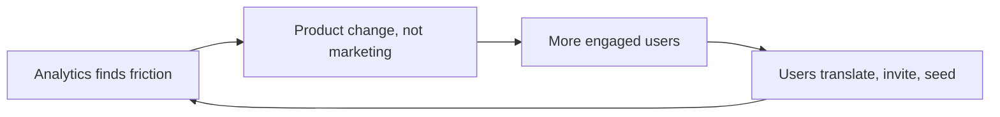

## Why this episode matters

No company in history has served this many humans. Four billion monthly users is half of humanity; the Roman Empire at its peak reached 40 percent, the British Empire 23 percent. This episode is the complete operating history of how that happened: the growth discipline Facebook invented, the mobile transition that nearly killed it, the acquisition strategy laid out in a 2012 email, and the $60 billion Reality Labs bet explained as an insurance premium. If Episode 3 gave you Zuckerberg's mind, this one gives you the machine he built.

## The story

### The scale

Ben opens with the numbers because nothing else frames it. Meta's apps serve 4 billion monthly active users and over 3 billion daily. Eight billion humans exist. No government, no religion, no company has ever addressed this share of the species. The episode's goal: understand how Meta became the dominant fabric connecting humanity, through the breathless first decade and the scandal-defined second, without flinching from either.

### The kid: Civilization, code, and classics

Mark Elliot Zuckerberg was born in May 1984 in Dobbs Ferry, New York, the second of four children. His mother Karen is a psychologist; his father Ed, the son of Jewish immigrants, studied dentistry at NYU and practiced as a dentist. A classic American leveling-up story: grandparents sacrificed, parents became professionals, the kids got to explore.

Mark's three passions, in order: turn-based strategy games (Civilization, released September 1991, when he was 7; the 4X genre: explore, expand, exploit, exterminate), programming, and ancient Greek and Latin. The episode keeps returning to Civilization: the turn-based strategist who gets more turns and learns more per turn is the same kid who later ran Meta as a turn-based strategy game.

Harvard, fall 2003. Sophomore year, Kirkland House suite H33: Zuckerberg, Chris Hughes, Dustin Moskovitz, and Billy Olsen. Mark built Facemash, then thefacebook.com in February 2004. Eduardo Saverin, a fraternity brother in the investing club, put in $1,000 for servers; Mark added $1,000. The split: Mark two-thirds, Eduardo one-third.

### The money: from $2,000 to $104 billion

Figure 1. The funding ladder. Source: episode.

| Round | Amount | Valuation | Note |
|---|---|---|---|
| Founders | $2,000 |, | Mark 2/3, Eduardo 1/3 |
| Angel, 2004 | $500,000 | $5M pre | Thiel most; Hoffman, Pincus $37.5K each; ~250,000x since |
| Venture debt | $600,000 |, | Western Technology Investment; warrants called the greatest venture debt deal ever |
| Series A, 2005 | $12.7M | $98M post | Accel; Mark kept board control; <20% sold (norm was 25-30%) |
| Microsoft, 2007 | $240M | $15B | Ad partnership plus investment; $240M later worth $8B |
| IPO, 2012 | $16B raised | $104B | Priced $38, top of range; 3rd largest IPO ever |

Sean Parker's fingerprints are on the early company: he negotiated the facebook.com domain purchase ($200,000, a huge chunk of the angel money). The Series A details are wild for 2005: Accel's $12.7M at $98M post, with Mark keeping board control and selling under 20 percent. Jim Breyer personally put in $1.1M at 4.5 cents a share; at $600 a share that is a 13,000x return. The round was supposed to be Don Graham of the Washington Post at $60M; Accel topped it, and $3M went to Mark, Dustin, and Sean as a secondary.

### Growth: the numbers, then the machine

By November 2005, Facebook was doing 230 million page views a day, passing Google. User counts: 3 million (June 2005), 5 million (September 2005, 10x year over year, a third of US college students), 70 percent daily active. Revenue: $9M in 2005, cash-flow positive in 2006, $48M in 2006 and $153M in 2007 on the Microsoft ad partnership. The $1 billion Yahoo offer came in 2006. Mark said no.

Two product earthquakes defined the era.

News Feed launched September 5, 2006, to everyone at once, no opt-in. Users hated it: 30,000 angry support emails on day one, and 10 percent of the entire user base joined a protest group. It was a total paradigm shift: social networks had been profiles you visited; now the updates came to you. The episode's verdict: users always hate the change, then cannot live without it.

Platform launched at f8 in May 2007: apps inside Facebook. Twenty million users growing 100,000 a day. For four years (2007-2011), platform was the company's core belief about the future. FarmVille and Zynga rode it to hundreds of millions of users.

The Microsoft deal of 2007 made Microsoft the exclusive third-party ad network worldwide and included the $240M investment at $15B. Thirteen months after the $1B Yahoo bid. Microsoft had also floated acquiring Facebook on terms netting about $24B. For Microsoft, the deal helped spin up Bing's ad serving; the $240M became $8B.

### Beacon: the failure that built the ads business

Mark thought ads were gross and wanted to outsource monetization to Microsoft while he focused on product. But Facebook also tried its own "native" ad idea: Beacon, led by Chamath Palihapitiya. Advertisers embedded JavaScript that published your off-Facebook purchases into your friends' News Feeds. A diamond ring purchase could spoil an engagement. Users revolted, advertisers were confused about what was even an ad, and credibility burned everywhere.

The episode is blunt: a head-up-your-rear-end idea. But the failure was productive. Mark's takeaway: maybe he did not understand advertising as well as he thought. Enter Sheryl Sandberg, who joined Google in 2001 as AdWords was being figured out and built its self-serve business. The deal: Mark owns product and engineering; Sheryl owns ads and operations. Their first exercise: should Facebook even be in the ads business? Answer: yes, it is a media business, and it should build the best targeting engine in the world, which its social data uniquely enables.

### The growth team: a discipline is invented

After Beacon, Chamath needed a new job. At most companies he would have been fired. Facebook's culture, "move fast and break things," found him the right seat instead. User growth was stalling, and Chamath built the first growth team in the industry's history: himself, Alex Schultz, Naomi Gleit, and Javi Olivan.

The definition matters. Growth is not marketing. Marketing and product both touch customers but never talk to each other. The growth team unified them inside product, on the principle that the product itself is the best growth lever. No amount of marketing beats the product doing the right thing for the right user at the right time.

Their methods: obsessive analytics to find where users got value and where they got confused; crowdsourced translation (users translated Facebook into every language, which seeded power users who felt ownership, and captured local nuance no agency could); and People You May Know, still a core surface. The famous finding: a new user's odds of becoming engaged tracked how many friends they added in the first day or two. Alex Schultz's gloss: it is linear, not magic. More friends faster is just better.

Results: 100M users (August 2008) to 150M (end of 2008) to 350M (end of 2009, up 250 percent). Revenue: $280M (2008), ~$800M (2009), $2B (2010), $3.7B (2011). Users: 600M (2010), 850M (2011).

Figure 2. The growth loop. Source: episode.



### The mobile crisis: five ways to die

By 2011, everything Facebook had built assumed the open web. Mobile broke every assumption. The episode lists five reasons:

1. Closed platforms. iOS and Android are proprietary ecosystems Facebook does not control. The web was the only open platform in history: free technologies, interchangeable browsers, distribution by shared URL.
2. Platform dies. Apps cannot run inside apps on mobile. Facebook Platform, half the company's imagined future value, switches off permanently.
3. No mobile revenue. The S1 admitted it: 425 million mobile monthly users in December 2011, and "we do not currently directly generate any meaningful revenue from the use of Facebook mobile products." Desktop ads lived in the right-hand column. Phones have no right-hand column, only the feed, which had never carried ads and which the culture considered pristine.
4. No code velocity. On the web, push anytime. On mobile, a two-week App Store review, and Apple can reject or stall you.
5. Competitive reset. On the web, Facebook absorbed every new social mechanic. On mobile, it is one icon among many, and single-purpose apps (Instagram for photos, WhatsApp for messaging) peel off use cases.

They went public into this. The IPO priced at $38, top of the range, raising $16B at $104B. Nine days earlier, during the quiet period, Facebook bought Instagram for $1B (its previous largest acquisition: $70M). The stock closed day one at $38.23 only because the underwriting banks bought to support it. It fell 9 of the next 13 sessions, bottomed at $17.68 on September 4, 2012 (down 53.5 percent), and stayed underwater for 16 months.

The turnaround: a full native rewrite, then the invention that saved the company, feed ads, plus app-install ads (Facebook became the front end for App Store discovery). Q4 2013 earnings popped the stock 75 percent above the IPO price to ~$175B. The Instagram monetization engine followed.

### The acquisition playbook: buying time

In 2013, Facebook bought Onavo, an Israeli VPN/data-compression app. It let Facebook see mobile app usage trends the way Apple and Google could. It tipped them off to WhatsApp and Snap.

Mark's actual strategy surfaced in a February 28, 2012 email to his CFO, revealed in court. The plan: buy companies, keep them running independently, and integrate the social mechanics they invented into Facebook's core products over 12 to 24 months. "What we're really buying is time." Network effects plus a finite number of social mechanics to invent: once someone wins a mechanic, others cannot supplant them without something different. Buy the mechanic, deploy it at your scale before anyone else can, and you win whether the original product or your copy wins. Probably both win.

Instagram ($1B, April 2012): the mechanic was filtered photo sharing. WhatsApp ($19B, February 2014): not a competitor, a different use case, private messaging, the living-room shift. Oculus ($2B, March 2014, 34 days after WhatsApp): a research lab for the next platform, the way FAIR was for AI.

Snapchat would not sell, so Facebook copied Stories. The copy was better than the original in one specific way: Instagram launched Stories as an algorithmically ranked row of faces, powered by the News Feed ranking expertise Snap did not have. Copying well means deploying the mechanic with your superior distribution and algorithms.

Figure 3. The acquisition logic. Source: episode (Zuckerberg 2012 email).

```ascii
Buy the company
  -> keep it running (option value if it becomes huge)
  -> integrate its mechanics into core (12-24 months)
  -> deploy at your scale before anyone else can
  = "what we're really buying is time"
Win if the original wins. Win if your copy wins. Usually both.
```

### Town Square to living room

Mark's 2019 strategic frame: social was moving from the Town Square (public, permanent, performative: the classic Facebook feed, early Instagram) to the living room (small, private, ephemeral: messaging, Stories, groups). As the town square stage got bigger, people only took it for major announcements. Sharing moved private.

The second-order effect nobody predicted: once social moves to the living room, media can divorce from social entirely. TikTok is not social media. It is media. Your graph does not matter; the AI does. In your first ten videos, the algorithm learns what engages you, and none of it comes from friends. Facebook's durable advantage, the authenticated network, became irrelevant to the engagement at hand. All that was left was the habit of tapping the app, and habits break.

TikTok also broke the organizational model. ByteDance is an AI company that ships products as deployment vectors for its AI, organized around centers of excellence. Facebook was a product company. Meta reorganized to look like ByteDance: FAIR, shared infrastructure, shared revenue, shared growth, integrity and safety as spanning centers of excellence, with product heads rolling up to Chris Cox.

The response: Reels, built fast enough to stem the bleeding, aiming for stalemate. It worked because of FAIR: "no AI, no Reels."

### FAIR: the profitable AI lab

In 2013, with mobile finally stabilizing, Mark and Mike Schroepfer asked when the tiger would jump next. They started FAIR (Facebook AI Research) by recruiting Yann LeCun in summer 2013. LeCun's terms: stay in New York, keep teaching at NYU, publish everything. Facebook, built on the LAMP stack and already open-sourcing Cassandra and React, said yes to all of it.

The key design choice: focused research, not blue-sky. The mission was explicit: AI that ships into products. And it paid off in two years, not ten. The episode names three payoffs: (1) immediate, wildly profitable application to feed ranking and ad targeting. Meta's AI spend has guaranteed ROI because every improvement makes ads and engagement more valuable. An AI assistant is a nice-to-have; the recommender is the business. (2) A chess piece for whatever platform comes next. (3) The weapon against TikTok: Reels.

The line to remember: most AI companies spend hoping the use case materializes. Meta's use case has been proven and profitable for a decade.

### 2016-2018: the fall

Content moderation at planetary scale broke the company politically. Tens of thousands of contractors, escalating policies, and a platform where anyone could reach everyone. Then the 2016 election and Cambridge Analytica.

The episode reconstructs what actually happened, carefully. A quiz app harvested profile data under the old permissive platform API (in the early 2010s, authorizing an app exposed your data and your friends' data). The developer violated terms of service by keeping and repurposing it. About 320,000 people took the quiz; the surface area reached 87 million profiles. Cambridge Analytica got derivative psychographic labels, not raw Facebook data. Facebook had asked for deletion in 2015. The UK investigation was skeptical the methodology even worked: internal communications showed doubt about the models' real-world accuracy.

The brand impact dwarfed the facts. Hundreds of millions of people believed Facebook data had swung the election. The episode's diagnosis: Facebook had earned the distrust through years of "win first, clean up later" behavior, and the town-square-to-living-room shift made old permissiveness look grotesque through new expectations. The FTC settlement: $5 billion and 20 years of monitoring. In July 2018, the privacy-focused earnings call wiped $119 billion in a day, the largest single-day loss in history at the time.

Mark's "20-year mistake" line from Episode 3 gets its context here: the brand damage and the settlement's two-decade tail.

### Apple: the platform war

Mark and Steve Jobs had a genuine relationship: Jobs reached out in 2007, and in 2008 Facebook pitched bringing its platform into iOS. Jobs's answer: "We're just not going to let somebody else build a platform on top of our platform." Cordial, final.

Apple then did what platforms do. Privacy is sincere Apple belief and excellent strategy (Ben Thompson's "strategy credit"): Apple does not need server-side data or ads, so it can afford the stance. In 2021, iOS 14.5/14.6 shipped App Tracking Transparency: apps must ask permission to track, in aggressive language. Most users said no. Facebook's off-app targeting picture collapsed.

February 2022: Meta said ATT would cost about $10 billion in 2022 revenue. The stock fell 26 percent in a day, $232 billion, a new record. It was also the first quarter-over-quarter user decline, with TikTok compounding. By Halloween 2022, the stock was down 72 percent from February.

The episode's judgment: the real threat was TikTok (users), not ATT (monetization efficiency). A founder-led company reacted to both at once, cannibalizing its own feed revenue to push Reels while absorbing the ATT hit. A professional CEO would have waited out ATT first. Mark could not be fired, so he did the right painful thing immediately. The stock is up roughly 5x from the bottom.

The aftermath vindicated scale: Meta built Advantage Plus on first-party signals, advertisers kept spending because budgets must go somewhere, and smaller competitors without Meta's data and engineers could not adapt at all. ATT destroyed value overall: the dollars did not move to Apple; targeting just got worse for everyone, including a retail advertiser whose acquisition costs doubled with no connection to the App Store.

### Reality Labs: the $60 billion hedge

February 2014: $19B for WhatsApp. Thirty-four days later: $2B for Oculus. Mark had tried the demo and found it the most credible future he had ever seen. Treat Oculus as a research lab purchase, like FAIR.

Since 2019, Reality Labs has lost about $60 billion in reported operating losses. The episode does the math two ways.

The product math: to earn back $60B, Reality Labs must become the most successful consumer product in history. Napkin math: if Orion glasses launched tomorrow and grew exactly like the iPhone with an Apple-sized services business attached, Meta's cumulative Reality Labs cash flow stays negative until at least 2035. Anything less is incineration.

The hedge math: Apple erased $10B of revenue with one policy change and could, in theory, remove Meta from the App Store entirely. Google could too. Expected value of that risk: some small probability times a $1.5 trillion market cap is still an enormous number. Spending $15-20B a year, about 1 percent of enterprise value, to buy a chance at platform independence is rational insurance. Plus the upside: owning the next platform means millions of developers building on you, the way they once did.

At Meta Connect in September 2024, the multi-hour keynote spent zero minutes on the $100B ads business. It was all Meta AI, Llama, developers, Quest, Ray-Bans, and Orion. The company is all-in on the platform future.

### The business today

The numbers at recording: 3.3 billion daily actives across the family of apps (up 7 percent), about $12 revenue per person. Facebook alone: 2.1B daily, 3.1B monthly. WhatsApp and Instagram: ~2B monthly each; WhatsApp hit 100M US users. 2023: $135B revenue, $47B operating income (35 percent margin), $28B capex (a hyperscaler-sized data center footprint, the fourth cloud, consumed internally). $50B cash ($58B with securities), 71,000 employees, $1.5T market cap, up from $230B in October 2022.

Two observations the hosts find insane. First, every product's engagement grows over time: the growth function is a heat-seeking missile, a process, not a fluke. Second, monetization: US and Canada ARPU went from $11 at IPO to $227; global is $44. Of 5.4 billion humans online (UN), Meta serves 4 billion outside China.

## Questions and answers

> [!QA]
> Q: How did Facebook get its first users, and why did the college strategy work?
> A: One school at a time, starting with Harvard. Exclusivity plus density: when everyone in your dorm is on it, joining is compulsory. By September 2005: 5M users, 10x year over year, a third of US college students, 70 percent daily active. The strategy was density before breadth: win one network completely, then copy the playbook to the next.
> Follow-up: When does exclusivity stop working? When the network inside is complete and growth needs outsiders. Facebook opened registration in 2006, then spent the next decade proving the product worked without the college scaffold.

> [!QA]
> Q: What was the growth team's key insight?
> A: Growth is a product discipline, not marketing. The 2008 team (Chamath, Alex Schultz, Naomi Gleit, Javi Olivan) unified product and marketing inside product, used analytics to find value and friction, and grew Facebook with Facebook: crowdsourced translation, People You May Know, friend-count onboarding. The metric: friends added in the first day or two predicts engagement, linearly.
> Follow-up: Why "linear, not magic"? Because teams waste months hunting for a magic threshold (10 friends in 14 days!). Schultz's point: more friends faster is just better. Optimize the slope, not the step.

> [!QA]
> Q: Why did Beacon fail, and why did the failure matter?
> A: Beacon published your off-site purchases into friends' feeds. Users revolted (a diamond ring spoiled an engagement), advertisers were confused, privacy implications were horrific. It failed because it violated the user's mental model: my purchases are not content. It mattered because it taught Mark he could not engineer his way around advertising, which led to hiring Sheryl Sandberg and building the targeting engine honestly.
> Follow-up: What is the generalizable rule? Do not ship the clever ad format before the obvious one. Facebook tried native-social ads before basic display; the market wanted basic display first. Cleverness is a tax on adoption.

> [!QA]
> Q: Explain the Instagram acquisition logic from Mark's 2012 email.
> A: Buy the company, keep it running, integrate its mechanics into your core products within 12-24 months. Network effects plus a finite set of inventable mechanics means the winner of a mechanic is hard to dislodge. Buying buys time: deploy the mechanic at your scale before anyone else can. You win if the original wins, you win if your copy wins. Usually both.
> Follow-up: Why keep Instagram separate instead of merging it? Because the mechanic's network is already winning; merging risks killing it. Own the network, copy the mechanic, let both run.

> [!QA]
> Q: What is Town Square to living room, and why did it enable TikTok?
> A: Social moved from public permanent broadcast (the feed) to private ephemeral small-group sharing (messaging, Stories). Once your social life lives in the living room, the town square is free to become pure media. TikTok filled it: no social graph, just AI picking videos. The shift Meta identified created the opening Meta did not see.
> Follow-up: What is the next shift the same logic predicts? Whatever moves the living room itself: if private sharing gets a better mechanic, the apps owning it today are as exposed as the feed was. Watch the mechanic, not the app.

> [!QA]
> Q: Was the $60B Reality Labs spend rational?
> A: As a product investment, only if it becomes the most successful consumer device in history (break-even ~2035 on iPhone math). As a hedge, yes: 1 percent of a $1.5T enterprise value per year to insure against platform owners who already cost you $10B with one policy and could remove you entirely. The honest answer is both: the math only works as insurance plus a platform dream.
> Follow-up: What would change your mind? A credible alternative hedge: if web distribution or regulation removed the App Store risk, the insurance value collapses and only the product math remains.

> [!QA]
> Q: Why did Meta survive ATT while smaller advertisers' costs doubled?
> A: Scale and engineering. Meta rebuilt targeting on first-party signals (Advantage Plus); advertisers' budgets had to go somewhere, and Meta remained the best somewhere. Smaller players could not rebuild. ATT destroyed total value: the dollars did not migrate to Apple, they just bought less efficient ads everywhere.
> Follow-up: Who actually won from ATT? Apple, strategically: it weakened a rival, burnished the privacy brand, and grew App Store search ads. The user got a permission prompt. Everyone else paid more.

## Memory aids

- Half of humanity: 4B monthly users vs Rome's 40% and Britain's 23%.
- The $2,000 start: Mark 2/3, Eduardo 1/3, and a $1,000 server bill.
- 4.5 cents to $600: Breyer's Series A shares, the 13,000x.
- Beacon: the ad format so bad it hired Sheryl Sandberg.
- Growth is product: the 2008 invention of the discipline.
- The S1 confession: 425M mobile users, zero meaningful mobile revenue.
- The email: February 28, 2012. "What we're really buying is time."
- Never-confuse pair: Town Square (public broadcast, the old feed) vs living room (private small-group, where social went). TikTok is neither: it is media without social.
- Trap card: "Facebook won mobile by buying Instagram." Instagram had no mobile revenue either. Facebook won mobile by rewriting natively and inventing feed ads. The acquisition bought time and mechanics, not monetization.
- The numbers: $17.68 (Sept 2012 bottom) to 5x. The 72% drawdown that a founder's control made survivable.

## How to imbibe this

- This week: run the growth-team audit on something you own. Find where users get value and where they get confused, with data, not opinions. Change the product, not the marketing. One change, measured.
- Catch yourself: the next time you propose a clever solution before the obvious one, name it "Beacon" out loud. Ship the obvious version first.
- Behavior change per major idea:
  - Density: launch your next thing to one dense group, not everyone. Win the dorm before the world.
  - Growth is product: move one marketing task inside the product this month. If it cannot live there, question the task.
  - The email: when acquiring anything (a tool, a hire, a company), write the "what we're really buying is time" memo. What mechanic are you buying? What is the 12-month integration plan?
  - Town square: notice where your own sharing moved private. That migration is the market telling you what it wants. Build for the living room.
  - The hedge: price your biggest platform risk as expected value (probability times enterprise value). If the insurance costs 1%, buy it.
- Monthly: check your ARPU-equivalent: revenue per user per month for whatever you do. Is it compounding like $11 to $227? If not, find the monetization you have not built.

## Think it yourself

1. Fermi: 230M page views/day (Nov 2005) with 5M users. What is views per user per day? Compare with 3.3B daily actives today. What broke in the ratio, and what does that tell you about engagement depth versus breadth? (Work it: 46 views/user/day in 2005. The ratio fell as the world joined; depth concentrated in the core.)
2. Argue both sides: Facebook should have merged Instagram immediately. Argue for focus and against option value. Then check against the email: which did Mark choose, and what would have died in the merge?
3. Journal: "What is my Beacon?" Write about the clever thing you shipped that violated the user's mental model. What was the obvious version? What did the failure buy you?
4. First principles: derive the growth team from scratch. You have a product with stalling growth and a marketing team that cannot touch the product. Design the team that can. You should arrive near: analytics-obsessed, inside product, product-as-lever.
5. Observe: find a company living through its "five reasons" mobile moment today: a platform shift that kills its assumptions one by one. List the five. Which one is existential versus painful?

## Skills you can now use

- Run a growth audit: separate product levers from marketing spend, instrument the value and friction points, and change the product first.
- Write an acquisition memo: name the mechanic you are buying, the integration timeline, and why time (not the asset) is the purchase.
- Price platform risk: expected value equals probability times enterprise value; size the hedge as a percentage and defend it.
- Diagnose a social shift: track where sharing moves (public to private, permanent to ephemeral) and position before the mechanic migrates.
- Survive a drawdown: distinguish the real threat (users, TikTok) from the painful one (monetization, ATT), and let the founder's control do its job.

## Go deeper

- Zuckerberg's February 2012 acquisition email (via court filings): search "Zuckerberg February 28 2012 email Instagram neutralize competitor" for the full text.
- Alex Schultz's Startup School talk on growth (the "linear, not magic" lecture): https://www.youtube.com/watch?v=n_yHZ_vKjno

## Figure audit

| Unit | Claim | Before | After | Figure | Medium |
|---|---|---|---|---|---|
| u01 | Planetary scale | Rome 40%, Britain 23% | Meta: half of humanity | text | table in intro |
| u02 | Funding ladder | $2,000 founders | $104B IPO | fig1 | table |
| u03 | Growth team invented | Marketing vs product split | Product-led growth loop | fig2 | mermaid |
| u04 | Mobile killed every assumption | 5 web-era pillars | 5 existential breaks | text | list in Q&A |
| u05 | Acquisition = buying time | Buy and merge | Buy, run, integrate mechanics | fig3 | ascii |
| u06 | Town Square to living room | Public broadcast | Private sharing; TikTok fills square | text | ascii in Q&A |
| u07 | Reality Labs two maths | $60B burned | Product math vs hedge math | text | table in Q&A |

All 7 units mapped. No blank cells.
