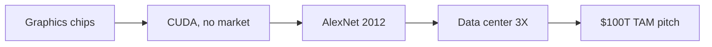

## Why this episode matters

Part I ended in 2004-2006 with NVIDIA a high-flying gaming chip company. This episode covers what happened next, and it is the most extreme patience story in business. NVIDIA spends years building CUDA, a general-purpose computing platform, while Wall Street watches the stock fall 80 percent. The company takes its eye off gaming, whiffs on earnings in 2008 and again in 2011, and keeps pouring money into a platform with no visible market. Then in 2012, a neural network trained on NVIDIA hardware wins an image recognition contest by a shocking margin, and everything changes. By 2022, data center revenue has 3X'd to over $10.5 billion and NVIDIA is a half-trillion-dollar company. If you want to understand how a moat is built in slow motion, this is the episode.

> [!QA]
> **One-line lesson.** Whoever sells the picks and shovels in a gold rush gets paid by every prospector. NVIDIA spent a decade building the picks, then a neural network found the gold.

## The story

### Three foundations carried over from Part I

David picks up in 2004-2005 with NVIDIA a public company on a tear after the tech bubble crash. Three things from the first decade matter for everything that follows.

First, the six-month ship cycles. The episode lists the cadence: GeForce 256 in fall 1999, GeForce 2 in spring 2000, GeForce 2 Ultra in fall 2000, GeForce 3 in spring 2001 (the big one, with programmable shaders), GeForce 3 Ti500 six months after that. Competitors shipped on 18-month to two-year cycles and were left in the dust. David compares Intel's architecture changes to new car body styles, arriving every five or six years. NVIDIA shipped fundamentally new architectures at warp speed.

Second, and this was missed in Part I: NVIDIA wrote its own drivers for its graphics cards. Every other graphics card company at the time let downstream partners write drivers. NVIDIA was the first to say no, we control this, so gamers get a good experience on any system. Ben calls it an Apple-esque view: take the short-term pain of a bigger fixed cost base (employing all those driver engineers) for the long-term benefit of a great user experience. As a side effect, a chip company accidentally built a large base of nitty-gritty, low-level software developers. That base becomes the CUDA team.

Third, the company had its Microsoft relationship and the programmable GPU, and a stock that went from a sub-billion-dollar market cap after the tech crash to $5-6 billion in 2004-2005, reaching just under $20 billion by mid-2007. Gaming alone looked like a great wave to surf. It was not running out of steam.

```ascii
NVIDIA's 2006 position, in round numbers
Market cap: ~$20B (mid-2007 peak)
Business:  pure-play gaming graphics cards
Assets:    six-month chip cadence, own drivers, deep software bench
Temptation: ride the gaming wave (a $100B market today, zero when NVIDIA started)
Choice:     bet everything on a market that did not exist yet
```

Figure 1. NVIDIA's 2006 position, in round numbers. AI Podcast Curriculum, ep08 (Nvidia: The Machine Learning Company, 2022-04-20). Shell 1. Show the toy. Source: original toy, from episode claims.

### The CUDA bet: build it before anyone can come

In 2006, 2007, and 2008, NVIDIA pours resources into building what becomes CUDA: a way for developers to program the GPU for general-purpose computing, not just graphics. At this point it is not yet called that, and there is no clear market for it. The psychology, in the episode's telling, is twofold. Jensen is enamored with the idea of hardware that accelerates specific use cases. And the pitch to rational people is inverted from the movie quote: not "if we build it, they will come," but one step removed, if we do not build it, they cannot possibly come. Whether they will come is unknown. The capability has to exist first.

Scale of the undertaking: Ben searched LinkedIn for NVIDIA employees with CUDA in their title and found 1,100 people dedicated specifically to the CUDA platform. David jokes he is surprised it is not 11,000.

> [!QA]
> **A business test you can reuse.** When someone proposes a platform play, ask David's three questions: where is the market, at what scale, and what is the cost of building for it? If the answer is "unknown, enormous, and huge," you are looking at a bet only an unreasonable founder makes.

### The 80 percent collapse

Wall Street mostly ignores the CUDA spend in 2006-2008 because the gaming business is still growing. Then two things hit. First, AMD acquires ATI (announced 2006, closed 2007), so NVIDIA's remaining gaming competitor now has AMD's resources fully dedicated against it. Second, NVIDIA takes its eye off gaming, CUDA is not yet a revenue driver, and mid-2008 the company whiffs on earnings. The stock gets hammered. From the ~$20 billion peak, it drops 80 percent. The financial crisis finishes the job. Ben notes this is the moment any normal founder calls Goldman Sachs and starts chopping the company up. Jensen instead keeps building CUDA. David calls CUDA one of the greatest business stories of the last 20 years.

Figure 2. The drawdown and the decade of disbelief. AI Podcast Curriculum, ep08 (Nvidia: The Machine Learning Company, 2022-04-20). Shell 2. Count the toy. Source: original toy, from episode claims.
| When | What printed |
|---|---|
| Mid-2007 peak | About $20B market cap |
| 2008 | Down 80 percent (earnings whiff plus crisis) |
| 2011 | Another 50 percent drawdown (earnings whiff) |
| 2012-2015 | Stock under $5 a share |
| 2016 | Back to the $20B peak |

### The Tegra detour

The company is in the penalty box and NVIDIA feels the need to show shareholders something commercial. In 2008, mobile is the hot thing, so NVIDIA launches Tegra, a chip platform for phones. David calls this a clown-car detour. It is not what saves the company. Through the late 2000s and early 2010s the company goes sideways: some years grow 10 percent, some are flat, and in 2011 NVIDIA whiffs on earnings again and the stock takes another 50 percent drawdown. David: everybody else would have given up. Not them.

### AlexNet: the miracle nobody saw coming

In 2000, a Princeton computer science professor named Fei-Fei Li (today the Sequoia Capital Professor of Computer Science at Stanford) starts an image-classification project called ImageNet, inspired by WordNet, a 1980s Princeton project that classified words. ImageNet classifies images: a database of millions of labeled images, each tagged correctly (this is a dog, this is a strawberry).

In the 2012 ImageNet competition, a team from the University of Toronto submits a neural network, AlexNet, and wins by a lot. Error rates: the best previous entries were around 25 percent. AlexNet scores around 15 percent. A ten-point margin in a field that measured single points. Ben: it is like someone breaking the four-minute mile, arguably more impressive. The network was trained on NVIDIA GPUs, using CUDA. David calls this the big bang moment for artificial intelligence, and NVIDIA and CUDA were right there.

> [!QA]
> **The pattern to tattoo on your brain.** NVIDIA did not predict deep learning. They built general-purpose parallel computing because Jensen believed in accelerating specific workloads, and when a workload appeared, neural networks, the platform was already there. Preparation meets luck, but only after a decade of unfunded preparation.

### The long recognition lag

Even after AlexNet, the market takes years to believe. Marc Andreessen gives a 2016 interview: "We've been investing in a lot of companies applying deep learning to many areas, and every single one effectively comes in building on NVIDIA's platforms. It's like when people were all building on Windows in the '90s, we're all building on the iPhone in the late 2000s." He says his firm's internal game, what public companies would we invest in if we were a hedge fund, would put all the money in NVIDIA.

The numbers: from 2012 to 2015, NVIDIA stock does not trade above $5 a share. At recording time it is around $220, with a past-year high over $300. There was a crypto-driven run to about $65 in 2018, then a crash to $34 at the start of 2019, a level that in retrospect looks like nothing on the run to $350. The kicker: it takes until 2016 for NVIDIA to get back to the $20 billion market cap peak of 2007, when it was just a gaming company. Almost ten years to recover the peak, because the market refused to believe a gaming chip company had become the foundation of AI. Jensen was on stage and on earnings calls telling everyone this was the future. People stayed skeptical.

### Crypto: the third application of the same chips

In 2018, a third class of embarrassingly parallel problems arrives: cryptocurrency mining. People buy consumer NVIDIA graphics cards and build mining rigs. When the crypto winter hits in 2018, mining demand collapses, and crypto had become so big for NVIDIA that revenue actually declines. The technical point: mining is guessing-and-checking with 10,000 parallel attempts, and it is matrix math. Same chips, third application in one decade: gaming, neural networks, crypto. One set of parallel cores, three gold rushes.

Figure 3. Three rushes, one shovel. AI Podcast Curriculum, ep08 (Nvidia: The Machine Learning Company, 2022-04-20). Shell 1. Show the toy. Source: original toy, from episode claims.
| Rush | The parallel workload |
|---|---|
| Gaming | Rendering pixels |
| Neural networks | Matrix multiplication |
| Crypto mining (2018) | 10,000-way guess-and-check hashes |

### The data center pivot

Data center GPUs are a different product from gaming cards. The A100 has no video out, it literally cannot drive a monitor, as a Linus Tech Tips video demonstrated. The RTX 3090, the most expensive consumer card, sold for $3,000 (later ~$2,000). The H100 sells for $20,000-$30,000. NVIDIA also walls the segments off: you cannot rack GeForces into a data center rig at home.

In 2019 (deal completed 2020), NVIDIA acquired Mellanox, an Israeli data-center networking company, for about $7 billion, to build out its data center ambitions. Networking matters because a rack of GPUs is useless if they cannot talk to each other at speed, a thread that leads straight into the cluster-building material of the synthesis chapter.

The revenue flip: two years before recording, the data center segment did about $3 billion, roughly half of gaming's ~$6 billion, and had been flat. Then it 3X'd in two years to over $10.5 billion a year. Gaming through 2006 to 2020 was still king at nearly $6 billion. Data center dethroned it.

Figure 4. The data-center 3X. AI Podcast Curriculum, ep08 (Nvidia: The Machine Learning Company, 2022-04-20). Shell 2. Count the toy. Source: original toy, from episode claims.
| When | Data center revenue |
|---|---|
| About 2020 | About $3B a year (half of gaming's ~$6B) |
| 2022 | Over $10.5B a year (3X in two years) |
| Result | Data center dethrones gaming |

### The 2022 numbers and the trillion-dollar pitch

At recording time: about 20,000 employees, $27 billion in annual revenue, roughly $8 billion of free cash flow a year, $21 billion in cash, and a ~$500 billion market cap, the eighth largest company in the world. Growth: 60 percent revenue growth last year at a 30-year-old company, versus Google's 40 percent and Microsoft's 10-20 percent. Valuation: roughly three times Apple's price-to-sales ratio and nearly twice Microsoft's. Google's whole revenue was $257 billion with AdWords alone doing $43 billion in Q4 2021, NVIDIA's revenue is an order of magnitude smaller than the FAANGs, so the multiple is a bet that the revenue is coming.

The bull case comes from NVIDIA's own investor day: serve customers representing a $100 trillion opportunity and capture 1 percent of it. Automotive alone is pitched as a $300 billion piece of the TAM (current automotive revenue: around $1 billion, barely growing, noted with skepticism). The bear case the episode sketches: Cerebras will sell you a $2 million chip for AI training versus NVIDIA's $20-30K chip (hyper-specialized hardware). Google keeps making noise about its own silicon. And the whole 1,100-person CUDA investment only pays off if it can be amortized over 3 million developers and everyone buying the hardware.

One more structural fact: NVIDIA's capital efficiency. CapEx is about $1 billion a year. Compare: Apple ~$10 billion, Microsoft and Google ~$25 billion each, TSMC ~$30 billion. NVIDIA is fabless (TSMC builds the chips), so it captures the platform economics without the fab bill.

Figure 5. Capital efficiency. AI Podcast Curriculum, ep08 (Nvidia: The Machine Learning Company, 2022-04-20). Shell 1. Show the toy. Source: original toy, from episode claims.
| Company | Annual CapEx |
|---|---|
| NVIDIA | About $1B |
| Apple | About $10B |
| Microsoft, Google | About $25B each |
| TSMC | About $30B |



Figure 6. From gaming chips to the $100T TAM pitch. AI Podcast Curriculum, ep08 (Nvidia: The Machine Learning Company, 2022-04-20). Shell 3. Apply the one rule. Source: original toy, from episode claims.

## Questions and answers

> [!QA]
> **Q1: Why did NVIDIA build CUDA when there was no market for general-purpose GPU computing?**
> A: Jensen believed hardware should accelerate specific workloads, and took the inverted Field-of-Dreams view: if we do not build it, developers cannot possibly come. It was an unreasonable-founder bet, unknowable market, enormous cost, funded by the gaming cash cow. The episode frames it as one of the boldest bets they have covered.
> **Follow-up:** What cash cow in your own career could fund a multi-year bet with no visible market, and what would the CUDA-equivalent be, a capability you build before anyone asks for it?

> [!QA]
> **Q2: The stock fell 80 percent from its 2007 peak and took until 2016 to recover. Why didn't the market believe after AlexNet?**
> A: Because the story was unbelievable: a gaming graphics company as the foundation of artificial intelligence. Even semiconductor analysts listening to Jensen say it on earnings calls stayed skeptical. The market needed years of revenue proof, the data center 3X, before repricing. Narratives lag technology by roughly a decade.
> **Follow-up:** Name a technology today that is obviously working but whose incumbent-company stock does not reflect it. What would have to print in revenue before the market believed?

> [!QA]
> **Q3: What does "picks and shovels" mean as a business strategy, and why is it so powerful here?**
> A: In a gold rush, every prospector needs picks and shovels regardless of who finds gold. Every deep learning startup "effectively comes in building on NVIDIA's platforms" (Andreessen). NVIDIA gets paid by winners and losers alike, and the platform (CUDA) means switching shovel brands requires rewriting everything. The moat is the 3 million developers, not the chip.
> **Follow-up:** List three current gold rushes and identify who sells the picks and shovels in each. Which of those sellers has a CUDA-like software lock-in versus a pure commodity tool?

> [!QA]
> **Q4: Why could NVIDIA not just coast on gaming?**
> A: It could have, gaming was a $100 billion wave at an inflection point. But AMD bought ATI and dedicated itself to the fight, and Jensen wanted the bigger game. The episode's point: coasting would have been defensible and profitable. The CUDA bet was a choice to risk a great business for a generational one. Most founders, and most boards, would not allow it.
> **Follow-up:** When is "coast on the good business" the right answer versus "risk it for the generational one"? What governance would you want in place before making the call?

> [!QA]
> **Q5: How did one chip architecture serve gaming, AI, and crypto mining?**
> A: All three are massively parallel problems built on matrix math. A GPU is thousands of simple cores doing the same operation on different data simultaneously, rendering pixels, multiplying neural-network matrices, or guessing-and-checking crypto hashes 10,000 at a time. General-purpose parallel compute turned out to be the universal substrate. The applications were discovered, not designed.
> **Follow-up:** What other "embarrassingly parallel" problems exist that have not yet had their AlexNet moment? Robotics simulation? Drug discovery? Climate modeling?

> [!QA]
> **Q6: Why did NVIDIA buy Mellanox for $7 billion?**
> A: Because a data center is not a pile of GPUs, it is GPUs that can talk to each other at full speed. Mellanox is an Israeli data-center networking company. As NVIDIA moved up the stack from chips to "data center scale computing," owning the interconnect became as strategic as owning the compute. Watch this thread: it is the seed of the full-stack story in the synthesis chapter.
> **Follow-up:** Draw the stack: chip → server → rack → cluster → data center. At which layer does NVIDIA capture the most margin today, and which layer would you attack as a competitor?

> [!QA]
> **Q7: NVIDIA spends $1B a year on CapEx while TSMC spends $30B. Why is that an advantage?**
> A: NVIDIA is fabless: TSMC bears the fab bill, NVIDIA keeps the platform economics. Capital efficiency means more cash for R&D, software, and acquisitions, and higher returns on invested capital. The risk is the mirror image: NVIDIA's entire existence depends on TSMC's fabs, which is exactly the Morris Chang relationship from ep02.
> **Follow-up:** Compute a rough return-on-CapEx: $8B free cash flow on $1B CapEx. What breaks first if TSMC raises prices 30 percent?

> [!QA]
> **Q8: What is the bear case against NVIDIA at a $500B market cap?**
> A: The multiple (3x Apple's price-to-sales) prices in a future that must arrive. Competitors: Cerebras selling $2M hyper-specialized training chips, Google's own silicon, AMD. The CUDA amortization math only works if the developer base keeps growing. And history says 80 percent drawdowns happen, twice in this episode alone. The bull case is the $100T TAM at 1 percent capture. The bear case is that multiples compress the moment growth misses.
> **Follow-up:** Write the two-sentence short thesis and the two-sentence long thesis. Which one would you have believed in 2015, when the stock was under $5?

## Memory aids

1. **"If we do not build it, they cannot come."** The inverted Field of Dreams. CUDA's founding logic, 2006-2008.
2. **80 → 50 → 2016.** The pain sequence: 80% drawdown after 2008, another 50% drawdown in 2011, back to the $20B peak only in 2016. Patience measured in decades.
3. **$5 to $220.** NVIDIA under $5 a share from 2012-2015. ~$220 at recording. The market's decade-long disbelief, priced.
4. **Three rushes, one shovel.** Gaming, neural networks, crypto mining, all matrix math, all parallel, all the same cores.
5. **$3B → $10.5B.** Data center revenue 3X in two years, dethroning gaming's ~$6B.
6. **Never confuse:** CUDA (the software platform, the moat) with the GPU (the hardware, the product). Competitors can copy silicon. They cannot copy 3 million developers and 1,100 CUDA engineers.
7. **Trap card:** "NVIDIA predicted AI." No. They built general-purpose parallel compute with no market in mind, and AI arrived. Preparation, not prediction.
8. **$1B vs $30B.** NVIDIA's CapEx versus TSMC's. Fabless capital efficiency, and fabless dependency.

## How to imbibe this

1. **This week:** write down your "CUDA", one capability you will build for two years with no visible market, funded by your current cash cow. Put a dollar and hour budget on it. If you cannot name the cash cow, you are not ready to bet.
2. **Practice the 80% test:** for any investment or project you hold, ask what you would do if it fell 80% and stayed down for eight years. Jensen kept building. Write your own rule now, while you are calm, for when the drawdown comes.
3. **Picks-and-shovels audit:** list the tools every team in your company uses regardless of which projects succeed. That is where the durable value sits. Spend one hour learning the most important one deeply.
4. **Observable behavior:** the next time a narrative sounds unbelievable ("a gaming company runs AI"), check the revenue line instead of the story. Data center went $3B → $10.5B. Numbers convert skeptics. Stories do not.

## Think it yourself

These drills escalate: earlier episodes gave you the numbers, now you build the models.

1. **Guided:** data center revenue was ~$3B and gaming ~$6B. Two years later data center is $10.5B+. Compute the compound annual growth rate of the data center segment over those two years. (Answer: roughly 87% per year.)
2. **Fermi:** a training run needs 10,000 H100s at ~$25K each. Estimate the GPU hardware cost of the cluster, then estimate the Mellanox-style networking cost as a fraction of it. What fraction of total cluster cost is interconnect? Defend your fraction.
3. **Journaling:** "NVIDIA was saved by a miracle nobody saw coming." Write 300 words: how much of success is preparation for luck versus creating luck? Use the CUDA decade and AlexNet as your evidence, and steelman the view that NVIDIA just got lucky.
4. **Reasoning exercise:** the episode says it took until 2016 to recover the 2007 peak. Construct the bull case a 2013 investor could have made using only public facts then (AlexNet 2012, Jensen's earnings-call claims, developer growth). What was knowable, and what required faith?
5. **Unaided:** you are Jensen in mid-2008, stock down 80%, board restless. Write the one-page memo that keeps the CUDA budget alive. No hindsight allowed, you do not know AlexNet is coming.

## Skills you can now use

- **Reason about platform bets:** apply the three-question test (where is the market, at what scale, what is the cost to build) to any platform proposal, and recognize when the honest answer is "unknown", which is precisely when only founder conviction can carry it.
- **Read drawdowns correctly:** distinguish a broken thesis (Tegra) from a delayed thesis (CUDA). The test: is the underlying capability still compounding while the price falls? CUDA's developer base grew through both crashes.
- **Sanity-check a moat claim:** ask what the switching cost is denominated in. CUDA's moat is denominated in 3 million developers' code and 1,100 engineers' accumulated software, not in transistor counts, which competitors can match.
- **Price patience:** convert "the market takes a decade to believe" into position sizing. If the thesis needs ten years, the position must survive two 50%+ drawdowns without forced selling.

## Go deeper

- [Acquired, NVIDIA Part I: The GPU Company (1993-2006)](https://www.youtube.com/watch?v=wYUTMgGxZzc), the prequel: the two earlier death-cheating episodes this chapter builds on.
- [Acquired, NVIDIA Part III: The AI Company (2022-2023)](https://www.youtube.com/watch?v=nFB-AILkamw), the sequel: what happens after the $500B mark, covered in ep10.

## Figure audit

| Unit | Claim | Before | After | Figure | Medium | Source |
|---|---|---|---|---|---|---|
| u01 | Three foundations carried over | Sub-billion market cap | $20B peak, software bench | fig1 | ascii | episode claims |
| u02 | CUDA bet with no market | Gaming cash cow | Platform before the market | fig6 | mermaid | episode claims |
| u03 | 80 percent collapse, decade of disbelief | $20B peak (2007) | Back to $20B only in 2016 | fig2 | table | episode claims |
| u04 | AlexNet was the big bang | 25% error, the old best | 15% error on CUDA GPUs | fig6 | mermaid | episode claims |
| u05 | One chip served three gold rushes | Gaming only | Gaming, AI, crypto on one core set | fig3 | table | episode claims |
| u06 | Data center dethroned gaming | $3B/yr, half of gaming | $10.5B/yr, 3X in two years | fig4 | table | episode claims |
| u07 | $100T TAM pitch | $500B market cap (2022) | 1 percent capture target | fig6 | mermaid | episode claims |
| u08 | Fabless capital efficiency | $30B fab bills (TSMC) | $1B CapEx, platform economics | fig5 | table | episode claims |

All 8 units mapped. No blank cells.
