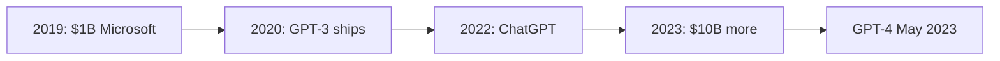

## Why this episode matters

This is the payoff of the entire NVIDIA trilogy, and the episode this track's hardware core is built on. In April 2022, recording Parts I and II, the hosts never once said the word "generative." Eighteen months later, ChatGPT is the fastest product in history to 100 million users, NVIDIA guides from $7.2 billion to $11 billion in a single quarter, the stock pops 25 percent after hours, and the company crosses $1 trillion. The episode does three things no other episode in the track does: it prices the H100 down to the transistor, it quantifies the CUDA moat in person-years, and it steelmans the bear case. If you want to know why NVIDIA is expensive, economically, not just its stock price, this is the source document.

> [!QA]
> **One-line lesson.** The moat is not the chip. It is 10,000 person-years of software, 4 million developers, and a supply chain nobody else can book, priced at $40,000 per GPU.

## The story

### The bleakest moment, then the detonation

Rewind to 2022. Financial markets fall off a cliff: rapid rate rises, the crypto and web3 bubble bursts, banks fail. NVIDIA takes a massive inventory write-off for over-ordering. In the hosts' April 2022 episodes, the word "generative" is never spoken once.

Then, fall 2022: large language models built on the Transformer burst onto the scene, first with OpenAI's ChatGPT, the fastest product in history to 100 million users, reached in January 2023. Jensen's phrase for November 30, 2022: "the AI heard around the world."

### The 70-year runway: from narrow AI to the Transformer

The episode rewinds through AI history to show this was not overnight. For decades, AI meant narrow tasks: the Google Brain team redoing the YouTube algorithm around 2013-2014, turning a money-losing acquisition into a juggernaut. AI-powered feed recommendations turned Instagram into a $100-500 billion asset for Meta. Real dollars, narrow models.

Two breakthroughs changed everything. First, data and algorithms at internet scale: ImageNet's 14 million images were a drop in the internet's bucket, and nobody knew how to train one foundational model on the whole internet. Second, in 2017, Google Brain publishes "Attention Is All You Need", the Transformer. (Ilya Sutskever had left Google two years earlier to start OpenAI.) Machine learning on language had meant autocorrect and translation. The Transformer opened something new.

Then the scaling discovery: GPT-1 had ~120 million parameters, GPT-2 1.5 billion, GPT-3 175 billion, GPT-4 rumored ~1.72 trillion. More parameters plus more data equals better next-word prediction, with a weird emergent property: models below ~10 billion parameters hallucinate and babble, past ~100 billion, they start to work. Transformer models scale well precisely because of parallelism: throw more data at training, and you can throw more parallel compute at it too. Parallelism is NVIDIA's home turf, twenty years in the making.

Figure 1. The scaling ladder, GPT-1 to GPT-4. AI Podcast Curriculum, ep10 (Nvidia Part III: The Dawn of the AI Era, 2023-09-06). Shell 2. Count the toy. Source: original toy, from episode claims.
| Model | Parameters |
|---|---|
| GPT-1 | About 120 million |
| GPT-2 | 1.5 billion |
| GPT-3 | 175 billion |
| GPT-4 | Rumored about 1.72 trillion |

### The OpenAI-Microsoft timeline

The episode compresses the partnership that funneled the world's most important models onto NVIDIA hardware via Microsoft's cloud:

- 2019: OpenAI converts to for-profit. Microsoft invests $1 billion and becomes the exclusive cloud provider.
- June 2020: GPT-3. September 2020: Microsoft licenses exclusive commercial use. 2021: GitHub Copilot. Microsoft invests another $2 billion.
- November 30, 2022: ChatGPT. January 2023: Microsoft invests another $10 billion, integrates GPT into everything. May 2023: GPT-4.

Every step of this runs on NVIDIA GPUs in Microsoft's data centers, which is why the exclusive-cloud clause matters so much to NVIDIA's revenue line.

Figure 2. The OpenAI-Microsoft funnel. AI Podcast Curriculum, ep10 (Nvidia Part III: The Dawn of the AI Era, 2023-09-06). Shell 3. Apply the one rule. Source: original toy, from episode claims.


### The H100 baseball card

In September 2022 NVIDIA splits its architectures: Hopper (named for Grace Hopper) for the data center H100, and Lovelace (Ada Lovelace) for consumer RTX 40xx cards. The H100 numbers, per the episode:

- Price: $40,000 per GPU, that is the price to Amazon, Google, Meta.
- Speed: 30x faster than the A100 (only ~2.5 years older). 9x faster specifically for AI training. Purpose-built for training LLMs.
- Cores: 18,500 CUDA cores, 640 tensor cores (specialized for matrix multiplication), 80 streaming multiprocessors, close to 20,000 unique cores on one chip.
- Transistors: a quarter trillion, across 35,000 parts. Weight: 70 pounds, Jensen jokes every keynote that he can barely lift it.
- Power: meaningfully higher energy usage than the A100. Each generation pushes the edge of physics and is constrained by physics, much of this is only possible with way more energy.

For contrast, the episode sets the H100 against the classic Von Neumann model, one compute core handling a handful of assembly instructions, versus close to 20,000 cores on a single H100, each capable of running CUDA software. It requires robots to assemble, and NVIDIA now uses AI to design the chips themselves.

```ascii
One H100 (Sept 2022)
Price:      $40,000
Transistors: ~250 billion
Cores:      ~20,000 (18,500 CUDA + 640 tensor + 80 SMs)
Weight:     70 lbs
Training:   9x the A100 it replaced
Constraint: power and physics, not just lithography
```

Figure 3. One H100 (Sept 2022). AI Podcast Curriculum, ep10 (Nvidia Part III: The Dawn of the AI Era, 2023-09-06). Shell 1. Show the toy. Source: original toy, from episode claims.

### Bundle economics: the DGX stack

NVIDIA does not just sell chips. A DGX box, eight H100s with an ARM CPU and NVIDIA's networking, sells for $150,000-$300,000. A top-of-line DGX H100 system starts at $500,000. Do the math the hosts do: 8 × $40,000 = $320,000 in GPUs, so roughly $180,000 of the $500,000 is extra margin from selling the solution. Every bundling step up adds margin: the chips have margin, the system has margin on top.

Then the DGX GH200 SuperPOD: 256 Grace Hopper DGX racks connected in one wall, "the AI wall" Jensen unveiled, sold as the first turnkey AI data center. Pricing is "call us". The hosts estimate hundreds of millions of dollars. And DGX Cloud rents it back: starting at $37,000 a month for an A100-based system. A listener estimated the build cost of an equivalent A100 DGX at ~$120,000, rented at $37K/month, the payback math is absurd. For reference, public cloud pricing at recording: ~$30/hour for eight A100s, ~$100/hour for eight H100s.

Why customers accept it: buy the solution and every developer you already have runs CUDA on day one. "You say solution, I hear gross margin."

Figure 4. The DGX bundle math. AI Podcast Curriculum, ep10 (Nvidia Part III: The Dawn of the AI Era, 2023-09-06). Shell 2. Count the toy. Source: original toy; margin computed in prose from episode claims.
```ascii
8 H100 x $40,000      = $320,000 in GPUs
DGX H100 box          = from $500,000
Integration margin    = about $180,000 (about 36 percent)
```

Jensen's pitch line for the whole stack: "the more you buy, the more you save." The argument: yes, the hardware takes a ton of energy, but the alternative (doing the same work on general-purpose infrastructure) takes even more energy, more time, and more money. If the workloads are going to happen anyway, accelerated computing is the energy-saving path. Training happens once. Inference runs forever. The episode's analogy: training a model is like compressing a 3-gigabyte Photoshop file into a JPEG, the whole internet of text compressed into weights. The JPEG is far more useful per byte, but you can never get the layers back, so you better compress it right the first time.

### The earnings detonation

May 2023, Q1 FY24: revenue $7.2 billion, up 19 percent quarter over quarter, good, especially after the terrible end of 2022. Then the bombshell: forecasting Q2 at $11 billion on unprecedented generative-AI data center demand, up 53 percent quarter over quarter, 65 percent year over year. The stock pops 25 percent after hours. Context: $660 billion market cap in April 2022, crashed below $300 billion, now back over $1 trillion.

August 2023, Q2: total revenue $13.5 billion, up 88 percent quarter over quarter and over 100 percent year over year. Data center: $10.3 billion of the $13.5 billion, up 141 percent from Q1, up 171 percent year over year, for a segment that barely existed five years earlier. The hosts call it one of the most incredible earnings releases by any scaled public company ever.

Figure 5. The detonation quarter. AI Podcast Curriculum, ep10 (Nvidia Part III: The Dawn of the AI Era, 2023-09-06). Shell 2. Count the toy. Source: original toy, from episode claims.
| Print | Number |
|---|---|
| Q1 FY24 revenue (May 2023) | $7.2B, up 19 percent QoQ |
| Q2 guide | $11B, up 53 percent QoQ, 65 percent YoY |
| Q2 actual (Aug 2023) | $13.5B total revenue |
| Of which data center | $10.3B, up 141 percent QoQ, 171 percent YoY |

Two structural details from the earnings call matter. First, concentration: about half of data-center revenue comes from cloud service providers, then consumer internet companies, then enterprises, meaning 5-8 companies drive the number. NVIDIA owns the developer relationship through CUDA but the customer relationship is intermediated by clouds, which is exactly what DGX Cloud (virtualized DGX rented through Azure, Oracle, and Google, with Hugging Face integration and a ~6-month capex payback) is built to fix. Second, the pitch got reframed: instead of 1 percent of a $100 trillion TAM, Jensen now points at $1 trillion of hard assets sitting in data centers worldwide, growing at $250 billion of annual capex, and NVIDIA as the most coherent platform for what those data centers become. The thing you have to believe is narrower now: that AI workloads create real user value. ChatGPT, rumored at over a billion-dollar run rate and growing, is the Netscape Navigator of this boom.

Gross margin completes the story: 70 percent last quarter, forecasting 72 percent next, versus 24 percent in the pre-CUDA commoditized era. A near-linear climb as the moat deepened.

### The moat, quantified

This is the episode's most important contribution to the track's hardware core. Three quantifications:

**1. CUDA developers.** Released 2006. Four years to the first 100,000 developers. 1 million by 2016. 2 million just two years later. 3 million in 2022. 4 million registered developers by May 2023. The curve goes vertical exactly when AI does.

Figure 6. The CUDA developer curve. AI Podcast Curriculum, ep10 (Nvidia Part III: The Dawn of the AI Era, 2023-09-06). Shell 2. Count the toy. Source: original toy, from episode claims.
| Year | Registered CUDA developers |
|---|---|
| 2010 | 100,000 (4 years after launch) |
| 2016 | 1 million |
| 2018 | 2 million |
| 2022 | 3 million |
| May 2023 | 4 million |

**2. Person-years.** Ben estimates CUDA headcount per year since 2006 and integrates: approximately 10,000 person-years of engineering have gone into CUDA. The iOS-vs-Android analogy: Apple had an 18-month lead and Android nearly caught up. NVIDIA has a 10-to-15-year lead with thousands of engineers still compounding it. Open source will try, the incentives are there, but every moat works only if the castle is small enough relative to the prize, and this castle is enormous.

**3. Installed base.** The 2006 decision that every GPU shipping would be fully CUDA-capable means there are 500 million CUDA-capable GPUs in the world for developers to target. That is a scale economy feeding a network economy. Developers target CUDA because the hardware is everywhere. Hardware sells because developers target CUDA.

The competitive-replication test the episode runs: to match NVIDIA you would need to (a) contract TSMC for advanced CoWoS packaging capacity. CoWoS is 10-15 percent of TSMC's total capacity, custom-built, years to add, and NVIDIA has likely reserved most of it. (b) Reproduce 10,000 person-years of CUDA-quality software, costing billions. (c) Survive the years that takes while NVIDIA keeps shipping. "Good luck getting that."

Figure 7. The replication test. AI Podcast Curriculum, ep10 (Nvidia Part III: The Dawn of the AI Era, 2023-09-06). Shell 1. Show the toy. Source: original toy, from episode claims.
| Blocker | What it takes |
|---|---|
| TSMC packaging | CoWoS is 10-15 percent of capacity; years to add; NVIDIA reserved most |
| Software | About 10,000 person-years of CUDA, still compounding |
| Time | Years of catching up while NVIDIA keeps shipping |

### Mellanox and the networking insight

Why did NVIDIA buy Mellanox (ep08)? Because in August 2019 NVIDIA released Megatron, then the largest Transformer language model at 8.3 billion parameters, and learned firsthand that frontier models must run across multiple servers and multiple racks. Bandwidth between machines became the constraint. NVIDIA put huge importance on interconnect before the market did, which is why InfiniBand (Crusoe deployed 3,200-gigabit InfiniBand early) and the Mellanox acquisition look prescient. The cluster is the computer.

### China and export controls

Mainland China was 25 percent of NVIDIA's revenue, hyperscalers like Baidu, Alibaba, Tencent. (Baidu's GPT competitor is reportedly over a trillion parameters, possibly larger than GPT-4.) In September 2022 the Biden administration's export controls barred sales of H100s and A100s to China, so NVIDIA created detuned variants (the A800). Geopolitics is now a first-order variable in the bull/bear math.

Figure 8. Export controls hit the revenue line. AI Podcast Curriculum, ep10 (Nvidia Part III: The Dawn of the AI Era, 2023-09-06). Shell 1. Show the toy. Source: original toy, from episode claims.
| Before September 2022 | After September 2022 |
|---|---|
| China about 25 percent of revenue | H100 and A100 sales to China barred |
| Full-speed chips for Baidu, Alibaba, Tencent | Detuned variants (the A800) |

### Employee efficiency

26,000 employees at NVIDIA versus 220,000 at Microsoft, roughly 5x the employees per dollar of market cap. The scale of the platform being built per employee is, in the hosts' words, on the order of something the industry has never seen.

### Bear vs bull

The episode steelmans both sides, and this is theDwarkesh-question from ep01 ("Will Nvidia's moat persist?") answered at length:

**Bear case 1, the prize invites attack.** Data-center GPUs are a ~$30 billion/year market heading to ~$50 billion. Too many margin dollars for giants to ignore. Every moat is tested when the castle gets rich.

**Bear case 2, the inference shift.** Models get trained once, then run forever. If compute shifts from training (where NVIDIA is dominant) to inference (where it is less differentiated), the moat narrows.

**Bull case.** Andreessen was right in 2015-2016: every fund's dollars should have gone into NVIDIA. Data center is ~$10.3B of $13.5B quarterly revenue and the accelerated-computing belief keeps converting skeptics. NVIDIA's share of data-center spend (~20 percent of a $50B+ run-rate) can keep creeping up. And the replication test above is the real bull case: the moat is denominated in person-years, developer count, and booked TSMC capacity, none of which money can buy quickly.

The hosts' conclusion: disruption will come, if it comes, either from an unseen flank attack or from a future that is not accelerated computing, "which seems very unlikely."

> [!QA]
> **The synthesis for the track.** Ep08 asked why NVIDIA is expensive (the platform bet). Ep09 showed how the company was built to make such bets (cadence, survival). Ep10 prices the answer: $40K per H100, $500K per DGX box, 10,000 person-years of CUDA, 4 million developers, and a supply chain with no spare capacity. Expensive is not a bug. It is the moat monetized.

## Questions and answers

> [!QA]
> **Q1: Why is an H100 $40,000? Break down what the buyer is actually paying for.**
> A: Three layers. The silicon: a quarter trillion transistors, ~20,000 cores, 9x the training throughput of the A100. The software: it runs the entire CUDA ecosystem on day one, 4 million developers' code just works. The scarcity: CoWoS packaging capacity at TSMC is finite and largely reserved. You are paying for compute, compatibility, and availability, in that order of negotiability.
> **Follow-up:** A competitor offers you an equivalent-FLOPS chip at $20,000 but no CUDA. Model the true cost including porting your team's code and the risk of being on an immature stack. At what discount does switching make sense?

> [!QA]
> **Q2: What are "bundle economics" and why does each DGX step add margin?**
> A: Eight H100s cost $320,000. The DGX H100 box sells from $500,000, ~$180,000 of extra margin for integration, networking, and software. Customers pay it because the bundle removes integration risk and every in-house developer is productive immediately. NVIDIA is entitled to margin at each bundling step because each step delivers real value, and because there is no credible alternative bundle.
> **Follow-up:** Where does bundle pricing power end? Identify the customer type (hyperscaler vs startup vs nation-state) with the most bargaining power to unbundle, and explain why.

> [!QA]
> **Q3: What does "10,000 person-years into CUDA" actually mean for a competitor?**
> A: It means catching up is not a money problem. It is a time problem. Even with unlimited budget, you cannot hire 10,000 experienced GPU-software engineers instantly, and their work compounds. Each year's CUDA makes the next year's easier. Ben's iOS/Android analogy: an 18-month lead was nearly closed. A 10-15-year lead with thousands still working is a different species.
> **Follow-up:** Estimate what 10,000 person-years costs at $400K fully loaded per engineer-year. Now explain why spending that money still would not reproduce CUDA. (Answer: ~$4B, and it buys labor, not the accumulated design decisions, bug fixes, and ecosystem.)

> [!QA]
> **Q4: Why is CoWoS capacity a moat, not just a supply detail?**
> A: CoWoS (chip-on-wafer-on-substrate) is the advanced packaging H100s require: 10-15% of TSMC's total capacity, custom-built fabs, years to add more. NVIDIA reserved most of it. A competitor with a better chip design still cannot ship at volume without packaging capacity that does not exist. Manufacturing moats are the least appreciated and hardest to attack.
> **Follow-up:** Trace the full chain: sand → wafer → CoWoS → H100 → DGX → cluster. At which link would you invest $10B to hurt NVIDIA most, and how long before it mattered?

> [!QA]
> **Q5: What is the strongest bear case, and what would prove it right?**
> A: The inference shift: training is a one-time cost per model generation. Inference is the perpetual workload, and NVIDIA is less differentiated there. It would be proven right by inference revenue overtaking training revenue while NVIDIA's share of inference falls, watch hyperscalers' custom inference silicon (Google TPUs, AWS Trainium) for the leading indicator.
> **Follow-up:** Design a dashboard with five metrics that would warn you the inference shift is happening 12 months early. What data is public vs what you would need insider access for?

> [!QA]
> **Q6: How did export controls change NVIDIA's business?**
> A: China was 25% of revenue. The September 2022 controls cut off H100/A100 sales, forcing detuned variants (A800). It proved demand is geopolitical now, revenue depends on Washington as well as on workloads. It also showed pricing power: customers accepted lesser chips because even detuned NVIDIA beats the alternative.
> **Follow-up:** If controls tightened to ban all NVIDIA sales to China, model the revenue impact and the second-order effect: does a blocked China accelerate or slow a domestic competitor? Argue both sides.

> [!QA]
> **Q7: The stock went $660B → under $300B → over $1T in about a year. What should a long-term holder learn?**
> A: That price and value decoupled violently in both directions: the $300B trough priced in a permanent AI winter months before ChatGPT. The $1T peak prices in a decade of dominance. The episode's implicit lesson, consistent with ep08's 80% drawdown: size positions for the thesis (10,000 person-years, developer growth, slow variables), not for the price (fast variable).
> **Follow-up:** Write your own "hold through what" rules: what three slow-variable deteriorations would make you sell, regardless of price action?

> [!QA]
> **Q8: Why does the episode say the future is "either a flank attack or not accelerated computing"?**
> A: Because the frontal assault is accounted for: better chips need TSMC capacity that is booked, better software needs a decade, lower prices need volume that needs the first two. The remaining risks are orthogonal, a new computing paradigm (the flank) or a world where AI progress stalls (not accelerated computing). Both are judged unlikely, which is itself the bull case stated as risk analysis.
> **Follow-up:** Brainstorm three candidate flank attacks (e.g., optical compute, wafer-scale inference, algorithmic efficiency making training 100x cheaper). For each, name the observable milestone that would make it a real threat.

## Memory aids

1. **Never said "generative."** The April 2022 episodes never used the word. Eighteen months later: $1 trillion. Narratives turn faster than anyone expects, twice.
2. **120M → 1.5B → 175B → 1.72T.** GPT-1 through GPT-4 parameter counts. Scaling is the whole story of 2017-2023.
3. **$40K / 70 lbs / 250B transistors.** The H100 baseball card: price, weight, transistor count. One chip, three numbers.
4. **8 × $40K = $320K → $500K box.** The DGX bundle math: ~$180K of pure integration margin.
5. **$7.2B → $11B guide → $13.5B.** Q1 revenue, Q2 forecast, Q2 actual. The detonation quarter, in three numbers.
6. **100K → 1M → 2M → 3M → 4M.** CUDA developers: 4 years, then 2016, 2018, 2022, May 2023. The vertical part of the S-curve.
7. **10,000 person-years.** The integral under Ben's CUDA headcount curve. The moat, quantified.
8. **Never confuse:** training (one-time, NVIDIA-dominant) with inference (perpetual, contested). The bear case lives in this distinction.
9. **Trap card:** "NVIDIA won because of ChatGPT." ChatGPT was the spark. The fuel was 16 years of CUDA, the 2006 every-GPU decision, and booked CoWoS capacity. Sparks do not compound, fuel does.
10. **25%.** China revenue share before export controls. Geopolitics is a line item now.

## How to imbibe this

1. **This week:** price something you use the way the episode prices the H100, down to components, software, and scarcity. Pick your company's most expensive tool and write its three-layer price breakdown. You will never look at vendor pricing the same way.
2. **Moat audit:** for any company you admire, run the replication test: what would it cost in money AND time to reproduce their advantage? If the answer is "billions and a decade," that is a real moat. If it is "a funding round," it is not.
3. **Slow vs fast variables:** make two lists for your career, slow variables (skills, reputation, network) and fast variables (title, salary, stock price). Allocate your weekly hours proportionally to the slow list. NVIDIA's slow variables compounded for 16 years before the fast variable moved.
4. **Observable behavior:** the next time a market crashes (rates up, bubble bursting), write down which companies are using the downturn to invest counter-cyclically. In 2022 NVIDIA wrote off inventory. By 2023 it was guiding $11B. Downturns are when the next decade's positions get taken.

## Think it yourself

Final episode drills: unaided reasoning, the track's end state.

1. **Compute:** DGX H100 at $500K with 8× $40K GPUs. What is the implied integration margin percentage? (Answer: ($500K − $320K) / $500K = 36%.) Now do DGX Cloud: $37K/month rent on a ~$120K build cost. What is the payback period in months? (Answer: ~3.2 months.)
2. **Fermi:** 4 million CUDA developers, 500 million CUDA-capable GPUs. Estimate developers per million GPUs and defend whether the ratio matters more than either absolute number.
3. **Reasoning:** the episode gives two bear cases (margin-prize attack, inference shift) and one meta-bull (replication takes a decade). Assign probabilities to each bear case materializing within 5 years, with one paragraph of justification each. No hedging, commit to numbers.
4. **Journaling:** "Every moat works only if the castle is small enough relative to the prize." Write 400 words on when a moat becomes a target, using CUDA's 10,000 person-years versus the $50B/year data-center GPU prize as your case study.
5. **Unaided capstone:** you are the CEO of a well-funded startup in 2024 with $2B. Write the two-page plan to attack NVIDIA's moat, using only the replication test from this episode. Your parent agent will grade it for honesty: most such plans fail at CoWoS, at person-years, or at developer adoption. Show where yours fails.

## Skills you can now use

- **Price hardware like an owner:** decompose any AI hardware price into silicon, software-ecosystem, and scarcity layers, and compute bundle margins the way the episode does for DGX.
- **Quantify a software moat:** convert "great developer ecosystem" into developers-over-time, person-years invested, and installed-base counts. Vague moat claims die on contact with these three numbers.
- **Run a replication test:** for any dominant supplier, list the money cost, time cost, and supply-chain bookings a competitor needs, and identify which of the three is the true blocker.
- **Separate training from inference economics:** analyze AI compute markets by workload phase, since the competitive dynamics (and NVIDIA's differentiation) differ completely between them.
- **Read geopolitical risk into revenue:** treat export controls and country concentration (25% China) as first-order model inputs, not footnotes.

## Go deeper

- [Acquired, Nvidia: The Machine Learning Company (2006-2022)](https://www.youtube.com/watch?v=xU_rLZqlca4), the prequel, covered in ep08: the CUDA decade that made this episode possible.
- [Acquired, NVIDIA CEO Jensen Huang](https://www.youtube.com/watch?v=y6NfxiemvHg), the Jensen interview, covered in ep01: the founder's own account of the moat question.

## Figure audit

| Unit | Claim | Before | After | Figure | Medium | Source |
|---|---|---|---|---|---|---|
| u01 | Scaling turned narrow AI into LLMs | GPT-1 at 120M params | GPT-4 rumored at 1.72T params | fig1 | table | episode claims |
| u02 | OpenAI-Microsoft funneled models onto NVIDIA | 2019: $1B and a cloud deal | 2023: $10B and GPT-4 everywhere | fig2 | mermaid | episode claims |
| u03 | H100 priced down to the transistor | A100 it replaced | $40K, 250B transistors, ~20K cores | fig3 | ascii | episode claims |
| u04 | Each bundling step adds margin | $320K in GPUs | $500K box, ~$180K margin | fig4 | ascii | computed in prose |
| u05 | Earnings detonated on AI demand | $7.2B (Q1 FY24) | $13.5B (Q2, data center $10.3B) | fig5 | table | episode claims |
| u06 | CUDA developers went vertical | 100K (2010) | 4M (May 2023) | fig6 | table | episode claims |
| u07 | Replication takes a decade | A better chip design | Booked capacity, person-years, time | fig7 | table | episode claims |
| u08 | Export controls reshaped revenue | China 25% of revenue | H100/A100 barred, A800 detuned | fig8 | table | episode claims |
| u09 | Employee efficiency | 220K employees (Microsoft) | 26K employees (NVIDIA) | (none, static ratio) | prose | episode claims |
| u10 | Bear vs bull | Margin prize invites attack | Replication test is the bull case | fig7 | table | episode claims |

All 10 units mapped. No blank cells. u09 is a static ratio, not a state change, so the decision rule says do not draw.
