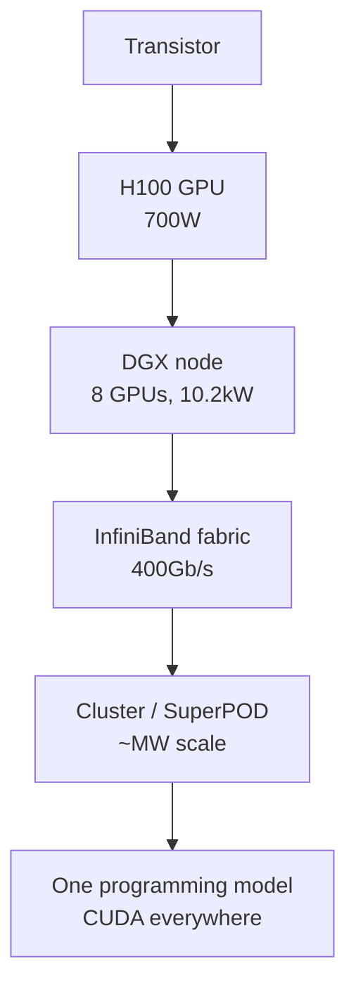

## Why this chapter exists

The ten episodes give you the economics of NVIDIA's moat in rich detail, but they never open the machine. This chapter covers the three hardware angles the track promises, in the episodes' own small-to-big order: the chip, the rack, the cluster.

**Source key, read this first.** Every claim below carries one of two tags:

- **[E]**, from an episode in this track (ep01-ep10). Traceable to a transcript.
- **[S]**, added from a verified 2026 source, listed in the frontmatter. The episodes did not cover it.

Nothing here is invented. When a number has no tag, the tag of its paragraph applies.

## Part A: why NVIDIA is so expensive, the episode account [E]

Before opening the hardware, the answer in one paragraph, all from the episodes. An H100 sells for $40,000 **[E ep10]**. You are paying for three layers. The silicon (a quarter trillion transistors, ~20,000 cores, 9x the training throughput of the A100) **[E ep10]**. The software (it runs the entire CUDA ecosystem on day one, 4 million developers' code just works) **[E ep10]**. And scarcity (advanced packaging capacity at TSMC is finite and largely reserved by NVIDIA) **[E ep10]**. On top of the chip, NVIDIA sells the solution: eight $40,000 GPUs become a $500,000 DGX box, roughly $180,000 of extra margin for integration **[E ep10]**. Gross margin climbed from 24 percent in the commoditized era to 70+ percent **[E ep10]**. Expensive is the moat, monetized.

## Part B: inside the H100 [S]

Start with the smallest unit and build up. All specs in this section are **[S]** from NVIDIA's H100 product page unless tagged [E].

**The transistor.** One H100 carries roughly 250 billion transistors **[E ep10]**, built on TSMC's N4 process. Transistors are switches. Everything else is organization.

**The core.** The H100 has about 18,500 CUDA cores **[E ep10]**, simple cores that run the same operation on different data simultaneously (rendering pixels, multiplying matrices). Organized above them: 80 streaming multiprocessors (SMs), each a neighborhood of CUDA cores with shared fast memory, and 640 tensor cores, hardware units specialized for one job, matrix multiplication, the beating heart of neural networks **[E ep10]**.

**Precision is a dial, not a fixed setting.** The same chip delivers 67 TFLOPS at FP32 but 3,958 TFLOPS at FP8 (with sparsity) **[S]**. Lower precision means more operations per second at acceptable accuracy loss, and the H100's Transformer Engine switches precision per layer automatically **[S]**. This is why "FLOPS" alone never prices a chip: the number depends on the precision you measure at.

**Memory: HBM3.** 80 GB of high-bandwidth memory at 3.35 TB/s **[S]**. HBM stacks memory dies vertically next to the GPU instead of spreading them around a board, shorter wires, enormous bandwidth. Memory bandwidth, not raw compute, is usually the bottleneck in training **[S]**. (The H200, same architecture, upgrades this to 141 GB of HBM3e at 4.8 TB/s **[S]**.)

**Interconnect: NVLink.** 900 GB/s GPU-to-GPU bandwidth on the SXM variant, versus 128 GB/s over PCIe Gen5 **[S]**. SXM is NVIDIA's soldered server GPU board form factor, used in place of PCIe add-in cards. This 7x gap is why the form factor matters. The SXM version (700W TDP, liquid-cooled) is the training chip. TDP means thermal design power: the maximum heat the cooling system must remove. The PCIe version (350W, air-cooled) is for inference and single-GPU work **[S]**.

**Power.** Up to 700W per GPU **[S]**, roughly a microwave oven, concentrated in a chip the size of your palm. Power, not lithography, is now the binding constraint on each generation **[E ep10]**.

```ascii
Inside one H100 (small to big)
250B transistors (TSMC N4)
  -> 18,500 CUDA cores + 640 tensor cores
    -> 80 streaming multiprocessors
      -> 80 GB HBM3 @ 3.35 TB/s
        -> NVLink 900 GB/s to 7 siblings
          -> 700W TDP: a microwave in your palm
```

Figure 1. Inside one H100 (small to big). AI Podcast Curriculum, ep11 synthesis; built from [S] specs verified live against NVIDIA's H100 product page.

## Part B continued: inside the DGX H100 rack [S]

Eight H100s do not make a computer. The DGX H100 system does. Specs **[S]** from NVIDIA's DGX H100 user guide. Three terms in the table need definitions first. NDR is an InfiniBand speed grade, 400 Gb/s per port. PSU means power supply unit. 8U means eight rack units tall. One rack unit (U) is 1.75 inches, so the box is 14 inches high.

| Component | Spec |
|---|---|
| GPUs | 8x H100 SXM, 640 GB total HBM3 |
| GPU interconnect | 4x NVSwitch, 900 GB/s GPU-to-GPU |
| Compute | 32 petaFLOPS at FP8 |
| CPUs | 2x Intel Xeon Platinum 8480C, 112 cores total |
| System memory | 2 TB DDR5 |
| Storage | 2x 1.92 TB NVMe (OS) + 8x 3.84 TB NVMe (data cache) |
| Networking | 8x ConnectX-7, up to 400 Gb/s InfiniBand (NDR) |
| Power | 10.2 kW max; 6x 3.3 kW PSUs, 4+2 redundant |
| Form factor | 8U rackmount, 19 in wide |
| Weight | 287.6 lbs (130.45 kg) |
| Operating temp | 5-30 C |

Read the power line carefully: one 8-GPU box draws 10.2 kW at max, about what seven US homes draw together. The six power supplies exist because at this density, a PSU failure cannot be allowed to stop training **[S]**. The CPUs are almost an afterthought: 112 Xeon cores exist to feed data to the GPUs, not to compute **[S]**.

Two networks leave the box, and the distinction is the whole game:

- **Scale-up (inside the box):** NVLink/NVSwitch at 900 GB/s lets 8 GPUs share memory as if they were one giant GPU.
- **Scale-out (between boxes):** InfiniBand at 400 Gb/s per port connects boxes into a cluster **[S]**. NVIDIA's Mellanox acquisition (ep08) was the purchase of this layer **[E ep08]**.

The 2019 lesson that made Mellanox look prescient: training the 8.3-billion-parameter Megatron model taught NVIDIA that frontier models must run across many servers and racks, so bandwidth *between* machines became the constraint **[E ep10]**. The cluster is the computer **[E ep10]**.

## Part C: building an AI cluster

Now assemble the full picture, [E] and [S] together.

**Step 1, the node.** One DGX H100: $500,000, 10.2 kW, 8 GPUs acting as one via NVSwitch **[E ep10] [S]**.

**Step 2, the fabric.** Connect nodes with InfiniBand (up to 400 Gb/s per port, 8 ports per DGX) **[S]**. The SuperPOD from ep10, 256 Grace Hopper racks in one wall, priced in the hundreds of millions **[E ep10]**, is simply this step taken to its logical end: the entire data center designed as one machine.

**Step 3, power and cooling.** This is where cluster dreams meet physics. Worked example, all **[S]** specs with arithmetic shown:

```ascii
A 1,000-GPU training cluster (Fermi estimate)
GPUs:        1,000 H100s / 8 per DGX = 125 DGX H100 boxes
Hardware:    125 x $500,000 = $62.5M (before networking)
Power:       125 x 10.2 kW = 1.275 MW (compute alone)
Add ~30% for networking, cooling, overhead -> ~1.7 MW facility
Cooling:     must hold every rack between 5 and 30 C
```

Figure 2. A 1,000-GPU training cluster (Fermi estimate). AI Podcast Curriculum, ep11 synthesis; built from [S] specs verified live against NVIDIA's DGX H100 user guide.

1.7 megawatts is a small factory's power draw, and it must never blink: a power dip mid-training can waste weeks of a run. This is why the episode's cloud-rental math exists, $100/hour for 8 H100s **[E ep10]**, and why DGX Cloud's ~6-month capex payback **[E ep10]** is possible: the barrier is not the GPUs, it is the building around them.

**Step 4, software.** The box ships with DGX OS and NVIDIA Base Command for orchestration, scheduling, and cluster management **[S]**. But the real software story is [E]: every developer you have runs CUDA on day one **[E ep10]**, and the cluster is programmable through the same stack as a single GPU. That continuity, laptop to DGX to SuperPOD, one programming model, is the 10,000 person-year moat expressed as a product **[E ep10]**.

**Step 5, the economics check.** Revisit Jensen's line: "the more you buy, the more you save" **[E ep10]**. At cluster scale it becomes literal: a Fortune 500 company building generative AI on its own infrastructure pays more in time, energy, and integration than buying the SuperPOD and being live in a month **[E ep10]**. The cluster is not expensive relative to the alternative. The alternative is expensive relative to the cluster.



Figure 3. From transistor to one programming model. AI Podcast Curriculum, ep11 synthesis; toy built from [E] ep10 claims and [S] specs.

## Questions and answers

> [!QA]
> **Q1: Why is memory bandwidth (3.35 TB/s) more important than FLOPS for training? [S]**
> A: Training moves model weights and activations to the cores constantly. If the cores wait for data, FLOPS sit idle. HBM3's 3.35 TB/s exists to keep ~20,000 cores fed. A chip with double the FLOPS but half the bandwidth trains slower on memory-bound workloads. Always read bandwidth first. Read FLOPS second.
> **Follow-up:** The H200 keeps the same FLOPS but raises bandwidth to 4.8 TB/s. Which workloads benefit most from an H200 over an H100, and which barely notice?

> [!QA]
> **Q2: What is the difference between scale-up (NVLink) and scale-out (InfiniBand), and why do you need both? [S/E]**
> A: Scale-up (900 GB/s NVLink/NVSwitch) makes 8 GPUs behave as one giant GPU, needed when a single model layer does not fit on one card. Scale-out (400 Gb/s InfiniBand) connects nodes when the model or batch does not fit on eight cards. NVLink is ~2x the bandwidth because intra-node traffic is denser. InfiniBand trades bandwidth for distance. The Megatron lesson [E]: at frontier scale, the between-machine bandwidth is the constraint that decides training speed.
> **Follow-up:** A model needs 1 TB of memory for weights. How many H100s (80 GB each) at minimum, and does it fit in one DGX (640 GB total)? What does your answer imply about the interconnect you need?

> [!QA]
> **Q3: Why does a DGX need six 3.3 kW power supplies for a 10.2 kW load? [S]**
> A: Redundancy: 4+2 means any two PSUs can fail and the box keeps training. At $500K per box and $100/hour rental rates, an hour of downtime costs more than the spare PSUs. Reliability engineering at this scale is priced against the cost of interrupted training runs, not against the hardware.
> **Follow-up:** Estimate the cost of a 24-hour outage on your 1,000-GPU cluster at $100/hour per 8 GPUs. Compare it to the cost of redundant power for the whole cluster.

> [!QA]
> **Q4: The episode says power is the binding constraint, not lithography. What does that mean in practice? [E/S]**
> A: TSMC can still shrink transistors (N4 and beyond), but each generation's TDP climbs, 400W (A100) to 700W (H100) to 1,000W (B200) [S]. A rack has a fixed power and cooling budget. When the chip wants more watts than the building can remove as heat, you cannot deploy it no matter how fast it is. Data center design is now thermal design.
> **Follow-up:** Your facility can cool 20 kW per rack. How many DGX H100s (10.2 kW each) fit per rack, and what does the stranded half-rack cost you per year at $100/hour per box?

> [!QA]
> **Q5: Reconcile "the more you buy, the more you save" with a $500K box. [E]**
> A: Jensen's claim [E ep10]: a company building AI on general-purpose infrastructure pays more over time, in energy, engineering time, and delayed results, than buying the integrated system and being live in a month. The savings are in total cost and time-to-value, not in the purchase price. It is only true because the alternative (doing it yourself) is genuinely worse. That is what a real moat feels like from the inside.
> **Follow-up:** Build the 3-year TCO comparison for one DGX H100: buy ($500K + power + staff) vs rent ($100/hr equivalent). At what utilization does buying win?

> [!QA]
> **Q6: If CUDA is the moat, why does NVIDIA bother with the hardware at all? Why not just sell software? [E/S]**
> A: Because the hardware is where the margin compounds: $320K of GPUs become a $500K box [E], and the hardware refresh cycle (every ~2.5 years, 9x training gains [E]) re-sells the software moat each generation. Software alone would be licensed once. Hardware+software is re-monetized every cycle. The bundle is the business model.
> **Follow-up:** Who captures more lifetime value from one AI cluster: the GPU vendor, the cloud renting it, or the company training the model? Defend with numbers from this chapter.

> [!QA]
> **Q7: What breaks first when you scale from 8 GPUs to 8,000? [S/E]**
> A: In order: inter-node bandwidth (InfiniBand fabric design [S/E]), power delivery and cooling (MW scale [S]), reliability (with 8,000 GPUs, something is always failing, checkpointing becomes mandatory), and finally software (keeping 8,000 GPUs synchronized). Each order of magnitude has a different bottleneck. The skill is knowing which one you are currently hitting.
> **Follow-up:** Sketch the failure budget: if each GPU has a 1% daily failure probability, how many failures per day in an 8,000-GPU cluster? What does that imply for checkpoint frequency?

## Memory aids

1. **[S] 700W in your palm.** One H100's TDP. Power is the constraint now, not transistors.
2. **[S] 3.35 TB/s before FLOPS.** Read memory bandwidth first when pricing training hardware.
3. **[S] 900 vs 128.** NVLink GB/s versus PCIe GB/s. The 7x gap is why form factor decides workload.
4. **[S/E] 10.2 kW per box.** One DGX H100 draws what ~7 homes draw. Multiply before you buy.
5. **[E] The cluster is the computer.** The Megatron lesson: bandwidth between machines is the frontier constraint.
6. **[S] Scale-up vs scale-out.** NVLink inside the box, InfiniBand between boxes. Two networks, two jobs.
7. **[E] $62.5M and 1.7 MW.** The Fermi cluster: 1,000 GPUs in one line of arithmetic. Do this math before any hardware meeting.
8. **Never confuse [S]:** FP32 FLOPS with FP8 FLOPS, the same chip is "67 TFLOPS" and "3,958 TFLOPS" depending on precision. Ask which precision a benchmark uses before comparing.
9. **Trap card [E/S]:** "More GPUs = proportionally faster training." Interconnect, power, and failures eat the linearity. Doubling GPUs never doubles speed at scale.

## How to imbibe this

1. **This week:** run the Fermi cluster math for a workload you care about, how many GPUs, how many DGX boxes, total power, total hardware cost. One page. You now know more about AI infrastructure economics than most people who buy it.
2. **Read specs like an owner:** the next time you see a chip announcement, extract four numbers first, memory bandwidth, interconnect bandwidth, TDP, precision-specific FLOPS. Everything else is marketing.
3. **Practice the bottleneck shift:** for any system you work on, name the current bottleneck and the next one after it breaks. Clusters teach this explicitly (bandwidth → power → reliability). Your systems have the same chain.
4. **Observable behavior:** in your next cloud-bill review, separate compute cost from the implied hardware: at $100/hour per 8 H100s, compute what the provider paid and what you pay. The ratio is the integration-and-risk premium, decide consciously whether it is worth it.

## Think it yourself

1. **Compute [S]:** a DGX H100 does 32 petaFLOPS at FP8. What is the FLOPS-per-watt at 10.2 kW system power? (Answer: 32×10^15 / 10,200 ≈ 3.1 TFLOPS/W.) Now compute per-GPU using 700W × 8. Why do the two numbers differ?
2. **Fermi [S/E]:** training GPT-3-class models reportedly took thousands of GPUs for months. Using $100/hour per 8 H100s, estimate the rental cost of 1,000 GPUs for 30 days. (Answer: 125 × $100 × 24 × 30 = $9M.) What does this imply about who can train frontier models?
3. **Reasoning [E/S]:** NVIDIA's gross margin went 24% → 70%+. Decompose how much came from silicon pricing power, how much from bundle margin, and how much from software lock-in. Defend your split with numbers from this chapter.
4. **Journaling:** "The cluster is the computer." Write 300 words on what changes when the unit of computing stops being the chip and becomes the building, for engineers, for economics, for geopolitics.
5. **Unaided:** design a 256-GPU cluster purchase: node count, fabric topology, power budget, cooling requirement, and 3-year TCO vs cloud rental. One page, all arithmetic shown, every claim tagged [E] or [S].

## Skills you can now use

- **Read any AI hardware spec sheet:** extract memory bandwidth, interconnect, TDP, and precision-specific FLOPS first, the four numbers that determine real training performance.
- **Size an AI cluster on paper:** convert GPU counts to DGX boxes, power (MW), cooling, and dollars in one Fermi pass, before any vendor meeting.
- **Separate scale-up from scale-out problems:** diagnose whether a distributed training bottleneck lives inside the node (NVLink) or in the fabric (InfiniBand), and know which purchase fixes which.
- **Compute TCO honestly:** weigh buy-vs-rent with utilization, power, staff, and outage risk, not just the sticker price.
- **Trace any moat to physics:** follow the chain from software lock-in down to watts and packaging capacity, and identify which link is truly uncopyable.

## Go deeper

- [NVIDIA H100 Tensor Core GPU, official specifications](https://www.nvidia.com/en-us/data-center/h100/?ref=hackernoon.com), the [S] source for every chip spec in Part B.
- [NVIDIA DGX H100 User Guide](https://docs.nvidia.com/dgx/dgxh100-user-guide/introduction-to-dgxh100.html), the [S] source for every rack spec: power, networking, mechanical.

## Figure audit

| Unit | Figure | Type |
|---|---|---|
| H100 anatomy | Inside-one-H100 ladder | ASCII ≤ 12 lines |
| DGX H100 anatomy | Full spec table | Table |
| Cluster build | 1,000-GPU Fermi estimate | ASCII ≤ 12 lines |
| Chip → cluster | Scale-up/scale-out progression | mermaid ≤ 8 nodes |
| Every unit tagged | [E]/[S] source key at top; no untagged claims | No blank cells |
