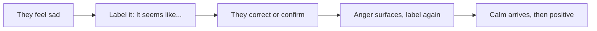

## Why this episode matters

This is the second most-watched episode in the track, with about 4.29 million views at the time of research. Chris Voss was the FBI's lead international kidnapping negotiator. His book "Never Split the Difference" moved his methods from hostage scenes to business and family life. The episode's central claim: every hard conversation is a negotiation, and negotiation is not combat. It is information gathering driven by empathy.

Two sentences carry the philosophy. "There is no deal, or a better deal." And "the sin is a slow goodbye to a dead deal." Walking away fast from a bad deal beats grinding toward one. The episode teaches the voice, the labeling, the mirroring, the calibrated questions, and the no-oriented questions that let you gather information while the other side feels heard. Where episode 1 tuned your cues, this episode tunes your ears and your questions.

### Start with the voice

Voss teaches three voices.

1. The late-night FM DJ voice: low, slow, calm, with a downward inflection. Use it most of the time. It signals control and safety.
2. The positive, playful voice: relaxed and smiling. Use it for the bulk of normal conversation. The episode stresses playful over exciting. When his luggage was lost, the agent who helped him most used a magic wand tone, playful and unhurried, not pumped up.
3. The direct, assertive voice: firm and flat. Use it rarely. It triggers pushback.

Huberman adds the neuroscience in the episode: low-frequency, calm voices entrain the listener's nervous system toward calm. Your voice is a remote control for their state. Speak slowly and their heart rate follows.

Definition: tactical empathy is the deliberate use of empathy as an information tool. It is the practiced ability to recognize the other person's perspective and emotions, name them accurately, and use that understanding to move the conversation. Compassion and niceness are different aims.

### Emotion beats logic in order

Voss describes emotion as rock, paper, scissors. Sadness beats into anger. Anger beats into calm. Calm opens into positive feelings. You cannot jump from furious to happy. You walk the sequence. Labeling is the tool that walks it.

Definition: labeling means naming the other person's emotion or situation out loud, tentatively. "It seems like this feels frustrating." "It looks like you feel unheard here." The label does not need to be perfect. A wrong label still works because the person corrects you, and the correction is information.

The episode's rule: react before you answer. When someone hits you with something hot, label first, answer second. The label buys your thinking brain time and lowers their alarm.

### Mirroring gets them talking

Definition: mirroring means repeating the last one to three critical words of what someone just said, with an upward, curious inflection. "We cannot do that." "Cannot do that?" Then silence. Most people fill silence with information.

Two rules keep mirroring clean. Mirror one to three words, not whole sentences. And keep it to one move per text message. Long texts with three asks get one answer to the easiest ask. One text, one move.

The Nick Nanton two-line text, cited in the episode, shows the discipline. Two lines, one ask, easy to answer yes to. Brevity respects the reader and raises the reply rate.

### The accusation audit clears the air

Definition: the accusation audit means listing the worst things the other side could think about you, out loud, before they say them. "You probably think I will waste your time." "You might feel this is just another sales pitch." Each audited accusation defuses one land mine.

Voss pairs it with the inoculation phrase: "This will sound harsh." Saying it first lets the listener brace, which makes the harsh thing land softer. The episode cites Robert Mnookin and the Kotler framing: tactical empathy transmits information, not warmth. You show you see their world instead of asking them to like you.

### Calibrated questions hand over control

Definition: a calibrated question starts with how or what, never with why. "How am I supposed to do that?" "What makes this a priority for you?" Why sounds like an accusation. How and what force slow thinking. The episode cites Daniel Kahneman's fast and slow thinking: how and what questions engage the deliberate system.

Calibrated questions give the other side the illusion of control while you steer. "How do I know you will follow through?" is the fair question Voss recommends when someone promises the moon. It forces them to solve your problem.

Fair questions also test threats. The specificity test: a vague threat, like losing an egg, is noise. A specific threat, like "tomorrow your son dies," is signal. Ask for specifics and bluffs collapse. The episode adds the double dip warning: some counterparts take a concession and then ask again. Proof of advantage means you verify the threat or the promise before you pay for it.

### No is the start, not the end

Most people fear no. Voss chases it. "No" makes people feel safe and in control, and safe people talk. No-oriented questions beat yes-oriented ones. "Would it be a bad idea if we tried this?" gets a real answer. "Do you agree?" gets a polite lie.

The win-win trap: if someone says "win-win" in the first five minutes, treat it as a pickpocket flag. Real partners do not need the label that early. The label that early means someone manages you.

Urgency is the scam flag. Legitimate deals survive verification. The Vegas breakfast story, told in the episode: a supposed urgent deal fell apart the moment Voss insisted on verifying it over breakfast. If it cannot wait for a check, it is not a deal.

Wear out the cutthroats. The episode cites Picco's rule: exhaust the other side's will to fight rather than matching their aggression. Patience is a weapon.

### Vision drives the decision

People decide with a picture of the future in their head. Voss's FARC story makes the point: hostages crossed a river to freedom because someone painted the picture of what waited on the other side, not because of arguments about the crossing. Sell the vision first.

Two corollaries. Get the verbal promise last. A promise extracted early is cheap and breeds resentment. Let the vision do the work, then collect the yes. And remember that people lie in twenty ways and tell the truth in one way. When the story keeps changing shape, you hear fabrication. When it stays simple and consistent, you hear the truth.

Hypothesis testing is the disciplined version. Guess their perspective out loud and let them correct you. "It seems like something crossed your mind." Alignment, not mind reading. The episode stresses that labels describe moments, not fixed meanings. A label is a probe, not a diagnosis.

### Firing and the hard no

Some conversations are terminations. Voss is blunt: there is no gentle way to cut somebody's head off. Do it on Monday, not Friday, so the person can act instead of stewing through a weekend. Warn first, then keep the meeting under three seconds of small talk before the news. Dragging it out is cruelty dressed as kindness.

The straight shooter versus blunt distinction matters here. A straight shooter is direct and respectful. Blunt is direct and careless. One keeps the relationship. The other spends it.

### Recharge and practice

Ego depletion is real and it is bad for deals. Decision fatigue makes you concede or snap. Voss recharges during implementation: after the hard part, let the routine part restore you.

Practice on small stakes. Talk to Lyft drivers. His suggested opener: "What do you love about driving for Lyft?" Low stakes, real humans, live reps. The CEO clean-water story in the episode shows the same skill at scale: genuine curiosity about a stranger's mission opened a door no pitch could.

Venting needs a taxonomy. Frustration points at the future denied. Anger points at the past. Label which one you hear and the speaker feels understood instead of managed.

### The family and the team rules

In kidnappings, Voss's rule was: tape, do not live-call, when families speak to captors. A live call lets emotion hijack the message. A recording lets you control every word. The business version: do not send the angry email live. Draft it, tape it, review it.

Humanize yourself early. "I am Chris." First names break the dehumanization script. The episode cites the 1990 Good Guys case and the Prince's Gate siege: once a captor sees the negotiator as a person, the math of harm changes.

Figure 1. The three voices and when to use them, per the episode. AI Podcast Curriculum, ep02 (Chris Voss, 2023-10-02). Shell 1. Show a toy with at most 8 items. Source: original toy, from episode claims.
| Voice | Sound | Use |
|---|---|---|
| Late-night FM DJ | Low, slow, downward inflection | Most of the negotiation |
| Positive, playful | Relaxed, smiling | Normal conversation, building rapport |
| Direct, assertive | Firm, flat | Rarely, only for hard boundaries |

Figure 2. The labeling sequence, per the episode. AI Podcast Curriculum, ep02 (Chris Voss, 2023-10-02). Shell 3. Apply one rule.

Figure 3. Question types and their effects, per the episode. AI Podcast Curriculum, ep02 (Chris Voss, 2023-10-02). Shell 1. Show a toy with at most 8 items. Source: original toy, from episode claims.
| Question type | Example | Effect |
|---|---|---|
| Calibrated (how/what) | How am I supposed to do that | Forces slow thinking, they solve your problem |
| No-oriented | Would it be a bad idea to... | They feel safe, give real answers |
| Fair question | How do I know you will follow through | Tests promises before you pay |
| Why question | Why did you do that | Sounds like accusation, avoid |

Figure 4. Red flags in a negotiation, per the episode. AI Podcast Curriculum, ep02 (Chris Voss, 2023-10-02). Shell 3. Apply one rule. Source: original toy, from episode claims.
| Flag | What it means | Response |
|---|---|---|
| Win-win in the first 5 minutes | Pickpocket framing | Slow down, verify everything |
| Urgency, cannot wait | Possible scam | Insist on verification, like the Vegas breakfast |
| Vague threat | Noise, no advantage | Demand specifics |
| Double dip after concession | They will keep taking | Stop conceding, ask for proof of advantage |

## Q&A

1. Why is tactical empathy not the same as being nice?
Niceness aims at being liked. Tactical empathy aims at information. Naming the other person's world accurately makes them correct you, reveal more, and feel heard. The feeling heard is the mechanism, not the goal.

2. How does labeling move someone through rock-paper-scissors emotions?
You cannot jump from sad to positive. Labeling names the current state, which lets it discharge into the next: sadness into anger, anger into calm, calm into positive. Each label must be tentative so the person can correct it.

3. Why mirror only one to three words?
Short mirrors with curious inflection invite elaboration. Long mirrors sound like parroting and trigger defenses. One move per text keeps the same discipline in writing.

4. What is an accusation audit, and why do it before they speak?
Listing their worst suspicions about you out loud defuses each one before it hardens. Unspoken suspicions steer the whole conversation. Spoken ones lose their charge.

5. Why do calibrated questions start with how or what instead of why?
Why sounds like an accusation and triggers defense. How and what engage slow, deliberate thinking and hand the problem to the other side while you keep steering.

6. Why is "no deal or a better deal" the right frame?
A bad deal compounds. Time spent grinding toward one is the real sin. Walking away fast preserves time, bargaining power, and self-respect for the better deal.

7. How do you test whether a threat or promise is real?
Demand specifics. Vague threats are noise. Specific threats are signal. For promises, ask the fair question: how do I know you will follow through. Verify before you pay, as in the Vegas breakfast story.

8. Why tape instead of live-call in emotional moments?
Live emotion hijacks the message. A recording lets you choose every word. The business version is the drafted-but-unsent email: write it hot, send it cold.

## Memory aids

Mnemonic for the toolkit: VLM CQNA. Voice, Labeling, Mirroring, Calibrated questions, No-oriented questions, Accusation audit. "Very Loud Meetings Create Quite Nice Agreements" is the silly version that sticks.

Never-confuse pair: labeling versus agreeing. "It seems like you feel unheard" is not "you are right". Labeling names the emotion. Agreeing endorses the position. You can label without conceding anything.

Never-confuse pair: tactical empathy versus compassion. Compassion feels with someone. Tactical empathy maps someone. The map serves the negotiation. The feeling serves the person. Know which job is yours.

Trap card: the direct assertive voice is not the default. Students overuse it because it feels powerful. In the episode it is the rarest voice. Default to DJ voice, season with playful.

Trap card: mirroring is not mocking. If your inflection sounds flat or sarcastic, the mirror becomes an insult. Curious upward tone or nothing.

## How to imbibe this

This week, run four practices.

1. The DJ voice hour. Take one low-stakes call per day in late-night FM DJ voice: slow, low, downward inflection. Note when the other person slows down to match you.
2. Three labels a day. In any tense moment, say "it seems like" or "it looks like" before you answer. Log the correction or confirmation you get.
3. The mirror drill. In one conversation, mirror the last three words twice with curious inflection, then go silent. Count the seconds before they add information.
4. One accusation audit. Before your next ask, list two bad things they might think about you and say them first. Watch the tension drop.

Self-catching: when you feel the urge to argue, check whether you labeled yet. No label, no argument. Label first, then decide if the argument is still needed.

## Think it yourself

Do these without AI. Use a notebook.

1. Write your last hard conversation as a script. Mark every line where you answered before labeling. Rewrite those lines with a label first.
2. List three upcoming asks. Write one calibrated how/what question and one no-oriented question for each.
3. Draft an accusation audit for a pitch you will make: the four worst things they could think. Read it aloud in DJ voice.
4. Take a vague threat or complaint from your week. Apply the specificity test in writing: what would the specific version sound like. Decide if it was noise or signal.
5. Write the Vegas breakfast test for your current biggest opportunity: what would you verify before committing, and what would make you walk away.

## Skills you can now use

- Open any hard conversation in late-night FM DJ voice and hold it.
- Label emotions tentatively to move people from sad through anger to calm.
- Mirror one to three words to pull information out of silence.
- Run an accusation audit that defuses suspicion before it hardens.
- Ask calibrated how/what questions that make the other side solve your problem.
- Use no-oriented questions to get honest answers.
- Spot win-win framing, false urgency, vague threats, and double dips, and answer each with verification.
- Fire someone with straight-shooter directness: warn, Monday, under three seconds of preamble.
- Practice daily on low-stakes humans: drivers, cashiers, strangers with missions.

## Go deeper

- Book: "Never Split the Difference" by Chris Voss. The full system, with hostage stories behind each tool.
- Book: "Thinking, Fast and Slow" by Daniel Kahneman. The slow-thinking science behind calibrated questions.
- Episode video: https://www.youtube.com/watch?v=q8CHXefn7B4

## Figure audit

| Unit id | Claim | Before | After | Figure id | Medium | Source | Four tests |
|---|---|---|---|---|---|---|---|
| u01 | Three voices | One default voice | Three named voices with use rules | fig1 | table | episode claims | T1: 3-row voice table / T2: voice choice forces a table / T3: none, static plate / T4: DJ voice reused in drills |
| u02 | Labeling sequence | Emotions as a wall | Sad to anger to calm to positive, labeled stepwise | fig2 | mermaid | episode claims | T1: 5-node chain / T2: sequence forces mermaid / T3: none, static plate / T4: label node reused in Q&A |
| u03 | Question types | All questions equal | Four types with distinct effects | fig3 | table | episode claims | T1: 4-row question table / T2: comparing types forces a table / T3: none, static plate / T4: calibrated row reused in skills |
| u04 | Red flags | Gut feeling about bad deals | Four named flags with responses | fig4 | table | episode claims | T1: 4-row flag table / T2: flag-response pairs force a table / T3: none, static plate / T4: Vegas breakfast reused in drills |
