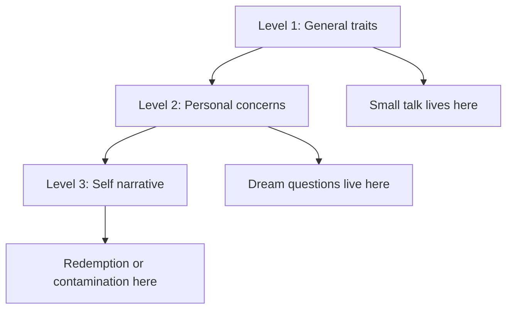

## Why this episode matters

This is Vanessa Van Edwards's return to the track, with about 3.29 million views at the time of research, built around her book "Conversations". Episode 1 gave you cues. This episode gives you the conversation operating system: how to start, how to go deep, how to handle overtalkers, how to exit gracefully, and how to become someone people seek out.

The central claim: most people try to impress in conversation. Impressing fails. The winners try to discover. A discoverer asks, listens, and remembers. The episode backs this with speed-networking experiments run three times with 500 people each. The questions that won and the questions that lost are named, counted, and repeatable. If episode 1 was the body, this episode is the mouth and the ears.

### The discover mindset

Two mindsets enter every conversation. The impresser performs: clever lines, name drops, rehearsed stories. The discoverer explores: curious questions, real listening, follow-ups. The episode's verdict is blunt. Impressing creates dread, overwhelm, and the feeling of being misunderstood. Those three symptoms are the diagnostic for a bad conversationalist. Discovering creates the opposite: energy, clarity, and the feeling of being known.

Definition: conversational confetti is the impresser's habit of throwing facts hoping something lands. It is the verbal version of spam. The discoverer throws one question and watches what lands.

### The speed-networking experiments

Her lab ran the experiment three times, 500 people each. Everyone rated every conversation. The winners and losers were consistent.

Winning openers: "What was the highlight of your day." "What has you excited about your work." "Any fun plans coming up." Each one asks for a story, a feeling, or a future. Each one hands the other person something good to talk about.

Losing openers: "What do you do" was the worst of all. "How are you" and weather talk rounded out the bottom. Each one asks for a fact or a script. Facts are stop signs. Stories are doorways.

"What is your story" polarized the room: people rated it 5 or 0, never the middle. It is high risk, high reward. Use it only when the warmth is already there.

Figure 1. Winning versus losing openers, per the episode's speed-networking experiments. AI Podcast Curriculum, ep03 (Vanessa Van Edwards, 2026-09-10). Shell 2. Count or score the toy. Source: original toy, from episode claims.
| Result | Opener | Why it works or fails |
|---|---|---|
| Winner | Highlight of your day | Asks for a story |
| Winner | Excited about your work | Asks for energy and future |
| Winner | Fun plans coming up | Asks for anticipation |
| Loser | What do you do | Gets a job title, a fact |
| Loser | How are you | Gets a script: fine |
| Loser | Weather talk | Gets nothing to hold |

### Feed competition and information gaps

Two mechanics explain why small talk dies. Feed competition: in a group, everyone competes to feed the conversation with facts, so nobody listens. Information gaps: Howard Stern's interview trick, cited in the episode, is to open a gap between what the listener knows and what they want to know, then let the guest close it. A good question opens a gap. A bad question closes the topic.

The frictionless team ritual applies the same idea at work. Start meetings with "tell me something good" and cap it at five minutes. The team practices sharing wins before sharing problems, and the information gaps pull people in.

The Seinfeld numbers trick: give the conversation a number and the brain leans forward. "Three things happened on my trip" beats "my trip was great". Numbers promise structure.

### Go one level deeper: dream building

The episode borrows Dan McAdams's three levels from episode 1 and turns them into a ladder. Level 1 is general traits. Level 2 is personal concerns: goals, dreams, projects. Level 3 is the self narrative: the story of your life.

Most conversations stall at level 1. The skill is the level 2 question. Pet projects versus pest projects: ask what someone is building because they love it (pet) versus what drains them (pest). "What have you always wanted to learn" and "what is your biggest goal" are level 2 keys. They ask for dreams, and dreams carry emotion.

Bids are the small offers of connection inside a conversation: a mentioned hobby, a sigh, a glance at a photo. The episode says answering bids takes the courage to be disliked, because following someone's bid means leaving your own agenda. Missed bids are where conversations quietly die.

"Been busy" is named the worst check-in question. It invites a competition of exhaustion. Replace it with a level 2 question.

### The intro formula

When someone asks what you do, do not give the title. Use the formula: "I do blank for who, by how." Fill it with the outcome and the method. "I help nervous speakers become stage-ready through cue training." The formula turns a fact into a doorway.

Behavioral interviewing gets the same treatment. Do not ask hypothetical questions. Ask for the last time they did the thing. Past behavior, told as a story, predicts better than any hypothetical.

The Instagram handle move: at the end of a good conversation, ask for the Instagram handle, not the phone number. A number is intimate and high pressure. A handle is public and low pressure. Lower pressure gets more yeses.

### The overtalker problem

The numbers are stark. About 95 percent of people report working with an overtalker. The cost runs about 90 minutes a day. About 71 percent took evasive action, like blocking calendars or avoiding the person [uncertain: the episode states these figures from lab surveys. The exact evasive actions were listed quickly on air].

The five-question overtalker test, from the episode:

1. Do they answer questions you did not ask.
2. Do they repeat the same point in new words.
3. Do they interrupt with their own story.
4. Do they miss your bids to change topic.
5. Do you feel tired after talking with them.

Three yeses and you have an overtalker. The yap challenge is the self-test version: record yourself telling a story and count how long before you invite the listener back in. The Candor Corpus finding sets the bar: good conversational turns run 15 to 30 seconds, 45 at most. Past 45 seconds you broadcast.

Voice notes are named the most selfish conversation format. The sender talks without interruption and the receiver cannot respond in real time. Keep them short or do not send them.

The open-fish cue is the rescue signal: when a listener's mouth hangs slightly open, they try to enter the conversation. That is your cue to stop and invite them in.

Entertainers versus appreciators reframes the goal. The green-room AV guy story: the most beloved person backstage was not the funniest comic but the technician who made everyone feel heard. Appreciators win the room. Entertainers rent it.

The conversational narcissist is driven by insecurity, not arrogance. They steer every topic back to themselves because silence feels dangerous. The episode cites a survey of 4,000 people: the most feared moment was the awkward silence. The fix is assertive curiosity: ask the question you actually want answered, and tolerate the pause.

Smart people kill dreams by fact-checking instead of gut-checking. When someone shares a dream, the smart response checks the facts and finds the flaws. The connecting response checks the feeling and joins the excitement. Facts first is dream murder.

### Redemption versus contamination

At level 3, the self narrative, the episode draws the line between redemption and contamination stories. In a redemption narrative, suffering leads to growth. In a contamination narrative, good things get ruined. The cited research: people who tell redemption stories live longer, show stronger immune function, and hold a more internal locus of control.

The bird versus roller coaster image makes it stick. The contamination narrator is strapped into a roller coaster: things happen to them. The redemption narrator is the bird: they move through the weather. Listen for narrative hints in always and never language. "I always mess this up" is contamination talking. "I never get a break" is the same.

"Do you feel lucky" gets three answers, and each reveals the narrator. The lucky-feeling person tells redemption. The unlucky-feeling person tells contamination. The third answer, the hedged one, tells you they have not chosen yet.

The five archetypes help you read the narrator fast: the ambitious hero, the contented pragmatist, the selfless helper, the creative disruptor, and the unlucky struggler. The episode adds Bill Eddy's finding that about 10 percent of people are high-conflict personalities. When you meet one, the archetype to use is not hero or helper. It is boundary-setter.

The character question from episode 1 returns with an upgrade: brainstorm your own answers with AI before the event, so you have stories ready. And prep answers as gifts. The Jason story: a man with no sense of taste or smell prepped vivid food stories as gifts for dinner parties. Preparation is generosity.

### The graceful exit

Conversations follow the peak-end rule: people remember the peak moment and the ending. So design the ending. The episode's exit sequence:

1. Future question: "What are you looking forward to." It ends on anticipation.
2. Compliment or action: name something specific you liked, or promise a specific follow-up.
3. Exit voice: shift to a slightly brighter, conclusive tone.
4. Step back: physically move. The body ends what the mouth started.

Never let a good conversation rot into an awkward one. Exit at the peak.

### Aura: be easy to talk to

Definition: aura, in this episode, is the quality of being easy to talk to. It means approachability plus energy, not mystique.

The liking gap: people like you more than you think they do. The Schmobbert story makes it concrete: a man assumed everyone found him awkward until he learned the room liked him all along. At a VIP party, the line that worked was "I am a recovering awkward person." Naming the fear disarms it.

Physical aura has three parts. Space: hold your ground instead of shrinking. Maximum resonance point: speak from the place in your body where your voice carries best, usually lower and more forward than you think. Hello on the outbreath: say hello while exhaling so the voice sounds warm instead of tight.

Eye contact runs 60 to 70 percent, from episode 1, with the added note: eye contact builds oxytocin during connection, but breaks thinking during processing. Look away to think. Look back to connect.

Listening cues repeat from episode 1 with a purpose: triple nod, head tilt, lean, lower lid flex. And the final instruction: be dynamic. Vary pace, volume, and energy. Monotone kills aura faster than any awkwardness.

Only 3 in 10 Americans socialize daily, per the episode's cited figure. Aura is scarce because practice is scarce.

Figure 2. The conversation ladder, per the episode. AI Podcast Curriculum, ep03 (Vanessa Van Edwards, 2026-09-10). Shell 3. Apply one rule. Source: original toy, from episode claims.

Figure 3. The overtalker test, per the episode. AI Podcast Curriculum, ep03 (Vanessa Van Edwards, 2026-09-10). Shell 1. Show a toy with at most 8 items. Source: original toy, from episode claims.
| # | Test question | Yes means |
|---|---|---|
| 1 | Answers questions you did not ask | Broadcasting |
| 2 | Repeats the point in new words | No editing |
| 3 | Interrupts with their own story | Narcissist pattern |
| 4 | Misses your bids to change topic | Not listening |
| 5 | You feel tired after | Energy cost |

Figure 4. The graceful exit sequence, per the episode. AI Podcast Curriculum, ep03 (Vanessa Van Edwards, 2026-09-10). Shell 3. Apply one rule. Source: original toy, from episode claims.
| Step | Move | Purpose |
|---|---|---|
| 1 | Future question | End on anticipation |
| 2 | Compliment or action | Peak-end rule: finish high |
| 3 | Exit voice | Tone signals closure |
| 4 | Step back | Body ends what mouth started |

## Q&A

1. Why does the discover mindset beat the impress mindset?
Impressing triggers dread, overwhelm, and feeling misunderstood. Discovering triggers energy and feeling known. The speed-networking experiments showed curious questions won three times out of three with 500 people each.

2. Why is "what do you do" the worst opener?
It asks for a fact, and facts are stop signs. It gets a job title and the conversation stalls at level 1. The winning openers ask for stories, feelings, or futures, which are doorways.

3. What is an information gap, and how does Howard Stern use it?
A gap between what the listener knows and wants to know. Stern opens the gap early and lets the guest close it slowly. The listener stays because the brain hates an open gap.

4. What is the Candor Corpus finding, and what does it imply?
Good conversational turns run 15 to 30 seconds, 45 at most. Past that you broadcast. The implication is mechanical: set a mental timer and hand the turn back.

5. How do redemption and contamination narratives differ in outcomes?
Redemption narrators, who turn suffering into growth, live longer, show stronger immune function, and hold a more internal locus of control. Contamination narrators, for whom good things get ruined, show the reverse pattern.

6. Why is the Instagram handle a better ask than the phone number?
A number is intimate and high pressure. A handle is public and low pressure. Lower pressure gets more yeses, and the connection still forms.

7. What is the liking gap, and how do you use it?
People like you more than you estimate. Knowing this, you can risk the warmer opener, the honest line like "recovering awkward person", and the graceful exit, because the room is already on your side.

8. When should you exit a conversation?
At the peak, using the four-step sequence: future question, compliment or action, exit voice, step back. The peak-end rule means the ending writes the memory.

## Memory aids

Mnemonic for the ladder: TCD. Traits, Concerns, Deeps narrative. "The Conversation Deepens" as you climb TCD.

Mnemonic for the exit: FCE S. Future question, Compliment, Exit voice, Step back. "Finish Clean, Exit Smooth."

Never-confuse pair: entertainer versus appreciator. The entertainer performs at the room. The appreciator listens to the room. Backstage, the AV guy who listened beat every comic who performed.

Never-confuse pair: fact-checking versus gut-checking a dream. Fact-checking audits the plan and kills the excitement. Gut-checking joins the feeling and keeps the dreamer talking. Connect first, audit later and only if asked.

Trap card: "what is your story" is not a safe opener. It polarized the experiments: 5 or 0. Save it for warm rooms.

Trap card: voice notes feel efficient to the sender and selfish to the receiver. If the note runs long, you taxed someone who could not interrupt. Keep it under a minute or call instead.

## How to imbibe this

This week, run four practices.

1. The opener swap. For seven days, open with one winning question: highlight of the day, excited to work on, or fun plans. Log which one gets the longest answer.
2. The turn timer. In three conversations, silently count your turns. If any runs past 45 seconds, note where the pass-back should come.
3. The bid journal. After each social event, write three bids you noticed and whether you answered them. Aim to answer two of three next time.
4. The graceful exit. End two conversations this week with the four-step sequence. Note whether the person seeks you out next time.

Self-catching: when you feel the urge to impress, name it silently: "confetti incoming." Replace the fact you were about to throw with one level 2 question.

## Think it yourself

Do these without AI. Use a notebook.

1. Write your current answer to "what do you do". Rewrite it in the "I do blank for who, by how" formula. Test both on a friend and record which gets a follow-up question.
2. Draft your signature question by reverse engineering: what do you wish people asked you. Write it, then ask it to three people this week.
3. Take one of your life stories and label it redemption or contamination. Rewrite the contamination version as redemption without changing the facts. Note what changes.
4. Identify your archetype from the five. Write one paragraph on how that archetype helps you in conversation and one on how it hurts.
5. Prep three answers as gifts for your next event, Jason-style: stories you can give away. Deliver one and note the reaction.

## Skills you can now use

- Open with a winning question and skip the four losing openers.
- Climb the ladder: traits to concerns to narrative, with a level 2 dream question ready.
- Run the intro formula: I do blank for who, by how.
- Diagnose overtalkers with the five-question test and rescue conversations with the open-fish cue.
- Keep turns under 45 seconds and read the room for bids.
- Exit at the peak with the four-step sequence.
- Read narratives: redemption versus contamination, the five archetypes, the high-conflict 10 percent.
- Build aura: space, resonance, hello on the outbreath, 60 to 70 percent eye contact, dynamic delivery.

## Go deeper

- Book: "Conversations" by Vanessa Van Edwards. The full system behind this episode.
- Book: "Cues" by Vanessa Van Edwards. The cue science from episode 1.
- Research: Dan McAdams on the three levels of personality. Traits, concerns, narrative.
- Research: Bill Eddy on high-conflict personalities. The 10 percent finding.
- Episode video: https://www.youtube.com/watch?v=q2cg1gEYWJQ

## Figure audit

| Unit id | Claim | Before | After | Figure id | Medium | Source | Four tests |
|---|---|---|---|---|---|---|---|
| u01 | Opener rankings | All openers feel equal | Winners and losers from 3x500 experiments | fig1 | table | episode claims | T1: 6-row opener table / T2: ranking openers forces a table / T3: none, static plate / T4: opener names reused in drills |
| u02 | Conversation ladder | Conversation as one blob | Three levels with a climbing path | fig2 | mermaid | episode claims, McAdams | T1: 6-node ladder graph / T2: levels force mermaid / T3: none, static plate / T4: TCD mnemonic reuses the levels |
| u03 | Overtalker test | Overtalkers as a vibe | Five diagnostic questions | fig3 | table | episode claims | T1: 5-row test table / T2: checklist forces a table / T3: none, static plate / T4: test reused in self-catch drill |
| u04 | Graceful exit | Exits happen by accident | Four-step designed sequence | fig4 | table | episode claims | T1: 4-row sequence table / T2: ordered steps force a table / T3: none, static plate / T4: FCE S mnemonic reuses the steps |
