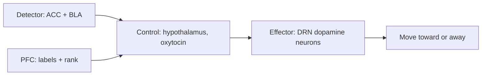

## Why this episode matters

This solo episode, with about 613,500 views at the time of research, is the track's biology core. Episodes 1 through 4 taught skills. This episode explains why the skills work: the brain treats social connection like food, water, and temperature. It runs a homeostatic system that detects your social state and drives you to correct it.

The central claim: bonding is a verb, a process, not a trait. The same generic neural circuit gets repurposed for every bond you form, and it stays plastic across your life. Isolation is not neutral. It raises cortisol and adrenaline, and a molecule called tachykinin drives the irritability of the lonely. Understanding the circuit turns vague loneliness into a set of levers you can pull.

### Social homeostasis: the thermostat underneath the thermostat

Episode 1 gave you the warmth-competence thermostat for impressions. This episode gives you the deeper one. Kay Tye's social homeostasis model, presented in the episode, has four parts.

1. Detector: the anterior cingulate cortex and the basolateral amygdala read your current social state.
2. Control center: the lateral and periventricular hypothalamus, which release oxytocin, decide the correction.
3. Effector: dopamine neurons of the dorsal raphe nucleus drive you toward or away from social contact.
4. The fourth element: the prefrontal cortex adds subjective labels and rank. It turns raw state into stories like "I am lonely" or "I am above this".

Definition: homeostasis is the body's regulation of a variable around a set point. Social homeostasis regulates your level of connection the way temperature regulation handles heat.

Figure 1. The social homeostasis circuit, per the episode (Tye model). AI Podcast Curriculum, ep05 (Andrew Huberman, 2021-12-20). Shell 1. Show a toy with at most 8 items. Source: original toy, from episode claims.

### Loneliness is a signal, not a character flaw

John Cacioppo's definition, cited in the episode: loneliness is the gap between the connection you want and the connection you have. It is a signal like hunger. Two people with identical social lives can feel different loneliness because their set points differ.

Isolation chemistry runs in phases. Acute isolation triggers pro-social craving: you want people more. Chronic isolation flips to antisocial: you want people less and irritability rises. The tachykinin finding names one driver: prolonged isolation raises tachykinin signaling, which produces the cranky, prickly state of the long-lonely.

The Matthews and Tye paper on the dorsal raphe nucleus, cited in the episode: activating those dopamine neurons produced loneliness-like behavior, inhibiting them suppressed it, and the effect depended on social rank. The loneliness neurons are real, localizable, and rank-sensitive.

Dopamine needs a correction here. Dopamine is not the feel-good molecule. It is the movement-toward molecule. It drives craving and pursuit. That is why acute isolation raises social craving through dopamine, and why the same system can drive you away when the state flips.

Introverts get a reframe: they release more dopamine from less interaction. The introvert is not broken at parties. Their circuit saturates faster. Smaller doses, same chemistry.

### Your brain treats people like food

The Saxe and Tye Nature Neuroscience study, cited in the episode: after 10 hours of isolation, images of social scenes activated the brain's craving regions the way food images do after fasting. The reverse also held: fasting made social images more rewarding. Social contact and food run on overlapping craving machinery.

Comfort eating follows the same logic. New love follows it too: the episode notes a satiety window of about 6 days to 6 months in new romance, during which the craving system is fed and quiets. Then the set point reasserts itself and the work of bonding resumes.

The prefrontal cortex works as accelerator and brake on all of this. Huberman's cold shower example: voluntary stress trains the PFC to stay online during discomfort, which keeps the social approach system from shutting down under stress.

### Hearts beat together

The Cell Reports study, cited in the episode: people's heartbeats synchronized when they heard the same story, even at different times. Shared narrative aligns bodies, not just minds. The concert phenomenon is the live version: thousands of strangers breathe and move together because the music gives them one shared timeline.

The holiday tool applies the finding. A shared narrative is a bridge. At a tense family gathering, the story everyone tells together does more bonding work than any topic of conversation. Ram Dass's line about parents, quoted in the episode, points the same way: the bond runs underneath the words.

Huberman's own practice: dancing dates with his sister. The activity is almost irrelevant. The shared rhythm is the mechanism.

### Two kinds of empathy

Allan Schore's attachment model, cited in the episode: the right brain handles autonomic, bodily attachment, while the left brain handles narrative and prediction. The episode warns that pop left-brain right-brain myths are wrong. The real division is body versus story, not logic versus creativity.

Empathy splits the same way. Emotional empathy feels with the other person. Cognitive empathy models what they think. The trust-game imaging studies, cited in the episode, show both systems must run together. Feel without modeling and you drown. Model without feeling and you manipulate.

Breakups hurt through both channels at once. You lose the empathy practice partner and you lose a major oxytocin and dopamine source. The craving system screams for the missing supplier.

Lisa Feldman Barrett's quote, cited in the episode, closes the loop: emotions are constructed by the brain from body signals plus concepts. Change the concepts and you change the emotion. Labeling, from episode 2, is the applied version.

### Oxytocin: the bonding molecule and its limits

Oxytocin's resume, from the episode: social recognition, pair bonding, milk let-down, labor contractions, a pulse after male orgasm with about a 30-minute refractory delay, and modulation by vasopressin. It scales with closeness. The honesty spray studies, cited in the episode, found oxytocin increased truth-telling in lab games.

MDMA releases massive oxytocin, which is why couples trials explored it for therapy. The episode treats it as a research finding, not a recommendation.

The Heliyon paper by Carollo and colleagues, cited in the episode: variants in the oxytocin gene predicted sociability on Instagram. The molecule reaches all the way to post behavior.

Billie Eilish named a song "Oxytocin". The culture knows what the lab found: the molecule is the brand name of bonding.

Limits matter. Oxytocin bonds you to your in-group. It does not automatically extend the circle. Bonding chemistry can deepen tribal lines as easily as it bridges them.

Figure 2. The isolation timeline, per the episode. AI Podcast Curriculum, ep05 (Andrew Huberman, 2021-12-20). Shell 3. Apply one rule. Source: original toy, from episode claims.
| Phase | Duration | Chemistry | Behavior |
|---|---|---|---|
| Acute isolation | Hours to days | Dopamine craving rises | Pro-social: seek people |
| Chronic isolation | Weeks and beyond | Tachykinin rises, cortisol up | Antisocial: irritable, withdrawn |
| Reconnection | Shared narrative, rhythm | Oxytocin rises | Bonding resumes |

Figure 3. Oxytocin's roles, per the episode. AI Podcast Curriculum, ep05 (Andrew Huberman, 2021-12-20). Shell 1. Show a toy with at most 8 items. Source: original toy, from episode claims.
| Role | Example from the episode |
|---|---|
| Social recognition | Knowing who is who |
| Pair bonding | Long-term attachment |
| Birth and nursing | Labor, milk let-down |
| Post-orgasm pulse | About 30-minute delay in males |
| Honesty | More truth-telling in lab games |
| Closeness scaling | More oxytocin with closer bonds |

## Q&A

1. What are the four parts of the social homeostasis model?
Detector (ACC plus BLA), control center (hypothalamus, oxytocin), effector (DRN dopamine neurons), and the PFC adding subjective labels and rank. Together they sense your social state and drive correction.

2. Why is loneliness a signal rather than a flaw?
Cacioppo defines it as the gap between wanted and actual connection. Like hunger, it reports a state and motivates action. Different set points explain why identical social lives feel different.

3. What flips acute isolation into chronic antisocial behavior?
Time plus chemistry. Acute isolation raises dopamine-driven social craving. Prolonged isolation raises tachykinin and stress hormones, producing irritability and withdrawal.

4. How does the 10-hour isolation study prove people are like food for the brain?
After 10 hours alone, social images activated craving regions the way food images do after fasting. Fasting reversed the effect for social images. The craving machinery overlaps.

5. Why do heartbeats synchronize to the same story?
Shared narrative aligns autonomic rhythms across listeners, even at different times. The concert phenomenon is the live version. The mechanism is shared temporal structure, not mystical connection.

6. What is the difference between emotional and cognitive empathy, and why do you need both?
Emotional empathy feels with someone. Cognitive empathy models their thinking. Trust-game imaging shows both must run: feeling without modeling drowns you, modeling without feeling manipulates.

7. What does oxytocin not do?
It does not create universal love. It bonds the in-group and scales with closeness. The same molecule can deepen tribal boundaries.

8. Why do breakups hurt through two channels?
You lose the empathy practice partner and a major oxytocin and dopamine source at once. The craving system keeps firing for a supplier that is gone.

## Memory aids

Mnemonic for the circuit: DCEF. Detector, Control, Effector, Frontal labels. "Detect, Correct, Effect, Frame."

Mnemonic for the isolation phases: CAP. Craving, Antisocial, Pro-social return. Acute means Craving, chronic means Antisocial, reconnection means Pro-social.

Never-confuse pair: dopamine as pleasure versus dopamine as pursuit. The episode is explicit: dopamine drives movement-toward. Pleasure is a different system. Craving without liking explains addiction, stalking exes, and doomscrolling.

Never-confuse pair: bonding as noun versus bonding as verb. A bond is the stored result. Bonding is the ongoing process of shared rhythm, narrative, and vulnerability. Nouns do not need maintenance. Verbs do.

Trap card: oxytocin is not a trust potion for strangers. The in-group limit means it can intensify us-versus-them. Use it to deepen chosen bonds, not to manufacture instant trust.

Trap card: the satiety window of new love, about 6 days to 6 months, ends. Couples who mistake the quiet craving system for permanent compatibility skip building the bonding practices that carry the relationship after.

## How to imbibe this

This week, run four practices.

1. The set-point journal. Each evening, rate wanted versus actual connection from 1 to 10. Note the gap. Watch whether the gap or the absolute level predicts your mood.
2. The shared-narrative bridge. At one tense gathering, tell a story everyone shares instead of raising a topic. Note the change in rhythm.
3. The movement practice. Dance, walk, or exercise in sync with one person this week. Note whether words or rhythm did more bonding work.
4. The tachykinin check. When irritability spikes after days alone, label it: "this is chronic-isolation chemistry." Then schedule contact before deciding anything about anyone.

Self-catching: when you feel the urge to withdraw, ask which phase you are in. Acute craving means go toward people. Chronic irritability means go toward people too, but start with low-demand contact: a walk, not a party.

## Think it yourself

Do these without AI. Use a notebook.

1. Map your last month on the isolation timeline. Mark the acute and chronic phases and what pulled you out.
2. Write Cacioppo's equation for yourself: wanted connection minus actual connection, for family, friends, and romance separately.
3. List three shared narratives in your life: stories your group retells. Write what each one bonds.
4. Separate one recent conflict into emotional versus cognitive empathy failures. Which channel broke first.
5. Design your reconnection protocol: the three lowest-effort bonding actions that reliably work for you.

## Skills you can now use

- Read loneliness as a signal and locate yourself on the acute-chronic timeline.
- Use shared narrative and shared rhythm as bonding tools, not just conversation topics.
- Apply the PFC brake: voluntary stress, like cold exposure, to keep social approach online.
- Separate emotional from cognitive empathy in real time.
- Expect the new-love satiety window and build bonding practices before it closes.
- Treat oxytocin knowledge as a map: deepen chosen bonds, watch the in-group boundary.
- Convert isolation chemistry into scheduled contact instead of judgments about people.

## Go deeper

- Paper: Matthews and Tye on dorsal raphe dopamine neurons and loneliness-like behavior.
- Paper: Saxe and Tye in Nature Neuroscience on social craving after isolation.
- Paper: Carollo and colleagues in Heliyon on oxytocin-gene variants and Instagram sociability.
- Book: "Loneliness" by John Cacioppo. The signal theory of loneliness.
- Episode video: https://www.youtube.com/watch?v=RgAcOqVRfYA

## Figure audit

| Unit id | Claim | Before | After | Figure id | Medium | Source | Four tests |
|---|---|---|---|---|---|---|---|
| u01 | Homeostasis circuit | Bonding as mystery | Four-part circuit with a flow | fig1 | mermaid | episode claims, Tye model | T1: 5-node circuit graph / T2: circuit flow forces mermaid / T3: none, static plate / T4: DCEF mnemonic reuses the nodes |
| u02 | Isolation timeline | Isolation as one state | Three phases with chemistry and behavior | fig2 | table | episode claims | T1: 3-row phase table / T2: phases force a table / T3: none, static plate / T4: CAP mnemonic reuses the phases |
| u03 | Oxytocin roles | Oxytocin as love molecule | Six distinct roles with examples | fig3 | table | episode claims | T1: 6-row role table / T2: role list forces a table / T3: none, static plate / T4: in-group limit reused in trap card |
