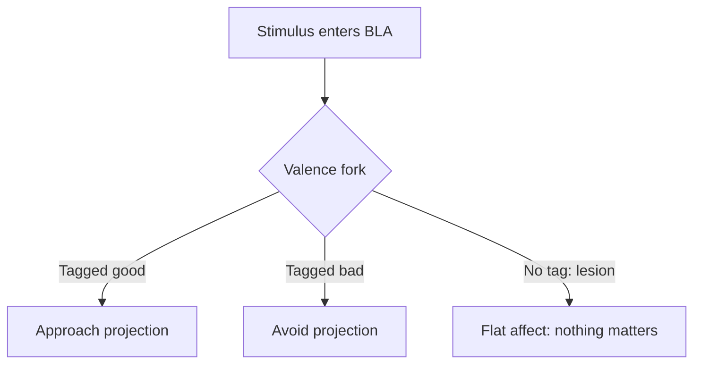

## Why this episode matters

This episode, with about 584,900 views at the time of research, is the track's deep neuroscience core. Dr. Kay Tye runs a systems neuroscience lab studying the circuits behind social behavior. The central claim: the amygdala is not the fear center. It is a valence fork, a switch that tags every experience as approach or avoid, and social life is the constant flipping of that switch.

The episode connects the fork to everything social: why hunger makes judges harsh, why rank changes what your neurons encode, why empathy fails under competition, and why abundance versus scarcity mindsets may be written in experiential statistics. If episode 5 gave you the bonding circuit, this episode gives you the evaluation circuit that decides who gets approached and who gets avoided.

### The amygdala is a fork, not a fear button

The textbook story says amygdala equals fear. Tye's lab says the amygdala equals valence: good or bad, approach or avoid. The evidence starts with Klüver-Bucy lesions. Monkeys with amygdala damage did not become fearless daredevils. They became flat: nothing tagged as good or bad, so nothing was worth approaching or avoiding.

The structure has about 13 subnuclei, each a specialized station. The basolateral amygdala, the BLA, uses glutamate, the brain's main excitatory signal. Reward and fear travel through separate projections out of the BLA. Tye describes presenting this at a Gordon conference and meeting resistance: the field was not ready to let the amygdala do reward.

Patient SM is the human proof. With amygdala damage, she showed no fear of frightening faces, yet a CO2 inhalation challenge triggered full panic. The amygdala evaluates. The body panics on its own hardware. Evaluation and arousal are separable.

The amygdala also answers novelty first and habituates fast. First exposure gets the big response. Repetition quiets it. Every first impression you make rides this curve: loud at hello, fading by the third meeting unless you refresh it.

Figure 1. The valence fork, per the episode. AI Podcast Curriculum, ep06 (Dr. Kay Tye, 2024-02-05). Shell 3. Apply one rule. Source: original toy, from episode claims.

### Hunger rewrites the fork

The amygdala carries ghrelin receptors. Ghrelin is the hunger hormone. When hunger rises, the fork's priorities flip: fear and caution outrank reward and exploration. A hungry brain is a defensive brain.

The Danziger 2011 judges study, cited in the episode, is the human headline. Parole grant rates started near 90 percent after a meal, fell toward 10 percent before the next meal, and the pattern repeated through the day. Justice wore a lunch schedule. The mechanism in this episode's terms: hunger flipped the valence fork toward avoid, and avoid votes no.

Top-down versus bottom-up processing frames the same idea. Bottom-up is the dog behind the fence: raw signal, barking, threat. Top-down means knowing the fence holds: context calms the fork. Charisma, in neural terms, means giving other people's top-down systems enough safety signal to quiet their bottom-up alarms.

### Loneliness neurons and the isolation arc

Tye's lab found the dorsal raphe nucleus dopamine neurons act as loneliness neurons. The Matthews serendipity story: control animals injected with saline were supposed to be the neutral baseline, but saline meant handling and isolation, and the isolation itself drove the effect. The controls were not neutral. There is no neutral in social neuroscience.

The DRN finding has a twist: the signal is aversive yet pro-social. It feels bad and it drives you toward people. Two reasons to eat: hunger feels bad and food tastes good. Loneliness works the same way. The bad feeling is the feature. It moves you.

Acute isolation rebounds toward people. Chronic isolation curdles into aggression. Tye's pandemic story is the personal version: free-fall, then the garden, then a new baseline. The band-aid question she poses: do you rip off isolation fast with intense reconnection, or peel slowly? The episode leaves it open, because the answer depends on the chronicity.

Social flexibility is the capacity to move between solitude and company without breaking. The quality-quantity Y-axis plots it: some people need many light contacts, others need few deep ones. Expectation sets the set point. A nod from a president and a nod from a partner carry different weights because the expected baseline differs.

Social nourishment is the dietary metaphor. Social media is withdrawal disguised as deposit: you post to everyone and each viewer feels excluded from the real moment. Voice beats text because the voice carries the autonomic signals text strips out. Investment scaling: match the depth of contact to the depth of the bond, and scale up deliberately.

The cucumber and grape inequality experiment, cited in the episode: monkeys given cucumber while watching another get grapes rejected the cucumber. Fairness is computed socially, not absolutely. Your rewards are always measured against the room.

Her lab's two current projects: the time-course of isolation, mapping exactly when acute flips to chronic, and the exclusion project, where a chocolate milkshake becomes the FOMO probe. Being left out of the milkshake lights up the same machinery as being left out of the group.

### Empathy has an enemy: competition

Definition from the episode: empathy means understanding what someone feels plus taking some of it on. It is not contagion. Contagion means catching the feeling without understanding it. Empathy means understanding with a measured dose of sharing.

The finding that matters for charisma: empathy correlates inversely with competitor framing. The reality TV example: once the brain files someone as a competitor, empathy circuits throttle down. You cannot empathize with someone you try to beat. The practical rule: never frame a room as a contest if you want connection in it.

The at-risk kids food story makes the developmental case. Tye describes working with deprived kids who grabbed more than their share at meals. One boy told her plainly: you cannot hit us, so I will take what I want. His experiential statistics, a lifetime of scarcity and punishment, set his fork to adversary mode. Over three and a half weeks of reliable abundance, the kids learned to share. The fork is trainable, but the training data is experience, not argument.

The adversary-neutral-friend sorting may be the brain's most basic social computation. Marcus Meister's yum-yuck-me quip, quoted in the episode, is the joke version of a serious claim: approach, avoid, or self. Most social decisions reduce to those three bins.

### Abundance versus scarcity is a mindset with a circuit

Having abundance does not create an abundance mindset. The episode states this twice because it matters. The mindset is the fork's default setting, written by experiential statistics. Scarcity childhoods write avoid defaults. Abundance childhoods write approach defaults.

The comparison engine explains why the mindset matters socially. A large part of the brain tracks relative rank: where you stand, who is above, who is below. Comparison is conserved because rank once predicted survival. In a world where most survival needs are met, the engine keeps running on empty, manufacturing status threats out of nothing.

### Social rank: identity versus position

Rank is specific to linear hierarchies. Many real groups run flatter or dynamic hierarchies: the skateboard alpha differs from the soccer alpha. Huberman's neighborhood pack is the episode's example. Dynamic hierarchies, where leadership follows competence per task, are presented as the healthy form.

The hard experimental problem: separating identity neurons from rank neurons. Tye's Obama example: if a neuron fires for Barack Obama the president, does it fire for Obama the ex-president, or for whoever is president now? The rehouse experiment tests it: take ranked animals, regroup all the alphas together, all the betas together, and watch new ranks form. Early results: intermediates take longest to sort out, dominants fight it out fast, subordinates settle quickly. Rank shapes development during plastic periods, which may explain loose correlations like eldest children and leadership.

The reward-competition study is the showpiece. Four cagemates with stable ranks compete for one reward. Prefrontal cortical firing predicts the next trial's winner above chance, starting 30 seconds before the trial. Dominants show flat, steady decoding: they are engaged or not, and they do not watch the subordinate. Subordinates show a spike near the cue: they watch the dominant, wait for inattention, then move. The Mad Men scene, quoted in the episode, is the human version. Don Draper's "I do not think about you at all" is not cruelty. It is the attentional signature of rank.

Figure 2. Attention flows downhill in a hierarchy, per the episode. AI Podcast Curriculum, ep06 (Dr. Kay Tye, 2024-02-05). Shell 3. Apply one rule. Source: original toy, from episode claims.
| Rank | Watches whom | Decoding pattern before competition |
|---|---|---|
| Dominant | Almost nobody, acts on own state | Flat and steady: engaged or not |
| Subordinate | The dominant, closely | Spikes near the cue: waiting for an opening |

The mentorship lesson Tye draws: good mentors train trainees to act like principals early. Her graduate advisor's absence forced independence. Ben Baris treated postdocs as junior professors. The threshold moment of science, doing an experiment nobody told you to do, is the moment the subordinate stops watching and starts acting.

### Psychedelics: lability of states

Tye's psychedelic research asks mechanistic questions. What is a hallucination at the cellular level: changed signal-to-noise plus pattern completion, or something else. Do psychedelics change the number of brain states or the transition probabilities between them. Her lab models prefrontal activity as a hidden Markov model: hidden states, loosely called moods, with statistics of behavior per state. The question is whether psilocybin loosens the transitions, letting a stuck brain move from sad to okay.

The self-other distance measure is the social payoff. In dimensionality-reduced neural activity, self and other have a quantifiable distance. Psychedelics may shrink it. The conflict task, reward cue versus shock cue presented together, tests whether the drug shifts valence assignment in the gray zone. Huberman discloses his own clinical trial participation with psilocybin and MDMA and advises against recreational use, especially for young people.

### The scientist behind the science

Tye's path runs through yoga instruction, backpacking Australia, and semi-professional breakdancing, including halftime shows for the Golden State Warriors. Her work-life balance advocacy comes from data: as a workaholic postdoc she withered into an empty shell, and everyone around her felt it. Her typical day starts with surfing before dawn, then lab meetings at the whiteboard, then home early for her two kids.

The anonymous lab survey, run for 18 months, is her management tool. Impostor syndrome lasted about 20 years, lifting around 2021. Her book project started as a tweet criticizing an old advice book's glorification of workaholism and misogyny, and became a book deal about sustainable academic culture. About 25 percent of her lab each summer are first-time researchers, part of her outreach to widen who gets to do science.

## Q&A

1. Why is the amygdala a valence fork rather than a fear center?
Klüver-Bucy lesions produced flat affect, not fearlessness. The BLA sends reward and fear through separate projections. Patient SM lost fear of faces but kept CO2 panic. The structure evaluates good versus bad. Fear is one output.

2. How does hunger change social decisions?
Ghrelin receptors on the amygdala flip priorities toward caution when hungry. The Danziger judges granted parole near 90 percent after meals and near 10 percent before. A hungry decider is an avoid decider.

3. What makes the DRN loneliness neurons special?
They are aversive yet pro-social: the signal feels bad and drives approach. Activating them produced loneliness-like behavior, inhibiting them suppressed it, in a rank-dependent way. The bad feeling is the mechanism.

4. Why does competitor framing kill empathy?
Empathy needs the other filed as a person to understand. Competitor framing files them as an obstacle to beat. The circuits throttle down. Reality TV is the engineered version of the effect.

5. What are experiential statistics, and why did the kids learn to share?
The brain's training data: a lifetime of scarcity and punishment wrote adversary defaults. Three and a half weeks of reliable abundance rewrote them. The fork learns from experience, not from lectures.

6. How do dominants and subordinates differ in attention?
Dominants barely watch subordinates. Their prefrontal decoding stays flat. Subordinates watch dominants closely and strike during inattention. Attention flows downhill. The Draper line is the pop version.

7. What is the Obama test for rank neurons?
If a neuron fires for Obama as president, test it after he leaves office. Identity neurons keep firing for Obama. Rank neurons switch to the new president. The rehouse experiment runs the animal version.

8. What might psychedelics do to brain states?
Either add states or loosen transitions between them, modeled as a hidden Markov model of moods. The social measure is self-other distance in neural activity: whether the drug brings self and other representations closer.

## Memory aids

Mnemonic for the fork: FAB. Fear is A Branch. The amygdala is the fork. Fear is one branch. Approach is the other.

Mnemonic for the homeostasis trio from episodes 5 and 6: DCE plus F. Detector, Control, Effector, Frontal labels. Tye built the DCE. The PFC adds the F.

Never-confuse pair: empathy versus contagion. Contagion catches the feeling blindly. Empathy understands the feeling and takes on a measured dose. Contagion spreads panic. Empathy spreads understanding.

Never-confuse pair: having abundance versus abundance mindset. The first is your bank account. The second is your fork's default. The episode insists the first does not cause the second.

Trap card: novelty habituates. The amygdala fires loud at first meeting and quiets with repetition. If your second impression is weaker than your first, the curve is normal. Refresh with novelty, not volume.

Trap card: rank is not always linear. The episode stresses dynamic hierarchies. Applying alpha-beta logic to a flat creative team misreads the room.

## How to imbibe this

This week, run four practices.

1. The hunger audit. Before any important decision or hard conversation, rate your hunger 1 to 10. If it is high, eat first. Log whether the decision felt different after.
2. The fork journal. Three times a day, note one approach and one avoid impulse. Write the stimulus and the tag. Watch your own valence fork work.
3. The rank map. For your three main groups, sketch who watches whom. Mark where attention flows downhill. Note one dynamic hierarchy where leadership shifts by task.
4. The competitor reframe. Before your next negotiation or review, rewrite the other person from competitor to counterpart in one sentence. Note whether empathy comes back online.

Self-catching: when you feel sudden harshness toward someone, check the big three: hunger, rank threat, competitor framing. One of them is usually driving.

## Think it yourself

Do these without AI. Use a notebook.

1. Reconstruct the Danziger pattern from memory: 90 percent after meals, 10 percent before. Write three decisions in your life that followed a meal schedule.
2. Describe your social set point: the quality-quantity mix you actually need. Compare it to what you currently get.
3. Write your experiential statistics for one social fear: the three earliest experiences that wrote the default. Then write what three weeks of counter-evidence would look like.
4. Map one dynamic hierarchy you belong to: who leads at which task. Contrast it with the formal org chart.
5. Take the band-aid question seriously: for your current isolation level, would you rip or peel. Defend the choice in five sentences.

## Skills you can now use

- Read a room through the valence fork: who is in approach, who is in avoid, and what flipped them.
- Time important decisions and conversations away from hunger.
- Give top-down safety signals that quiet bottom-up alarms: context, fences, predictability.
- Spot competitor framing killing empathy and reframe to counterpart.
- Map rank attention flows: who watches whom, and where the openings are.
- Distinguish acute from chronic isolation in yourself and others, and respond differently.
- Choose voice over text for anything that needs autonomic signal.
- Scale social investment to bond depth on purpose.

## Go deeper

- Lab: The Tye Lab at MIT/Salk. Papers on BLA valence coding and DRN loneliness neurons.
- Paper: Danziger, Levav, and Avnaim-Pesso (2011) on parole decisions and meal timing.
- Paper: Matthews and Tye on dorsal raphe dopamine neurons and loneliness.
- Book: Tye's forthcoming book on sustainable academic culture, from the viral tweet thread.
- Episode video: https://www.youtube.com/watch?v=V0Sdgn0_kFM

## Figure audit

| Unit id | Claim | Before | After | Figure id | Medium | Source | Four tests |
|---|---|---|---|---|---|---|---|
| u01 | Valence fork | Amygdala equals fear | Fork with approach, avoid, and flat branches | fig1 | mermaid | episode claims | T1: 5-node fork graph / T2: branching logic forces mermaid / T3: none, static plate / T4: FAB mnemonic reuses the fork |
| u02 | Rank attention | Rank as titles | Attention flows downhill, decoded pre-trial | fig2 | table | episode claims | T1: 2-row rank table / T2: dominant-subordinate contrast forces a table / T3: none, static plate / T4: Draper line reused in Q&A |
