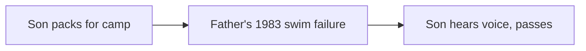

## Why this episode matters

The final episode, with about 1.5 million views at the time of research, teaches the skill every other episode assumed: telling the story. Matthew Dicks is a novelist, a fifth-grade teacher, and a many-time Moth StorySLAM champion. The central claim: a story is change over time, and nobody wants to hear anything you say unless you give them a reason to listen, continuously, in every sentence.

The episode is built around a full telling of the Spoon of Power, then a dissection of its architecture, then the complete craft system: stakes devices, beginnings, endings, honesty rules, the but-and-therefore test, and the daily practice that stocks the inventory. If charisma is influence, storytelling is its highest-bandwidth channel. This episode is the capstone.

### A story is change over time

Most people think a story is stuff that happened, told in order. That is a report. Nobody wants your report except your mother, and she is required to listen. A story is change over time. Usually a realization: I used to think one thing, now I think another. Sometimes a transformation: I was one kind of person, now I am another.

The anecdote distinction sharpens it. An anecdote is cotton candy: delicious, forgotten. A story is the best meal of your life: you remember the restaurant, the company, the order. The mechanism differs too. An anecdote hopes you think "that once happened to me." A story aims for "I once felt that way." Feeling travels. Events do not.

The customs story is the negative example. Detained in Canada, saved by his own Wikipedia page: amusing, but nothing changed. He left seeing nothing differently. Cotton candy. The test is the feeling test: did something just happen in me. If not, it is not a story yet.

### Nobody owes you their attention

The bone-marrow belief: no one wants to hear anything you have to say unless you give them a reason to listen. Every sentence must earn the next one. The power-outage test makes it concrete. Twice in his life the power died mid-movie. Once he never went back: he had not cared about the characters. Once he hunted for another theater with power: he had to know the ending. Your audience should be the second kind of moviegoer.

The game with the audience: they pretend you make it up, you pretend you make it up. The truth is the middle. Never memorize. Remember the beats. A word caller recites memorized words and cannot read the room. A beater knows what happens next but not the exact sentences, so they can pivot, pull an anecdote from the pocket, and riff on the phone-checker in row three.

### The Spoon of Power

The episode's centerpiece, told in full. Behind his school, a pile of leaves quivers. A boy's hand emerges holding a metal object. Jamie, a redheaded ten-year-old, holds a kitchen spoon. Dicks declares it the Spoon of Power. Jamie sprints. For 18 minutes of recess, the teacher chases the boy across the field, up the slide, through the woods, and loses.

In class the standoff continues: math, reading, writing, the spoon daring him from the desk corner. At writing time Jamie's head falls to his arm, lost in his story. Dicks creeps up the aisle, reaches, and the spoon is gone. "Did you really think I was just going to leave it there for you." The class conspires. The bell rings. Jamie pulls the spoon from the library box: "I filed it under S for spoon."

Next day the spoon hangs on a chain around Jamie's neck, his father drilled the hole, his mother gave the chain. Thursday is the math test, and McKenzie falls apart as she always does. Jamie takes off the spoon: "Maybe this will help." Best test of her life. Days later David's grandfather dies, and Jamie waits at the door: "I think you need this today." All year the spoon finds every kid in trouble: forgotten homework, the principal's hallway, the bully on the bus.

Last day of school, Jamie tries to give the spoon back. Dicks refuses: you kept it, you did this amazing thing, it is yours. Jamie insists: "The magic of the spoon only works in my classroom." He pulls up the little orange chair to reach eye level and puts it on. The pandemic year, 2020 to 2021, the hardest of 26 years teaching, becomes the year of the spoon: kids, colleagues, everyone wearing it to get through the day. Sixteen years later he still carries it in his bag. At a pandemic-era talk, the line after the show was not for books. Grown adults lined up to touch a spoon.

The change over time: an ordinary kitchen spoon becomes the most powerful teaching tool of a career. Nothing at the start, everything at the end. That is the arc.

### The architecture: scenes, senses, and the Mount Rushmore four

Dicks remembers stories as scenes, and scenes are locations. Playground chase. Classroom standoff. Next-day necklace. Thursday test. David's door. The montage of three troubles. Last day. Pandemic coda. Each scene has one job. The montage is engineered: three locations, three kinds of kid problems, chosen from a thousand real spoon-givings.

Description discipline: almost no adjectives. Nobody wants to know what things looked like unless it matters. What the audience wants: what you felt, what you said, what you did. Say "classroom" and the listener supplies their own, which beats yours because it is theirs. Every unnecessary adjective steals bandwidth the audience needs for the story. The comic book research, cited in the episode: simpler-drawn characters create stronger emotional connection, because the reader fills in the rest.

Through every scene run the four: stakes, suspense, surprise, humor. The Mount Rushmore of attention. A boring stretch gets painted over with suspense or humor until the story resumes. Demos, data sections, and explanations all need the same paint.

### Six devices that hold attention

1. The elephant. The big obvious stake, named early. Not what the story is about, but what makes you listen. In the spoon story: a boy has a spoon and Matt wants it. Steve Jobs's iPhone launch opened with one: "I waited two and a half years to share this." Elephants can change mid-story: will he get the spoon becomes what will Jamie do with it becomes will Matt get it becomes the pandemic itself.

2. The backpack. Tell the audience your plan, load them with your hopes, then let the plan fail. Dicks tells you he will strike at writing time when Jamie's head falls. You carry the spoon on the desk corner in your mind's eye. When he reaches and it is gone, the audience gasps. Ocean's 11 tells you the heist plan for the same reason: you must know what should happen to feel it going wrong. The scientist curing a disease loads the same backpack, then finds a molecule that cures twelve others instead.

3. Breadcrumbs. Hints dropped without explanation. McKenzie's collapse during the math test: part of the audience wonders how this connects to the spoon, part forgets the spoon entirely caring about the girl. Both win.

4. The hourglass. When the audience is desperate for the next sentence, slow down. Flip the hourglass and let the sand run. The Matrix's bullet time is an hourglass: stretch the bullet's flight and the suspense stretches with it. The orange chair exists to cost you one more second. Dicks speaks slower as the spoon approaches his neck.

5. The crystal ball. Say a prediction out loud. Humans are prediction machines. Gamblers watch the game live because they must know if they were right. "I will get that spoon eventually" makes the audience wait for the verdict. Earnings guidance is a corporate crystal ball: the next quarter is the reveal.

6. Humor. The most underused business tool. Humor changes brain chemistry: closeness, perceived intelligence, better mood, better cognition. A laugh in the first 30 to 60 seconds relaxes the room. The audience decides you know your craft. Humor also steers emotion by contrast. Make them laugh right before the terrible part and it lands harder. Make them laugh right after and they can breathe again. Dicks's wife describes his best stories as laugh-laugh-laugh-cry.

Figure 1. The six attention devices, per the episode. AI Podcast Curriculum, ep10 (Matthew Dicks, 2024-09-03). Shell 1. Show a toy with at most 8 items. Source: original toy, from episode claims.
| Device | What it does | Example from the episode |
|---|---|---|
| Elephant | Names the big stake early | A boy has a spoon and Matt wants it |
| Backpack | Loads your plan, then breaks it | The writing-time strike that fails |
| Breadcrumbs | Drops unexplained hints | McKenzie falling apart at the test |
| Hourglass | Slows down at peak want | The orange chair, the slower voice |
| Crystal ball | States a prediction aloud | I will get that spoon eventually |
| Humor | Changes brain chemistry | Laugh in the first 60 seconds |

### Beginnings: start where the spoon appears

The two most common failures are beginnings and endings. Beginnings fail because storytellers teach before they engage. The bad version of the spoon story: "I am a fifth-grade teacher in Connecticut, my school is called..." Nobody ever sat down hoping to be taught things before hearing something good.

Start at the moment the story starts: a pile of leaves, a hand, a metal object. Say "metal object," not "spoon." Knife, gun, or mystery: every guess is a crystal ball, and every guess makes them want the answer. Teach everything else along the way. The beginning is the plane: land in a beautiful place all you want, but if nobody boarded, you failed.

### Endings: land the five-second moment

Start at the end. Before building anything, answer: what changed. The five-second moment is the change compressed: the spoon was nothing, now it is everything. Every keynote, every deck, every story needs its last three slides first. Say one thing. Saying three things says nothing.

The beginning must be the opposite of the end. Spoon as nothing versus spoon as everything. That opposition is the arc. The customs story is flat because Matt was never worried: Canada, a red X, worst case a longer wait. No fear at the start means no change at the end. If you cannot find the opposite, you do not have a story.

Movie openings predict their endings, and the episode runs the proofs. When Harry Met Sally: they hate each other on the road trip, so they will end together. Star Wars: a boy dreaming of spaceships finds religion in the Force and wins by turning off the targeting computer. Independence Day: every protagonist starts disrespected by the people they value most and ends respected by them. Die Hard carries its five-second moment through the whole film: a man trying to get back to his wife, terrorists in the way, the wife never leaving the frame. Lesser films introduce the idea and abandon it until the wrap-up. Carried meaning sticks. Parked meaning does not.

Leave a frayed ending, not a knot. Thelma and Louise ends mid-flight over the cliff. Butch Cassidy freezes before the federales fire. Unanswered questions keep the audience wondering the next day, and wondering is memory.

### But and therefore: the story test

The South Park rule, adopted in the episode: replace "and then" with "but" and "therefore." An and-story is a list: this happened and then this happened. Remove any scene and nothing breaks. A but-therefore story is a chain: this happened, but that blocked it, therefore this. Remove any scene and the story collaps
es.

But is the most powerful word in storytelling. "I got in the Uber today, but..." makes you need the next clause. "And..." lets the power go out unmourned. The "not" construction works the same way: "Shane is not stupid" beats "Shane is smart" because it opens the dichotomy and picks a side. Flat sentences state. Dichotomies energize.

The trailer rule applies the test to promotion. State the stakes, withhold the solution. John McClane wants his wife, terrorists stand between them, he has only his wits: you must watch to learn how. For a podcast: you told bad stories for years, it is not talent but strategy, strategy can be learned. Curiosity without spoilers.

### Honesty: true stories, trimmed

Can you lie in stories. No. The spoon works because audiences know it is true. The line at the pandemic talk formed to touch a real spoon. Fiction would have made it a prop.

Trimming is allowed. Take Martin out of the car if Martin did nothing. He steals bandwidth. Condense two days into one. Nobody needs your cereal. Shorten locations. What you may not trim is your own stupidity. Keep the foolish parts, even enlarge them. Audiences crave the vulnerability, and the stupid thing you did is usually where the story lives.

Tell your own stories. Other people's stories report on fictional characters. The teller on stage with their own failure is vulnerability. The teller with someone else's anecdote is a newscaster.

### Strategic listening

Become a strategic listener. When a movie makes you laugh, ask what combination of words did it. When a story lands, dissect the mechanism. Consumers let content wash through. Reproducers pull the threads.

The Wonder Woman autopsy is the demonstration. The hero can only defeat the villain after her boyfriend sacrifices himself. The film's structure says a woman cannot win her own battle. The Mary Poppins sequel is worse: nobody saves the day until a man walks in with money. You can enjoy the movie or see the machinery. Strategic listeners see it, and seeing it teaches them to build better.

### Confidence is a high dive

The armed robbery at 21 is the origin story. Managing a McDonald's, three men through the glass, two already dead by their hands. He dropped the $7,000 deposit down the safe chute. They beat him, counted down twice with a gun to his head, pulled the trigger on empty chambers twice. What he felt was not fear but regret: 20 years old, homeless six weeks earlier, nothing accomplished. After that, other people's opinions washed away. The stakes recalibrated permanently.

For everyone else, confidence is the high dive. The 14-foot board at the town pool terrified him every time until repetition burned the fear down. You cannot think your way off the board. You jump, survive, and jump again. Audiences reward the jump: he has never had anyone think less of him for something vulnerable he said on stage. The woman who asked if he worried about the charity-worker story got the answer: "What do you think of me." "I love you for it." Nobody is the unicorn. The room always likes you better for the truth.

### Speaking to, not at

A speech does not live on the page. It lives in the air, in your voice. Memorized speeches speak at: identical tomorrow, aimed at the middle distance. Remembered stories speak to: different every time, aimed at these people.

The Brooklyn Historical Society proof: he arrived with a raunchy story, saw an audience of blue-haired old ladies, and spent 15 minutes converting humor to heart. He won the slam. The memorized version could not pivot. Catherine Burns's line, quoted in the episode: it is in the imperfection that the beauty lies. The stumble proves you speak to them.

On the page, craft replaces voice. Punch sentences get their own paragraphs. Drop subjects: "Went to the store" hits faster than "I went to the store." Never open with the topic sentence. That is the boring school essay. Show the grandmother's cruelties, then let the verdict land or stay unsaid. Audiences love assembling the conclusion themselves.

The teaching coda: with kids, never correct spelling first. Have them read aloud. The mouth is more beautiful than the page. Keep the ratio at six praises to one correction. Writing, like storytelling, is the child saying "here is my humanity, what do you think." Answer kindly or they never offer it again.

### Homework for Life

The daily practice: each night, write down the most storyworthy moment of the day in a spreadsheet. One line. Most days it is small. Small moments beat big ones: the tiny, seemingly insignificant moment filled with meaning travels better than the near-death tale nobody can relate to.

The swim test story is the worked example. His son faces the camp swim test. Dicks tells him about 1983: nine pancakes, the cold lake, quitting at 50 yards, two days as a beginner swimmer, 45 extra minutes in the rowboat while friends canoed. The advice: do not quit because you are tired, quit only when you cannot swim. A week later the son passes and says he heard his father's voice on the second lap and swam two more.

The structure lesson is the BABC model. Chronological A-B-C would start in 1983 and take 40 years. Instead: B, the son packing now. A, the father's 1983 failure yanked into the present. C, the son's test and the voice in his head. The 40-year story becomes a week-long story. Start in the middle, pull the past in, land in the present.

His own critique of the telling: he opened by teaching instead of showing. The fix: open on the trunk, the packing, the decision to speak. "This is the moment to tell him what he needs to hear" is the crystal ball. Then the story.

The metaphor lesson for business: find the theme, not the content match. The entrepreneur teaching bottlenecks had the Facebook story: seven friends in ten days, the one metric that mattered. Dicks asked for his personal version. The answer: his marriage was in trouble until a friend said "kiss your wife every morning," and it changed everything. One small solution fixing a huge problem. The personal story carries the business lesson further than any case study, because audiences remember the kiss and forget the dashboard. Every future morning kiss in the audience becomes a reminder of his talk.

Success, for Dicks, is stasis refused: in six months, doing something he cannot imagine today.

Figure 2. The BABC structure of the swim test story, per the episode. AI Podcast Curriculum, ep10 (Matthew Dicks, 2024-09-03). Shell 4. Show the new symbol. Source: original toy, from episode claims.

Figure 3. And-stories versus but-therefore stories, per the episode. AI Podcast Curriculum, ep10 (Matthew Dicks, 2024-09-03). Shell 3. Apply one rule. Source: original toy, from episode claims.
| | And-story | But-therefore story |
|---|---|---|
| Connectors | And then, and then | But, therefore |
| Scene test | Remove one, nothing breaks | Remove one, story collapses |
| Motion | Flat list | Angular, driven |
| Example | The customs anecdote | The Spoon of Power |

## Q&A

1. What is the difference between a story and a report?
A report lists what happened in order. A story shows change over time: a realization or a transformation. Reports inform. Stories change the listener.

2. Why must you earn attention in every sentence?
Nobody wants to hear you by default. The power-outage test proves attention is conditional: audiences stay only when they must know what happens next. Each sentence is the price of the next.

3. What do the six attention devices have in common?
Each manufactures a reason to hear the next sentence. Elephants name the stake. Backpacks load hopes then break them. Breadcrumbs hint. Hourglasses delay. Crystal balls predict. Humor pays in chemistry. All six serve the same master: continuation.

4. Why start with the metal object instead of the spoon?
"Metal object" opens a prediction gap: knife, gun, mystery. "Spoon" closes it. The gap is a crystal ball, and the audience stays to check their guess.

5. Why must the beginning be the opposite of the end?
Change over time needs two poles. Spoon as nothing versus spoon as everything is the arc. Without the opposition there is no movement, only the flat customs anecdote.

6. How does but-and-therefore test a story?
Try removing a scene. In an and-story nothing breaks, which proves the scene was decorative. In a but-therefore story the chain snaps, which proves every scene was load-bearing.

7. Why keep your stupid parts and cut Martin from the car?
Martin did nothing, so he steals bandwidth. Your stupidity is vulnerability, and vulnerability is what audiences crave. Trim for the story's flow, never for your image.

8. What is Homework for Life, and why small moments?
A nightly one-line log of the day's most storyworthy moment. Small moments win because they are relatable. Near-death tales impress once. Tiny true moments get retold.

## Memory aids

Mnemonic for the six devices: EBBHCH. Elephant, Backpack, Breadcrumbs, Hourglass, Crystal ball, Humor. "Every Brave Bard Holds Captivating Hearers."

Mnemonic for the four attention pillars: SSS H. Stakes, Suspense, Surprise, Humor. "Stories Stay Superb with Humor."

Never-confuse pair: remembering versus memorizing. Remembering holds the beats and frees the sentences. Memorizing holds the sentences and traps the speaker. One reads the room. The other recites at it.

Never-confuse pair: anecdote versus story. Anecdotes are cotton candy: sweet, gone. Stories are the best meal: savored, remembered, retold. The difference is change over time aimed at a feeling.

Trap card: description is not storytelling. Adjectives cost bandwidth. "What you felt, said, and did" beats "what it looked like" every time, unless the look drives the plot.

Trap card: topic sentences kill stories. School taught you to open with the conclusion. Storytelling opens with the mystery and earns the conclusion. Lead with the metal object, not the thesis.

## How to imbibe this

This week, run four practices.

1. Homework for Life. Each night, log one storyworthy moment in one line. Do all seven days without judging the entries.
2. The but rewrite. Take one anecdote from your week and rewrite it replacing every "and then" with "but" or "therefore." Note which scenes survive.
3. The five-second moment. Take one life story and compress the change into one sentence. Then write the opposite opening sentence.
4. The device audit. Record a 3-minute story. Mark every elephant, backpack, breadcrumb, hourglass, crystal ball, and humor beat. Find the longest device-free stretch and fix it.

Self-catching: when you feel an audience drift, run the Mount Rushmore check. Stakes, suspense, surprise, humor: which one went missing longest. Deploy it in the next sentence.

## Think it yourself

Do these without AI. Use a notebook.

1. Tell the Spoon of Power back from memory in ten sentences. Mark which scenes you kept and which you dropped. Compare against the chapter.
2. Take a movie you love and write its opening-end opposition in two sentences. Then name its five-second moment.
3. Write your customs anecdote: something amusing that happened with no change. Now hunt it for a buried story: what almost changed.
4. Draft a BABC version of a 10-year story from your life. Mark the B, the A, and the C. Time how the structure shrinks it.
5. Write the trailer for a talk you might give: stakes stated, solution withheld, in three sentences.

## Skills you can now use

- Define any story as change over time and test candidates with the feeling test.
- Open in the action with a prediction gap, never with background teaching.
- Build scenes by location and run the Mount Rushmore four through each.
- Deploy all six attention devices on purpose.
- End on the five-second moment with the beginning as its opposite.
- Convert and-stories to but-therefore stories with the scene-removal test.
- Trim honestly: cut the idle, keep the stupid.
- Tell your own stories for vulnerability. Retire other people's anecdotes.
- Speak to the room, not at it, with remembered beats and live pivots.
- Write for the page with punch paragraphs and delayed verdicts.
- Stock the inventory nightly with Homework for Life.
- Find business metaphors in personal life by theme, not content.

## Go deeper

- Book: "Storyworthy" by Matthew Dicks. The full craft system behind this episode.
- Book: "Someday Is Today" by Matthew Dicks. Homework for Life and the decision to act.
- Show: The Moth StorySLAM. Live stories under the same rules.
- Episode video: https://www.youtube.com/watch?v=bZDiwANRS84

## Figure audit

| Unit id | Claim | Before | After | Figure id | Medium | Source | Four tests |
|---|---|---|---|---|---|---|---|
| u01 | Six attention devices | Attention as luck | Six named devices with examples | fig1 | table | episode claims | T1: 6-row device table / T2: device list forces a table / T3: none, static plate / T4: EBBHCH reused in mnemonics |
| u02 | BABC structure | Chronology as default | Start in middle, pull past in | fig2 | mermaid | episode claims | T1: 3-node B-A-C chain / T2: structure forces mermaid / T3: none, static plate / T4: BABC reused in drills |
| u03 | And vs but-therefore | Stories as event lists | Chain test with scene removal | fig3 | table | episode claims | T1: 2-column contrast table / T2: contrast forces a table / T3: none, static plate / T4: scene-removal test reused in imbibe |
