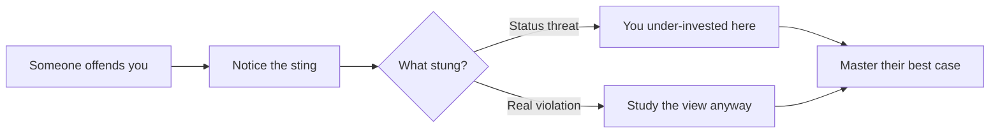

## Why this episode matters

No other episode in this track hands you portable laws for thinking. Cowen's three laws fit on an index card and change how you read papers, form opinions, and argue. His rules for learning from people who offend you and for finding mentors are the most actionable social technology in the track. And his closing idea, that raising someone's aspirations may be the highest-return activity available, reframes what it means to help people think better.

## Cowen's three laws

### Where the laws came from

Cowen taught PhD macroeconomics for years. One day he wrote three laws on the chalkboard for his students. They have since generalized far beyond macro.

Figure 1. Cowen's three laws. AI Podcast Curriculum, ep02 (Tyler Cowen interview, 2023-03-15). Shell 1. Show the toy. Source: original toy, from episode claims.

| Law | Statement | Original use |
|---|---|---|
| First | There is something wrong with everything | Reading research papers |
| Second | There is a literature on everything | Writing research papers |
| Third | All propositions about real interest rates are wrong | Papers on real interest rates |

### Law one: something is wrong with everything

The first law began as a reading rule. Students read research papers and treated them as solved problems. Cowen's standard: you do not understand a paper until you can articulate what is wrong with it. No paper solves its problem perfectly. Finding the flaw is the test of comprehension.

Generalized, the law becomes a habit of mind. Every argument, every model, every position has a weak point. Your job is to find it, including in views you hold. This is the track's rationality step in one sentence: the scout habit from ep06, stated as a law.

### Law two: there is a literature on everything

Young PhD students tend to believe they are the first to approach a problem. The second law corrects the conceit: whatever you think, someone wrote about it already. Check what exists before you go far.

Generalized, the law fights reinvented wheels. In the episode, Cowen notes it as one reason he wanted studies of super-effective people: the literature there is thin, and Cowen's second law tells you to check before assuming the gap is real.

### Law three: all propositions about real interest rates are wrong

The third law is deliberately, comically specific, because it came from teaching papers about real interest rates and watching every one of them fail.

Definition: the real interest rate is the interest rate minus the inflation rate. It measures what lenders actually earn after prices rise.

The episode's worked example: price inflation hit 6.2 percent while nominal yields barely moved. Real rate equals nominal minus inflation, so roughly 1 percent minus 6.2 percent gives about negative 5 percent. In real terms, lenders lost money to borrowers. Standard theory said deficits should push real rates up and crowd out investment. The data refused to cooperate. Government deficits do not show a measurable effect on real rates. Cowen's summary: real rates always surprise you, and every confident proposition about them fails.

The meta lesson is the point. Some domains resist understanding so stubbornly that the honest move is a law about your own ignorance. Cowen suggests physics has its version: all propositions about a final unified theory are probably wrong too. [uncertain: the episode offers this as an analogy, not a claim about physics.]

Figure 2. The real-rate arithmetic from the episode. AI Podcast Curriculum, ep02 (Tyler Cowen interview, 2023-03-15). Shell 2. Count the toy. Source: original toy, from episode claims.

| Quantity | Value |
|---|---|
| Price inflation | 6.2 percent |
| Nominal yield on government borrowing | About 1 percent |
| Real interest rate (nominal minus inflation) | About negative 5 percent |
| Theory prediction (deficits push rates up) | Positive and rising |
| Observed | Negative and falling |

## Economists are people too

### Where economists get their opinions

Cowen's complaint about his profession: economists are hyper-specialized, and outside their specialty their opinions come from the same media diet as other educated coastal professionals. The New York Times. Paul Krugman. Twitter for the activist ones. A study found that a French economist's nationality predicts their opinions better than their being an economist does.

The mechanism is partly self-interest. With co-author Alex Tabarrok, Cowen wrote a critical piece on how the National Science Foundation funds economists. They found shockingly little existing literature on the topic. Nobody studies the hand that feeds them. Each economist feels someone else will do it. Collectively, nobody does.

### Modern monetary theory

On MMT, Cowen is blunt: it was never coherently defined as a model, so it cannot be coherently presented. He reads it as politics and marketing with one true claim inside: governments could monetize more debt than economists had thought, at least over the prior 30 years. The specific testable claim, that high inflation should be met by cutting government spending, failed its own test when inflation arrived and no MMT advocate called for cuts.

### What economics does not know

Asked for the biggest open questions, Cowen lists: what drives economic growth, what produces innovation, why unemployment stays stubbornly high, how the business cycle works. On progress over the next 20 years he is pessimistic about breakthroughs and optimistic about clarity: progress means seeing how complicated the problem is.

On behavioral economics, his view is deflationary but respectful. Economics was behavioral from the start: read Adam Smith's Theory of Moral Sentiments, or Keynes, or his advisor Thomas Schelling. What the modern behavioral literature added was discipline about which effects generalize and which are context-specific. The finding: it is all more context-specific than hoped. Loss aversion cannot be a fixed ratio you plug into a model, because the ratio depends on the situation. The field fragments into isolated papers, each its own little universe, and losing the general engine of inquiry that made economics special.

## The rules

### Rule seven: learn from those who offend you

Cowen wrote his rules after Jordan Peterson's 12 Rules book showed the demand for them. Rule seven is the load-bearing one for this track.

The mechanism: on social media you meet the worst, stupidest version of opposing views. The natural reaction is entrenchment. Cowen says that reaction is exactly wrong. Offense is a signal that you have under-invested in understanding them.

Definition: devalue and dismiss is Cowen's name for the failure mode. You find one thing wrong with an argument or a person, lower their status in your mind, relegate them to a mental zone where you stop learning from them, and move on. The alliteration is deliberate. The two Ds.

The discipline has two steps. First, notice the offense as data about your own allocation of attention, not as data about their worth. Second, get drawn to them like a magnet and master their point of view. The view may still be wrong. People with terrible views can be extremely smart: Cowen names Picasso's Stalinism and the 20th-century intellectuals who apologized for Mao. You can learn from Marx precisely because his errors pervade his system. Tracing a systematic error teaches you the shape of the whole.

Spencer adds the confusion to watch for. Sometimes offense tracks a real moral violation, like racism. Sometimes it tracks a status threat, like your group being slighted. People blur the two, which lets them file a worldview slight as a moral verdict and stop thinking.

Figure 3. From offense to study. AI Podcast Curriculum, ep02 (Tyler Cowen interview, 2023-03-15). Shell 3. Apply the one rule. Source: original toy, from episode claims.

### How Cowen actually does it

The practical method is daily writing. Cowen blogged daily for 18 years. Writing forces the steelman: articulate the best case for a view you do not hold, in public, where flaws get punished. His line: if all he did was repeat himself for decades, people would get bored, and he would stultify. Trying to make the other side's case as strong as possible is what keeps him learning.

For non-writers, the substitutes from the episode: teach material you disagree with as objectively as you can, and treat failure to make its case as a warning sign about your own understanding. Post online where errors get punished, so finding the flaw first becomes self-interest. These are scout-mindset drills from ep06, independently invented.

### Rule eight: mentors and small groups

Cowen calls two pieces of advice nearly universal. First, keep a small group of smart, interesting peers. Second, get mentors: people who know an area you do not and will help you learn it. An art mentor. A classical music mentor. A China mentor.

What a mentor is not: a formal program where you email a stranger asking "will you be my mentor." Real mentorship is informal. Someone who knows more, enjoys your company, enjoys teaching you, meets periodically. Sometimes the mentor is already your friend. You redefine the friendship around the new domain.

Why it works: humans learn through other humans. Knowledge becomes vivid when a person carries it. Cowen is blunt that books alone rarely stick: he could read a geology book, but without a group and a mentor, little would stay.

### Rule two: study the symbolic systems

Rule two says: study art, music, literature, and religion, because they train you to understand alternative points of view in politics and intellectual life.

The mechanism: people who study others' political views directly hit a wall. They sort everything into agree or disagree and stop learning. Art resists that sorting. It stays complex and keeps outpacing you. Practicing art appreciation builds the mode of learning where you crack cultural codes instead of judging them.

There is a second, direct channel. A culture's art, music, and literature are the stories it tells about itself. If you want to understand a group, that is a strange place to skip. Cowen's application: much current American literary fiction bores him, written by too narrow a slice of life, while foreign literature in translation stays vital. [uncertain: aesthetic judgment, presented as Cowen's taste in the episode.]

## Raising aspirations

### The highest-return activity

Cowen's closing idea: many people are not ambitious enough. Not because they lack drive, but because their imagination does not include the paths they could take. Raising someone's aspirations, making a bigger life vivid and concrete, may be the highest-return activity available.

The mechanism is vividness through embodiment. His co-author Daniel Gross tells of meeting Mark Zuckerberg and giving a normal talk. Suddenly "being a Mark Zuckerberg" became a thing humans do, not an abstraction. The aspiration became real, and the compounding started.

This connects to the episode's research thread. Cowen wants rigorous studies of super-effective people, an intermediate literature between sprawling biographies and nonexistent trick lists. He is genuinely uncertain how much effectiveness is trainable versus fixed, but notes the local-culture evidence: Florence in the Renaissance, Athens, early-19th-century classical music, central-European mathematics. Same gene pools, wildly different output. Something in the air, small groups, mentorship, raised aspirations, matters enormously.

### Lookism: the undiscussed privilege

In the same spirit of noticing neglected causes, Cowen raises lookism: judging people by looks. Everyone does it. Some of it is informative: most seven-footers play basketball. Most of it is stereotype machinery running past its warrant.

The neglected asymmetry: we discuss many privileges, but rarely beauty. The very unattractive likely have it quite hard, and nobody credits them for it. There may also be costs to extreme beauty: being taken less seriously, weaker drive, too-easy friendship. Short men show a measurable earnings penalty. The practical takeaway is pure Cowen: where the world systematically misprices people, there is opportunity, for them and for you. A company that hired the undervalued would capture the gap.

## Questions and answers

> [!QA]
> Q: Explain Cowen's three laws like I am new. When do I use each?
> A: Law one, something is wrong with everything: use it when reading. You do not understand a paper until you can state its flaw. Law two, there is a literature on everything: use it when starting research. Check what exists before assuming you are first. Law three, all propositions about real interest rates are wrong: use it as a template for naming the limits of your own understanding in any stubborn domain.
> Follow-up: Why is the third law so specific? It came from teaching PhD macro, where every paper on real rates failed. The specificity is the lesson: generalize your laws, but remember the concrete failure that earned them.

> [!QA]
> Q: Walk me through the real interest rate arithmetic.
> A: Real rate equals nominal rate minus inflation. In the episode, inflation ran at 6.2 percent while nominal yields barely moved, near 1 percent. One minus 6.2 gives about negative 5 percent. Theory said deficits should push real rates up. Reality pushed them deeply negative.
> Follow-up: What is the reusable lesson? When a variable surprises you for decades across every theory, stop theorizing and write the law. The law marks the boundary of current understanding.

> [!QA]
> Q: What does "devalue and dismiss" mean, and how do I catch myself doing it?
> A: You find one flaw in a person or argument, lower their status, and stop learning from them. Catch it at the sting: when you feel offended, ask whether the sting is a status threat or a real moral violation. If it is a status threat, treat it as a signal that you have under-invested in understanding that view, and go master its best case.
> Follow-up: What if the person is genuinely terrible? Learn anyway. Cowen's examples: Picasso's politics, Mao's apologists, Marx's system. A pervasive error is a map of a whole way of thinking. Study the map.

> [!QA]
> Q: How do I actually get a mentor? Cowen says not to just ask.
> A: Mentorship is informal and grows from existing contact. Find someone who knows an area deeply and enjoys your company. Make the relationship periodic and concrete: read the books, do the work, bring questions. Sometimes you already have the person. You redefine the friendship around the new domain.
> Follow-up: What are the two near-universal pieces of advice? A small group of smart peers, and mentors. Everything else Cowen says is context-specific.

> [!QA]
> Q: Why study art and music to understand politics?
> A: Studying political views directly triggers the agree-or-disagree sort, and learning stops. Art resists sorting: it stays complex and keeps teaching you. That trains the code-cracking mode you need for other minds. Directly, a culture's stories about itself live in its art, so skipping art means skipping primary evidence.
> Follow-up: Try it this week. Take a political group you do not understand and study their music or fiction before their manifestos. Note what you learn that the manifestos never said.

> [!QA]
> Q: What does it mean to raise someone's aspirations, and why is it high-return?
> A: Most unambitious people do not lack drive. They lack vivid models of bigger paths. Showing them a human who did it, up close, makes the path real and starts compounding. It is high-return because imagination is the bottleneck, and one vivid example can open years of larger effort.
> Follow-up: Who raised yours? Name the person and the moment it became vivid. Then ask who you could do that for this month.

> [!QA]
> Q: Cowen says behavioral economics is less useful than hoped. What is his argument?
> A: The effects are real but context-specific. A loss-aversion ratio that changes with the situation cannot sit in a model as a fixed number. Papers become isolated universes, each with its own model and dataset, and the field loses the general engine that made economics powerful. The contribution stands: we now know which effects generalize and which do not.
> Follow-up: How does this connect to law one? "Something is wrong with everything" includes beloved literatures. The context-specificity finding is law one applied to behavioral economics itself.

> [!QA]
> Q: What is lookism, and what should I do about it?
> A: Judging people by looks, which everyone does and almost nobody discusses. The very unattractive face real hardship with no credit for it. The practical move is arbitrage: the world systematically misprices people on looks, so understanding the bias lets you back undervalued talent, in hiring and in yourself.
> Follow-up: What is the trap? Assuming the bias only harms the unattractive. Extreme beauty may cost seriousness and drive. Check both tails before you conclude.

## Memory aids

- The three laws: flaw it, source it, bound it. Find what is wrong with everything you read. Check the literature before you claim novelty. Name the domains where all propositions fail.
- The 6.2 to negative 5: inflation 6.2, nominal near 1, real about negative 5. Theory said up. Reality said down.
- Devalue and dismiss, the two Ds: one flaw found, status lowered, learning stopped. The sting is the signal.
- Offense triage: status threat means study them. Real violation means note it and still study the view.
- The two universals: small peer group, plus mentors. Everything else is context.
- Mentor test: informal, periodic, concrete. If you had to email "will you be my mentor," it is not that.
- Art before manifestos: stories a culture tells about itself live in its art. Sort less, crack codes more.
- Aspiration vividness: a path becomes real when a human embodies it. Zuckerberg's talk did more than any advice column.
- Never-confuse pair: the worst version of a view versus the best version. Social media serves the worst. Your job is the best. Devalue-and-dismiss feeds on the worst.
- Trap card: "I have no opinion on this." Cowen says you do: a conformist opinion of deference. Name it instead of hiding behind it.
- Trap card: "Economists disagree because of rival theories." More often they agree because of shared media diets. Check the diet before the theory.

## How to imbibe this

- This week: apply law one to something you believe. Write one paragraph stating the strongest flaw in your own position on a live disagreement. If you cannot, you have not understood your own view yet.
- Catch yourself: the next time someone offends you online, pause before reacting. Run the triage. Status threat or real violation? If status threat, spend 20 minutes finding the best version of their view. Log what you learned.
- Behavior change per major idea:
  - Law one: for every paper or article you read this week, write its flaw in one sentence before you write what you liked.
  - Law two: before starting any research task, spend 30 minutes checking the existing literature. Write down what you found so you cannot pretend later you were first.
  - Devalue and dismiss: keep a one-line log of people you dismissed this week and why. Revisit one. Find one thing they understand that you do not.
  - Mentors: list three domains where you are stuck. For each, name one person who knows it and enjoys your company. Schedule one concrete interaction.
  - Aspirations: identify one person whose path made something vivid for you. Write them a note saying so. Then ask who you could make something vivid for.
  - Art rule: pick one group you do not understand politically. Study their fiction or music for two hours before reading any of their polemics.
- Monthly: reread your flaw paragraphs. Count how many changed your mind versus how many you dismissed. If the count is zero, law one is decoration, not practice.

## Think it yourself

Harder drills. Do these with your own brain before touching AI. Write answers by hand.

1. Fermi: Cowen blogged daily for 18 years. At 500 words per post, how many words is that? (Answer: 18 times 365 times 500 is about 3.3 million words, roughly 40 book-lengths. Now ask: what does that volume buy that reading cannot?)
2. Argue both sides: "Offense is a signal you have under-invested in understanding." Steelman the objection: some views are engineered to offend as a tactic, and studying them rewards the tactic. Rebut or concede. Where is the line?
3. Journal: "Who did I devalue and dismiss this month?" Write three names and the single flaw that triggered each dismissal. For one of them, write the best case for their view in five sentences. How does it feel?
4. First principles: derive law three from scratch. List every mechanism by which deficits could raise real rates, then list what the data showed. At what point does a failed research program earn a law instead of another paper?
5. Observe: for one week, note where your opinions on non-specialist topics came from. Tally: direct evidence, expert you trust, media diet, tribe. What share is media diet? Does the French-economist finding predict your tally?
6. Design: you run a small fund like Emergent Ventures. Write the one-paragraph criteria for a grant that raises aspirations rather than funding projects. How would you tell it worked five years later?

## Skills you can now use

- State the flaw in anything you read before stating what you liked.
- Check the literature before claiming novelty, in 30 minutes or less.
- Triage offense into status threat versus real violation, and convert the former into study.
- Write the best case for a view you do not hold, in public or on paper.
- Recruit mentors informally through existing relationships and concrete work.
- Study a group's art before its polemics when you need to understand it.
- Make an abstract path vivid by finding a human who embodies it.

## Go deeper

- Tyler Cowen's biography and work: https://en.wikipedia.org/wiki/Tyler_Cowen
- Clearer Thinking's free tools for better decisions: https://www.clearerthinking.org

## Figure audit

| Unit | Claim | Before | After | Figure | Medium | Source |
|---|---|---|---|---|---|---|
| u01 | Three laws stated | No portable laws | Laws 1-3 with origins | Figure 1 | table | original toy, from episode claims |
| u02 | Real-rate arithmetic | Theory says rates rise | 6.2 inflation gives negative 5 real | Figure 2 | table | original toy, from episode claims |
| u03 | Offense converts to study | Devalue and dismiss | Triage then master the best case | Figure 3 | mermaid | original toy, from episode claims |
| u04 | Two universal advices | Generic advice | Peer group plus mentors | Figure 4 (chapter plate) | table | original toy, from episode claims |

Figure 4 (chapter plate). Cowen's toolkit as one page. AI Podcast Curriculum, ep02 (original toy, 2023-03-15). Shell 5. Name the next page that reuses the symbol. Source: original toy, from episode claims.

| Left: cost without the rule | Center: the stored object | Right: cost with the rule |
|---|---|---|
| Opinions from the media diet. Offense triggers dismissal. No mentors. Dim aspirations. | The three laws plus offense triage plus the mentor rules, on one index card. | Every reading gets a flaw sentence. Every offense gets triaged. Mentor conversations scheduled. One aspiration made vivid. |

Tradeoff: pay the sting of finding the flaw and the effort of writing it up, keep the learning you would otherwise dismiss.
Footer: the laws fit on a card. The practice is daily.
