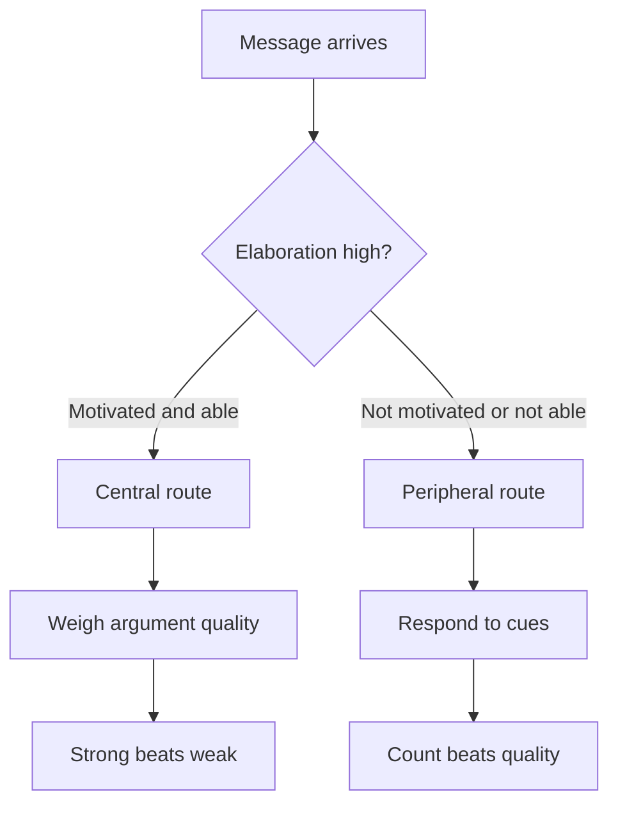

## Why this episode matters

Every other chapter in this track teaches you to think better yourself. This one teaches you to change other people's minds, which turns out to be the same skill pointed outward. McRaney's core finding reframes the whole problem: persuasion is not coercion and not trickery. It is self-persuasion. Nobody changes a mind from the outside. The best you can do is create the conditions where the other person persuades themselves. The episode gives you the science of why direct argument fails and the exact protocols, tested across 17,000 conversations, that work instead.

## The core reframe

### Persuasion is self-persuasion

McRaney spent years researching how minds change for his book on the topic. His landing point: the persuader never does the changing. The person changes their own mind, in response to conditions you helped create. This is why debate-style persuasion fails so reliably. It treats the other person as an object to move, which triggers reactance, the feeling that your agency is under threat, and the person doubles down to protect it.

The practical consequence: your job is not to deliver the killer argument. Your job is to make it safe and interesting for the other person to examine their own reasons. Everything else in the episode is machinery for doing that.

### Three things people hold

Before the machinery, the vocabulary. People hold three different kinds of mental content, and each changes differently.

Definition: a belief is a proposition you hold to be true, like "the earth is round." A belief answers to evidence.

Definition: an attitude is an evaluative stance toward something, like liking or disliking a policy. An attitude answers to feelings, identity, and social context.

Definition: a value is a deep principle about what matters, like fairness or loyalty. A value anchors the other two.

Most failed persuasion treats attitudes as if they were beliefs. You bring facts to a feeling and wonder why nothing moves. Facts work on beliefs. Attitudes move through stories, social proof, and self-generated insight. Values barely move at all, and trying to move them directly triggers the strongest reactance.

## The elaboration likelihood model

### Two routes to persuasion

The episode's central model is the elaboration likelihood model, from Richard Petty and John Cacioppo. It says persuasion travels one of two routes, depending on elaboration.

Definition: elaboration is how much careful thought a person gives a message. Elaboration equals motivation times ability. A person elaborates when they care about the topic and can process the argument.

The central route runs under high elaboration. The person weighs the actual arguments. Strong arguments win, weak arguments lose, and the resulting attitude change lasts.

The peripheral route runs under low elaboration. The person does not process the arguments. They respond to cues: how many arguments there are, how attractive or credible the source seems, whether the message feels familiar. Change through this route is shallow and fades.

Figure 1. The elaboration likelihood model. AI Podcast Curriculum, ep03 (David McRaney interview, 2023-06-29). Shell 1. Show the toy. Source: original toy, from episode claims.

### The three-against-nine study

The classic demonstration, and the episode's hand-worked number. Researchers gave students a proposal: a new university exam policy. Half the students were told the policy would affect them next year. That is high elaboration: motivated. The other half were told it would affect a distant university. That is low elaboration: unmotivated.

Each group then heard either three strong arguments for the policy or nine weak arguments for it.

Figure 2. Strong versus many arguments under each route. AI Podcast Curriculum, ep03 (David McRaney interview, 2023-06-29). Shell 2. Count the toy. Source: original toy, from episode claims.

| Group | Elaboration | Heard | Result |
|---|---|---|---|
| Policy affects them | High, central route | 3 strong arguments | More persuaded |
| Policy affects them | High, central route | 9 weak arguments | Less persuaded |
| Policy affects others | Low, peripheral route | 3 strong arguments | Less persuaded |
| Policy affects others | Low, peripheral route | 9 weak arguments | More persuaded |

Read the table carefully. Under high elaboration, three strong arguments beat nine weak ones, because the person actually processes quality. Under low elaboration, nine weak arguments beat three strong ones, because the person counts arguments as a cue and never inspects them.

The lesson for your own persuasion attempts: before choosing your arguments, diagnose elaboration. Is this person motivated and able to think this through? If yes, bring three strong arguments and drop the weak ones, because weak arguments actively hurt you on the central route. If no, either raise motivation first or accept that you are on the peripheral route, where credibility and repetition matter more than logic.

## Why minds resist

### Assimilation and accommodation

From Piaget's developmental psychology, the episode borrows two modes of learning. A child sees a horse and calls it "doggy." That is assimilation: fitting the new thing into an existing category. The parent corrects her. She forms a new category, horse. That is accommodation: changing the category system itself.

Adults do the same. When new information arrives, the first move is always assimilation: how can this fit what I already believe? Accommodation, actually restructuring the mental model, is expensive and rare. This is the deep reason facts bounce off. The mind is not weighing your evidence. It attempts to file it under existing headings.

### Motivated reasoning

Definition: motivated reasoning is inference steered by a preferred conclusion. The conclusion comes first. The reasons are recruited afterward.

The episode's example: after a breakup, "she never calls" becomes evidence she was wrong for you. During the relationship, the same fact was evidence she trusted you. The fact did not change. The motivation did, and the reasons rearranged themselves around it.

The test for yourself: notice when your reasons feel strangely fluent, arriving fully formed the moment you need them. Fluency is the signature of recruited reasons. Real reasoning feels effortful. If it feels easy, you are probably defending, not investigating.

### Moral dumbfounding and confabulation

Jonathan Haidt's moral dumbfounding experiments: people judge a scenario, like using a national flag as a rag to clean a toilet, as deeply wrong. Then the experimenter removes every justification they offer. No harm. Nobody saw. The owner consented. The person keeps judging it wrong but can no longer say why. They are dumbfounded.

The split-brain experiments show the same machinery from inside. The speaking half of the brain does not see what the other half saw, but it explains the body's reactions anyway, smoothly inventing reasons like "something I ate disagrees with me." This is confabulation: the mind produces justifications for thoughts, feelings, and behaviors whose true causes it cannot access.

Together these show the interactionist model of Hugo Mercier and Dan Sperber, which the episode cites: the mind has one system for receiving information and a separate system for delivering justifications, and the justifier is not privy to the real causes. Your reasons for your attitudes are press releases, not minutes of the meeting.

## The affective tipping point

### Doubt at 15 percent, update at 30 percent

The hopeful finding comes from political scientist David Redlawsk [uncertain: the transcript renders the name as "David Redloss". The researcher is David Redlawsk]. He asked whether motivated reasoners ever stop, and how much counter-evidence it takes.

The design: subjects joined a fake presidential primary, studied candidates freely, picked a favorite, then received weekly campaign information. Groups differed in how much of the information contradicted their choice, from one piece in ten up to eight in ten.

Three findings. First, the backfire effect: at low levels of counter-evidence, around three pieces in ten, people ended up liking their candidate more than people who got no counter-evidence at all. They pushed against the information and deepened their attachment. Second, doubt begins around 15 percent: at that share of disconfirming information, people start showing doubt. Third, the tipping point sits around 30 percent: when roughly three in ten incoming pieces contradict the current view, people exhaust their resistance, switch from conservation to active learning, and start updating.

Figure 3. The affective tipping point. AI Podcast Curriculum, ep03 (David McRaney interview, 2023-06-29). Shell 3. Apply the one rule. Source: original toy, from episode claims.

| Counter-evidence share | What happens |
|---|---|
| Near zero | No pressure, no change |
| Around 3 in 10 | Backfire: attachment deepens, defenses strengthen |
| Around 15 percent | Doubt begins to show |
| Around 30 percent | Tipping point: resistance exhausts, updating starts |

The caveats matter. This was a controlled study. In real life the numbers vary: the more central the belief, the higher the threshold. And people control their own information flow, avoiding disconfirming sources, which means many never reach their tipping point. The tipping point is also hijackable: whoever controls the media diet controls where the threshold gets crossed, which is how propaganda and coercive persuasion work.

### What the tipping point means for you

Two implications. When you argue with someone, a little counter-evidence backfires. If you cannot sustain the flow past their tipping point, you may leave them more entrenched than you found them. And when you feel yourself resisting evidence, you are probably somewhere on this curve: the discomfort is the feeling of approaching your own tipping point, not proof the evidence is wrong.

## Protocols that work

### Deep canvassing

Deep canvassing is the door-to-door technique McRaney studied in California, developed for same-sex marriage and transgender rights campaigns. The canvassers had run 17,000 conversations and A/B tested their way to a protocol. The steps that matter:

1. Establish rapport. Humans instantly sort strangers into ally or enemy and watch for threats to their agency. Assure the person you are not there to shame them.
2. Ask for consent to explore their reasoning. Make it explicit that you are interested in what they think, not in changing it.
3. Go shoulder to shoulder. Marvel together at the fact that you disagree, instead of facing off to win.
4. Get the claim and the number. Ask for their position, then ask for confidence on a 1 to 10 scale.
5. Ask why the number feels right. This is the load-bearing question. The person generates their own justifications and rationalizations, often for the first time.
6. Ask for a story. Has there been a time they felt differently? What experience shaped this view?
7. Ask the counterfactual. Why not a higher number? Why not a lower one? The person now generates arguments on both sides of their own position, producing cognitive dissonance on their own.
8. Accept any movement. A 180 is not the goal. Any change counts, and it usually takes many conversations.

The mechanism runs through everything earlier in the chapter. The number question engages effortful introspection. Generating both sides creates dissonance the person must resolve themselves. Nothing is debated, so reactance never fires. The person persuades themselves.

Figure 4. The deep-canvassing protocol. AI Podcast Curriculum, ep03 (David McRaney interview, 2023-06-29). Shell 4. Show the new symbol. Source: original toy, from episode claims.

| Step | Action | What it does |
|---|---|---|
| 1 | Rapport | Defuses ally-or-enemy sorting |
| 2 | Consent | Protects agency, prevents reactance |
| 3 | Shoulder to shoulder | Replaces debate with joint inquiry |
| 4 | Claim plus 1-10 number | Makes confidence explicit and examinable |
| 5 | Why does that number feel right | Person generates their own reasons |
| 6 | Story and counterfactual | Person argues both sides, meets dissonance |
| 7 | Accept any movement | Keeps the door open for the next conversation |

### Street epistemology

Street epistemology is the sibling technique, better for fact-based beliefs like flat earth. The shape is the same: establish rapport, ask for the claim, confirm you have it right, clarify definitions using their definitions, then put a number on confidence, from 0 to 100 percent. The rest of the conversation lives on two questions: what reasons support that confidence level, and what methods did you use to judge those reasons as good? In the episode's role play, Spencer plays a flat earther at 90 percent, and McRaney walks him to the edge: what would it take to reach 100, and what would a failed voyage to the ice wall do to the number? The person discovers their own evidential standards.

### Technique rebuttal beats topic rebuttal

The final distinction organizes the whole chapter. A topic rebuttal argues the facts: my evidence versus yours. It works in good-faith settings where everyone plays by shared rules, like science. A technique rebuttal examines the method: how did you decide this was a good reason? It works in conversational settings where reactance is likely, with strangers and family.

The rule: in a debate with shared rules, rebut the topic. In a conversation with a human, rebut the technique. Help the person inspect their own confidence machinery. Facts alone bounce off attitudes. Self-inspection reaches them.

### The ethics, step zero

McRaney's ethical line: these techniques work, which is exactly why they need a constraint. Use them only in service of truth and the other person's autonomy, never to install beliefs you chose for them. The consent step is not a trick. It is the difference between persuasion and manipulation.

## Questions and answers

> [!QA]
> Q: Explain the whole chapter like I am new. Why does arguing usually fail?
> A: Arguing treats persuasion as something you do to a person. But minds change themselves. Direct argument threatens the person's agency, which triggers reactance, and the person defends instead of thinking. The working methods all do the opposite: they make it safe for the person to examine their own reasons, so the person persuades themselves.
> Follow-up: What is the one-sentence version? Nobody changes a mind from the outside. Create the conditions for self-persuasion.

> [!QA]
> Q: Walk me through the three-against-nine study and what I should do differently because of it.
> A: Students who cared about an exam policy, high elaboration, were persuaded more by three strong arguments than nine weak ones. Students who did not care, low elaboration, were persuaded more by nine weak arguments than three strong ones. So diagnose elaboration first. For an engaged audience, bring only strong arguments, because weak ones hurt you on the central route. For an unengaged audience, work on credibility and motivation before logic.
> Follow-up: What is the most common mistake? Bringing nine arguments to an engaged audience, where the six weak ones sink the three strong ones.

> [!QA]
> Q: What is the difference between assimilation and accommodation, and why does it matter for persuasion?
> A: Assimilation fits new information into existing categories, like a child calling a horse "doggy." Accommodation rebuilds the categories, like learning "horse." Minds default to assimilation. Your facts get filed under existing headings instead of rebuilding them. Persuasion that works aims at accommodation, which is why self-generated insight beats delivered facts: the person rebuilds their own categories.
> Follow-up: What is the bodily signal of accommodation? Discomfort. If new information feels comfortable, you probably assimilated it.

> [!QA]
> Q: Explain the affective tipping point with the numbers.
> A: In Redlawsk's fake-primary study, low counter-evidence backfired: people liked their candidate more. Around 15 percent disconfirming information, doubt began to show. Around 30 percent, resistance exhausted and people started updating. The curve runs from defense through doubt to update, and small doses can entrench instead of persuading.
> Follow-up: What is the practical warning? If you cannot carry someone past their tipping point, a little counter-evidence leaves them worse off. Do not start what you cannot sustain, and watch for the same curve in yourself.

> [!QA]
> Q: Walk me through a deep-canvassing conversation on a real disagreement I have.
> A: Open with rapport and explicit consent to explore their reasoning. Get their claim in their words and a 1-to-10 confidence number. Ask why that number feels right to them. Ask for a story about when they felt differently, or what shaped the view. Ask why not one number higher and one lower, so they argue both sides. Accept whatever movement happens and leave the door open.
> Follow-up: What do you do if they ask for your view? Give it briefly and return to their reasoning. The moment it becomes a debate, reactance fires and the protocol breaks.

> [!QA]
> Q: When do I use topic rebuttal and when technique rebuttal?
> A: Topic rebuttal, my facts versus yours, belongs in good-faith settings with shared rules, like scientific discussion. Technique rebuttal, how did you decide that was a good reason, belongs in conversations where reactance is likely, with strangers, friends, and family. Match the rebuttal to the setting, not to your confidence in the facts.
> Follow-up: What goes wrong when you mix them up? Facts in a family argument trigger defense. Method questions in a lab meeting waste everyone's time.

> [!QA]
> Q: What is confabulation, and how do I catch it in myself?
> A: Confabulation is the mind's smooth invention of reasons for thoughts and feelings whose true causes it cannot access, shown in split-brain patients and in moral dumbfounding. Catch it by the fluency test: if your reasons arrive effortlessly the moment you need them, they were probably recruited, not reasoned. Real reasoning feels effortful.
> Follow-up: Apply it now. Pick a strong attitude you hold and try to trace its actual cause, not its press release. Where did the attitude come from before the reasons did?

> [!QA]
> Q: What is the ethical line for using these techniques?
> A: Use them only for truth and the other person's autonomy, never to install beliefs you chose for them. The consent step is load-bearing, not decorative. If you would not want the technique used on you toward a conclusion you reject, do not use it on others.
> Follow-up: What is the test case? Propaganda uses the same tipping-point machinery by controlling the media diet. The machinery is neutral. Your constraint is the ethics.

## Memory aids

- Self-persuasion, not coercion: the persuader never changes the mind. The mind changes itself.
- Belief, attitude, value: beliefs answer to evidence, attitudes to feelings and identity, values barely move. Bring facts to beliefs only.
- ELM in one line: elaboration equals motivation times ability. High elaboration takes the central route. Low takes the peripheral.
- Three strong beats nine weak, but only for the engaged. For the unengaged, nine weak beats three strong.
- Assimilate first, accommodate rarely: new facts get filed, not used. Aim for category rebuilds.
- Motivated reasoning: the conclusion hires its reasons afterward. Fluency is the tell.
- Dumbfounding: strong judgment, no justification left. The press release outlives the meeting minutes.
- 15 doubt, 30 update: Redlawsk's tipping point. Below it, counter-evidence can backfire.
- Deep canvassing in five words: rapport, consent, number, story, accept.
- The load-bearing question: "Why does that number feel right to you?"
- Never-confuse pair: topic rebuttal versus technique rebuttal. Facts for the lab, method questions for the family.
- Trap card: "They just need the facts." Attitudes do not answer to facts. Check whether you hold a belief or an attitude first.
- Trap card: "A little evidence is better than none." Below the tipping point, a little evidence entrenches. Dose matters.

## How to imbibe this

- This week: pick one live disagreement with someone you care about. Run the deep-canvassing protocol on it, for real, with consent. Write down their number before and after. Accept whatever movement happens.
- Catch yourself: the next time you feel the urge to win an argument, stop and diagnose elaboration. Are they motivated and able right now? If not, you are about to waste strong arguments on the peripheral route. Change the setting, not the argument.
- Behavior change per major idea:
  - Self-persuasion: before your next disagreement, write your goal as "create conditions for them to examine their reasons," not "convince them." Notice how the preparation changes.
  - Belief versus attitude: for three disagreements this week, label each as belief, attitude, or value before responding. Bring facts only to beliefs.
  - Central versus peripheral: audit your last persuasive attempt. Which route were they on? Did your tactics match?
  - Motivated reasoning: once a day, catch one fluent reason and ask what conclusion hired it.
  - Tipping point: notice your own resistance curve on one belief under pressure. Where are you: defense, doubt, or update?
  - Consent: never start a belief conversation without explicit permission again. Track how the conversation differs.
- Monthly: review your disagreement log. Count how many ended with them examining their reasons versus defending them. If defense dominates, your protocol needs work, not your arguments.

## Think it yourself

Harder drills. Do these with your own brain before touching AI. Write answers by hand.

1. Fermi: 17,000 conversations, each about 20 minutes. How many person-hours of A/B testing produced the deep-canvassing protocol? (Answer: 17,000 times 20 minutes is 340,000 minutes, about 5,700 hours, nearly three person-years. Now ask: what does that imply about advice from people who tested nothing?)
2. Argue both sides: "Technique rebuttal is manipulation with better manners." Steelman it: you steer people toward conclusions while pretending neutrality. Rebut it: where is the line between steering and respecting autonomy? Write the line as a rule you would follow.
3. Journal: "When did I last change my mind because someone argued well?" Write the full story. Then write a time you changed your mind with no argument involved. Which mechanism from this chapter explains each?
4. First principles: derive the ELM from scratch. Why should motivation times ability determine the route? What would break if ability were high but motivation zero? Design an experiment that separates the two.
5. Observe: for one week, log every disagreement you witness. Mark each as belief, attitude, or value, and note which rebuttal type the speakers used. What is the mismatch rate?
6. Design: you must persuade a school board to adopt a policy you favor, and the board is low-elaboration on the topic. Write the peripheral-route campaign, then write the plan to move them to the central route before the vote. Which is more honest?

## Skills you can now use

- Diagnose elaboration before choosing persuasive tactics.
- Run the deep-canvassing protocol: rapport, consent, number, story, accept.
- Run street epistemology on fact-based beliefs: claim, definitions, confidence number, evidential standards.
- Choose topic versus technique rebuttal by setting.
- Detect motivated reasoning by the fluency test, in others and yourself.
- Recognize confabulation and moral dumbfounding instead of mistaking press releases for reasons.
- Read resistance as a position on the tipping-point curve.

## Go deeper

- Street Epistemology's methods and community: https://streetepistemology.com
- David McRaney's work on how minds change: https://youarenotsosmart.com

## Figure audit

| Unit | Claim | Before | After | Figure | Medium | Source |
|---|---|---|---|---|---|---|
| u01 | Two persuasion routes | One way to persuade | Central vs peripheral by elaboration | fig1 | mermaid | episode claims |
| u02 | Argument count effects | More args always win | 3 strong beats 9 weak only when engaged | fig2 | table | episode claims |
| u03 | Resistance has a curve | Minds never update | 15% doubt, 30% update, backfire below | fig3 | table | episode claims |
| u04 | Conversation protocol | Debate to win | Rapport, number, story, accept | fig4 | table | episode claims |

Figure 5 (chapter plate). Persuasion as self-persuasion on one page. AI Podcast Curriculum, ep03. Shell 5. Name the next page that reuses the symbol. Source: original toy, from episode claims.

| Left: cost without the rule | Center: the stored object | Right: cost with the rule |
|---|---|---|
| Facts fired at attitudes. Nine weak arguments at an engaged audience. Debates that end in entrenchment. | ELM plus the tipping point plus the canvassing protocol, on one index card. | Elaboration diagnosed first. Numbers put on confidence. Stories instead of arguments. Any movement accepted. |

Tradeoff: stop firing facts and start building the conditions, because minds change themselves or not at all.
Footer: nobody changes a mind from the outside. Build the conditions and let them do it.
