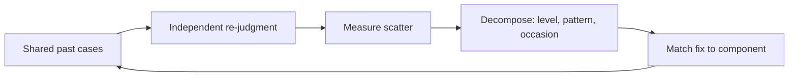

## Why this episode matters

Behavioral economics taught the world about bias: systematic error in one direction. This episode is about the other half of error, the half almost nobody measures. Noise is unwanted variability in judgments that should be identical. Two judges see the same case and give wildly different sentences. Two underwriters price the same risk 52 percent apart. The episode gives you the measurement framework, the audit method, and the hygiene protocols, and it changes how you run every consequential decision.

## Judgment is measurement

### Error has two parts

Definition: bias is systematic error. It pushes judgments in one direction, like a scale that always reads two kilos heavy.

Definition: noise is random variability. It scatters judgments around, like a scale that reads differently every time you step on.

The episode's equation: total error squared equals bias squared plus noise squared. Both contribute. Organizations obsess over bias and ignore noise, partly because bias tells a story about causes while noise is just scatter, and partly because noise is invisible in a single judgment. You need many judgments of the same case to see it.

### The 208 judges

The founding demonstration: 208 federal judges were shown the same 16 criminal cases, with enough detail to set sentences. For cases where the average sentence was 7 years, pick two judges at random and the expected difference between their sentences is about 4 years. Same cases. Same law. That scatter is noise, and it means the sentence depends heavily on which judge you draw.

### The 52 percent underwriters

The business version. Kahneman asked insurance executives: if two underwriters at random price the same complex risk, by how much would you expect them to differ? The common answer, from executives and audiences alike: about 10 percent. The measured truth: 52 percent. Five times the expected noise. The executives were stunned, which is the point. Nobody expects this much scatter in professional judgment, because nobody measures it.

Figure 1. Expected versus actual noise in underwriting. AI Podcast Curriculum, ep04 (Daniel Kahneman interview, 2023-03-14). Shell 1. Show the toy. Source: original toy, from episode claims.

| Quantity | Value |
|---|---|
| Expected difference between two underwriters | About 10 percent |
| Measured difference | 52 percent |
| Ratio of actual to expected | About 5 to 1 |

## Three kinds of noise

### Level, pattern, occasion

A noise audit breaks total noise into components, and the components point at different fixes.

Definition: level noise is differences in average judgment between judges. One judge is simply harsher than another, across all cases.

Definition: pattern noise is differences in how judges respond to particular features of cases. One judge is harsh on theft but lenient on assault. Another reverses it. This is the biggest component in most audits.

Definition: occasion noise is variability within the same judge across occasions. Mood, weather, time since lunch, the previous case. The same judge on a different day gives a different answer.

### The archery metaphor

Picture judges as archers shooting at a target. Bias is the whole cluster landing off-center. Noise is the scatter of the arrows. Now flip the target around: in judgment, there is no visible target. Each judgment is a shot at an unseen bullseye, and the scatter only appears when many archers shoot at the same case.

The metaphor also frames the fix. You cannot see your own scatter from one shot. You need the back of the target: many judgments of the same case, which is exactly what a noise audit collects.

Figure 2. The three kinds of noise. AI Podcast Curriculum, ep04 (Daniel Kahneman interview, 2023-03-14). Shell 2. Count the toy. Source: original toy, from episode claims.

| Kind | Definition | Example |
|---|---|---|
| Level noise | Judges differ in average severity | Judge A averages 8 years, Judge B averages 5 |
| Pattern noise | Judges weigh case features differently | Harsh on theft, lenient on assault, and the reverse |
| Occasion noise | Same judge varies across occasions | Harsher after a bad morning |

## The noise audit

### How to run one

The audit is the episode's central practical method. Pick a set of real past cases. Have multiple judges evaluate each case independently, without discussion. Measure the scatter. Then decompose it into level, pattern, and occasion noise.

The audit does two things at once. It quantifies the problem, which creates the will to fix it, because nobody believes the 52 percent until they see their own number. And it locates the problem: level noise calls for calibration, pattern noise calls for guidelines, occasion noise calls for structuring the judgment environment.

### The model of you beats you

One of the strangest solid findings in judgment research: a simple model of a judge outperforms the judge. Take an expert's past judgments, fit a linear model to how they weigh the cues, and the model predicts better than the expert does on new cases. The model captures the expert's knowledge without the expert's occasion noise. It applies the same weights every time, never tired, never moody.

The lesson is not that experts are useless. The expert's knowledge trains the model. The lesson is that consistency is a free upgrade: remove the scatter and keep the signal.

### The limits of prediction

The Fragile Families study sets the humility bound. Researchers competed to predict life outcomes for children from broken homes, using rich data. The best models moved prediction from about 50 percent to about 57 percent. Enormous effort, tiny gain. Some domains have low predictability ceilings, and no amount of modeling breaks through. A noise audit tells you how much scatter you can remove. Studies like this tell you how much signal exists to find.

## Decision hygiene

### Protocols that reduce noise

Definition: decision hygiene is the set of procedures that reduce noise and bias in judgments, the way hand-washing reduces infection. The episode's protocols:

Mediating assessments: break a complex judgment into independent sub-judgments, evaluate each separately, and only then combine them into the final call. Hiring becomes separate scores for skill, culture fit, and growth, each made before any discussion of the candidate as a whole. This fights the halo effect, where one strong impression contaminates everything.

Independent judgments first: never open with discussion. Have each person record their judgment privately before anyone speaks. Discussion after independent judgment averages out noise. Discussion before it creates conformity and group polarization.

Delay intuition: in the mediating-assessments protocol, the intuitive whole-picture judgment comes last, not first. Let the structured pieces constrain the gut, not the reverse.

### The premortum

The episode's individual judgment exercise, rendered "premortum" in the transcript. Spencer proposes it and Kahneman confirms it. The procedure: make a judgment. Then imagine it turns out bad. Ask yourself what the most likely explanation for the failure is, and adjust the judgment on that basis. Then average the original and the adjusted judgment.

Why it works: the two estimates are quasi-independent, so averaging cancels some noise. It is a crowd within one head. Kahneman rates it about one third as good as asking a second person, because the range of variability inside one individual is narrower than the range between people.

This is not a team ritual. Nobody gathers to declare a project dead. The move is private: force a second estimate out of yourself by imagining the first one failed, then split the difference.

### Reference-class forecasting

The planning fallacy is the systematic tendency to underestimate how long things take and how much they cost, while overestimating benefits. The cure is the outside view: find the reference class of similar past projects, look at their actual outcomes, and anchor your forecast there instead of in your plan's details.

The episode's logic: your project feels unique from the inside. From the outside it is one more instance of a class with a known base rate. The base rate beats the plan. Kahneman's standing advice: when forecasting, distrust the inside view entirely. Let the outside view speak first.

### Groups and crowds

Two findings about collective judgment. Group discussion without structure amplifies noise into polarization: like-minded groups end up more extreme than their average member started. But structured aggregation helps: averaging independent judgments, the wisdom of crowds, cancels noise. Even the crowd within helps: asking one person for two independent estimates and averaging them beats either estimate alone, by roughly a third of the available gain by some measures. [uncertain: the episode gives the direction, not the exact fraction. The "third" is an approximate gloss.]

## The skepticism

### Kahneman doubts debiasing

The episode's most surprising turn: Kahneman is skeptical that teaching people about biases changes their judgments. Knowing about bias does not make your System 1 quieter. What works is not better thinking but better procedure: the hygiene protocols above. You do not debias the judge. You change the process the judge works in.

This is why the chapter matters for the rationality step of this track. Reading about biases feels like self-improvement. Kahneman says it mostly is not. The improvement lives in checklists, independent judgments, and the premortum check, in structure, not insight.

### The replication crisis as self-deception

On the replication crisis, Kahneman's take is personal: researchers deceived themselves, not others. The machinery of motivated reasoning from ep03 operated inside science itself. His remedy is Bayesian thinking, which he calls normatively correct: update beliefs by the rules of probability, state priors explicitly, and let evidence move them by the correct amount. [uncertain: the episode endorses Bayesian norms without working through the formalism.]

## Questions and answers

> [!QA]
> Q: Explain the whole chapter like I am new. What is noise and why should I care?
> A: Noise is unwanted scatter in judgments that should agree. Two judges give the same case sentences years apart. Two underwriters price the same risk 52 percent apart. You should care because the outcome of your case, your loan, your hire, depends heavily on which judge you draw, and nobody notices until they measure it. The fix is procedure: audits, independent judgments, the premortum exercise.
> Follow-up: What is the one equation? Total error squared equals bias squared plus noise squared. Fight both, but start by measuring the one you ignore.

> [!QA]
> Q: Walk me through the three kinds of noise with a hiring example.
> A: Level noise: one interviewer scores everyone a 7, another scores everyone a 4. Pattern noise: one interviewer loves prestigious schools and discounts startups, another does the reverse. Occasion noise: the same interviewer scores lower right before lunch. Each needs a different fix: calibration for level, structured rubrics for pattern, better scheduling and breaks for occasion.
> Follow-up: Which is biggest? Usually pattern noise. People differ most in how they weigh features, not in average harshness.

> [!QA]
> Q: How do I run a noise audit on my own team?
> A: Pick five to ten real past decisions. Have each decision-maker re-judge each case independently, in writing, with no discussion. Measure the scatter across judges for the same case. Decompose it: consistent harshness differences are level noise, feature-weighting differences are pattern noise. Present the number first. The shock creates the will to fix it.
> Follow-up: What is the cheapest first audit? Hiring. Take three past candidates, have interviewers score them blind from the notes, and compare. Most teams have never done this.

> [!QA]
> Q: Why does a model of a judge beat the judge?
> A: The model keeps the judge's knowledge, the cue weights learned from past judgments, and drops the judge's occasion noise. It never has a bad morning. Consistency is a free upgrade when the knowledge is already captured.
> Follow-up: When does this fail? When the environment changes so the old cue weights no longer apply. The model is frozen knowledge. The judge can learn, noisily.

> [!QA]
> Q: What is the premortum exercise, and why does it work?
> A: Make a judgment, then imagine it turns out bad. Name the most likely explanation for the failure, adjust the judgment on that basis, then average the original and the adjusted estimate. It works because the two estimates are quasi-independent, so averaging cancels some noise, like a crowd inside one head. Kahneman rates it about one third as good as asking a second person.
> Follow-up: Run it on your next judgment. Write the original, write the adjusted one, average them. Does the average feel more stable than either alone?

> [!QA]
> Q: What is the outside view, and how do I use reference-class forecasting?
> A: The inside view builds a forecast from your plan's details. The outside view finds the class of similar past projects and uses their actual outcomes as the forecast. To use it: define the reference class, get the base rates for time and cost, and anchor there before adjusting for genuine differences.
> Follow-up: What counts as a genuine difference? A specific, checkable reason your case beats the class average, not enthusiasm. Enthusiasm is the planning fallacy talking.

> [!QA]
> Q: Kahneman says teaching biases does not debias. So what is this chapter for?
> A: It is for changing procedures, not minds. Do not try to think harder about noise. Install the hygiene: independent judgments before discussion, mediating assessments, the premortum check, reference classes. Structure does what insight cannot.
> Follow-up: What is the trap? Collecting bias names as trivia. If your process is unchanged, the chapter changed nothing.

> [!QA]
> Q: How does this chapter connect to ep03 on persuasion?
> A: Both chapters distrust unaided introspection. Ep03 showed your reasons are press releases. Ep04 shows your judgments scatter even when you feel certain. The shared cure is procedure over insight: protocols for persuasion, hygiene for judgment.
> Follow-up: And to ep06 on the scout mindset? The scout wants truth. Noise shows the scout needs instruments, not just motives. Good intentions do not reduce scatter. Audits do.

## Memory aids

- Error squared equals bias squared plus noise squared. Two enemies, one equation.
- 208 judges, 16 cases: two random judges differ by about 4 years on a 7-year average. Same law, lottery sentences.
- Expected 10, measured 52: underwriters scatter five times wider than executives guess.
- Level, pattern, occasion: harshness differs, weights differ, moods differ. Pattern is usually biggest.
- The flipped target: you cannot see your scatter from one shot. Audits show the back of the target.
- The model of you beats you: keep the knowledge, drop the bad mornings.
- 50 to 57: the Fragile Families ceiling. Some domains barely predict. Know the ceiling before you optimize.
- Hygiene, not insight: checklists beat willpower. Kahneman doubts debiasing. He trusts procedure.
- Mediating assessments: score the parts separately, combine last. Halo dies in pieces.
- Independent first: write it down before anyone speaks. Discussion averages noise only if the judgments start independent.
- Premortum: imagine the judgment failed, explain why, adjust, average. One head, two estimates, about one third of a second judge.
- Outside view: your plan is a class member. Forecast from the class base rate.
- Never-confuse pair: bias versus noise. Bias is the cluster off-center. Noise is the scatter. Fixing one does not fix the other.
- Trap card: "Our experts agree." Agreement without independent measurement may be conformity. Audit before you trust consensus.
- Trap card: "I know about biases, so I am safe." Kahneman says knowledge does not transfer. Only the procedure protects you.

## How to imbibe this

- This week: run a premortum on one real judgment. Write the original estimate, imagine it failed, write the most likely explanation, adjust, then average the two. File the averaged number where the decision lives.
- Catch yourself: the next time you feel certain about a judgment, ask when you last measured your scatter on similar judgments. Certainty without an audit is a feeling, not a fact.
- Behavior change per major idea:
  - Noise awareness: for your next three consequential judgments, write down your answer before any discussion. Compare afterward. Note the scatter.
  - Level noise: calibrate with one colleague. Score five past cases independently and compare averages. Adjust.
  - Pattern noise: write your feature weights explicitly before the next evaluation. Ask a colleague for theirs. Discuss only the weights.
  - Mediating assessments: break your next hire or purchase into three scored parts. Combine only after all three are scored.
  - Premortum: install it as a required step before every consequential judgment over one month of effort.
  - Outside view: for your next time estimate, find three comparable past tasks and use their actual durations. Compare with your gut estimate.
  - Model of you: for one repeated judgment you make, write the rule you actually follow. Apply it mechanically twice. Compare results.
- Monthly: pick one repeated decision and compute your own scatter across instances. If you cannot, that is the finding.

## Think it yourself

Harder drills. Do these with your own brain before touching AI. Write answers by hand.

1. Fermi: 208 judges times 16 cases is 3,328 sentences. If each sentencing decision takes 20 minutes, how many judge-hours did the study consume? (Answer: about 1,110 hours. Now ask: what cheaper audit would have found the same scatter?)
2. Argue both sides: "Noise audits are unethical because they undermine trust in professionals." Steelman it: public scatter numbers destroy legitimate authority. Rebut it: hidden lotteries are worse. Where is the line between transparency and institutional damage?
3. Journal: "Where am I the noisy judge?" Pick a repeated judgment you make: grading, interviewing, estimating. Write your last five instances and their outcomes. How much scatter do you see? What would a model of you look like?
4. First principles: derive why averaging independent judgments reduces noise but not bias. What happens to the average when every judge shares the same bias? Design a procedure that attacks shared bias.
5. Observe: for one week, note every group decision you join. Did judgments go independent-first or discussion-first? Tally the polarization: did the group end more extreme than its members started?
6. Design: you run admissions for a program with 1,000 applicants and 50 spots. Write the full decision-hygiene protocol: audit, mediating assessments, independence rules, the premortum check. What does it cost in hours? What noise does it remove?

## Skills you can now use

- Decompose any judgment error into bias and noise.
- Run a noise audit: independent re-judgment of shared cases, then scatter measurement.
- Classify noise into level, pattern, and occasion, and match each to its fix.
- Build mediating-assessments protocols for hiring, grading, and purchasing.
- Run the premortum on consequential judgments: original, imagined failure, adjusted, average.
- Forecast from the outside view with reference classes.
- Distrust bias knowledge as self-protection and install procedures instead.

## Go deeper

- The book behind the episode: https://en.wikipedia.org/wiki/Noise:_A_Flaw_in_Human_Judgment
- Clearer Thinking's free tools for better decisions: https://www.clearerthinking.org

## Figure audit

| Unit | Claim | Before | After | Figure | Medium | Source |
|---|---|---|---|---|---|---|
| u01 | Noise dwarfs expectations | Experts agree closely | 10 expected, 52 measured | fig1 | table | episode claims |
| u02 | Noise has three kinds | Scatter is one thing | Level, pattern, occasion | fig2 | table | episode claims |
| u03 | Audits locate the fix | Noise is mysterious | Independent re-judgment decomposes it | fig3 | mermaid | episode claims |
| u04 | Hygiene beats insight | Learn biases, improve | Procedures, not willpower | ch-text | table | episode claims |

Figure 3. The noise audit as a loop. AI Podcast Curriculum, ep04 (Daniel Kahneman interview, 2023-03-14). Shell 3. Apply the one rule. Source: original toy, from episode claims.

Figure 4 (chapter plate). Noise on one page. AI Podcast Curriculum, ep04. Shell 5. Name the next page that reuses the symbol. Source: original toy, from episode claims.

| Left: cost without the rule | Center: the stored object | Right: cost with the rule |
|---|---|---|
| Sentences by judge lottery. Prices 52 percent apart. Meetings that polarize. Plans built on the inside view. | The error equation plus the three noise kinds plus the hygiene checklist, on one index card. | Audits run on real past cases. Judgments independent-first. Consequential judgments premortumed. Forecasts anchored on base rates. |

Tradeoff: pay the hours of an audit and the friction of procedure, stop paying the lottery tax on every decision.
Footer: you cannot feel your own scatter. Measure it, then procedure it away.
