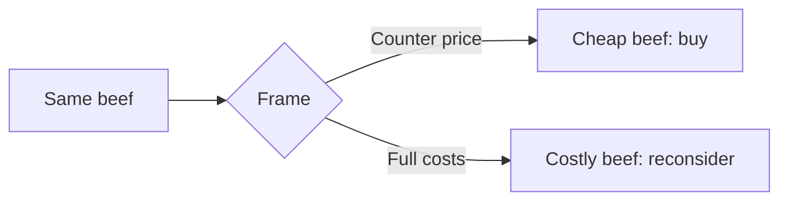

## Why this episode matters

This track teaches rationality as a set of tools. This episode asks whether the toolbox is the wrong shape. Schwartz's target is rational choice theory, the expected-utility spreadsheet that economics treats as the definition of good deciding. His critique is not that people fail at the spreadsheet. It is that the spreadsheet fails at life: values that cannot be numbered, frames that change the answer, preferences that form during the choosing. The episode then builds the alternative: practical wisdom, with components you can actually train.

## The spreadsheet and its failures

### Rational choice theory

Definition: rational choice theory says a good decision means listing your options, assigning each a probability and a utility, multiplying, and picking the highest expected utility. It is the spreadsheet model of the mind.

The theory needs three things to work. Complete options: you can list everything that matters. Measurable values: you can put numbers on every outcome. Stable preferences: your values stay put while you measure them. The episode argues that real decisions routinely lack all three.

### Counting replaces thinking

Schwartz's central complaint: the spreadsheet does not just measure values. It replaces judgment with arithmetic. Once everything has a number, people stop asking whether the numbers capture what matters. The quantification feels rigorous, so the thinking stops.

This is not an argument against numbers. It is an argument against letting the measurable drive out the important. A decision procedure that cannot represent a value will silently optimize against it.

### Incommensurable values

Some values cannot be priced. How much is your integrity worth in dollars? How much is a friendship worth against a promotion? Forcing such trade-offs into a common currency does not make them clearer. It distorts them.

The practical point: when a decision involves values with no common measure, the spreadsheet is the wrong tool. You need judgment, conversation, and time, the materials of wisdom rather than calculation.

Figure 1. What the spreadsheet needs versus what decisions offer. AI Podcast Curriculum, ep05 (Barry Schwartz interview, 2025-10-27). Shell 1. Show the toy. Source: original toy, from episode claims.

| The spreadsheet needs | Real decisions offer |
|---|---|
| Complete list of options | Options discovered during deciding |
| Numbers on every outcome | Values with no common measure |
| Stable preferences | Preferences that form as you choose |
| One right answer | Trade-offs with no common currency |

### Frames change the answer

Definition: a frame is the description of a choice, and different descriptions of the same choice produce different decisions.

The episode's example, via Michael Pollan: the price of beef at the counter excludes the externalities, the environmental and health costs paid elsewhere. Frame the choice as "cheap beef versus expensive beef" and you buy the cheap. Frame it as "beef with hidden costs versus beef without them" and the decision changes. The beef did not change. The frame did.

The COVID example scales this up. Policy framed the choice narrowly around one metric, case counts, and the narrow frame hid the broader costs: closed schools, lost livelihoods, mental health. Narrow frames are not lies. They are spotlights. Everything outside the beam disappears from the decision.

### Preferences are constructed

The deepest cut: preferences do not sit inside you waiting to be measured. They form during elicitation. Ask someone what they want and the asking shapes the answer. Change the order of questions, the available options, the default, and the "preference" moves.

If preferences are constructed, the spreadsheet measures something the measuring creates. This does not make choice impossible. It makes the fantasy of revealed preference, that decisions uncover pre-existing values, untenable. Choosing well means choosing in a way that constructs preferences you can endorse on reflection.

## System 1, System 2, and when to think

### The interplay

The episode uses Kahneman's two systems. System 1 is fast, intuitive, associative. System 2 is slow, deliberate, analytical. Schwartz's point is about their interplay, not their ranking. Good deciding is not System 2 suppressing System 1. It is the knowledge of which system to trust when.

### The Kahneman-Klein debate

The key evidence comes from the adversarial collaboration between Daniel Kahneman and Gary Klein. Klein studied firefighters who make life-or-death decisions in seconds and get them right. He argued intuition is real expertise. Kahneman argued intuition is unreliable. They worked together and converged.

The resolution: intuition deserves trust under two conditions. The environment must be sufficiently regular for patterns to exist, and the decision-maker must get fast, unambiguous feedback. Firefighting qualifies: fires behave lawfully and feedback is immediate. Stock picking mostly does not: the environment is noisy and feedback is slow and ambiguous.

Figure 2. When to trust intuition. AI Podcast Curriculum, ep05 (Barry Schwartz interview, 2025-10-27). Shell 2. Count the toy. Source: original toy, from episode claims.

| Condition | Firefighting | Stock picking |
|---|---|---|
| Environment regular enough for patterns | Yes, fire behaves lawfully | Mostly no, dominated by noise |
| Feedback fast and unambiguous | Yes, immediate | No, slow and ambiguous |
| Intuition trustworthy | Yes | No |

### Tell me when to think

The chess version: Magnus Carlsen was asked how he thinks during games, and the wisdom distilled to this: know when to think. Most positions play themselves through pattern recognition. A few are critical, and those deserve the clock. The skill is not harder thought everywhere. It allocates thought where it pays.

This reframes the rationality project of this track. The goal is not to run System 2 on everything. That is impossible and would paralyze. The goal is the meta-skill: recognize the positions that deserve the clock.

## Practical wisdom

### What wisdom is

Definition: practical wisdom is the capacity to make good decisions in complex, value-laden situations where no procedure suffices. Aristotle's phronesis. Rules need judgment to apply, and judgment is the thing no rulebook contains.

The episode breaks wisdom into components, each trainable:

Reflect on aspirations: know what you are actually aiming at. Most bad decisions start from unexamined goals.

Fit across life: a good decision in one domain that wrecks the others is not good. Wisdom checks the fit across work, relationships, health, and meaning.

Judgment: the trained ability to weigh incommensurables, the thing the spreadsheet cannot do.

Openness: the willingness to be wrong, to hear the case against your plan. This is the scout mindset from ep06, as a virtue.

"It depends": context sensitivity. The wise answer to most hard questions starts here, and the skill is to name what it depends on.

### The three bricklayers

The classic parable: three bricklayers do the same work. Asked about their work, the first says laying bricks. The second says building a wall. The third says building a cathedral. Same motions, different meanings.

The parable is about work orientation: job, career, or calling. But the episode uses it for decisions too. Two people can make the same choice with different understandings of what the choice means. Wisdom includes the cathedral view: seeing what your decisions are actually building.

### Rules need judgment

The closing argument: every decision procedure, including every tool in this track, needs judgment to apply. Expected utility needs judgment to set the utilities. Noise audits need judgment to pick the cases. Premortems need judgment to read the room. There is no procedure that removes the need for wisdom, because applying a procedure is itself a judgment.

This does not defeat the track. It bounds it. Use the tools. But train the hand that holds them.

## Questions and answers

> [!QA]
> Q: Explain the whole chapter like I am new. What is wrong with the spreadsheet?
> A: The spreadsheet model says good decisions maximize expected utility: list options, number the outcomes, pick the biggest. It fails three ways. Real options are discovered while deciding, not listed upfront. Real values often have no common measure, so numbering distorts them. Real preferences form during the choosing, so the spreadsheet measures what the measuring creates. The alternative is practical wisdom: judgment for the parts no procedure covers.
> Follow-up: When is the spreadsheet fine? When options are known, values share a measure like money, and preferences are stable. That is real, and it is narrower than economics pretends.

> [!QA]
> Q: What does "counting replaces thinking" mean? Give me a test for it.
> A: Once everything has a number, people stop asking whether the numbers capture what matters. The quantification feels rigorous, so inquiry stops. The test: ask what the numbers leave out. If the answer is "the most important things," counting replaced thinking.
> Follow-up: Apply it to your own work. What metric do you optimize that leaves out what matters most? What would you measure if honesty beat convenience?

> [!QA]
> Q: Walk me through the framing example with the beef.
> A: The counter price of beef excludes externalities: environmental damage, health costs, paid by others later. Framed as cheap versus expensive beef, you buy cheap. Framed as beef with hidden costs versus without, the decision shifts. Same beef, different frame, different choice. The COVID version: framing policy around case counts hid school closures and lost livelihoods from the decision.
> Follow-up: What is the defense? Reframe every important decision twice before you decide. If the answer changes, the frame did the work.

> [!QA]
> Q: When should I trust my gut, according to Kahneman and Klein?
> A: When the environment is regular enough for patterns to exist and you get fast, unambiguous feedback. Firefighters qualify. Stock pickers mostly do not. The question is never "is intuition good." It is "is this domain one where intuition learned anything."
> Follow-up: Audit one domain where you trust your gut. Does it pass both conditions? If not, you mistake confidence for expertise.

> [!QA]
> Q: What does "tell me when to think" mean in practice?
> A: Most situations play themselves through pattern recognition. A few are critical and deserve deliberate thought. The meta-skill tells the difference: it allocates your System 2 clock to the positions that pay. Thinking harder everywhere is paralysis, not rationality.
> Follow-up: Try it today. Before each decision, ask: is this a pattern position or a clock position? Log your calls and review weekly.

> [!QA]
> Q: Break down the components of practical wisdom and tell me how to train each.
> A: Reflect on aspirations: write your actual goals quarterly and check decisions against them. Fit across life: review big decisions for spillover into other domains. Judgment: practice weighing incommensurables explicitly, in writing. Openness: run the steelman drill from ep02 monthly. "It depends": for every strong opinion, list what it depends on.
> Follow-up: Which component is your weakest? Train that one first. Wisdom is a portfolio, and the weakest holding drags the rest.

> [!QA]
> Q: What is the three-bricklayers parable doing in a chapter on decisions?
> A: It shows that identical actions carry different meanings. Laying bricks, building a wall, building a cathedral: same motions. Decisions work the same way. Two people can choose identically with different understandings of what they chose. Wisdom includes seeing the cathedral: what your decisions are actually building over time.
> Follow-up: Which bricklayer are you at work right now? Answer honestly. Then ask what would change if you decided to be the third.

> [!QA]
> Q: Does this chapter argue against everything else in the track?
> A: No. It bounds the tools. Every procedure needs judgment to apply: setting utilities, picking audit cases, reading the premortem room. The tools work, and the hand that holds them matters more than the tools. Train both.
> Follow-up: What is the failure mode of this chapter? Using "wisdom" as an excuse to ignore the procedures. The bound runs both ways: judgment without hygiene is just noise with confidence.

## Memory aids

- The spreadsheet needs three things: complete options, numbered values, stable preferences. Real decisions offer none of the three.
- Counting replaces thinking: numbers feel rigorous, so inquiry stops. Ask what the numbers leave out.
- Incommensurable values: no common currency. Forcing one distorts the trade-off.
- Frames: same beef, different description, different choice. Reframe twice before deciding.
- Constructed preferences: the asking shapes the answer. Choose so you can endorse the construction.
- Trust intuition when: regular environment plus fast feedback. Fire yes, stocks no.
- Tell me when to think: pattern positions play themselves. Spend the clock on the critical few.
- Wisdom components: aspirations, fit, judgment, openness, it-depends. Train the weakest first.
- Three bricklayers: bricks, wall, cathedral. Same work, different meaning. See the cathedral.
- Rules need judgment: applying a procedure is itself a judgment. No procedure removes the need for wisdom.
- Never-confuse pair: the spreadsheet versus wisdom. The spreadsheet optimizes the measurable. Wisdom judges the rest. You need both, in that order of operations.
- Trap card: "I quantified it, so it is rigorous." Rigor in, rigor out. Garbage utilities give garbage maxima.
- Trap card: "My gut is expert because I have experience." Experience without regularity and feedback is just seniority. Check both conditions.

## How to imbibe this

- This week: take one pending decision and reframe it twice, in writing. If the answer changes across frames, the frame decided, not you. Decide only after the third frame.
- Catch yourself: the next time you reach for a spreadsheet, stop and list what the numbers leave out. If the list holds the most important things, put the spreadsheet down and think first.
- Behavior change per major idea:
  - Counting versus thinking: audit one metric you optimize. Write what it excludes. Decide whether the exclusion is acceptable.
  - Incommensurables: for your next value trade-off, refuse the common currency. Write the trade-off in its own terms and sit with the discomfort.
  - Framing: reframe every consequential choice twice before deciding, for one month.
  - Constructed preferences: notice when a question shapes your answer. Ask how the answer moves with the question order.
  - Intuition trust: list three domains where you trust your gut. Score each on regularity and feedback speed. Demote the failures.
  - Clock allocation: label decisions as pattern or clock positions for one week. Review whether the clock went to the right places.
  - Wisdom components: score yourself 1 to 10 on each of the five. Train the lowest for a month.
- Monthly: review your big decisions. For each, ask: did the procedure serve the judgment, or replace it? Adjust the balance.

## Think it yourself

Harder drills. Do these with your own brain before touching AI. Write answers by hand.

1. Fermi: you make roughly 35,000 decisions a day by some counts, most trivial. If 1 percent deserve the clock and each takes 10 minutes of System 2, how many hours is that? (Answer: 350 decisions times 10 minutes is about 58 hours, impossible. Now ask: what does that imply about the real job of "tell me when to think"?)
2. Argue both sides: "Incommensurable values are just unpriced externalities waiting for better measurement." Steelman it: everything trades off against everything, so a common currency must exist. Rebut it: where does the argument break? Write the break as a principle.
3. Journal: "When did counting replace my thinking?" Write one real case where a metric drove out judgment. What did the numbers leave out? What did it cost?
4. First principles: derive the Kahneman-Klein conditions from scratch. Why should regularity plus feedback produce trustworthy intuition? What kind of learning could happen with regularity but no feedback? With feedback but no regularity?
5. Observe: for one week, catch frames in the wild: headlines, prices, policy pitches. For each, write the reframe that flips the choice. How many of your own recent decisions were frame-driven?
6. Design: you must choose between two job offers with incommensurable values: money versus meaning, prestige versus freedom. Write the decision procedure that refuses the spreadsheet. What does it do instead, step by step?

## Skills you can now use

- Test any decision procedure against the three spreadsheet requirements.
- Detect when counting replaced thinking, and name what the numbers leave out.
- Reframe consequential choices twice before deciding.
- Score intuition trust by environment regularity and feedback speed.
- Allocate deliberation to clock positions, not everywhere.
- Train the five wisdom components, weakest first.
- Apply any procedure with judgment, never instead of judgment.

## Go deeper

- Barry Schwartz's work on choice and wisdom: https://en.wikipedia.org/wiki/Barry_Schwartz_(psychologist)
- Clearer Thinking's free tools for better decisions: https://www.clearerthinking.org

## Figure audit

| Unit | Claim | Before | After | Figure | Medium | Source |
|---|---|---|---|---|---|---|
| u01 | Spreadsheet demands the impossible | Decisions are calculations | Needs complete options, measures, stable prefs | fig1 | table | episode claims |
| u02 | Intuition has conditions | Gut is good or bad | Regularity plus feedback decides | fig2 | table | episode claims |
| u03 | Frames decide | Choices reveal prefs | Same choice, different frame, different answer | fig3 | mermaid | episode claims |
| u04 | Wisdom bounds the tools | Tools suffice | Judgment applies every procedure | ch-text | table | episode claims |

Figure 3. The frame changes the choice. AI Podcast Curriculum, ep05 (Barry Schwartz interview, 2025-10-27). Shell 3. Apply the one rule. Source: original toy, from episode claims.

Figure 4 (chapter plate). Practical wisdom on one page. AI Podcast Curriculum, ep05. Shell 5. Name the next page that reuses the symbol. Source: original toy, from episode claims.

| Left: cost without the rule | Center: the stored object | Right: cost with the rule |
|---|---|---|
| Spreadsheets optimizing the measurable. Frames unexamined. Gut trusted in noisy domains. Clock spent everywhere. | The three spreadsheet requirements plus intuition conditions plus the wisdom components, on one index card. | Decisions reframed twice. Intuition audited by domain. Clock on critical positions. Weakest wisdom component in training. |

Tradeoff: pay the effort of judgment to apply the tools, instead of paying the price of the tools applied blindly.
Footer: the tools work. The hand matters more.
