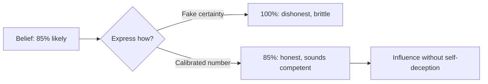

## Why this episode matters

This is the conceptual heart of the track. Every other chapter gives you procedures: audits, protocols, schedules. This one names the motive that makes procedures work. Galef's distinction between the scout and the soldier explains why smart people resist evidence, why techniques alone never stick, and how to want the truth in the first place. The Center for Applied Rationality, which she co-founded in 2012, learned this the hard way: they taught excellent techniques, and the bottleneck was never technique. It was motivation.

## Scout versus soldier

### The two mindsets

Definition: the soldier mindset treats reasoning as combat. The goal is to defend your side and defeat the other. Reasons are weapons. Evidence for your view gets amplified. Evidence against it gets attacked.

Definition: the scout mindset treats reasoning as mapping. The goal is to see the territory as it is. Reasons are instruments. Evidence for and against your view both update the map.

Everyone runs both. The question is which one holds the wheel in a given moment. The soldier feels like conviction and loyalty. The scout feels like curiosity and lightness. The episode's claim: the soldier is the default, because the soldier serves social goals, belonging, status, identity, that usually matter more to us than accuracy.

Figure 1. Soldier versus scout. AI Podcast Curriculum, ep06 (Julia Galef interview, 2023-02-20). Shell 1. Show the toy. Source: original toy, from episode claims.

| | Soldier | Scout |
|---|---|---|
| Goal | Defend your side | Map the territory |
| Evidence for your view | Amplify | Weigh |
| Evidence against your view | Attack | Weigh |
| Losing an argument | Threat | New data |
| Feels like | Conviction, loyalty | Curiosity, lightness |
| Serves | Social goals | Accuracy goals |

### The bottleneck is motivation

CFAR taught rationality techniques to smart, willing students. The techniques worked in the workshop. Then students went home and did not use them. The failure was not comprehension. It was motive. Nobody changed what the students wanted.

This reframes the whole rationality project. Debiasing lists assume the problem is ignorance: teach people the bias and they will correct it. Kahneman said in ep04 that this does not work. Galef says why: the soldier wants to win, not to see. Techniques serve whoever holds them. Give a soldier better arguments and you get a better soldier, not a scout.

The practical consequence: before installing any technique from this track, check the motive. Are you trying to see clearly, or to win? No procedure survives a soldier's motives.

## Why the soldier is rational

### Rational irrationality

Economist Bryan Caplan's concept of rational irrationality, which the episode uses: it can be instrumentally rational to be epistemically irrational.

Definition: epistemic rationality means holding true beliefs. Instrumental rationality means achieving your goals.

Beliefs have consequences beyond accuracy. Believing your startup will succeed motivates the effort that makes success possible. Believing your tribe is right buys belonging. If a false belief pays in motivation or membership, holding it can be the winning move for your goals, even as it fails as a map.

This is uncomfortable and important. The scout mindset is not free. It costs the comforts the soldier provides. Galef's answer is not that accuracy always wins. It is that you should choose your trade-offs consciously instead of letting the soldier choose them for you.

### Present bias in thinking

One specific soldier tactic: present bias applied to beliefs. Thinking hard now costs effort now, while the payoff of true belief arrives later and diffusely. So the mind discounts the future value of accuracy and skips the thinking. This is the same present bias that ruins diets, operating on cognition.

The scout's counter: make the payoff of accuracy vivid and near. Betting does this, as below. So does identity: "I am the kind of person who updates."

### Belief ripple effects

A second soldier tactic: beliefs do not sit alone. Each belief anchors others, which anchor identity, which anchors community. Changing one belief ripples outward, threatening the whole structure. The soldier defends the keystone belief because the cost of updating is not one belief but a cascade.

The scout's counter is to notice the ripple and price it separately. The cascade is real, and it is not evidence about the belief. Fear of the ripple is a motive, not an argument.

## Expected value thinking

### Bezos and the 30 percent

The episode's central case study. When Jeff Bezos considered quitting Wall Street to start Amazon, he estimated about a 30 percent chance of success. The base rate for internet startups was about 10 percent. He adjusted upward for his specific advantages, then did expected-value thinking: 0.30 times an enormous payoff dwarfed the cost of quitting.

The lesson is not optimism. Bezos was not certain. Thirty percent is likely failure. The lesson is that decisions run on expected value, not on confidence. A 30 percent shot at something huge beats a 90 percent shot at something small, and the soldier's demand for certainty would kill the decision.

### Musk and the 10 percent

Elon Musk was more extreme. He has said he gave Tesla and SpaceX each about a 10 percent chance of success, and assumed from the beginning that both would probably fail. Interviewers kept asking: why do it, then? His answer was expected value. A 10 percent chance at transforming industries and opening space carried an expected value no safe career could match.

Galef's deeper point is about motivation. The pop version says winners succeed through unshakable self-belief, literally unable to conceive of failing. Musk is the counterexample. He conceived of failing clearly, assigned it 90 percent, and acted anyway. His motivation did not need certainty. It needed expected value plus a mission worth the likely loss.

Figure 2. Expected-value thinking in the two cases. AI Podcast Curriculum, ep06 (Julia Galef interview, 2023-02-20). Shell 2. Count the toy. Source: original toy, from episode claims.

| | Base rate | Personal estimate | Why act |
|---|---|---|---|
| Bezos, Amazon | About 10 percent of internet startups succeed | 30 percent, adjusted for his advantages | 0.30 times huge payoff beat the cost of quitting |
| Musk, Tesla and SpaceX | About 10 percent | 10 percent each, assumed likely failure | 0.10 times enormous payoff beat any safe career |

### The arithmetic of acting anyway

Work the shape of the reasoning. Expected value equals probability times payoff, minus cost. When the payoff is enormous, even a small probability gives a large expected value. The soldier demands high probability before acting. The scout multiplies.

The trap to avoid: this does not bless every long shot. The base rate matters, which is why Bezos started from 10 percent and adjusted with reasons. Expected value without base rates is just optimism with arithmetic.

## Confidence without self-deception

### Social versus epistemic confidence

Definition: epistemic confidence is how likely you think you are to be right. Social confidence is how confident you appear to others.

The episode's discovery: these can decouple. You can sound confident while being calibrated. Saying "I think there is an 85 percent chance" expresses real uncertainty, yet listeners hear homework and seriousness. Precision reads as competence.

The wording effects are delicate. In the episode's discussion, 87 percent sounds more arrogant than 85, which sounds more arrogant than 80, while 82 sounds more arrogant than 85, which sounds more arrogant than 90. The pattern: round numbers sound estimated, overly precise numbers sound like false precision, except at the top where precision reads as careful. The lesson is not a formula. It is that you can be influential without sacrificing calibration, and the audience rewards the combination.

Bezos modeled this with investors: he told them there was a 70 percent chance Amazon would fail. Epistemic honesty plus social confidence. They funded him anyway.

Figure 3. Social confidence without epistemic overclaim. AI Podcast Curriculum, ep06 (Julia Galef interview, 2023-02-20). Shell 3. Apply the one rule. Source: original toy, from episode claims.

### Reframing versus self-delusion

The scout needs emotional tools, because bare truth is often demotivating. Reframing is the legitimate version: redescribing a situation truthfully in a way that makes the unpleasant parts tolerable. "This failure taught me the exact skill I lacked" can be true and motivating at once.

Self-delusion is the counterfeit: redescribing falsely. "The failure was not my fault" when it was. The test Galef offers: does the reframe survive contact with the evidence? A reframe that needs protection from facts is delusion wearing a costume.

### The press secretary and the board

Two metaphors for the mind's PR department. The press secretary's job is not to find the truth but to defend the administration. Your inner press secretary spins every outcome favorably and never reports bad news upward. The board's job is to govern well, which needs accurate reports.

The scout's practice: notice when you do press-secretary work, writing the favorable spin, and ask what you would report to the board. The two roles cannot both drive. Pick the board.

## Losing to win

### The Monkey Island lesson

From the childhood game Curse of Monkey Island: pirates duel with insults, and when you lose an insult battle, you keep the opponent's winning rejoinder in your toolkit for future duels. Losing teaches you the winning moves.

Galef's application: enter arguments expecting you might lose, because losing harvests weapons. Every point you are forced to concede becomes a tool you own. This appropriates soldier motivation, the desire to win future arguments, in service of scout behavior, engaging honestly now. You do not have to be pure. You just have to aim the impurity at truth.

### Betting to operationalize

The most concrete scout practice in the episode: bet on your beliefs. A belief you will not bet on is a press release. Betting forces the translation from vague confidence to a number, and the number exposes the soldier's padding.

Start small and friendly. Bet with friends on predictions you disagree about. The stakes matter less than the mechanism: the moment money or reputation attaches, the press secretary goes quiet and the scout gets the microphone.

### The Jerry Taylor case

Jerry Taylor was an anti-climate-action activist at the libertarian Cato Institute, paid to argue the threat was overblown. He changed his mind. The episode's telling: what moved him was not defeat but common ground, engagement with people who took his values seriously and showed him the evidence fit his own principles. Soldiers change sides when the other camp stops being the enemy and the map gets better simultaneously.

The lesson for your own persuasion: combine this chapter with ep03. The scout updates on evidence. But evidence arrives through people, and people open up only past the ally-or-enemy sort.

## Questions and answers

> [!QA]
> Q: Explain the whole chapter like I am new. What is the scout mindset?
> A: The soldier mindset treats reasoning as combat: defend your side, defeat theirs. The scout mindset treats reasoning as mapping: see the territory accurately. The soldier is the default because it serves social goals like belonging and status. The scout has to be chosen, and choosing it is mostly about motivation, not technique.
> Follow-up: What is the one-line test? When you encounter counter-evidence, does it feel like an attack or like new data? Attack means the soldier holds the wheel.

> [!QA]
> Q: Why do rationality techniques fail without motivation?
> A: CFAR taught excellent techniques and watched students not use them. The techniques were fine. The students still wanted to win, not to see. A technique in a soldier's hands becomes a better weapon. The bottleneck was never knowledge of the moves. The students lacked the want for the scout's goal.
> Follow-up: What do you do about it? Check the motive before installing the technique. Ask what you want from this reasoning: victory or accuracy? Then pick tools that serve the answer.

> [!QA]
> Q: What is rational irrationality, and why does it matter?
> A: Bryan Caplan's idea: a false belief can be instrumentally rational if it pays. Believing in your startup motivates the effort. Believing with your tribe buys belonging. Epistemic rationality wants true beliefs. Instrumental rationality wants achieved goals. They conflict, and the soldier exploits the conflict.
> Follow-up: What is Galef's response? Not denial. Choose your trade-offs consciously. Know what your comforting belief costs in accuracy, and decide whether the price is worth it.

> [!QA]
> Q: Walk me through the Bezos expected-value reasoning.
> A: Base rate: about 10 percent of internet startups succeed. Personal estimate: 30 percent, adjusted upward for his advantages. Payoff: enormous. Expected value: 0.30 times enormous, minus the cost of quitting Wall Street, strongly positive. He acted on the product, not on certainty. Thirty percent is likely failure, and the decision was still right.
> Follow-up: What is the most common misuse? Skipping the base rate. Starting from your hopes instead of the class average turns expected value into optimism with arithmetic.

> [!QA]
> Q: How can Musk act with only 10 percent confidence?
> A: He separated probability from expected value. Ten percent times an enormous payoff still beats safe careers. And he separated motivation from certainty: he assumed failure, assigned it 90 percent, and acted for the mission anyway. Self-belief was never the fuel. Expected value plus mission was.
> Follow-up: What does this say about "winners never doubt"? It says the pop version is backwards. Clear-eyed doubt plus expected value beats blind confidence.

> [!QA]
> Q: What is the difference between social and epistemic confidence?
> A: Epistemic confidence is your actual probability of being right. Social confidence is how confident you seem. They can decouple: "85 percent chance" states real uncertainty and still sounds competent. Bezos told investors 70 percent failure odds and got funded. You do not need to fake certainty to be influential.
> Follow-up: What is the wording trap? False precision. Overly exact numbers sound arrogant. Round numbers sound like honest estimates. Calibrate the words, not just the number.

> [!QA]
> Q: How do I tell reframing from self-delusion?
> A: A reframe redescribes truthfully to make the unpleasant tolerable: "this failure taught me the missing skill." Delusion redescribes falsely: "not my fault." The test: does the reframe survive contact with evidence? If it needs protection from facts, it is delusion in costume.
> Follow-up: Try it on your last failure. Write the true reframe and the delusional one side by side. Notice which one the press secretary prefers.

> [!QA]
> Q: What is the Monkey Island lesson for arguments?
> A: In the game, losing an insult duel teaches you the winning rejoinder, which you keep for future duels. In arguments, losing harvests weapons: every point you concede becomes a tool you own. Enter debates willing to lose, and you leave every one stronger. Soldier motivation, winning later, serves scout behavior, honesty now.
> Follow-up: What is the betting version? Bet on your disagreements with friends. The bet forces a number, and the number evicts the press secretary.

## Memory aids

- Soldier defends, scout maps. Attack-feeling means the soldier drives.
- The bottleneck is motive: CFAR 2012, great techniques, unused. Want the map first.
- Epistemic versus instrumental: true beliefs versus achieved goals. Price the trade consciously.
- Present bias in thinking: effort now, payoff later, so the mind skips. Make accuracy pay soon.
- Ripple effects: one belief anchors a cascade. Fear of the cascade is a motive, not evidence.
- Bezos 30, base 10: adjust the base rate with reasons, then multiply by payoff.
- Musk 10 and acted: doubt plus expected value beats blind confidence.
- 85 percent: uncertain and competent at once. Precision reads as homework.
- Reframe true, not comfortable: the evidence test separates reframe from delusion.
- Press secretary spins, board governs. Report to the board.
- Monkey Island: lose the duel, keep the rejoinder. Harvest weapons from defeat.
- Bet it: a belief without a bet is a press release.
- Never-confuse pair: confidence versus certainty. Confidence is social and can stay honest. Certainty is epistemic and rarely earned.
- Trap card: "I need to believe to succeed." Check whether the belief or the mission is the fuel. Musk ran on mission.
- Trap card: "More techniques will fix my thinking." Techniques serve motives. Fix the motive first.

## How to imbibe this

- This week: catch the soldier three times. Each time counter-evidence feels like an attack, pause and name it: "soldier driving." Write what the scout would do with the same evidence.
- Catch yourself: the next time you argue, ask whether you want to win or to see. If the answer is win, you are allowed to continue, but stop calling it inquiry.
- Behavior change per major idea:
  - Scout versus soldier: keep a two-column log for one week. Soldier moments left, scout moments right. Review the ratio.
  - Motivation bottleneck: before using any track technique, write your goal for the reasoning. Victory or accuracy? Match the tool to the goal.
  - Rational irrationality: name one comforting belief you hold. Price it: what does it cost in accuracy, and what does it pay in motivation or belonging? Decide consciously.
  - Expected value: take one decision you avoid for low confidence. Compute the expected value honestly from the base rate. Act on the product.
  - Social confidence: in your next three predictions, state a number. Notice how people react to calibrated uncertainty.
  - Reframing: reframe your last failure truthfully. Test the reframe against the evidence.
  - Betting: make one small friendly bet on a disagreement this week. Write the number down first.
- Monthly: review your scout log. Are the soldier's triggers changing? The triggers are the curriculum.

## Think it yourself

Harder drills. Do these with your own brain before touching AI. Write answers by hand.

1. Fermi: CFAR was founded in 2012. If it trained 1,000 people by 2020 and each used the techniques half as often as intended, how many technique-uses were lost to motivation? (Answer: unknowable precisely, which is the point. Now ask: how would you measure the motivation bottleneck in your own life?)
2. Argue both sides: "The scout mindset is a luxury good." Steelman it: people under threat need the soldier. Accuracy is for the safe. Rebut it: when is the soldier most expensive? Write the conditions where each mindset is the right tool.
3. Journal: "When did my press secretary last work overtime?" Write the spin you produced, then the board report you withheld. What did the spin protect?
4. First principles: derive the soldier's default from evolutionary logic. What did defending the tribe's beliefs buy? What does it cost now? At what point does the trade flip?
5. Observe: for one week, watch public arguments and label each move as soldier or scout. What is the ratio? Which moves get rewarded by the audience?
6. Design: you lead a team that must kill a beloved failing project. The team are soldiers for it. Write the plan that moves them to scout mode without triggering the ally-or-enemy sort. What is step one?

## Skills you can now use

- Detect soldier versus scout mode in yourself by the feel of counter-evidence.
- Price comforting beliefs as conscious trade-offs.
- Run expected-value reasoning from base rates on low-confidence decisions.
- Express calibrated uncertainty with social confidence.
- Test reframes against evidence.
- Separate your press secretary from your board.
- Harvest losing arguments for future weapons.
- Operationalize beliefs with bets.

## Go deeper

- Julia Galef's writing on the scout mindset: https://juliagalef.com
- The rationality community's reading list: https://www.rationality.org

## Figure audit

| Unit | Claim | Before | After | Figure | Medium | Source |
|---|---|---|---|---|---|---|
| u01 | Two mindsets drive reasoning | One way to think | Soldier defends, scout maps | Figure 1 | table | original toy, from episode claims |
| u02 | Low confidence can still act | Need certainty to act | EV: 30% and 10% both acted | Figure 2 | table | original toy, from episode claims |
| u03 | Confidence decouples | Honesty looks weak | 85% reads as competent | Figure 3 | mermaid | original toy, from episode claims |
| u04 | Losing harvests weapons | Losing is pure cost | Monkey Island: keep the rejoinder | Figure 4 (chapter plate) | table | original toy, from episode claims |

Figure 4 (chapter plate). The scout mindset on one page. AI Podcast Curriculum, ep06 (original toy, 2023-02-20). Shell 5. Name the next page that reuses the symbol. Source: original toy, from episode claims.

| Left: cost without the rule | Center: the stored object | Right: cost with the rule |
|---|---|---|
| Counter-evidence feels like attack. Techniques unused. Low confidence paralyzes. Certainty faked for influence. | Soldier versus scout plus expected value plus calibrated confidence, on one index card. | Motive checked first. Base rates multiplied. Numbers stated honestly. Lost arguments harvested. |

Tradeoff: pay the discomfort of the scout, instead of paying the price of defending a wrong map.
Footer: want the map. The techniques follow the want.
