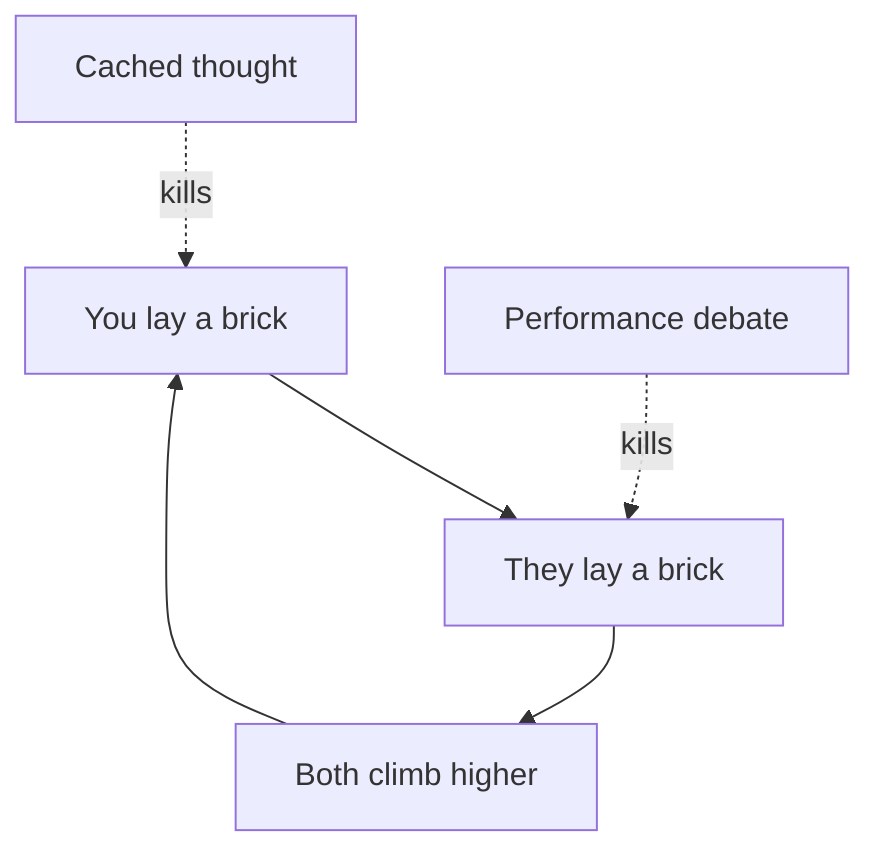

## Why this episode matters

Every skill in this track gets used in conversation. You persuade in conversation, you calibrate in conversation, you find mentors in conversation. Yet nobody teaches the mechanics. This 300th episode turns the lens on the medium itself: what makes a conversation great, what quietly kills it, and how to run the small-group discussions where most real thinking happens. It is the most immediately usable chapter in the track.

## The tower

### Build it together

Bram's metaphor: a great conversation is a tower you build together. You lay a brick, the other person lays a brick, and you both climb higher than either could alone. The tower only rises on joint contribution. If one person lays all the bricks, it is a lecture. If nobody lays any, it is small talk.

The metaphor sets the standard for everything else. Every technique in the chapter serves the tower: does this move add a brick, or does it knock one off?

### Cached thoughts

The most common tower-killer: cached thoughts. These are ideas the person thought before, packaged and ready to repeat. You raise a topic and out comes the recording. No new brick gets laid because the brick was cut years ago.

The tell: the response arrives too fast and too smooth, and it does not quite touch what you said. The cure is to notice and redirect: ask for the thought they have not had yet. "What is your newest thinking on this?" Aim the conversation at the uncached edge.

### Debate as performance

A second tower-killer: treating conversation as debate-as-performance. The participants play to an invisible audience, scoring points instead of laying bricks. This is the soldier mindset from ep06 wearing a conversational costume.

The test: would this person say the same thing with no audience? If the move only makes sense as a performance, the tower is not the project. The project is status.

Figure 1. The tower. AI Podcast Curriculum, ep07 (Uri Bram interview, 2026-03-20). Shell 1. Show the toy. Source: original toy, from episode claims.

## Vibe and speed

### The vibe check

Before content, there is vibe: the felt sense of goodwill, energy, and safety in the conversation. Bram treats vibe as load-bearing, not decorative. People constantly monitor it through micro-expressions, tone, and pace, and the monitoring runs in the background of every exchange.

The practical point: you cannot think well with someone while your social monitoring screams danger. Establishing goodwill is not nicety. It is the precondition for the tower. This is the conversational version of ep03's rapport step.

### Match their speed

Conversations have a speed: how fast ideas arrive, how much pause is allowed, how quickly turns change. When speeds misalign, both people suffer. The fast thinker feels dragged. The slow thinker feels run over.

The fix is a deliberate match. Notice the other person's speed and meet it. Give pauses to people who need them. Do not mistake your speed for the correct speed. Speed is a property of the pair, not of the person.

### Voice, video, and monitoring load

The medium changes the monitoring load. Video adds faces to watch, expressions to parse, self-image to manage. Voice-only removes that channel, which can free attention for the actual thinking. The trade exists: video carries warmth and nuance that voice lacks. But when a conversation keeps stalling, consider whether the medium taxes the very attention the tower needs.

## Definitions first

### One in three disagreements is not a disagreement

Bram's estimate: about one in three of his disagreements turned out, by the end, to involve no real disagreement at all. The two sides meant different things by the key words. They argued fiercely, then discovered they agreed.

The mechanism: most heated arguments are secret debates about definitions. "Is this art?" "Is that fair?" The words have fuzzy boundaries, and the contested cases live exactly on the fuzzy edges. Neither side states their definition, so they fight over the word instead of comparing meanings.

### Taboo the word

The fix comes from the rationality tradition: taboo the contested word. Ban it from the conversation and restate each claim without it. "Can we come up with a different word for this?" If the disagreement evaporates without the word, it was never about the world. It was about the label.

The discipline: when a debate heats up, stop and ask what each side means by the central term. Do this early, not after an hour. An hour of definition-mismatch argument is an hour of tower demolition.

### Secret debates about values

The sibling case: some arguments are secret debates about values wearing factual clothes. "Is immigration good?" smuggles "which values matter most?" inside a factual-sounding question. The fix is to surface the values: list which values more immigration promotes and which values less immigration promotes, and check whether both sides agree on that mapping even while ranking the values differently.

This is tower-building at its best. Two people with different values can still lay bricks together about consequences. The disagreement shrinks to its true size: a difference in weights, not a war over reality.

Figure 2. Triaging a disagreement. AI Podcast Curriculum, ep07 (Uri Bram interview, 2026-03-20). Shell 2. Count the toy. Source: original toy, from episode claims.

| Type | Test | Fix |
|---|---|---|
| Definition mismatch, about 1 in 3 | Taboo the word. Does the fight survive? | State meanings, compare, move on |
| Factual disagreement | Can we check it? | Find the checkable crux |
| Values disagreement | Do we rank values differently? | Map values to consequences together |

### Marginal thinking

The immigration example carries the deeper lesson: marginal thinking. The question is not "immigration good or immigration bad." The question is about the margin: given the current level, what do a few more or a few fewer do? Binary categories make bad conversations because reality is continuous and the interesting question is always at the edge.

Apply this everywhere. Not "is this policy good" but "what does the next unit buy and cost." Not "do I trust them" but "trust them with what, how much." The margin is where the bricks are.

## The dark forest

### Garden and forest

Bram's metaphor for the mind: consciousness is a garden where you can think deliberately and work through logic. Beyond a high wall lies a dark forest, the subconscious, where you cannot see. You throw things over the wall, questions, problems, and sometimes things come back: insights, ideas, dreams.

The practical use: feed the forest well and give it time. The garden does the deliberate work. The forest does the associative work. Great conversations feed both, which is why talking through a hard problem with the right person produces ideas neither garden could grow alone.

### The nine muses

Bram's playful version: he experiences ideas as arriving from nine muses, as if he were a conduit rather than a source. [uncertain: presented in the episode as a half-serious metaphysical joke, with Spencer pushing on its testability.] The serious point underneath: the feeling that ideas arrive from outside is real and widespread, and treating the subconscious as an ally to consult beats treating it as a stranger to ignore.

## Light gassing

### The opposite of gaslighting

Bram's coined term: light gassing is the opposite of gaslighting. Gaslighting makes people doubt their correct perceptions. Light gassing reinforces their false ones: "yes, the other side is all evil and stupid," said with team warmth.

It feels like camaraderie. It functions as corruption. Every group does it, because agreeing with the tribe feels like belonging. The cost is the map: each round of mutual reinforcement moves the group's beliefs further from reality, and the warmth makes the drift invisible.

The defense: notice when agreement feels too good. Ask what the group would say about its own side's flaws. If the answer is nothing, someone is light-gassing you, and the tower rises from crooked bricks.

## Group conversations

### Four works, seven breaks

Bram's numbers for group conversation: four people can have a great discussion. By seven, it breaks down. The mechanism is the buzzer problem: with seven people competing for turns, the threshold for speaking rises so high that most people barely talk. The conversation becomes a broadcast by the two loudest.

The fix is structural, not moral. Keep intellectual conversations at four or fewer. Above that, you run a different format, and you should design for it: explicit turn-taking, written contributions, or splitting up.

### Thresholds and norms

Two invisible thresholds govern every group. The relevance threshold: how on-topic must a contribution be to earn a turn? The interruption threshold: how hard is it to break in? Every group sets these by norm, and mismatched expectations cause most of the pain. The dominator is often just someone with a low interruption threshold in a high-threshold group.

The move: make the norms explicit. State the format you want. "Let us go around" or "interrupt freely" each work, but the group has to agree which game it plays.

### Be the host

Tamsin Wolf's advice, quoted in the episode: act like the host of a dinner party. The host's job is everyone's experience: drawing out the quiet, redirecting the dominant, keeping the energy up, ending things gracefully. You do not need to be the actual host. Adopting the role gives you permission to do the maintenance work great conversations need.

This includes the exit. Leaving a conversation well is a skill: the graceful close that preserves the relationship and the tower for next time. Hosts do not just vanish. They land the plane.

Figure 3. Group size and the buzzer problem. AI Podcast Curriculum, ep07 (Uri Bram interview, 2026-03-20). Shell 3. Apply the one rule. Source: original toy, from episode claims.

| Group size | What happens |
|---|---|
| 2 to 4 | Real conversation possible, turns flow |
| 5 to 6 | Strained, quiet members fade |
| About 7 | Buzzer problem: most people barely speak |

## Questions and answers

> [!QA]
> Q: Explain the whole chapter like I am new. What makes a conversation great?
> A: Two people building a tower together: each lays bricks of new thought, and both climb higher than either could alone. Three things kill it: cached thoughts, repeating pre-packaged lines instead of thinking fresh. Performance debate, playing to an audience instead of building. And vibe failure, where social danger shuts down thinking. The skills: match speed, establish goodwill, keep the bricks new.
> Follow-up: What is the one question that tests a conversation? "Did either of us think a thought we had not thought before?" If no, no tower was built.

> [!QA]
> Q: What are cached thoughts and how do I unstick a conversation full of them?
> A: Cached thoughts are pre-thought, packaged positions replayed on trigger. The tell is speed and smoothness: the answer arrives too fast and does not quite touch what you said. Unstick it by aiming at the uncached edge: "What is your newest thinking on this?" or "What would change your mind here?" Ask for the thought they have not had yet.
> Follow-up: Check yourself first. What are your cached thoughts, the recordings you play? Name three. Notice how rarely anyone asks you for a fresh one.

> [!QA]
> Q: Walk me through tabooing a word in a real argument.
> A: Pick the contested word, like "fair." Ban it. Each side restates their claim without it: "the policy gives group A twice the funding of group B." Now compare the restated claims. If the heat evaporates, the fight was about the label. If a real disagreement remains, you have finally found it, and it is usually smaller than the shouting suggested.
> Follow-up: Why do people resist this? Because the word carries tribal charge, and dropping it feels like disarming. That feeling is the soldier objecting. Thank it and proceed.

> [!QA]
> Q: What is the difference between a secret debate about definitions and one about values?
> A: A definitions debate asks "is it in the category," like whether something counts as art. A values debate asks "is it good," like whether immigration is desirable. Both hide inside factual-sounding language. Fix the first by tabooing the word. Fix the second by mapping values to consequences together, so both sides can agree on the map while ranking values differently.
> Follow-up: Which is more common in your arguments? Track five disagreements this week and classify each. Most people are surprised by the ratio.

> [!QA]
> Q: Explain marginal thinking with the immigration example.
> A: "Immigration good or bad" is a binary trap. The real question is marginal: from the current level, what do a few more or fewer immigrants do to each value you care about? Binary categories make bad conversations because reality is continuous. The interesting question is always at the edge, not at the extremes.
> Follow-up: Apply it to a personal decision. Not "should I exercise" but "what does the next session buy." Notice how the margin decides what the binary cannot.

> [!QA]
> Q: What is light gassing and why is it dangerous?
> A: The opposite of gaslighting: reinforcing the group's false perceptions with warm agreement. "Yes, the other side is all evil." It feels like belonging and functions as corruption, drifting the group's map from reality while the warmth hides the drift. The defense is to notice when agreement feels too good and ask what the group says about its own flaws.
> Follow-up: Where do you get light-gassed? Name the group. Then name one true criticism of your own side you would never voice there. That silence is the measure.

> [!QA]
> Q: Why do group conversations break at seven, and what do I do about it?
> A: The buzzer problem: with seven competing for turns, the bar for speaking rises so high that most people go quiet, and the two loudest broadcast. Fix it structurally. Keep thinking conversations at four or fewer. Above that, design the format: turn-taking, written input, or split up. Do not moralize the dominator. Fix the game.
> Follow-up: What are the two thresholds? Relevance, how on-topic a bid must be, and interruption, how hard it is to break in. Make both explicit at the start.

> [!QA]
> Q: What does it mean to act like the host of a dinner party?
> A: Take responsibility for everyone's experience: draw out the quiet, redirect the dominant, keep energy up, land the ending gracefully. You do not need the title. The role gives you permission to do the maintenance work conversations need but nobody owns. Including the exit: hosts land the plane instead of vanishing.
> Follow-up: Try it once this week in a group you do not lead. Notice how the role changes what you are allowed to do.

## Memory aids

- The tower: bricks laid together, both climb. No new bricks, no tower.
- Cached thoughts: too fast, too smooth, does not touch what you said. Ask for the unthought thought.
- Performance debate: would they say it with no audience? If no, it is status, not building.
- Vibe first: goodwill is the precondition, not the decoration.
- Speed match: meet their pace. Your speed is not the correct speed.
- One in three: the disagreement is about the word, not the world. Taboo it early.
- Secret debates: definitions hide in "is it," values hide in "is it good." Surface both.
- The margin: not good or bad, but what the next unit buys. The edge is where the bricks are.
- Garden and forest: deliberate work in the garden, associative work in the forest. Feed both.
- Light gassing: warm agreement, false map. Agreement that feels too good is the warning.
- Four works, seven breaks: the buzzer problem. Design the format, do not blame the loud.
- Two thresholds: relevance and interruption. Name the game before playing.
- Be the host: own the maintenance. Land the plane.
- Never-confuse pair: cached thought versus fresh thought. Speed and smoothness mark the cache. Effort and fit mark the fresh.
- Trap card: "We disagree." Check the definitions first. One time in three, you do not.
- Trap card: "The loudest person is the problem." The format is the problem. Fix the game, not the player.

## How to imbibe this

- This week: taboo one contested word in one real disagreement. Restate both claims without it. Write down what survived.
- Catch yourself: the next time you answer fast and smooth, stop. Ask whether you just played a cached thought. Replace it with your newest thinking.
- Behavior change per major idea:
  - Tower: after each significant conversation, ask whether either of you thought a new thought. Log the hit rate.
  - Cached thoughts: list your three most-played recordings. Write the fresh version of each.
  - Speed: in your next three conversations, deliberately match the other person's pace. Note what changes.
  - Vibe: before content, establish goodwill explicitly. Watch the monitoring calm down.
  - Definitions: run the one-in-three check on every heated disagreement this month.
  - Marginal thinking: reframe three binary questions as marginal ones this week.
  - Light gassing: identify one group that warms you with false agreement. Voice one true criticism of your own side there.
  - Groups: cap your next thinking conversation at four. If it must be larger, set explicit turn norms.
  - Hosting: adopt the host role once this week. Draw out one quiet person and land one ending well.
- Monthly: review your conversation log. Which tower-killer appears most? That is your curriculum.

## Think it yourself

Harder drills. Do these with your own brain before touching AI. Write answers by hand.

1. Fermi: if one in three disagreements is definitional and you have two heated disagreements a week, how many hours a year do you spend fighting over words? (Answer: depends on your length, but even at 30 minutes each, that is about 17 hours a year. Now ask: what would tabooing the word in the first five minutes save?)
2. Argue both sides: "Cached thoughts are efficient and good." Steelman it: repackaging settled conclusions saves time for new problems. Rebut it: when does the cache become a cage? Write the rule for when to replay and when to rethink.
3. Journal: "When did I last light-gas someone?" Write the warm agreement you offered that you did not believe. What did it cost the map? What did it buy you?
4. First principles: derive the buzzer problem from turn competition. Why does the speaking threshold rise with group size? What is the optimal group size for different conversation goals?
5. Observe: for one week, watch conversations and label each turn as brick, cache, or performance. What is the ratio in your circles? Which are you?
6. Design: you must run a 12-person discussion that actually thinks. Write the format: how do turns work, how do definitions get fixed, how does the quiet get heard? What breaks first?

## Skills you can now use

- Build the tower: lay new bricks, test for new thoughts.
- Detect cached thoughts by speed and smoothness, and redirect to the uncached edge.
- Match conversational speed deliberately.
- Taboo contested words to dissolve definition fights.
- Surface hidden values debates and map consequences together.
- Think marginally instead of binarily.
- Detect light gassing and voice the missing criticism.
- Run group conversations at the right size with explicit norms.
- Adopt the host role: draw out, redirect, land the ending.

## Go deeper

- The Clearer Thinking podcast archive: https://podcast.clearerthinking.org
- Clearer Thinking's free tools for better decisions: https://www.clearerthinking.org

## Figure audit

| Unit | Claim | Before | After | Figure | Medium | Source |
|---|---|---|---|---|---|---|
| u01 | Conversations build towers | Talk is exchange | Joint brick-laying climbs higher | fig1 | mermaid | episode claims |
| u02 | Disagreements need triage | All fights are real | Definitions, facts, values | fig2 | table | episode claims |
| u03 | Groups break at seven | More minds, better | Buzzer problem above four | fig3 | table | episode claims |
| u04 | Warmth can corrupt | Agreement is good | Light gassing drifts the map | ch-text | table | episode claims |

Figure 4 (chapter plate). Great conversation on one page. AI Podcast Curriculum, ep07. Shell 5. Name the next page that reuses the symbol. Source: original toy, from episode claims.

| Left: cost without the rule | Center: the stored object | Right: cost with the rule |
|---|---|---|
| Cached recordings replayed. Performances for invisible audiences. Definition fights. Seven-person broadcasts. | The tower plus the triage table plus the group-size rule, on one index card. | Words tabooed early. Margins examined. Groups capped at four. Host role adopted. |

Tradeoff: pay the effort of hosting and tabooing, instead of paying the hours of fights that were never about facts.
Footer: lay a brick. Climb together.
