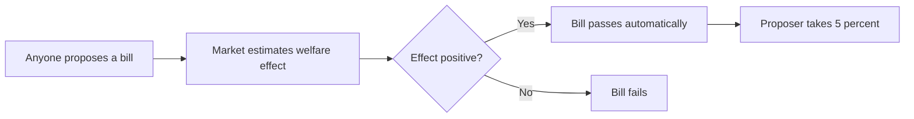

## Why this episode matters

Democracy asks voters to do two jobs at once: say what they want, and guess which policies get them there. Voters are decent at the first and terrible at the second. Futarchy splits the jobs. Vote on values, the ends. Bet on beliefs, the means. Prediction markets, which aggregate dispersed information better than any committee, pick the policies that score highest on the voted values. This chapter is the track's most radical institutional idea, and its most practical: you can trial it on your team this month.

## The problem futarchy solves

### Two jobs, one voter

Every policy decision mixes values and beliefs. Values: what should we maximize? Beliefs: which policy maximizes it? Democracy hands both to the same voter at the same time. The result: elections become contests of tribal loyalty and vivid stories, while the actual consequences of policies go unexamined.

The deeper issue is incentive. A single vote almost never decides anything, so voters have no reason to become informed. Economists call this rational ignorance: staying ignorant is the rational response to a vote that does not matter. But a single bet in a prediction market can pay, so bettors have reason to get informed. Futarchy moves the belief job to the institution with the better incentives.

### Why not just markets everywhere

The objection: if markets are so good, why vote at all? Because markets need a score to maximize. "The stock price" works for a company. A nation needs a voted measure of national welfare. Values are irreducibly political. Futarchy does not remove politics. It confines politics to the values question, where it belongs, and removes it from the beliefs question, where it corrupts.

## Vote on values, bet on beliefs

### The core mechanism

Definition: futarchy is a governance system where citizens vote on a welfare measure, the definition of the good, and prediction markets choose the policies expected to maximize it.

The slogan: vote on values, bet on beliefs. The vote sets the target. The betting finds the best shot at the target. Politicians as we know them become unnecessary for the belief part: you do not need a representative's guess about consequences when you have a market price.

Figure 1. How futarchy splits the decision. AI Podcast Curriculum, ep08 (Robin Hanson interview, 2023-09-13). Shell 1. Show the toy. Source: original toy, from episode claims.

| Job | Who does it | Institution |
|---|---|---|
| Define the good (values) | Citizens | Vote on a welfare measure |
| Find what achieves it (beliefs) | Informed bettors | Prediction markets on policies |
| Execute | Administrators | Ordinary management |

### The welfare function

The voted measure needs to be concrete: a national welfare function, some index combining the things citizens value. Hanson is candid that defining it is the hard political problem. But notice the advantage: the fight happens once, over the measure, in the open, instead of hiding inside every policy debate forever.

## Conditional decision markets

### The CEO example, worked

The episode's central worked example. A board must decide: keep the CEO or fire them. Set up two stock markets with a twist. Market A trades the company's stock but all trades are called off if the CEO stays. Its price estimates the company's value if the CEO leaves. Market B trades the same stock but all trades are called off if the CEO leaves. Its price estimates the company's value if the CEO stays.

Now compare the two prices. If market A prices the company higher than market B, the market says the company is worth more without the CEO. Fire them. If B is higher, keep them. Speculators chasing profit have told you which decision to make, without anyone needing to argue about the CEO's character.

Definition: a conditional decision market is a prediction market whose trades execute only if a specified decision is taken, so its price estimates outcomes under that decision.

Figure 2. The CEO decision market. AI Podcast Curriculum, ep08 (Robin Hanson interview, 2023-09-13). Shell 2. Count the toy. Source: original toy, from episode claims.

| Market | Trades called off if | Price estimates |
|---|---|---|
| A | CEO stays | Company value if CEO leaves |
| B | CEO leaves | Company value if CEO stays |
| Decision rule | | Pick the decision with the higher price |

Walk the logic. In market A, a trader asks: across all scenarios where the CEO leaves, what is the company worth? They buy if their number exceeds the price, sell if below. The price converges on the conditional expected value. Same for B. The difference of the two prices is the market's verdict on the decision.

### Call-off betting

The call-off mechanism is the key innovation. Ordinary betting on "will the CEO be fired" tells you about politics. Conditional betting tells you about consequences. Tying the trade's validity to the decision filters out everything except the decision's expected effect.

### Decision selection bias

The subtle failure mode. If you read the prices a month before the decision, the prices reflect not just the decisions' merits but also predictions about which decision will be taken. Suppose the market expects the board to keep a bad CEO. Then market B's price, value if the CEO stays, gets set in worlds where boards make bad calls, which can distort the comparison.

The fix has two parts: decide at the right moment, and get the information into the prices. At the moment of decision, with everything the board knows reflected in the prices, the bias vanishes. The prices become true conditional expected values. The practical rule: run the decision market so it resolves on information available at decision time, and make sure the board's information can reach the market, by trading or by telling someone who trades.

### Insider trading is good here

The deliberately provocative claim: in decision markets, insider trading should be allowed. The usual case against insider trading is that it scares ordinary investors away from the stock. But decision markets are not about attracting investment. They are about accuracy on one question. Insiders with real information make the price more accurate, which is the whole point.

Hanson's general principle: let the founders decide. The trade-off between participation and accuracy belongs to the institution running the market. For decision markets, accuracy wins, so welcome the insiders.

### Subsidized market makers

Accuracy can be bought. When a decision matters enough, subsidize an automated market maker that loses money on average to informed traders. The subsidy draws in information: traders see profit in being right, and even the uninformed suffer less from trading against sharps. You pay for information about a decision worth more than the subsidy costs.

### Combinatorial markets

Policies interact. The best tax policy depends on the spending policy. Combinatorial markets let traders bet on combinations, pricing the interactions instead of assuming independence. The machinery is more complex, but the principle is the same: let prices, not committees, find the best bundle.

## From nations to teams

### Bill auctions

Scale futarchy down to legislation. Anyone may propose a bill. A market estimates the bill's effect on the welfare measure. If the market says it helps, the bill passes automatically, and the proposer gets 5 percent of the gains as a fee.

The 5 percent is the engine. It pays people to find improvements, the way finders' fees pay for lost wallets. Politics becomes a search process: thousands of proposers hunting for welfare gains, markets judging them, 5 percent rewarding the finders.

### Hypocrisy gets harder

The prostitution example: laws against prostitution, drugs, and gambling are widely supported and widely unenforced. Under futarchy, supporting a ban means betting the ban improves the welfare measure. If the market says the ban fails, you must either drop the ban or admit you support it for reasons outside welfare. Cheap moral posturing gets expensive.

### Small-scale trials

You do not need a nation to start. The episode's trials, from smallest up:

Restaurant darts: the team lists dishes, throws darts at the board, and the two dishes with darts become the specials. A silly market that breaks decision deadlock.

Deadlines: bet on whether the project ships by a date. The price reveals what the team actually believes, not what the plan claims.

Hiring: conditional markets on candidate success. Bet on performance if hired versus if not.

The pattern: anywhere a group pretends to agree about a forecast, a market extracts the real beliefs. Start where the stakes are low and the feedback is fast.

Figure 3. The bill auction. AI Podcast Curriculum, ep08 (Robin Hanson interview, 2023-09-13). Shell 3. Apply the one rule. Source: original toy, from episode claims.

### Why elites resist

From Hanson's Elephant in the Brain theme: stated motives hide real ones. Prediction markets get killed inside companies when they contradict managers, because the market exposes that the manager's judgment was the product being sold. Futarchy threatens everyone whose status rests on being the decider rather than being right. Expect resistance exactly where the current system rewards confidence over accuracy.

## Side ideas worth stealing

### Sacred money

Money consecrated to the sacred only. Take ordinary money to a sacred bank and get back sacred money that you can only spend on sacred things: health, education, charity. The bank verifies that each payment went to a sacred end, and recipients can convert it back to regular money for living expenses. The point is separation: money committed to the sacred cannot fund the profane, so a prediction market or venture that runs on sacred money stays a sacred enterprise.

### Tax career agents

Let agents auction the right to a share of your future income, say 20 percent, in exchange for career advice and promotion. The agent profits only if you prosper, which aligns incentives better than any fee-for-advice model. The harbor tax variant: tax the gains to fund the commons.

### Cost-accounting equilibrium

The meta-principle underneath: institutions settle into equilibria where everyone accounts for costs honestly because the prices force it. Futarchy is one such equilibrium. Design mechanisms so that honesty pays and self-deception costs, and the system debiases itself.

## Questions and answers

> [!QA]
> Q: Explain the whole chapter like I am new. What is futarchy?
> A: Split every policy decision into values and beliefs. Citizens vote on the values: what should we maximize, the welfare measure. Prediction markets handle the beliefs: which policy maximizes it. The slogan is vote on values, bet on beliefs. Markets aggregate information better than voters because bettors get paid for being right, while voters do not.
> Follow-up: What does futarchy not do? It does not remove politics. It confines politics to the values question, where disagreement is legitimate, and removes it from the beliefs question, where it is just noise.

> [!QA]
> Q: Walk me through the CEO decision market step by step.
> A: Create two stock markets. In market A, trades are called off if the CEO stays, so its price estimates company value if the CEO leaves. In market B, trades are called off if the CEO leaves, so its price estimates value if the CEO stays. Traders buy or sell against their own estimates, driving each price to the conditional expected value. Compare the prices. The higher one names the better decision.
> Follow-up: Why the call-off? Without it you learn about politics, who will be fired. With it you learn about consequences, what firing achieves. The call-off filters everything but the decision's effect.

> [!QA]
> Q: What is decision selection bias and how do I avoid it?
> A: If you read conditional prices before decision time, they mix the decisions' merits with predictions about which decision gets taken. Avoid it by resolving on decision-time information: make sure everything the decider knows is in the prices, via their own trading or someone they inform, and read the prices at the moment of choice.
> Follow-up: What is the one-sentence version? Prices must reflect the decision's consequences, not predictions of the politics around it.

> [!QA]
> Q: Why would anyone allow insider trading?
> A: In ordinary stock markets, insider trading scares away investors, which companies dislike. In decision markets, nobody invests. The product is accuracy about one decision. Insiders with real information improve that accuracy. Hanson would let each institution choose, and for decision markets the choice is clear: welcome the informed.
> Follow-up: What is the general principle? Match the rule to the market's purpose. Participation rules for investment markets, accuracy rules for decision markets.

> [!QA]
> Q: How does the bill auction work, and what is the 5 percent for?
> A: Anyone proposes a bill. A market estimates its effect on the welfare measure. Positive estimate: it passes automatically. The proposer collects 5 percent of the gains. The fee pays people to hunt for improvements, turning legislation into a compensated search process instead of a status contest.
> Follow-up: What stops spam proposals? The market judges each one, and proposers presumably stake something. Bad bills die in the market, not on the floor.

> [!QA]
> Q: How do I trial futarchy without a country?
> A: Start where forecasts are pretended and feedback is fast. Bet on ship dates to reveal what the team really believes. Throw darts at restaurant options to break deadlock. Run conditional markets on hires: performance if hired versus not. Each trial teaches the mechanics and builds the habit of pricing beliefs.
> Follow-up: What is the smallest first step? One question, one market, one decision this month. "Will we ship by Friday" with real small stakes beats a planning meeting.

> [!QA]
> Q: Why do prediction markets get killed inside companies?
> A: They contradict managers. A market that prices the truth exposes that the manager's judgment was the product on sale. From the Elephant in the Brain view, stated motives, "we want accuracy," hide real ones, "we want my authority unchallenged." Expect resistance exactly where status rests on deciding rather than being right.
> Follow-up: How do you introduce them anyway? Start below the threat radar: team-level forecasts with no manager's pet project at stake. Let the accuracy record build before aiming upward.

> [!QA]
> Q: What is the hardest part of futarchy, honestly?
> A: The welfare function. Defining the good in a votable measure is the genuinely hard political problem, and Hanson does not pretend otherwise. The defense: fight that fight once, in the open, instead of smuggling it into every policy debate forever. Hard does not mean worse than the alternative.
> Follow-up: What is the second hardest? Getting anyone to try it. The people who could authorize trials are the people trials would displace. Start small, where permission is cheap.

## Memory aids

- Vote values, bet beliefs: the slogan is the system. Politics sets the target. Markets find the shot.
- Call-off: trades valid only if the decision is taken. Filters politics, keeps consequences.
- CEO market: A prices firing, B prices keeping. Higher price wins.
- Selection bias: read prices at decision time, with decider info in the market.
- Insiders welcome: accuracy is the product. Let the informed trade.
- Subsidize the maker: pay for information when the decision is worth it.
- Bill auction: propose, market judges, 5 percent to the finder.
- Hypocrisy tax: support a ban, bet the ban works. Posturing gets priced.
- Darts to deadlines: trial small, feedback fast. Ship-date bets beat planning meetings.
- Markets die where managers feel threatened. Start below the radar.
- The welfare function is the hard part. Fight it once, openly.
- Never-confuse pair: prediction market versus decision market. Prediction markets forecast what will happen. Decision markets price what would happen under each choice.
- Trap card: "Markets are undemocratic." Futarchy votes on the ends. That is the democratic part. Markets only handle the means.
- Trap card: "We tried voting and it failed." Voting on beliefs failed. Nobody tried betting on them at scale.

## How to imbibe this

- This week: run one micro-market. Pick a team forecast everyone pretends to agree on, like a ship date, and collect anonymous priced beliefs. Compare the market with the plan.
- Catch yourself: the next time a meeting debates a forecast, notice that nobody prices their belief. Ask: what would we bet?
- Behavior change per major idea:
  - Values versus beliefs: for your next three disagreements, separate the values question from the beliefs question. Notice how many fights are really about the second wearing the first's clothes.
  - Conditional thinking: for your next big decision, write the two conditional estimates explicitly: outcome if A, outcome if B. Compare like the CEO market.
  - Insider welcome: identify who holds the real information on your next decision. Get them priced in, formally or informally.
  - Subsidize information: for one important decision, pay for the answer: a small bounty for the best forecast beats a long meeting.
  - Bill auction at home: let anyone propose an improvement with a priced claim. Adopt what the evidence supports.
  - Trial small: run the restaurant dart test or the ship-date bet within two weeks.
- Monthly: review your decisions. How many used priced beliefs versus argued opinions? Shift the ratio.

## Think it yourself

Harder drills. Do these with your own brain before touching AI. Write answers by hand.

1. Fermi: a company with 10,000 employees runs decision markets on 50 decisions a year, each subsidized at $10,000. What is the annual cost, and what fraction of one avoided bad decision does it need to cover? (Answer: $500,000 a year. One avoided eight-figure mistake pays for decades. Now ask: why do companies not do this?)
2. Argue both sides: "Futarchy is plutocracy: the rich buy the beliefs." Steelman it: wealth buys market influence, so betting weights the rich. Rebut it: where does the argument fail, and what mechanism fixes it? Design the fix.
3. Journal: "When did a group I was in pretend to agree on a forecast?" Write what everyone said versus what the private beliefs were. What would a market price?
4. First principles: derive why voting fails at beliefs but works at values. What is different about the two questions that makes one votable and the other bettable?
5. Observe: for one week, note every organizational forecast you hear. Mark each as priced or unpriced. What is the ratio? What do the unpriced ones have in common?
6. Design: your city will trial futarchy on one policy domain next year. Pick the domain, define the welfare measure, design the markets, and name the three failure modes. How do you detect each?

## Skills you can now use

- Split any policy question into its values part and its beliefs part.
- Design a conditional decision market: the call-off structure and the decision rule.
- Read conditional prices at decision time, correcting for selection bias.
- Decide when to welcome insider information and when to fear it.
- Subsidize information gathering proportional to decision value.
- Run bill-auction-style proposal systems with finder fees.
- Trial micro-futarchy: ship-date bets, dart boards, hiring markets.

## Go deeper

- Hanson's original futarchy proposal: https://mason.gmu.edu/~rhanson/futarchy.html
- Hanson's blog on hidden motives and institutions: https://www.overcomingbias.com/

## Figure audit

| Unit | Claim | Before | After | Figure | Medium | Source |
|---|---|---|---|---|---|---|
| u01 | Decisions split in two | Voters do both jobs | Vote values, bet beliefs | fig1 | table | episode claims |
| u02 | Markets can decide | Argue about the CEO | Two conditional prices pick | fig2 | table | episode claims |
| u03 | Bills become search | Legislators bargain | Propose, market judges, 5% fee | fig3 | mermaid | episode claims |
| u04 | Start tiny | Need a nation | Darts, dates, hires | ch-text | table | episode claims |

Figure 4 (chapter plate). Futarchy on one page. AI Podcast Curriculum, ep08. Shell 5. Name the next page that reuses the symbol. Source: original toy, from episode claims.

| Left: cost without the rule | Center: the stored object | Right: cost with the rule |
|---|---|---|
| Voters guessing consequences. Meetings pretending forecasts. Managers threatened by prices. Bills as status contests. | Vote-values-bet-beliefs plus the conditional market plus the bill auction, on one index card. | Decisions split by type. Beliefs priced before argued. One micro-market running this month. |

Tradeoff: pay the cost of one small trial market, instead of paying the cost of every unpriced forecast.
Footer: stop voting on beliefs. Start betting on them.
