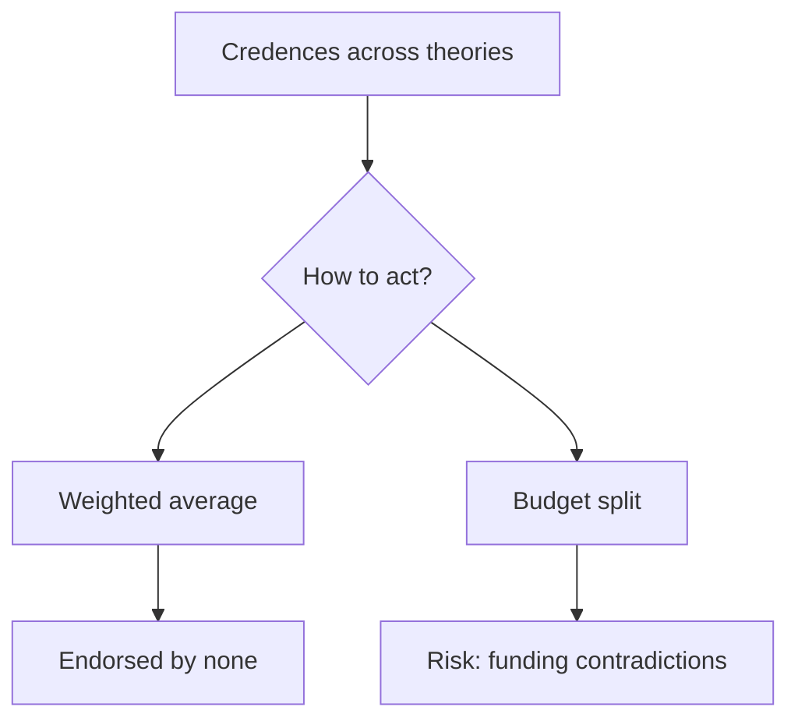

## Why this episode matters

You will spend a large share of your life and money trying to do good. Intuition is a terrible guide to where it lands. This episode applies the track's rationality tools to the highest-stakes question of all: how to help effectively. Davis, a researcher at Rethink Priorities [uncertain: the transcript renders the organization as "reading priorities," a likely transcription error], shows why the obvious charitable moves mislead, how to compare causes that seem incomparable, and how to act when you are unsure what is right.

## Intuition misleads

### The lead filter

Davis opens with his own story. Living in Chicago, he learned about lead pipes and bought a lead filter. Sensible, local, tangible. Then he did the math. The same money moved to the global poor buys vastly more health, because services cost less there and the needs are more basic. His filter helped one household a little. The same dollars could help many households enormously.

The lesson generalizes. Charitable intuition tracks vividness, proximity, and narrative, the same peripheral-route cues from ep03. Effectiveness tracks numbers: cost per life improved, evidence of causality, room for more funding. The two rarely point the same way.

### Three dollars a day

The arithmetic that reframes everything. A relatively poor American lives on $25,000 to $30,000 after taxes, placing them around the 80th to 95th percentile of the global income distribution. The global poor live on about $3 a day. Services cost less in poor countries, so a dollar buys more help there twice over: the need is greater and the price is lower.

Figure 1. The income comparison. AI Podcast Curriculum, ep09 (Marcus Davis interview, 2026-06-05). Shell 1. Show the toy. Source: original toy, from episode claims.

| Group | Income | Global percentile |
|---|---|---|
| Relatively poor American | $25,000 to $30,000 after taxes | 80th to 95th |
| Global poor | About $3 a day | Bottom deciles |

The implication is uncomfortable and hard to dodge. If your goal is to help, geography matters more than almost anything else about the gift.

### Bed nets and the evidence bar

The positive example: insecticide-treated bed nets against malaria. Dozens of randomized controlled trials isolate the effect. The cost runs about a couple of thousand dollars per life saved. This is the evidence bar the episode sets: not stories, not plausibility, but RCTs showing causality at a measured cost per outcome.

Randomized controlled trials matter because charity is full of plausible failures. Before RCTs, nobody could tell whether an intervention worked or merely correlated with improvement. The trial isolates the cause. Davis's standard: prefer the intervention with trials over the one with testimonials, even when the testimonials move you more.

## The drowning child arguments

### The pond

Peter Singer's classic: you walk past a shallow pond and see a child drowning. You can save her at the cost of muddying your clothes. Obviously you should. The argument: distance does not matter morally. A child drowning far away, whom you can save for the price of a donation, counts the same.

### The river

The episode extends the pond. Suppose after the first child there is another a few feet down, and another, and the river runs a million miles with a million drowning children. You could spend your whole life pulling children out. Every moment you rest, a child dies.

This is the demandingness problem. The pond argument proves you should save the one child. The river shows the logic has no stopping point. Taken literally, morality demands everything: all your money, all your time, your whole life. Almost nobody lives that way, which means almost everybody, including the convinced, holds a view they do not fully act on.

Davis does not resolve this. He treats it as a live tension to navigate, not a puzzle to dissolve. The honest positions: give substantially more than feels natural, while admitting you are not meeting the full demand. Or find the principled stopping point, if you can. What you cannot do is pretend the tension is not there.

### Within-a-mile altruism

Derek Parfit's thought experiment, which the episode cites [uncertain: the transcript renders the name as "Derek Parford," a likely transcription error]: suppose only people within a mile of you mattered, and everyone beyond counted for nothing. Obviously silly, and Parfit thought so too. The trick is the follow-up: if that boundary is silly, what makes your actual boundary, country, tribe, species, principled? Most charitable intuition runs on within-a-mile altruism with the mile drawn wider. The experiment asks you to defend the line.

## Comparing the incomparable

### The incomparability objection

The common resistance: saving children from malaria and reducing suffering on factory farms are totally different domains. You cannot compare them. Any ranking is a category error.

Davis's rebuttal is blunt. People make such comparisons constantly in ordinary life: money versus time, career versus family. Refusing to compare does not avoid the choice. It just makes the choice unexamined. Every dollar you give to one cause is a dollar not given to another. The comparison happens whether you formalize it or not.

### Explicit versus implicit models

Definition: an implicit model is the unspoken set of assumptions behind a decision. An explicit model writes the assumptions down: the numbers, the uncertainties, the weights.

Everyone uses a model. The implicit one is just hidden, which means its errors hide too. Writing the model down does not make it true. It makes it checkable. GiveWell's spreadsheets are the flagship example: cost-effectiveness estimates with every assumption visible, so critics can attack the assumptions instead of the vibes.

Davis's rule: all models are wrong, some are useful. The explicit model earns its keep when it changes a decision or surfaces a disagreement about a specific number. If writing it down changes nothing, the exercise was theater.

### Monte Carlo your uncertainty

For any parameter with real uncertainty, model it as a distribution, not a point. Monte Carlo simulation runs the model thousands of times, sampling each uncertain parameter, and shows the distribution of outcomes. The result is honesty about what you know: not "this saves a life for $2,000" but "the cost per life saved falls between $1,000 and $4,000 with 80 percent probability," or whatever the sampling shows.

The discipline this installs: every number in your model should carry its uncertainty with it. A point estimate without a spread is a lie about your knowledge.

Figure 2. From implicit to explicit. AI Podcast Curriculum, ep09 (Marcus Davis interview, 2026-06-05). Shell 2. Count the toy. Source: original toy, from episode claims.

| Step | Implicit model | Explicit model |
|---|---|---|
| Assumptions | Unspoken | Written down |
| Numbers | Vibes | Estimates with spreads |
| Uncertainty | Ignored | Monte Carlo distributions |
| Errors | Hidden | Attackable |

## Moral uncertainty

### You do not know what is right

The deepest chapter of the episode. Even with perfect data on consequences, you face moral uncertainty: which moral theory is correct? Utilitarianism, deontology, virtue ethics, and the rest disagree about what counts as good. You assign each some credence, and no option commands certainty.

### Reflective equilibrium

The method for handling it: reflective equilibrium. Balance the arguments for each theory against your considered judgments about cases. Adjust the theory to fit the judgments you trust most, adjust the judgments in light of the theory's arguments, iterate. The goal is not proof. It is the most defensible resting point you can reach.

Davis's counsel: morality is hard, so hold your conclusions lightly and keep reasoning. The equilibrium is a practice, not a destination.

### Aggregating theories

When theories disagree about what to do, how do you combine them? The episode offers two live options.

Weighted averaging: assign each theory your credence, weight its recommendation accordingly, and act on the blend. If utilitarianism gets 50 percent of your credence, its recommendation gets 50 percent of the weight.

Budget splitting: divide your resources by credence. Utilitarianism's 50 percent credence means 50 percent of the budget, which it spends however it wants. Each theory gets its share and full control within it.

Neither dominates. Averaging can produce actions no theory endorses. Splitting can fund contradictions. The point is that you need some aggregation rule, because "I am uncertain" is not an action plan. Pick one, write it down, and let it be criticized.

Figure 3. Two ways to aggregate moral theories. AI Podcast Curriculum, ep09 (Marcus Davis interview, 2026-06-05). Shell 3. Apply the one rule. Source: original toy, from episode claims.

### The practical answer: GiveWell

Asked what to do with $1,000, Davis's answer is GiveWell: give it to the most cost-effective charities the evidence supports. Not because GiveWell is perfect, but because it is the best explicit model available, open to criticism and updated with evidence. Under moral uncertainty, you still have to act. Act on the best explicit model, and keep the uncertainty in the model.

## Feedback loops

### Charity versus profit

The structural problem with doing good: feedback loops in charity are weaker than in business. A company that wastes money dies. A charity that wastes money can survive for decades on good intentions and moving stories. Donors rarely learn what their money achieved.

This is why the explicit model matters so much here. In business, the market supplies the discipline. In charity, you must supply it yourself: measurements, trials, cost-effectiveness, updates. Without that discipline, intuition and narrative fill the vacuum, and the vacuum is where waste lives.

## Questions and answers

> [!QA]
> Q: Explain the whole chapter like I am new. Why does charitable intuition fail?
> A: Intuition tracks vividness, proximity, and stories. Effectiveness tracks cost per outcome, causal evidence, and neglectedness. The lead filter felt right and helped one household slightly. The same money sent where dollars buy more, about $3-a-day contexts, helps many households enormously. Intuition optimizes for the feeling of helping. Evidence optimizes for the helping.
> Follow-up: What is the one habit? Before any gift, ask for the cost per outcome and the evidence behind it. If neither exists, you buy a feeling.

> [!QA]
> Q: Walk me through the drowning child, the river, and the demandingness problem.
> A: The pond: a child drowns nearby, you can save her cheaply, so you should. Distance does not matter, so the faraway child you can save by donating counts the same. The river: a million miles, a million children, no stopping point. The logic demands your whole life. Demandingness is the gap between what the argument proves and what anyone does. Davis leaves it open: give more than feels natural, and admit the tension.
> Follow-up: What is the trap? Using demandingness as an excuse to do nothing. "I cannot do everything" does not imply "I should do nothing." It implies "I should do something substantial and principled."

> [!QA]
> Q: What is within-a-mile altruism, and what is it for?
> A: Parfit's thought experiment: imagine only people within a mile of you mattered. Obviously silly. Then defend your actual boundary: why does your country, or your species, get the moral weight and others do not? Most giving runs on unexamined within-a-mile logic. The experiment forces the defense.
> Follow-up: Try it. Write your actual moral boundary and the reason for it. If the reason is "they feel closer," notice that closeness is a feeling, not an argument.

> [!QA]
> Q: How do I compare two totally different causes, like malaria nets and factory farms?
> A: You already do. Every dollar to one is a dollar from another, so the comparison happens with or without your permission. Make it explicit: estimate cost per outcome for each, with uncertainty spreads, and compare the numbers. The explicit model can be attacked and improved. The implicit one just hides.
> Follow-up: What is the common dodge? "They are incomparable." That is not humility. It is a refusal to examine the trade-off you are already making.

> [!QA]
> Q: What is the difference between an explicit and an implicit model?
> A: The implicit model is the hidden assumptions behind your choice. The explicit model writes them down: numbers, uncertainties, weights. Writing it down does not make it true. It makes it checkable. GiveWell's spreadsheets are the model: every assumption visible, every critic able to attack a number instead of a vibe.
> Follow-up: When is explicit modeling theater? When writing it down changes no decision and surfaces no disagreement. The test is whether the model bites.

> [!QA]
> Q: Explain moral uncertainty and the two aggregation rules.
> A: You are unsure which moral theory is right, so you hold credences across them. To act, aggregate. Weighted averaging blends each theory's recommendation by your credence. Budget splitting gives each theory its credence share of resources to spend as it wants. Averaging risks actions nobody endorses. Splitting risks funding contradictions. Pick one and let it be criticized.
> Follow-up: What about reflective equilibrium? That is the method for setting the credences: iterate between theory arguments and your trusted judgments until they cohere. It is a practice, not a proof.

> [!QA]
> Q: Why Monte Carlo, and what does it change?
> A: Point estimates lie about your knowledge. Monte Carlo samples each uncertain parameter thousands of times and shows the outcome distribution. Instead of "$2,000 per life saved" you get the spread: where the estimate probably falls and how wide your ignorance is. Decisions made on distributions beat decisions made on points.
> Follow-up: What is the minimum version? For your next estimate, write a range instead of a number. Ranges are Monte Carlo with one sample of honesty.

> [!QA]
> Q: If I have $1,000 to give, what does the episode actually recommend?
> A: Give it through GiveWell to the most cost-effective evidence-backed charities. Not because the model is perfect, but because it is the best explicit, criticizable model available. Under moral uncertainty you still act. Act on the best model, keep the uncertainty inside it, and update when the evidence moves.
> Follow-up: What should you not do? Split it across ten vivid stories. Diversification feels prudent and buys ten feelings instead of one outcome.

## Memory aids

- $3 a day: the global poor live there. Your dollars buy more where prices are lower and needs are basic.
- 80th to 95th: a poor American's global percentile. Rethink "poor" before you give.
- A couple thousand per life: bed nets, dozens of RCTs. That is the evidence bar.
- Pond, river, demandingness: one child proves the duty. A million children prove the duty has no end. Live in the tension.
- Within a mile: Parfit's silly boundary. Defend yours or move it.
- Incomparable is a dodge: the trade-off happens anyway. Make it explicit.
- Implicit hides, explicit shows: write the model so critics can attack numbers, not vibes.
- Monte Carlo: distributions, not points. Ranges are honesty.
- Reflective equilibrium: iterate theory against trusted judgments. Practice, not proof.
- Average or split: blend recommendations, or divide the budget by credence. Pick one.
- $1,000 goes to GiveWell: best explicit model, not perfect model.
- Weak feedback: charity lacks the market's discipline. Supply it yourself.
- Never-confuse pair: the feeling of helping versus the helping. Optimize the second.
- Trap card: "I cannot do everything, so I will do nothing." The river proves too much only if you let it. Substantial and principled beats everything or nothing.
- Trap card: "This cause is incomparable." You are already comparing. The only question is whether you do it well.

## How to imbibe this

- This week: look up GiveWell's current top charities and their cost-effectiveness estimates. Compare with where your last three gifts went. Write the gap.
- Catch yourself: the next time a charitable appeal moves you, pause and ask for the cost per outcome. Vividness is the peripheral route. Price it before you pay it.
- Behavior change per major idea:
  - Geography: before any gift, ask where the dollar buys most. Default to the $3-a-day world unless you have a reason not to.
  - Evidence bar: demand trials over testimonials. If the charity has no causal evidence, treat the gift as speculation and label it so.
  - Demandingness: set a giving percentage above your comfort level. Write why you stopped there. Revisit yearly.
  - Boundaries: write your moral boundary and its defense. If the defense is feelings, say so.
  - Explicit models: for your next gift, write the assumptions: cost per outcome, uncertainty, alternatives considered. One page.
  - Moral uncertainty: assign your credences across two moral theories. Pick an aggregation rule. Apply it to one decision.
  - Feedback: for past gifts, find out what happened. If you cannot, note the vacuum. That is the problem.
- Monthly: review your giving against the explicit model. Update the numbers. Update the credences.

## Think it yourself

Harder drills. Do these with your own brain before touching AI. Write answers by hand.

1. Fermi: at $3 a day, a person lives on about $1,100 a year. If you earn $100,000 after taxes, what fraction of your income equals one person's entire annual income? (Answer: about 1.1 percent. Now ask: what does that imply about the demandingness debate?)
2. Argue both sides: "Effective giving is cold calculation that kills the human spirit of charity." Steelman it: the warm glow motivates giving, and optimizing it away shrinks the total. Rebut it: where does the argument fail? Write the synthesis.
3. Journal: "Where did my last gift go, and why there?" Write the real reasons: vividness, proximity, social pressure, evidence. What share was evidence?
4. First principles: derive the demandingness problem from the pond. At which step does "save this child" become "give everything"? Is there a principled stopping point? Propose one and attack it.
5. Observe: for one week, collect every charitable appeal you encounter. Mark each as story-driven or evidence-driven. What is the ratio? Which ones moved you?
6. Design: you run a $10 million foundation. Write the explicit model: cause areas, cost-effectiveness estimates with spreads, moral-uncertainty aggregation rule, feedback plan. What is your biggest uncertainty?

## Skills you can now use

- Price charitable options by cost per outcome before giving.
- Demand causal evidence, RCTs over testimonials.
- Compare incomparable-seeming causes with explicit models.
- Run Monte Carlo thinking: distributions instead of points.
- Practice reflective equilibrium on moral disagreements.
- Aggregate moral theories by averaging or budget splitting.
- Detect weak feedback loops and supply the discipline yourself.

## Go deeper

- GiveWell's charity research and top picks: https://givewell.org
- Clearer Thinking's free tools for better decisions: https://www.clearerthinking.org

## Figure audit

| Unit | Claim | Before | After | Figure | Medium | Source |
|---|---|---|---|---|---|---|
| u01 | Geography dominates giving | Give near and vivid | $3/day buys far more | fig1 | table | episode claims |
| u02 | Models must be explicit | Hidden assumptions | Written, spread, attackable | fig2 | table | episode claims |
| u03 | Moral uncertainty is actionable | Uncertainty paralyzes | Average or split by credence | fig3 | mermaid | episode claims |
| u04 | Feedback is the gap | Good intentions suffice | Supply the discipline | ch-text | table | episode claims |

Figure 4 (chapter plate). Effective giving on one page. AI Podcast Curriculum, ep09. Shell 5. Name the next page that reuses the symbol. Source: original toy, from episode claims.

| Left: cost without the rule | Center: the stored object | Right: cost with the rule |
|---|---|---|
| Vivid appeals. Testimonials. Ten-way splits. Boundaries undefended. | Cost per outcome plus explicit models plus the aggregation rule, on one index card. | Gifts priced before given. Models written and attacked. Credences aggregated. Feedback chased. |

Tradeoff: pay the discipline of explicit models and feedback, instead of paying the price of good intentions with weak outcomes.
Footer: optimize the helping, not the feeling of helping.
