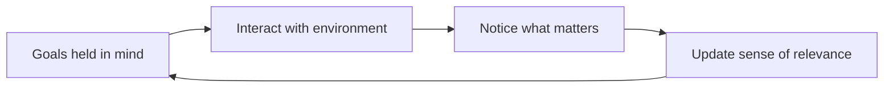

## Why this episode matters

This is the finale, and it earns the position. Every earlier chapter gave you tools. This one asks what the tools are for, and whether the whole rationality project coheres. Riedl walks the great debate between the two tribes of rationality research, shows how resource-rational analysis dissolves it, and ends on insight, wisdom, and the visual thinking that makes hard ideas tractable. If the track's arc runs from guided drills to unaided reasoning, this chapter removes the training wheels.

## The great rationality debate

### Two tribes

The field of rationality research splits into two camps that barely talk to each other.

Definition: the axiomatic approach judges thinking against formal axioms of rationality, from von Neumann and Morgenstern [uncertain: the transcript renders the names as "Loyman and Morgenheim," a likely transcription error]. A choice is rational if it satisfies axioms like transitivity. Deviations are biases, errors to correct.

Definition: the ecological approach judges thinking against fit to the environment. A heuristic is rational if it works in the world it evolved for, regardless of axioms. Deviations from axioms may be features, not bugs.

The axiomatic camp counts the ways minds fail the math. The ecological camp counts the ways the math fails the world. Both have a point, and the debate has run for decades without resolution, which suggests the framing itself needs work.

Figure 1. The two tribes. AI Podcast Curriculum, ep10 (Anna Riedl interview, 2023-03-04). Shell 1. Show the toy. Source: original toy, from episode claims.

| | Axiomatic | Ecological |
|---|---|---|
| Standard of rationality | Formal axioms | Fit to environment |
| A deviation is | A bias, an error | Possibly a feature |
| Ideal thinker | Satisfies the axioms | Matches the world |
| Risk | Judges fish by tree-climbing | Excuses every error as adaptation |

### Resource-rational analysis dissolves it

The synthesis: resource-rational analysis. Thinking costs time and computation, and time has opportunity cost. A mind that spent forever computing the perfect answer would starve. So the rational question is not "does this thinking satisfy the axioms" but "does this thinking buy enough accuracy to justify its cost."

Under this lens, many apparent biases become optimal speed-accuracy trade-offs. Fast, frugal heuristics look irrational against timeless axioms and rational against a ticking clock. The debate dissolves because both tribes were right about different things: the axiomatic camp about what perfect reasoning looks like, the ecological camp about what affordable reasoning looks like.

Definition: the meta-rational calculation is the judgment of whether further thinking is worth its cost. Every act of reasoning should, in principle, pass this test. In practice the test itself must be cheap, or it eats the budget it protects.

### The sunk-cost challenge

Spencer's pushback: some biases survive even with unlimited time. The sunk-cost fallacy, staying in a worthless project because you already invested, persists when people have hours to deliberate. No ticking clock explains it.

This is the right kind of objection. Resource-rationality explains the fast errors. It does not explain the slow ones. A complete theory needs both: the economics of thinking under time pressure, and the motives that corrupt thinking with time to spare. The soldier from ep06 operates on no deadline.

## Insight

### The nine-dot problem

Nine dots form a square. Connect them all with four straight lines, without lifting the pen. Most people fail, trying line after line inside the square. The solution requires drawing outside the square the dots form, which lets one long diagonal strike through many dots at once.

The lesson: the solver imposed a constraint the problem never stated. Nobody said stay inside. The mind added the rule silently, then suffered under it. Insight is often not new information but dropped assumption. The term "thinking outside the box" comes from this problem, and most uses of the phrase forget what it meant: the box was never there.

### The domino problem, worked

A chessboard has 64 squares. Thirty-two dominoes, each covering exactly two squares, tile it perfectly. Now remove two squares: the diagonally opposite corners. Can 31 dominoes tile the remaining 62 squares?

Most people start moving pieces in their heads, trying arrangements. The insight route skips the search entirely. Each domino covers exactly one black square and one white square. The removed corners are diagonally opposite, so they share a color. The remaining board has 32 squares of one color and 30 of the other. Thirty-one dominoes would need 31 black and 31 white squares. Impossible, in one step, with no search.

Figure 2. The domino parity argument. AI Podcast Curriculum, ep10 (Anna Riedl interview, 2023-03-04). Shell 2. Count the toy. Source: original toy, from episode claims.

| Quantity | Value |
|---|---|
| Board squares | 64, alternating colors |
| Domino coverage | Exactly 1 black plus 1 white each |
| Squares removed | 2 opposite corners, same color |
| Remaining | 32 of one color, 30 of the other |
| 31 dominoes need | 31 black plus 31 white |
| Verdict | Impossible, no arrangement to try |

The general lesson: representation beats search. The right representation, colors instead of positions, turns an exponential puzzle into arithmetic. This is the chapter's deepest practical point, and it connects to everything: the ELM from ep03, the outside view from ep04, the conditional markets from ep08. They are all representation upgrades.

### Procedural knowledge

Insight also needs procedural knowledge: knowing how, not just knowing that. The episode distinguishes the two because rationality training over-indexes on declarative knowledge, lists of biases, and under-indexes on procedures, the practiced moves that produce insight under pressure. You do not think your way to the domino parity by reading about parity. You get it by working representations until the color argument becomes a move you own.

## Relevance realization

### The hardest problem

From John Vervaeke's work [uncertain: the transcript renders the name as "John Vivekis" and "John Ververky," likely transcription errors]: relevance realization is the problem of what to attend to. A robot given a task must also be told what to ignore, and the instructions for ignoring explode combinatorially. Every situation contains infinite details. Which ones matter?

The proposed answer: relevance realization is an emergent process, not a computation. You hold your goals in mind while interacting with the environment, and you learn what is relevant through the interaction. It is a loop, not a lookup.

This reframes the rationality project once more. The biases literature worries about wrong answers to well-posed questions. Relevance realization worries about which questions to pose. Most real-world failure is not miscalculation but misattention: solving the wrong problem beautifully.

Figure 3. Relevance realization as a loop. AI Podcast Curriculum, ep10 (Anna Riedl interview, 2023-03-04). Shell 3. Apply the one rule. Source: original toy, from episode claims.

### Connection to the track

Every chapter in this track is, underneath, a relevance-realization aid. The premortum tells you to attend to failure explanations. The noise audit tells you to attend to scatter. The scout mindset tells you to attend to counter-evidence. Techniques are attention prosthetics. The wise thinker collects them the way a carpenter collects jigs: not to replace judgment, but to aim it.

## Wisdom as meta-rationality

### No theory of fitness

Vervaeke's analogy, as the episode presents it: there is no theory of fitness, because fitness depends entirely on the environment. There is only a theory of evolution, the process that produces fitness across environments. Likewise, there is no fixed theory of rationality, no set of axioms that stays correct everywhere. There is only the meta-process that adapts thinking to the world it faces.

Wisdom, on this view, is meta-rationality: rationality about rationality. Knowing which norms apply when, which heuristics suit this environment, when to compute and when to satisfice. It is the level above the debate, and it is what the whole track trained.

### The typical mind fallacy

One obstacle to wisdom: the typical mind fallacy. You assume other minds work like yours. In fact, inner experience varies wildly across people, while outer behavior converges because everyone copies everyone else. The result is a double error: you overestimate how similar minds are inside, and you underestimate how constrained behavior is outside.

The correction is the same move as everywhere in this track: check. Do not assume your phenomenology is universal. Ask. The scout's curiosity applies to minds most of all.

## Paradigms and pictures

### Shifting paradigms

Riedl's interdisciplinary lesson: real interdisciplinary thinking means shifting paradigms, not just borrowing terms. Psychology taught her to see everything through one lens, with its built-in presumptions. Learning other lenses required the humbling discovery that she was less smart than she thought, because her smartness was lens-relative.

The general rule: one lens makes you overconfident. Two lenses make you humble. The second lens does not just add knowledge. It reveals the first lens as a lens.

The paradigm history she sketches: behaviorism, with Skinner, treated the mind as a black box where only input-output mappings matter. Cognitivism opened the box and posited information processing inside, because the inner workings explain differences the mappings cannot. Each paradigm looked complete until the next one showed its edges.

### Simon on diagrams

Herbert Simon's line, as the episode renders it: a diagram is sometimes worth 10,000 words [uncertain: the transcript renders the paper title as "Wyatt diagram is sometimes the worst 10,000 words," a likely transcription error]. The demonstration: a mechanical device shown as a drawing versus described in code. Informationally identical. Cognitively incomparable. The diagram lets you imagine pulling the parts and seeing how it moves. The code does not.

This is why the track draws figures. Representation is not decoration. The right picture does cognitive work that prose cannot, because it matches the mind's processing. When you are stuck, change the representation before you push harder on the content. Draw the colors, not the positions.

## Questions and answers

> [!QA]
> Q: Explain the whole chapter like I am new. What was the rationality debate about?
> A: Two tribes. The axiomatic tribe judges thinking against formal math: violate the axioms and you are biased. The ecological tribe judges thinking against the world: fit the environment and you are rational. The synthesis is resource-rationality: thinking costs time, so the right standard is accuracy per unit of cost. Many biases become optimal trade-offs under a ticking clock.
> Follow-up: What does the synthesis not explain? Slow errors like the sunk-cost fallacy, which survive unlimited deliberation. Time pressure explains fast mistakes. Motives explain the slow ones.

> [!QA]
> Q: Work the domino problem from scratch and state the general lesson.
> A: Sixty-four squares, alternating colors. Each domino takes one black and one white. Remove opposite corners, both the same color. Sixty-two squares remain: 32 of one color, 30 of the other. Thirty-one dominoes need 31 and 31. Impossible, no search needed. The lesson: representation beats search. Colors instead of positions turn an exponential puzzle into one subtraction.
> Follow-up: Where else did this track upgrade representation? The ELM reframes persuasion as routes. The outside view reframes forecasts as class members. Conditional markets reframe decisions as prices. Collect representations, not just facts.

> [!QA]
> Q: What is the nine-dot problem really about?
> A: It is about the constraints you add silently. Nobody said stay inside the square. The solver's mind added the rule, then failed under it. Insight is often subtraction: find the assumption that was never stated and drop it.
> Follow-up: Apply it now. Name a problem you are stuck on. List your assumed constraints. Mark which ones the problem actually stated. The unstated ones are your square.

> [!QA]
> Q: What is relevance realization, and why is it harder than avoiding bias?
> A: It is the problem of what to attend to. Every situation has infinite details, and no algorithm tells you which matter. Vervaeke's answer: it is an emergent loop, goals held in mind while interacting with the world, learning relevance through contact. It is harder than bias because bias is wrong answers to clear questions, while relevance is which questions to ask.
> Follow-up: What in this track helps? Every protocol is attention aim: the premortum aims at failure explanations, audits at scatter, scout drills at counter-evidence. Techniques are prosthetics for relevance.

> [!QA]
> Q: What does "wisdom as meta-rationality" mean?
> A: There is no fixed theory of rationality, just as there is no theory of fitness independent of environment. There is only the adaptive process. Wisdom is rationality about rationality: knowing which norms fit which environment, when to compute and when to satisfice, which lens to wear. It is the level above the debate.
> Follow-up: How do you train it? Collect lenses, not conclusions. Each new paradigm reveals the old one as a lens. Two lenses humble what one lens made arrogant.

> [!QA]
> Q: What is the typical mind fallacy?
> A: Assuming others' inner lives resemble yours. They do not: phenomenology varies wildly. Meanwhile behavior converges because everyone copies everyone. So you get it backwards twice: minds differ more inside than you think, behavior differs less outside than it could.
> Follow-up: What is the fix? Ask instead of assuming. The scout's curiosity turned on minds themselves.

> [!QA]
> Q: Why do diagrams beat words, per Simon?
> A: Same information, different processability. A drawing of a mechanism lets you simulate pulling the parts. A code description of the same device does not, though it contains identical information. Representation must match the mind's machinery, not just the world's facts.
> Follow-up: What is the practical rule? When stuck, redraw before rethinking. Change the representation first, push the content second.

> [!QA]
> Q: How does this chapter close the track's arc?
> A: The arc ran from guided drills to unaided reasoning. Early chapters gave procedures: space your reviews, audit your noise, run the protocol. This chapter asks what the procedures serve and when to drop them. The answer: wisdom is the knowledge of which tool, which lens, which representation fits this moment. That judgment is the rationality step, and no checklist contains it.
> Follow-up: What do you do Monday? Pick one live problem. Ask which lens you wear, what it hides, what representation would crack it, and whether more thought is worth its cost. That is the whole track in four questions.

## Memory aids

- Two tribes: axioms versus environment. The synthesis is cost: accuracy per unit of thought.
- Meta-rational: ask whether more thinking is worth it. The test must be cheap too.
- Sunk cost survives time: fast errors are economics, slow errors are motives.
- Nine dots: the box was never there. Insight is dropped assumption.
- Domino parity: 32 and 30 cannot make 31 and 31. Representation beats search.
- Procedural over declarative: own the moves, not just the lists.
- Relevance realization: what to attend to is the hardest problem. Loop goals with world.
- No theory of fitness: wisdom is the adaptive process, not the fixed axioms.
- Typical mind: inner lives differ wildly, outer behavior copies. Ask, do not assume.
- Paradigms: behaviorism boxed the mind, cognitivism opened it. Each looked complete.
- Two lenses humble: one lens makes you arrogant. Learn the second.
- Simon: a diagram is worth 10,000 words. Same info, different mind-fit.
- Stuck? Redraw first, rethink second.
- Never-confuse pair: declarative versus procedural knowledge. Knowing the bias list versus owning the parity move.
- Trap card: "I know the axioms, so I am rational." Axioms without cost-accounting judge fish by tree-climbing.
- Trap card: "More thinking is always better." The meta-rational calculation says otherwise. Thinking has opportunity cost.

## How to imbibe this

- This week: solve the domino problem for someone else, from scratch, without showing them this chapter. Watch where they get stuck. Then teach the parity move.
- Catch yourself: the next time you are stuck, stop pushing content and change representation. Draw it. Tabulate it. Color it.
- Behavior change per major idea:
  - Debate: when you catch yourself judging someone's thinking, ask which tribe you are in. Axioms or environment? Then ask what the cost-accounting says.
  - Meta-rational: before any analysis over 30 minutes, ask whether it is worth it. Write the answer in one line.
  - Insight: for one stuck problem, list unstated constraints. Drop one deliberately and see what moves.
  - Representation: convert your next hard problem into a diagram before writing prose about it.
  - Relevance: each morning, write the three things actually worth attending to. Compare with where attention went.
  - Wisdom: learn one new lens this month, a paradigm outside your training. Note what it reveals about your home lens.
  - Typical mind: in your next disagreement, ask about their inner experience instead of assuming it.
- Monthly: review your stuck problems. How many were representation failures versus effort failures? Shift the mix.

## Think it yourself

Harder drills. Do these with your own brain before touching AI. Write answers by hand.

1. Fermi: a chessboard has 64 squares and 32 dominoes tile it. How many distinct tilings exist? (Answer: about 12.99 million. Now ask: what does that number say about search versus the parity insight?)
2. Argue both sides: "Resource-rationality excuses every bias." Steelman it: any error can be reframed as a trade-off after the fact. Rebut it: what distinguishes an explanation from an excuse? Write the test.
3. Journal: "What is my home paradigm?" Write the lens your training gave you and its built-in presumptions. Then write what a rival lens sees that yours hides.
4. First principles: derive the meta-rational calculation. When is it worth thinking longer? What are the inputs, and which one dominates in real decisions?
5. Observe: for one week, note every stuck moment. Classify each: missing information, wrong representation, or wrong question. What is the ratio?
6. Design: you must teach insight to a team that only knows procedures. Write the training: which problems, in which order, with what debriefs? How do you test for the parity move versus the memorized answer?

## Skills you can now use

- Place any rationality claim in the axiomatic-ecological debate.
- Run the meta-rational calculation on your own thinking.
- Drop unstated constraints deliberately to manufacture insight.
- Upgrade representations before pushing harder on content.
- Aim attention with relevance-realization loops.
- Practice wisdom as lens selection, not rule following.
- Detect the typical mind fallacy in yourself.
- Shift paradigms on purpose, and stay humble about your home lens.

## Go deeper

- The rationality community's reading list: https://www.rationality.org
- Clearer Thinking's free tools for better decisions: https://www.clearerthinking.org

## Figure audit

| Unit | Claim | Before | After | Figure | Medium | Source |
|---|---|---|---|---|---|---|
| u01 | Two tribes debate rationality | One standard | Axioms vs environment, cost synthesis | Figure 1 | table | original toy, from episode claims |
| u02 | Insight is representation | Search harder | Parity: 32/30 cannot make 31/31 | Figure 2 | table | original toy, from episode claims |
| u03 | Attention is the hard problem | Avoid bias | Relevance-realization loop | Figure 3 | mermaid | original toy, from episode claims |
| u04 | Wisdom is meta | Follow the rules | Select lenses, fit environment | Figure 4 (chapter plate) | table | original toy, from episode claims |

Figure 4 (chapter plate). Rationality on one page. AI Podcast Curriculum, ep10 (original toy, 2023-03-04). Shell 5. Name the next page that reuses the symbol. Source: original toy, from episode claims.

| Left: cost without the rule | Center: the stored object | Right: cost with the rule |
|---|---|---|
| Tribes talking past each other. Search without representation. Attention unaimed. One lens worn forever. | The debate plus parity plus the relevance loop, on one index card. | Costs accounted. Representations upgraded. Attention looped on goals. Lenses collected. |

Tradeoff: pay the work of choosing the lens and the representation, instead of paying the cost of reasoning on autopilot.
Footer: the procedures serve the wisdom. The wisdom picks the procedures.
