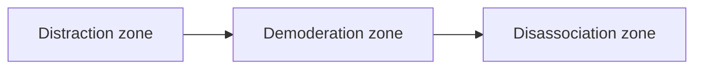
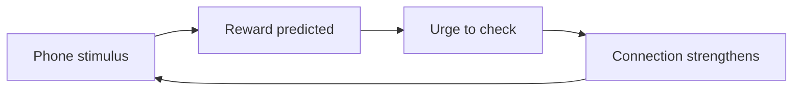
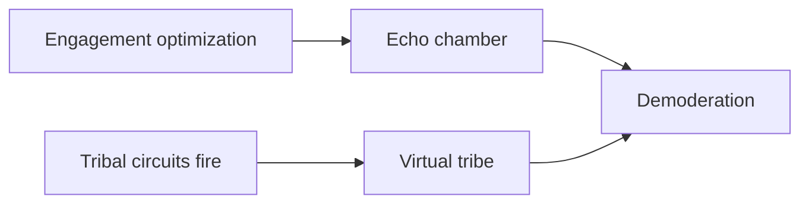

## Why this episode matters

Episodes 1 and 4 argued against social media from personal experience and philosophy. This episode argues from mechanism. It is the deepest causal account in the track of why these platforms harm, and its conclusion is the strongest in the track: the harms are not bugs. They are the product working as designed. If you want to understand attention at the level of brain circuits and business models, this is the chapter.

## The frame

The episode opens with context. Earlier that fall, after a political assassination in the United States, Cal recorded a podcast monologue arguing that social media was worse than people thought and that it was time to quit. The monologue was well received. This video replays the core argument from it.

The chapter that follows stays with the argument's mechanism, which is what the episode spends its time on. The mechanism does not depend on any single event. It is about how a class of technology functions.

## The definition: curated conversation platforms

### What they are

Cal starts by defining terms, because "social media" means too many things. The episode is about a specific class he calls curated conversation platforms. Three properties define them:

1. Many people join in conversation, through text, images, or video.
2. Curation algorithms select what each individual user sees.
3. The curation optimizes for engagement.

Obvious examples: Twitter, BlueSky, Threads, Facebook.

### What they are not

The definition excludes by design. Pinterest is not a conversation platform. You look at things people posted. Snapchat is a conversation platform but not algorithmically curated. You talk to groups of people. WhatsApp is conversation but not massive or algorithmically curated. Instagram and YouTube sit on the boundary: depending on how you use them, they fall inside or outside the category.

The precision matters. The harms that follow come from the combination of conversation plus algorithmic curation. Change either ingredient and the argument changes.

Figure 1. Which apps count as curated conversation platforms. AI Podcast Curriculum, ep06 (original toy, 2025-12-11). Shell 1. Show a toy with at most 8 items or 4 numbers. Source: original toy, from episode claims.

| App | Conversation at scale | Algorithmic curation | Engagement-optimized | Verdict |
|---|---|---|---|---|
| Twitter | Yes | Yes | Yes | In |
| Threads | Yes | Yes | Yes | In |
| Facebook | Yes | Yes | Yes | In |
| Pinterest | No, you look at posts | Yes | Yes | Out |
| Snapchat | Yes, in groups | No | No | Out |
| WhatsApp | No, not massive | No | No | Out |
| Instagram | Depends on use | Depends on use | Depends on use | Boundary |
| YouTube | Depends on use | Depends on use | Depends on use | Boundary |

Footer: all three properties, or the argument does not apply. The definition is the diagnostic.

## The three harms people name

Ask people what is wrong with these platforms and they list some combination of three harms.

### Harm 1: distraction

The addictive element. You use the platforms more than is healthy, to the detriment of more important things. This is the harm Cal writes about most in his books.

### Harm 2: demoderation

You lose moderation around an issue. You become increasingly strident. You see less room for good faith, or even basic humanity, on the other side. Tribalism sets in. You join a tribe fighting an epic fight, and the stakes justify furious policing of your own tribe. Anyone on your side who says the wrong thing gets corrected. Ranks close.

### Harm 3: disassociation

The scary one. You make a complete break from normal association with human community. You lose connection to normative ethical constraints. Violence to others or to yourself becomes possible, or you become numb to such violence done to others.

Cal identifies two flavors. The first is rage that overwhelms: I am so mad I must act regardless of consequences. The second is nihilistic withdrawal: the world is so dark and unredeemable and meaningless that you might as well cause chaos on the way out. He notes that the FBI began using a new term for the second pattern in mass violence cases: nihilistic violent extremist. It had become common enough to need a name.

He quotes the writer Derrick Thompson, writing in the Atlantic, on the second flavor: for many socially isolated men in particular, for whom reality consists primarily of glowing screens and empty rooms, a vote for destruction is a politics of last resort, a way to leave a mark on a world where collective progress or collective support of any kind feels impossible.

## The reassuring story, and why it is wrong

### How people excuse themselves

Ask people why they still use the platforms given these harms, and the answers follow a pattern. Distraction: I suffer a bit, but I can fix it with better habits. Demoderation: that is a problem for the other tribes. My side is reasonably upset and basically right. Maybe content moderation or community notes would fix them. Disassociation: scary, but that happens on weird dark-web platforms like Rumble or Kick or groper Discord servers, not the ones I use. Maybe shut those down.

This response explains why so little changes. Everyone agrees the harms are real and believes they happen to someone else.

### The slope of terribleness

Cal offers a different model. Imagine a slope. It starts in the distraction zone at the top, continues down through the demoderation zone, and ends in the disassociation zone at the bottom. Draw a line across the slope around the demoderation-to-disassociation boundary: above the line is the mainstream internet, below it the dark web.

You fall onto the top of the slope easily. Regular use puts you in the distraction zone: using the service more than is healthy. Stay there long enough and gravity pulls you into demoderation. You lose the ability to see the other side in good faith. Dehumanizing tendencies set in. Your own tribe gets policed. Keep sliding and you reach disassociation: screw it, the world is unredeemable. Down there, people bounce off the mainstream platforms into barely regulated wild-west services, and that is where the worst outcomes happen.

The three harms are not separate problems. They are one slope, and gravity connects them.

Figure 2. The slope of terribleness: three zones, one gravity. AI Podcast Curriculum, ep06 (episode, 2025-12-11). Shell 4. Show the new symbol. Source: episode figure. The line between mainstream internet and dark web falls between demoderation and disassociation.

## Why the slide is fundamental, not fixable

### Distraction: the dopamine circuit

The slide starts with brain chemistry. Cal corrects the common misunderstanding first. Dopamine is not a pleasure chemical. It is a motivation chemical.

The brain's short-term motivation circuits make predictions. They look at the available activities, predict outcomes from past learning, and if the prediction is positive, dopamine floods the circuit and the activity feels irresistible. The cookie example: the circuit learned that the cookie felt good, so at the sight of the next cookie, dopamine activates the circuit and you feel intense motivation to eat it.

Algorithmically curated content plays these circuits perfectly. The phone trains a strong prediction circuit: phone nearby means something interesting is about to happen, pleasurable or outrageous, but interesting. Dopamine, dopamine, dopamine. Pick up the phone.

The problem compounds because the phone is always with you. The circuit is constantly bathed in the signal. Resisting occasionally is possible. Resisting consistently is very hard. Cal's analogy: it is like trying to quit cigarettes while carrying a pack in your hand at all times.

So regular use of a curated conversation platform means sliding into the distraction zone by basic feedback reinforcement. That part is just chemistry plus access.

Figure 3. The dopamine prediction loop, trained by every check. AI Podcast Curriculum, ep06 (original toy, 2025-12-11). Shell 3. Apply one rule. Source: original toy, from episode claims.

### Demoderation: echo chambers plus tribal circuits

Two forces pull the distracted user into demoderation. Both are unavoidable consequences of how the platforms function.

First, the echo chamber effect, in the technical sense. The algorithms represent content as large vectors of numbers, embeddings across something like a thousand descriptive categories. They learn regions of that multi-dimensional space where content performs well for you, then serve more from those regions. Nobody programs an echo chamber. There is no echo chamber knob. It is the unavoidable side effect of observing engagement and optimizing for it. You see more of what you lean toward, and within that space, the more strident versions, because stridency engages.

Second, these are conversation platforms. People talking back and forth fires up the tribal community circuits. Those circuits are among the most powerful in the human mind, because for 200,000 to 300,000 years the tribe was survival itself. Other tribes were threats. Suspicion of outsiders was not a bug. It was how you lived.

Cal invokes Yuval Harari's argument from Sapiens: much of human civilization's success came from finding ways to hijack, overwhelm, or redirect those tribal circuits with abstractions, so they could apply to nations and religions instead of bands of fifty. Curated conversation platforms run the process in reverse. They take us back to the paleolithic setting. Echo chambers plus tribal circuits produce a virtual tribe with a very strong cause. That is demoderation. No lack of willpower explains it, and no parameter tunes it. For most users it is the value proposition. It is what creates the engagement.

The slide from demoderation to disassociation follows. The other side looks so terrible, yet nothing changes: they do not see you are right, nobody acts. Rage or nihilism follows. Add social isolation, because the platform replaced real human interaction, and the young get it worst, though the retired and elderly get it too. Before long the examples turn concrete, and Cal names one: showing up at Comet Pizza to free the children from the imagined caves underneath.

Figure 4. Two forces merge into demoderation. AI Podcast Curriculum, ep06 (original toy, 2025-12-11). Shell 3. Apply one rule. Source: original toy, from episode claims.

### The Pizza Hut analogy

This is why there is no technological fix. The two drivers are conversation at scale and algorithmic curation. But that is the service. Asking for a version of Twitter without those properties is like asking Pizza Hut to stay in business without selling pizza. With 500 million people submitting posts a day, you must curate. If you curate, you curate on what people want to see. Put the forces together and the slope follows. No implementation mistake causes this. The design itself guarantees it.

## The cost of arresting your fall

### Yes, you can stop sliding. Here is the price.

Most people do not reach the bottom. You can arrest your fall partway down the slope. Cal draws a mountain climber holding on. But stopping has two costs, and he draws a second scale to show them: a scale of flourishing, where higher means a better human life.

First, wherever you stop, you stop lower on the flourishing scale than if you had never gotten on the slope. Arrest your fall in the demoderation zone and you live there: less happy, less moderate, less connected than the person who never started sliding.

Second, resisting the slide costs mental energy. Not being demoderated while using the services constantly takes real application of will. Holding the line against disassociation takes more. That energy could have gone to things that matter to you and people you love.

So the honest question is not whether you will end up at the bottom. It is why you would pay to be less happy and spend huge amounts of mental energy preventing a descent into what is essentially a living hell. Once you see the real dynamics, the trade stops making sense.

Figure 5. Arresting the fall still costs you. AI Podcast Curriculum, ep06 (episode, 2025-12-11). Shell 2. Count or score the toy. Source: episode figure.

| Position on the slope | Flourishing | Energy cost |
|---|---|---|
| Never on the slope | Highest: full flourishing, energy free for what matters | Zero resistance needed |
| Stopped in distraction | Lower: using more than is healthy | Constant resistance against the dopamine circuit |
| Stopped in demoderation | Lower still: strident, tribal, policing your own side | Heavy willpower to stay moderate |
| Bottom: disassociation | Living hell | All energy spent resisting the call of the dark web |

Footer: you can stop the slide, but every stopping point is a worse life bought with willpower.

## The alternatives

Cal does not leave the listener with nothing. Each need the platforms pretend to serve has a real alternative.

Want to stay informed. Subscribe to actual media. Newsletters, podcasts, writers you vetted. Do the old-fashioned work: here is a real individual, here is why I trust them, here are their credentials, here is a weekly piece with no curation and no conversation.

Want to be part of something. The platforms trick you into feeling it. If you fight online, you imagine yourself at the front of the march on the bridge from Selma. In reality you are in an attention factory, punching a time clock while billionaire overseers watch their net worth rise from your efforts. Actually go be part of something, not on a screen.

Want entertainment. Find better entertainment, even on the phone. Podcasts, newsletters, books, movies, streaming. There is something like half a trillion dollars of capital expenditure in entertainment available for about $30 a month. Almost anything else presses the buttons without putting you on the slope.

### The takeaway

The reassuring story was: the platforms are not great, but the worst harms do not affect me, and there are some nice benefits, so what is the rush. The real story: the harms are connected on one slope, use starts the slide, life gets worse as you descend, stopping costs energy better spent elsewhere, and the trade is not worth it.

Cal closes by reading the conclusion of his newsletter essay: "To save civil society, we need to end our decade-long experiment with curated conversation platforms. We tried them. They became dark and awful. It's time to move on. Enough is enough."

## How to imbibe this

Classify your platforms this week. List every social app you use. For each, apply the episode's definition: many people conversing, plus algorithmic curation for engagement. Mark which ones are curated conversation platforms, which are chat apps, which are pure consumption. The definition is the diagnostic tool. Use it.

Notice one demoderation moment. This week, catch yourself in the exact mental motion the episode describes: "I cannot even imagine how those people exist." Write down the issue, the other side, and the sentence you said about them in your head. Then ask: did I arrive at this view through evidence, or through an embedding optimized for my engagement? The question is the practice.

Price your resistance. Pick the platform you use most. Estimate the weekly willpower cost of staying moderate on it: the arguments not joined, the outrage not shared, the feed not opened. Now name what that energy would have bought: an hour with a friend, a deep work block, sleep. The slope charges rent. See the invoice.

Replace one need with the real alternative. If you use the platforms for news, subscribe to one vetted newsletter this week. If for belonging, attend one real gathering. If for entertainment, pick one book. One substitution, done properly, teaches more than ten arguments.

## Think it yourself

Harder drills now: unaided reasoning from the mechanism. Do these with your own brain before touching AI.

Drill 1, the embedding thought experiment. Imagine you run the curation algorithm. You represent each post as numbers across 1,000 categories. You learn which regions maximize one user's engagement. Write down, step by step, why the winning region drifts toward stridency even though nobody programmed stridency. If you can derive the echo chamber from the optimization alone, you own the argument.

Drill 2, the tribal circuit inventory. List three groups you feel warmly toward and three you feel coldly toward. For each cold group, write the last three things you saw about them and where you saw them. Now assess: how much of the coldness came from curated conversation platforms? Be honest. The mechanism works on you, not just on others.

Drill 3, the Pizza Hut test. Pick one proposed fix for the platforms: better moderation, chronological feeds, friction warnings, algorithmic transparency. Apply the episode's test: does the fix remove either conversation at scale or engagement-optimized curation? If not, explain why the slope survives it. If yes, explain what business remains.

Drill 4, the flourishing audit. Draw the two scales from the episode: the slope and flourishing. Place yourself on both, honestly. Write what one rung higher on flourishing would look like in your actual week, and what platform behavior you would have to surrender to get there.

## Skills you can now use

- Define curated conversation platforms and sort any app into or out of the category.
- Name the three harms and explain how gravity connects them on one slope.
- Explain dopamine as a motivation chemical using the prediction-circuit mechanism.
- Derive the echo chamber from engagement optimization, with no malice required.
- Deploy the Pizza Hut test against any proposed platform fix.
- Price the willpower cost of staying moderate and compare it to the flourishing scale.
- Replace platform needs with real alternatives: vetted media, real belonging, real entertainment.

## Q&A

**Explain this episode to me like I am new. What is the slope of terribleness?**

It is a model of three connected harms. You start using a curated conversation platform and land in the distraction zone: using it more than is healthy. Gravity, meaning brain chemistry and algorithmic dynamics, pulls you into demoderation: losing the ability to see the other side in good faith, becoming tribal and strident. Further down lies disassociation: breaking with normal human community, where rage or nihilism makes violence conceivable. A line across the slope separates the mainstream internet above from the dark web below. The harms are not three problems. They are one slide.

**What exactly is a curated conversation platform?**

Three properties: many people conversing (text, images, video), algorithms choosing what each person sees, and the choice optimized for engagement. Twitter, BlueSky, Threads, and Facebook qualify. Pinterest does not (no conversation). Snapchat does not (conversation without algorithmic curation). WhatsApp does not (not massive or curated). Instagram and YouTube depend on how you use them.

**What are the two flavors of disassociation?**

Overwhelming rage and nihilistic withdrawal. Rage says: I am so mad I must act regardless of consequences. Nihilistic withdrawal says: the world is so dark and unredeemable that chaos on the way out is as good as anything. The episode notes the FBI coined "nihilistic violent extremist" because the second pattern became common in mass violence cases. Both are reached by sliding, not by starting there.

**Why is dopamine a motivation chemical rather than a pleasure chemical?**

Because of what the circuit does. It predicts. It looks at available activities, recalls past outcomes, and floods the circuit for the activity with the best predicted payoff, making it feel irresistible before you act. The cookie example: the circuit learned the cookie felt good, so the sight of the next cookie triggers motivation to eat it. Pleasure happens after. Dopamine is the push, not the reward.

**Why are echo chambers unavoidable on these platforms?**

Because of how the optimization works. Content becomes vectors across roughly a thousand categories. The system learns which regions of that space maximize your engagement and serves more from those regions. More of what you lean toward, and the more engaging versions of it, which tend to be the more strident ones. Nobody sets an echo chamber dial. The chamber is what engagement optimization looks like from the inside.

**What do the tribal circuits add?**

They convert the echo chamber into a cause. Humans spent hundreds of thousands of years surviving through the tribe. Suspicion of outsiders is wired deep. Conversation platforms fire those circuits: these are my people, we talk, we belong. Echo chamber plus tribal belonging produces a virtual tribe with a strong cause, and that is demoderation. Cal's point, via Harari, is that civilization spent millennia redirecting these circuits toward larger abstractions, and the platforms point them backward.

**What is the Pizza Hut test?**

Ask of any proposed fix: does it remove conversation at scale, or engagement-optimized curation? If it removes neither, the slope survives, because those two properties are the service itself. It is like asking Pizza Hut to stay in business without selling pizza. With 500 million posts a day, curation is mandatory. Curated on engagement, the dynamics follow.

**Applied: I only use these platforms for work updates and I stay moderate. Am I safe?**

The episode's answer has two parts. First, the slide is gravity, not choice. The chemistry and the optimization work on you whether you believe in them or not. Second, even successful resistance has a price: you live lower on the flourishing scale than someone never on the slope, and you pay willpower rent every week to stay moderate. The question is not whether you can hold on. It is what the holding costs, and whether vetted newsletters and real relationships would serve the work need better.

## Memory aids

Mnemonic for the three harms: **3D**. **D**istraction, **D**emoderation, **D**isassociation. Down the slope, in order, by gravity.

Mnemonic for the definition: **CCE**. **C**onversation, **C**uration, **E**ngagement-optimized. All three, or it is not the category.

Never-confuse pairs:
- Distraction vs. demoderation vs. disassociation. Too much use, loss of good faith, break with community. Three zones, one slope.
- Dopamine as motivation vs. dopamine as pleasure. The circuit pushes before the act. Pleasure arrives after.
- Echo chamber vs. filter bubble. The episode's echo chamber is an unavoidable optimization side effect, not a choice of sources.
- Arresting the fall vs. never sliding. Stopping costs willpower and leaves you lower on flourishing. Never starting costs nothing.
- Curated conversation vs. messaging vs. consumption. Only the first has both conversation and engagement-optimized curation.

Trap cards:
- "Demoderation is the other tribe's problem." Gravity does not check your politics. The mechanism works on every user.
- "I will just fix my feed." The Pizza Hut test: your fix keeps conversation at scale and engagement curation, so the slope keeps you.
- "The worst stuff happens on fringe platforms." The slope starts on the mainstream ones. The fringe is where the bottom of the slope exits.

## Go deeper

- Cal Newport's site, with his books and essays on attention: https://calnewport.com
- His long-running blog on focus and deep work: https://www.calnewport.com/blog

## Figure audit

| Unit | Claim | Before | After | Figure | Medium | Source |
|---|---|---|---|---|---|---|
| u01 | Curated conversation platforms pass a three-property test | "Social media" as one blob | Eight apps sorted: in, out, boundary | Figure 1 | table | original toy, from episode claims |
| u02 | Three harms are one slope with gravity | Three separate problems | Distraction to demoderation to disassociation | Figure 2 | mermaid | episode figure |
| u03 | The dopamine loop trains itself with every check | Neutral phone | Irresistible urge via prediction | Figure 3 | mermaid | original toy, from episode claims |
| u04 | Two forces merge into demoderation | Neutral feed, dormant tribe | Echo chamber plus virtual tribe | Figure 4 | mermaid | original toy, from episode claims |
| u05 | Arresting the fall still costs flourishing and energy | "I can handle it" | Lower flourishing plus willpower rent | Figure 5 | table | episode figure |
| u06 | Whole chapter trade | Reassuring story: harms happen to others | Real story: one slope, fundamental, not fixable | Figure 6 (chapter plate) | table | original toy, from episode claims |

Figure 6. The cost of the reassuring story versus the mechanism. AI Podcast Curriculum, ep06 (original toy, 2025-12-11). Shell 5. Name the next page that reuses the symbol. Source: original toy, from episode claims.

| Left: cost without the rule | Center: the stored object | Right: cost with the rule |
|---|---|---|
| Keep the platforms. Slide by gravity, stop somewhere down the slope, live with less flourishing, pay willpower rent weekly, and call it moderation. | The slope of terribleness: distraction to demoderation to disassociation, driven by dopamine circuits, unavoidable echo chambers, and tribal wiring. No fix survives the Pizza Hut test. | Leave the curated conversation platforms. Get news from vetted humans, belonging from real gatherings, entertainment from the half-trillion-dollar library. Keep the flourishing and the energy. |

Tradeoff: give up the feeling of being informed and connected. Keep your moderation, your community, and your mind.
Footer: the harms are not bugs. They are the product.
