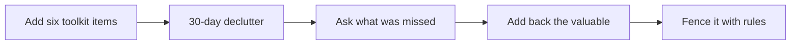

## Why this episode matters

Episode 4 gave you the philosophy of digital minimalism. This episode gives you the field report and the repair manual. Cal does something no other chapter does: he opens the actual apps, live, as an outsider who has never used them, and narrates what he sees. The verdict shapes everything after: nothing on the apps is evil, but it is strange as the foundation of a culture's leisure. From that verdict comes a two-step repair that fixes the failure mode episode 4 diagnosed, white-knuckle abstention, plus the sharpest answers in the track on owning your creative work, the future of screens, and why slowness made Tolkien happy.

## The deep dive: a tour of social media in 2024

### The setup: the outsider looks in

Cal opens with his credentials on this topic. He never used social media. His 2016 TED talk, titled Quit Social Media, passed ten million views. His 2019 book Digital Minimalism sold hundreds of thousands of copies. He covered the social media industry critically for the New Yorker for years.

Then he asks the honest question. What if he misses out. What if social media evolved into something genuinely valuable while he was not looking. To answer, he does the experiment live: he loads up the actual apps on screen, without previewing them, and looks with fresh eyes. Then he and the listener decide how to repair the relationship with these tools.

### Twitter: the good and the bad

First stop, Twitter, or X as the kids call it. The recording happened a couple of days after the Super Bowl, so the first thing on screen is a post of Taylor Swift hugging Travis Kelsey after the win. The original post reads, imagine being against this. The reply on screen, from an account called smug faculty, delivers a long earnest objection about marriage as the capstone of a perfect life lacking a hero's journey. Cal's read: to succeed on Twitter, think of something mean to say and hope it gets clout.

Then a hashtag for a farmers protest in India: arguing back and forth, tear gas, a drone flight. Cal's verdict on Twitter is balanced. This is classic Twitter, both the good and the bad. The bad: take a pop culture event involving impossibly distant people and take turns seeing who can say the meaner or smarter thing. The good: a protest you might never encounter except through the feed. Both live in the same app.

### Instagram: the curated page

Next, Instagram. Cal lands on a popular page and cannot even click a post without logging in, which tells him his producer barely uses the app either. What is visible is classic Instagram. A nice couple in their thirties, well dressed, arms linked. A person with huge muscles in the gym. A vacation shot over a swimming pool with cabanas. A football post.

The pattern is unmistakable. Everyone looks happy. Everyone looks in good shape. Everyone shows off a life they want you to think is good. It is the curated feed episode 1 warned about, seen live.

### TikTok: the swipe stream

Then TikTok. A person playing a video game. A skit about a bill at a restaurant. Someone hired as a security guard at a pizzeria. Avocado being fried. A mashed-potato dinosaur volcano with gravy poured down a carved chute, set to the Jurassic World theme, covered in chicken-nugget dinosaurs.

Cal keeps swiping. Every touch of the screen throws up another video the instant boredom appears. His take is precise. Nothing he saw is intrinsically evil. No single video is bad to engage with. But as an outsider, it is really weird. Not any one item. The weirdness is that this stream is the foundation of a huge portion of the culture's engagement with leisure time.

### The verdict: the time traveler from 2005

The test Cal proposes: imagine a time traveler from 2005 watching the tour. The traveler would not be horrified by any individual video. But the traveler would be perplexed that this is the core of how a culture spends its time outside work. Gravy on a mashed-potato mountain, scored to a dinosaur movie, is fine as an occasional oddity. It is strange as the main thing.

The tabloid analogy makes it concrete. Reading the National Enquirer in the supermarket checkout line is harmless. Reading it three to four hours a day, seven days a week, is a problem that needs a better hobby. That is implicitly what the culture built: a checkout-line tabloid as the default use of free time.

Figure 1. The outsider's tour: three platforms, one verdict. AI Podcast Curriculum, ep10 (original toy, 2024-02-19). Shell 2. Count or score the toy. Source: original toy, from episode claims.

| Platform | What the outsider saw | The good | The bad |
|---|---|---|---|
| Twitter / X | Swift and Kelsey post, smug reply, India farmers protest | Real news you might otherwise miss | Mean-or-smart one-upmanship for clout |
| Instagram | Couples, muscles, vacations, football | Pleasant images | Everyone happy, fit, showing off a life |
| TikTok | Swipes: games, skits, fried avocado, gravy volcano | Harmless fun in small doses | An endless stream as the foundation of leisure |

Footer: no single item is evil. The weirdness is the total: a tabloid as the culture's main hobby.

## The repair: two steps

### The biggest mistake: white-knuckle abstention

Most people who get fed up make the same mistake. They go straight to white-knuckle abstention. No more phone. And they get righteous about it. You know these people because they announce it constantly. They work it into every conversation. The building could be on fire and they would tell you which staircase is safe and then mention they do not use Instagram anymore.

It does not work. The digital minimalist diagnosis from episode 4 explains why. The tools pushed other things out of your life, and those things left a void. Abstain cold and you face the yawning void: boredom, your own thoughts, anxiety, with nothing to smooth it. So you sit there shaking like a detoxing addict, asking what to do next, and the phone comes back.

### Step 1: add the alternatives first

The first step is not to abstain. Keep the phone. Watch the gravy videos. But at the same time, start adding high-quality alternatives that can eventually take the phone's place. The alternatives eat away at the boredom and the anxiety of being alone with your thoughts, the two hungers that drive you back to the sugar of low-quality distraction.

Cal names six, the high-quality leisure toolkit. Engage with all of them to some degree.

One, reading. Much more of it. A mix: fun magazines and books plus smarter, harder material. A recent episode of the show covered how to learn to engage with harder books.

Two, high-quality video media. Prestige TV, movies, documentaries. Content with real creative energy and focused effort behind it, which Cal guesses cost slightly more money and time than the gravy video.

Three, a skill-based hobby. Something with a skill you can improve, where results get better as the skill grows. The feedback loop grips the mind: this project is more advanced than my last one, I might pull it off. That pull can beat the low-quality distraction at its own game.

Four, an exercise-based hobby. Serious physical engagement with streaks and marks to hit. It frees the body, releases chemicals that break the torpor, and moves you out of the lowest-energy-engagement mindset. Muscles working and lungs used change how the world looks.

Five, communities that meet regularly. A standing dinner once a month. A movie every other week. A league, a group, anything with other people on a schedule.

Six, adventures. Travel to see the team play at the away stadium. A special museum exhibit. A waterfall that takes a two-mile hike to reach. Things above and beyond what is easy, built to create genuinely interesting experiences.

Once these six are in your life, the phone's monopoly on your time and attention dissolves. It now competes against higher-quality versions of the same satisfactions. The needs drive you either way. The phone gives a low-fidelity solution to what you crave. These give a high-fidelity solution, and the high-fidelity version wins.

Figure 2. Add first, subtract second. AI Podcast Curriculum, ep10 (original toy, 2024-02-19). Shell 3. Apply one rule. Source: original toy, from episode claims.

| Before: white-knuckle abstention | The rule: add before you subtract | After: the toolkit in place |
|---|---|---|
| Delete the apps, announce the virtue | Keep the phone, add six high-quality alternatives | Reading, quality video, skill hobby, exercise, community, adventure |
| Face the void: boredom, own thoughts, anxiety | Alternatives compete with the phone for the same needs | The phone's monopoly dissolves into one option among better ones |
| Result: the shake, the relapse, the phone returns | The rule is the state change | Result: the mind is embarrassed to choose TikTok over the richer options |

Footer: subtraction without addition leaves a void. Addition first makes subtraction easy.

### Step 2: the declutter, then add back with rules

With the toolkit running, step two is the digital declutter. Not a detox. A detox is a break followed by a return to the old pattern. A declutter is step one of a permanent change. The mechanics come from episode 4 and get their field manual here: thirty days away from the optional technologies, TikTok, Instagram, Twitter, video games, YouTube. Lean hard into the six leisure areas while you do it. You are not staring into the void. You are busy doing other things.

At the end of the thirty days, decide what, if anything, comes back. Two conditions. It must be genuinely valuable, satisfying something important to you. And it comes back with clear rules for how and when you use it.

The worked example is baseball. Suppose you realize you truly care about baseball trade rumors during hot stove season, the offseason months when trades and signings dominate the news, and hearing reporters share rumors helps you engage with the sport you love. Twitter comes back, but fenced. You follow nobody. You bookmark four reporters, two covering your team and two national. You check for twenty minutes at lunch, on the desktop at work, never on the phone. The tool returns for one stated reason, with stated rules, and the endless timeline cannot leak back in.

That is a digital life on your terms: intentional, value-supporting, with the side effects fenced out.

Figure 3. The two-step repair as a loop. AI Podcast Curriculum, ep10 (original toy, 2024-02-19). Shell 3. Apply one rule. Source: original toy, from episode claims.

A footnote from the Super Bowl: an ad argued Snapchat is better than the other platforms. Cal's joke: that is like an anti-fentanyl ad sponsored by crack. Social media research puts Snapchat at the core of the teenage mental health crisis. Better than the worst is not good.

## The Q&A

### Henry: what would Postman say

Henry asks about Neil Postman's Amusing Ourselves to Death and whether screens fundamentally oppose the deep life. Cal points first to a different Postman book, Technopoly, the subject of his December New Yorker article, which he calls the best full summary of Postman's philosophy and a big influence on his own thinking.

Amusing Ourselves to Death is worth reading, but people misread it as just TV-is-bad. The deeper argument, hugely influential: media technologies shape how cultures think. TV was only the latest example.

The history makes the mechanism visible. In Lincoln's America, the media culture was built on newspapers with thousands of words: long articles, transcribed speeches. The culture was comfortable with long, discursive argument. That is why the Lincoln-Douglas debates drew huge crowds for three-hour speeches, a dinner break, another three hours, and a one-hour rebuttal. Postman called this a typographic culture. Earlier still, the printing press changed how minds worked so profoundly that the Enlightenment and the scientific revolution became possible. Until the medium changed, the thought was not available.

The question for now: how do social media and phones change the way we think and engage with the world. Postman gave the framework. The current generation has to run the experiment.

### Rochon: the four-hour limit and the evening

Rochon asks whether the four-hour daily deep work limit from Deep Work conflicts with high-quality leisure in the evening. Mostly no.

The four-hour number comes from intense deliberate practice. A study of professional violin players found about four hours a day, in two two-hour chunks, as the maximum: their practice is not playing pieces they know but systematically pushing technique past its current edge, which exhausts the player. Extreme programming shows the same wall: two people, one monitor, building the best code under a watching eye, intensely productive, but everyone burns out by four in the afternoon and there is no such thing as working late.

High-quality leisure rarely hits that wall, because it rarely demands that intensity. The exception is leisure that is secretly intense practice: writing a novel on the side, drilling an instrument. That can drain like extreme programming. The fix is balance: do less of the intense kind and mix in leisure that pulls on different parts of the brain.

Cal borrows support from Arnold Bennett's early-20th-century book How to Live on 24 Hours a Day. Bennett argued that switching to unrelated high-quality leisure re-energizes you even when work exhausted you. The brain gets its rest in sleep. While awake, it does not need complete downtime or low-quality media. Bennett's snobbish middle-class England drank and played cards and sat around. He told them to ponder poetry instead. The energy comes back.

Figure 4. When the four-hour limit applies. AI Podcast Curriculum, ep10 (original toy, 2024-02-19). Shell 2. Count or score the toy. Source: original toy, from episode claims.

| Activity | Intensity | Hits the 4-hour wall | Evening verdict |
|---|---|---|---|
| Professional violin practice | Maximum deliberate strain | Yes, in two 2-hour chunks | Done for the day |
| Extreme programming | Pair intensity, watched coding | Yes, burnout by 4 p.m. | No late work exists |
| High-quality leisure | Engaged but not maximal | No | Fine after deep work |
| Secretly intense leisure | Novel writing, instrument drills | Yes | Reduce it, mix in lighter leisure |

Footer: the limit binds intensity, not the clock. Match the evening's demand to what the day already spent.

### Sam: the sports commercial problem

Sam wants sports on TV as high-value leisure but hates the commercials. Cal's own favorite solution: read a book while listening to baseball on the radio, ideally outside on a summer day. Tune in when something interesting happens, read through the commercial breaks. He would even turn the radio down when his team pitched late in the game, because the stress was too high, and get a free half-inning of reading.

Two rules for the secondary activity. Do not make it work-related. Context-shifting between email and the game traps the mind between two worlds and kills the relief of doing something unwork-related. Do not make it engineered to be addictive. YouTube's recommendations compete with the game for attention, and the competition ruins the downshift. Pick something boring and analog at the same slowness as the game: a book, or cleaning during the commercials. The brain downshifts to the medium, and the downshift is the point.

### Chris: minimalism versus augmented reality

Chris asks how a digital minimalist handles augmented reality once it replaces screens, a future Cal predicted. Cal doubles down on the prediction. Apple's whole reason for the Vision Pro is that advanced AR removes the need to own separate screens. No phone, iPad, laptop, TV, office computer. Just glasses projecting screens wherever you are. Apple's profit comes from physical screens in brushed metal boxes, so the company wants to own the virtual-screen future. He notes the coverage of the Vision Pro, including a good New Yorker piece by Jaron Lanier, still misses this.

But the screen metaphor survives. For over five hundred years, since the shift from the scroll to the bound codex, the dominant metaphor for media stayed a constrained rectangle holding information. Movie screens, televisions, computers, phones, games: all rectangles. In an AR world, people will still want a clear demarcation between the digital and the real. The market will happily buy "my TV is any size I want and I have four monitors anywhere" without wanting messages floating as little envelopes in space. It is also technically easier to anchor a screen in space than to fully integrate digital objects with the real world. Games and pop-out effects will be the exceptions. The rectangle stays.

### Laura: the YouTuber's dilemma

Laura runs a YouTube channel with 30,000 subscribers, growing well, and cannot keep up with replying to every comment. The question reveals a common confusion. She thinks she has a digital minimalism problem. She has a business workflow problem.

People hear digital minimalism and silently swap in a different word: digital minimalization, using as little technology as possible. From that misreading, her heavy YouTube use looks like a violation. But minimalism is not minimalization. Minimalism says: figure out what is important, choose tools that support it, and put rules around their use because you know why you use them.

Her business is YouTube. Engaging with it supports things she values: income, her job. No conflict. The real problem is scale: her old rule, answer every comment to boost engagement, no longer fits the channel's size. Every growing channel reaches the stage where direct interaction stops. Ali Abdaal, with five million subscribers, is not answering every comment.

Two options. Evolve past the behavior: stop replying to comments, the way Cal stopped answering every reader email around 2008 when his blog audience outgrew his inbox. Or tighten the fences: one hour here, half an hour there, every other day, reply fast, never look otherwise. Either way, the fix is workflow design, not technology guilt. A creator whose business is social media can be a digital minimalist. Intention is the whole philosophy.

Figure 5. Minimalism is not minimalization. AI Podcast Curriculum, ep10 (original toy, 2024-02-19). Shell 4. Show the new symbol. Source: original toy, from episode claims.

| | Digital minimalization (the misreading) | Digital minimalism (the philosophy) |
|---|---|---|
| Rule | Use as little technology as possible | Choose technology backwards from values |
| Laura's channel | Violation: too much YouTube | Fine: YouTube supports income and work |
| The real problem | Guilt about screen time | Workflow: comment replies no longer scale |
| The fix | Quit the tool | Evolve the workflow or fence it tighter |

Footer: the philosophy never asked you to quit your tools. It asked you to know why you keep them.

### Logan: the home base

Logan, a financial consultant who spent five years building drawing skills to a professional level, wants to monetize the art without handing his audience to a big platform. Cal gives two ideas.

First, the home base principle. Whatever you monetize online needs a home base you own and control: what is sold and how it is sold. A website. A Shopify store, where the platform only helps you sell your stuff. A podcast hosted on your own server, where Spotify and Apple only get copies of your MP3s. Cal's own show works this way: the video versions live on YouTube for discovery, but the show itself is owned, and YouTube could vanish tomorrow without damage. Never let the home base be something owned by someone else. That is their content, their display rules, their selling rules. Use the platforms as funnels that point at the base.

Second, the 2011 test. Ask what you would have done in 2011, before social media tipped into ubiquity around 2012. How did artists get attention then: galleries, markets, prints, mailing lists. Musicians: get good, perform, build a list, catch the attention of an A&R rep, the record-label scout who finds new talent, open for bigger bands, tour, and after about ten years the label machinery backs an album. Those are still the main ways. Social media seduces with two illusions. The lottery ticket: maybe a TikTok goes viral and you become the next Justin Bieber, so the platform strings you along with little bursts of views. And the hiding of rejection: agents say no, galleries do not call back, but the feed gives a simulacrum of caring plus the hope it takes off any time. The person winning that equation is Mark Zuckerberg, monetizing the attention you spend. Go in eyes open. If a genuinely new channel exists for your work, use it carefully. Otherwise do the boring old things that still work.

Figure 6. The home base and the funnel. AI Podcast Curriculum, ep10 (original toy, 2024-02-19). Shell 3. Apply one rule. Source: original toy, from episode claims.

| | Home base (you own) | Platform (you rent) |
|---|---|---|
| What it is | Website, Shopify store, self-hosted podcast | Instagram, TikTok, YouTube channel |
| Who decides display and sale | You | Them |
| If it vanishes tomorrow | Business survives | Audience and content go with it |
| Correct use | The destination | The funnel pointing at the destination |

Footer: own the base, rent the funnel. Never reverse the two.

## Case study: eighteen months after the declutter

An anonymous listener read a LessWrong post titled "do a cost benefit analysis of your technology usage" in May 2022, read Digital Minimalism that June, started the declutter, and kept removing apps from the phone. He also picked up Deep Work and improved his time blocking and multi-scale planning. Eighteen months later he reports four changes: he reads drastically more, exercises drastically more, sleeps incrementally more, and consumes movies and video games actively and consciously instead of passively and regretfully.

His wife went from rolling her eyes at his Cal Newport lectures to a new ritual: she reads passages of So Good They Can't Ignore You aloud, and he listens. Cal's gloss on the transformation: it is like the heavy drinker who never saw the cost, the hangovers, the missing energy, until quitting. Then life switches from fuzzy black and white to technicolor. The case study is the episode's proof that the two-step repair works and that the results compound.

## Slow productivity corner: Tolkien

The final segment folds into the slow productivity corner with J.R.R. Tolkien, a figure from the coming book. A curator of medieval manuscripts at Oxford sent Cal a quote from a letter Tolkien wrote to his publisher Stanley Unwin: "writing stories in prose or verse has been stolen, often guiltily, from time already mortgaged, and has been broken and ineffective. I may perhaps now do what I much desire to do and not fail a financial duty."

The context: Tolkien at Oxford, overwhelmed by the academic grind of the early twentieth century. Grading. Course preparation. His field of philology transforming into modern linguistics while he stood on the old-fashioned side. Money worries. And meanwhile, his imagination soaring in childlike fantastical drawings: an illustration for The Hobbit in pastel, Father Christmas stories for his children, the first map of Middle-earth drawn on pasted-together graph paper, an ink drawing called Eerieness.

Once the books did well enough, he could spend less time on the grinding obligations and more time in the fantastical worlds, without guilt. Cal's lesson: Tolkien found contentment not in fast productivity, juggling everything, but in the slow productivity moves. Fewer things. A slower pace. Obsession with the quality of the few. The Slack-and-email overwhelm of today is the same overwhelm Tolkien felt under academic administration. Slowness was the escape then, and it is the escape now.

## How to imbibe this

Run the outsider tour on your own apps. This week, open your most-used app and narrate it like the time traveler from 2005. Write down what you see, without defending it. Then answer the episode's question: is this a reasonable foundation for your leisure, or a checkout-line tabloid you read for hours.

Install two toolkit items before you subtract anything. Pick the two of the six you score lowest on: reading, quality video, skill hobby, exercise, regular community, adventures. Put both on the calendar this week. The episode is explicit about the order. Addition first. Subtraction second.

Write your add-back rules in advance. Choose one tool you want to declutter. Write the baseball-reporter version now: the one valuable reason it returns, the exact duration, the exact place and device, the exact parts you use. If you cannot write the rules, the tool does not come back.

Take the 2011 test on your creative work. If you promote anything online, write what you would have done in 2011. List the boring old methods. Then compare with your current plan and mark everything that only exists because of the lottery-ticket feeling. Kill one lottery-ticket activity this week.

Do the tabloid check on your heaviest habit. Time it for three days. If it runs three to four hours a day, say the sentence out loud: I read the tabloid for four hours a day. Then ask what better hobby the hours could buy.

## Think it yourself

Companion capstone drills. Full unaided reasoning, your brain only, no AI. Episodes 7 and 8 built the muscle. These two chapters aim it at new terrain: the repair of your attention and the architecture of your creative life.

Drill 1, the 90-minute outsider session. The track's capstone exercise, applied to this chapter's terrain. Phone in another room, 90 minutes, no AI. Reconstruct the episode's repair plan from memory: the tour, the verdict, the two steps, the six toolkit items, the add-back rules. Write it as a one-page manual for a friend. Then check against the chapter. What did your brain keep. What did it drop. The gaps are where the learning lives.

Drill 2, the six-item audit. Score your current life 0 to 2 on each toolkit item: 0 absent, 1 occasional, 2 regular. Total the score out of 12. For the two lowest items, design the smallest version that could become regular within a month: not "join a gym" but "walk Tuesday and Thursday at 7 a.m." Write the calendar entries.

Drill 3, the minimalization trap. Take a tool you use for work or income. Write the minimalization verdict on it: quit it, use less. Then write the minimalist verdict: why it stays, what value it serves, the exact fences. If the two verdicts differ, you just caught the confusion the episode diagnoses. Keep the minimalist one.

Drill 4, argue both sides on the lottery ticket. Steelman the platform dream: when does one viral post genuinely change a creative career, and what are the base rates. Then steelman Cal: why do the old 2011 methods still win for 99.9 percent of people. Decide, with the numbers where you can find them, which strategy deserves your next hundred hours.

Drill 5, the Tolkien ledger. List your grinding obligations, the mortgaged time, in one column. List your fantastical work, the thing you would do without guilt, in the other. Circle one grinding item you could do fewer of, slower, with more care. Write what "fewer things, slower pace, obsessed with quality" would mean for your next quarter.

## Skills you can now use

- Run the outsider tour: narrate any app as a time traveler and judge whether it deserves your leisure.
- Diagnose white-knuckle abstention and replace it with add-first, subtract-second.
- Install the six-item high-quality leisure toolkit and score your life against it.
- Run the two-step repair: thirty-day declutter on top of the toolkit, then add back only the valuable with written rules.
- Write add-back rules in the baseball-reporter format: one reason, one duration, one place, one device, named parts only.
- Apply the tabloid test to any habit: fine in the checkout line, suspect at four hours a day.
- Distinguish digital minimalism from digital minimalization and resolve the creator's dilemma with workflow design.
- Apply the home-base principle: own the destination, rent the funnel, never reverse them.
- Run the 2011 test on any promotion plan and spot the lottery-ticket feeling.
- Read the four-hour limit correctly: it binds intensity, not the clock, and Bennett's switch re-energizes.

## Q&A

**Explain this episode to me like I am new. What is the repair plan?**

Two steps, in order. First, do not touch the phone. Add six kinds of high-quality leisure to your life: reading, quality video, a skill hobby, exercise, regular community, and adventures. These compete with the phone for the same needs and give a higher-fidelity satisfaction. Second, once the alternatives hold, take thirty days away from the optional technologies, then add back only what proves genuinely valuable, each with written rules for how and when. The order is the whole trick. Subtraction without addition leaves a void that pulls the phone back.

**Why does quitting cold turkey fail?**

Because the phone did a job. It filled the void left when the tools pushed better activities out of your life: the boredom, the anxiety of being alone with your thoughts. White-knuckle abstention removes the smoothing distraction and leaves you staring into that void, shaking. The episode's answer is structural. Build the alternatives first, so the void is already filled when the phone leaves. Then the declutter is a relief, not a detox.

**What makes the toolkit "high fidelity" and the phone "low fidelity"?**

Fidelity to the need underneath. The needs are real: novelty, mastery, company, beauty, rest. The phone satisfies them in the cheapest form: a swipe of novelty, a like for company, a meme for beauty. The toolkit satisfies the same needs at full resolution: a real skill improving, a real community meeting, a real adventure. Low fidelity keeps you hungry, so you keep scrolling. High fidelity actually feeds you, so the craving drops.

**How is the declutter different from the detox episode 4 rejected?**

The detox is a break with a return ticket: suffer for a while, then go back. The declutter is the first step of a permanent redesign. You step away for thirty days specifically to discover what you miss and what you value, then you rebuild: some tools never return, the ones that do return fenced with rules. Episode 4 introduced the distinction. This episode runs it: the baseball-reporter rules are what a declutter produces and a detox never does.

**Does the four-hour deep work limit mean my evenings are shot?**

No. The limit binds intensity, not the clock. Four hours is the ceiling for maximal deliberate strain: violinists pushing technique, pair programmers under a watching eye. Ordinary high-quality leisure does not reach that intensity, so it fits fine after a deep work day. The one exception is leisure that is secretly intense, like drafting a novel or drilling an instrument. For that, do less of it and mix in lighter pursuits. And remember Bennett: switching to unrelated quality leisure re-energizes rather than drains.

**Applied: my business runs on Instagram. Does minimalism demand I quit?**

No, and the question shows the minimalization confusion. Minimalism never demanded less technology. It demands intention: know what you value, choose tools that serve it, fence their use. Your business is a value. The tool stays. What changes is the workflow around it. If replying to every comment no longer scales, that is a business problem: evolve past the behavior or fence it to fixed windows. Design the workflow. Drop the guilt.

**Applied: I sell art online. What is the exact setup that keeps me in control?**

Build the home base first: your own site or store where you control what is sold and how. Put the work there. Then use the platforms strictly as funnels: post enough to pull people toward the base, nothing more. Run the 2011 test on your promotion plan and keep the boring methods that still work: markets, mailing lists, galleries, performances. Watch for the two seductions: the lottery-ticket hope of going viral, and the comfort of never facing real rejection. The platform profits from both. You profit from the base.

**What does Tolkien have to do with slow productivity?**

He is the proof that the overwhelm is old and the escape is older. Tolkien the Oxford lecturer drowned in grading, administration, and a transforming field, the 1920s version of Slack and email. His peace came from the fantastical worlds he stole time for, and eventually from doing fewer things, slower, with obsessive quality. The letter to his publisher says it plainly: the stories were stolen from mortgaged time. Slow productivity is the system for stealing less and choosing more: fewer commitments, a natural pace, quality as the point.

## Memory aids

Mnemonic for the six toolkit items: **RACES-V**. **R**eading, **A**dventures, **C**ommunities, **E**xercise, **S**kill hobby, quality **V**ideo. The six things that outrace the phone.

Mnemonic for the repair order: **Add, then subtract**. Addition first fills the void. Subtraction second is easy. Reverse the order and the void wins.

Mnemonic for the creator rules: **Own the base, rent the funnel**. The destination is yours. The platform is a road sign. Never reverse the two.

Never-confuse pairs:
- Declutter vs. detox. Declutter redesigns permanently with rules. Detox suffers temporarily and returns.
- Minimalism vs. minimalization. Minimalism is intention about tools. Minimalization is just using less. The episode is the first.
- The screen metaphor vs. full integration. AR keeps the rectangle. The demarcation between real and digital stays.
- High fidelity vs. low fidelity. The toolkit feeds the need. The phone teases it. Hunger is the difference.
- White-knuckle vs. intention. Announcing your abstinence is performance. Fenced rules are control.
- Intensity vs. the clock. The four-hour limit binds strain, not evenings. Bennett's switch proves it.

Trap cards:
- "I will just quit cold turkey." The void waits. Add first, subtract second.
- "My business needs the platform, so minimalism cannot work for me." That is the minimalization confusion. Your problem is workflow, not philosophy.
- "One viral post could change everything." The lottery ticket. Base rates say the 2011 methods win. Eyes open.
- "AR will dissolve the screen into the world." Five hundred years of rectangles say otherwise. The demarcation stays.
- "I am too drained after deep work for anything but scrolling." Bennett's answer: unrelated quality leisure re-energizes. The scroll is not rest.
- "This app is fine in small doses, so hours are fine too." The tabloid test. Checkout line yes. Four hours a day no.

## Go deeper

- Cal Newport's site, with his books and essays on attention: https://calnewport.com
- His long-running blog on focus and deep work: https://www.calnewport.com/blog

## Figure audit

| Unit | Claim | Before | After | Figure | Medium | Source |
|---|---|---|---|---|---|---|
| u01 | The apps are fine in pieces, weird as a foundation | Defending or attacking the apps | Outsider tour: good and bad, then the 2005 test | Figure 1 | table | original toy, from episode claims |
| u02 | Add before you subtract | White-knuckle abstention and the void | Six toolkit items competing with the phone | Figure 2 | table | original toy, from episode claims |
| u03 | Declutter is a loop with rules at the end | Detox: break then return | Add, 30 days, add back the valuable, fenced | Figure 3 | mermaid | original toy, from episode claims |
| u04 | The 4-hour limit binds intensity, not evenings | "Evenings are shot after deep work" | Violin, XP, leisure, and Bennett's switch | Figure 4 | table | original toy, from episode claims |
| u05 | Minimalism is intention, not less tech | The minimalization misreading | Laura's workflow problem and its two fixes | Figure 5 | table | original toy, from episode claims |
| u06 | Own the base, rent the funnel | Audience built on rented land | Home base plus the 2011 test | Figure 6 | table | original toy, from episode claims |
| u07 | Whole chapter trade | Tabloid leisure, white knuckles, rented audience | Toolkit, declutter with rules, owned base | Figure 7 (chapter plate) | table | original toy, from episode claims |

Figure 7. The cost of the default phone life versus the two-step repair. AI Podcast Curriculum, ep10 (original toy, 2024-02-19). Shell 5. Name the next page that reuses the symbol. Source: original toy, from episode claims.

| Left: cost without the rule | Center: the stored object | Right: cost with the rule |
|---|---|---|
| The apps as the foundation of leisure, white-knuckle quits that relapse, tools returning unfenced, the audience owned by the platform, the grinding obligations eating the fantastical work. | Two steps: add the six high-quality alternatives, then declutter for 30 days and add back only the valuable, fenced. Plus the creator rules: intention over minimalization, own the base, the 2011 test. | The phone as one option among better ones, rules written like the baseball reporters, the audience on land you own, fewer things done slower with obsessive quality. |

Tradeoff: give up the cheap default and the lottery-ticket hope. Keep the richer leisure, the fenced tools, and the work that is actually yours.
Footer: the repair is addition, not subtraction. Build the better life first, then the phone leaves on its own.
