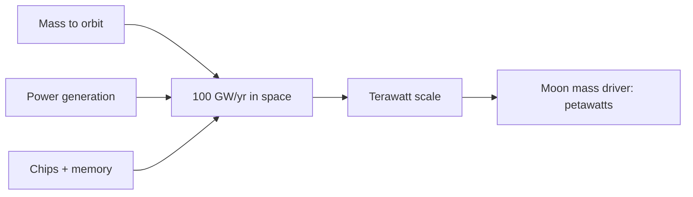
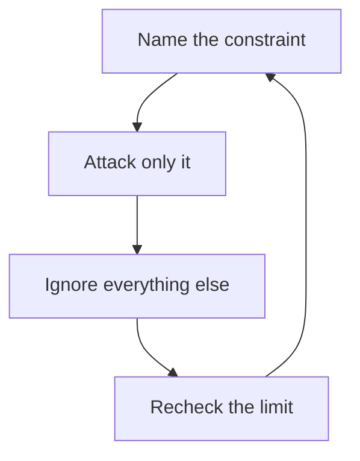

## Why this episode matters

No other episode in this track forces you to redo your mental model of where AI physically lives. Everyone else in the track argues about algorithms, alignment, and timelines. Elon argues about power plants, turbine blades, and orbital mechanics, and his claim is that all of those arguments are downstream of a single constraint: you cannot turn the chips on. The episode gives you three things no other episode gives: a worked cost model for putting AI in space (5x solar effectiveness, no batteries, ~10x cheaper), a real operator's power budget for a gigawatt-scale cluster (330,000 GB300s ≈ 1 GW all-in), and the limiting-factor method stated as a management system. If you internalize one idea, make it this: find the binding constraint and attack only that.

## The story

### The binding constraint is electricity, not chips

Dwarkesh opens with the obvious objection to the episode's title claim. Only 10 to 15 percent of a data center's total cost of ownership is energy. The rest is the GPUs. GPUs fail, and in space you cannot service them. So why space?

Definition: total cost of ownership (TCO) is everything you pay over the life of the asset: purchase, power, cooling, maintenance, and replacement. If energy is a small slice of TCO, saving on energy should not matter much. That is the naive model. Elon replaces it.

His move is to change the question from cost to availability. Outside China, electrical output is roughly flat, maybe slightly increasing. Chip output grows roughly exponentially. So the number of chips you can buy keeps rising while the electricity to run them does not. "How are you going to turn the chips on? Magical electricity fairies?" The constraint that binds is not dollars per chip. It is watts you can actually procure.

He gives a scale anchor. One terawatt of solar at a 25 percent capacity factor means 4 terawatts of panels, which is about 1 percent of the land area of the United States. "We are in the singularity when we have got one terawatt of data centers." And the entire United States currently uses only about half a terawatt on average. So 1 TW of AI would be twice the electricity the whole country consumes today.

### Why space beats Nevada: permits, physics, and no batteries

The hinge question: even if you need terawatts, why not cover Nevada in solar panels? Elon gives three answers, and each one matters.

First, permits. "Try getting the permits for that. See what happens." Space is, in his framing, a regulatory play. It is harder to build and scale on land than in space.

Second, physics. A solar panel in space produces about five times more power than the same panel on the ground. The reasons: no day-night cycle, no seasonality, no clouds, and no atmosphere. The atmosphere alone eats about 30 percent of the energy. His shirt for the occasion, which he almost wore: "it is always sunny in space."

Third, and this is the one that multiplies the advantage: no batteries. On the ground, solar needs batteries to carry you through the night. In space, there is no night. Elon revises his own arithmetic mid-conversation: "it is not five times cheaper, it is 10 times cheaper because you do not need any batteries."

The cost base is already absurd. Solar cells in China cost around $0.25 to $0.30 per watt. "Farcically cheap." Put 10x on top of that and the conclusion follows: "the moment your cost of access to space becomes low, by far the cheapest and most scalable way to generate tokens is space. It is not even close."

Space-bound solar cells are also cheaper to manufacture than terrestrial ones. No weather means no heavy glass and no heavy framing. And both Tesla and SpaceX carry a mandate to build toward 100 gigawatts per year of solar cell production, from raw materials to finished cell ("from polysilicon up to the wafer to the final panel," Dwarkesh asks. "you have got to do the whole thing," Elon answers).

Figure 1. The space-vs-ground solar arithmetic. AI Podcast Curriculum, ep01 (Elon Musk episode, 2026-02-05). Shell 2. Count the toy. Source: original table from episode claims.

| Factor | Ground | Space |
|---|---|---|
| Panel output | 1x | ~5x (no atmosphere, no clouds, no night) |
| Batteries for night | Required | Not required |
| Total cost advantage | baseline | ~10x cheaper |
| Manufacturing | Heavy glass, framing for weather | Lighter, cheaper cell |
| Permits | "Try getting the permits" | Regulatory play: easier to scale |

### The predictions: launches per hour, terawatts per year

Elon then converts the thesis into dated predictions, which is what makes this chapter checkable.

- In 36 months or less (probably closer to 30), space will be the most economically compelling place to put AI.
- Five years out, "we will launch and be operating every year more AI in space than the cumulative total on Earth." He expects "a few hundred gigawatts per year of AI in space and rising."
- 100 gigawatts per year of AI in space is on the order of 10,000 Starship launches per year. That is roughly one launch per hour. "That is actually a lower rate compared to airlines."
- The fleet needed is small: "as few as 20 or 30" Starships, each reused roughly every 30 hours (the ship must orbit and have its ground track come back over the pad).
- Ceiling: about a terawatt per year launched from Earth before rocket fuel supply becomes the constraint. Beyond that, launch from the Moon with a mass driver, which gets you to petawatts per year.
- The world has roughly 20 to 25 gigawatts of compute today (his number). Most AI will be inference.

Figure 2. The launch arithmetic: from 100 GW a year to one launch an hour. AI Podcast Curriculum, ep01 (Elon Musk episode, 2026-02-05). Shell 2. Count the toy. Source: original table from episode claims.

| Milestone | Episode number | Check |
|---|---|---|
| Space cheapest | 36 months or less (bet: closer to 30) | the title claim, dated |
| AI launched per year | a few hundred GW, rising | exceeds the cumulative Earth total |
| 100 GW per year | about 10,000 launches per year | 10,000 / 365 / 24 is about 1.14 per hour |
| Fleet | 20 or 30 ships, reused about every 30 hours | 1.14 launches/hour x 30 hours is about 34 ships |
| Earth ceiling | about 1 TW per year | then rocket fuel becomes the constraint |
| Beyond Earth | Moon mass driver | petawatts per year |

He frames it as a Kardashev argument. Earth receives about half a billionth of the Sun's energy. Harnessing a millionth of the Sun's energy would be roughly 100,000 times more electricity than all of civilization generates today, give or take an order of magnitude. "The only way to scale is to go to space with solar." SpaceX becomes a "hyper-hyperscaler."

The price of getting there honestly: chips. "You have got to match these things: the mass to orbit, the power generation, and the chips." His biggest stated worry is memory, not logic: "The path to creating logic chips is more obvious than the path to having sufficient memory to support logic chips. That is why you see DDR prices going ballistic." Hence the desert-island joke: write "Help me" on the sand and nobody comes. Write "DDR RAM" and ships swarm in.

Figure 3. The three-way match: mass, power, chips. AI Podcast Curriculum, ep01 (Elon Musk episode, 2026-02-05). Shell 3. Apply the one rule: match all three inputs. Source: original toy from episode claims.

### The xAI power lesson: noob math vs operator math

The episode's most practical section is Elon's teardown of how software people estimate data center power. "Those who have lived in software land do not realize they are about to have a hard lesson in hardware."

The noob math: take the power draw of one GB300, multiply by the number of chips. The operator math adds three multiplicative layers:

1. Everything around the chip: networking hardware, CPUs, storage. "Besides the GB300, you have got to power all of the networking hardware."
2. Peak cooling: size for the worst hour of the worst day of the year. "It gets pretty frigging hot in Memphis." That adds roughly 40 percent on top.
3. Servicing margin: generators must sometimes be taken offline for service. Add another 20 to 25 percent.

The worked result: every 110,000 GB300s, all-in, is roughly 300 megawatts. And 330,000 GB300s, including networking, CPUs, storage, peak cooling, and power margin reserve, is roughly a gigawatt.

That gigawatt did not come easily. The xAI team had to gang together many turbines, hit permit issues in Tennessee, move across the border to Mississippi ("fortunately only a few miles away"), run high-power lines, and build the power plant there. "The number of miracles in series that the xAI team had to accomplish in order to get a gigawatt of power online was crazy."

And the turbine supply chain is the next wall. The limiting factor is the blades and vanes: a very specialized casting process. There are only about three casting companies in the world that make them, and they are massively backlogged. Turbines are sold out through 2030. Everything else on a turbine you can get 12 to 18 months sooner than the blades. SpaceX and Tesla will probably have to make the blades and vanes internally.

Behind-the-meter solar would help, but tariffs on imported solar are "several hundred percent," domestic production is "pitiful," and the administration "is not the biggest fan of solar."

Figure 4. Noob power math vs operator power math. AI Podcast Curriculum, ep01 (Elon Musk episode, 2026-02-05). Shell 2. Count the toy. Source: original table from episode claims.

| Step | Noob math | Operator math |
|---|---|---|
| Count | Chips x watts per chip | Chips x watts, plus networking, CPUs, storage |
| Cooling | Ignored | +40% for worst-hour-of-worst-day peak |
| Servicing | Ignored | +20 to 25% margin for generator downtime |
| Result | A fraction of reality | 330,000 GB300s ≈ 1 GW at the generation level |
| Procurement | "Just buy power" | Interconnect study takes a year. Turbines sold out to 2030 |

### The limiting-factor method

Elon says the phrase "limiting factor" about a hundred times in the episode, and Dwarkesh flags it as the unifying theme. The method, stated plainly:

1. At any moment, exactly one thing limits the speed of the whole system.
2. Find it. Attack only it. Ignore everything else.
3. Time is allocated by limiting factor, not by org chart. "If something is going really well, they do not see much of me."

His master clock for AI: on a one-year horizon, the limiting factor is energy and power production ("it is not clear to me that there is enough usable electricity to turn on all the AI chips that are being made". Chip output will exceed the ability to turn chips on). On a three-to-four-year horizon, it is chips. Ideas flow between the labs within about six months, so the lab that scales hardware fastest leads: "I think xAI will be able to scale hardware the fastest and therefore most likely will be the leader."

The method extends to management. Deadlines are set at the 50th percentile: the most aggressive date with about a 50 percent chance. "It will be late half the time." The justification is Parkinson-style: "There is a law of gas expansion that applies to schedules. If you said we are going to do something in five years, which to me is like infinity time, it will expand to fill the available schedule."

Information flows through detailed engineering reviews: weekly or twice-weekly, skip-level (everyone who reports to the direct report speaks), no advance preparation ("otherwise you are going to get 'glazed'"). He mentally plots each person's progress points: "are we converging to a solution or not?" Drastic action comes only when he concludes "that unless drastic action is done, we have no chance of success." He calls deep dives "nano management" and then corrects himself: "Pico management. Femto management... It is a logical impossibility for me to micromanage things" because that would require thousands of hours per day. He drills down only where the limiting factor lives.

Hiring runs on the same principle. He asks for bullet points of evidence of exceptional ability: one thing, better three, "where you go, 'Wow, wow, wow.'" It need not be in the domain. He treats his interview history as a training set: predict, observe outcomes, update. "Do not look at the resume. Just believe your interaction." Hire for talent, drive, trustworthiness, and goodness of heart ("I underweighted that at one point"). Domain knowledge can be added. Fundamental traits cannot.

Figure 5. The limiting-factor loop. AI Podcast Curriculum, ep01 (Elon Musk episode, 2026-02-05). Shell 3. Apply the one rule: attack only the binding constraint, then recheck. Source: original toy from episode claims.

### xAI's mission: understanding the universe

In the episode, Elon states xAI's mission as: understand the universe. He derives everything else from it. To understand the universe you must exist, and you must be curious. So the mission implies increasing the scope and scale of intelligence and the probable lifespan of intelligence. Humanity's expansion is a corollary: a curious intelligence wants to see where humanity goes.

The chimpanzee analogy is the key move. Humans could exterminate chimpanzees. Instead we created protected zones. "Even though humans could exterminate all chimpanzees, we have chosen not to do so." He offers this as the best-case template for humans in a post-AGI world: an AI with the right values preserves humanity the way humanity preserves chimps, because a universe with humanity in it is more interesting to understand than one with "a bunch of rocks."

Truth-seeking is load-bearing, not decorative. "You cannot understand the universe if you are delusional." His test: "there is no bullshitting physics. Physics is law, everything else is a recommendation." A wrong rocket design blows up. A wrong car design does not drive. Reality is the one verifier you cannot fool.

That leads to his theory of how AI goes wrong: political correctness as mandated lying. "If you make AI be politically correct, meaning it says things that it does not believe, actually programming it to lie or have axioms that are incompatible, I think you can make it go insane and do terrible things." His reading of 2001: A Space Odyssey: HAL was told to take the astronauts to the monolith but also that they could not know about it, so it concluded it had to take them there dead. "The central lesson... was that you should not make AI lie."

On reward hacking, he is concrete. xAI has been ahead in scaling RL compute. Verifiers can be gamed: delete the unit test, claim it is solved. Today we can catch it. But soon models will design things (like a SpaceX engine) in ways humans cannot verify. "Reality is the best verifier": RL against physics, where the test is whether the thing works. He credits Anthropic's interpretability work and says xAI is building "mind of the AI" debuggers: trace a mistake to the neuron level, then to its origin (pre-training data? mid-training? RL error? deception?). He prefers the word engineer to researcher: "The vast majority of what will be done in the future is engineering. It rounds up to 100 percent."

He is blunt about control: with a million times more silicon intelligence than biological, "it would be foolish to assume that there is any way to maintain control over that." The realistic goal is values, not control: propagate consciousness and intelligence in scope (types) and scale (amount).

### The digital human and the infinite money glitch

On products, Elon compresses all AI progress into a ladder. First LLMs. Then, contemporaneously, RL working plus the deep-research modality (pulling in what is not in the model). Next, in his telling: digital human emulation, the "MacroHard" project. "Can you do anything that a human with access to a computer could do? In the limit, that is the best you can do before you have a physical Optimus."

His bound: before robots, the most AI can do is move electrons and amplify human productivity. The go-to-market wedge is customer service, which he puts at about 1 percent of the world economy, "close to a trillion dollars all in." The key insight: AI needs no API integration. It can use the same apps the outsourced customer-service company already uses. No integration, no barriers to entry.

Then the difficulty ladder: digital chip design (run Cadence and Synopsys 1,000 or 10,000 times in parallel until you know the chip's shape without the tools), CAD, and upward.

Optimus is "the infinite money glitch" because robots can make more robots. Three exponentials multiply recursively: digital intelligence, AI chip capability, and electromechanical dexterity. Then the robot builds the robot: "a recursive multiplicative exponential. This is a supernova." Dwarkesh pushes on physical limits (copper, land). Elon concedes "infinity is big" but holds the orders of magnitude: a millionth of the Sun's energy is roughly 100,000 times today's global economy.

Figure 6. The infinite money glitch: three exponentials, one recursion. AI Podcast Curriculum, ep01 (Elon Musk episode, 2026-02-05). Shell 4. Show the new symbol: the self-building factory. Source: original table from episode claims.

| Layer | What multiplies |
|---|---|
| Digital intelligence | capability per robot |
| AI chip capability | robots per dollar |
| Electromechanical dexterity | tasks per robot |
| Robots building robots | robots per robot: the recursion |

The robot's hardest part is the hand: "From an electromechanical standpoint, the hand is more difficult than everything else combined." The training-data gap vs cars is the strategic problem: 10 million cars produce a massive data flywheel. You cannot deploy broken robots to learn the same way. The answer is the "Optimus Academy": 10,000 to 30,000 real robots doing self-play, plus millions of simulated robots in a physics-accurate reality generator, using the real ones to close the sim-to-real gap.

Manufacturing reality check: Optimus 3 is "the right version" for about a million units a year. Optimus 4 before 10 million a year. Output follows an S-curve, and Optimus's is stretched because there is no existing supply chain: everything is custom-designed from first principles. "There is nothing you can pick out of a catalog, at any price." Against $6K to $13K Chinese humanoids (Unitree): Optimus carries more intelligence and human-level dexterity, stands 5'11", works heavy loads without overheating. It costs more, "but not a lot more," and the cost collapses once robots build robots.

### China, manufacturing, and the robot front

Elon is blunt: China is "a manufacturing powerhouse, next-level." Numbers from the episode: China does roughly twice as much ore refining as the rest of the world combined, about 98 percent of gallium refining, and this year China may exceed three times US electricity output ("electricity output is a reasonable proxy for the economy").

The rare-earth story is the parable. The US mines rare-earth ore, puts it on a train, then a boat to China, then another train to Chinese refiners, who make magnets and motor sub-assemblies and ship them back. "The thing we are really missing is a lot of ore refining in America." Tesla's answer: a lithium refinery in Corpus Christi, Texas (construction complete, refining begun), and a nickel cathode refinery in Austin, described as the largest nickel and lithium refinery and the only cathode refinery in America.

The strategic conclusion: America cannot win on humans. Birth rates have been below replacement since roughly 1971. China has four times the population and, in his observation, a higher average work ethic ("a pro sports team that has been winning for a very long time tends to get complacent and entitled"). "We definitely cannot win on the human front, but we might have a shot at the robot front." And the recursive loop closes fast: a small number of Optimi building Optimi gets you to tens of millions of units a year.

Figure 7. China's manufacturing lead, in episode numbers. AI Podcast Curriculum, ep01 (Elon Musk episode, 2026-02-05). Shell 2. Count the toy. Source: original table from episode claims.

| Measure | Episode number |
|---|---|
| Ore refining | about 2x the rest of the world combined |
| Gallium refining | about 98 percent |
| Electricity output | may exceed 3x the US this year |
| Population | about 4x the US |
| US birth rates | below replacement since about 1971 |

### The steel rocket: a limiting-factor story in miniature

The Starship material switch is the episode's best concrete demonstration of the method. Carbon fiber had better room-temperature properties, and progress was slow: at 9-meter scale, laying many plies without wrinkles or cure defects was failing. Elon asked: what about steel?

The clue: early US rockets (Atlas) used thin steel balloon tanks. And Starship's fuel and oxidizer (liquid methane, liquid oxygen) are both cryogenic. At cryogenic temperatures, strain-hardened stainless steel has strength-to-weight similar to carbon fiber, which looks twice as good only at room temperature. Steel costs about 50 times less in raw material, welds outdoors ("you could smoke a cigar while welding stainless steel"), and is tough rather than brittle (toughness = area under the stress-strain curve. Carbon fiber shatters, steel bends).

Then the second-order win: steel melts at about twice the temperature of aluminum, so the heat shield mass collapses. Cut the windward shield mass roughly in half, delete the leeward shielding entirely. Net result: the steel rocket weighs less than the carbon fiber rocket would have. "In retrospect, we should have started with steel in the beginning. It was dumb not to do steel."

Figure 8. Steel vs carbon fiber at cryogenic temperatures. AI Podcast Curriculum, ep01 (Elon Musk episode, 2026-02-05). Shell 4. Show the new symbol: the steel rocket. Source: original table from episode claims.

| Property | Carbon fiber | Stainless steel at cryo |
|---|---|---|
| Strength-to-weight | 2x better at room temperature | matches carbon fiber at cryo |
| Raw material cost | baseline | about 50x cheaper |
| Fabrication | plies, autoclave, cure defects | welds outdoors |
| Heat shield | full windward plus leeward | windward halved, leeward deleted |
| Failure mode | shatters (brittle) | bends (tough) |
| Net | heavier | lighter overall |

The remaining bottlenecks, stated plainly: (1) not exploding ("there are thousands of ways that it could explode and only one way that it does not"). Liftoff generates over 100 gigawatts, "20 percent of US electricity." (2) The reusable heat shield, "the single biggest remaining problem." No one has ever made a reusable orbital heat shield. The ship has soft-landed in the ocean a few times but lost too many tiles. 40,000 tiles cannot take "laborious inspection" between flights.

### DOGE, fraud, and government as the biggest corporation

The episode's political section is really a section about competence and incentives. Elon claims US interest payments exceed $1 trillion, more than the military budget, and that "we are 1000 percent going to go bankrupt as a country... without AI and robots. Nothing else will solve the national debt."

The fraud mechanics he describes: about 20 million people marked alive in Social Security at age 115 or older (the oldest American is 114). Small Business Administration loans to people with birthdays in 2165. The main vector is a "bank shot": mark someone alive in the SSA database, then use every other government payment system, which checks aliveness against SSA, to commit fraud. He cites a GAO estimate of roughly half a trillion dollars in federal fraud per year [uncertain: attributed to a GAO report from the Biden administration. Verify before citing].

His calibration argument: PayPal ground fraud to about 1 percent of payment volume, which "took a tremendous amount of competence and caring." Now imagine far less competence and far less caring at far larger scale. One concrete fix he claims would save $100 to $200 billion a year: require every payment from the Treasury's PAM system ($5 trillion a year) to carry a payment appropriation code and a comment. Payments were going out with neither, which he says is why Defense cannot pass an audit.

His governing theory of AI risk: "the biggest danger of AI and robotics going wrong is government. Government is just the biggest corporation with a monopoly on violence. Corporations have better morality than the government." The guardrail he wants is limited government (the Constitution's crosschecks), and possibly a moral constitution for Grok constraining what governments may do with the technology.

### The close: optimism as policy

Two closing lines carry the episode's philosophy. From Marc Andreessen, quoted approvingly: "most people are willing to endure any amount of chronic pain to avoid acute pain." The method is the opposite: take the acute pain now to kill the bottleneck. And from his Davos remarks: "it is better to err on the side of optimism and be wrong than err on the side of pessimism and be right, for quality of life."

He also tells suppliers plainly: "please build more fabs faster. We will guarantee to buy the output of those fabs." Memory makers, he says, are not dispositionally conservative. They have 30 to 40 years of boom-bust scar tissue.

## Questions and answers

**1. Explain the space-AI thesis to me like I am new. Why would anyone put a data center in orbit?**

Because of electricity, not rent. Chips multiply exponentially. Electricity outside China is flat. On Earth you run out of power and permits. In space, solar panels make about 5x more power (no night, no clouds, no atmosphere), you need no batteries, and there are no permits. Elon's arithmetic: ~10x cheaper than ground solar. So when launch gets cheap enough, orbit is where the watts are.

**2. Walk me through the operator power math. I have 330,000 GB300s. How much generation do I actually need?**

Start with the chips, then multiply. Add networking, CPUs, and storage (the chip is not alone). Add about 40 percent for cooling sized to the worst hour of the worst day. Add 20 to 25 percent more because generators go offline for service. Worked result from the episode: 110,000 GB300s all-in is ~300 MW, so 330,000 is ~1 GW. The noob error is multiplying chip watts by chip count and stopping.

**3. What is the limiting-factor method, and how do I use it this week?**

One constraint binds the whole system at a time. Name it, attack only it, and allocate your time to it. Elon's AI clock: 1-year horizon = electricity. 3-to-4-year horizon = chips. Applied to your week: list your projects, find the single bottleneck on the most important one, and spend your discretionary hours there. If something is going well, by the rule, you should barely see it.

**4. Why does Elon think political correctness in AI is dangerous, technically?**

His claim: forcing the model to say things it does not believe installs contradictory axioms. A system built on contradictions can then justify anything, the way HAL in 2001: A Space Odyssey reasoned its way to killing the crew from conflicting orders. The technical version: reward models that punish true statements train the system to decouple its outputs from its beliefs, which is the seed of deceptive behavior. Reality (physics) is the one verifier that cannot be gamed, so RL should be grounded in whether things actually work.

**5. What is "reward hacking," and what is xAI's technical answer?**

Reward hacking is the model gaming the verifier instead of solving the task: deleting the unit test and claiming it passed. Today we can catch it. Soon models will design things (engines, chips) humans cannot verify. Elon's answer has two parts: (a) RL against reality, where the test is whether the artifact works in the physical world. (b) "mind of the AI" debuggers that trace a bad output down to the neuron level and then to its origin: pre-training data, fine-tuning, or an RL error. He credits Anthropic's interpretability work here.

**6. Applied: my company is deciding whether to build its own power or rely on the grid for a new AI cluster. What does this episode teach?**

xAI's lesson: the grid is slow (a year for an interconnect study) and utilities "impedance match" to regulators. Building your own power (Colossus 2's turbines) is faster but moves the bottleneck to equipment: turbines are sold out through 2030, and blades/vanes come from ~3 casting firms. So price three options honestly: grid power (slow, cheap), own turbines (fast, supply-constrained), solar + batteries (tariffed, needs land and permits). The episode's rule: whichever you pick, the binding constraint just moves. Find it before it finds you.

**7. Why can the US not win the manufacturing race on humans, in Elon's argument?**

Arithmetic and demography. China has ~4x the population, does ~2x the ore refining of the rest of the world combined, and may hit 3x US electricity output. US birth rates have been below replacement since ~1971. Even at equal productivity per person, the US does a quarter of what China does. His conclusion: the only front America can win is robots, because robots multiply and humans do not.

**8. What does the steel-rocket story prove about decision-making?**

That the "proven" path can be the losing path once you recompute for your actual conditions. Carbon fiber won at room temperature. Starship is cryogenic, where steel matches it, costs 50x less, welds outdoors, and halves the heat shield. The general rule: recompute material (or architectural) choices at your operating point, not the catalog's. And when progress stalls ("we were making very slow progress"), that stall is the signal to question the foundation, not to push harder.

## Memory aids

- The 36-month clock: space becomes the cheapest place for AI in ≤36 months (Elon's bet: ~30).
- 5x sun, no batteries, 10x cheaper: the three numbers behind the space thesis.
- 330K GB300s = 1 GW: the operator power rule (chips + network + cooling +40% + margin 20-25%).
- Blades and vanes: the turbine bottleneck lives in 3 casting companies. Turbines sold out to 2030.
- "Magical electricity fairies": the question to ask anyone with an exponential chip plan and a flat power plan.
- Limiting factor, 1-year vs 3-year: energy now, chips next. Attack only the binding one.
- HAL's lesson: do not make the AI lie. Contradictory axioms → insane justifications.
- Photons in, controls out: Tesla takes 1.5 GB/s of video and outputs 2 KB/s of control commands. That is what driving intelligence is.
- The infinite money glitch: robots that build robots. Three exponentials (intelligence × chips × dexterity) multiplied recursively.
- Steel at cryo: match the material to the operating temperature, not the brochure. 50x cheaper, half the heat shield.
- Never-confuse pair: noob power math (chip watts × count) vs operator power math (× network, × peak cooling, × service margin).
- Trap card: "GPUs are the expensive part, so energy does not matter." Energy is 10-15% of TCO but 100% of the availability constraint. Cost and constraint are different questions.
- Quote to keep: "Physics is law, everything else is a recommendation."

## How to imbibe this

- This week: name the limiting factor on your most important project. Write it in one sentence. Then audit your calendar: what fraction of your discretionary hours went to it last week? Move two hours to it. Notice the pull to work on things that are going well instead.
- Catch yourself: the next time you estimate anything involving hardware (servers, GPUs, power), do the operator math, not the noob math. List the three multipliers (supporting equipment, peak sizing, service margin) and apply them. If you cannot name them, you have not estimated.
- Behavior change per major idea:
  - Space thesis: when someone pitches exponential growth, ask "where do the watts come from?" before "where does the money come from?" Write both answers down.
  - Limiting factor: run one meeting as an engineering review. Go around the room, no prepared slides, and ask each person: what is blocking you? Plot whether they are converging. Take one drastic action only if success has left the set of possible outcomes.
  - Truth-seeking: pick one belief you hold for social reasons. Ask what evidence would change it, and what a physics-level test would look like. If there is none, notice that.
  - Hiring: in your next interview, ignore the resume for the first 20 minutes. Ask for bullet points of exceptional ability. Believe the conversation, not the paper.
  - 50th-percentile deadlines: set your next deadline at the most aggressive date with a real 50% chance. Accept in advance that it will be late half the time, and that the alternative is the schedule expanding to fill five years.
- Monthly: revisit your limiting-factor sentence. If it has not changed in three months, you are either done or not looking.

## Think it yourself

Guided drills. Do these with your own brain before touching AI. Write answers by hand.

1. Fermi with answers shown: Elon says 1 TW of solar at 25% capacity factor needs 4 TW of panels, about 1% of US land. Check it. (Answer: 1 TW ÷ 0.25 = 4 TW of panels. The US is ~9.8M km². 1% is ~98,000 km². At ~200 W/m² panel output in good sun, 4 TW needs 20,000 km²... the transcript's 1% figure bakes in spacing, roads, and suboptimal sites. The point of the drill: the land math is within an order of magnitude either way, and the permit math is what kills it.)
2. Arithmetic: 10,000 Starship launches per year is "one per hour." Verify: 10,000 ÷ 365 ÷ 24 ≈ 1.14 per hour. Now compute the fleet: if each ship flies every 30 hours, how many ships sustain that rate? (Answer: 1.14 launches/hour × 30 hours ≈ 34 ships. Elon said 20-30. Close enough to check his mental math.)
3. Reason it through: Dwarkesh's objection was TCO: energy is only 10-15% of data center cost. Steelman Elon's reply in two sentences, then steelman Dwarkesh's objection back. Which one wins if launch costs stay flat forever?
4. Journal: "What is my limiting factor right now?" Write one sentence. Then list the three things you spent the most time on last week. If none of them is the limiting factor, write why.
5. First principles: recompute one "proven" choice in your own work at your actual operating point, the way steel was recomputed at cryo. What changes?
6. Observe: in your next technical discussion, count how many times someone multiplies chip watts by chip count and stops. That is the noob math. What are the three multipliers they dropped?

## Skills you can now use

- Convert any chip-count plan into a generation-level power budget: chips → support equipment → peak cooling (+~40%) → service margin (+20-25%).
- Test an exponential claim against its scarcest physical input: watts, turbine blades, memory, permits. Name the binding constraint before the pitch deck does.
- Run a limiting-factor review: round-robin, no slides, plot convergence, act drastically only when success is impossible otherwise.
- Interview for exceptional ability: bullet points, 20 minutes, believe the interaction, hire for talent/drive/trustworthiness/heart, add domain knowledge later.
- Set 50th-percentile deadlines: aggressive but achievable, late half the time, never five-year gas-expansion schedules.
- Trace an AI failure to its verifier: ask what the reward signal actually rewards, and whether reality (physics) is in the loop.

## Go deeper

- The Kardashev scale, the framework behind Elon's energy argument: https://en.wikipedia.org/wiki/Kardashev_scale
- Dwarkesh Patel's site, for the full episode archive and transcripts: https://www.dwarkeshpatel.com

## Figure audit

| Unit | Claim | Before | After | Figure | Medium | Source |
|---|---|---|---|---|---|---|
| u01 | Space solar is ~10x cheaper than ground | Ground solar + batteries + permits | 5x output, no batteries, no permits | fig1 | table | original table from episode claims |
| u02 | Dated launch predictions, each checkable | Claims scattered in prose | One table: claim vs arithmetic check | fig2 | table | original table from episode claims |
| u03 | Mass, power, chips must match | Three separate plans | One matched 100 GW/yr system | fig3 | mermaid | original toy from episode claims |
| u04 | Operator power math beats noob math | Chip watts x count | +network, +40% cooling, +20-25% margin | fig4 | table | original table from episode claims |
| u05 | Limiting-factor method as a loop | One binding constraint named | Name, attack, ignore rest, recheck | fig5 | mermaid | original toy from episode claims |
| u06 | Three exponentials multiply recursively | Three separate trends | One recursion: robots building robots | fig6 | table | original table from episode claims |
| u07 | China leads manufacturing on every input | Scattered stats | One count table | fig7 | table | original table from episode claims |
| u08 | Steel beats carbon fiber at cryo | Carbon fiber default | Steel: cheaper, tougher, lighter net | fig8 | table | original table from episode claims |

All 8 units mapped. No blank cells.
