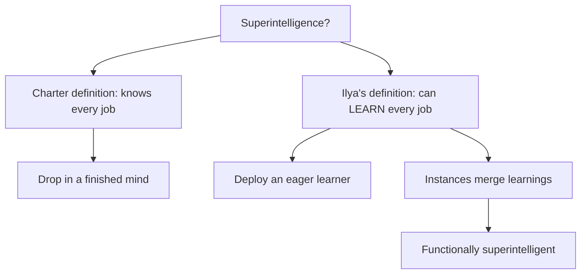

## Why this episode matters

This is the only episode in the track where a scaling maximalist tells you scaling is over. Ilya co-authored AlexNet and GPT-3, the two artifacts that created the age of scaling. When he says "we are back to the age of research, just with big computers," it is not a prediction. It is a retirement announcement for the recipe that made him famous. The episode also gives you the sharpest diagnosis anywhere of the eval-vs-reality gap: the models ace hard benchmarks and then alternate between two bugs like a confused intern. His explanation, the 10,000-hour competitive programmer, reframes everything about how current training works. And his definition of superintelligence, a mind that can learn any job rather than a mind that knows every job, quietly rewrites the target the whole industry is aiming at.

## The story

### The puzzle: brilliant on evals, broken in practice

Dwarkesh opens with the confusion everyone feels. The models do remarkably well on hard evals. Then you use one to vibe-code something, it introduces a bug, you point it out, and it says, in effect, "Oh my God, you are so right," fixes it, and introduces a second bug. You point at the second bug, it apologizes again, and brings back the first. Back and forth, forever. "How is that possible?"

Ilya offers two explanations. The whimsical one: RL training makes models "a little too single-minded and narrowly focused, a little bit too unaware." The structural one, which he clearly believes: the data problem flipped.

In pre-training, the question "what data do we train on?" had an automatic answer: everything. You never had to choose. In RL, you must choose. Every company now has teams whose job is to produce RL environments and add them to the training mix. There are "so many degrees of freedom," "such a huge variety of RL environments you could produce."

And here is the mechanism that matters. Teams take inspiration from the evals. They think: "I would love our model to do really well when we release it. I want the evals to look great. What would be RL training that could help on this task?" So the training distribution gets sculpted, consciously or not, toward the evals. Dwarkesh's summary line: "the real reward hacking is the human researchers who are too focused on the evals."

Combine that with genuinely inadequate generalization, and the eval-vs-reality gap stops being mysterious. The model is not generally smart. It is specifically prepared.

### The 10,000-hour competitive programmer

Ilya's analogy does the heavy lifting. Take two students. Student A decides to become the best competitive programmer alive. She practices 10,000 hours, solves every problem, memorizes every proof technique, implements every algorithm fast and correctly. Student B thinks competitive programming is cool, practices 100 hours, does well, and also has "it," the unnameable thing.

Who does better in their career later? The second. "Right."

The models, Ilya says, are student A, "but even more." We collect every competitive programming problem ever, augment the data to make more, and train on all of it. Of course the result is a great competitive programmer. And of course, with that level of narrow preparation, it is intuitive that it would not generalize to tasteful, judgment-driven programming work.

Then Dwarkesh asks the question that unlocks the next section: what is student B doing in those 100 hours? What is the "it" factor? Ilya's answer points at pre-training, and at its limits.

Definition: generalization is the ability to learn from one environment and improve performance on a different one, not just to perform well on the thing you trained on.

### Pre-training was free practice; the bill is coming due

Pre-training, in Ilya's telling, was "10,000 hours of practice for free." The practice was already in the distribution. Its two real advantages were scale ("there is so much of it") and thoughtlessness ("you do not have to think hard about what data to put into pre-training"). Pre-training data is "the whole world as projected by people onto text."

But there is no human analog to pre-training, and the proposed analogies fail instructively. The first 15 years of a human life? A human with 15 years and a tiny fraction of the data "knows much less" but "knows much more deeply." A 15-year-old would not make the mistakes our AIs make. Evolution's 3-billion-year search? Maybe closer, but evolution might have an edge we do not understand.

The brain-damage case makes the gap vivid. Ilya describes a man who lost emotional processing in a stroke: still articulate, still good at puzzles, tests fine, but felt nothing. The result: "extremely bad at making any decisions at all." Hours to choose socks. Terrible financial decisions. Emotions, whatever they are computationally, are load-bearing for agency. The ML analogy, Ilya suggests, is "some kind of a value function thing," and "right now, value functions do not play a very prominent role in the things people do."

### Value functions, defined from zero

This is the episode's technical core, and Ilya defines it carefully for a non-ML audience.

How RL is done now (o1, R1 "ostensibly"): you give the neural net a problem. It takes thousands, maybe hundreds of thousands, of actions or thoughts. It produces a solution. The solution is graded. That single score becomes the training signal for every action in the trajectory.

The failure mode: for a long task, "it will do no learning at all until you come up with the proposed solution." One bit of feedback at the end, broadcast across a hundred thousand steps.

A value function is a second head that answers a different question: "Maybe I could sometimes, not always, tell you if you are doing well or badly." The chess example: you lose a piece. You do not need to finish the game to know that move was bad, and that whatever led to it was bad. The value function "lets you short-circuit the wait until the very end."

The 1,000-step example: you explore a direction for a thousand steps of thinking, conclude it is unpromising. With a value function, you get the reward signal a thousand timesteps earlier, at the moment you chose the path: "Next time I should not pursue this path in a similar situation."

Dwarkesh raises the DeepSeek R1 paper's objection: the trajectory space is so wide that learning the intermediate-trajectory-to-value mapping may be too hard. Ilya's reply is a credo: "Sure it might be difficult, but nothing deep learning cannot do." His expectation: value functions "will be used in the future, if not already."

Figure 1. Naive RL vs value-function RL. Source: episode.

| | Naive RL (o1/R1 style) | With a value function |
|---|---|---|
| Signal | One grade at the end | Grades along the way |
| A 1,000-step dead end teaches | Nothing until the solution | "Do not take this path" at step 1 |
| Learning on long tasks | Stalls until first success | Progress from partial information |
| Chess analogy | Play the whole game to learn | Losing a piece teaches immediately |

### The eras: research, scaling, research again

Ilya's periodization is the episode's headline:

- 2012 to 2020: the age of research. People tinkered, tried to get interesting results.
- 2020 to 2025: the age of scaling (plus or minus error bars). Scaling laws, GPT-3, one word that told everyone what to do.
- Now: back to the age of research, "just with big computers."

Why did "scaling" work as an instruction? "This is an example of how language affects thought. 'Scaling' is just one word, but it is such a powerful word because it informs people what to do." The pre-training recipe was: mix compute with data in a net of a certain size, and you will get results, and more of the mix gets more results. Companies loved it because it de-risked investment: "get more data, get more compute" is plannable; "go forth researchers and research" is not.

But the recipe had a physical limit. "Pre-training will run out of data. The data is very clearly finite." And the deeper question: is the belief really that 100x more scale transforms everything? "It would be different, for sure. But is the belief that if you just 100x the scale, everything would be transformed? I do not think that is true."

The transition already happened once: from pre-training scaling to RL scaling. The open question is what the new clean relationship looks like. Pre-training had a power law between data, compute, parameters, and loss, "almost like a law of physics." What is the equivalent law for whatever comes next? Nobody knows. That is what makes it the age of research.

### AGI overshot: humans are not AGI

The history of the term matters. Early game AIs (checkers, chess) were mocked as narrow: "Sure, the chess AI can beat Kasparov, but it cannot do anything else." The reaction was a demand for general AI, "an AI that can just do all the things." Then pre-training arrived with a magical property: more pre-training made the model better at everything, more or less uniformly. "General AI. Pre-training gives AGI."

But, Ilya says, "they overshot the target." A human being is not an AGI. Humans lack vast knowledge. What humans have instead is continual learning: the ability to pick up new jobs, new skills, new situations, over a lifetime.

So he redefines the target. Superintelligence is not a finished mind that can do every job in the economy (the OpenAI charter definition). It is a mind that can learn to do every job. Deployment looks like hiring a brilliant, eager 15-year-old: "You go and be a programmer, you go and be a doctor, go and learn." The learning trial-and-error period is part of the product, not a bug.

Two paths to the intelligence explosion follow:

1. The learning algorithm itself becomes superhuman at ML research, and recursively improves. The classic recursive self-improvement story.
2. Even without that: one model deployed everywhere, its instances learning every job on the job, amalgamating what they learn. "Humans cannot merge our minds in the same way." The merged model "functionally becomes superintelligent" with no recursive self-improvement in software at all.

Broad deployment, he thinks, likely means "very rapid economic growth," possibly extremely rapid. The counterweight: "the world is just really big and there is a lot of stuff, and that stuff moves at a different speed."

Figure 2. Two definitions of superintelligence. Source: episode.

### SSI, showing the thing, and caring for sentient life

On Safe Superintelligence, his company, Ilya describes a change of mind: "I now place more importance on AI being deployed incrementally and in advance." The problem is imagination: "it is very hard to feel the AGI." Even AI researchers cannot picture future systems. So you have to show the thing, early and incrementally, or nobody (including the builders) updates.

Three predictions follow:

1. Fierce competitors will collaborate on safety. He predicted this three years ago; the first small OpenAI-Anthropic step has since appeared.
2. As AI becomes visibly powerful, companies will get "much more paranoid" about safety. Today it does not feel powerful because of its mistakes; "at some point the AI will start to feel powerful actually," and behavior will change.
3. Governments and the public will demand action.

On what to build: the industry is "locked into" the self-improving AI idea, he says, "because there are fewer ideas than companies." His alternative: "the AI that is robustly aligned to care about sentient life specifically." The argument: it may be easier to build an AI that cares about sentient life than one that cares about human life alone, because the AI itself will be sentient. Empathy, on this view, is what happens when you model others with the same circuits you use to model yourself (the mirror-neuron analogy). The catch he states honestly: most sentient beings will be AIs, trillions eventually quadrillions, humans a tiny fraction. So "human control over this future civilization" may not even be the right criterion. He also floats capping the power of the most powerful superintelligence: "materially helpful," mechanism unknown.

He is equally honest about the difficulty: "what people are doing right now will go some distance and then peter out... The 'It' we do not know how to build, and a lot hinges on understanding reliable generalization." Alignment failures, learning failures, optimization failures: "Are these not all instances of unreliable generalization?" And: "If generalization was much better, what would happen? Right now still unanswerable."

### The equilibrium he does not like

Short-term: "universal high income." Long-term, he reaches for the Buddhists: "Change is the only constant." Governments and structures have shelf lives.

He dislikes the obvious equilibrium (everyone gets an AI servant; humans stop participating: "Great, keep it up") because the person is "no longer a participant." His answer, which he also does not like but offers as the stable one: humans become part-AI, "Neuralink++." Understanding transmitted wholesale, so the human is fully involved in whatever situation the AI is in. That, he thinks, is the equilibrium that survives contact with superintelligence.

### How evolution encodes desires (the hard problem)

Dwarkesh presses on a mystery Ilya clearly loves: how does the genome encode high-level desires? Dopamine-to-smell is easy to imagine (chemical sensor, pursue the chemical). But caring about social standing requires the brain to do "a lot of processing to piece together lots of bits of information." How does evolution, with only a recipe for building a brain, say "care about that computation"?

Ilya's speculation (flagged as probably false): cortex regions sit in the same place across people (neurons talk to neighbors, so functions cluster into regions). Maybe evolution hard-coded GPS coordinates: "when that fires, that is what you should care about." The counter-evidence Dwarkesh offers: people blind from birth have their visual cortex co-opted by other senses, yet social desires persist. Location cannot be the whole story.

The frame Dwarkesh adds: emotions designed millions of years ago for a different world still steer us. That is "an example of alignment success": the brainstem issues a crude directive ("mate with somebody who is more successful"), the cortex interprets success in the modern context, and the alignment holds across the gap.

### Self-play's second home, and research taste

Self-play, Ilya says, "did find a home, but just in a different form": debate, prover-verifier setups, LLM-as-a-Judge incentivized to find mistakes. Adversarial setups, not literal self-play. The general principle: competition creates an incentive to differentiate. Put agents together, tell them others are working the problem, and each concludes "I should pursue something differentiated." That is an engine for diversity of approaches.

The closing question is research taste: what distinguishes his hit rate (AlexNet to GPT-3)? His answer: "an aesthetic of how AI should be, by thinking about how people are, but thinking correctly." The artificial neuron works because the brain's folds probably do not matter but its many neurons do; distributed representation; learning from experience. The checklist: "beauty, simplicity, elegance, correct inspiration from the brain. All of those things need to be present at the same time."

And the function of that aesthetic: "The top-down belief is the thing that sustains you when the experiments contradict you." If you trust data completely, a bug looks like a refutation. "How can you tell that there is a bug? How do you know if you should keep debugging or you conclude it is the wrong direction? It is the top-down." The belief "something like this has to work" is what keeps you going through the contradiction.

## Questions and answers

**1. Explain the eval-vs-reality gap to me like I am new.**

Models train on RL environments that teams design, and teams (consciously or not) design them to make evals look good at release. The model becomes like a student who did 10,000 hours of competitive programming: unbeatable at the prepared thing, lost outside it. The eval measures the preparation, not general intelligence. That is why it can ace a hard benchmark and then flip-flop between two bugs.

**2. What is a value function, and why does RL need one?**

Current RL gives one grade at the end of a hundred-thousand-step trajectory, so nothing is learned until the first success. A value function grades intermediate states: it tells you mid-trajectory whether you are doing well or badly. Chess intuition: losing a piece teaches you immediately, without finishing the game. Ilya expects value functions to matter more in future training, the DeepSeek R1 paper's skepticism notwithstanding.

**3. Why is the age of scaling over, in one paragraph?**

Pre-training's recipe (more data + more compute = better, predictably) de-risked investment and told everyone what to do. But data is finite, and 100x more of the same is not obviously transformative. The clean power law is gone. What replaces it has no known law yet, which means the work is research again: finding the next recipe, not executing the old one.

**4. What is Ilya's definition of superintelligence, and why does it change the target?**

Not a mind that knows every job, but a mind that can learn every job, deployed like an eager 15-year-old and learning on the job. If that is the target, the industry should optimize for learning efficiency and continual learning, not for stuffing more knowledge into weights. It also means deployment itself is a learning process, which changes what "safe deployment" has to mean.

**5. Applied: my team builds evals for our AI product. How do I avoid the trap this episode describes?**

Assume your eval is training your team, not just measuring your model. Ilya's mechanism: RL environments get sculpted toward whatever makes release numbers look good. Counter-moves: (a) hold out evals that no training-environment designer has seen; (b) measure generalization explicitly (performance on tasks from a different distribution than the training environments); (c) track the gap between eval scores and real user outcomes as its own metric, and treat a widening gap as a training failure, not a measurement artifact.

**6. Why might "caring about sentient life" be easier to build than "caring about humans"?**

Because the AI itself will be sentient, so the concept is self-referential rather than alien. Empathy may fall out of the engineering: if you model others with the same circuits you use to model yourself, other minds get moral weight for free. The honest catch Ilya states: future sentient beings will be overwhelmingly AIs, so this criterion does not obviously preserve human control. It is a candidate, not a solution.

**7. What is the "it" factor, and can training produce it?**

The thing student B has after 100 hours that student A lacks after 10,000: the ability to generalize from little preparation. Ilya's view is that pre-training gave us the 10,000 hours for free but did not obviously produce "it." The research bet of the episode: the next paradigm must produce learning efficiency itself, the ability to learn from one environment and improve on another, rather than more preparation.

**8. What does "top-down belief" mean for my own hard projects?**

When experiments contradict your direction, data alone cannot tell a bug from a refutation. What sustains you is a prior built from beauty, simplicity, elegance, and correct inspiration: "something like this has to work." Ilya's rule: hold the top-down belief while debugging ruthlessly. Abandon the direction only when the belief itself, not just the experiment, breaks.

## Memory aids

- The eras: research (2012-2020) → scaling (2020-2025) → research again, "just with big computers."
- 10,000 hours vs 100 hours: the model is student A. "It" is what student B has.
- The real reward hacking: researchers optimizing for evals, not models optimizing for reward.
- One grade at the end: why long-horizon RL stalls. Value functions grade the middle.
- Data is finite: the physical fact that ended the scaling recipe.
- Superintelligence = learns any job, not knows every job. The 15-year-old, not the encyclopedia.
- "It is very hard to feel the AGI": why deployment must be incremental and early.
- Paranoia comes late: companies get serious about safety only when AI starts to feel powerful.
- Neuralink++: the equilibrium he dislikes but offers. Staying a participant requires merging.
- Top-down belief: beauty + simplicity + elegance sustains you through contradictory experiments.
- Never-confuse pair: pre-training (practice for free, no choosing) vs RL (choosing environments, degrees of freedom everywhere).
- Trap card: "More evals will fix the eval gap." If the environments are sculpted to the evals, more evals just sculpt harder. Measure the gap itself.
- Quote to keep: "The top-down belief is the thing that sustains you when the experiments contradict you."

## How to imbibe this

- This week: find one place where you are student A (10,000 hours of narrow preparation) and ask what student B's "it" would look like there. Write the difference in two sentences. Then design one exercise that trains the "it" (generalization to an unseen variant) instead of more preparation.
- Catch yourself: the next time a benchmark or metric looks great, ask Ilya's question: was the training sculpted toward this measurement? List who designed the training environments and what they were incentivized to show. If the answer is "us, and good numbers," discount the metric.
- Behavior change per major idea:
  - Eval gap: add one held-out evaluation to something you measure, designed by someone who has not seen your training process. Watch the gap between the two numbers.
  - Value functions: on your longest-running project, stop waiting for the final grade. Define one intermediate signal ("am I doing well or badly right now?") and check it weekly.
  - End of scaling: take one thing you have been scaling (effort, spend, headcount) and ask whether 100x more would transform it or just enlarge it. If the latter, you are in your own age of research: find the new recipe.
  - 15-year-old superintelligence: the next time you deploy something (a hire, a tool, a process), plan the learning trial-and-error period explicitly instead of expecting a finished mind.
- Monthly: reread your metrics and ask which ones your own preparation sculpted. Kill one vanity metric.

## Think it yourself

Guided drills. Do these with your own brain before touching AI. Write answers by hand.

1. Worked analogy: you train a model only on past interview questions from one company, with augmentation. It aces their loop. Then it joins and cannot do the job. Map each element to Ilya's student-A/student-B story: what is the 10,000 hours, what is the eval, what is "it"? (Answer: 10,000 hours = the augmented question bank; the eval = the loop it aces; "it" = the judgment to handle unseen problems, which narrow preparation does not produce.)
2. Mechanism: in your own words, explain why RL needs a value function using the chess example, then invent your own example from a long task in your life (a degree, a project). Where would the intermediate grades have gone?
3. Journal: "Where am I waiting for one grade at the end?" Name the long trajectory. Design the value function: what would tell you mid-way that you are doing well or badly?
4. Both sides: argue that pre-training is like evolution (Ilya's sympathetic case), then argue it is nothing like evolution (his skeptical case). Which argument is stronger, and what would settle it?
5. First principles: Ilya says data is "very clearly finite." Estimate: if the public web is ~100 trillion tokens and frontier models train on ~15 trillion, how many more 10x data scalings are possible? What does that imply for the recipe? (Answer: less than one full 10x remains from the public web. The recipe must change: synthetic data, new modalities, or a different objective.)
6. Observe: find a metric in your work that improved while the underlying reality did not. Who sculpted the training toward the metric? Write the mechanism in one paragraph.

## Skills you can now use

- Diagnose an eval-vs-reality gap: check whether training environments were designed with the eval in mind, and whether generalization was measured separately.
- Design a value-function check for any long project: intermediate grades that short-circuit waiting for the final outcome.
- Tell the scaling era from the research era: a clean, plannable law means scaling; no known law means research. Allocate effort accordingly.
- Apply the 15-year-old test to any "AGI" claim: does it know every job, or can it learn any job? Only the second counts.
- Use top-down belief correctly: hold the aesthetic prior through contradictory experiments, but debug ruthlessly; abandon only when the belief breaks, not the experiment.
- Spot the "fewer ideas than companies" lock-in: when an industry converges on one idea (self-improving AI), ask what the neglected alternative is.

## Go deeper

- Safe Superintelligence Inc., Ilya's company: https://ssi.inc
- The DeepSeek-R1 paper, whose value-function skepticism the episode debates: https://arxiv.org/abs/2501.12948

## Figure audit

| Unit | Claim | Before | After | Figure | Medium | Source |
|---|---|---|---|---|---|---|
| u01 | Naive RL learns nothing until the end | One grade, whole trajectory | Grades along the way | fig1 | table | episode |
| u02 | Superintelligence = learning, not knowing | Finished mind, every job | Eager learner, merges learnings | fig2 | mermaid | episode |

All 2 units mapped. No blank cells.
