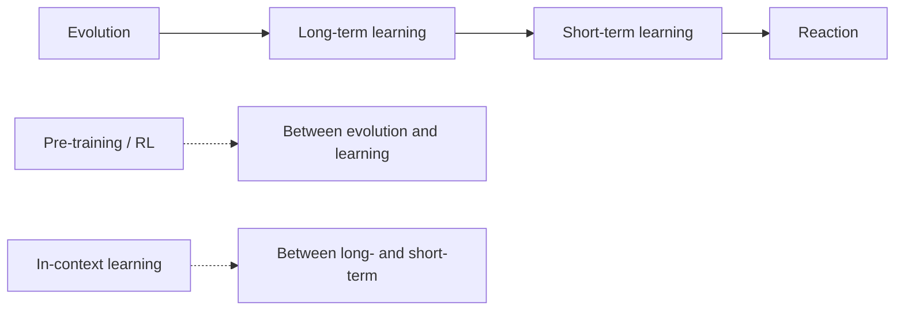

## Why this episode matters

This is the track's most quantitative defense of the scaling worldview, from the person who wrote it down first. Dario wrote "The Big Blob of Compute Hypothesis" in 2017, before GPT-1, and in this episode he claims, with receipts, that nothing since has violated it. The episode gives you three things no other episode gives: the seven-ingredient recipe stated as an investment thesis, the code-automation spectrum (90% of lines vs 100% of end-to-end tasks vs 90% less demand, carefully distinguished), and the actual spreadsheet logic behind "responsible scaling" (why buying $1 trillion of compute on a 10x revenue curve is bankruptcy if you are off by one year). It is also the only episode that takes the economics of diffusion seriously: the models may arrive in one to three years, and the trillions in revenue may take one to five years after that, and that gap is where companies die.

## The story

### The headline: near the end of the exponential

Three years after their last conversation, Dwarkesh asks what updated. Dario's answer: the technology's exponential went "about as I expected," models climbing from smart high schooler to college to PhD-level work, code going beyond. What shocked him is "the lack of public recognition of how close we are to the end of the exponential." His line: "It is absolutely wild that you have people talking about the same tired, old hot-button political issues, when we are near the end of the exponential."

His probabilities, stated numerically:

- 90% on a "country of geniuses in a data center" within 10 years ("it is crazy to say that this will not happen by 2035").
- 50/50 hunch it is 1 to 3 years.
- 95 to 99% that "all this will happen" in 10 years.
- 5% world: Taiwan invasion, internal turmoil, fabs destroyed; delays of a decade.
- Coding end-to-end: "there is no way we will not be there in ten years."

The irreducible uncertainty sits in non-verifiable tasks: planning a Mars mission, a CRISPR-level discovery, writing a novel. "I am almost certain we have a reliable path to get there," but verification is the hard part.

### The Big Blob of Compute Hypothesis

In 2017, with GPT-1 just out, Dario wrote a document listing what actually matters. Seven ingredients:

1. Raw compute.
2. Quantity of data.
3. Quality and distribution of data (broad).
4. Training duration.
5. An objective function that "can scale to the moon": the pre-training objective, or the RL objective (go reach the goal), with objective rewards (math, coding) and subjective rewards (RLHF and beyond).
6. Normalization.
7. Conditioning. (Six and seven are the numerical-stability plumbing so "the big blob of compute flows in this laminar way.")

"All the cleverness, all the techniques, 'we need a new method to do something,' that does not matter very much." He still holds it in 2026: "I do not think I have seen very much that is not in line with it." Sutton's Bitter Lesson (2019) is, in his telling, the same hypothesis.

The update: RL now scales like pre-training did. "We train the model on math contests, AIME or other things, and how well the model does is log-linear in how long we have trained it." Anthropic sees it across "a wide variety of RL tasks," and other companies' releases say the same.

### Answering Sutton: RL environments are the new pre-training data

Sutton's objection (episode 9): needing billions in compute plus bespoke RL environments to teach Excel and browsers suggests we are "scaling the wrong thing," missing the core human learning algorithm. Dario's reply: the RL-vs-pre-training distinction is a red herring. It is the same phenomenon at a different stage.

The history: GPT-1 (2017) trained on ~1 billion words of fanfiction and literary text, a narrow distribution. It did not generalize. GPT-2 trained on a broad Common Crawl / Reddit scrape, and generalization appeared. The lesson: breadth of distribution, not the specific documents, is what matters.

RL is at the GPT-1 stage. Start with math contests, move to code, then to many tasks, and "increasingly get generalization." The goal of building RL environments is not to teach every skill, just as pre-training was not trying to cover every document. It is to reach the generalization transition.

The sample-efficiency puzzle is real and he does not dodge it: models train on trillions of tokens; humans do not see trillions of words. His resolution: pre-training sits "somewhere between the process of humans learning and the process of human evolution." LLMs are blank slates (random weights); humans arrive with priors from evolution ("whole books have been written about this"). The hierarchy:

- Evolution → long-term learning → short-term learning → reaction (humans).
- Pre-training / RL → in-context learning (models), sitting between the human points.

In-context learning is "kind of like human on-the-job learning, but a little weaker and a little short term." A million tokens is days or weeks of human reading. And crucially: the country of geniuses may not need true continual learning at all. Pre-trained breadth ("it knows more about the history of samurai in Japan than I do... more about low-pass filters and electronics") plus long-context in-context learning "may just be enough... to generate trillions of dollars of revenue." Continual learning is being worked on anyway, with a good chance of landing in one to two years, and longer contexts are "an engineering and inference problem," not a research problem (the KV-cache storage problem; train-at-long vs serve-at-long explains the reported degradation).

Figure 1. The learning hierarchy. Source: episode.

### The code spectrum (read carefully)

Dario says people repeatedly misunderstood his code predictions, so he lays out the spectrum explicitly. These are "very different benchmarks from each other":

1. 90% of lines of code written by the model. (Said 8-9 months before the episode, for 3-6 months out. Happened, at Anthropic and downstream.) "A very weak criterion."
2. 100% of lines written by the model. Big productivity difference from (1).
3. 90% of end-to-end SWE tasks done by models: compiling, clusters, environments, testing features, writing memos.
4. 100% of end-to-end SWE tasks.
5. 90% less demand for software engineers. "I think will happen," further down the spectrum.

Even at (4), engineers are not out of jobs: "new higher-level things they can do, where they can manage." (The farming analogy from his "Adolescence of Technology" essay: the tractor did not end agricultural work, it changed its level.)

On why no software renaissance is visible yet: diffusion. Two caricatured extremes: "AI progress is slow, diffusion takes forever, none of this matters" vs "recursive self-improvement, Dyson spheres next Tuesday." His position: "soft takeoff, soft, smooth exponentials, although the exponentials are relatively steep."

The internal numbers: coding models give roughly a 15-20% total speedup now, vs ~5% six months earlier. "A snowball gathering momentum: 10%, 20%, 25%, 40%." Amdahl's law applies: you must remove everything blocking the loop from closing, "one of the biggest priorities within Anthropic." Why no lasting moat for the best coding model: gradual advantage, multiple companies' models in internal use, leakage. "Everything we are seeing is consistent with this kind of snowball model."

### Responsible scaling: the spreadsheet

Anthropic's revenue: 10x per year. 2023: $0 to $100M. 2024: $100M to $1B. Start of 2026: $10B annualized run rate. Extrapolate naively: $100B end of 2026, $1T end of 2027. At $1T/year for five years, that is $5T of compute to buy.

Here is the responsible-scaling argument, and it is pure arithmetic. Data centers take one to two years to build; you must commit now for 2027. If you buy $1T/year of compute starting end of 2027 and revenue comes in at $800B instead of $1T, "there is no force on earth, no hedge on earth that could stop me from going bankrupt." Off by one year, or 5x growth instead of 10x, and you are ruined.

So: buy hundreds of billions, not trillions. Capture strong upside; make financial trouble require things to go "pretty badly." "Responsible" does not mean spending little ("we are buying a hell of a lot... comparable to what the biggest players are buying"). It means: a written spreadsheet, understood risks, enterprise revenue you can rely on, margins as buffer. "I get the impression that some of the other companies have not written down the spreadsheet... They are just doing stuff because it sounds cool."

The diffusion gap is the reason. Technology may arrive in 1-3 years; "how many years after that do the trillions in revenue start rolling in?" One year? Two? Five? The curing-disease example: the AI invents the cure in the lab, but manufacturing, regulation, and distribution take their own time (COVID vaccines: 1.5 years to everyone; polio: 50 years and still eradicating in remote Africa). "Faster than anything we have seen in the world, but it still has its limits."

Figure 2. The responsible-scaling arithmetic. Source: episode.

| | Bull case | Off-by-one-year case |
|---|---|---|
| Revenue end of 2027 | $1T | $800B |
| Compute bought | $1T/year | $1T/year |
| Outcome | Captured upside | Bankruptcy, no hedge available |
| Dario's choice | Buy hundreds of billions: strong upside, survival if wrong |

### The industry structure: three or four players

No monopoly, he says (lawyers forbid the word). The equilibrium: a small number of players, like cloud (three, maybe four), because entry costs are enormous in capital and expertise. "If you go to someone and you are like, 'I want to disrupt this industry, here is $100 billion'... Only to decrease the profit." Margins positive but not astronomical.

Models are more differentiated than cloud, though: "Everyone knows Claude is good at different things than GPT is good at, than Gemini is good at." Even within coding, models have different styles. So expect more differentiation than cloud's commodity compute.

The commoditization counter-argument he takes seriously: if AI models can produce AI models, "that is kind of an argument for commoditizing the whole economy at once." Far post-country-of-geniuses. Unknown territory.

His geographic worry: growth could be "50% in Silicon Valley and parts of the world socially connected to Silicon Valley, and not much faster elsewhere." Mitigations: build data centers in Africa ("as long as they are not owned by China"), seed AI-driven biotech startups in the developing world, keep humans there in the startup and supervision loops. Catch-up growth historically ran on underutilized labor plus imported capital; with labor no longer the constraint, "growth is always better and stronger if we can make it endogenous."

### Pricing the tokens

API pricing survives, he argues, because the API sits "very close to the bare metal": with exponential capability growth, there is always a frontier of use cases from the last three months, and any fixed product surface goes stale. A thousand experiments, a hundred startups, ten big ones, two or three canonical uses per generation. The API persists through all of it.

But tokens are not equal. "My Mac is not working" / "restart it" is worth cents; a molecule redesign for a pharma company is "worth tens of millions of dollars." Expect "pay for results" and labor-like pricing to emerge alongside the API.

Claude Code's origin story illustrates the feedback loop: early 2025, internal CLI for Anthropic's own researchers ("nontrivial acceleration of your own research"), fast internal adoption, then external launch. Anthropic's own coders use it daily; model improvements feed back into the tool. "This is the reason why we launched a coding model and did not launch a pharmaceutical company": they have the users, the feedback, and the loop. Not the pharma resources.

### Robotics, and the dissolved barriers

Robotics does not depend on human-like learning. It could come from training on video games, simulated robotics environments, or computer-control generalization. Whichever route, "when for whatever reason the models have those skills, then robotics will be revolutionized": better robot design (models better than humans at it) and better control. Add a year or two to the digital milestone. Trillions in revenue, same fast-but-finite diffusion.

On the worry that there will always be one more missing piece of human intelligence (continual learning today, something else tomorrow): the history of ML is barriers dissolving. "How do your models keep track of nouns and verbs?" "It is only statistical correlations." "You cannot do reasoning." Then code and math worked. "There is a stronger history of some of these things seeming like a big deal and then kind of dissolving" in the big blob of compute.

### The world order: adolescence of technology

Two facts constrain any good future: (1) the ability to build and run AIs is diffusing extremely rapidly; (2) AI populations will grow extremely rapidly. So "lots of people will be able to build huge populations of misaligned AIs."

He is skeptical that 3-4 labs' models will "check each other": offense-dominant worlds are possible ("like nuclear weapons, but more dangerous"), or unstable ones (both sides 90% sure they would win a fight; "they cannot both be right, but they can both think that").

Short-run program: with few players, install safeguards now: alignment work, bioclassifiers. Long-run, the worry sharpens on authoritarianism: AI plus an entrenched authoritarian state becomes "very difficult to displace." His goal: when the "rules of the road" get negotiated, "democratic nations... holding the stronger hand."

He explored (not endorsed) the interventionist view that autocracy cannot survive AGI; what he endorses is the worry plus a hope: technologies have made forms of government obsolete before (industrialization ended feudalism). Perhaps AI makes dictatorship "morally unworkable," forcing "a collective reckoning" about rights. And a concrete technical hope: build AI that makes it infeasible for authoritarian states to deny people private use, "an AI model that defends them from surveillance," so authoritarian structures "disintegrate from the inside." (The internet was supposed to do this; it did not. "What if we could try again with the knowledge of how many things could go wrong?")

The policy principle he lands on: "growth and economic value will come very easily... What will not come easily is distribution of benefits, distribution of wealth, political freedom." Policy should focus on the latter. Sell cures to authoritarian countries; do not sell them data centers, chips, or chip-making ability.

### The constitution: principles beat rules, corrigibility wins

On Claude's constitution: principles beat rule lists, empirically. Rules ("do not tell people how to hot-wire a car, do not speak in Korean") do not generalize; principles give consistent behavior and cover edge cases. Hard guardrails remain (no bioweapons).

On corrigibility vs intrinsic values: "we are actually pretty far on the corrigible side." Default: do the task. Limits: danger, harm to others. "A mostly corrigible model that has some limits, but those limits are based on principles."

### The CEO craft: DVQ and culture

Dario spends "a third, maybe 40%" of his time on culture. At 2,500 people he cannot touch every detail; the leverage is making Anthropic a place where everyone believes in the mission and in each other, no backstabbing, no "decoherence" (which he sees worsening elsewhere).

Two mechanisms:

1. The DVQ ("Dario Vision Quest," a name he tried to fight): every two weeks, a 3-4 page doc, an hour in front of the whole company, honest, plus Q&A. "This is what I am thinking, and this is what Anthropic leadership is thinking." Direct connection beats six levels of chain.
2. A Slack channel where he writes constantly, unfiltered: "a reputation of telling the company the truth... to call things what they are, to acknowledge problems."

His fear, stated memorably: the two-minute decision. "Dario, you have two minutes. Should we do thing A or thing B?" A random half-page memo at lunchtime "ends up being the most consequential thing ever." Everything happens at once; you do not know which decisions matter until later.

## Questions and answers

**1. What is the Big Blob of Compute Hypothesis, in one paragraph?**

Seven things matter: compute, data quantity, data quality/distribution, training duration, a scalable objective function, and numerical-stability plumbing (normalization, conditioning). Everything else, clever methods and new techniques, barely matters. It is an investment thesis: put resources into the seven, because the blob, scaled, produces the capabilities. Dario wrote it in 2017 and says nothing since has violated it.

**2. Why does Dario think Sutton's "scaling the wrong thing" objection fails?**

Because RL-vs-pre-training is a stage difference, not a kind difference. GPT-1 (narrow fanfiction data) did not generalize; GPT-2 (broad web data) did. RL today is at the GPT-1 stage (math contests), moving toward breadth (code, many tasks). The environments are not there to teach Excel; they are there to trigger the same generalization transition. The one real puzzle, sample efficiency, is answered by placing pre-training between evolution and learning.

**3. Explain the code spectrum. Why is "90% of code" weak?**

Lines written is not productivity. The spectrum: 90% of lines (weak; happened) → 100% of lines → 90% of end-to-end tasks (compiling, environments, testing, memos) → 100% → 90% less demand for engineers. Each step is a different, larger claim. Someone citing "90% of code" as proof engineers are done is confusing step 1 with step 5.

**4. Walk me through the responsible-scaling math.**

Revenue grows 10x/year ($100M → $1B → $10B run rate). Naive extrapolation says $1T end of 2027, justifying $1T/year of compute bought now (data centers take 1-2 years). But if revenue is $800B, you go bankrupt with no hedge. Being off by one year, or growing 5x instead of 10x, is ruinous. So buy hundreds of billions: capture the upside, survive being wrong. Responsible = a written spreadsheet and margins as buffer, not small spending.

**5. Applied: our startup is deciding how much GPU capacity to lock in for 2027. What do we steal from this episode?**

Three things. (a) Separate the technology timeline from the revenue timeline; the gap between "it works" and "it pays" is where companies die. (b) Size the commitment to survive being off by one year, not to maximize the bull case. (c) Write the spreadsheet: what revenue level makes this commitment fatal? If you cannot name the number, you are YOLOing.

**6. Why will there be 3-4 AI labs, not one monopoly or a hundred?**

Entry costs: hundreds of billions in capital plus rare expertise, "only to decrease the profit." That equilibrium supports a few players with real but not astronomical margins, like cloud. Differentiation (Claude vs GPT vs Gemini styles) supports more players than cloud's commodity. The scenario that breaks it: AI models making AI models, which commoditizes everything at once.

**7. What is Dario's answer to "AI will concentrate power in authoritarians"?**

Two layers. Near-term: democracies must hold the stronger hand when the rules get negotiated; install safeguards (alignment, bioclassifiers) while the player count is small. Long-term hope: build technology that makes denying people private AI infeasible (personal models that defend against surveillance), so authoritarian structures dissolve from inside. And the policy split: diffuse the benefits (cures), withhold the power sources (data centers, chips, fabs).

**8. What does the DVQ teach about running a fast-moving organization?**

At 2,500 people, the CEO cannot touch the work; the leverage is shared reality. A biweekly honest doc + Q&A, and a constantly-written unfiltered channel, give everyone the same picture of what leadership actually thinks. That is what prevents decoherence. The failure mode it guards against: six-level chains where nobody knows what the top believes, so everyone optimizes locally.

## Memory aids

- Seven ingredients: compute, data quantity, data quality, duration, scalable objective, normalization, conditioning. The blob.
- Log-linear: RL performance vs training time, on AIME and beyond. The scaling law survived the paradigm shift.
- GPT-1 → GPT-2: narrow fanfiction → broad web. Breadth, not documents, caused generalization. RL is at the GPT-1 stage.
- The hierarchy: evolution / long-term / short-term / reaction; models sit between the points.
- The spectrum: 90% lines → 100% lines → 90% tasks → 100% tasks → 90% less demand. Do not confuse step 1 with step 5.
- 15-20% now, 5% six months ago: the snowball. 10, 20, 25, 40.
- $800B vs $1T: the number that bankrupts you. Off by one year = ruin.
- Soft takeoff: smooth exponentials, steep ones. Neither stalled nor Dyson-spheres-next-Tuesday.
- 50% Silicon Valley, flat elsewhere: the geographic worry. Build in Africa, not China.
- Tokens are not equal: cents for "restart it," tens of millions for the molecule.
- Principles > rules; corrigible with limits. The constitution in one line.
- Never-confuse pair: technology timeline (1-3 years to country of geniuses) vs revenue timeline (1-5 years after that to trillions). The gap kills.
- Trap card: "90% of code is written by AI, so engineers are 90% done." Lines ≠ productivity ≠ demand. Read the spectrum.
- Quote to keep: "There is no force on earth, no hedge on earth that could stop me from going bankrupt."

## How to imbibe this

- This week: write your own seven-ingredient list for your most important project. What are the blob inputs (the things that scale predictably) vs the cleverness (the things that feel important but barely matter)? Reallocate one unit of effort from cleverness to blob.
- Catch yourself: the next time someone cites "90% of X is automated," ask which step of the spectrum they mean. Lines, tasks, or demand? Write the distinction down before reacting.
- Behavior change per major idea:
  - Blob hypothesis: audit where your resources go. If most go to methods and little to the scalable inputs, you are betting against the hypothesis. Decide explicitly.
  - Code spectrum: for one automation claim in your world, place it on the 5-step spectrum. Notice how often step 1 is sold as step 5.
  - Responsible scaling: size your next commitment (hiring, spending, capacity) to survive being off by one year. Name the fatal number in writing.
  - Technology vs revenue timelines: for your current bet, write both dates. If they are the same date, you have not thought about diffusion.
  - DVQ: start a biweekly honest write-up for your team (or yourself): what you actually think, plus Q&A. Watch what it does to alignment.
- Monthly: check the snowball. What compounded 10 → 20 → 25 → 40 in your work? Feed it.

## Think it yourself

Middle chapters: Fermi estimates and journaling, less scaffolding. Sketch answers; verify with your own brain.

1. Fermi: Anthropic's revenue went $0 → $100M → $1B → $10B (run rate). Continue 10x/year for 3 more years. What revenue? What 5-year compute commitment does that imply at Dario's ratio? Now redo at 5x/year. What is the ratio between the two compute numbers? (Sketch: 10x gives $10T revenue by end of 2029, implying tens of trillions in compute; 5x gives $1.25T. The ratio is ~8x. That 8x is the bankruptcy gap.)
2. Mechanism: explain the GPT-1 → GPT-2 generalization transition in your own words, then map it onto RL's current stage. What would "GPT-2 for RL" look like?
3. Journal: "Where am I confusing step 1 with step 5?" Find an automation claim you believed. Place it on the spectrum honestly.
4. Both sides: argue that RL environments are teaching real skills (the Sutton worry is wrong), then argue they are GPT-1-style narrow preparation (Dario's actual point is subtler than either). What experiment distinguishes them?
5. First principles: Dario says tokens are worth different amounts. Price three outputs of a system you use: a trivial answer, a good answer, and a transformative answer. What pricing model captures the spread?
6. Observe: find a commitment in your organization sized for the bull case. What is its fatal number? Who wrote the spreadsheet?

## Skills you can now use

- State the scaling hypothesis as an investment thesis: name the blob inputs, discount the cleverness.
- Place any automation claim on the 5-step spectrum before reacting to it.
- Size commitments to survive being off by one year; name the fatal revenue number in writing.
- Separate technology timelines from revenue/diffusion timelines; budget for the gap.
- Diagnose industry structure: entry costs → player count; differentiation → margins.
- Run a DVQ-style alignment ritual: biweekly honest write-up plus open Q&A.

## Go deeper

- "Machines of Loving Grace," Dario's long essay on the post-AI future: https://darioamodei.com/machines-of-loving-grace
- Dwarkesh Patel's site, for the full episode archive: https://www.dwarkeshpatel.com

## Figure audit

| Unit | Claim | Before | After | Figure | Medium | Source |
|---|---|---|---|---|---|---|
| u01 | Learning sits between evolution and reaction | Human stages only | Model stages interleaved | fig1 | mermaid | episode |
| u02 | Responsible scaling = survive being wrong | Bull-case sizing | Fatal-number sizing | fig2 | table | episode |

All 2 units mapped. No blank cells.
