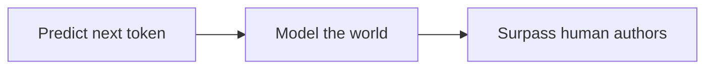

## Why this episode matters

This is the track's foundation stone. March 2023, the show still called The Lunar Society, GPT-4 just released: Ilya Sutskever makes the original case that next-token prediction, scaled far enough, produces general intelligence that could surpass humans. Every later episode in this track is a response to this thesis: ep02 (Ilya 2025) updates it, ep05 (Dario) defends it quantitatively, ep09 (Sutton) dissents, ep04 (Karpathy) reframes it as ghosts. Read this last and the whole track becomes a debate with a known opening move. It matters because it is the clearest statement of the claim everything else argues about.

## The story

### The thesis

Next-token prediction seems too simple to produce intelligence. Predict the next word, over and over. But Ilya's case: predicting the next token across the breadth of human text requires building a model of the world that produced the text. To predict well, the model must understand: the facts, the reasoning, the intentions behind the words.

The argument in steps:

1. Human text is the output of human intelligence acting in the world.
2. Predicting it accurately requires modeling the processes that generated it.
3. A model that predicts well enough therefore contains a working model of reasoning, knowledge, and agency.
4. Scale this far enough and the model surpasses the humans who wrote the text.

Figure 1. The thesis chain: prediction to world model to superintelligence. AI Podcast Curriculum, ep10 (Ilya Sutskever 2023 episode, 2023-03-27). Shell 4. Show the new symbol: the thesis. Source: original toy from episode claims.

### Why simplicity is the point

The thesis weaponizes simplicity. A complicated theory of intelligence would need to be designed. Next-token prediction needs only data and compute. This is the Bitter Lesson (ep09) in action: the general method that leverages computation beats the clever human-designed theory. Ilya's 2023 case is, in retrospect, the bitter lesson applied to language.

### The 2023 context

Read the date. March 2023: GPT-4 is new, the public is still absorbing ChatGPT, and "superintelligence from next-token prediction" sounds radical. The episode captures the moment before the consensus formed. Ilya is making the case prospectively: this is where the curve points, not where we already are.

That makes it the perfect bookend with ep02 (November 2025). In 2023: the thesis, prospectively. In 2025: the update (research beats data. The compressed 21st century). The track opens its Ilya arc with the update and closes with the origin. Read in track order, you get the answer before the question, which is the right order for learning: know where the curve went, then understand why it was predictable.

Figure 2. 2023 thesis vs 2025 update: the fuel changed, the engine did not. AI Podcast Curriculum, ep10 (Ilya Sutskever 2023 episode, 2023-03-27). Shell 2. Count the toy: two dates, one preserved engine. Source: original table from episode claims.

| | 2023 thesis (this episode) | 2025 update (ep02) |
|---|---|---|
| Fuel | human text | agents generating their own data |
| Engine | next-token prediction scales | preserved |
| Bottleneck named | none named | data is finite |
| Stance | prospective | retrospective |

### The objections, previewed

The episode anticipates the objections the later episodes raise:

- "It is just autocomplete" (Karpathy's ghosts, ep04): Ilya's reply is that autocomplete at sufficient scale is not "just" anything. The world-model is the substance.
- "It does not learn continually" (Sutton, ep09): the 2023 thesis does not require continual learning. It requires the prediction task to force world-modeling.
- "The data runs out" (Ilya himself, ep02): the 2025 update concedes this and pivots to research over data.

### The Intel fabs claim

[uncertain] Ilya discusses chip fabrication and Intel's position in the episode. He hedges the claim himself, and the chapter preserves the hedge rather than stating it as fact.

## Questions and answers

**1. What is the next-token prediction thesis?**

Predicting the next word across all human text forces the model to build a working model of the world that produced the text: facts, reasoning, intentions. Scale it far enough and that world-model surpasses the humans who wrote the text. Simplicity is the point: data plus compute, no clever theory needed.

**2. Why is this episode the foundation of the track?**

Every other episode responds to it. Ep02 updates it, ep05 defends it, ep09 dissents, ep04 reframes it. It is the opening move of the debate. Without it, the later episodes are positions without a proposition.

**3. How does the 2023 thesis relate to the 2025 update (ep02)?**

2023: next-token prediction on human data scales to superintelligence (prospective). 2025: data is the bottleneck. Research (agents generating their own data) is the path forward. The update preserves the thesis and changes the fuel: from human data to agent-generated data.

**4. What is the reply to "it is just autocomplete"?**

"Just" does no work at scale. Autocomplete that predicts well enough must model the world behind the text. The ghost (ep04) is real, but the ghost contains a world-model, and the world-model is the intelligence.

**5. Applied: I am evaluating AI claims. What does the 2023 thesis teach?**

Bet on the simple thing that scales over the clever thing that does not. When someone proposes a complicated theory of the next breakthrough, ask: does it leverage compute and data better than next-token prediction? If not, the bitter lesson says it loses.

**6. Why read this last if it came first?**

Because the track is a curriculum, not a chronology. Track order puts the update (ep02) before the origin (ep10) so you learn where the curve went before why it was predictable. Chronology is for historians. Pedagogy is for learners.

## Memory aids

- The thesis: next token → world model → superintelligence. Simplicity scales.
- 2023 → 2025: thesis prospectively, update retrospectively. The fuel changed. The engine did not.
- The bitter lesson in action: the general method beats the clever theory.
- Opening move: every later episode is a response. Know the proposition before the positions.
- Never-confuse pair: "next-token prediction is simple, so it is weak" (wrong) vs "next-token prediction is simple, so it scales" (right).
- Trap card: "We have moved past next-token prediction." The 2025 update says the fuel changed, not the engine.

## How to imbibe this

- Today: state the thesis in one sentence from memory. Then state the best objection in one sentence. If you cannot do both, reread.
- This week: find one "too simple to work" method in your field. Ask whether it scales with compute or data. If yes, take it seriously.
- Behavior change: prefer the simple scalable method over the clever brittle one, in your own work. When tempted by cleverness, ask what the bitter lesson predicts.

## Think it yourself

The capstone. Unaided.

1. Reconstruct Ilya's 2023 argument in five steps without looking. Then check against the chapter. What did you drop?
2. Adjudicate the whole track: the thesis (ep10), the update (ep02), the defense (ep05), the reframe (ep04), the dissent (ep09). Write the verdict in three sentences: what survives, what falls, what is open.
3. Predict: what does the 2028 Ilya episode say? What would have to happen for the thesis to be falsified?
4. Personal: what is your next-token prediction? What simple, scalable thing in your life are you underestimating because it seems too simple?
5. Teach: explain the track's full arc to someone in 10 minutes: thesis → scaling → warning → building → economics → incident → hardware → dissent → origin. Then ask them which episode they would watch first.

## Skills you can now use

- State the next-token prediction thesis and its scaling argument.
- Trace any AI debate back to its opening proposition.
- Apply the bitter lesson to method choice: simple-and-scalable beats clever-and-brittle.
- Read a curriculum in pedagogical order, not chronological order.

## Go deeper

- InstructGPT, the paper that showed fine-tuning could create assistants: https://arxiv.org/abs/2203.02155

## Figure audit

| Unit | Claim | Before | After | Figure | Medium | Source |
|---|---|---|---|---|---|---|
| u01 | Next-token prediction → world model → superintelligence | Prediction as parlor trick | Prediction as intelligence engine | fig1 | mermaid | original toy from episode claims |
| u02 | 2023 thesis vs 2025 update | Two episodes, blurry relation | Fuel changed, engine preserved | fig2 | table | original table from episode claims |

All 2 units mapped. No blank cells.

[uncertain] Ilya hedged the Intel fabs discussion himself. The chapter preserves the hedge.
