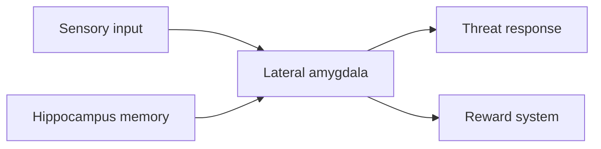

## Why this episode matters

This is the foundation episode of the track. Every later tool in this curriculum works on machinery this episode names. If you do not know what fear is in the brain, every breathing trick and pep talk floats free of its target. This episode fixes the target.

In the episode, Huberman defines fear as a brain and body state with a known circuit: the amygdala fires a generic threat reflex, the HPA axis floods the body with adrenaline and cortisol, and the prefrontal cortex writes a story about what the fear means. The same circuit that makes fear stick also makes fear erasable. The rules are strict. Extinction must precede relearning. Anti-anxiety chemistry during extinction blocks the learning. Deliberate brief stress erases chronic stress. Trusted social connection lowers the isolation signal Tachykinin.

## The four layers: stress, anxiety, fear, trauma

Definition: stress is the body mobilizing. Definition: anxiety is a story about a future threat. Definition: fear is a threat that has your attention right now. Definition: trauma is a fear that never resolved and changed how you respond.

The autonomic nervous system runs the mobilization. It has two arms that work like a seesaw. The sympathetic arm drives alertness: heart rate up, blood to muscle, digestion down. The parasympathetic arm drives calm: heart rate down, digestion up. Stress tips the seesaw toward sympathetic. Calm tips it back. Fear slams the seesaw hard to the sympathetic side in one motion.

The four layers stack. Stress is the raw response. Anxiety adds a narrative about what might happen. Fear adds a present trigger. Trauma is what remains when the trigger is gone but the response is not. Treatment differs by layer, so mislabeling costs you the right tool. Breathing fixes stress in seconds. It does not rewrite trauma.

## The HPA axis is the slow hormonal route

Definition: the HPA axis is the chain hypothalamus to pituitary to adrenal glands. The hypothalamus senses threat. It signals the pituitary. The pituitary signals the adrenals. The adrenals release adrenaline and cortisol into the blood.

Adrenaline is the fast wave. It acts in seconds. Cortisol is the slow wave. It lasts for hours and changes gene expression, which means it changes which genes the cell reads and uses. This is why a scare at noon can still color your evening. The adrenaline is long gone. The cortisol tail is still active.

Figure 1. The two waves of the HPA axis. AI Podcast Curriculum, ep01 (Andrew Huberman, 2021-12-06). Shell 2. Count or score the toy. Source: original toy, from episode claims.

| Wave | Released from | Acts in | Lasts | What it does |
|---|---|---|---|---|
| Adrenaline | Adrenal glands | Seconds | Minutes | Mobilizes the body now |
| Cortisol | Adrenal glands | Minutes | Hours | Keeps the system alert, changes gene expression |

## The amygdala is a dumb reflex, not a smart judge

Definition: the amygdaloid complex is a cluster of 12 to 14 brain areas that detect threat. The lateral amygdala is the entry point. It receives inputs from the hippocampus, which carries memory, and from the sensory channels, which carry what you see and hear.

The amygdala does not think. It matches patterns. A loud bang after a car crash fires the same reflex as a loud bang at a party. The reflex is generic. The meaning comes later, from the prefrontal cortex. This is why the episode calls the amygdala a final common pathway: many different inputs, one standard alarm.

The lateral amygdala has two outputs, and the second one surprises most people. Output one is the threat response: it signals the hypothalamus, which drives the adrenals, and it signals the periaqueductal gray and the locus coeruleus, covered in the next section. Output two is the dopamine reward system, through the nucleus accumbens and the mesolimbic pathway. Fear couples to reward. This coupling is why horror movies, roller coasters, and risky bets feel thrilling rather than purely awful. The same alarm that says run also says more.



Figure 2. Fan in, fan out of the lateral amygdala. AI Podcast Curriculum, ep01 (Andrew Huberman, 2021-12-06). Shell 1. Show a toy with at most 8 items. Source: original toy, from episode claims.

## The threat output runs three branches

When the lateral amygdala fires the threat output, three branches execute. Branch one: the hypothalamus drives the adrenal glands, releasing adrenaline and cortisol. Branch two: the periaqueductal gray drives freezing, fawning, and the release of endogenous opioids, the body's own painkillers. Branch three: the locus coeruleus raises arousal across the whole brain, which sharpens focus and speeds the heart.

Freezing is not cowardice. It is a branch of the circuit. Fawning, which means appeasing the threat, is another branch. The body picks among fight, flight, freeze, and fawn without asking your opinion. Your opinion arrives later, as a story about what just happened.

Figure 3. The three threat branches. AI Podcast Curriculum, ep01 (Andrew Huberman, 2021-12-06). Shell 2. Count or score the toy. Source: original toy, from episode claims.

| Branch | Driver | Visible effect |
|---|---|---|
| Hormonal | Hypothalamus to adrenals | Adrenaline and cortisol flood |
| Freeze and fawn | Periaqueductal gray | Stillness or appeasement, own opioids released |
| Arousal | Locus coeruleus | Wide focus, fast heart, full alertness |

## The prefrontal cortex writes the story

Definition: top-down control is the prefrontal cortex sending inhibitory signals down to the amygdala. It cannot stop the first alarm. It can change what the alarm means.

In the episode, Huberman states the rule as a paraphrase: you cannot bargain with how fear feels, you can only bargain with what fear means. The tack example makes it concrete. Step on a tack and the pain signal is identical whether you believe the tack is dirty or clean. The feeling is fixed. The meaning, and therefore the fear, is negotiable. The ice bath example works the same way. The cold shock is identical. The story "this is dangerous" produces panic. The story "this is practice" produces calm focus.

This is the hinge of the whole track. Every tool that follows either changes the alarm or changes the story. Nothing in this curriculum changes the feeling directly, because the feeling is not negotiable.

## One bad trial teaches, one good trial does not unteach

Definition: Pavlovian fear learning is the amygdala linking a neutral signal to a threat after pairing. The learning is asymmetric. One pairing of a tone with a shock teaches the fear. One pairing of the tone with safety does not erase it.

In the episode, Huberman cites Kerry Ressler's work on fear memories. The amygdala stores associations, not facts. It keeps two kinds of memories. Protective memories help you avoid real danger. Dangerous memories are false alarms that run your life. The amygdala cannot tell them apart. That sorting job belongs to the prefrontal cortex, through extinction.

The mechanism is long-term potentiation, LTP, at the NMDA receptor. Definition: LTP is the strengthening of a synapse after use. Definition: the NMDA receptor is a synaptic gate that opens during strong activity and lets calcium in, which strengthens the connection. Huberman gives the analogy of a dial-up connection upgrading to 5G. After fear learning, the threat pathway transmits at 5G speed. Weakening it takes many repeated safe trials, because each safe trial only slightly turns the dial back.

## Extinction must precede relearning

Definition: extinction is the new learning that a feared signal is now safe. It builds a second memory, a safety memory, that competes with the fear memory. Forgetting would mean the trace decayed on its own. Extinction builds something new that wins. The prefrontal cortex must build the safety memory before any positive association can stick.

The episode states the order as a strict rule. You cannot build a positive association on top of an active fear response. You must first extinguish the fear. Then you can relearn. Huberman describes the result of retelling a trauma story under extinction conditions: the terrible story becomes a terrible boring story. The facts stay. The charge drains.

The clinical forms named in the episode are prolonged exposure, cognitive processing therapy (CPT), and cognitive behavioral therapy (CBT). All three expose the person to the feared memory or situation in safe, repeated doses until the alarm stops firing.

```
BEFORE:  trigger -> amygdala alarm -> fear body state -> avoidance
STEP 1:  trigger + safety + repetition -> alarm weakens (extinction)
STEP 2:  trigger + new meaning -> safety memory wins (relearning)
AFTER:   trigger -> prefrontal story -> calm body state -> approach
```

Figure 4. The extinction sequence. AI Podcast Curriculum, ep01 (Andrew Huberman, 2021-12-06). Shell 3. Apply one rule. Source: original toy, from episode claims.

## EMDR suppresses the amygdala with eye movements

Definition: EMDR is eye movement desensitization and reprocessing, developed by Francine Shapiro in the 1980s. The patient moves the eyes side to side while recalling the trauma.

In the episode, Huberman reports that at least five papers, in journals including Nature, across mice, non-human primates, and humans, show that lateral eye movements suppress amygdala activity. The mechanism is not positive thinking. It is a bottom-up dampening of the alarm while the memory is active, which lets extinction proceed.

The episode sets two limits. EMDR works best for single-event traumas, such as one accident or one assault. And it is incomplete on its own, because it damps the fear without building the reward-side relearning. It extinguishes but does not replace. This is why the episode pairs EMDR with narrative work: damp the alarm, then write the new story.

Figure 5. What EMDR does and does not do. AI Podcast Curriculum, ep01 (Andrew Huberman, 2021-12-06). Shell 3. Apply one rule. Source: original toy, from episode claims.

| Step | What happens | Covered by EMDR |
|---|---|---|
| Recall the trauma | Memory activates the amygdala | Yes, the entry point |
| Lateral eye movements | Amygdala activity drops | Yes, shown in 5 papers |
| Fear extinguishes | Alarm weakens with repetition | Yes |
| Positive relearning | New reward association builds | No, needs separate narrative work |

## Tachykinin is the isolation signal

In the episode, Huberman describes work from David Anderson's lab at Caltech on a molecule called Tachykinin in the central amygdala. Isolation raises Tachykinin. Trusted social contact lowers it. Huberman keeps a post-it note about Tachykinin on his desk as a reminder that loneliness is a chemical state, not a character flaw.

The logic connects to the fear circuit. An isolated animal shows stronger fear responses. A socially connected animal shows weaker ones. The molecule gives the mechanism: disconnection raises the alarm gain. This is why every fear protocol in this track eventually returns to people. Connection is not soft advice. It is a pharmacological intervention delivered by other humans.

## Fear can echo across generations

Two findings appear in the episode. First, polymorphisms in the FKBP5 gene, which regulates the stress response, associate with different fear and trauma vulnerability. Definition: a polymorphism is a common variant of a gene, like a spelling difference that many people share. Second, Brian Dias showed that a male mouse conditioned to fear a smell passes heightened sensitivity to that smell to its offspring. The inheritance runs mainly through the father in the cited work.

The episode is careful about the limit. What passes down is a predisposition, a more sensitive alarm, not the specific trauma. The child does not inherit the memory of the event. The child inherits an amygdala that fires more easily. Predisposition is not destiny. It is a lower threshold, and thresholds can be retrained.

## Ketamine and MDMA reopen the learning window

The episode covers two pharmacological tools, both framed as ways to make extinction and relearning happen together.

Ketamine-assisted therapy, in work from Karl Deisseroth, Robert Malenka, and Liqun Luo, drives 1 to 3 Hz activity in layer 5 of the retrosplenial cortex. The dissociation ketamine produces lets the patient revisit the trauma without the full fear response, which is extinction, while the patient builds a new narrative, which forms the new association. The drug opens the window. The therapy does the work.

MDMA drives dopamine and serotonin release at the same time. In the episode, Huberman cites oxytocin levels of 83.7 versus 18.6 picograms per milliliter at 90 to 120 minutes, MDMA versus control, a roughly 4.5-fold rise. The combination compresses extinction and relearning into one session: the fear damps down while the reward system is wide open, so the new association forms in the same window. At the time of recording, MDMA was illegal outside clinical trials.

Figure 6. The two drugs and what each contributes. AI Podcast Curriculum, ep01 (Andrew Huberman, 2021-12-06). Shell 2. Count or score the toy. Source: original toy, from episode claims.

| Tool | Key action named in the episode | Extinction | Relearning |
|---|---|---|---|
| Ketamine | 1 to 3 Hz in layer 5 retrosplenial cortex, dissociation | Yes, fear without the full response | Yes, new narrative in the same session |
| MDMA | Dopamine plus serotonin together, oxytocin 83.7 vs 18.6 pg per mL at 90 to 120 min | Yes, fear damps down | Yes, reward system open at the same time |

## Interoception calibrates the fear balance

Definition: interoception is the sense of the inside of the body: heartbeat, breath, gut tension. Definition: exteroception is the sense of the outside: sights, sounds, other people.

In the episode, Huberman cites a Science paper showing that the insular cortex, which maps internal body states, calibrates the fear balance. People who sense their internal signals accurately regulate fear better. The mechanism is calibration: the prefrontal story about danger gets checked against real body data. Without interoception, the story runs unchecked. With it, the story must match the body. This is why slow breathing works on fear. It is not a distraction. It feeds the insula clean data.

## Deliberate brief stress erases chronic stress

The episode reports a striking animal finding: about 5 minutes per day of deliberate stress reverses the effects of chronic stress in mice. The key word is deliberate. Self-directed entry into the stress is what makes it training rather than trauma. The animal chooses the cold water. The stress becomes a workout for the alarm system.

Two protocols appear. Cyclic sighing is the calming tool: a double inhale through the nose followed by a long exhale, repeated 1 to 3 times. Cyclic hyperventilation is the stress tool: 25 to 30 deep breaths followed by an exhale and an empty-lung hold of 25 to 60 seconds, repeated for a few rounds. The hyperventilation deliberately spikes adrenaline. The calm mind during the spike teaches the system that high arousal is survivable. Cold showers and ice baths work the same way: voluntary cold, calm mind, alarm retrained.

The episode adds a caution. People prone to panic should approach hyperventilation carefully, because the CO2 shifts can trigger the very alarm they want to train.

Figure 7. The two breathing protocols. AI Podcast Curriculum, ep01 (Andrew Huberman, 2021-12-06). Shell 3. Apply one rule. Source: original toy, from episode claims.

| Protocol | Steps from the episode | Direction | Purpose |
|---|---|---|---|
| Cyclic sighing | Double nasal inhale, long exhale, 1 to 3 rounds | Downregulates | Calm the alarm in real time |
| Cyclic hyperventilation | 25 to 30 breaths, exhale, empty-lung hold 25 to 60 s | Upregulates then recovers | Train the alarm with voluntary stress |

## Sleep, nutrition, and connection set the water level

Huberman uses the tide and boat analogy. Sleep, nutrition, and trusted social connection are the tide. Fear and stress tools are the boat. A boat floats or sinks with the tide. No breathing protocol compensates for chronic sleep loss. The episode treats these three as the base layer that sets the gain on everything above.

## Supplements have real numbers and strict timing

The episode names three supplements with study counts. Saffron at 30 mg per day, across 12 studies measured on the Hamilton Anxiety Rating Scale, reduces anxiety. Inositol at 12 to 18 grams per day for a month has evidence for anxiety and OCD. Kava at 150 to 300 mg of kavalactones, in 8 studies over 3 weeks, acts on GABA and dopamine to reduce anxiety.

The timing rule matters more than the list. Do not take anxiolytics during extinction sessions. Dampening the alarm with chemistry during exposure blocks the learning. The alarm must fire, in a safe context, for extinction to occur. Use the supplements between sessions, not during them.

Figure 8. Supplement numbers from the episode. AI Podcast Curriculum, ep01 (Andrew Huberman, 2021-12-06). Shell 2. Count or score the toy. Source: original toy, from episode claims.

| Supplement | Dose from the episode | Evidence named | Timing rule |
|---|---|---|---|
| Saffron | 30 mg per day | 12 studies, Hamilton Anxiety Rating Scale | Between sessions, not during extinction |
| Inositol | 12 to 18 g per day for a month | Evidence for anxiety and OCD | Between sessions, not during extinction |
| Kava | 150 to 300 mg kavalactones, 3 weeks | 8 studies, GABA plus dopamine | Between sessions, not during extinction |

## Q&A

1. Explain the amygdala to me like I am new. What is it and why do you call it dumb?
Think of the amygdala as a smoke detector with 12 to 14 sensors. It does not know what burns. It only knows the pattern of smoke. A burnt toast and a house fire trip the same alarm. That is why it is dumb: it matches patterns, it does not judge them. Your prefrontal cortex is the fire inspector who arrives later and decides whether to call the trucks.

2. Why does one bad experience stick, while one good experience does not erase it?
The amygdala learns threat in one trial through long-term potentiation, which strengthens the synapse from dial-up to 5G speed. Safety learning is a separate, slower memory that must compete with the fear memory. One good trial adds a thin safety trace. It takes many safe repetitions to build a safety memory strong enough to win.

3. Applied: you panic before every flight. What do you do this week, in order?
First, name the layer: this is fear with a present trigger, not trauma. Second, start extinction: watch plane videos or visit an airport without flying, staying until the alarm drops, repeated across days. Third, add deliberate brief stress on other days, such as a cold shower with a calm mind, to lower the general alarm gain. Fourth, do not take anti-anxiety supplements during the exposure sessions. Fifth, write the new story only after the alarm weakens: flying is the safest leg of the trip.

4. Why must extinction come before positive relearning?
A positive association cannot form on top of an active alarm. The amygdala fires first and drowns the reward signal. Extinction builds a safety memory that quiets the alarm. Only then does the reward system have a quiet window to write the new association. The episode order is strict: terrible story first, then terrible boring story, then a new story.

5. What is Tachykinin and what lowers it?
Tachykinin is a molecule in the central amygdala that rises with isolation and falls with trusted social contact, in work from David Anderson's lab at Caltech. It is a chemical measure of disconnection. What lowers it is real, trusted company, not social media scrolling. Loneliness raises the fear gain. Connection lowers it.

6. Why must you avoid anxiolytics during extinction sessions?
Extinction is a learning process, and that process needs the alarm to fire in a safe context. An anxiolytic damps the alarm chemically, so the brain learns nothing about the trigger itself. You feel calm during the session and the fear returns after, because the safety memory never formed. Use calming tools between sessions, never during exposure.

7. What is the difference between stress, anxiety, fear, and trauma?
Stress is the body mobilizing now. Anxiety is a story about a future threat. Fear is a present threat holding your attention. Trauma is a fear that never resolved and rewired your responses. Breathing fixes stress in seconds. Narrative work fixes anxiety. Extinction fixes fear. Trauma needs extinction plus relearning, sometimes with clinical help.

## Memory aids

Mnemonic for the HPA chain: Hypothalamus Pushes Adrenals. Head tells pituitary, pituitary tells adrenals, adrenals flood the body.

Mnemonic for the two amygdala outputs: Threat or Treat. The alarm fires the threat response and, at the same time, the reward system. Fear thrills because the same circuit says run and says more.

Mnemonic for the treatment order: Erase before Replace. Extinction first, positive relearning second. Never reversed.

Never-confuse pair: extinction versus forgetting. Forgetting is the trace decaying. Extinction is a new safety memory competing with the fear memory. The old memory still exists. The new one wins.

Never-confuse pair: fear versus anxiety. Fear has a present trigger and a body alarm. Anxiety has a future story and a mental loop. The sigh treats the body alarm. The narrative work treats the story.

Trap card: EMDR is best for single-event traumas, per the episode. Do not present it as a general cure for complex or developmental trauma. It also damps fear without building the reward-side learning, so it is half the job.

Trap card: the oxytocin numbers, 83.7 versus 18.6 picograms per milliliter at 90 to 120 minutes, come from the MDMA discussion. Do not quote them as a general fact about hugs or bonding.

## How to imbibe this

This week, run three practices. First, the layer check. Three times per day, when you feel uneasy, label the layer out loud: stress, anxiety, fear, or residue. Write the label in a note. You train the prefrontal cortex to sort before the amygdala spends.

Second, one deliberate stress session per day. End your shower with 30 seconds of cold water. Keep your mind calm and your breathing slow while the cold hits. You teach the alarm that high arousal is survivable. Note the time it takes for the shock feeling to fade. Watch that time shrink across the week.

Third, the story audit. Pick one recurring fear, such as a weekly meeting. Write the story you tell about it in two sentences. Then write the same facts with a neutral story. You practice the one negotiable part: what the fear means, never how it feels.

Self-catch: when your heart pounds, say "alarm, not fact" silently. That phrase marks the amygdala reflex as a signal to check, not a verdict to obey.

## Think it yourself

Do these with your own brain, before touching any AI. Guided drills: the answers are findable in this chapter, but work them out first.

1. Label the layer. For each scenario, name stress, anxiety, fear, or trauma, and say which tool from this chapter fits: (a) your shoulders tighten during a long workday, (b) you replay a job interview from last month every night, (c) a dog barks and lunges at you on a walk, (d) you avoid all dogs three years after one bite.
2. Trace the circuit. A car backfires near you. List the path: sensory input, lateral amygdala, the three threat branches, the HPA waves. Mark where the prefrontal cortex can intervene and where it cannot.
3. Design an extinction ladder. Pick a mild fear you actually have. Write five steps from least to most triggering. For each step, write how you would know the alarm dropped before moving up. Set the rule for what counts as a completed session.
4. Spot the order violation. A friend takes a strong anti-anxiety supplement, then does exposure therapy for a phobia, and the phobia returns in a month. Explain the failure using the extinction timing rule.
5. Argue both sides. Side A: fear memories are permanent, so management is the only goal. Side B: extinction plus relearning truly erases the response. Use the LTP mechanism and the terrible-boring-story result to decide which side the episode supports.

## Skills you can now use

- Name the active layer, stress, anxiety, fear, or trauma, within seconds of feeling uneasy, and pick the matching tool instead of a random one.
- Run the cyclic sighing protocol, 1 to 3 rounds, to downregulate in under a minute.
- Explain to another person why avoidance strengthens fear: every avoided trigger denies the amygdala a safety trial.
- Time anti-anxiety supplements correctly: between extinction sessions, never during.
- Use the "alarm, not fact" reframe to separate the amygdala reflex from the prefrontal story in real time.

## Go deeper

- The episode video: https://www.youtube.com/watch?v=31wjVhCcI5Y
- Dias, B. G. and Ressler, K. J. (2014). Parental olfactory experience influences behavior and neural structure in subsequent generations. Nature Neuroscience. The transgenerational olfactory fear study cited in the episode.

## Figure audit

| Unit id | Claim | Before | After | Figure id | Medium | Source | Four tests |
|---|---|---|---|---|---|---|---|
| u01 | HPA two waves | Hormones as one blur | Adrenaline in seconds, cortisol for hours | fig1 | table | episode claims | T1: 2-row wave table / T2: two timescales force a table / T3: none, static plate / T4: wave language reused in drills |
| u02 | Amygdala fan in fan out | Amygdala as a black box | Inputs in, two outputs out | fig2 | mermaid | episode claims | T1: 5-node flow graph / T2: fan in fan out is a flow / T3: none, static plate / T4: Threat-or-Treat mnemonic reuses outputs |
| u03 | Three threat branches | Alarm as one thing | Three named branches with effects | fig3 | table | episode claims | T1: 3-row branch table / T2: parallel branches force a table / T3: none, static plate / T4: branch names reused in trace drill |
| u04 | Extinction sequence | Fear feels permanent | Four-step before to after trace | fig4 | ASCII | episode claims | T1: 4-line before after trace / T2: sequence is a trace under 12 lines / T3: none, static plate / T4: sequence reused in ladder drill |
| u05 | EMDR scope | EMDR as magic | What it covers and its limit | fig5 | table | episode claims, Shapiro 1980s, 5 papers | T1: 4-row scope table / T2: coverage check forces a table / T3: none, static plate / T4: single-event limit reused in trap card |
| u06 | Ketamine and MDMA | Drugs as one blur | Each drug's distinct contribution | fig6 | table | episode claims | T1: 2-row comparison with the oxytocin numbers / T2: two tools force a table / T3: none, static plate / T4: numbers reused in Q&A |
| u07 | Two breathing protocols | Breathing as one idea | Calming versus training protocol | fig7 | table | episode claims | T1: 2-row protocol table with breath counts / T2: two directions force a table / T3: 25 to 30 breaths is the adjustable number / T4: protocol reused in imbibe section |
| u08 | Supplement numbers | Supplements as vibes | Dose, evidence, timing per supplement | fig8 | table | episode claims | T1: 3-row dose table / T2: three dose sets force a table / T3: dose is the adjustable number / T4: timing rule reused in skills |
