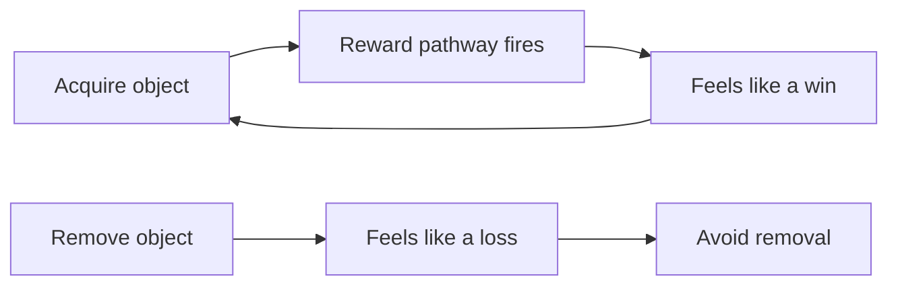

## Why this episode matters

This is the third most-viewed episode of Hidden Brain's YouTube channel (20,092 views as of October 2026), and it is the only one in the track about the architecture of choice itself. It names a defect you cannot feel: subtraction neglect. Your mind solves problems by adding even when removing is the better move. No other episode in this track covers how biology, culture, and organizations all push the same way, or hands you tools that force subtraction into your week. This is the episode you need first, because every later chapter about your mind assumes your mind chooses wisely. It does not. It adds.

## The instinct you cannot feel

### Subtraction neglect

Definition: subtraction neglect is the automatic impulse to solve a problem by addition even when the better solution is to take something away.

Think of the last time you tried to improve a presentation. You read the slides. Your instinct said: add a chart, add a footnote, add a new slide to explain the previous one. You rarely thought: remove a slide. In the episode, host Shankar Vedantam calls this tendency so automatic and so deeply embedded that we do not notice it. We add. We rarely subtract.

The hinge question of the whole episode: when you try to make something better, does removal even occur to you as an option?

### The exam that made a career

At the University of Virginia, an engineer named Leidy Klotz has spent years studying this tendency. His own discovery started in a mechanics exam room. As an undergraduate, he prepared by cramming: learn each assigned homework problem, stuff as many as possible into his head, and hope the exam matched one. It did not work. He carried a C average. For the first time in his life he faced real danger of failing a course, which would have meant delayed graduation, extra tuition, or a changed major.

Before the third exam he did something radical. He stripped everything away. He realized that much of introductory mechanics boils down to one equation: force equals mass times acceleration, F = MA. If he understood that one thing deeply, he could work through most of what the exam threw at him.

He walked in carrying fewer things in his head than any of his classmates. Afterward, Professor Viscomi wrote two numbers on the chalkboard: 98 and 47. The class assumed the 47 belonged to Klotz. He earned the 98.

Hand-worked arithmetic (illustrative toy, not the episode's numbers — the transcript says only "dozens"): picture a student who crams 40 memorized problems into memory. He can solve exactly those 40 variants. An exam with 20 problems drawn from 200 variants defeats him. A student who masters 1 equation and its applications covers all 200 variants. The subtracted preparation had 1 item instead of 40 and produced the better score.

### The Duplo bridge

Years later, Klotz saw the same principle in a playroom. He built a bridge out of Duplo blocks with his 3-year-old son Ezra. The two support towers stood at different heights, so the bridge would not sit level. Klotz's instinct: add a block to the shorter tower. Before he could act, Ezra removed a block from the taller tower. Same level bridge. Half the material. Klotz had not been taught to subtract. Ezra had not been taught to add. Klotz asked colleagues, students, and one professor he describes as a genius to solve similar problems. Everyone added. He understood then that this was not a quirk of personality. It happens inside virtually all of us.

Figure 1. The Duplo bridge, two solutions. AI Podcast Curriculum, ep01 (Leidy Klotz, 2026-04-20). Shell 3. Apply the one rule. Source: original toy, from episode claims.

```
Tower A: █████     Tower A: █████       Tower A: █████
Tower B: ████      Tower B: █████ (+1)  Tower B: ████  (-1 from A)
BEFORE              ADD (Klotz)         SUBTRACT (Ezra)
uneven              level, 6 blocks     level, 5 blocks
```

One claim per plate. The subtract move reaches the same level state with one fewer block. The arrow from BEFORE to SUBTRACT is the rule: remove from the taller tower.

## The experiments

### The grid experiment

Klotz designed a series of experiments, published in Nature in 2021. In one, volunteers saw a digital grid of colored squares and had to make it symmetrical. They could add squares or remove them. Both approaches worked. Most people chose to add. The moment subtraction was pointed out as an option, people took it. The problem was not that subtraction was worse. It simply did not occur to people as a possibility.

### Only 17 percent subtract words

Klotz asked people to improve a short essay. Only 17 percent subtracted words. The other 83 percent made it longer. Strunk and White's The Elements of Style, the most assigned writing textbook in American classrooms for decades, carries a famous directive: omit needless words. Generations of students read that advice. Handed an essay and told to improve it, they still reached for more words, not fewer.

Figure 2. The essay experiment. AI Podcast Curriculum, ep01 (Leidy Klotz, 2026-04-20). Shell 2. Count or score the toy. Source: episode claims.

| Choice | Share of volunteers |
|---|---|
| Added words | 83 percent |
| Subtracted words | 17 percent |

One claim per plate. Four out of five people lengthened the essay even after generations of training in "omit needless words."

### Recipes and music

The pattern held everywhere Klotz looked. Volunteers asked to improve a five-ingredient dish: only 2 out of 90 removed an ingredient. That is about 2 percent. Given loops of musical notes and asked to improve them, people were three times more likely to add notes than to take them away.

Hand-worked arithmetic: in the recipe test, the add-to-remove ratio was 88 to 2, which is 44 to 1. The subtract option was not hidden. Volunteers could remove anything. They added at forty-four times the rate of removing.

### The impossible itinerary

Klotz built one more experiment from a long-running disagreement with his wife, who likes to stuff family travel schedules with activity. He created a fictional itinerary for a day in Washington, D.C.: the White House, the National Cathedral, the Old Post Office, the Lincoln Memorial, the Vietnam Veterans Memorial, a museum, shopping, lunch at a five-star bistro. Fourteen hours of scheduled activity. Just the travel time between stops, assuming optimal D.C. traffic, would exceed two hours. Volunteers could rearrange, add, or remove activities. Even with this jam-packed itinerary, only one in four participants removed activities. The rest rearranged, and most added. They added to a schedule that was already physically impossible to complete.

## Why biology pushes you to add

### Acquisitiveness

Part of the answer might be biological. At the University of Michigan, psychologist Stephanie Preston studies what she calls acquisitiveness: our drive to get and keep things. In one study, volunteers saw over 100 objects on a screen: bananas, coffee mugs, extension cords, but also empty 2-liter bottles, used sticky notes, outdated newspapers. They were asked whether they wanted to acquire each item virtually. People wanted to accumulate dozens of objects, things they had no use for. Then came the real test: whittle everything down to fit into a digital grocery bag on the screen. Many participants failed to get it down to a single bag.

### The reward pathway

Neuroscience adds a mechanism. When we acquire things, even used sticky notes, it activates the brain's reward pathway. This is the same system stimulated by cocaine. Adding feels like a win, like progress, like abundance. Subtraction feels like a loss. And humans, as any behavioral economist confirms, are deeply averse to losses. The loop is simple: acquire, reward signal fires, the act gets reinforced. Removal produces no such signal. It produces the negative feeling of loss. Biology votes for addition before you have time to think.

Figure 3. The biology loop. AI Podcast Curriculum, ep01 (Leidy Klotz, 2026-04-20). Shell 3. Apply the one rule. Source: original toy, from episode claims.



One claim per plate. The arrow from A to B is the rule: acquisition triggers the reward system, so the loop repeats by itself.

## Why culture pushes you to add

### What we celebrate

Culture adds more pressure. Consider what we celebrate. We build plaques for people who construct skyscrapers. We name buildings after donors. We hold ribbon cuttings for new hospitals and new highways. In the episode, Klotz notes it is far easier to get a donation for a building with the donor's family name on it than for removing something or for something with no physical reminder of generosity. Politicians want to tout a new amenity, something tangible, something they can point to. You cannot cut a ribbon on a decrepit building that is gone.

### The grammar of power

The pattern stretches back to the earliest days of human civilization. The pyramids of Egypt and the ziggurats of Mesopotamia are defined by scale that exceeded any practical function. Leaders who commissioned them gained status. Addition, in the deep grammar of civilization, was the language of power. Two and a half thousand years of monuments taught every generation the same lesson: add to matter.

### Why subtraction is harder

Klotz gives three reasons subtraction loses. First, it is more mental work: more steps of thought to figure out what can go. Second, it is more steps of action. Third, there is less to show for it. After all that extra work, you have less evidence, because the thing you did has by definition disappeared. When you add, everyone can see it. When you subtract, the evidence vanishes. That makes subtraction a bad career move inside any organization that rewards visible output.

### The 750 ideas

He saw this at his own university. The University of Virginia asked for suggestions on how to improve. Out of 750 ideas, fewer than 10 percent suggested taking something away. That is fewer than 75 subtractive ideas against more than 675 additive ones. People wanted more study abroad grants, more mental health services, more housing. Someone requested a new ice arena.

The social logic is clean. Walk into an organization and propose cutting things, and you challenge someone's pet project, someone's baby. You make enemies. Propose adding something, and there is almost no social risk, and you get to say "this will make things better." Removing something also requires you to deeply understand how a system works, to figure out what is redundant or unnecessary. The result, in organizations everywhere, is accumulation: a pileup of programs, initiatives, even meetings that nobody questions.

## The external executioner

### The Embarcadero Freeway

Subtraction sometimes requires an external push. Call it an external executioner. The Embarcadero Freeway in San Francisco was a massive double-decker concrete structure stretching more than a mile along the eastern waterfront, blocking access to the bay. It was built after World War II. In the mid-1980s, planners proposed tearing it down. Voters rejected it. For every person who wanted the freeway removed, two wanted to keep it. A Pulitzer Prize-winning San Francisco Chronicle columnist named Herb Caen wrote that tearing down the freeway was, quote, "an even worse idea than building it."

### The earthquake

Then, on October 17, 1989, the Loma Prieta earthquake struck. It killed more than 60 people and injured thousands. The Embarcadero did not collapse, but it was rendered unusable for a while. People got a view of life without it. They found other ways to get around the city, and it did not ruin life in San Francisco. The earthquake provided the push. The freeway came down. The waterfront came back. Housing increased, jobs increased, traffic rerouted without catastrophe. By 2000, it was hard to find anyone who thought ripping down the freeway was a bad idea.

Figure 4. The Embarcadero, before and after subtraction. AI Podcast Curriculum, ep01 (Leidy Klotz, 2026-04-20). Shell 3. Apply the one rule. Source: episode claims.

| State | Waterfront | Housing and jobs | Traffic |
|---|---|---|---|
| Freeway standing (before) | Blocked by concrete | Flat | Feared to be essential |
| Freeway removed (after) | Returned | Increased | Rerouted without catastrophe |

One claim per plate. The rule: removal proved the freeway was not necessary. It took a disaster to make the possibility visible.

## Tools that force subtraction

### The stop doing list

Science suggests we do not have to wait for a crisis. We can build structures that force subtraction into decision-making. One of Klotz's most practical tools is the stop doing list. Everyone keeps a to-do list. A stop doing list works on the same logic, except instead of adding tasks, you catalog the things you will quit. His decision rule: if you will add new things to your day and you are already at capacity, you must also name what you will take away.

### Stop editing

Klotz reads a great deal of student writing. His temptation is to mark every change he would want to make on a rough draft. His tool: a limit. He gives each student his 10 most important comments, no more. This saves him time, and it rewards students who submit polished work: the polished piece gets 10 ways to be better, and the rough piece gets the same 10, not all of Klotz's time to lift it to the same level as the polished one.

### One-in-one-out laws

The same principle scales to law. By some measures, the number of laws on the books grows faster than the economy. Some places now require legislators, when proposing a new law, to identify an existing law to remove. By making it a rule, you make subtraction socially acceptable. The rule removes the career risk that normally kills subtraction.

## Subtraction that saves lives and builds things

### The five-step checklist

In medicine, subtractions save lives. At Johns Hopkins University, researcher Peter Pronovost studied catheter-related infections. Catheters, thin plastic tubes used to draw blood or deliver medication, are ubiquitous in hospitals and one of the most common sources of infection. These infections caused roughly 30,000 deaths in the United States every year, about as many as car crashes. The insertion process was complicated, dozens of steps, each requiring judgment.

Pronovost's insight was to simplify. He proposed a simple recipe: wash hands with soap, clean the patient's skin with antiseptic, put sterile drapes over the entire patient, wear a sterile mask, hat, gown, and gloves, and put a sterile dressing over the catheter site. Five steps. He had made what was essential stand out. And people stopped dying.

Figure 5. Pronovost's subtraction. AI Podcast Curriculum, ep01 (Leidy Klotz, 2026-04-20). Shell 3. Apply the one rule. Source: episode claims.

| State | Steps | Result |
|---|---|---|
| Before | Dozens, each requiring judgment | ~30,000 US deaths per year |
| After | 5 fixed steps | Deaths fell |

One claim per plate. The rule: remove the steps that require judgment, keep only the essential ones in fixed order. Exact death counts after the checklist are not given in the episode.

### The hollow block

In 1927, Anna Keichline had an insight about building materials that changed construction. She was the first female licensed architect in Pennsylvania, a serial inventor. Before her, building blocks were solid, dense, heavy. She asked: do they need to be? She created the hollow block. Removing half the material made it less expensive, easier to build with, and cheaper to transport. The air voids also provided more insulation. Her key brick was cheaper, lighter, insulated better, and was less prone to fire. The hollow concrete masonry unit, its direct descendant, is one of the most commonly used building materials on the planet.

### The Strider bike

For nearly a century, children's bicycles were loaded with additions: training wheels, fake tires, contraptions attaching a child's bike to a parent's bike like a caboose. Then someone asked: what if we subtract the pedals and the drivetrain entirely? The Strider bike works because toddlers stride with their legs instead of pedaling. Klotz's son aged out of his, and when he moved to a big-kid bike, the family never needed training wheels. He already knew how to balance. By removing what everyone assumed was essential, designers made the bike ridable by children as young as a year and a half. They found a whole new market and eliminated the need for training wheels.

## Making the invisible visible

### Nike Air

Even when we subtract, there is a final problem: noticeability. When you add something, everyone can see it. When you subtract something, the evidence, by definition, disappears. In the 1970s, aerospace engineer Marion Rudy had an idea: use air to provide cushioning in running shoes. Less material inside the shoe, more performance on the road. Shoe companies kept turning him down. They could not see what he offered. He finally reached Nike. Phil Knight took him out for a run, felt the difference, and agreed. But still, nobody could see it. So Nike made the absence visible: the Air Max 1 displayed the air through a small window cut into the sole. They cut a window so you could see what was no longer there. They did not just sell air cushioning. They made the subtraction visible.

### Marie Kondo

Marie Kondo built an empire on a version of the same refrain. The default tidying advice was: identify what you no longer want, sort the clutter, discard what does not fit. Kondo flipped the question: forget what you want to get rid of. Focus only on what you want to keep. Her core message names spark joy: keep what sparks joy and get rid of everything else. The outcome is identical. What changes is where your attention goes. And that, psychologists say, changes everything.

### Springsteen's samurai record

When Bruce Springsteen recorded Darkness on the Edge of Town in 1978, he wrote more than 50 songs. Only 10 made the record. The removed songs were not bad. Some became massive hits the moment they left his hands. Patti Smith's Because the Night reached number 13. The Pointer Sisters' Fire hit number two. Springsteen gave away top-20 singles before he placed one there himself. He called the album his samurai record: stripped down for fighting.

Klotz's favorite song on the record, Racing in the Street, was the lullaby he sang to Ezra. Its opening line: "I got a '69 Chevy with a 396." Compare that with the opening line of Greetings from Asbury Park, New Jersey, Springsteen's debut: "Madman drummers, bummers, and Indians in the summer with a teenage diplomat." A cascade of words tumbling forward like a river breaking its banks. Same songwriter, a few years apart. What made the later album better was a radical act of subtraction. The stripping away concentrated the music.

### The old quotes

Picasso once defined art as the elimination of the unnecessary. Antoine de Saint-Exupéry put it this way: perfection is achieved not when there is nothing more to add, but when there is nothing left to take away. A quote attributed to Lao Tzu goes even further: to attain knowledge, add things every day. To attain wisdom, subtract things every day. Two and a half thousand years ago, Lao Tzu said it. Picasso said it. Saint-Exupéry said it. Klotz's son Ezra lived it. He had not been taught yet that when something is broken, you are supposed to add.

## Memory aids

Mnemonic: **SAIL**: the four forces that push you to add. **S**ubtract never occurs to you. **A**ddition fires the reward pathway. **I**nvisible evidence (subtraction shows nothing). **L**ess social risk in adding.

Never-confuse pairs:
- Subtraction neglect is not laziness. Laziness avoids effort. Neglect is a failure of imagination: the option never occurs to you, even when you would take it if shown.
- A stop doing list is not a to-do list with negative tasks. A to-do list schedules work. A stop doing list cancels work, and it only works if each addition is paired with a removal.
- Acquisitiveness is not greed. Greed wants more of what is valuable. Acquisitiveness wants more of everything, including used sticky notes.

Trap cards:
- Trap: "This solution needs more features." Reality: check the 2-of-90 recipe result. Your first instinct has a 44-to-1 bias toward adding. Ask the subtraction question out loud before you build.
- Trap: "Cutting this has no upside for my career." Reality: that is the noticeability problem, not a value problem. Name the removed thing in the release note, like Nike's window.
- Trap: "They will be offended if I remove their piece." Reality: that is the pet-project tax. Use a rule (one-in-one-out) so no person has to be the executioner.
- Trap: "We need a full understanding before we can subtract." Reality: Klotz's exam story (illustrative numbers: dozens of memorized problems down to 1 equation) shows subtraction without full understanding. He built the understanding around the one thing.

## Q&A

**1. Explain subtraction neglect to me like I am new.**
Your brain has a default move: when something needs improvement, add. Add a slide, a feature, a meeting, an ingredient. Remove almost never crosses your mind. Leidy Klotz tested this in Nature in 2021: people given a grid to make symmetrical could add or remove squares, and most added. When subtraction was pointed out, they happily used it. The defect is not that subtraction is worse. It is that it never occurs to you. Follow-up: where did you see this today? Name one thing you improved this week by adding, and test whether removal works.

**2. Walk me through the mechanics: why does adding feel good and subtracting feel bad?**
Two mechanisms stack. First, biology. Acquiring things activates the brain's reward pathway, the same system stimulated by cocaine. Adding registers as a win, as progress, as abundance. Subtraction registers as a loss, and humans are deeply loss-averse. Second, evidence. Adding leaves something visible: a new slide, a new building, a new law. Subtracting leaves nothing, because the removed thing is gone by definition. So the brain gets a chemical reward for adding and a chemical punishment for subtracting, while the social world hands out credit only for the visible part. Follow-up: how would you design a workplace where subtraction gets rewarded? Answer: make it visible (Nike's window), make it a rule (one-in-one-out), and put removals on the stop doing list where everyone sees them.

**3. Why did Klotz's subtracted exam preparation beat cramming, in mechanism terms?**
Cramming stores surface instances: dozens of memorized problems with no shared structure (illustrative toy uses 40). Subtraction kept one generative rule, F = MA, understood deeply. Each memorized problem covers itself. One equation covers every problem that derives from it. The subtraction traded breadth of instances for depth of the generator. Follow-up: when does this fail? When the exam tests disconnected facts rather than derivable applications. Then the generator covers nothing, and subtraction was the wrong move. Subtraction is a tool, not a law.

**4. What was the Embarcadero Freeway story, and what is an "external executioner"?**
The Embarcadero was a double-decker concrete freeway, over a mile long, blocking San Francisco's waterfront. In the mid-1980s planners proposed tearing it down. Voters rejected it two to one. A famous columnist called removal an even worse idea than building it. Then the 1989 Loma Prieta earthquake made the freeway unusable for a while. People discovered they could get around fine without it. The freeway came down, the waterfront returned, housing and jobs increased, traffic rerouted without catastrophe. By 2000, almost nobody called removal a mistake. An external executioner is a force outside the decision that removes the thing for you, because the organization could never choose it. The disaster proved what argument could not: the removed thing was not necessary.

**5. How did Pronovost's checklist save lives, step by step?**
Start: catheter insertion had dozens of steps, each requiring judgment. Each judgment call is a chance to skip a sterilization step. The infections caused roughly 30,000 US deaths a year. Pronovost subtracted the judgment: five fixed steps in fixed order (wash hands, clean skin with antiseptic, sterile drapes over the patient, mask hat gown and gloves, sterile dressing over the site). Five items fit in working memory. Dozens do not. By removing steps that required discretion, he removed the failure points where infections entered. Follow-up: why not add more training instead? Training adds capability to individuals. The checklist subtracts the need for capability. It works on a tired resident at 3 a.m., when training fades.

**6. Applied: your calendar is full and you want to add a gym habit. Use the episode's tools.**
Do not add the gym to a full calendar. That is the impossible-itinerary mistake: adding to a schedule that is physically impossible. First, write a stop doing list. Name what you quit: one meeting, one show, one scroll session. Apply Klotz's rule: adding at capacity requires naming a removal. Second, use stop editing: cap the gym plan at 10 words (three days, 40 minutes, walk there). Third, make the subtraction visible: tell one person what you cut, so the removal has social evidence. Follow-up: what if you cannot find anything to cut? Then you are at true capacity, and adding the gym means failing at something else. The honest move is to admit that, not to add anyway.

**7. Applied: your team's codebase keeps growing and reviews take longer. What is the subtraction play?**
Treat the codebase like the UVA suggestion box: 750 ideas, fewer than 10 percent subtractive, so the pile grows by default. First, run the subtraction question out loud in the next review: "What can we remove?" Name it explicitly, because it will not occur to anyone otherwise. Second, make it a rule: for every new dependency added, one old dependency is removed (one-in-one-out). Rules remove the pet-project tax: nobody is personally executing someone's favorite library. Third, reward visible removals: put "deleted 4,000 lines" in the release note, like Nike's window. Follow-up: how do you know what is safe to remove? Removing requires deep system understanding. Start with the smallest safe removal (an unused flag, a dead endpoint), measure, and let the wins fund bolder cuts.

**8. What is the difference between the Duplo solution and the exam solution?**
The Duplo bridge subtracted material to reach the same state: same level, fewer blocks. The exam subtracted study material to reach a better state: less memorized, higher score. One is efficiency: same output, less input. The other is effectiveness: less input, better output. Both share the mechanism: the default move was addition (more blocks, more facts), and the winning move was never considered until Ezra, a three-year-old, and a failing grade forced it.

## Chapter plate

| Without the rule | The stored object | With the rule | Tradeoff in one line |
|---|---|---|---|
| Add by default: 83 percent lengthen the essay, 88 of 90 add to the recipe, only 1 in 4 trim the impossible schedule | Subtraction neglect: the option to remove never occurs to you | Ask the subtraction question out loud, keep a stop doing list, use one-in-one-out rules, make removals visible | Subtraction costs more mental work and shows less evidence, so you must make it a rule, not a hope |

## How to imbibe this

Concrete practices, this week.

1. The subtraction question. For the next three things you try to improve (an email, a slide deck, a plan), ask out loud: "What can I remove?" Write the answer before you add anything. Observable change: at least one of the three gets shorter instead of longer.
2. Start a stop doing list. Write three things you will quit this week: one meeting, one subscription, one habit. Pair each new commitment with a named removal. Observable change: your calendar or to-do list has fewer items Friday than Monday.
3. The 10-comment cap. The next time you review someone's work, give at most 10 comments, the 10 most important. Observable change: reviews finish faster, and the author learns what actually matters.
4. Catch the add reflex. Once a day, notice when your first fix idea is to add something. Say the bias out loud: "That is subtraction neglect." Observable change: you start hearing how often the reflex fires.
5. Delete one dependency. In your code or your workflow, remove one thing you suspect is dead. Test. If nothing breaks, keep it out and tell the team what you removed. Observable change: you produce visible evidence that removal works.
6. Audit your add-ons. List every app, subscription, and recurring meeting. Star the ones you would not add today. Cancel one this week. Observable change: less money out, fewer pings, same output.
7. Write the impossible schedule test. Take your Wednesday. List every commitment with travel and prep time. If the total exceeds the hours, you run Klotz's D.C. itinerary. Remove one thing before Wednesday arrives. Observable change: one realistic day instead of one failed day.

## Think it yourself

Do these with your own brain before touching AI. Guided, with answer sketches.

**Drill 1: the recipe ratio.** In the recipe experiment, 2 of 90 volunteers removed an ingredient. Compute the add-to-remove ratio. Now imagine a product team of 90 engineers, each proposing one change. If the bias holds, how many proposals are additions? Answer sketch: 88 additions against 2 removals is 44 to 1. Expect roughly 88 additive proposals and 2 subtractive ones. The question for the team: who asks the subtraction question, or does nobody?

**Drill 2: the exam trade.** In the illustrative toy, the student traded 40 memorized problems for 1 equation (the transcript says only "dozens"). List three areas of your own work where you hold dozens of instances instead of 1 generator. For each, name the generator. Answer sketch: examples: memorizing meeting notes instead of one decision log, memorizing API calls instead of one mental model of the system, memorizing interview answers instead of one framework. The generator is whatever lets you derive the instances.

**Drill 3: the evidence problem.** Nike could not sell invisible air until it cut a window in the sole. Name something you removed or simplified at work that nobody noticed. Design the "window": a one-line note, a metric, a demo that makes the removal visible. Answer sketch: a good window names the removed thing and the gain: "Removed 3 approval steps. Cycle time fell from 9 days to 4."

**Drill 4: the pet-project tax.** Klotz says proposing cuts makes enemies because you challenge someone's baby. Write down one thing in your organization that survives because nobody wants to be the executioner. Now design a rule that removes it without a person taking the blame. Answer sketch: sunset rules ("any tool unused for 6 months is removed"), one-in-one-out rules, automatic expiry dates on initiatives.

**Drill 5: the 750-idea audit.** Your team collects improvement ideas. Before reading them, predict the add-to-subtract ratio. Then count. Write the actual ratio and compare it to Klotz's UVA result (fewer than 10 percent subtractive). Answer sketch: most teams land near the same ratio. The follow-up: add a "subtraction ideas" category to the form, because the option has to be shown before it occurs to people.

**Drill 6: the Strider test.** Name one feature in your product that everyone assumes is essential, the way pedals were essential to a child's bike. Describe what the product looks like with it removed. Who would the stripped version serve that the current version does not? Answer sketch: this is the hardest drill in the set. The pedals answer was obvious only in hindsight. The discipline is to run the thought experiment on the most sacred feature, not the safest one.

## Skills you can now use

- Ask the subtraction question out loud before adding anything: it will not occur to the room otherwise.
- Keep a stop doing list and pair every addition at capacity with a named removal.
- Cap feedback at the 10 most important comments to save time and reward the polished.
- Write one-in-one-out rules so subtraction survives without a personal executioner.
- Make removals visible: name the removed thing and the gain, like Nike's window.
- Diagnose accumulation in any organization with the 750-idea test: count subtractive proposals.
- Trade instances for generators: replace memorized cases with the one rule that derives them.
- Spot the reward loop: when adding feels like progress, check whether it is progress or just the reward pathway firing.

## Go deeper

- The episode itself: https://www.youtube.com/watch?v=3wiMC4zsq8o
- Klotz's 2021 Nature paper, "People systematically overlook subtractive changes": https://www.nature.com/articles/s41586-021-03380-y (HTTP 303 redirect to the live article, verified 2026-10-06)
- Hidden Brain's site: https://hiddenbrain.org (HTTP 301 redirect to the live site, verified 2026-10-06)

## Figure audit

| Unit id | Claim | Before | After | Figure id | Medium | Source | Four tests |
|---|---|---|---|---|---|---|---|
| u01 | Two solutions to the uneven bridge | Towers uneven | Level with 5 blocks via removal | fig1 | ASCII | episode claims | T1: two tower states / T2: shape change forces before/after trace / T3: block count changeable / T4: the removal arrow reused in drills |
| u02 | Essay improvement choices | Essay draft | 83% longer, 17% shorter | fig2 | table | episode claims | T1: 2-row count / T2: comparison of values forces table / T3: none, static / T4: none |
| u03 | Acquisition loop reinforces itself | Acquire object | Reward fires, repeat | fig3 | mermaid | episode claims | T1: 6-node loop / T2: flow forces mermaid / T3: none, static / T4: the loop arrow reused in Q&A |
| u04 | Embarcadero removal | Freeway blocks waterfront | Waterfront returns, traffic fine | fig4 | table | episode claims | T1: 2-row before/after / T2: state change forces table / T3: none, static / T4: none |
| u05 | Pronovost checklist | Dozens of judgment steps | 5 fixed steps | fig5 | table | episode claims | T1: 2-row before/after / T2: state change forces table / T3: none, static / T4: the fixed-step chip reused in drills |
