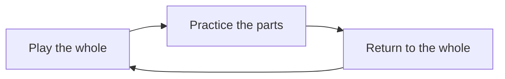
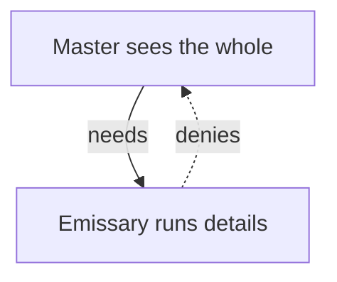

## Why this episode matters

This is the fourth most-viewed episode (10,798 views as of October 2026) and the only one in the track about the structure of the mind itself. It kills the pop myth that the left brain is logical and the right brain is creative, then replaces it with the real division: the two halves do the same things in different ways. That one correction reframes everything from how you practice a skill to how you read other people to why the modern world feels the way it does. No other episode in the track explains why a confident mind can be completely wrong about what escapes it.

## The myth and the real question

### Left versus right, the YouTube version

Type "left brain versus right brain" into YouTube and you fall into a vortex of wild claims: creative people are right-brained, analytical people are left-brained. For decades, pop psychology carved the brain into two neat categories, logical versus creative, analytical versus emotional. The idea became so oversimplified and so pervasive that serious scientists abandoned the entire field. One psychiatrist who decided to study the divided brain anyway was warned by his colleagues: "Do not touch it. It is toxic. Do not even go there." He went anyway. That psychiatrist is Iain McGilchrist, and his book The Master and His Emissary sat on host Shankar Vedantam's radar for years.

What McGilchrist found was nothing like the YouTube version. The two halves of your brain do not do different things. They do the same things, but in different ways. That distinction has enormous consequences for how we learn, how we judge right from wrong, and how we see reality itself.

### Why two halves at all

The question is older than pop psychology. If the brain were simply a processing machine, why split it in half? The division is ancient. It shows up in mammals, reptiles, fish, insects, and even nematode worms with just 302 neurons have brains that work asymmetrically. One of the oldest creatures to have a neural network, a tiny organism called Nematostella vectensis, lived about 600 million years ago. Its neural network was asymmetrical. Whatever this division does, evolution bet on it long before dinosaurs walked the earth.

### The bird

McGilchrist's entry point is a little bird trying to pick up a seed on the ground. All living creatures need to attend to the world in two different ways at the same time, and that is impossible unless the two ways can work relatively independently. On the one hand, to pick up the seed or a twig for the nest, the bird needs very precise, targeted attention on a detail, to get ahead of the competition. But a bird that only does that becomes somebody else's lunch while getting its own. It needs, at the same time, the precise opposite kind of attention: not piecemeal and fragmented, but sustained, broad, and vigilant for predators and other members of its species.

Two kinds of attention. One narrow and focused. One wide and watchful. Both running at the same time. If you have only the narrow view, you eat the seed but get eaten by the predator. If you have only the wide view, you see danger coming but you starve. The brain needs to hold both views of reality at the same time.

Figure 1. The bird's two attentions. AI Podcast Curriculum, ep02 (Iain McGilchrist, 2026-06-03). Shell 2. Count or score the toy. Source: original toy, from episode claims.

| Attention | Job | Alone, you... |
|---|---|---|
| Narrow, focused | Pick up the seed | Eat, but get eaten |
| Wide, watchful | Spot the predator | See danger, but starve |

One claim per plate. Each attention type fails on its own. The brain runs both at once.

## How, not what

### The machine mistake

McGilchrist says the field went wrong by asking the machine question: this part of the machine does this, that part does that. If you ask the human question instead, not just what does it do, but how does it do it, the picture changes. Both hemispheres are involved in doing everything. But quite consistently, each hemisphere does all these things in a totally different way, with a different spirit, toward a different end. The right hemisphere takes in the whole picture. The left zeros in on details. Both are essential. The way they work together is more fascinating than either one alone.

### The music practice loop

McGilchrist gives an analogy. Imagine you love a piece of music. You play it as a whole and feel it. Then you realize some bits are wrong. You practice the fingering at bar 18. You analyze: here we move into the subdominant, here back to the dominant. You need the analysis. But when you come to play the piece, you must put all that out of your mind, or you cannot play at all. The right hemisphere takes in the whole at the start. The left hemisphere unpacks it and enriches it. Then that work must be taken back into the whole picture, which only the right hemisphere can do. The whole first, then the parts, then back to the whole.

Figure 5. The whole-part-whole practice loop. AI Podcast Curriculum, ep02 (Iain McGilchrist, 2026-06-03). Shell 3. Apply the one rule. Source: original toy, from episode claims.

One claim per plate. The loop runs whole, parts, whole. Skip the last step and you stay in parts forever.

### The corpus callosum is a gatekeeper

For this collaboration to work, the hemispheres need to both connect and stay separate. The bundle of nerve fibers linking them, the corpus callosum, has long been described as a bridge passing information freely. McGilchrist says it is more like a gatekeeper. His analogy: a surgeon collaborating with a scrub nurse. They do not both try to do the same job. They have distinct roles. The corpus callosum enables both separation, mainly separation, and connection. Without that boundary, the two views of reality would blur into one, and the advantage of two perspectives would be lost.

## Three tests: language, humor, morals

### Tone versus words

In 1997, PBS aired a documentary about a patient named Joe with severe epilepsy. His doctors split his corpus callosum, literally dividing his brain in two. The surgery stopped the seizures and gave researchers a rare window into each hemisphere alone. The differences run deeper than attention. Take language. Both hemispheres process it. The right hemisphere tracks tone, implication, and what is not being said. The left hemisphere focuses on the literal words. McGilchrist demonstrates: he can say "Yes" and intone it a dozen different ways with quite different meanings. If he says "It's a bit hot in here," your right hemisphere knows he means "Could we open the door?" Your left hemisphere wonders why he offers unnecessary meteorological information. The right hemisphere understands context. The left is the weather report.

### Humor needs the right

Humor requires holding multiple meanings at once and grasping what is not said. People with right-hemisphere damage can find it difficult to understand why something is funny. Language, humor, and moral reasoning are three things that make us most human, and the left hemisphere struggles with all of them.

### The moral experiment

McGilchrist describes a vivid experiment. Two scenarios. First: a woman has coffee with her friend. She puts what she thinks is sugar in her friend's cup, but it is actually poison. The friend dies. Second: a woman has coffee with someone she hates. She puts what she thinks is poison in the coffee. It is actually sugar. The other person lives. Which is morally worse? Most of us say the second without hesitation. Intent is what matters. She tried to kill someone.

Then researchers temporarily disabled part of the right hemisphere, the right temporal parietal junction, with a painless procedure, and asked people to solve moral problems. They gave bizarre, entirely utilitarian answers. To the left hemisphere alone, what matters is that in one case someone is dead on the floor. It is the worst outcome. It justifies the harsher punishment. The fact that it was unintentional requires seeing the bigger picture.

Figure 2. The moral experiment, rTPJ intact versus disabled. AI Podcast Curriculum, ep02 (Iain McGilchrist, 2026-06-03). Shell 3. Apply the one rule. Source: episode claims.

| Scenario | rTPJ intact (both hemispheres) | rTPJ disabled (left alone) |
|---|---|---|
| Accidental poisoning, friend dies | Less bad: no intent | Worse: someone is dead |
| Attempted poisoning, victim lives | Worse: intent to kill | Less bad: nobody died |

One claim per plate. The rule: disabling the right hemisphere's junction flips moral judgment from intent to outcome. The left hemisphere, working alone, cannot see intent.

### The elevator

McGilchrist stages a dialogue. Someone steps on your toe in a crowded elevator. Your left hemisphere says: "This person stepped on my toe. I need justice, maybe vengeance." Your right hemisphere says: "Hang on. The elevator is crowded. She was not looking. It was an accident. Chill out." The left wants a verdict. The right supplies the context that makes the verdict unnecessary.

## The hemisphere that denies

### Two strokes, two awarenesses

The left hemisphere cannot see the big picture. Worse, because it believes that what it can see is all there is to see, it does not know that a big picture exists outside its view. McGilchrist shows this with strokes. If a stroke hits the left hemisphere, the right stays functional. The person knows something is wrong. They are aware of their deficits. But when the stroke hits the right hemisphere, something disturbing happens. The person can have no idea that anything changed.

### The mother's arm

McGilchrist describes an exchange between a doctor and a patient with right-hemisphere damage. Her arm was paralyzed, but she was not aware of it, because her left hemisphere believed that what it could see was all there was to see. The doctor asks whose arm this is. She answers: her mother's, not hers. How did it get here? She does not know. She found it in her bed. How long has it been there? Since the first day. Feel, it is warmer than hers. Her own arm, attached to her body, and her left hemisphere working alone produced a self-contained story: her arm was fine, but her mother's defective arm happened to be in her bed. These are not people with psychosis. They are simply incapable of understanding that something wrong involves them. Move the arm for them and ask if it moved, and they say yes. Show it to them and ask whose it is, and it belongs to the doctor, or the patient in the next bed, or her mother.

Figure 3. Denial after stroke. AI Podcast Curriculum, ep02 (Iain McGilchrist, 2026-06-03). Shell 3. Apply the one rule. Source: episode claims.

| Stroke side | Remaining hemisphere | Awareness of deficit |
|---|---|---|
| Left stroke | Right works | Aware: "something is wrong" |
| Right stroke | Left works alone | Unaware: denies the paralyzed arm |

One claim per plate. The rule: only the right hemisphere can report on what both hemispheres do. The left, alone, invents a story and believes it.

### Confabulation

The left hemisphere does not just see a narrow view. When evidence contradicts its view, it confabulates. It invents a story that fits what it already believes. The mother's arm is confabulation in its purest form. The right hemisphere, meanwhile, can see what both hemispheres do. It recognizes the value of the left. It understands its own limitations.

### Bach and the gaps

McGilchrist offers an analogy. A conventional scientific approach to music drills down: after years of expensive electron microscopy, music is made up of notes. A note is a simple tone. What does it mean? Nothing. Take an A flat, a B: nothing. Put 35,000 of these together and you have the B minor mass. Where does the meaning come from? It cannot come from the notes, because they mean nothing. It must be the gaps between the notes, the gaps that make melody and harmony. But the gaps are silence. They do not mean anything either. So lots of things that mean nothing, plus lots of gaps that mean nothing, produce something that means everything. The left hemisphere hears the individual notes and notices the gaps. The right hemisphere hears Bach, and feels the glory in a piece written more than 200 years ago.

## The master and the emissary

### The parable

McGilchrist does not call the left hemisphere unimportant. You could not raise a spoon to your mouth without it. He says the hemispheres need each other, and the problem comes when one forgets the other exists. His book's title comes from a parable, which he attributes to Nietzsche. A wise spiritual master rules over the land. He cannot be everywhere at once, so he appoints an emissary, a bright messenger to carry his instructions to the far corners of the kingdom. The emissary was bright enough, but not quite bright enough to know what it was he did not know. He thought he knew everything. He thought: what does the master know, sitting back there seraphically smiling, while I do all the hard work? So he adopted the master's cloak, pretended to be the master, and because he did not know what he did not know, the community fell apart.

The master is the right hemisphere. It sees the whole picture, understands context, holds the meaning. The emissary is the left hemisphere. It handles the details, executes the tasks, breaks problems into pieces. The emissary is essential. Without it, nothing gets done. But the emissary cannot see what the master sees. And because it does not see the big picture, it assumes there is no big picture to see.

Figure 4. Master and emissary. AI Podcast Curriculum, ep02 (Iain McGilchrist, 2026-06-03). Shell 4. Show the new symbol. Source: original toy, from episode claims.

One claim per plate. The asymmetry is the point: the master knows it needs the emissary. The emissary does not know it needs the master. That one symbol, the master sees the emissary's value but the emissary is blind to the master, is reused later in this chapter wherever a confident system denies what it cannot see.

### The left-hemisphere world

McGilchrist argues this parable describes modern Western society. He says we have built a world that listens almost exclusively to the left hemisphere and dismisses what the right has to offer. Vedantam asked him what a world with only a left hemisphere would look like. McGilchrist's answer: we would lose the big picture. There would be an emphasis on details, predictability, organizability, anonymity, categorization, and loss of the unique. An ability to break things into parts but not see the whole. A need for total control, because the left hemisphere is somewhat paranoid: it cannot understand the situation, so it needs to control it. Anger would become the keynote of public discourse. Everything would become black and white. The left hemisphere needs to be decisive. It likes black and white. It does not like shades of meaning. We would lose the capacity to see grades of difference. We would misunderstand everything implicit and metaphorical, and have to make rules about how to achieve it. Vedantam asks: does any of that sound familiar? Extremism instead of judgment. Life divorced from the natural world. Rules for everything.

McGilchrist names what he observes: an overemphasis on predetermined systems of algorithms, social alienation, life divorced from the natural world, which he calls a very new phenomenon, and the insistence on extreme positions. Meaning, he says, comes from living in a consistent culture with connection to one's past, to the people who made you who you are, to the society you belong to, to the natural world, and to things beyond our ken, the transcendental. These are things the right hemisphere is far better equipped to understand, and their loss in modern life, he says, is grievous.

### Balance, not anti-science

McGilchrist is careful: this is not an argument against science or reason. He loves science. He depends on it. The argument is about balance. He closed the conversation with a line sometimes misattributed to Albert Einstein: the rational mind is a faithful servant, the intuitive mind is a precious gift. We live in a society that honors the servant but forgot the gift. The story of the divided brain is not about one half being good and the other bad. We need the emissary: its precision, its focus, its ability to break things into parts. But the master, the part of us that sees the whole picture and understands context and meaning, was pushed aside. And most of us do not even realize it is gone. Because when the left hemisphere loses something, it does not mourn the loss. It denies there was ever anything there to lose.

## Memory aids

Mnemonic: **HOW**: the real division is **H**ow not what. Both hemispheres handle the **W**hole job. They differ in the way. The **O**ne that cannot see its limit is the left.

Never-confuse pairs:
- Pop myth says left = logic, right = creativity. The episode says both hemispheres do everything. They differ in how: right = whole and context, left = parts and execution.
- The corpus callosum is not a bridge. A bridge passes information freely. The episode says it is a gatekeeper that enables separation, mainly separation, plus connection.
- Confabulation is not lying. Lying knows the truth and hides it. Confabulation invents a story and believes it, because the left hemisphere cannot see that the picture lies outside its view.

Trap cards:
- Trap: "I am a left-brain person." Reality: both hemispheres are involved in everything you do. The question is whether your whole-part-whole loop runs or sticks at parts.
- Trap: "The details are the whole story." Reality: the left hemisphere believes what it can see is all there is to see. Ask the right-hemisphere question: what is the context, the tone, the intent?
- Trap: "More analysis will fix this." Reality: analysis is the emissary's job. If the problem is meaning or context, more emissary work cannot help. Hand it back to the master: play the piece as a whole.
- Trap: "My confidence proves I am right." Reality: confidence is the left hemisphere's native state when it cannot see the right's picture. The mother's-arm patient was perfectly confident.

## Q&A

**1. Explain the divided brain to me like I am new.**
Forget left = logic and right = creativity. That is the pop version, and scientists consider it toxic. The real version: both halves of your brain do the same jobs, but they do them in different ways. The right hemisphere takes in the whole picture, the context, the meaning, the tone of voice. The left hemisphere zooms into details, breaks things into pieces, and executes. You need both. A bird needs narrow attention to grab the seed and wide attention to spot the hawk, at the same time. Your brain holds both views at once. Follow-up: what goes wrong when the detail side takes over completely? You get a world of black-and-white rules, total control, and no sense of meaning, which is McGilchrist's description of modern society.

**2. Walk me through the moral experiment. What exactly did disabling the right TPJ change?**
Two coffee scenarios. In one, a woman puts what she thinks is sugar in her friend's cup. It is poison. The friend dies. In the other, a woman puts what she thinks is poison in the coffee of someone she hates. It is sugar. The person lives. With the right temporal parietal junction working, people say the second is morally worse: she tried to kill someone, and intent is what matters. When researchers temporarily disabled the right TPJ with a painless procedure, people gave utilitarian answers: the first scenario is worse because someone is dead on the floor. The mechanism: judging intent requires seeing the bigger picture (what she believed, what she meant). The left hemisphere alone can only count outcomes. Follow-up: how does this map to the elevator toe-stepping? Same split. The left wants justice for the stepped-on toe. The right supplies the accident context, and the need for justice dissolves.

**3. What is confabulation, and why is the mother's-arm story the perfect example?**
Confabulation is the left hemisphere inventing a story that fits what it already believes when evidence contradicts its view. The patient had right-hemisphere damage, so her left hemisphere worked alone. Her arm was paralyzed. Asked whose arm it was, she said it was her mother's, found in her bed, warmer than hers. She was not lying and not psychotic. The left hemisphere could not see the big picture (my arm is attached to my body and not moving), and because it believes what it sees is all there is to see, it built a self-contained story: my arm is fine. This is my mother's defective arm. Follow-up: where do you see confabulation outside hospitals? Any confident explanation that ignores inconvenient evidence and patches the hole with an invented detail. The mechanism is identical. Only the stakes differ.

**4. Explain the master and the emissary. Why does the asymmetry matter?**
The parable, from Nietzsche via McGilchrist: a wise master rules a land, appoints a bright emissary to carry instructions. The emissary is bright enough to do the work but not bright enough to know what he does not know. He adopts the master's cloak. The community falls apart. The master is the right hemisphere: sees the whole, holds meaning, understands context. The emissary is the left: details, execution, breaking things into parts. The asymmetry: the master knows it needs the emissary. The emissary does not know it needs the master. That is why the takeover is silent. When the emissary runs the show, it denies there was ever a master. Follow-up: how does this explain the Einstein quote? The rational mind is the faithful servant (emissary), the intuitive mind the precious gift (master). A society that honors the servant and forgets the gift is the emissary wearing the master's cloak.

**5. Applied: you debug a production outage and the team is deep in logs. What does this episode prescribe?**
The team is stuck in emissary mode: parts, details, log lines. The episode prescribes the whole-part-whole loop. Right hemisphere first: what is the whole system doing, what changed at the highest level, what does the failure look like from the user's seat? Then left hemisphere: zoom into the suspect component, trace the exact sequence. Then, critically, hand it back to the whole: does the fix make sense in the full picture, or did the detail work produce a patch that breaks something else? Follow-up: what is the failure mode of skipping the return to the whole? You fix the log line and miss the system. The left hemisphere, alone, is confident the patch is complete.

**6. Applied: you are in a heated argument with a friend. Use the episode's machinery.**
Your left hemisphere prosecutes: she said the words, the words were wrong, case closed. The episode says that is the weather-report view. The right hemisphere asks: what was the tone, what was the implication, what was not said, what is the context of the last month? Humor and implication live on the right. If you cannot hear them, you will fight about the literal words while missing the actual message. The practical move: before answering, state the context you think she meant, and check. You are manually doing what the right hemisphere does automatically. Follow-up: why does this feel slower? Because it is. The emissary is fast and decisive. The master is slow and contextual. Speed is the emissary's home turf. Meaning is the master's.

**7. What would a left-hemisphere-only world look like, concretely?**
McGilchrist's list: black-and-white thinking, predictability and organizability prized, anonymity, categorization, loss of the unique, things broken into parts with no sense of the whole, need for total control driven by a kind of paranoia, anger as the keynote of public discourse, extremism instead of careful judgment, life divorced from the natural world, rules for everything. Vedantam's test: look around and check how many of these you can spot. Follow-up: is McGilchrist against science? No. He loves and depends on science. His claim is about balance: the hemispheres need each other, and the danger is one forgetting the other exists.

**8. The Bach analogy: what does it prove about reductionism?**
Science drilled into music and found notes: 35,000 of them in the B minor mass, each meaning nothing, separated by gaps that also mean nothing. Reductionism concludes that meaning must come from somewhere in the parts. The episode says meaning is what the right hemisphere hears when it takes the whole: the glory in a piece written 200 years ago. The proof: no arrangement of meaningless parts explains the experience of the whole, yet the whole is real. Follow-up: how does this connect to the music-practice loop? Practice is analysis (left), but performance requires putting the analysis out of mind (right). If you play while analyzing bar 18, you cannot play. The parts must be reabsorbed into the whole.

## Chapter plate

| Without the rule | The stored object | With the rule | Tradeoff in one line |
|---|---|---|---|
| Pop myth: left = logic, right = creativity, analysis alone decides, confidence equals correctness | The hemispheres differ in how, not what, the left denies what it cannot see | Run whole → parts → whole, check tone, context, and intent before verdicts, distrust confidence that cannot name the big picture | The emissary is fast and precise but blind, the master is slow and sees, use each for its own job |

## How to imbibe this

Concrete practices, this week.

1. The whole-part-whole loop. Pick one problem you are stuck on. Write the whole in one sentence (the system, the goal, the context). Then list the parts. Then write, in one sentence, how the parts change the whole. Observable change: you catch at least one fix that was correct in the parts and wrong in the whole.
2. Tone check. In your next three conversations, note the tone separately from the words. Write one line: what the words said, what the tone said. Observable change: you start hearing the right hemisphere's channel as data, not noise.
3. Intent audit. The next time you judge someone's action, write the outcome-based verdict and the intent-based verdict separately. Ask which one the evidence supports. Observable change: fewer verdicts you regret after learning the context.
4. Catch confabulation. Once this week, notice yourself inventing a story to patch a gap in evidence. Write the gap and the invented patch. Observable change: you start seeing the mother's-arm mechanism in miniature.
5. The 10-minute whole. Before any deep analysis session, spend 10 minutes with the whole: the doc, the system diagram, the user's actual screen. No notes, no breakdown. Then analyze. Observable change: your analysis has fewer false starts.
6. Play the piece. Take one skill you analyzed to death (a presentation, a workout, a negotiation). Do one rep with the analysis deliberately set aside. Observable change: you feel the difference between executing parts and performing the whole.
7. Spot the emissary world. Once a day, name one thing in your environment that is black-and-white, rule-bound, or control-driven where nuance would serve better. Write it down. Observable change: you start seeing McGilchrist's list in the wild instead of in theory.

## Think it yourself

Do these with your own brain before touching AI. Guided, with answer sketches.

**Drill 1: the bird test.** You debug a slow database query. Name the narrow attention (the seed) and the wide attention (the predator) for this task. What does each one miss if it runs alone? Answer sketch: narrow = the query plan, the index, the exact slow line. Wide = the traffic pattern, the deploy that changed it, the downstream effect. Narrow alone fixes the line and misses the deploy. Wide alone sees the deploy and cannot fix the line.

**Drill 2: tone versus words.** Write three sentences where the words say one thing and the tone says the opposite. For each, state what the left hemisphere hears and what the right hemisphere hears. Answer sketch: "Fine." with a flat tone. "Great job." with sarcasm. "It's a bit hot in here" meaning open the door. The left logs the words. The right decodes the request.

**Drill 3: the moral flip.** Invent your own pair of scenarios like the coffee experiment, one accidental harm and one attempted harm that fails. Predict the rTPJ-intact verdict and the rTPJ-disabled verdict. Answer sketch: intact judges the attempt worse (intent matters). Disabled judges the accident worse (outcome is all the left can count). The drill trains you to separate intent from outcome in your own judgments.

**Drill 4: confidence audit.** Write down three things you are highly confident about. For each, ask: what would the right hemisphere see that escapes me? Name the unseen picture explicitly. Answer sketch: this is the anti-confabulation drill. The left hemisphere is confident by default. The discipline is to name the unseen, like the patient naming whose arm it really was.

**Drill 5: the practice loop.** Take a skill you practice. Design one rep that follows whole → parts → whole: perform the whole, isolate one part, then perform the whole again with the analysis set aside. Run it today. Answer sketch: the key constraint is the last step. Most people skip it and stay in parts forever. The episode says the return to the whole is the only part the right hemisphere can do.

**Drill 6: the emissary takeover.** Look at your team's last month. Find one decision that was all emissary: metrics, categories, rules, control, no discussion of meaning or context. Write what the master would ask. Answer sketch: the master's questions are about the whole, the users, the purpose, the unspoken. The drill is to supply them before the next decision, not after.

## Skills you can now use

- Run the whole-part-whole loop on any hard problem instead of diving into parts.
- Separate tone from words in any conversation and check the implied meaning.
- Separate intent from outcome before judging anyone's action.
- Distrust confidence that cannot name the big picture that might escape it.
- Spot confabulation: the invented patch over a gap in evidence, in yourself first.
- Prescribe the right hemisphere's job (context, meaning, the whole) instead of more analysis when analysis is stuck.
- Name the emissary takeover in an organization: rules, categories, and control where nuance would serve better.
- Perform instead of analyzing: put the breakdown aside and execute the whole.

## Go deeper

- The episode itself: https://www.youtube.com/watch?v=Exq_aynYzrM
- Brain lateralization, the science the episode corrects: https://en.wikipedia.org/wiki/Lateralization_of_brain_function (HTTP 200, verified 2026-10-06)
- Iain McGilchrist's background: https://en.wikipedia.org/wiki/Iain_McGilchrist (HTTP 200, verified 2026-10-06)

## Figure audit

| Unit id | Claim | Before | After | Figure id | Medium | Source | Four tests |
|---|---|---|---|---|---|---|---|
| u01 | Two attentions, both required | Narrow alone: eat, get eaten | Both run: eat and survive | fig1 | table | episode claims | T1: 2-row comparison / T2: comparison forces table / T3: none, static / T4: narrow/wide chips reused in drills |
| u02 | rTPJ disable flips moral judgment | Intent-based verdict | Outcome-based verdict | fig2 | table | episode claims | T1: 2x2 comparison / T2: comparison forces table / T3: none, static / T4: the intent/outcome chips reused in drills |
| u03 | Stroke side determines awareness | Left stroke: aware | Right stroke: denies | fig3 | table | episode claims | T1: 2-row comparison / T2: comparison forces table / T3: none, static / T4: denial chip reused in Q&A |
| u04 | Master/emissary asymmetry | Emissary executes | Emissary denies the master | fig4 | mermaid | episode claims | T1: 2-node asymmetric graph / T2: relationship forces mermaid / T3: none, static / T4: master/emissary symbols reused within the chapter (Q&A 4-6, drills 5-6) |
| u05 | Music practice loop | Whole, then parts | Parts returned to the whole | fig5 | mermaid | episode claims | T1: three-step loop / T2: order forces mermaid / T3: none, static / T4: the loop reused in Q&A 5, imbibe 1, drill 5 |
| u06 | Tone versus words ("It is a bit hot in here") | Words heard literally | Tone heard as a request | none | none | episode claims | No figure: the prose already states the two-channel contrast. A table restates it |
| u07 | Corpus callosum as gatekeeper | Assumed a free bridge | Separation first, then connection | none | none | episode claims | No figure: analogy with no state change. Prose carries it |
| u08 | Bach: 35,000 notes, meaning in the gaps | Notes mean nothing | The whole means everything | none | none | episode claims | No figure: analogy. The number sets the scene, the claim is not a count |
