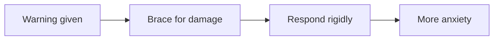

## Why this episode matters

This is the fifth most-viewed episode (9,221 views as of October 2026), and it is the only one in the track about what happens to you after the worst day of your life. It carries the single most counterintuitive number in the whole track: at most about 10 percent of people suffer chronically after a major loss. The rest do not follow the script your culture handed you. No other episode dismantles a belief this widely held with data this replicated. Read it before you need it, because in the middle of distress, the episode shows, you cannot imagine ever feeling different.

## The question nobody asks out loud

### The expected script

Imagine getting a phone call in the middle of the night. Someone you love died. What do you expect to feel? Most of us have an answer ready: devastation, tears, weeks or months of deep unrelenting grief. We expect the world to stop, for everything to shatter. The episode asks: what if the most common response to loss is not that at all? What if for most people the world keeps turning, and they turn with it?

### George's silence

At Columbia University, psychologist George Bonanno spent his career studying how people respond to terrible life events. His interest did not begin in a lab. He grew up in a Sicilian immigrant neighborhood in Chicago. His father was hard-working but prone to violent rages. "My father would beat us at times," he says in the episode. "The beatings were not as bad as the anger that he exhibited." When George was 17, he decided to leave home. His father said, in his words, that if George left then, he should not come crawling back. George drifted through his early 20s, sometimes sleeping outside. At 23, living in Colorado, his brother called: their father died.

George braced for devastation. It never came. What he experienced was, in his words, "essentially silence." He felt grateful his father's pain was over, and confused. He was supposed to feel a certain way, and he did not. People moved cautiously around him, as if he would splinter into tiny shards if they said the wrong thing. Years later, as a researcher, he kept meeting people who did not follow the expected script.

### Julia

One was a student he calls Julia. She was home from college, preparing dinner with her mother, when the phone rang. Her father rode his bike home from work, a car hit him, and he landed in the ICU. Julia and her mother drove to the hospital. He died just as they arrived. After the shock, Julia returned to school and threw herself into her work. Friends asked if she wanted to talk about her father's death. She said she did not. She wanted to be with her friends and live her life, not dwell on the past. Her mother worried that Julia forgot her father, that she acted as if life returned to normal. The mother called it denial of grief and suggested Julia see a grief counselor. Consider that: Julia's mother did not send her to therapy because grief had left her unstable. She sent her because her daughter was not grieving enough.

### Jed

Then there was Jed, an aspiring musician working at an upscale restaurant in West Greenwich Village. One freezing December night, he stepped into an intersection. A garbage truck made an illegal right turn, clipped him, and pulled him under. It ran over his left leg and hip. He was conscious through the entire thing. The cold slowed his bleeding enough to save his life. He spent six weeks in a medically induced coma, underwent roughly 20 surgeries, and lost his entire left leg and part of his hip. He braced for the psychological aftermath. For about a week, vivid memories of the accident played on a loop. Then they more or less just stopped. Jed was confused, not by the suffering, but by its absence. His question, in his own words: why did he feel okay? Years later he became a university professor, and the question stayed with him.

Three people, three very different tragedies, one haunting question: what is wrong with me? Why am I not suffering more? The episode asks whether these people are outliers, or whether the rule itself is wrong.

## The numbers

### Your prediction

Before the data, the episode runs an exercise. When a person goes through a serious loss, what percentage develop chronic, long-lasting psychological damage? What if it is not a personal tragedy but a monumental, catastrophic, national one? 30 percent? 50 percent? 80 percent? Hold your number. Mental health experts went through this same exercise shortly after the 9/11 attacks.

### 9/11

The general consensus was that 9/11 would be a mental health crisis of unprecedented proportions. Experts argued there were not enough resources for the problems coming. FEMA, the Federal Emergency Management Agency, allocated about 130 million dollars for emergency funds in New York, mostly for free therapy. Early surveys seemed to confirm the worst. Nearly 8 percent of Manhattan residents met the criteria for post-traumatic stress disorder. For those near the World Trade Center, 20 percent. For those directly affected, possibly 30 percent or higher. But as time went on, the numbers dropped precipitously. By six months, they were more or less back to normal, quite low for the city as a whole.

Figure 1. 9/11 PTSD rates over time. AI Podcast Curriculum, ep03 (George Bonanno, 2026-05-01). Shell 3. Apply the one rule. Source: episode claims.

| Group | Early surveys | At 6 months (city-wide reading) |
|---|---|---|
| Manhattan residents | ~8 percent | Back to near normal |
| Near the World Trade Center | ~20 percent | Back to near normal |
| Directly affected | ~30 percent or higher | Back to near normal |

One claim per plate. The rule: time, not treatment, moved the numbers. The predicted permanent crisis never arrived.

### COVID

The same pattern repeated with COVID. Experts predicted a mental health catastrophe of unprecedented scale. People thought suicides would skyrocket during the pandemic. In fact, suicides stayed the same or declined globally.

### The four trajectories

In a landmark 2018 study published in Clinical Psychology Review, researchers analyzed decades of data on how people respond to adversity. They found four distinct trajectories:

1. Chronic suffering. People who cannot move past the loss. This is real, painful, and deserves serious attention and care. It characterizes at most about 10 percent of people.
2. Recovery. People who struggle significantly at first, then gradually get better over a year or two.
3. Delayed response. People who barely get by, then slowly worsen.
4. The resilience trajectory. Short-term distress and upheaval, then the person continues to function normally. Bonanno says that when he began his career, it was assumed hardly anybody would show this pattern, and if they did, something was wrong with them. That was the denial idea. When researchers actually looked, they found the majority, almost always the majority, showing it.

Figure 2. The four trajectories. AI Podcast Curriculum, ep03 (George Bonanno, 2026-05-01). Shell 2. Count or score the toy. Source: episode claims.

| Trajectory | Pattern | Share |
|---|---|---|
| Resilience | Short distress, then normal function | The majority, almost always |
| Recovery | Struggle, then better over 1-2 years | A minority |
| Delayed | Cope, then slowly worsen | A minority |
| Chronic | Cannot move past the loss | At most ~10 percent |

One claim per plate. Resilience is not the exception. It is the norm. This finding replicated after mass shootings, spinal cord injuries, divorce, job loss, and financial ruin.

So go back to the number you held. If your guess was higher than 10 percent, you are not alone. Most people dramatically overestimate how fragile human beings are. As the PTSD researcher Patricia Resick put it, strong emotions do not equal psychopathology. Being upset after a terrible event is not a disorder. It is what the stress response system was designed to do. The mistake is to confuse initial distress with lasting damage. Grief is not a disorder.

## Why the wrong script survives

### The five stages were never about grief

Part of the answer is a theory you have almost certainly heard. In the late 1960s, psychiatrist Elisabeth Kübler-Ross proposed that people face death through five stages: denial, anger, bargaining, depression, and acceptance. The model was never designed to describe grief. It was about people facing their own mortality. Over the decades, professionals and the public adopted it as a map for how all of us are supposed to grieve. The problem: it is far too neat and tidy to be true, and the research has never supported it. There is no real evidence that people go through these stages, and much research contradicts it.

Worse, the theory does not merely describe reality. It prescribes it. If you have not reached depression, you must be stuck in denial. If you reach acceptance quickly without much anger, you hold something in. The idea that unprocessed grief sits inside us like a time bomb has no scientific basis. Yet it is one of the most deeply held beliefs in modern Western culture.

Figure 3. The grief script versus the evidence. AI Podcast Curriculum, ep03 (George Bonanno, 2026-05-01). Shell 3. Apply the one rule. Source: episode claims.

| The script says | The evidence says |
|---|---|
| Five stages, in order | No evidence for stages, much contradicts them |
| Fast recovery = denial | Fast recovery = the resilience trajectory, the majority |
| Unfelt grief is a time bomb | No scientific basis for the time-bomb idea |

One claim per plate. The rule: the model prescribes the feelings it claims to describe.

### The resilience blind spot

Bonanno has a concept he calls the resilience blind spot. When you are in the middle of intense distress, you cannot imagine ever feeling anything different. That initial upset blinds you to the idea that you will ever not feel that way. In a large-scale disaster there is also contagion: other people are upset, so you feel you should be upset, and you are upset, and now they are upset. It spreads fast.

### The therapist's sample

Therapists who see patients every day spend their time, by definition, with the people who struggle. They rarely see the resilient majority, the people who never walked through the door. Seeing traumatized people all day, they overgeneralize to the general population. Bonanno calls this very human, not evil or dumb. But it means the professional class that defines normal samples the 10 percent, not the majority.

Figure 4. The therapist's sample versus the population. AI Podcast Curriculum, ep03 (George Bonanno, 2026-05-01). Shell 2. Count or score the toy. Source: episode claims.

| Who | Share of people | In the therapist's office |
|---|---|---|
| Resilient majority | The majority | Rarely seen |
| Chronic trajectory | At most about 10 percent | Seen daily |

One claim per plate. The profession that defines normal meets the 10 percent, not the majority.

### The asymmetric judgment

There is an asymmetry in how we judge predictions. After a mass tragedy, if an expert warns of a mental health disaster and turns out wrong, people shrug and say her heart was in the right place. But if an expert predicts resilience, she may be seen as heartless. Bonanno experienced this for nearly 20 years. Therapists have come up to him after public lectures and said, in his recounting, "I am sure you are a good scientist, but you are just wrong about this. I know, and you are wrong." Social media adds its own pressure: trauma dumping on TikTok makes the visible sample look like the whole population.

## What the script costs

### Trigger warnings

Does any of this matter? Is it just caution to assume too much fragility? Bonanno says no. The wrong script has real costs. Consider trigger warnings, alerts designed to protect people with hidden traumas from being ambushed by difficult content. They were born of the idea that people carry hidden, unresolved traumas raw inside them. The research on trigger warnings shows fairly convincingly that they either do not help or they cause harm. People given trigger warnings are often more anxious than people who did not receive them.

The mechanism: researchers have found that the inability to flexibly adjust your emotional responses to different contexts is one of the strongest predictors of PTSD symptoms. Teaching people to brace for emotional damage before they encounter it may undermine the very flexibility they need to cope. The warning trains rigidity, and rigidity predicts the disorder.

Figure 5. How a trigger warning backfires. AI Podcast Curriculum, ep03 (George Bonanno, 2026-05-01). Shell 3. Apply the one rule. Source: original toy, from episode claims.

One claim per plate. The protection trains the rigidity it was meant to guard against.

### The eggshell cage

There is also the harm of walking on eggshells. When we assume people are fragile, we build an invisible cage around them. We stop laughing in their presence. We tiptoe. We treat them as though they might break at any moment. But Bonanno's research, conducted with the psychologist Dacher Keltner, shows a very different picture. Most people, even people who lost a spouse within the last few months, showed genuine laughter and smiling during interviews. You might see someone crying, shaking their head in upset, and 30 seconds later laughing, tears still on their face, about something they remembered. That laughter is neither denial nor heartlessness. It signals connection with the person listening and the person who was lost. Genuine laughter and smiling during grief are correlated with better long-term mental health. The human heart can hold grief and joy at the same time.

### A note on the truly suffering

To be clear: if you are debilitated by a tragedy from long ago, Bonanno is not saying it is all in your head. Far from it. There is a group of people unable to function long-term because of their traumas. They need professional help and our compassion. But believing that everyone who suffers a setback will be traumatized does a disservice to the actually traumatized. It trivializes a serious problem.

## What resilience actually looks like

### George's conversations

Years after his father's death, George became a parent. Navigating the exhausting, beautiful, terrifying work of raising children, he longed for a relationship with his father that he never had. So he created one. "I began to talk with my father," he says. When his children struggled with money or the weight of parenthood, he would tell his father about it: "Dad, I know you were very concerned about money. This is really hard." His father never answered back. George would imagine his replies. He found it comforting. What George did was deeply human: building a relationship with his father that death, paradoxically, had made possible. A relationship without the rages, without the fear, without the ultimatums.

This is what resilience looks like. Not the absence of sadness. Not the denial of loss. The ability to hold grief and growth in the same hand. To cry on a Tuesday and laugh on a Wednesday. To miss someone terribly and still build a good life.

### The descendant of survivors

At the start, the episode asked you to imagine the midnight phone call. You probably imagined devastation. You might be devastated for a while. You might cry or feel the world has lost its color. Those feelings are real and part of being alive. But the science says you are almost certainly more resilient than you think. The human mind, shaped by millions of years of evolution, is extraordinarily well equipped to absorb shock, process grief, and find its way back to a life worth living. Your very existence is a testament. You are the descendant of a long line of survivors. Your ability to get back up after being knocked down is woven into your DNA. The danger is not that terrible things will happen. They inevitably will. The danger is the script you carry that tells you that you are supposed to be destroyed by tragedy. The trauma script tells you that you are easily broken. The science says you are not.

## Memory aids

Mnemonic: **HOLD**: the resilience picture. **H**old grief and joy at once. **O**nly about 10 percent stay chronic. **L**aughter during grief predicts better health. **D**istress is not damage.

Never-confuse pairs:
- Resilience is not denial. Denial hides from the loss. Resilience feels the loss, functions through it, and keeps living. Julia was not denying. She was resilient, and her mother mislabeled it.
- Grief is not a disorder. Grief is the stress response working as designed. A disorder is the chronic trajectory, at most 10 percent.
- The five stages were not a grief theory. Kübler-Ross wrote about people facing their own death. The grief application was an adoption the research never supported.

Trap cards:
- Trap: "She recovered fast, so she must be in denial." Reality: fast recovery is the majority pattern. The denial label is the script talking, not the evidence.
- Trap: "I should brace myself for permanent damage." Reality: the resilience blind spot makes distress feel permanent. It is not. Bracing with trigger warnings increases anxiety and reduces the flexibility you need.
- Trap: "The therapist sees this every day, so it must be the norm." Reality: the therapist samples the 10 percent who walk in. The majority never walks in.
- Trap: "A warning label will protect the fragile." Reality: trigger warnings do not help or cause harm. Protection that trains rigidity backfires.

## Q&A

**1. Explain the resilience trajectory to me like I am new.**
When something terrible happens, most people feel awful for a while, and then they go back to their lives. That is the resilience trajectory. It is not coldness and not denial. Julia lost her father suddenly and went back to school and her friends. Jed lost his leg and part of his hip and asked why he felt okay. George felt silence after his father's death. All three wondered what was wrong with them. Nothing was. They were the majority. About 10 percent of people, at most, get stuck in chronic suffering, and that group is real and needs care. But the normal human response to tragedy is: distress, then recovery, then life. Follow-up: why does this feel wrong to believe? Because the resilience blind spot makes your current pain feel permanent, and because everyone around you follows the fragility script.

**2. Walk me through the 9/11 numbers. What exactly did they show?**
Experts predicted a mental health crisis of unprecedented proportions. FEMA put about 130 million dollars into free therapy for New Yorkers. Early surveys found roughly 8 percent of Manhattan residents met PTSD criteria, 20 percent near the World Trade Center, and possibly 30 percent or more among the directly affected. Those numbers looked like confirmation. Then they fell, fast. By six months, they were more or less back to normal for the city as a whole. The mechanism: the early spike measured initial distress, which is the stress response working. The six-month reading measured lasting damage, which is what the predictions were really about. They confused the two. Follow-up: how did COVID repeat the pattern? Predicted suicide catastrophe. Suicides stayed flat or declined globally. Same confusion, same correction.

**3. What is wrong with the five stages of grief?**
Three things. First, it was never a grief theory. Kübler-Ross studied people facing their own death in the late 1960s, not the bereaved. Second, the research never supported it as a grief map. It is too neat and tidy to be true, and much evidence contradicts it. Third, it prescribes instead of describing. Once the stages are the official map, any deviation looks like pathology: fast recovery becomes denial, quick acceptance becomes bottling things up. The model creates the symptoms it claims to track. Follow-up: what replaced it? The four trajectories from the 2018 Clinical Psychology Review analysis: resilience (majority), recovery, delayed, chronic (at most 10 percent).

**4. Why do therapists overestimate fragility?**
Sampling. A therapist's entire workday is spent with people who struggle. The resilient majority never makes an appointment, so the therapist never meets them. From that sample, the struggling look like the population. Bonanno calls it very human. It is the same availability error everyone makes, but it matters more here because therapists and researchers are the people who write the official story about human nature. Follow-up: what is the parallel in your own life? Anywhere you sample only the failures: customer support sees only broken products, incident reviews see only outages. The fix is the same: ask what the denominator is.

**5. What did the trigger warning research find, and why?**
Trigger warnings were designed to protect people with hidden raw traumas from being ambushed by difficult content. The research shows fairly convincingly that they either do not help or they cause harm: warned people are often more anxious than unwarned people. The mechanism runs through emotional flexibility. The inability to flexibly adjust emotional responses to context is one of the strongest predictors of PTSD symptoms. A warning trains you to brace, and bracing is rigidity. The protection undermines the exact capacity it was meant to guard. Follow-up: does this mean all warnings are bad? The episode's claim is about trigger warnings specifically, tested in research. It does not generalize to every kind of content notice. Keep the claim inside its evidence.

**6. Applied: a close friend just lost a parent and seems fine two weeks later. Her family thinks she is in denial. What does the episode say to do?**
Do not pathologize her. Fast return to function is the resilience trajectory, the majority pattern. The denial label is Julia's mother's mistake: she sent a resilient daughter to a grief counselor for not grieving enough. Do not build the eggshell cage either: do not stop laughing around her, do not tiptoe. Bonanno and Keltner's research shows genuine laughter during grief correlates with better long-term mental health. Be normal with her. Let her grieve in her own pattern, and only worry if she is in the chronic trajectory: unable to function over the long term, in which case she needs professional help, not amateur diagnosis. Follow-up: what if you are the one who seems fine? Same answer. You are not broken for being okay. The silence George felt was a natural process, not a symptom.

**7. Applied: you lead a team that just went through layoffs. The company wants mandatory grief counseling for everyone. What is the evidence-based move?**
Do not mandate therapy for the whole population. Most people will follow the resilience trajectory without intervention, and the 9/11 FEMA experience shows mass therapy spending does not match the actual need curve. Make professional help easily available for the minority who need it, and do not stigmatize the majority who recover on their own. Watch for the chronic trajectory over months, not days. And do not import the fragility script into your messaging: telling people they are traumatized can become the prescription that the five-stages model demonstrates. Follow-up: what about the delayed trajectory? Some people barely cope and then worsen. That is why help stays available over time rather than being a one-week program.

**8. What is the resilience blind spot, and how do you catch it in yourself?**
It is Bonanno's term for the fact that in the middle of intense distress, you cannot imagine ever feeling different. The current pain fills the whole horizon. You catch it by knowing it exists before you need it, which is why this episode says to read it before you need it. The check: ask whether your prediction about your future feelings is data or just the current feeling projected forward. Add the contagion check: am I upset because of the event, or because everyone around me is upset and I feel I should be? Follow-up: does knowing about the blind spot remove it? No. It gives you a label for the moment, which is often enough to stop the label "permanent" from sticking to a temporary state.

## Chapter plate

| Without the rule | The stored object | With the rule | Tradeoff in one line |
|---|---|---|---|
| Fragility script: five stages, denial labels, trigger warnings, eggshell cages | Four trajectories, resilience is the majority, chronic is at most ~10 percent | Expect recovery, offer help without mandating it, laugh normally, watch for the true chronic minority | Believing everyone is fragile feels safe but trivializes the truly suffering and trains rigidity in everyone else |

## How to imbibe this

Concrete practices, this week.

1. Retire the denial label. The next time someone recovers fast from a setback, do not call it denial, bottling up, or avoidance. Say: that looks like the resilience trajectory. Observable change: you stop pathologizing normal recovery in yourself and others.
2. Run the 10-percent test. When you hear a prediction of mass psychological damage (after news, after a company event), ask: what is the actual base rate? The episode's answer is at most 10 percent chronic. Observable change: your fear calibrates to the data instead of the headlines.
3. Dismantle one eggshell cage. Think of someone you tiptoe around. Have one normal interaction: laugh, talk about ordinary things. Observable change: the relationship breathes again, and you see that normalcy is not cruelty.
4. Audit your warnings. Notice where you brace yourself or others before difficult content. Ask whether the warning reduces harm or just increases anxiety. Observable change: fewer pre-emptive braces, more trust in flexibility.
5. Learn the four trajectories by heart. Resilience, recovery, delayed, chronic. The next time you face a setback, name which one you are in. Observable change: distress stops feeling like a permanent identity.
6. Hold two feelings. This week, notice one moment where you feel grief and joy, or stress and gratitude, within the same hour. Write both down. Observable change: you stop treating mixed feelings as a malfunction.
7. Check the denominator. Pick one belief you hold about "most people" that comes from a skewed sample (support tickets, news, therapy anecdotes). Ask who never appears in that sample. Observable change: one overgeneralization corrected.

## Think it yourself

Do these with your own brain before touching AI. Semi-guided: fewer answer sketches than the first chapters.

**Drill 1: your number.** Write the percentage you predicted for chronic damage before reading the data. Now write the episode's number (at most 10 percent). Compute the gap. Write two sentences on what filled that gap: which inputs (news, movies, the five stages, therapist anecdotes) built your number?

**Drill 2: the Julia test.** Describe a time you or someone you know recovered "too fast" from something and got judged for it. Apply the four trajectories. Which one fits best? What would you say now to the person who applied the denial label?

**Drill 3: the FEMA arithmetic.** FEMA allocated about 130 million dollars for free therapy after 9/11 based on early surveys showing up to 30 percent PTSD among the directly affected. By six months, rates were near normal. Write the argument for and against that spending in three sentences each. What decision rule would you use next time: spend on early surveys, or wait for the six-month reading?

**Drill 4: the flexibility check.** The episode says rigid emotional responses predict PTSD symptoms. List three situations this week where you braced emotionally in advance. For each, describe what a flexible response could look like instead.

**Drill 5: contagion audit.** Think of the last piece of bad news that upset you. Separate your direct reaction from the reactions of people around you. How much of your upset was yours, and how much was contagion? Write the split as a rough percentage and one sentence of evidence.

**Drill 6: the descendant proof.** The episode closes with the claim that you are the descendant of a long line of survivors and that resilience is woven into your DNA. Steelman this: what is the strongest version of the argument? Then steelman the objection: what would a skeptic say? Decide which is stronger, in two sentences.

## Skills you can now use

- Name the four trajectories and place any setback on the map instead of catastrophizing it.
- Retire the denial label for fast recovery. Call it the resilience trajectory.
- Calibrate damage predictions to the 10-percent base rate instead of headlines.
- Refuse the fragility script's prescriptions: no mandatory therapy, no eggshell cages, no time-bomb theory.
- Use trigger warnings only where evidence supports them, not as a reflex.
- Distinguish initial distress (normal, designed) from lasting damage (rare, needs care).
- Spot sampling bias in any professional story about "most people."
- Catch the resilience blind spot: label current pain as current, not permanent.

## Go deeper

- The episode itself: https://www.youtube.com/watch?v=DZj73Fu939s
- George Bonanno's research background: https://en.wikipedia.org/wiki/George_Bonanno (HTTP 200, verified 2026-10-06)
- Psychological resilience, the wider literature: https://en.wikipedia.org/wiki/Psychological_resilience (HTTP 200, verified 2026-10-06)

## Figure audit

| Unit id | Claim | Before | After | Figure id | Medium | Source | Four tests |
|---|---|---|---|---|---|---|---|
| u01 | 9/11 PTSD decayed to normal | Early: 8/20/30 percent | 6 months: near normal (city-wide) | fig1 | table | episode claims | T1: 3-row decay / T2: comparison forces table / T3: none, static / T4: the decay shape reused in COVID parallel |
| u02 | Four trajectories, resilience is the norm | Expected: most break | Found: majority resilient, chronic ≤10% | fig2 | table | episode claims | T1: 4-row count / T2: comparison forces table / T3: none, static / T4: trajectory names reused in drills |
| u03 | Five-stages script vs evidence | Script prescribes stages | Evidence: no stages, resilience is normal | fig3 | table | episode claims | T1: 3-row claim vs evidence / T2: comparison forces table / T3: none, static / T4: script/evidence chips reused in Q&A |
| u04 | Therapist samples the struggling minority | Population: majority resilient | Office: the chronic 10 percent | fig4 | table | episode claims | T1: population vs sample / T2: comparison forces table / T3: none, static / T4: reused in Q&A 4 |
| u05 | Trigger warning trains rigidity | Warning before content | Brace, rigid response, more anxiety | fig5 | mermaid | episode claims | T1: four-step causal chain / T2: causal flow forces mermaid / T3: none, static / T4: reused in the warning trap card |
| u06 | COVID: predicted suicide catastrophe | Predicted skyrocketing suicides | Suicides flat or declined | none | none | episode claims | No figure: single binary contrast fully stated in prose. Parallels fig1 without adding structure |
| u07 | Laughter during grief predicts better health | Assumed fragility, eggshell cage | Genuine laughter, better outcomes | none | none | episode claims | No figure: the episode gives no numbers. Prose carries the correlation |
| u08 | George, Julia, Jed: resilience stories | Expected devastation | Silence, return to life, "why am I okay" | none | none | episode claims | No figure: narratives, not counts. Fig2 maps them to the trajectory |
