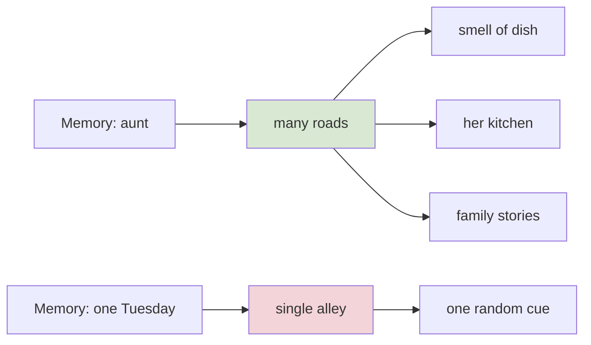
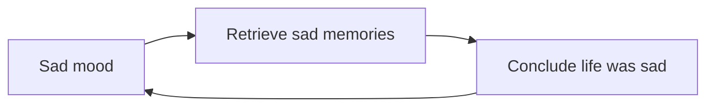

## Why this episode matters

This is the seventh most-viewed episode (8,753 views as of October 2026) and the only one in the track about memory itself. It inverts the default belief: remembering is good, forgetting is bad. Through a woman who cannot forget, it shows that perfect memory is a curse, and that forgetting is a survival tool shaped by evolution. No other episode explains why your memories are reconstructions built for your future rather than recordings of your past. If you have ever treated a forgotten name as a personal failure, this is the correction.

## The woman who cannot forget

### Jill Price

At University College Dublin, psychologist Ciara Greene studies how memories are formed. She and her colleague Jillian Murphy wrote a book on the topic. One striking story Greene told Vedantam is about a woman with an extremely rare condition: highly superior autobiographical memory, HSAM. Jill Price can recall virtually every event in her life. Ask her the weather on September 30, 1998, and most of us would say: how could I possibly know that? Someone with HSAM answers: it was really sunny, but clouds came over at about 3 p.m. We thought it would rain, but it did not. A blow-by-blow account of her own personal experience. It sounds like a superpower.

### The Muppets meltdown

Not all of Jill's memories are idyllic. Her father worked as the agent for Jim Henson, the creator of the Muppets. He once arranged for Jill's entire nursery school class to visit the studio where the puppets were made. The kids looked forward to it for weeks. On the day, Jill had tonsillitis and could not go. Her father committed to take the whole class. The studio awaited excited kids. He went ahead without her. To little Jill, this was a crushing blow. Her own daddy would leave her behind and take all her friends to see the Muppets. Despite a raging sore throat, she screamed at the top of her lungs at her parents. You probably had a meltdown like that as a kid. The difference: you do not remember yours. You do not remember how it felt. Jill does. For her, it is like it never stopped happening. Every time she sees a Muppets Christmas Carol, the overwhelming disappointment comes back, as though she is right there in the moment.

### Jim

The story turns darker. Jill fell deeply in love with a man named Jim. They married. After only two years of marriage, Jim suffered a stroke. He was 42 and he died. Jill describes, in exhaustive detail, her father coming home to tell her Jim collapsed at work, the drive to the hospital, every phone call she made to the nurse, the days in critical care, and the doctors telling her they had to turn off life support. No normal person forgets that a beloved spouse died. But for most people, the details blur with time. Not for Jill. Years later, she cannot drive down the road they took to the hospital, because every vivid detail of that drive comes back, and it does not fade.

So the episode asks: do you still want a perfect memory? To recall everything that happened to you, every single day? Forgetting starts to look like a superpower.

Figure 1. Jill Price versus a typical memory. AI Podcast Curriculum, ep05 (Ciara Greene, 2026-05-25). Shell 2. Count or score the toy. Source: episode claims.

| Event | Typical memory | Jill Price (HSAM) |
|---|---|---|
| Weather, Sept 30 1998 | Gone | Sunny, clouds at 3 p.m., no rain |
| Childhood meltdown | Gone: you cannot feel it | Vivid: every Muppets sighting replays it |
| Husband's death drive | Blurred details | Every detail, unfaded, years later |

One claim per plate. Perfect recall preserves the pain perfectly too. Forgetting is what lets the rest of us heal.

### Time heals because time forgets

Vedantam offers his own contrast. At 11 or 12, running in a dark unpaved parking lot, he tripped over uneven ground and landed hard on his ring finger. It was incredibly painful. He remembers crying. Today he cannot actually feel the pain anymore. He is not even sure whether it was the right hand or the left. When we say time heals our wounds, what we really mean is that time helps us forget. Not for someone like Jill.

## How memory actually works

### Not a filing cabinet

Most of us make a huge mistake about memory. We picture a filing cabinet: pull open a drawer, drop in a folder, retrieve it whenever we want. Or a photograph dropped onto a hard disk inside our heads. That is not how memory works. Memory is an active process. Our memories are not recollections as much as they are reconstructions. When we remember, we play an active role in what we remember. We are not pulling a folder from a drawer. Our moods, situations, and contexts shape what we recall.

### The breakfast arithmetic

Consider what you had for breakfast today. The computer metaphor says you should have a perfect recollection of every day: how you poured the cornflakes, how you poured the milk, how many bites you ate, how many times you chewed each bite. What a waste. All you need is the condensed version: usually, I eat cornflakes for breakfast. Remembering every repetitive event in perfect individual detail is an inefficient way to store information. So the mind throws away most of the details and retains only the gist. You know you eat breakfast, you like cereal, you do not like eggs. What you ate on March 18, 2024 is completely unimportant. That is why you remember driving to a friend's house but not every traffic light or every turn. The brain retains the gist and discards the rest.

Greene's correction: it is a mistake to think remembering is good and forgetting is bad. Forgetting is a fundamental component of memory. It is part of how memory works, not an accident that happens to it.

### The city grid

Why are some things easier to remember than others? Because there are multiple pathways in the brain leading to a memory. Think of a city grid. Some places have lots of roads and highways connected to them. Others are out of the way, with only a single alley leading up. The well-connected places are easier to reach. Memory works the same way. Memories form as synapses connect neurons. Some networks have dense connections: many roads, many routes to that memory. Others are sparse, with few connections, so they are harder to access.

This is why seemingly random experiences trigger memories. Greene associates the smell of a certain dish with an aunt who cooked it when she was a kid. The smell is a road to the aunt. Sometimes you walk down a street and a small thing, a smell or a sight, triggers a memory you have not thought of for years. That memory was stored with few connections, and you accidentally found yourself on the road to it.

Figure 2. The city-grid model of memory access. AI Podcast Curriculum, ep05 (Ciara Greene, 2026-05-25). Shell 2. Count or score the toy. Source: original toy, from episode claims.

One claim per plate. Dense connections mean easy recall. Sparse connections mean the memory waits for one accidental cue. The number of roads, not the importance of the event, decides access.

### Emotion cements

Emotions help cement memories, which is why we remember emotional things. Greene tells her own story. Years ago, riding her bike through Dublin on a rainy November night, on a busy road with buses and cars and no bicycle lane, she rode a little fast because she was late. She skidded in front of a bus, which fortunately did not hit her. It was an e-bike, heavy, with a thick down tube. As she fell, her leg caught in the down tube and snapped her leg in half, like a small bunch of twigs snapping with shards. The ambulance took nearly an hour, snarled in traffic. She lay in excruciating pain, the kind she had never imagined, screaming involuntarily. On the hospital's 1-to-10 pain scale, her previous 10 was now a 6.

Seven months later she got back on her bike. Her heart raced the whole time. She had a death grip on the handlebars and could not release her hands enough to turn right, which in Ireland means crossing over the road. She did it to prove she could, but it was so anxiety-provoking she understood something: cycling requires an illusion of invulnerability, and hers was shattered. She knew how vulnerable she was. There was no pretending it was safe. Her brain did its job: remember what happened last time, remember the pain, do not let it happen again.

## Memory is for helpfulness, not truth

### The grades study

As we move through life, our memories try to provide information that is helpful. Note the word. Not truthful. Helpful. Researchers ran a study on school memories. They had access to volunteers' actual grades. People remembered tests where they got an A accurately 89 percent of the time. Tests where they got a D: only 29 percent. The volunteers knew the researchers had the real grades, so they were not trying to fool anyone. Their memories genuinely reshaped: weakened on failure, strengthened on success. Your brain is not lying to you. It edits for you, keeping a version of the past that helps you move forward.

Figure 3. Grade recall accuracy. AI Podcast Curriculum, ep05 (Ciara Greene, 2026-05-25). Shell 2. Count or score the toy. Source: episode claims.

| Grade | Recall accuracy |
|---|---|
| A grades | 89 percent |
| D grades | 29 percent |

One claim per plate. The same brain, the same past, a three-to-one bias toward remembering success. The edit is genuine: the volunteers could not do better.

### The Chris study

It goes further. Researchers gave volunteers a description of a person, a mix of positive and negative traits: kind, but sometimes a bit dishonest. A mixed bag, like all of us. Half the volunteers were told the description was about them, as others described them. The other half were told it was about someone named Chris. The Chris group recalled both the positive and the negative details. The self group recalled mainly the positive details and were much less likely to recall the negative ones. About Chris, people remembered everything, good and bad. About themselves, the unflattering parts were quietly forgotten. Their brains edited the portrait to be a little more generous, a little more forgiving.

### Why memory exists

The episode is careful: this is not an endorsement of lying to yourself. It is the question of what memory is for. You have eyes to see and taste buds to taste. Why do you have memory? Memory evolved. Everything we evolved survived because it offered some benefit for survival or reproduction. The errors are shaped by that history. The capacity to forget is not evidence of a faulty brain. It is a survival tool. Remembering your virtues and forgetting your flaws, remembering successes and forgetting failures: these nudge you toward happiness. Happier people live longer and are healthier. These are not just feel-good claims. They have survival benefits.

### The depressed are more accurate

Here is the striking corollary. People with depression often paint a more accurate picture of their lives. They do not just remember the A's. They remember the D's. Their memories are more truthful, but they might not be as helpful. Accuracy and usefulness are different goals, and evolution picked usefulness.

## The mood loop

### Mood-congruent recall

Greene adds one more mechanism. We tend to remember things similar to our present emotional state. Feeling happy, you retrieve happy events more easily. Feeling sad or depressed, you retrieve sad ones. That skews your perspective: the glass looks half empty instead of half full. Then a second bias compounds it. Retrieve six memories and four are sad, and you conclude you must have had a sad life. That may be true. But it can also be that the bias led you to retrieve the sad ones in the first place, and then led you to over-interpret their frequency as representative of your whole life. A vicious cycle: sad mood retrieves sad memories, sad memories confirm the sad story, the sad story deepens the mood.

Figure 4. The mood-memory loop. AI Podcast Curriculum, ep05 (Ciara Greene, 2026-05-25). Shell 3. Apply the one rule. Source: original toy, from episode claims.

One claim per plate. The rule: retrieval is mood-filtered, and the conclusion feeds the mood. The loop needs no new bad events to keep running.

### Meng Po

In Chinese mythology, Meng Po is the goddess of oblivion. She brews a soup of five ingredients that erases all your memories of your life, so your soul can be reincarnated without carrying the burden of a previous life. It is mythology. But science now confirms: sometimes the kindest thing a mind can do is forget.

### The dementia caveat

The episode adds one boundary. Not all forgetfulness is normal. People can and do develop dementia. If you fear your memory fails, talk to a doctor. The claim is narrower: the general view that remembering is always good and forgetting always bad is simply wrong.

## Memory aids

Mnemonic: **GIST**: how memory works. **G**ist kept, details discarded. **I**nactive until cued (city grid). **S**haped by mood and context (reconstruction). **T**uned for helpfulness, not truth.

Never-confuse pairs:
- Reconstruction is not a recording. A recording plays back the same every time. A reconstruction rebuilds from gist plus current mood and context, so it changes.
- Forgetting is not failure. Failure loses what you need. Forgetting discards what you do not need so the gist stays usable. Jill Price shows what failure of forgetting looks like.
- Editing is not lying. Lying knows the truth and hides it. Editing genuinely reshapes the memory: the 89/29 volunteers could not recall the D's even knowing the researchers had the grades.

Trap cards:
- Trap: "I forgot the name, so my memory fails me." Reality: the name had one alley and no traffic. Forgetting it is the system working. Worry only about patterns, and see a doctor for those.
- Trap: "My memory of that event is accurate because it feels vivid." Reality: vividness is emotion's cement, not truth's certificate. Jill's most vivid memories are the most painful, not the most accurate.
- Trap: "I remember my past clearly, so my self-image is objective." Reality: the Chris study shows your brain edits your portrait to be generous. Everyone is the hero of a slightly airbrushed past.
- Trap: "If I feel my life was mostly sad, it was." Reality: check the retrieval filter first. Four sad memories out of six retrieved proves the filter, not the life.

## Q&A

**1. Explain to me like I am new: why does forgetting help?**
Meet Jill Price. She remembers everything: the weather on a random day in 1998, a childhood tantrum in perfect detail, every moment of driving her dying husband to the hospital, unfaded years later. It sounds like a superpower. It is a curse. Every painful memory stays as fresh as the day it happened. For the rest of us, forgetting is what lets pain fade, lets the gist survive without the noise, and lets us function. Your brain throws away the details of breakfast, the traffic lights on the drive, the D grades, because keeping them would bury the useful parts. Forgetting is not the failure of memory. It is a core feature of it. Follow-up: then why do we feel bad about forgetting? Because the filing-cabinet metaphor tells us memory should be perfect storage. The metaphor is wrong, so the shame is misplaced.

**2. Walk me through the reconstruction model. What exactly happens when I remember?**
The old model: memory is a filing cabinet or a photograph on a hard disk. You store it once, retrieve it unchanged. The episode's model: memory is reconstruction. When you remember, you rebuild the event from the gist plus your current mood, situation, and context. That is why the same event feels different to recall on a happy day versus a sad day. The city-grid version: a memory is a network of synaptic connections. Dense networks (many roads) are easy to reach. Sparse networks (one alley) wait for a lucky cue, like a smell triggering a childhood memory. Retrieval is not playback. It is reassembly, and the assembler is your present self. Follow-up: what does this imply for eyewitness testimony? That confident, vivid recall is not a certificate of accuracy. Emotion cements, and cement preserves feeling, not facts.

**3. Explain the 89 versus 29 result. What does it prove?**
Researchers had volunteers' real school grades. Asked to recall A-grade tests and D-grade tests, people got the A's right 89 percent of the time and the D's only 29 percent. The volunteers knew the researchers held the real records, so this was not deliberate deception. Their memories had genuinely reshaped: success strengthened, failure weakened. It proves the edit is real and unconscious, and it proves the direction: the brain keeps the version of the past that helps you move forward. Your brain is not lying to you. It edits for you. Follow-up: connect this to the Chris study. Same editor, different target. The Chris study shows the edit applies to your self-portrait (positive kept, negative dropped) but not to your portrait of a stranger. The editor serves the self.

**4. What is mood-congruent recall, and how does it become a trap?**
You retrieve memories that match your current mood. Happy now, happy memories surface. Sad now, sad ones do. The trap is the second step: you then treat the retrieved sample as representative. Six memories surface, four are sad, so you conclude your life was sad. But the mood filtered the retrieval, and then you over-interpreted the filtered sample. The loop runs without any new bad events: sad mood, sad retrieval, sad conclusion, sadder mood. Follow-up: how do you break it? Name the filter. When the sad story assembles itself, ask: is this my life, or my mood's search results? The question does not erase the sadness, but it stops the conclusion from calcifying.

**5. Why do depressed people remember more accurately, and why is that not better?**
Because the self-serving editor is offline or weakened. They remember the D's alongside the A's. Their picture is more truthful. It is not better because memory's job, per the episode, is helpfulness, not truthfulness. The edited version nudges you toward happiness, and happier people live longer and stay healthier. Those are survival benefits, which is what evolution selects for. Accuracy is a different goal, and the brain did not evolve to maximize it. Follow-up: does this mean ignorance is bliss? No. It means the brain's default edit has a function. You can still seek truth deliberately. You just should not mistake the unedited feed for the healthy one.

**6. Applied: you keep replaying an embarrassing mistake from last month. Use the episode.**
First, recognize the mechanism: emotion cemented it. The embarrassment built dense roads to that memory, so it surfaces easily. Second, know that replaying rebuilds it each time (reconstruction), and each rebuild re-cements it. Third, use the gist rule: extract the lesson in one sentence, and let the sensory detail fade on purpose. Do not rehearse the scene. Rehearse the sentence. The sentence is the gist your future self needs. The blush is not. Follow-up: what would Jill Price tell you? That you do not want the alternative. Perfect retention of every embarrassment is not a gift. Let the fade happen.

**7. Applied: you prepare for a job interview and only remember your failures. What goes wrong, and what do you do?**
Mood-congruent recall plus the availability of cemented failures. Anxiety retrieves anxious memories, and the failures were emotional enough to cement. The retrieved sample is not your record. It is your mood's search results. The fix from the episode: deliberately retrieve counter-evidence. Write down three wins with the same specificity as the failures. You are manually adding roads to the sparse network. Also check the 89/29 baseline: a healthy brain already biases toward success recall, so if yours is not, the mood filter runs hot. Name it before the interview, not during. Follow-up: is this "positive thinking"? No. It corrects a sampling bias with actual data from your own history.

**8. The episode says memory evolved for survival. Steelman the skeptic's reply.**
Skeptic: if memory is for survival, why does it fail so often at the exact moments survival needs it: the witness who misremembers, the student who blanks on the exam, the name that vanishes when you need it? The episode's answer has two parts. First, the failures are the price of the gist system: a system optimized for cheap, fast, useful recall will drop details, and sometimes it drops the wrong ones. Second, the errors are shaped by the same history: the self-serving edit and the mood filter exist because they kept our ancestors moving forward, not because they keep records straight. The skeptic's real point stands as a boundary: memory is a survival tool, not a truth machine, and you should not treat it as one. Follow-up: when should you distrust your memory most? When it is vivid (emotion's cement), when it flatters you (the editor at work), and when you are in a strong mood (the filter is on).

## Chapter plate

| Without the rule | The stored object | With the rule | Tradeoff in one line |
|---|---|---|---|
| Filing-cabinet model: memory should be perfect storage, forgetting is failure | Reconstruction: gist kept, details discarded, recall rebuilt from mood and context, edited for helpfulness | Extract the gist, let detail fade, distrust vivid/flattering/mood-filtered recall, add roads to memories you want kept | You trade perfect records for a usable past, Jill Price shows the price of winning that trade the other way |

## How to imbibe this

Concrete practices, this week.

1. The gist extraction. After any meeting or event, write the gist in one sentence before you write anything else. Let the details go unless the sentence needs them. Observable change: notes get shorter and more useful.
2. Name the editor. Once this week, catch your brain airbrushing your past (a success remembered, a failure softened). Write what the unedited version probably was. Observable change: your self-portrait gets one shade more honest.
3. Break one replay loop. Pick a memory you replay. Write the one-sentence lesson. Every time the scene starts replaying, substitute the sentence. Observable change: the scene loses vividness within days.
4. Add a road. There is something you want to remember (a person's name, a key fact). Connect it to three existing memories deliberately. Observable change: recall gets easier because the grid got denser.
5. Check the mood filter. The next time your life story assembles itself as mostly good or mostly bad, ask: what is my mood right now? Write the mood and the story side by side. Observable change: you stop mistaking the filter for the facts.
6. Forgive one forgetting. The next time you forget a name or a detail, say: "That is the gist system working." Do not apologize to yourself. Observable change: less shame, which the episode says is misplaced anyway.
7. The Jill test. When you wish you remembered something perfectly, ask: would I want Jill Price's version, where the painful parts never fade? Observable change: the wish weakens, and you accept the trade.

## Think it yourself

Do these with your own brain before touching AI. Semi-guided.

**Drill 1: your gist ratio.** Write what you had for dinner each of the last 7 days, in detail. Score yourself. Now write the gist version in one line. Which version would your future self actually need? What does the gap tell you about what your brain is right to discard?

**Drill 2: the 89/29 audit.** List 5 successes and 5 failures from the last two years. Time how long each list takes to produce. If the successes come faster, you watch the editor at work. Write one paragraph on whether the editor helps or hurts you right now.

**Drill 3: build a road.** Pick one fact you keep forgetting. Attach it to three existing memories (a place, a person, a story). Test recall tomorrow. Did the city grid work? Write what made the attachment stick or fail.

**Drill 4: the Chris test on yourself.** Write a mixed description of yourself: three positive traits, three negative. Wait a day. Try to recall all six without looking. Which ones survived? Compare with the episode's prediction.

**Drill 5: mood versus life.** The next time you are in a strong mood, write 6 memories that surface. Label each positive or negative. Compute the ratio. Then ask: is this my life, or my mood's search results? Write the answer in two sentences.

**Drill 6: argue both sides.** Side A: a perfect memory would make you wiser, because wisdom needs accurate data about the past. Side B: a perfect memory would make you miserable, because Jill Price shows that pain needs fading. Three sentences each, using only episode evidence. Verdict in one sentence.

## Skills you can now use

- Extract the gist of any experience in one sentence and let the detail fade on purpose.
- Diagnose a replay loop: emotion cemented it, reconstruction rebuilds it, the sentence replaces it.
- Add roads to memories you want: attach new facts to dense existing networks.
- Check the mood filter before trusting your life story on any given day.
- Distrust vivid, flattering, or mood-congruent recall. Verify against records.
- Forgive forgetting as the system working, and escalate only real patterns to a doctor.
- Run the Jill test on any wish for perfect memory.
- Separate memory's two jobs: helpfulness (the brain's) from truthfulness (yours to verify).

## Go deeper

- The episode itself: https://www.youtube.com/watch?v=A8uokmk_MvE
- Ciara Greene's book with Jillian Murphy on memory: title not stated in the episode [uncertain], Greene's research area: https://en.wikipedia.org/wiki/Forgetting (HTTP 200, verified 2026-10-06)

## Figure audit

| Unit id | Claim | Before | After | Figure id | Medium | Source | Four tests |
|---|---|---|---|---|---|---|---|
| u01 | Perfect memory preserves pain perfectly | Typical: details blur, pain fades | Jill: every detail vivid, pain fresh | fig1 | table | episode claims | T1: 3-row comparison / T2: comparison forces table / T3: none, static / T4: Jill chip reused in drills |
| u02 | Recall follows connection density | Dense network: many roads | Sparse network: one alley | fig2 | mermaid | episode claims | T1: two-branch graph / T2: structure forces mermaid / T3: none, static / T4: road/alley chips reused in drills |
| u03 | Success recall beats failure recall 3 to 1 | A grades: 89% | D grades: 29% | fig3 | table | episode claims | T1: 2-row count / T2: comparison forces table / T3: none, static / T4: the 89/29 pair reused in drills |
| u04 | Mood filters retrieval, conclusion feeds mood | Sad mood | Sad memories → sad story → sadder mood | fig4 | mermaid | episode claims | T1: 3-node loop / T2: cycle forces mermaid / T3: none, static / T4: loop arrow reused in Q&A |
