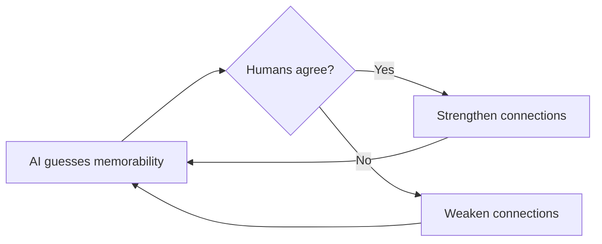

## Why this episode matters

This is the ninth most-viewed episode (6,799 views as of October 2026) and the only one in the track about why some things stick in every brain and others stick in none. It answers a question that looks like philosophy with an experiment: if beauty is subjective, why do millions agree on which paintings are masterpieces? The answer involves an AI that never learned art history and still picks the masterpieces from pixels alone. No other episode shows you the hidden code running underneath your own taste, or hands you a tool that scores your creations for memorability before you ship them.

## The masterpiece puzzle

### Two paintings

Imagine two paintings. Same year, same city, same pigments, same subject matter. One hangs in a climate-controlled vault in Paris or New York, insured for a hundred million dollars. It sits among the Picassos, the Matisses, the Georgia O'Keeffes, the Salvador Dalís. Works that seem to transcend paint on canvas and become something eternal. The other languishes in a basement in North Carolina or a thrift store bin priced at 5 dollars. Forgotten. What makes one so valuable and the other discarded? Luck? Connections? The rich patron who bought it?

Here is the strange part. We say beauty is in the eye of the beholder, that there is no accounting for taste. But if art is subjective, how do so many people agree that some paintings are masterpieces? For a painting to become famous over decades, lots and lots of people must agree it is a masterpiece. Are they sheep following one another? Or are there specific combinations of color and texture that make paintings evocative and memorable? Is there a formula for masterpieces? The episode's claim: the place to look is not in the paintings. It is inside your brain.

## The game you will lose

### Three questions

The episode starts with failure, not genius. A game. Two versions of the Monopoly Man. Which is the real mascot? If you pick the one with the monocle, you are wrong. The Monopoly Man does not have a monocle. He never had one. He has no eyewear at all. Next: C-3PO, the anxious Star Wars droid. Entirely gold, or a silver leg? If you said all gold, you are wrong again. In the episode's telling, C-3PO has always had a silver left leg. Last: Waldo, from Where's Waldo? Does he hold a cane, or are his hands empty? Most people say no cane. He does.

It is not remarkable that you made mistakes. Everyone forgets things. What matters is that many, many people make the same identical mistake. We remember a monocle that never existed. It just feels right.

### The Mandela effect

This phenomenon, where large groups collectively believe something false, has a name: the Mandela effect. Fiona Broome, a paranormal researcher, coined it when she realized she shared a false memory with many others: that Nelson Mandela died in prison in the 1980s. He did not. Mandela spent more than 25 years in a South African prison during apartheid, survived it, became president of South Africa, and lived a long life. Yet large groups remember news reports of his death and his funeral. Some people on the internet say this proves parallel universes, that we slipped from a dimension where he died into one where he lived. Wilma Bainbridge, a psychologist at the University of Chicago, had a different theory: the human mind makes predictable errors in memory.

### The visual Mandela effect

Bainbridge wondered if the same pattern held for the Monopoly Man and C-3PO. She called it the visual Mandela effect. She took 40 images into the lab: the Monopoly Man, C-3PO, Fruit of the Loom, Curious George. She altered them and showed versions to hundreds of people to test for false memories. Take the Fruit of the Loom logo. What do you see? A pile of fruit spilling from a cornucopia, a woven basket? Most people do. The real logo is just fruit. No basket, no cornucopia. There never was one.

Figure 1. The three quiz items: what you remember versus what is real. AI Podcast Curriculum, ep06 (Wilma Bainbridge, 2026-04-10). Shell 2. Count or score the toy. Source: episode claims.

| Icon | What most people remember | What is real |
|---|---|---|
| Monopoly Man | A monocle | No eyewear at all, ever |
| C-3PO | Entirely gold | A silver left leg, always |
| Waldo | Empty hands | He holds a cane |

One claim per plate. The errors are shared, specific, and confident. That is what makes them data instead of noise.

### Testing the theories

There are plausible explanations. Maybe wrong versions of these images are everywhere on the internet and we absorbed misinformation. Maybe mental associations lead us astray: a rich 1930s banker has to have a monocle, right? Bainbridge tested these theories. They were wrong. The brain simply has a propensity to remember certain images. The wrong version of the image is just more sticky. And that raised the real question: if some images are stickier than others, are some images simply easier to remember, period?

## Memorability is not personal

### The 10,000 faces

We like to think memory is personal. You remember a face because it looks like your mother. You remember a painting from your honeymoon. Bainbridge argues the evidence says some things are simply more memorable, to everyone. The obvious objection: we remember movie stars because we have all seen the same faces on screen. She controlled for that. In an earlier study she built a database of over 10,000 ordinary faces, showed them to thousands of people, and found something stunning. Some faces everyone remembered. Some faces everyone forgot. Do we remember beautiful faces? Not necessarily. Attractiveness had a weak connection to memorability. Being beautiful can even make you more likely to be confused with someone else. Do we remember faces that convey emotion? Looking irresponsible made you slightly more memorable, but it explained only a tiny fraction of the data. Instead there seemed to be an X factor: a hidden visual code that made certain images stick.

### The museum experiment

If the code exists for faces, does it exist for art? Bainbridge went to the Art Institute of Chicago, one of the largest and most prestigious museums in the world. She recruited volunteers with a simple instruction: explore the American Art Wing. Look at whatever you want. Talk to your friends. Take as long as you like. Just walk through the whole gallery. When they finished, she sat them on a bench outside and gave a surprise quiz on their phones: paintings from the exhibit mixed with similar paintings they had not seen. "Do you remember this painting?"

Think about the variables. Some people love abstract art, some love portraits. Some stared at a large painting for 10 minutes while others walked past. Their memories should differ totally. They were not. Some pieces of art everyone remembered. Some everyone forgot. That surprised the researchers, because museum visitors are motivated to remember everything, and still the split appeared.

### What predicted memorability

Bainbridge tested the candidates. Size mattered: bigger paintings were more memorable. Context mattered: paintings in the modern, spacious wing were remembered better than those in cluttered traditional rooms, possibly less competition for attention. Then the kicker. She tested beauty. She tested emotion. She tested colorfulness. None of them predicted memorability. A heartbreakingly beautiful painting could be forgotten in five minutes. A weird, jarring, abstract piece could stick. The stickiness came from some mysterious arrangement of the pieces that appealed to the brain. But what was it?

Figure 2. What predicts memorability in the museum study. AI Podcast Curriculum, ep06 (Wilma Bainbridge, 2026-04-10). Shell 2. Count or score the toy. Source: episode claims.

| Candidate | Predicted memorability? |
|---|---|
| Size (bigger) | Yes |
| Context (spacious wing) | Yes |
| Beauty | No |
| Emotion | No |
| Colorfulness | No |

One claim per plate. Everything the art world talks about failed the test. Two boring variables, size and room, passed.

## The AI that learned the code

### Training ResMem

The human brain has billions of neurons with trillions of connections. Somewhere in there is the answer. Bainbridge realized she could do nearly as well without finding it. Take pictures of ordinary people. Ask an AI to guess how memorable each face will be. It guesses randomly at first. If it guesses memorable and humans agree, tell it: good job, strengthen the connections you used. If it guesses memorable and humans disagree, tell it: wrong, weaken those connections. Repeat, over and over. Eventually the AI learns the secret patterns humans use to judge memorability. You have built an AI model for memorability. You still do not understand everything inside the human brain, and you may not understand everything inside the AI, but you can now predict how memorable a new face will be.

Bainbridge and her team built exactly this. They called it ResMem. Upload a picture and it returns a score: 1 means 100 percent of people remember it, 0 means no one does. They trained it on regular photographs: faces, scenes, everyday objects. They did not train it on art history. The AI knew nothing about Picasso. It did not know Van Gogh. It had no idea what a masterpiece is supposed to look like.

Figure 3. How ResMem learns. AI Podcast Curriculum, ep06 (Wilma Bainbridge, 2026-04-10). Shell 3. Apply the one rule. Source: original toy, from episode claims.

One claim per plate. The rule: keep the connections that match human memory, drop the ones that do not. Repeat until the machine's guesses track the brain's.

### The masterpiece test

Bainbridge put the AI to the ultimate test. She fed it the paintings from the Art Institute study and asked: is this painting memorable? Some were famous works, the ones on mugs and tote bags. Others were obscure works by the same artists or from the same era that never became famous. The result stunned the team. Asked which paintings would be more memorable, the AI tended to pick the ones humans considered masterpieces. ResMem predicted that famous pieces were more memorable than non-famous pieces.

Think about what this means. Its fame does not come only from critics' praise or crowd imitation, nor only from capturing something about the American spirit. It comes from Grant Wood arranging the visual information in a way that hacked the human brain. He created an image that was cognitively sticky. The AI, blind to culture and history, identified masterpieces by looking at the pixels. It found the visual hook that turns a painting into a memory, and a memory into fame.

### The boundary

Does this mean art is just an algorithm? That we can paint by numbers to make the next Mona Lisa? Not exactly. ResMem can tell you if an image is memorable, but it cannot tell you if it has meaning. A photo of a car crash might be highly memorable, but you would not hang it over your sofa. The research challenges the romantic idea that art is mysterious or purely subjective. It says deep, ancient currents in our brains dictate which images make a lasting impression. There is a formula for masterpieces. But memorability is one ingredient, not the whole dish.

## The canary in the coal mine

The episode closes with one profound application, beyond art. While healthy brains tend to remember similar images, people in early cognitive decline, like Alzheimer's disease, start to diverge from healthy people on which images they find memorable. Bainbridge's team published a study finding special images that are memorable to healthy people but forgettable to people in early-stage Alzheimer's. Researchers might one day use these images like canaries in a coal mine. If everyone remembers certain images but your friend forgets them, it could be a warning sign that something is wrong in her brain.

The closing lesson is practical. We often feel our memories record our lives. Bainbridge's work says what we remember and forget is shaped by our histories, preferences, and knowledge, plus a hidden code we are only beginning to understand. So the next time you create something, a painting, a photograph, even a work presentation, remember: you do not just fight for attention. You fight to be remembered in other people's brains. The fight is rigged. But now you know something about the rules.

Figure 4. ResMem's masterpiece test. AI Podcast Curriculum, ep06 (Wilma Bainbridge, 2026-04-10). Shell 3. Apply the one rule. Source: episode claims.

| Input to ResMem | Training | Result |
|---|---|---|
| Art Institute paintings | Photos only, zero art history | Famous pieces scored more memorable than obscure ones |

One claim per plate. The rule: the visual code transfers across domains. An AI that never saw a masterpiece can still spot one, because the stickiness is in the pixels, not the prestige.

## Memory aids

Mnemonic: **STICK**: the memorability lessons. **S**hared errors are data (Mandela). **T**he code is visual, not cultural. **I**rrelevant: beauty, emotion, color. **C**ontext and size matter. **K**eep meaning separate from memorability.

Never-confuse pairs:
- Memorability is not beauty. Beauty failed to predict it. A jarring abstract piece can out-stick a beautiful one.
- The Mandela effect is not proof of alternate realities. The internet's theory is parallel universes. Bainbridge's theory is predictable memory errors, tested against misinformation and association theories, which lost.
- ResMem does not understand art. It scores pixel patterns against learned human responses. It knows nothing about Picasso and still picks the masterpieces, which is exactly the point.

Trap cards:
- Trap: "People remember it because it is famous." Reality: ResMem never learned fame and still picked the famous ones. The causation may run the other way: it is famous because it is memorable.
- Trap: "Make it more beautiful and they will remember it." Reality: beauty did not predict memorability in the museum. Make it stickier, not prettier. Size and distinctiveness beat prettiness.
- Trap: "My taste is personal." Reality: thousands of strangers remembered and forgot the same faces and the same paintings. Your taste runs on shared hardware.
- Trap: "Memorable means good." Reality: the car crash photo. Memorability is morally neutral. Meaning is a separate ingredient.

## Q&A

**1. Explain the visual Mandela effect to me like I am new.**
Lots of people share the exact same false memory about an image. The Monopoly Man never had a monocle, but millions remember one. C-3PO has a silver leg that most fans never noticed. Waldo holds a cane that most searchers never saw. The Fruit of the Loom logo never had a cornucopia, but most minds add one. These are not individual mistakes. They are the same mistake, made confidently, by crowds. Wilma Bainbridge tested the easy explanations (internet misinformation, mental associations like banker-equals-monocle) and they failed. Her conclusion: the brain has a propensity to remember certain images, and the wrong version is simply stickier than the real one. Follow-up: why does this matter beyond trivia? Because it proves memory errors are systematic, not random. Systematic errors have rules, and rules can be learned, which is what ResMem did.

**2. Walk me through the museum experiment. What was controlled and what was found?**
Bainbridge recruited volunteers at the Art Institute of Chicago's American Art Wing. The instruction was free exploration: look at whatever you want, talk to friends, take as long as you like, cover the whole gallery. Then a surprise phone quiz: seen paintings mixed with unseen similar ones. "Do you remember this painting?" The design let every personal variable run wild: taste, time spent, attention, companions. Despite that, the results were consistent across people: some paintings everyone remembered, some everyone forgot. Then she tested predictors. Size: yes, bigger stuck better. Context: yes, the spacious modern wing beat cluttered rooms. Beauty, emotion, colorfulness: no, none predicted. The finding: memorability is a property of the image plus its presentation, shared across brains, not a property of the viewer's taste. Follow-up: why did the spacious wing win? The episode suggests less competition for attention. Fewer neighbors means the brain files the painting cleanly.

**3. How does ResMem learn, step by step?**
Step one: show the AI a face and ask it to guess memorability. It guesses randomly. Step two: compare with human data. If the AI said memorable and humans agree, strengthen the connections it used. If it said memorable and humans disagree, weaken them. Step three: repeat over thousands of faces, scenes, and everyday objects. Over time the AI's guesses converge on human judgments. The key constraint: the training set contained no art and no art history. The model learned the human visual code from ordinary photos. That is what makes the masterpiece test meaningful: when it later picks famous paintings as more memorable, it reads pixels, not prestige. Follow-up: does anyone understand what the AI learned? Not fully. The episode is honest: we may not understand everything inside the AI, just as we do not understand everything inside the brain. The predictions work anyway.

**4. What does the American Gothic result prove, and what does it not prove?**
It proves that a model blind to culture, history, and criticism can separate famous paintings from obscure ones by pixel patterns alone. Grant Wood's arrangement of visual information is cognitively sticky in a way the model can detect. That supports the episode's big claim: masterpieces are famous partly because they hack shared brain hardware, not only because critics and crowds followed each other. What it does not prove: that memorability equals artistic value. The car-crash photo is the counterexample. Memorability is one ingredient. Meaning, cultural resonance, and craft are others that ResMem does not measure. Follow-up: could a forger game this? In principle, optimizing for the sticky code might produce memorable images. But memorable is not meaningful, and the market for masterpieces buys meaning too.

**5. Why did beauty fail as a predictor?**
Because the brain's stickiness code is not the same as its pleasure code. In the 10,000-face study, attractiveness had only a weak connection to memorability, and beauty could even cause confusion with someone else: beautiful faces resemble each other, so they blur together. In the museum, a heartbreakingly beautiful painting could vanish from memory in five minutes while a jarring abstract piece stuck. The mechanism the episode implies: memorability needs distinctiveness, a hook the visual system can file, and beauty is often smooth and generic where the hook needs to be specific. Follow-up: what does this mean for a designer? Stop optimizing the slide for beauty. Optimize for the one distinctive arrangement the brain will file.

**6. Applied: you give a work presentation next week. Use the episode.**
You do not fight for attention. You fight to be remembered in other people's brains, and the fight is rigged by their hardware. Apply the findings: make the key slide big (size mattered), give it space (context mattered: the spacious wing beat the cluttered room, so one idea per slide), and do not rely on beauty or emotion to carry it (both failed as predictors). Add one distinctive visual hook, the equivalent of the silver leg: the specific, slightly odd detail the brain files. Then test it: show the slide to a colleague for ten seconds, take it away, and ask what they remember. That is your personal ResMem. Follow-up: what if the content is dull but important? The episode's answer is unsentimental: boring and important still needs the hook. The brain does not file by importance.

**7. Applied: you want your product's icon or landing page to be unforgettable. What is the episode's playbook, and what is its warning?**
Playbook: distinctiveness over beauty. Test variants the way Bainbridge tested faces: show them briefly to strangers, then quiz recall. Keep the variant that sticks, not the one the team finds prettiest. Give the key element size and breathing room. Warning: memorable is not meaningful. A shocking or garish design may score high on recall and low on trust. ResMem cannot tell you if the image has meaning, and neither can a recall quiz. You need both tests: the stickiness test and the meaning test. Follow-up: how does this connect to the Mandela effect? Your users will misremember your icon in predictable ways. Find out which wrong version is stickiest and design so the real version wins.

**8. Explain the Alzheimer's application. How would it work?**
Healthy brains tend to find the same images memorable. In early cognitive decline, people's memorability judgments start to diverge from the healthy pattern. Bainbridge's team found special images that healthy people remember but early-stage Alzheimer's patients forget. The application: use these images like canaries in a coal mine. Show the set, test recall, and watch for the divergence pattern as an early warning sign. It is a flag that something may be wrong and worth checking, not a diagnosis. Follow-up: why is this better than asking "do you forget things?" Everyone forgets things. The image set gives a calibrated baseline: not whether you forget, but whether you forget the specific things healthy brains keep.

## Chapter plate

| Without the rule | The stored object | With the rule | Tradeoff in one line |
|---|---|---|---|
| Taste is personal and mysterious, fame is luck plus critics, beauty is the goal | A shared visual code: size and context predict recall, beauty, emotion, and color do not, ResMem learns the code from photos and spots masterpieces from pixels | Design for the hook, not the pretty, test recall like Bainbridge, keep meaning as a separate test | Memorability is morally and artistically neutral, it gets you remembered, not loved, so pair the sticky with the meaningful |

## How to imbibe this

Concrete practices, this week.

1. Run the 10-second test. Show one slide, photo, or design to a friend for 10 seconds. Take it away. Ask what they remember. Write down what stuck and what vanished. Observable change: you learn what your creations actually file as, not what you hoped.
2. Quiz yourself on the three icons. Write what you remember about the Monopoly Man, C-3PO, and Waldo before checking the answers. Observable change: you feel the visual Mandela effect from the inside, which makes the lesson permanent.
3. Audit one beautiful thing. Find something you made that is beautiful but forgettable. Name the missing hook. Add one distinctive, slightly odd detail. Observable change: one creation gets stickier without getting louder.
4. Declutter one slide. Take your most crowded slide and give the key idea the whole space, the spacious-wing treatment. Observable change: the audience remembers one thing instead of zero.
5. Separate the two tests. For your next creation, run a stickiness test (do they remember it?) and a meaning test (does it matter to them?) separately. Observable change: you stop assuming one implies the other.
6. Notice shared taste. This week, note three things that "everyone" likes or remembers. Ask: is this personal taste, or shared hardware? Observable change: you start seeing the code underneath culture.
7. Check the canary logic. Think of one early-warning signal in your own work: a metric that healthy projects pass and struggling ones fail before the failure is obvious. Write it down. Observable change: you borrow the episode's diagnostic shape for your own domain.

## Think it yourself

Do these with your own brain before touching AI. Less guided now: work them, then check your reasoning against the episode.

**Drill 1: the wrong-version audit.** List 5 famous logos or characters. For each, write the detail you are least sure about. Check the real versions. How many did the sticky wrong version win? What pattern do the wrong versions share?

**Drill 2: design the hook.** Take the most forgettable slide in your last deck. Redesign it for memorability using only the episode's findings: bigger key element, more space, one distinctive hook, no reliance on beauty. Describe the before and after in three sentences each.

**Drill 3: the fame direction.** The episode suggests fame may follow memorability, not cause it. Pick a famous work you know. Argue the conventional direction (famous, therefore remembered) in three sentences. Then argue the episode's direction (memorable, therefore famous) in three sentences. Which has better evidence?

**Drill 4: the ResMem boundary.** ResMem scores memorability, not meaning. Design a test for meaning that ResMem cannot run. What would you measure, and how? Where would a high-memorability, low-meaning image fail your test?

**Drill 5: the museum in your field.** Bainbridge found shared memorability despite wildly different viewers. Where in your work do people insist "it is all personal taste"? Design the experiment that would test whether shared hardware operates underneath.

**Drill 6: the canary.** Invent a "canary" diagnostic for a system you know: a small set of probes where healthy systems all pass and failing systems diverge early. Name the probes and the divergence pattern. What makes a good canary versus a noisy alarm?

## Skills you can now use

- Run a 10-second recall test on any visual you make before shipping it.
- Design for the sticky hook (size, space, distinctiveness) instead of beauty.
- Predict the wrong version: find how people will misremember your icon or slide, and design against it.
- Separate memorability testing from meaning testing. Run both.
- Explain why shared taste is not mysterious: name the shared hardware.
- Use the Mandela effect as a diagnostic: systematic errors reveal the code.
- Build canary diagnostics: calibrated probes that flag divergence before failure is obvious.
- Argue the fame direction correctly: memorable first, famous second, until shown otherwise.

## Go deeper

- The episode itself: https://www.youtube.com/watch?v=PFY96JwLHTQ
- ResMem, the public memorability model (code and paper reference): https://github.com/Brain-Bridge-Lab/resmem (HTTP 200, verified 2026-10-06)
- UChicago's Big Brains interview with Bainbridge on memorability: https://news.uchicago.edu/what-makes-something-memorable-or-forgettable (HTTP 200, verified 2026-10-06)

## Figure audit

| Unit id | Claim | Before | After | Figure id | Medium | Source | Four tests |
|---|---|---|---|---|---|---|---|
| u01 | Shared false memories are specific and confident | What crowds remember | What is real | fig1 | table | episode claims | T1: 3-row comparison / T2: comparison forces table / T3: none, static / T4: the three icons reused in drills |
| u02 | Only size and context predicted memorability | Candidates: beauty, emotion, color | Result: no, size, context: yes | fig2 | table | episode claims | T1: 5-row test table / T2: comparison forces table / T3: none, static / T4: predictor chips reused in Q&A |
| u03 | ResMem learns by strengthening matching connections | Random guess | Converged on human judgments | fig3 | mermaid | episode claims | T1: 5-node loop / T2: training loop forces mermaid / T3: none, static / T4: the strengthen/weaken rule reused in Q&A |
| u04 | Pixel-blind AI spots masterpieces | Trained on photos only | Picks famous over obscure | fig4 | table | episode claims | T1: 2-row before/after / T2: comparison forces table / T3: none, static / T4: none |
| u05 | 40 altered images tested | Real icons | Altered versions | none | none | episode claims | No figure: the count sets the scene. The result (shared false memories) is fig1 |
| u06 | 10,000 faces: beauty weak, X factor wins | Assumed beauty predicts | Shared code predicts | none | none | episode claims | No figure: qualitative findings that repeat fig2's lesson for faces |
| u07 | Alzheimer's canary images | Healthy: remember | Early decline: forget | none | none | episode claims | No figure: single-sentence mechanism. A table restates it |
