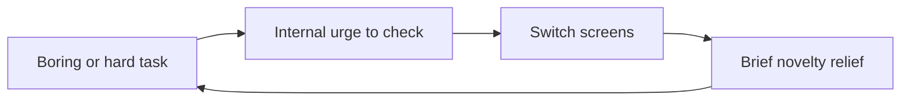

## A note on sources

No transcript of this episode exists in the track's research files. YouTube's caption downloads returned rate-limit errors on every attempt, so no transcript could be secured. This chapter is built from two verified sources. First, the episode's official description, published by Hidden Brain itself, which names the episode's core claims and stories. Second, psychologist Gloria Mark's published research, principally her book Attention Span (2023) and the studies it reports, as documented in public summaries and interviews. Nothing here is quoted from the episode's spoken words. Where an episode detail is not in my sources, the text says so plainly.

## Why this episode matters

This is the most-viewed episode of Hidden Brain's YouTube channel (54,278 views as of October 2026), and it is the only one in the track about attention itself. Every other chapter assumes you can direct your mind at the thing you want to study. This one asks whether you can. Its answer is a number: 47 seconds. That is the average time you now spend on one screen before switching. The episode's twist, per its official description, is that the thief is not your phone. It is you. Even when nothing around you buzzes or beeps, you interrupt yourself. No other episode in this track explains why focus collapses from the inside, what each switch costs you in minutes, or how to schedule a day around the rhythms your attention actually follows.

## The 47-second finding

### What the number measures

Gloria Mark is a psychologist at the University of California, Irvine. She studies human-computer interaction: how people actually use devices, in real workplaces, over years. Her headline finding: the average person now spends 47 seconds on any single screen before shifting attention elsewhere.

Read that number carefully. It does not measure a biological limit of your brain. It measures behavior: how long you stay on one screen before you switch. The distinction matters. A brain limit would be a life sentence. A behavior is a habit. Habits can change.

The number also comes from logging, not from asking. Mark's team installed software that recorded what was on screen, in the background, while people worked. Nobody estimated. Nobody guessed. The computer counted.

### The decline, in three measurements

Mark has run these measurements for two decades. The same method, the same kind of workers, three eras:

Figure 1. Average time on one screen before switching. AI Podcast Curriculum, ep08 (Gloria Mark, 2026-08-31). Shell 2. Count or score the toy. Source: published research, via public summaries.

| Year | Average time on one screen |
|---|---|
| 2004 | About 2.5 minutes (150 seconds) |
| About 2012 | About 75 seconds |
| 2016 onward | 47 seconds (median 40 seconds) |

One claim per plate. In roughly a dozen years, the average stretch of unbroken screen attention fell by two thirds.

Hand-worked arithmetic: 150 seconds down to 47 seconds is a drop of 103 seconds. That is 69 percent of the 2004 value gone. The median of 40 seconds means half of all observed stretches ended in 40 seconds or less. The average is pulled up by a few long stretches. Your typical stretch is even shorter than the headline number.

### Small studies, heavy method

One honest caveat from the research coverage: these were time-intensive studies, and therefore small. Mark estimates about 1,500 people total across the years. Small does not mean weak here. Each person was observed in fine detail over real workdays, not surveyed once. The trend held across separate cohorts and a dozen years. Treat the exact number as approximate and the direction as solid.

## The real interrupter

### Self-interruption

Here is the episode's central claim, straight from its official description: even when nothing around you buzzes or beeps, you still find ways to interrupt yourself.

Mark's research puts a number on it. People interrupt themselves about 44 percent of the time. Nearly half of all attention switches come from inside, not from a notification, a colleague, or a ringing phone. External interruptions and self-interruptions run about even. You are your own worst interrupter, roughly tied with the rest of the world combined.

Figure 2. Where attention switches come from. AI Podcast Curriculum, ep08 (Gloria Mark, 2026-08-31). Shell 2. Count or score the toy. Source: published research, via public summaries.

| Source of the switch | Share |
|---|---|
| You interrupt yourself | About 44 percent |
| Something else interrupts you | About 56 percent |

One claim per plate. Silencing every notification on earth would remove barely half the problem.

### Why you do it

The mechanism is internalized habit. Years of being interrupted trained a reflex. Now the urge to check arrives on its own. The trigger is usually a small discomfort in the current task: it gets slightly boring, or slightly hard. At that moment, something in you reaches for a quick hit of stimulation elsewhere. Email. A headline. A tab you already read.

This is why the episode's title says it is not just your phone. The phone started the training. Your nervous system finished it. The interruption program now runs without the phone's help.

Figure 3. The self-interruption loop. AI Podcast Curriculum, ep08 (Gloria Mark, 2026-08-31). Shell 3. Apply the one rule. Source: original toy, from published research claims.

One claim per plate. The arrow from A to B is the rule: discomfort in the task fires the urge, no notification required. The loop runs by itself.

### The doctor's flight

The episode's official description gives the story that makes this concrete. A doctor books a round-trip flight just to escape Wi-Fi long enough to write a grant. Read that again. Not a cabin in the woods. A flight. He pays for a seat in the sky: hours where the network cannot reach him, and, more importantly, where he cannot reach for it either. The story's point is not that Wi-Fi is evil. It is that willpower lost, so he bought an environment instead. Design beat discipline. That is the episode's whole prescription in one anecdote.

## What each switch costs

### Twenty-five minutes to come back

Mark's team measured the price of an interruption. After your attention is pulled from an active work project, it takes about 25 minutes and 26 seconds before you return to the original task. Not 25 minutes of the interruption. 25 minutes after it, spent drifting through other things before the original work recaptures you.

Hand-worked arithmetic: interrupt yourself 6 times in a morning, and the refocus debt is 6 times 25 minutes, which is 150 minutes. Two and a half hours of the day spent not on the interruptions, but on finding your way back. At 47 seconds per screen stretch, those 150 minutes contain roughly 190 further switches. The debt compounds.

Figure 4. The cost ledger of one interruption. AI Podcast Curriculum, ep08 (Gloria Mark, 2026-08-31). Shell 2. Count or score the toy. Source: published research, via public summaries.

| Item | Measured value |
|---|---|
| Average screen stretch before switching | 47 seconds |
| Time on one work project before switching | About 10.5 minutes |
| Time to return to the original task after interruption | 25 minutes 26 seconds |
| Email checks per day (one study's average) | 77 |

One claim per plate. The switch is cheap. The return is expensive.

### The tension that follows you

There is a second cost, psychological. When a task is interrupted, it leaves a state of tension: an unsatisfied need to finish that keeps reminding you, over and over, to return. Psychologists call this the Zeigarnik effect, after Bluma Zeigarnik, who first documented it. Definition: an interrupted task stays active in memory and keeps tugging at attention until it is completed.

This is why a day of constant switching feels exhausting even when nothing got done. Every open loop keeps a thread running. Ten interruptions mean ten threads tugging. The fatigue is real, and the switching caused it, not the work.

### The email experiment

Mark's team ran a rare field experiment. It took six years to find an organization willing to restrict email access for some employees. The result: with email cut off, stress fell and attention-switching fell. There was also a social side effect. Colleagues stopped hiding behind messages and started talking to each other in person.

The lesson is not "delete email." It is that the always-on channel has a measurable cost, and removing it for stretches measurably helps. Batching is the practical version: check email at set times instead of living inside it.

## Four kinds of attention

### The two-by-two

Most people think attention has two states: focused or unfocused. Mark's research says there are four. They come from two questions: are you engaged, and is it effortful?

Figure 5. The four attention states. AI Podcast Curriculum, ep08 (Gloria Mark, 2026-08-31). Shell 2. Count or score the toy. Source: published research, via public interview.

|  | Challenging (effortful) | Not challenging (effortless) |
|---|---|---|
| Engaged | Focused attention: reading a hard article, writing | Rote attention: a game on your phone, a familiar show |
| Not engaged | Frustration: a tech problem you cannot solve but must | Boredom: neither engaged nor challenged |

One claim per plate. "Unfocused" is three different states, and each needs a different response.

### Why the grid matters

The grid kills two myths. First, the myth that all screen time is bad. Rote attention, the easy-engaged quadrant, can replenish you. A few minutes of a phone game can reset the nervous system the way a walk does. The enemy is not the game. The enemy is the game hijacking a peak hour.

Second, the myth that you should be in focused attention, or better yet in flow, all day. Mark is explicit: humans cannot focus nonstop, any more than they can lift weights nonstop. Expecting ten hours of focus is the dysfunction. The grid says: match the state to the hour.

## Working with your rhythms

### Peaks and ebbs

Attention runs in rhythms across the day. Peaks, when your brain can do the hardest creative work. Ebbs, when it cannot. Mark's prescription: learn your own rhythm, then schedule around it. Hard tasks at peaks. Rote tasks at ebbs. This sounds obvious. Almost nobody does it. Most people schedule by the clock and by other people's demands, then wonder why the hard work never happens.

How do you learn your rhythm? Watch yourself for a week. Note the hours when deep work flows and the hours when you reach for the phone. That log is the instrument. No app needed.

### Breaks at natural pauses

When you do break, break at a natural pause: after finishing a chapter, after sending the email, at the end of a subtask. Breaking mid-thought leaves the Zeigarnik thread tugging. Breaking at a boundary lets the loop close.

### Plant a hook

Mark's most tactical trick: when you take a rote break, plant a hook that pulls you back. Schedule the break ten minutes before a call you cannot miss. Set a timer. Put the return cue in the environment, not in your willpower. The doctor's flight was a hook at full scale: an environment he could not escape until the work was done.

### Three levels of change

Mark argues the fix works at three levels. Individual: your rhythms, your batching, your hooks. Organizational: email-free hours, norms against instant reply, meetings that respect peaks. Societal: media literacy, design standards for attention-hungry products. The episode, per its description, focuses on the personal level: what happens inside your own mind. The book extends the argument outward.

## Memory aids

Mnemonic: **FOCUS**. **F**orty-seven seconds: the average screen stretch. **O**wn interruptions: you cause about 44 percent of switches. **C**ost: 25 minutes to return after each one. **U**se your rhythms: peaks for hard work, ebbs for rote. **S**top blaming the phone: the urge now comes from inside.

Never-confuse pairs:
- The 47 seconds is not a brain limit. It is a behavior measurement: screen-switching, logged by software. Behavior is trainable. A limit would not be.
- Self-interruption is not phone addiction. Phone addiction is pull from outside. Self-interruption is the trained urge firing with the phone silent in the next room.
- Rote attention is not wasted attention. Rote is the easy-engaged quadrant. It replenishes. Waste is rote attention spending a peak hour.
- A break is not a switch. A break at a natural pause closes the loop. A switch mid-thought leaves the Zeigarnik thread running.

Trap cards:
- Trap: "I just need more discipline." Reality: Mark's data shows the pattern is rhythmic and environmental. Design your day and your defaults. Discipline is the weakest tool in the set.
- Trap: "I turned off notifications, so I am fixed." Reality: you cause about 44 percent of your own switches. The urge is inside now. Watch for the reach, not the buzz.
- Trap: "I should be able to focus all day." Reality: nobody can. Peaks and ebbs are the design. Schedule the hard work into the peaks instead of fighting the ebbs.
- Trap: "Any downtime on my phone is failure." Reality: rote breaks can reset your nervous system. The failure is an untimed break with no hook, in a peak hour.
## Q&A

**1. Explain the 47 seconds to me like I am new.**
Researchers put logging software on people's computers and counted how long each screen stayed up before the person switched. In 2004 the average was two and a half minutes. By 2016 it was 47 seconds. So the average knowledge worker now looks at one screen for under a minute before moving on. This is not a test of brainpower. It is a count of behavior. And behavior is the good news, because behavior can change. Follow-up: if the median is 40 seconds, what does that tell you about the average? Answer: the average is pulled up by a few long stretches. Your typical stretch is the median, 40 seconds or less.

**2. Walk me through how Mark measured attention, and why the method matters.**
Self-report would ask people how focused they are. People are terrible at answering that. Mark's team used background logging: software recorded which window was active, for how long, across real workdays, over years, in about 1,500 people total. The method matters for three reasons. First, it measures behavior, not opinion. Second, it runs for years, so it catches trends. Third, it is the same method in 2004 and 2016, so the decline is a real change, not a change in how the question was asked. Follow-up: what is the method's main weakness? Answer: the studies are small and time-intensive, so the exact numbers are approximate. The trend across cohorts is the solid part.

**3. Why do we interrupt ourselves? Give me the mechanism.**
Years of external interruptions trained a reflex. The reflex now fires without the external trigger. The proximal cause is usually mild discomfort in the current task: it turns slightly boring or slightly hard. That discomfort triggers an urge to check something else for a quick hit of novelty. You switch. The novelty relieves the discomfort for seconds. The task is still boring or hard when you return, so the loop repeats. The episode's line, per its description: even with no buzz or beep, you find ways to interrupt yourself. Follow-up: is the urge conscious? Answer: mostly not at first. That is why the first tool is to spot the reach, not fight it.

**4. Price one interruption for me, in minutes.**
The switch itself costs seconds. The return costs about 25 minutes and 26 seconds before you are back on the original task. During those 25 minutes you drift through other things. Each open task also leaves a Zeigarnik thread: a background tug to finish it. So one interruption costs 25 minutes of refocus plus a running thread of tension. Six interruptions in a morning cost about 150 minutes of refocus debt. Follow-up: why is the return so slow? Answer: attention does not teleport. It lands on nearby tasks first, and each of those re-opens its own thread, before the original task recaptures it.

**5. What does the doctor's flight prove?**
A doctor books a round-trip flight to escape Wi-Fi long enough to write a grant. The flight is an environment purchase. He could not will himself to ignore the network, so he bought hours where the network could not reach him and he could not reach for it. It proves two things. First, willpower had already lost. The honest move was design, not another resolution. Second, the fix is subtraction of access, which rhymes with this track's first episode: remove the option, do not fight the urge. Follow-up: what is the cheap version of the flight? Answer: any hook that removes access for a bounded time. Phone in another room. Wi-Fi off for 90 minutes. A break scheduled ten minutes before a call.

**6. Applied: redesign your workday using Mark's findings.**
First, log one week: mark the hours when deep work flows and the hours when you reach for the phone. Those are your peaks and ebbs. Second, move the hardest task of the day into the strongest peak. Protect it with a hook: phone in another room, notifications off, a hard stop on the calendar. Third, batch email to two or three fixed windows. Mark's field experiment showed cutting always-on email reduced stress and switching. Fourth, schedule rote work and deliberate breaks into the ebbs, and plant a return hook for every break. Fifth, take breaks at natural pauses, not mid-thought, to avoid Zeigarnik threads. Follow-up: what do you tell your manager? Answer: show the numbers. 47 seconds, 25 minutes per interruption, 77 email checks a day. Ask for two protected peak hours, and offer the output as the trade.

**7. Applied: your team lives in Slack and complains nobody can think. What do you change?**
Treat it as an organizational problem, not a personal one. Mark's three levels say the team level matters. Propose: notification norms (no expectation of instant reply), email-free or message-free hours for deep work, and meetings kept out of the team's peak morning block. Cite the email-cutoff experiment: when the always-on channel closed, stress and switching fell and people talked in person more. Measure before and after for two weeks: self-reported switches per day, or just ask the team when deep work happened. Follow-up: what if the team resists? Answer: start with yourself for one week, log the difference, then bring the data. Nobody argues with a colleague who suddenly ships twice as much.

## Chapter plate

| Without the rule | The stored object | With the rule | Tradeoff in one line |
|---|---|---|---|
| Blame the phone, rely on willpower, switch every 47 seconds, pay 25 minutes per return, schedule by the clock | Attention as a rhythm: 47-second behavior, 44 percent self-interruption, four states, peaks and ebbs | Log your rhythm, protect peaks with hooks, batch the inbox, break at natural pauses, plant a return hook for every rote break | You trade constant availability for depth: fewer threads open, slower replies, but the hard work actually gets done |

## How to imbibe this

Concrete practices, this week.

1. Log your rhythm. For five workdays, note each hour: deep work flowed, or you reached for the phone. No app needed. Observable change: by Friday you can name your two peak hours and your two ebb hours.
2. Protect one peak. Put your hardest task in your strongest peak hour tomorrow. Phone in another room. One hook: a calendar block with a hard stop. Observable change: one hour of unbroken work, which you can feel.
3. Batch the inbox. Check email at three fixed times. Close it between. Observable change: count your daily email checks before and after. Watch the number fall from the dozens.
4. Catch the reach. Three times a day, notice the moment your hand moves toward the phone or a new tab with no notification behind it. Say silently: "That is self-interruption." Observable change: the urge becomes visible before it becomes a switch.
5. Hook every rote break. Before any game, feed, or video break, set the return cue: a timer, or schedule it ten minutes before a call. Observable change: breaks end. They stop eating the next hour.
6. Break at boundaries. This week, never stop mid-thought. Finish the paragraph, send the email, close the subtask, then break. Observable change: the background tug of unfinished threads gets quieter.
7. Buy one flight. Schedule one 90-minute block with Wi-Fi off and the phone silenced for your most important task. Observable change: you experience what the doctor bought, at zero cost.

## Think it yourself

Do these with your own brain before touching AI. No answer sketches. Reason from the chapter, unaided.

**Drill 1: your switch ledger.** Estimate your switches yesterday: screens, tabs, phone pickups. Multiply the count by 25 minutes of refocus debt. Write the total. Now defend or attack the estimate: which switches were real task changes, and which were self-interruptions?

**Drill 2: design the email experiment.** Mark's team took six years to find a willing organization. Design a one-person version you can run this week: the cutoff, the control days, the measurements (stress, switches, output). Name the biggest confound in your design.

**Drill 3: the flight test.** The doctor paid for a flight to escape Wi-Fi. Price your own escape: what would you pay for four guaranteed hours of depth per week? Now find the free version and run it once. Report what broke.

**Drill 4: the four-state audit.** Take yesterday hour by hour. Label each hour with one of the four attention states: focused, rote, boredom, frustration. Find one peak hour you spent in rote and one ebb hour you spent fighting for focus. Swap them on paper for tomorrow.

**Drill 5: argue both sides.** Side A: the 47-second span is a crisis and must be reversed. Side B: it is an adaptation to an information-rich world, and the knowledge worker of 2004 was under-stimulated. Use Mark's numbers for both. Decide which side wins for your own work.

**Drill 6: the hook inventory.** List every break you took yesterday. For each, name the return hook, if any. For the hookless ones, write the hook you will plant next time. Notice the pattern: which breaks had hooks, and did they end on time?

## Skills you can now use

- Measure attention with logging, not feeling: count switches, do not estimate focus.
- Separate self-interruption from external interruption: watch for the reach with no buzz behind it.
- Price any interruption at 25 minutes of refocus debt before you allow it.
- Read your day as peaks and ebbs, and schedule hard work into the peaks.
- Plant a return hook for every rote break: a timer, a call, a hard stop.
- Batch the inbox to fixed windows instead of living inside it.
- Break at natural pauses to keep Zeigarnik threads closed.
- Run a team-level audit: notification norms, message-free hours, protected peaks.

## Go deeper

- The episode itself: https://www.youtube.com/watch?v=uYzzfQ51V2U
- New Scientist review of Mark's Attention Span (the studies, the numbers, the caveats): https://www.newscientist.com/article/2353856-attention-span-review-a-welcome-injection-of-evidence/ (HTTP 200, verified 2026-10-06)
- UC interview with Mark on the four attention types and the myths: https://www.universityofcalifornia.edu/news/cant-pay-attention-youre-not-alone (HTTP 200, verified 2026-10-06)

## Figure audit

| Unit id | Claim | Before | After | Figure id | Medium | Source | Four tests |
|---|---|---|---|---|---|---|---|
| u01 | Screen attention fell 150s to 47s | 2004: 2.5 minutes | 2016+: 47 seconds | fig1 | table | published research | T1: 3-row decline / T2: comparison of values forces table / T3: 103-second drop is changeable / T4: the 47-second chip reused in drills |
| u02 | Switches come from inside ~44% | Blame the phone | Self causes nearly half | fig2 | table | published research | T1: 2-row split / T2: comparison forces table / T3: none, static / T4: the self-interruption chip reused in Q&A |
| u03 | The self-interruption loop | Task turns boring or hard | Urge fires, switch, repeat | fig3 | mermaid | published research | T1: 4-node loop / T2: flow forces mermaid / T3: none, static / T4: the loop arrow reused in imbibe |
| u04 | One interruption costs 25:26 | Switch costs seconds | Return costs 25 minutes | fig4 | table | published research | T1: 4-row cost ledger / T2: comparison forces table / T3: interruption count is changeable / T4: the 25-minute chip reused in drills |
| u05 | Four attention states | Focused or unfocused | 2x2: engaged x effortful | fig5 | table | published research | T1: 2x2 grid / T2: comparison forces table / T3: none, static / T4: state names reused in drills |
| u06 | Doctor's flight | Willpower fails | Buys an environment | none | none | episode description | No figure: single anecdote, prose carries it, and the hook concept needs no figure |
| u07 | Zeigarnik tension | Task interrupted | Thread keeps tugging | none | none | published research | No figure: one mechanism sentence, with no reusable symbol beyond the name |
| u08 | Email cutoff experiment | Always-on email | Stress and switching fell | none | none | published research | No figure: before/after fully carried by one prose paragraph |
