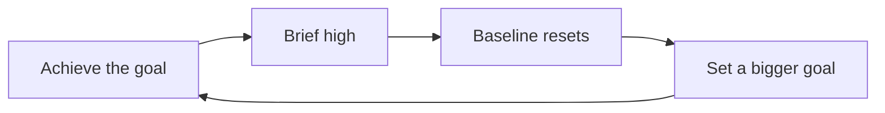
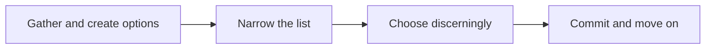

## A note on sources

No transcript of this episode exists in the track's research files. YouTube's caption downloads returned rate-limit errors on every attempt, so no transcript could be secured. This chapter is built from two verified sources. First, the episode's official description, published by Hidden Brain itself, which names the episode's core claims: the arrival fallacy, four hidden traps, and one small shift in language. Second, the published work of the people involved: positive psychologist Tal Ben-Shahar, who coined the arrival fallacy, and Dave Evans's Designing Your Life framework (with Bill Burnett). Nothing here is quoted from the episode's spoken words. One honest gap: the description names "four hidden traps" but no available source details them, so they are marked as episode content, not reconstructed here.

## Why this episode matters

This is the second most-viewed episode of Hidden Brain's YouTube channel (21,802 views as of October 2026), and it is the only one in the track about happiness itself. Every other chapter studies how your mind works. This one asks why the mind's own success formula fails: you reach the goal, and the happiness does not arrive. The episode's answer has a name, the arrival fallacy, and it reframes the problem from "achieve more" to "believe differently." Its guest, Dave Evans, is a Stanford lecturer, the co-author of Designing Your Life, and the engineer who led the design of Apple's first mouse. He brings a designer's toolkit to the problem: not motivation, but reframes. Small shifts in language that change how alive an ordinary day feels. No other episode in this track gives you a procedure for editing the sentences your happiness runs on.

## The arrival fallacy

### The false belief

Definition: the arrival fallacy is the false belief that reaching a goal will produce lasting happiness.

The term was coined by Tal Ben-Shahar, a psychologist who taught Harvard's popular positive psychology course. The belief runs: when I achieve X, then I will be happy. When I get the promotion, the degree, the house, the number. Then, at the end of the striving, I will live happily ever after.

Everyone has personal evidence against it, and almost nobody updates. Think of your last three big arrivals. The promotion. The launch. The acceptance letter. How long did the happiness last? Days, usually. Weeks at most. Then the baseline returned, and a new goal took the old one's place. The fallacy is not that achievement feels like nothing. It is that the feeling does not last, and the mind keeps betting the next arrival will be different.

### Hedonic adaptation: the mechanism

The mechanism has a name: hedonic adaptation. Definition: the human tendency to adjust to a new normal, so that a changed circumstance stops changing how you feel.

The new salary becomes the normal salary. The new title becomes the normal title. The baseline rises to meet each level, so the emotional gap you chase never closes. This is the same machinery as the hedonic treadmill: you run toward the feeling, the ground moves under you, and you stay in place.

Figure 1. What you expect versus what happens. AI Podcast Curriculum, ep09 (Dave Evans, 2026-09-11). Shell 3. Apply the one rule. Source: published research on the arrival fallacy, via public summaries.

| Phase | What you expect | What happens |
|---|---|---|
| Before the goal | Happiness waits at arrival | Anticipation feels good, and the goal organizes life |
| At arrival | Lasting satisfaction | A brief spike: days to weeks |
| After arrival | A new, higher baseline of happiness | Hedonic adaptation resets the baseline, and a new goal appears |

One claim per plate. The rule: the baseline moves to meet each achievement, so arrival can never be a permanent address.

### The ancient version

This is not a modern disease. In the third century BCE, King Pyrrhus of Epirus prepared a campaign against Italy. His advisor Cineas asked: after Italy, what next? Sicily, said the king. And then? Libya and Carthage. And then? Then, smiled Pyrrhus, we will live a life of ease, drink all day, and enjoy pleasant conversation with friends. Cineas paused and asked: what stops us from doing that today?

Plutarch recorded the exchange two thousand years ago. The arrival fallacy is at least that old. Every generation rediscovers that the destination keeps moving, and every generation is surprised.

### The synthesis

Ben-Shahar's answer is not to abandon goals. It is a synthesis of two extremes. One extreme says happiness lives at the destination: achieve, then feel. The other extreme says forget destinations entirely and only be present. Both fail, because human nature cares about the future too.

The synthesis: treat goals as means, not ends. The goal does not make you happy. The goal liberates you to enjoy the journey toward a destination you find valuable. His line, widely quoted: happiness is not about making it to the peak of the mountain, nor about climbing aimlessly around it. Happiness is the experience of climbing toward the peak.

Hand-worked logic: if happiness lives at the destination, you get it never, because adaptation moves the destination. If it lives only in the present, you get it without direction, and humans need direction. If it lives in directed motion, you get it daily, for as long as you climb toward something you chose.

Figure 2. The treadmill loop. AI Podcast Curriculum, ep09 (Dave Evans, 2026-09-11). Shell 3. Apply the one rule. Source: original toy, from published research claims.

One claim per plate. The arrow from C to D is the rule: adaptation erases the gain, so the mind prescribes a larger dose.

## The designer's toolkit

### Dysfunctional beliefs

Dave Evans approaches happiness the way he approaches products: as a design problem. His core tool is the dysfunctional belief. Definition: a sentence you believe about how life works that is false, and that quietly designs your unhappiness.

The method has two steps. First, name the belief out loud. Beliefs run your life from the dark. Naming drags them into the light. Second, reframe it: replace the false sentence with a truer one. Not a happier one. A truer one.

Figure 3. Beliefs and their reframes. AI Podcast Curriculum, ep09 (Dave Evans, 2026-09-11). Shell 3. Apply the one rule. Source: Designing Your Life, via public summaries.

| Dysfunctional belief | Reframe |
|---|---|
| To be happy, I have to make the right choice | There is no right choice, only good choosing |
| I need to know my purpose before I can live well | I can live purposefully starting right now |
| Happiness is to have it all | Happiness is the release of what you do not need |
| I finished designing my life. Now it will be great | You never finish designing your life |

One claim per plate. The rule: each reframe replaces a noun with a verb. Purpose becomes purposefully. Choice becomes choosing. The happiness moves from a thing you get into a way you operate.

### The small shift in language

The episode's description promises "one small shift in language that can change how alive your everyday life actually feels." The reframe table above is the mechanism class that shift belongs to. Notice the pattern in every row: the belief treats happiness as a thing at a destination (the right choice, the purpose, having it all, the finished design). The reframe moves it into the present tense of action (choosing, living purposefully, letting go, continuing to design).

This is the same move as the arrival-fallacy synthesis, stated as grammar. Stop asking what will make you happy. Start asking how you operate today. The language shift is small: nouns to verbs. The aliveness shift is the whole episode.

### The four traps: an honest gap

The episode's description names "four hidden traps that keep us feeling stuck even when our lives look 'right' on paper." No available source details them. They are episode content, and this chapter will not invent them. What the published work does document is the territory the traps live in: the gap between a life that looks right on paper and a life that feels right from inside. The tools below are the verified equipment for that territory. Watch the episode for the four traps themselves.

## Choosing well

### The four steps

Evans and his co-author Bill Burnett teach a choosing process with four steps. It is the practical answer to the most paralyzing dysfunctional belief: that happiness requires the right choice.

Figure 4. The choosing process. AI Podcast Curriculum, ep09 (Dave Evans, 2026-09-11). Shell 3. Apply the one rule. Source: Designing Your Life, via public summaries.

One claim per plate. The arrow from C to D is the rule: commitment ends the choosing. Without it, the process never closes.

Step one: gather and create options. Generate widely before you judge. Step two: narrow to five or fewer. Too many options paralyze. Crossing off is progress. Step three: choose discerningly. Discernment uses three ways of knowing: the cognitive (what you think), the emotional (what you feel), and the intuitive (the gut response). A choice made on spreadsheets alone is under-instrumented. Step four: let go and move on. You cannot know the best choice until all consequences play out, which is never. So commit, and stop comparison-shopping your life.

### Why letting go is the happiness step

Step four is where happiness actually lives. Keeping options open feels safe. Research on reversibility says the opposite: seeing a choice as reversible makes you less satisfied with it. The mind keeps one foot out the door, and half-commitment produces half-experience. Letting go is not settling. It is the decision to be fully where you are, which is the only place happiness can happen.

### The five mindsets

Under the process sit five mindsets Evans teaches: curiosity, bias to action, reframing, awareness, and radical collaboration. Two matter most for this episode. Bias to action: prototype a life path instead of ruminating about it. Talk to someone doing the thing. Shadow the job for a day. Build the small experiment. Reframing: when stuck, the problem is usually the frame, not the facts. Change the sentence, and the options change with it.

## Memory aids

Mnemonic: **ARRIVE**. **A**rrival fallacy: the belief that the goal delivers lasting happiness. **R**eward is in the climb: goals as means, not ends. **R**eframe the sentence: nouns to verbs, beliefs to truer beliefs. **I**ntegrate three ways of knowing: think, feel, gut. **V**enture a prototype: bias to action over rumination. **E**xit cleanly: let go and move on.

Never-confuse pairs:
- The arrival fallacy is not "goals are bad." Goals as ends mortgage happiness to a future that never pays. Goals as means fund the present climb. Same goals, different grammar.
- A reframe is not positive thinking. Positive thinking swaps a bad feeling for a good one. A reframe swaps a false sentence for a truer one. "There is no right choice" is not cheerful. It is accurate, and accuracy frees you.
- Letting go is not settling. Settling accepts less than you want. Letting go commits fully to what you chose, which is the precondition for wanting it at all.
- The four traps are not in this chapter. The description names them. No source details them. Do not confuse the map in this chapter with the episode's full territory.

Trap cards:
- Trap: "I will be happy when..." Reality: that sentence is the arrival fallacy in plain clothes. Test it against your last three arrivals. The happiness lasted days. The sentence lied three times.
- Trap: "I must make the right choice." Reality: there is no right choice, only good choosing. The choosing process has four steps, and the fourth is release.
- Trap: "My life looks right on paper, so I should feel fine." Reality: paper-right and felt-right are different instruments. The episode's four traps live in that gap. Audit the felt instrument directly.
- Trap: "I need to find my purpose first." Reality: purpose is not a thing to find. It is a way of operating. Live purposefully starting now, and the purpose assembles itself behind you.
## Q&A

**1. Explain the arrival fallacy to me like I am new.**
Your brain runs a sentence: "When I achieve X, then I will be happy." You achieve X. You feel great for a few days. Then the feeling fades, and a new X appears. The fallacy is the "then I will be happy" part. Psychologist Tal Ben-Shahar named it after watching it run in himself and in everyone around him: the belief that arrival delivers lasting happiness is false, because your mind adapts to each new normal and resets the baseline. The happiness was real. The lasting part was the lie. Follow-up: does this mean achievement is pointless? Answer: no. It means achievement is a means, not an end. The goal organizes the climb, and the climb is where the happiness lives.

**2. Walk me through hedonic adaptation as the mechanism.**
Start with a raise. Month one: every paycheck feels like a win. Month six: the number is just the number. The mechanism: your emotional baseline rises to meet the new circumstance. What was a gain becomes the normal. Now the same machinery runs on goals. The promotion, the house, the milestone: each becomes the new normal within weeks. The mind then sets the next target, because the gap between "where I am" and "where happiness lives" reopens. This is why the treadmill metaphor fits: you run, the belt moves, your position never changes. Follow-up: can anything defeat adaptation? Answer: not permanently, which is the point. The defense is not a better achievement. It relocates happiness from the destination to the directed motion.

**3. What is Ben-Shahar's synthesis, and why do the two extremes fail?**
Extreme one: happiness lives at the destination. Fail: adaptation moves every destination, so happiness never arrives. Extreme two: forget destinations, only be present. Fail: humans care about the future. Directionless presence starves that need. The synthesis: treat goals as means rather than ends. Keep the destination, because it gives the climb direction. Stop demanding that the destination deliver the feeling. The feeling comes from climbing toward a peak you chose. In his words: happiness is the experience of climbing toward the peak. Follow-up: give me the one-sentence test. Answer: ask "is this goal funding my present or mortgaging it?" Funding means the pursuit itself feels alive. Mortgaging means you suffer now for a payoff later that adaptation will erase.

**4. What is a dysfunctional belief, and how does a reframe work mechanically?**
A dysfunctional belief is a false sentence about how life works that runs your decisions from below awareness. Example: "To be happy, I have to make the right choice." The reframe has two moves. First, exposure: say the sentence out loud so you can inspect it. Second, replacement: swap it for a truer sentence. "There is no right choice, only good choosing." The mechanism is grammatical. The belief nouns happiness into a thing at a destination. The reframe verbs it into a present-tense operation. You do not argue yourself into feeling better. You correct the sentence, and the corrected sentence stops generating the stuck behavior. Follow-up: how is this different from affirmations? Answer: affirmations assert a desired feeling. Reframes assert a truer description. One decorates the belief. The other replaces it.

**5. Run the "right choice" reframe on a real career decision.**
The belief: "To be happy, I have to make the right choice between Job A and Job B." This belief paralyzes, because "right" can only be known after all consequences play out, which is never. The reframe: "There is no right choice, only good choosing." Now run the four steps. Gather options: list A, B, and a third you have not considered. Narrow: cut to the live contenders. Choose discerningly: score each on think (pros and cons), feel (which excites you), and gut (your body's response when you imagine Monday morning there). Then let go: commit fully to the pick and close the comparison tabs. Follow-up: what if you chose wrong? Answer: the frame says there is no wrong. There is only the choosing, done well, and the commitment after. Regret is the tax on keeping the belief.

**6. Applied: you got the promotion last month and already feel flat. Use the episode's tools.**
First, name what happened: the arrival fallacy ran on schedule. The spike faded in weeks. This is the mechanism, not a personal failure. Second, run the synthesis: the promotion was a means, not an end. Ask what climb it funds. What work does the new role let you do that feels alive? Aim attention there. Third, audit the sentence running underneath: "Now that I arrived, I should feel happy." Reframe it: "Arrival was never the address. The aliveness is in the operating." Fourth, check the paper-versus-felt gap: the resume looks right. Which of health, work, play, love feels thin? The flatness may be a dashboard problem wearing a promotion costume. Follow-up: what if the new role's work feels dead? Answer: that is data, not failure. Bias to action: prototype one alternative inside or outside the role this month, instead of ruminating for a year.

**7. Applied: a friend says "my life looks perfect and I am miserable." What do you actually say?**
Do not argue with the paper. Their resume is accurate and their misery is accurate. Those are different instruments. First, normalize: the arrival fallacy predicts exactly this. Every arrival adapted, so the paper got better while the felt stayed flat. Second, hand them the sentence audit: ask what their "I will be happy when" sentence currently is. Third, offer one reframe to try for a week, not a life overhaul: pick the belief that sounds most like them and swap it for its truer version. Fourth, be honest about the limit: the episode names four hidden traps in this territory, and the details are the episode's, not mine. Watch it together. Follow-up: what do you not say? Answer: anything that defends the paper. "But you have so much" is the fastest way to make a miserable person feel guilty about being miserable.

## Chapter plate

| Without the rule | The stored object | With the rule | Tradeoff in one line |
|---|---|---|---|
| Chase arrivals: each goal promises lasting happiness, adaptation erases it in weeks, the next goal must be bigger, the paper improves while the felt stays flat | The arrival fallacy plus the reframe: nouns-to-verbs grammar that moves happiness from destination to operation | Treat goals as means, run belief-to-reframe on stuck sentences, choose in four steps, let go and commit | You give up the fantasy of a final arrival. You get aliveness on ordinary days, which was the only place it ever lived |

## How to imbibe this

Concrete practices, this week.

1. The arrival audit. List your last three big goals. For each, write how long the happiness lasted after arrival: days or weeks. Observable change: the pattern becomes undeniable in your own handwriting, not theory.
2. Catch the sentence. For one week, notice every "I will be happy when..." that crosses your mind. Write each down verbatim. Observable change: you hear how often the fallacy speaks in your own voice.
3. One belief, one reframe, daily. Each morning, pick one dysfunctional belief from the table and write its reframe in your own words. Observable change: the reframe sentences start arriving unprompted when the belief fires.
4. Run the four steps on one real decision. Gather options, narrow to five or fewer, choose with think-feel-gut, then let go and move on. Observable change: one decision actually closes instead of looping.
5. Prototype, do not ruminate. Pick one path on your mind for months. Take one small real-world step this week: a conversation, a shadow day, a trial. Observable change: data replaces speculation.
6. The climb log. Each evening, write one line about the day's directed motion: what did you climb toward? Observable change: attention shifts from destinations to motion within days.
7. Teach the fallacy once. Explain the arrival fallacy to one person, using your own arrival audit as the example. Observable change: teaching installs it permanently, and you gain a shared language for the flat-after-success conversation.

## Think it yourself

Do these with your own brain before touching AI. No answer sketches. Reason from the chapter, unaided.

**Drill 1: your hedonic half-life.** Take your last three arrivals. Estimate, for each, how many days the good feeling lasted before the baseline returned. Compute your personal half-life of achievement-happiness. Now predict the half-life of your current biggest goal. What does the prediction imply about how you should relate to it?

**Drill 2: the Cineas dialogue.** Write your own version of the Pyrrhus exchange. Your current biggest goal is Italy. Write Cineas asking "and then what?" until you reach the life of ease. Then answer his final question honestly: what stops you from doing that today? Distinguish the real obstacles from the arrival-fallacy ones.

**Drill 3: design the arrival experiment.** Design a study that tests whether the reframe "there is no right choice, only good choosing" reduces decision paralysis. Specify the two groups, the decision task, and the measurements. Name the strongest objection to your design.

**Drill 4: the paper-versus-felt dashboard.** Score your health, work, play, and love from 1 to 10 on two scales: how they look on paper, and how they feel from inside. Find the largest gap. Write the dysfunctional belief that maintains it, and the reframe.

**Drill 5: argue both sides.** Side A: the arrival fallacy means ambition is a trap and the wise scale down their goals. Side B: the fallacy is compatible with fierce ambition, because goals-as-means fund the climb. Use Ben-Shahar's synthesis to judge. Decide where you stand, in one paragraph.

**Drill 6: the track synthesis.** Ep08 taught you to schedule by attention rhythms. This chapter teaches you to edit the sentences happiness runs on. Write one paragraph on how the two combine: what does a day look like that respects both your peaks and your verbs? Name the first change you will make tomorrow.

## Skills you can now use

- Spot arrival-fallacy sentences in yourself and others: "I will be happy when..."
- Run any stuck belief through the two-step reframe: name it, replace it with the truer sentence.
- Shift nouns to verbs: purpose becomes purposefully, choice becomes choose-well, arrival becomes climb.
- Execute the four-step choosing process and actually close decisions.
- Use think-feel-gut discernment instead of spreadsheet-only deciding.
- Prototype a life path with one small real step instead of ruminating.
- Distinguish paper-right from felt-right with the four-area dashboard.
- Teach the fallacy from your own arrival audit, not from theory.

## Go deeper

- The episode itself: https://www.youtube.com/watch?v=kpfzh2rsV1c
- The arrival fallacy, explained with the research (Psychology Today): https://www.psychologytoday.com/us/blog/mindfulness-insights/202503/the-overlooked-and-misunderstood-arrival-fallacy (HTTP 200, verified 2026-10-06)
- Sahil Bloom on the arrival fallacy and the middle path (the Pyrrhus story): https://sahilbloom.substack.com/p/the-middle-path-to-happiness (HTTP 200, verified 2026-10-06)

## Figure audit

| Unit id | Claim | Before | After | Figure id | Medium | Source | Four tests |
|---|---|---|---|---|---|---|---|
| u01 | Arrival promises lasting happiness, delivers weeks | Expectation: permanent | Reality: brief spike, baseline resets | fig1 | table | published research | T1: 3-phase before/after / T2: comparison forces table / T3: spike duration is changeable / T4: the adaptation chip reused in drills |
| u02 | The treadmill loop | Achieve the goal | Bigger goal appears | fig2 | mermaid | published research | T1: 4-node loop / T2: flow forces mermaid / T3: none, static / T4: the loop arrow reused in Q&A |
| u03 | Beliefs become reframes | Noun: the right choice | Verb: good choosing | fig3 | table | published work | T1: 4-row belief table / T2: comparison forces table / T3: none, static / T4: reframe sentences reused in imbibe |
| u04 | Choosing closes in four steps | Options open forever | Let go and move on | fig4 | mermaid | published work | T1: 4-node flow / T2: order forces mermaid / T3: none, static / T4: step names reused in drills |
| u05 | Pyrrhus and Cineas | Conquer Italy, then ease | Ease available today | none | none | published work | No figure: dialogue fully carried by prose, with no reusable symbol |
| u06 | Four hidden traps | Named in description | Details not in sources | none | none | episode description | No figure: honest gap, marked in text. Inventing a figure would fabricate content |
| u07 | Goals as means, not ends | Happiness at destination | Happiness in directed motion | none | none | published research | No figure: the synthesis is fig1's after-column stated as prose, with no new symbol |
