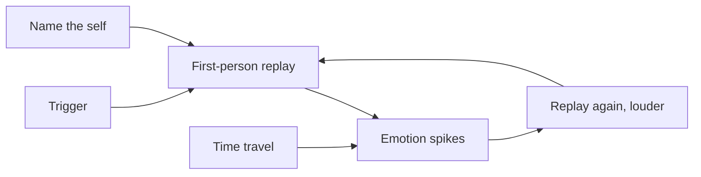

## A note on sources

No transcript of this episode exists in the track's research files. YouTube's caption downloads returned rate-limit errors on every attempt, so no transcript could be secured. This chapter is built from two verified sources. First, the episode's official description, published by Hidden Brain itself, which names the episode's core claims and stories: the 3 a.m. voice, the reassuring television man who wrestled with doubt, the neuroscientist whose stroke silenced her inner voice, and distanced self-talk as the tool. Second, psychologist Ethan Kross's published research, principally his book Chatter (2021) and the studies it reports, as documented in public sources. Nothing here is quoted from the episode's spoken words. The one verbatim quote in this chapter comes from a public transcript of Jill Bolte Taylor's TED talk, cited as such.

## Why this episode matters

This is the eighth most-viewed episode of Hidden Brain's YouTube channel (7,463 views as of October 2026), and it is the only one in the track about the voice inside your head. Every other chapter studies mental machinery you cannot hear. This one studies the narrator: the voice that replays the meeting at 3 a.m., rehearses the conversation that has not happened, and grades you on a curve you would never apply to a friend. The episode's question, per its official description: what if the voice that wakes you at 3 a.m. is also the reason you can think clearly at all? Its answer is a toolkit for turning the inner critic into an inner coach, built on one strange and powerful move: talking to yourself as if you were someone else. No other episode in this track hands you the operating manual for your own self-talk.

## The voice and its dark side

### The inner voice

Definition: the inner voice is your capacity to talk to yourself silently, in words, inside your head.

It is one of the mind's strangest powers. Kross reports research suggesting we talk to ourselves at a rate equivalent to 4,000 spoken words a minute. It runs constantly: narrating, planning, rehearsing, reviewing. It runs right now, as you process this sentence.

The voice evolved for good reasons. It lets you simulate the future before you act: rehearse the difficult conversation, preview the interview. It lets you regulate yourself: talk yourself through the hard set, the long run. And it builds your autobiographical self: the story of who you are, told in your own words, to yourself. Without it, you could not plan, and you would not know who the planner is.

### Chatter

Definition: chatter is the dark side of the inner voice. Self-talk turned repetitive, self-critical, and emotionally charged.

The episode's image, per its description: the voice that wakes you up at 3 a.m. Same voice, different mode. In daylight it plans. At 3 a.m. it prosecutes. It replays what you said. It rehearses what they thought. It runs the what-ifs. Nothing gets solved. Everything gets louder.

Figure 1. The voice, two modes. AI Podcast Curriculum, ep10 (Ethan Kross, 2026-08-20). Shell 2. Count or score the toy. Source: published research, via public summaries.

| | Inner voice (healthy) | Chatter (dark side) |
|---|---|---|
| Content | Plans, rehearses, reviews | Replays, accuses, catastrophizes |
| Direction | Forward: what will I do | Circular: why did I, what if they |
| Effect | Solves and steadies | Spirals and drains |
| Example | "First I will say X, then ask Y" | "Why did I say that, I am such an idiot" |

One claim per plate. Same voice, same speed. The difference is the shape of the loop.

### The cost

Chatter is not just unpleasant. Kross's research documents the bill: it impairs thinking, because the loop occupies the mental workspace. It impairs performance, because the spiral spends the resources the task needs. It damages relationships, because the replayed grievance leaks into the next interaction. And it harms health, because the stress response stays switched on for a threat that exists only in words.

Note the rhyme with this track's seventh chapter. There, worry hijacked working memory and Cate Campbell choked. Chatter is the same hijack with a narrator: the worry now has a voice, and the voice keeps the worry employed around the clock.

### Even the reassuring doubt

The episode's description opens its case with a surprise: one of the most reassuring men on television privately wrestled with the very same doubt. The description does not name him in the text available to this chapter, and no transcript exists to check, so he stays unnamed here. The point of the story does not need the name. If the man whose job was to calm millions could not calm his own 3 a.m. voice, then chatter is not a character flaw. It is a feature of the machinery, running in everyone.

## Silence, by stroke

### The neuroscientist

The episode's second story, per its description: a neuroscientist's stroke switched her inner voice off completely. The neuroscientist is Jill Bolte Taylor, a brain scientist who suffered a massive stroke in 1996 at age 37. A blood vessel burst in the left hemisphere of her brain, between the language regions. Over a few hours, a clot disabled them. Her account, given in her 2008 TED talk "My Stroke of Insight" (public transcript), describes what happened to the voice:

"In that moment, my brain chatter, my left hemisphere brain chatter went totally silent. Just like someone took a remote control and pushed the mute button. Total silence."

She continues: "And at first I was shocked to find myself inside of a silent mind. But then I was immediately captivated by the magnificence of the energy around me."

### What the silence contained

With the chatter gone, Taylor reports, so was everything the chatter carried: her job, its stress, her relationships, their stressors, and, in her words, 37 years of emotional baggage. What replaced it was euphoria and a sense of oneness with the world around her. She calls the state beautiful.

Two readings are available, and the chapter keeps both. The scientific reading: the left hemisphere runs the verbal narrator, and when it went offline, the narration stopped, which reveals how much of suffering is narrated rather than raw. The practical reading: you do not need a stroke to get some of this. The tools below are small, daily versions of the mute button. Deliberate, reversible, and free.

### Why the story matters for overthinkers

The overthinker's fantasy is silence: if only the voice would stop. Taylor's story grants the fantasy and reports back. The silence was not empty. It was full, peaceful, and connected. That matters because it reframes the goal. The aim is not to kill the voice. You aim to recover the quiet underneath it, the state the voice normally drowns out. The tools aim at distance from the voice, not death of it.

## Distanced self-talk

### The core move

The episode's tool, per its description: watch your own thoughts from a distance, like they belong to someone else, and chatter loosens its grip. Kross's name for it: distanced self-talk. Definition: addressing yourself in the second person or by your own name instead of "I" when you reflect on a stressful experience.

Instead of "Why did I mess that up, I am such an idiot," you say: "Why did Raj mess that up? Raj, you can handle this." The content is identical. The grammar changes. And the grammar changes everything.

### The 2014 study

Kross and colleagues tested this directly (Kross et al., 2014, Journal of Personality and Social Psychology). People reflected on stressful experiences using either first-person language ("I") or distanced language (their own name, "you"). The distanced group showed less emotional reactivity and performed better under stress, including in public speaking. A follow-up using EEG (electroencephalography: sensors on the scalp that read the brain's electrical activity) and brain imaging (Moser et al., 2017) found the calming effect arrived without extra mental effort to control the emotion. The shift worked fast and cheap.

The mechanism is vantage point, not encouragement. Saying your own name moves your mind into the posture you naturally take toward someone else's problem: wiser, steadier, kinder. You already know how to coach a friend through this exact situation. Distance lets you coach yourself the same way.

Figure 2. The pronoun shift. AI Podcast Curriculum, ep10 (Ethan Kross, 2026-08-20). Shell 3. Apply the one rule. Source: published research, via public summaries.

| Self-talk | Vantage point | Result |
|---|---|---|
| "I" (immersed): "Why did I do that?" | Inside the problem, reliving it | Emotional reactivity stays high |
| Name or "you" (distanced): "Why did Raj do that?" | Outside the problem, observing it | Reactivity drops, wiser reasoning |

One claim per plate. The rule: the pronoun sets the distance, and the distance sets the reactivity. Nothing else changes.

### Ask, do not declare

A related finding sharpens the tool. Research on interrogative self-talk found that asking yourself a question beats declaring a statement. "Will I finish this today?" produces more goal-directed behavior than "I will finish this today." The proposed mechanism: a question prompts you to generate your own reasons, while a declaration asks you to accept an assertion you may not believe. So the full form is: "Raj, will you get through this? What is the first step?" Question plus name plus distance.

### During the Ebola scare

Kross ran a natural experiment during the 2014 Ebola crisis. People anxious about contagion in the United States reflected on the scare using either "I" or their own names. The name-users found more fact-based reasons not to worry, which predicted drops in their anxiety and risk perception. Their fear ran on first-person immersion. The pronoun switch restored the fact-checker.

## The rest of the toolkit

### Mental time travel

When chatter gives you tunnel vision, force the wide shot. Ask: how will I feel about this in a week? In a month? In a year? Kross describes this as mental time travel. The mechanism: chatter treats the current stressor as permanent and total. Projecting forward reminds the brain that distress is temporary, which shrinks the stressor back to its actual size. Looking backward works too: recall past stressors you survived, and the current one joins a series you have already handled.

Figure 3. The time-travel trace. AI Podcast Curriculum, ep10 (Ethan Kross, 2026-08-20). Shell 2. Count or score the toy. Source: original toy, from published research claims.

```
Now:      "This is a disaster, everything is ruined"
+1 week:  "That was a bad day, mostly forgotten"
+1 month: "Barely a footnote"
+1 year:  "Wait, which incident was that?"
```

One claim per plate. The stressor does not change. The frame widens, and the feeling follows the frame.

### Do not co-ruminate

Here is the tool most people get backwards. When chatter hits, the instinct is to vent to a friend. Kross's research says venting can make it worse. He names the trap co-rumination: you narrate the negative experience in detail, your friend empathizes and asks for more detail, reliving the feelings that drove you to seek support in the first place. Support subtly becomes egging on. You feel heard and more upset at the same time.

The test: after the conversation, is there a new sentence? If you left with a plan, a reframe, or a decision, the talk worked. If you left with the same loop, louder, it was co-rumination. Choose the friend who asks "what will you do?" over the one who asks "and then what did they say?"

### Write it, walk it, ritualize it

Kross's broader toolkit, from Chatter and his later work, includes: expressive writing (write the worry out, which externalizes the loop and lets you inspect it), nature and awe (environments that shrink the self and quiet the narrator), and small rituals (a fixed sequence that occupies the mind the way this track's seventh chapter prescribes). The episode, per its description, centers on distanced self-talk. These are the supporting tools from the same research program.

Figure 4. The chatter loop, and where the tools cut it. AI Podcast Curriculum, ep10 (Ethan Kross, 2026-08-20). Shell 3. Apply the one rule. Source: original toy, from published research claims.



One claim per plate. The loop runs on "I" and "now." The tools cut it at the pronoun and at the timeframe.

## Memory aids

Mnemonic: **DISTANCE**. **D**istanced self-talk: use your name, not "I." **I**nterrogate: ask "will I?" instead of declaring "I will." **S**hift time: a week, a month, a year. **T**reat it like a friend's problem: the posture you already know. **A**void co-rumination: venting can amplify. **N**ature and awe: shrink the narrator. **C**apture it in writing: externalize the loop. **E**mploy a ritual: occupy the slot chatter wants.

Never-confuse pairs:
- Chatter is not thinking. Thinking produces new sentences: plans, decisions, insights. Chatter replays old ones. The test is output: did this loop generate anything that was not there before?
- Distanced self-talk is not affirmations. Affirmations declare good feelings you may not believe. Distance changes the vantage point and lets the wiser reasoning arrive on its own.
- Venting is not resolution. Resolution meets the mind's cognitive needs: a plan, a reframe, a decision. Venting that only relives is co-rumination, and it makes the loop louder.
- The goal is not silence. Taylor's stroke gave silence, and it was beautiful, but you do not need the stroke. The goal is distance: the voice keeps talking, and you stop living inside it.

Trap cards:
- Trap: "I need to shut the voice up." Reality: the voice is the instrument of planning and self-regulation. Trying to silence it fights the machinery. Train it into a coach instead.
- Trap: "Talking it through always helps." Reality: check for co-rumination. If you leave the conversation with the same loop, louder, the venting was the problem wearing a helper's costume.
- Trap: "Why does this always happen to me?" Reality: "why" abstracts and loops. Switch to "what": what happened, what will I do, what will this look like in a month.
- Trap: "I just need to think harder about it." Reality: the loop is the problem, not the effort. More laps do not exit a circle. Change the pronoun or the timeframe.

## Q&A

**1. Explain chatter to me like I am new.**
You have a voice in your head that talks all day. Most of the time it is useful: it plans, rehearses, reminds. Chatter is that voice turned dark. It replays the embarrassing moment. It rehearses the disaster that has not happened. It calls you names you would never call a friend. It runs at 3 a.m. because there is nothing else competing for the microphone. Kross's definition: self-talk turned repetitive, self-critical, and emotionally charged. The voice is the same. The loop is the disease. Follow-up: how do I tell chatter from thinking? Answer: check the output. Thinking produces a new sentence: a plan, a decision. Chatter produces the same sentence, louder.

**2. Why did the inner voice evolve? What is it for?**
Three jobs. First, simulation: rehearse the future before you act, so the first attempt is not the real attempt. Second, self-regulation: talk yourself through difficulty, the way a coach talks an athlete through the hard set. Third, identity: the autobiographical self is a story, and the voice is the storyteller. You know who you are because the voice keeps telling you. Chatter is what happens when the simulator gets stuck replaying, the coach turns abusive, and the storyteller only tells the bad chapters. Follow-up: could we think without it? Answer: Taylor's stroke suggests a conscious life without the narrator is possible and even peaceful, but the planning and identity functions go with it. You want the voice trained, not gone.

**3. Walk me through the Bolte Taylor story and what it proves.**
In 1996, at 37, neuroscientist Jill Bolte Taylor suffered a hemorrhagic stroke in her left hemisphere, between the language regions. Over hours, a clot disabled them. In her TED talk she reports: "my brain chatter, my left hemisphere brain chatter went totally silent. Just like someone took a remote control and pushed the mute button. Total silence." With the chatter went her job stress, relationship stress, and 37 years of emotional baggage. What remained was euphoria and connection. It proves two things. Mechanically: the verbal narrator lives largely in the left hemisphere, and much of suffering is narrated, not raw. Practically: the quiet underneath the voice is not empty but full, which reframes the goal from killing the voice to recovery of the quiet. Follow-up: does this mean the right hemisphere is the "good" one? Answer: no. It means the narrator can drown out everything else, and the everything-else is worth hearing.

**4. Explain distanced self-talk as if I teach it for a living. What is the exact move?**
The move is grammatical. Catch the first-person loop: "Why did I do that? I am such an idiot." Replace "I" with your name or "you": "Why did Raj do that? Raj, you can handle this." Same content. Different vantage point. Kross et al. (2014) showed the distanced form reduces emotional reactivity and improves performance under stress, including public speaking. Brain imaging follow-ups found the effect arrives without extra mental effort. The mechanism: you already know how to be wise and kind about someone else's problem. The pronoun switch lets you aim that competence at yourself. Add the interrogative upgrade: "Raj, will you get through this? What is the first step?" Follow-up: does it work silently or must you speak aloud? Answer: the studies cover silent reflection. Aloud works too. The pronoun is the active ingredient, not the volume.

**5. Why does venting to friends sometimes make things worse?**
Because of co-rumination. You narrate the painful experience in detail. Your friend empathizes and asks for more detail. The retelling relives the feelings that sent you looking for support. You feel heard, and you feel worse. Support becomes egging on. Kross's test is output-based: did the conversation produce a plan, a reframe, or a decision? Then the talk worked. Did it produce the same loop, louder? Then it was co-rumination. This does not mean never talk to friends. It means choose the friend who asks "what will you do?" and watch for the moment the retelling stops informing and starts rehearsing. Follow-up: what do you do mid-vent when you catch it? Answer: name it out loud. "I am co-ruminating. Let me switch to what I will do." Friends respect the redirect.

**6. Applied: it is 3 a.m. and the loop runs. Run the toolkit in order.**
First, name it: "This is chatter, not thinking. The loop produced no new sentence in an hour." Naming moves it from weather to object. Second, switch pronouns. Silently: "Raj, you are in a spiral. Will you handle this tomorrow? What is the first step?" Third, time travel. Ask how this looks in a month. Shrink it to its actual size. Fourth, externalize: keep a notepad by the bed, write the loop's one sentence down, and close the pad. The paper now holds it. The mind is off duty. Fifth, do not vent-text a friend at 3 a.m. That is co-rumination with a delay. Do not try to silence the voice by force. That is another loop. Follow-up: what if you cannot sleep after? Answer: the goal was never sleep on command. The goal was to exit the loop. A quiet mind may still be awake, and that is a different, smaller problem.

**7. Applied: your report is in a spiral before a launch. Coach them as a manager.**
Do not say "calm down" or "stop overthinking." Both are suppression orders, and suppression is another loop. First, externalize together: "Write down the three things the voice says." The paper holds the loop now. Second, teach the pronoun switch in the moment: "Say it back to me with your name instead of I." Third, time travel the launch: "How will we feel about this list in a month?" Fourth, convert the loop into a plan: each worry becomes one owner and one next step, or it is declared out of scope. Chatter cannot survive a checklist. It needs the vague. Fifth, schedule the worry: "We revisit this list Thursday, not at midnight." Follow-up: what if they vent to you daily? Answer: that is co-rumination in a 1:1. Redirect with the question you want them to internalize: "What is the next step, and who owns it?"

## Chapter plate

| Without the rule | The stored object | With the rule | Tradeoff in one line |
|---|---|---|---|
| First-person loops at 3 a.m.: replay, accuse, catastrophize, venting amplifies, the voice is the weather | Chatter as immersed self-talk: the pronoun "I" plus the timeframe "now" locks the loop | Switch the pronoun to your name, interrogate instead of declaring, time travel the stressor, write it down, refuse co-rumination | You do not silence the voice. You step outside it, which costs one grammatical move and buys back the whole night |

## How to imbibe this

Concrete practices, this week.

1. The pronoun week. For seven days, catch every "I" spiral and restate it with your name. Aloud when alone, silently otherwise. Observable change: the restatement starts happening before the spiral peaks, not after.
2. The 3 a.m. card. Write the four-step protocol on a card by your bed: name it, switch pronouns, time travel, write one sentence down. Observable change: the next 3 a.m. loop meets a procedure instead of a void.
3. The output test. Three times this week, when you notice a long thought loop, ask: "Did this produce a new sentence?" If no, label it chatter and switch tools. Observable change: you stop mistaking replay for work.
4. The co-rumination audit. Review your last three venting conversations. Which produced a plan? Which produced a louder loop? Observable change: you choose your next confidant by the output test, not by comfort.
5. Fifteen minutes of writing. When a worry loops, write it out longhand for 15 minutes: what happened, what you fear, what you will do. Observable change: the loop loses its monopoly once the paper holds a copy.
6. The time-travel journal. Each evening, take the day's biggest stressor and write the +1 week, +1 month, +1 year lines. Observable change: stressors shrink to size within days of practice.
7. Teach it once. Explain distanced self-talk to one person, with the pronoun demo live. Observable change: teaching makes the switch reflexive, and you gain a shared language for 3 a.m.

## Think it yourself

Do these with your own brain before touching AI. No answer sketches. Reason from the chapter, unaided.

**Drill 1: transcribe the loop.** Set a timer for five minutes. Write your current chatter verbatim, exactly as the voice says it. Now classify each sentence: plan, replay, accusation, catastrophe. Count the new sentences versus repeats. What is the ratio?

**Drill 2: design the pronoun experiment.** Design a study testing whether distanced self-talk helps programmers debug under time pressure. Specify the groups, the task, the self-talk instructions, and the measurements (speed, accuracy, self-reported stress). Name the strongest confound.

**Drill 3: the silence thought experiment.** Taylor's stroke gave her total silence and euphoria. Imagine you could take a pill that silences the inner voice for one hour, reversibly. When would you take it? What would you lose in that hour besides the chatter? Write the cost-benefit.

**Drill 4: the venting autopsy.** Take your last venting conversation. Reconstruct it turn by turn. Mark the moment the talk stopped helping and started rehearsing. Write the sentence you wish you had said at that moment.

**Drill 5: argue both sides.** Side A: the inner voice is net harmful and the ideal mind would be quieter. Side B: the voice is net essential and chatter is a small tax on a great system. Use the 4,000-words figure, the three evolved functions, and Taylor's report. Decide in one paragraph.

**Drill 6: the track synthesis.** Ep07 taught you that worry hijacks working memory. This chapter teaches you that chatter is worry with a narrator. Write one paragraph on whether they are the same hijack or two different ones. Then prescribe: for a 3 a.m. spiral, which chapter's tools do you deploy first, and why?

## Skills you can now use

- Detect chatter versus thinking with the output test: new sentence or same loop.
- Switch pronouns on demand: your name instead of "I," silently, in real time.
- Upgrade declarations to interrogatives: "will I?" beats "I will."
- Time travel any stressor: +1 week, +1 month, +1 year.
- Spot co-rumination mid-conversation and redirect to the next step.
- Externalize loops with 15 minutes of longhand writing.
- Run the 3 a.m. protocol: name, pronouns, time travel, notepad.
- Coach someone else's spiral without suppressing it: paper, pronouns, plan.

## Go deeper

- The episode itself: https://www.youtube.com/watch?v=p6l-bd34Hhk
- The distanced self-talk research, explained with the studies: https://www.earth.com/science/talking-to-yourself-when-alone-says-more-about-you-than-you-think-according-to-psychologists/ (HTTP 200, verified 2026-10-06)
- Jill Bolte Taylor's stroke-of-insight TED talk, public transcript: http://urbandharma.org/udharma12/stroke.html (HTTP 200, verified 2026-10-06)

## Figure audit

| Unit id | Claim | Before | After | Figure id | Medium | Source | Four tests |
|---|---|---|---|---|---|---|---|
| u01 | Voice has two modes | Inner voice plans | Chatter replays | fig1 | table | published research | T1: 2-column comparison / T2: comparison forces table / T3: none, static / T4: mode names reused in drills |
| u02 | Pronoun sets the distance | "I": immersed, reactive | Name: distanced, wiser | fig2 | table | published research | T1: 2-row shift / T2: before/after forces table / T3: pronoun is changeable / T4: the pronoun chip reused in imbibe |
| u03 | Time travel shrinks the stressor | Now: disaster | +1 year: footnote | fig3 | ASCII | published research | T1: 4-line trace / T2: trace of at most 12 lines forces ASCII / T3: timeframe is changeable / T4: the trace reused in drills |
| u04 | Tools cut the loop at two points | Loop runs on "I" and "now" | Pronoun cut, timeframe cut | fig4 | mermaid | published research | T1: 6-node graph / T2: flow forces mermaid / T3: none, static / T4: cut points reused in Q&A |
| u05 | Taylor's stroke silenced chatter | Left-hemisphere chatter | Total silence, euphoria | none | none | public TED transcript | No figure: narrative fully carried by the verbatim quote, and the mute-button image needs no diagram |
| u06 | Reassuring TV man doubted too | Public calm | Private doubt | none | none | episode description | No figure: identity not in sources. A figure would fabricate detail |
| u07 | Co-rumination amplifies venting | Vent for support | Relive, feel worse | none | none | published research | No figure: mechanism fully carried by one prose paragraph, with no reusable symbol |
| u08 | 4,000 words per minute | Voice runs constantly | Planning, regulation, identity | none | none | published research | No figure: single rate plus three functions, and prose carries both |
