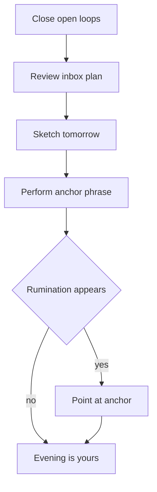

## Why this episode matters

No other episode in this track explains why your brain underperforms at work. Cal Newport, a Georgetown computer science professor and the author of Deep Work and Slow Productivity, brings numbers: how often knowledge workers check email, what each check costs, and why the modern office is a trap no individual can escape alone. Then he gives you the way out: three concrete systems for workload, planning, and ending the day. If you internalize one idea, make it this one: you do not have a focus problem. You have a switching problem.

## The core technical ideas

### Deep work: what it is and what it is not

Definition: deep work is cognitively demanding work performed in a state of focus without distraction. Newport's claim from the episode: he gets four to four and a half good brain hours per day, maximum. He does not work long hours. He protects the few hours that count.

Why focus matters comes from the deliberate-practice literature. Newport draws on Anders Ericsson: to learn something new, you must quiet the neural circuitry so you can isolate the circuit relevant to the task. If the circuitry is noisy with distraction, you cannot isolate it, and you do not get better.

Two properties follow. First, long hours are not the input. Protected hours are. Second, deep work is not pleasant. It is the state of trying to do something beyond your comfort zone, which is difficult by definition.

### The switching tax, with numbers

This is the episode's quantitative core. Newport cites data from RescueTime, a software company that measures knowledge-worker behavior: the median interval between email and Slack checks was five minutes, and the mode was one minute. Workers check constantly.

Each check is not just the seconds spent looking. Newport's model: switching the focus of attention is an expensive neural operation. When you sit down to hard work, the first fifteen minutes feel terrible. Then, after fifteen to twenty minutes, the brain marshals the right semantic networks and inhibits the irrelevant ones, and you get into the groove.

So every check carries a confusion window of about fifteen minutes around it. Stack the checks every five minutes and the windows overlap completely. Newport's conclusion: the worker spends the entire day in a state of cognitive disorder, never more than fifteen minutes from the next network switch.

Figure 1. The switching tax. AI Podcast Curriculum, huberman-lab ep10 (Cal Newport, 2024-03-11). Shell 2. Count the toy. Source: original toy, from episode claims.

```
One workday: 8 hours = 480 minutes
Check interval (median): every 5 minutes -> 480 / 5 = 96 checks
Confusion window per check: ~15 minutes
Confused minutes: 96 x 15 = 1,440 minutes

1,440 confused minutes > 480 minutes in the day.
The worker never leaves the confused state.
```

Caption: AI Podcast Curriculum. Shell 2. Count the toy. Source: episode (Huberman Lab, Cal Newport, 2024-03-11).

Huberman adds the transmission analogy: shifting gears constantly burns far more fuel than cruising. His coined term for the target state is neurosemantic coherence: the relevant semantic networks are all activated, the irrelevant ones inhibited, and you grapple with the hard problem and nothing else. He contrasts it with Linda Stone's term for the disease: partial continuous attention, the constant network switching back and forth.

Decision rule from the episode: the cost of a check is not the check. It is the fifteen-minute window around it. Count windows, not seconds.

### Flow is the performance state, not the practice state

Newport picks a fight with flow, carefully. He knew both Mihaly Csikszentmihalyi and Anders Ericsson personally, and both have since died. His position: deliberate practice and flow are very different states, and Ericsson said so explicitly. Newport once titled an essay "the father of deliberate practice disowns flow."

The evidence is the professional guitarist Newport studied for a book. The guitarist's practice was all about adding 20 percent to what he could comfortably play. He concentrated so hard trying to hit a lick 20 percent faster than usual that he forgot to breathe. Every second passed slowly because the work was incredibly difficult. That is the opposite of flow, where you lose track of time.

The mechanism: neuroplasticity needs a trigger. Discomfort, failure, and the signal that conditions changed tell the brain to rewire. Adrenaline and noradrenaline create the alert, agitated state that queues plasticity. If you can already complete the operation, there is no reason to spend energy on new wiring. Newport's summary of the neuroscience: the failures trigger the plasticity.

So flow has a place, and it is performance. It is hard to train for a sport, and then in the game you can fall into flow. It is hard to practice guitar, and then on stage the music can carry you. Flow is the feeling of performance. Getting better is the painful state that precedes it.

Trap card: chasing flow during practice. If practice feels smooth and timeless, you are probably rehearsing what you already know.

A detail worth keeping: "fire together, wire together" was said by Carla Shatz, not Donald Hebb. Newport corrects the attribution in the episode.

Figure 2. Practice vs performance. AI Podcast Curriculum, huberman-lab ep10 (Cal Newport, 2024-03-11). Shell 2. Count the toy. Source: original toy, from episode claims.

| | Deliberate practice | Flow |
|---|---|---|
| Feeling | Difficult, every second drags | Timeless, effortless |
| Target | Just beyond comfort (+20%) | Inside mastered skill |
| Trigger | Failure and discomfort | Matching skill to challenge |
| Output | Plasticity, getting better | Performance, virtuosity |
| Role | Training | The game |

Caption: AI Podcast Curriculum. Shell 2. Count the toy. Source: episode (Huberman Lab, Cal Newport, 2024-03-11).

### Active recall: the learning protocol

At 22, Newport wrote How to Become a Straight A Student after transforming his own grades. The method came from a forced experiment. He developed a heart condition, atrial flutter, a circuitry issue that could spike his heart rate toward 250 beats per minute during exercise. Beta blockers would fix the timing but cut his max heart rate, which for a rower is like playing basketball in weighted shoes. So he quit crew and decided to get serious about studying.

He systematically tested study methods like an engineer. The winner was active recall: replicate the information from scratch, as if teaching a class, without looking at your notes. For math, that meant a stack of white paper and one question: can I do this proof from scratch? If yes, the technique is learned. If no, come back later.

The properties: it is brutally hard, which is why students avoid it. It is time-efficient: four hard hours beats an all-nighter. And it sticks: the material comes out almost fully formed on the test, like a pseudo-photographic memory.

Huberman's version of the same protocol: read the material, step away, try to recall specific elements from memory, then go back and check what you missed. He learned neuroanatomy this way, flying through circuits in his mind each evening and checking the textbook only where he got stuck.

### Pseudo-productivity: the proxy that ate knowledge work

Newport's central diagnosis. Knowledge work, using your brain primarily to create value, became a major part of the economy around the mid-20th century. Every productivity definition available came from agriculture and industry: bushels of corn per acre, widgets per labor hour. Clear ratios, clear systems of production, so you could run gradient descent on the system.

Knowledge work broke the formula. Five people do five different things, each manages their own workload, and there is no number to measure. Newport's argument: the management class solved the quandary with a proxy. In the absence of something quantitative, use visible activity as a proxy for useful effort. He calls it pseudo-productivity: we see you doing things, and more visible doing looks better.

Then came the front-office IT revolution: computers, networks, email, then Slack, then smartphones. Pseudo-productivity turned out to be unsustainable in that context, because now you can demonstrate effort at very fine grain, everywhere, all day. Send an email, jump on a thread, reply at midnight. The wheels came off in the early 2000s and the damage peaked in the pandemic: knowledge-worker burnout, exhaustion, and nihilism.

You can see the shift in the productivity books. Early 1990s, Stephen Covey: optimistic, self-actualize, choose the most meaningful activities. Early 2000s, David Allen: overwhelmed, churn through tasks, find small moments of calm. Ten years apart. What changed between them was email.

### Burnout is overhead plus absurdity

Newport's burnout model has two parts. The quantity part is real: workloads grow because communication is low friction and everyone wants to demonstrate activity. Every yes brings administrative overhead. More and more of the day feeds the overhead: emails about the commitment, meetings about the commitment. That means talking about work instead of doing it. Then people recover the time at night, so the hours grow too.

The psychological part is worse. Workers spend six hours in meetings and check email every two minutes, doing very little high-value work, and everyone knows it. Newport's point: everyone knows the setup is stupid, but no one says the emperor has no clothes. The absurdity of the situation creates as much burnout as the hours do. The poet David White's line, which Huberman brings in: the cure for burnout is wholeheartedness. That means full commitment to something you actually want to do.

Huberman tells his own version of the hours trap. In graduate school he heard about a student who worked a hundred hours a week, decided to log 102 himself, and ended up with the flu and an autoimmune condition he never had before or since. The lesson: you can destroy yourself simply by working more, even if the work is deep.

### Email is a suboptimal Nash equilibrium

This is why individuals cannot fix it alone. When low-friction digital communication entered the office, a consensus emerged: collaborate through ad hoc messaging. It was convenient and the activation cost was low. But every thread has time sensitivity, so you must keep checking the inbox to keep the gaps small. The checking is not a habit failure or a moral failure. It is necessitated by the system.

Newport's game-theory frame: the current configuration is a suboptimal Nash equilibrium. The utility of this arrangement is low, but no single individual can deploy a different strategy and get a better outcome. If you check email less, you just slow everything down. The only escape is an expensive top-down change to the rules of the game: the organization itself must change how collaboration works.

That is why, Newport says, email is a harder problem than social media on the phone. Your phone habits are yours to change. The hive mind at work is systemic.

Newport tells the story of a law firm where the disagreeable lawyers got asked to do less non-promotable work, which left them more time for deep work, which got them promoted faster. The firm accidentally built a fast track for its most disagreeable employees, in a job where partnership needs agreeableness. Leave the system haphazard and it selects for the wrong traits.

The hopeful note: AI may eventually take the burden of back-and-forth planning once it gets planning capabilities. But Newport thinks cultural shifts suffice: "you could solve this tomorrow."

### TikTok purified the algorithm

Newport's analysis of TikTok is the episode's best AI-adjacent section. People assume TikTok won through an algorithmic breakthrough. He argues the machine learning underneath is probably a standard multi-armed bandit with intermittent reinforcement. The innovation was subtraction: TikTok cleared out all the legacy noise. Facebook and Instagram must satisfy the social graph, friends, groups. TikTok threw that away and optimized one number: dwell time, how long you watch before you swipe.

Every video becomes a point in a high-dimensional semantic cloud. Show, swipe, show, swipe. Within a couple of hours the bandit homes in on the sub-regions that tickle your particular brain. And it is cybernetic: you are both the user and the content creator, getting immediate feedback on what works, so the system finds the rich regions fast.

The strategic consequence: TikTok destabilized the whole social media order. The incumbents' moat was the social graph, built over a decade, impossible to replicate. By copying TikTok's pure-algorithm model, they gave that moat away. Now it is a free-for-all for attention, with no first-mover advantage left.

Figure 6. How TikTok won. AI Podcast Curriculum, huberman-lab ep10 (Cal Newport, 2024-03-11). Shell 2. Count the toy. Source: original toy, from episode claims.

| | Old social model | TikTok purified model |
|---|---|---|
| Objective | Many: friends, groups, watch time | One: dwell time |
| Algorithm | Constrained by the social graph | Standard bandit, no constraints |
| User role | Consumer | Consumer and trainer |
| Moat | The social graph | None, incumbents gave theirs away |

Caption: AI Podcast Curriculum. Shell 2. Count the toy. Source: episode (Huberman Lab, Cal Newport, 2024-03-11).

Never-confuse pair: algorithmic sophistication vs objective purity. TikTok did not win with better math. It won by aiming standard math at a single number.

### The phone: cortical extension or behavioral addiction?

Huberman tells the student story: a young man said that when his phone dies he feels a physical drain in his body, and when it powers back on he feels a lift. Is the phone an extension of the brain, another cortical area holding our information? Newport sees two readings. The cyborg reading: you plug into a digital network extension of information. The pessimistic reading: it is a moderate behavioral addiction, and the feeling is a stimied dopamine response. A gambler says the same thing about the tables.

Newport leans pessimistic, for an empirical reason. People who reduced these tools in their lives do not report impoverishment on the other side. They do not say they are less mentally agile or missing out on life. They report coming out of the fog. That is not what you would expect if the phone were a genuine cognitive extension.

The cultural prediction: norms will change. Unrestricted internet before puberty is risky, and the emerging standard will be post-puberty, around sixteen, for a device with unrestricted access. The research Newport tracks since 2017 converged: this is no longer an open question among researchers.

Two refinements. First, the harms split by content and by time. Social media signals distress more for young women and girls, where the content and social comparison matter. Video games hit young men and boys more through time: staying up until 3 a.m. because the game never ends. Second, the business model is the tell. Newport's kids play Nintendo Switch: a 60-dollar Zelda game someone spent five years making, which you can only play so long before you tire. Free iPad games are engineered to be addictive because the business model needs you playing forever.

### Attention problems: malleable loops, not rewired brains

Huberman asks the sensitive question: have people built attention deficits into themselves through neuroplasticity, and are stimulants the answer? Newport's optimistic hypothesis: most subclinical attention trouble is not wholesale neural rewiring. It is a moderate behavioral addiction sitting in the malleable reward-cue circuits, the part of the brain designed for rapid learning about the environment. Malleable means it changes back.

The fix is the same class of training used for any behavioral loop: boredom exposure. Feel the urge to check and do not act on it. Use blocking apps. It is painful and takes about two months. Then it gets better.

The exception that worries both of them: young people who grew up inside the distracted world. A young brain optimizes for the conditions it is in. Huberman's analogy: raise an animal in an altered visual environment and its visual system calibrates to the distortion. Ten to fifteen years of the funhouse mirror may have built something deeper. That can still be rescued, with discipline, tools, protocols, sleep, and where truly needed, prescription drugs. But it is the real concern.

### The cognitive revolution

Newport's proposal, half-serious: universities should become citadels of concentration. In a Chronicle of Higher Education piece titled "Is Email Making Professors Stupid," he argued that the top of the contract should read: you will not be assigned an email address. Nobel laureates would move for that.

The economic frame: knowledge-work organizations hold one main capital asset, the brains under employment contract. Nobody maintains them. Newport's image: a car factory spends 20 million dollars on a German robot and then lets it rust and drop doors. We do that to brains every day. When the cognitive revolution comes, treating brains as the equipment they are, he estimates a trillion-dollar GDP gain, on the scale of the assembly line's tenfold productivity jump in manufacturing.

The personal version of the same argument is the silver lining. Almost nobody takes their brain seriously as an organ. If you are one of the few who does, you get an immediate advantage over everyone around you. David Goggins' line, quoted in the episode: "it's easy nowadays to be exceptional because so many people are just distracted."

Newport lived the social cost himself. He lasted one day as a fraternity brother: one meeting, with its rituals and hangovers, and he walked away to protect his writing. He says it left him isolated, and that you eventually find the other nerds. His other line on the same theme: he does not think he has the highest horsepower brain. He just cares more about extracting the most from it.

### Environments engineered for depth

Newport runs his life like a lab for this. The details from the episode:

- No social media at all. Without engineered attention traps, the smartphone becomes a useful tool again: a nice phone, music, maps. Texting exists but he is notorious for text bankruptcy, declaring it a few times a day because he goes hours without looking.
- Two offices. The library has no permanent technology: no computer, no monitor, no printer, no phone. A custom desk, curated books, a fireplace. Entering the room is a ritual that switches on centuries-old patterns of thinking.
- The phone never comes near deep work. Huberman's version: he once gave his phone to a lab member and promised 100 dollars to everyone in the lab if he asked for it back before 5 p.m. Nobody got paid.
- Whiteboards for hard thinking. At MIT's theory group, two or three people at one whiteboard gave a 20 to 30 percent concentration boost, because letting your attention wander carries a social cost. The 300-million-dollar Stata Center for computer science: the thing they were proudest to show off was the whiteboard coverage. Newport's analogy: a good whiteboard is to a theoretician what a radio telescope is to an astronomer.

- Huberman's fantasy, which the episode validates: a video window of strangers doing deep work in silence, no communication allowed, just the social pressure of parallel effort. He would pay for it. Newport notes that multiple companies now sell exactly this.
- Serious notebooks. A 70-dollar archival lab notebook, used for two years, held the core ideas of seven peer-reviewed papers or funded grants. A nice notebook makes you take the thinking seriously, the way a whiteboard's imagined audience does.
- Capture in the final tool. Ideas for articles go straight into Scrivener, the writing software. Proof ideas move from paper into LaTeX, the math typesetting system, as fast as possible. Skip the middleman system.
- Walking for ideation. Newport does his original focused thinking on foot, a practice he calls productive meditation: hold the problem in mind while walking and practice bringing attention back to it. It trains working memory. Thoreau-style walks with nothing but nature observation let the hippocampus process what the whiteboard started. Fire is for reading: the pseudo-random flicker sparks serendipitous connections.
- No music with lyrics while working. Silence or background noise. He met a novelist who writes a million words a year blasting Metallica in NASCAR earphones, which proves filters can be trained, but Newport prefers the lack of stimuli.
- Audiobooks split by genre. Fiction works fine as audio. Non-fiction does not, because Newport reads to hunt for connections and ideas, which needs a variable pace and the freedom to re-read. Huberman agrees: non-fiction needs notes and a visible spatial layout.

### The void, and the experiment that proved it

Why is it so hard to quit? Newport's answer: social media papers over the void. The void is unmet potential, unmet interests, life misaligned with what you care about. The tools give a simulacrum of meeting real needs: texting and comments simulate connection just enough that you do not feel hopelessly lonely. Posting simulates creation just enough that intentions feel manifest. It is good enough to keep life tolerable.

The evidence is his 30-day experiment with 1,600 people, run for a book. Everyone quit all social media for 30 days. The white-knucklers, who just tried to stop because it was bad, failed within days. The succeeders aggressively built alternatives from day one: new hobbies, exercise, libraries, scheduled time with friends. Fill the void first, and the tools become unnecessary.

The vocabulary matters. Newport names two effects of constant input. Solitude deprivation: his definition is not physical isolation but the absence of stimuli created by other human minds. Processing another mind's output is cognitively expensive, all hands on deck, and smartphones made it possible to never leave that mode. The result looks like rising anxiety, and some of it is brain exhaustion.

The positive side is the gap effect. During pauses, the hippocampus replays recent learning, sometimes in reverse, at 20 to 30 times neural speed, the same replay seen in sleep. Practice piano scales, stop on a buzzer, do nothing, and the replay accelerates learning. Huberman's reframe: stop calling it boredom. The pause is accelerated neuroplasticity, and checking the phone during it kills the effect.

Newport's standing advice, from the "embrace boredom" chapter of Deep Work: twenty minutes a day of chosen non-stimulation, plus a longer session weekly. Not because boredom is laudable. It is an evolutionary cue to leave the state. But tolerating it breaks the Pavlovian loop that says boredom means phone.

### The top three systems

Huberman asks for three wishes. Newport gives three systems.

System one: a pull-based workload. Keep an active list of two to three things you work on right now. Everything else sits in an ordered queue below. When you finish something, you pull the next item up. The rule that makes it work: no meetings and no emails about anything in the queue. People add information to the card (Newport uses Trello, the virtual index-card service) and wait until it goes active. Huberman once heard email described as a public to-do list, which scared him about email in a way nothing else had. This kills the administrative overhead that generates most daily distraction, because overhead comes from things you agreed to do.

Figure 3. Push vs pull workload. AI Podcast Curriculum, huberman-lab ep10 (Cal Newport, 2024-03-11). Shell 2. Count the toy. Source: original toy, from episode claims.

| | Push (the default) | Pull (the system) |
|---|---|---|
| Who loads work | Anyone, any time | You, from the queue |
| Active items | Unlimited | 2 to 3 |
| Queued items | Generate meetings and emails | Silent until pulled |
| Result | Overhead grows forever | Overhead only on active work |

Caption: AI Podcast Curriculum. Shell 2. Count the toy. Source: episode (Huberman Lab, Cal Newport, 2024-03-11).

System two: multiscale planning. Plan at three scales. Seasonal or quarterly: the big objectives. Weekly: free-form text, confront the actual calendar, cancel things to free mornings for what matters. Daily: time blocking, where every minute of the workday gets a job. Communication gets its own block, so the rule is simple: follow the blocks. Newport draws thick dark boxes around deep-work blocks, which creates a visual record of how much deep work actually happened. Flip through the planner and count the dark blocks.

Figure 4. Multiscale planning. AI Podcast Curriculum, huberman-lab ep10 (Cal Newport, 2024-03-11). Shell 3. Apply the one rule. Source: original toy, from episode claims.

```
SEASON (quarterly): big objectives, deadlines on the horizon
   |
   |  trickle down each week
   v
WEEK (free-form text): confront the calendar, cancel to free mornings
   |
   |  trickle down each day
   v
DAY (time blocks): every work minute gets a job, dark blocks for deep work
```

Caption: AI Podcast Curriculum. Shell 3. Apply the one rule. Source: episode (Huberman Lab, Cal Newport, 2024-03-11).

System three: a shutdown ritual. At day's end, close the open loops: review the inbox, the plan, the calendar. Make sure nothing urgent is unhandled and nothing important lives only in your head. Get a sense of tomorrow. Then perform a demonstrative anchor: Newport used to say "schedule shutdown complete" out loud. Now he checks a box in his planner. The anchor is cognitive behavioral therapy. When work rumination appears after hours, you do not argue with it. You point at the anchor: I checked the box, which means I verified the plan, so I am done.

Figure 5. The shutdown ritual. AI Podcast Curriculum, huberman-lab ep10 (Cal Newport, 2024-03-11). Shell 3. Apply the one rule. Source: original toy, from episode claims.



Caption: AI Podcast Curriculum. Shell 3. Apply the one rule. Source: episode (Huberman Lab, Cal Newport, 2024-03-11).

Around these sit the supporting rules. Fixed-schedule productivity: Newport stops work at 5:30 p.m., a commitment held since his early twenties. The constraint forces innovation instead of throwing hours at problems. Think in decades, not Tuesdays: what do you want your 30s to produce? Then a bad Tuesday stops mattering. Measure quality reps, not quantity: like weightlifting, what counts is time under load on the thing you care about.

For organizations: hybrid work should synchronize schedules, with at-home days meaning no meetings and no email, so home becomes the deep-work zone. Remote work can be fantastic but only restructured: software developers proved it pre-pandemic because agile systems defined the work, the assignment, and the collaboration cadence. The Zoom era inflated a five-minute hallway chat into a thirty-minute meeting. Microsoft data showed a 22 percent increase in meetings from 2020 onward. That is time that vanished into talking about work.

The meta-benefit of all of it: reputation buys autonomy. People do not actually want your accessibility. They want clarity that things are handled. Accessibility is born from lack of trust. When you visibly have your act together, colleagues grant you the space to keep it together.

Two human details close the episode. Newport brings one deep, non-urgent project and a notebook on every vacation, because without writing and thinking he gets cognitively antsy. And texting is a logistical tool, not a conversational one: "what restaurant are you at" is a job for text. Real talk is a phone call.

## Q&A

1. Explain like I am new: what is pseudo-productivity?
When factories made widgets, productivity was easy to measure: widgets per labor hour. Knowledge work has no such number, because everyone does different things. So managers substituted a proxy: visible activity stands in for useful effort. That proxy is pseudo-productivity. Email and Slack then let everyone demonstrate visible effort at fine grain, all day, everywhere, which is why inboxes replaced work.

Follow-up: why did it get worse after the early 2000s? The front-office IT revolution. Before email, demonstrating effort meant being seen at the office. After email, you could demonstrate it from home at midnight.

2. Walk me through the switching tax with the episode's numbers.
RescueTime measured knowledge workers checking email and Slack every five minutes at the median, every one minute at the mode. Each check forces a network switch in the brain, and it takes fifteen to twenty minutes to marshal the right semantic networks and settle in. So every check carries roughly a fifteen-minute confusion window. Ninety-six checks in an eight-hour day times fifteen minutes equals 1,440 confused minutes, more than the day contains. The worker never escapes the confused state.

Follow-up: what is the fix, in one move? Stop the checks from fragmenting the day: batch communication into its own time block and keep the phone out of the room during deep blocks.

3. Why is deliberate practice the opposite of flow?
Flow is timeless and effortless: skill meets challenge and time disappears. Deliberate practice is difficult and slow: you work 20 percent beyond comfort, every second drags, and you may forget to breathe. The difference is functional. Flow is the performance state, the game. Deliberate practice is the training state, and its discomfort is the trigger for neuroplasticity. If practice feels like flow, you rehearse, not improve.

4. What is the suboptimal Nash equilibrium of email, and why can an individual not fix it?
Ad hoc messaging became the organization's collaboration system. Every thread is time-sensitive, so everyone must keep checking to keep the gaps small. The arrangement has low utility, but no individual can unilaterally do better: checking less just slows your threads down. Game theory calls this a suboptimal Nash equilibrium. Only a top-down rule change, the organization changing how it collaborates, breaks it.

5. How did TikTok win without an algorithmic breakthrough?
The machine learning underneath is probably a standard multi-armed bandit with intermittent reinforcement. The breakthrough was subtraction. TikTok dropped the social graph and all legacy obligations and optimized a single number: dwell time. Videos became points in a semantic cloud, and swipe feedback let the bandit find each user's addictive sub-regions within hours. The loop is cybernetic: the user is also the content creator, training the system with every swipe. Incumbents copied the model and gave away their social-graph moat.

6. Explain the three systems and when each one runs.
Pull-based workload runs continuously: two to three active items, an ordered queue below, no meetings or emails about queued items. Multiscale planning runs on three cadences: seasonal for objectives, weekly for confronting the calendar, daily for time blocking every work minute. The shutdown ritual runs once per day at day's end: close loops, sense tomorrow, perform the anchor phrase or checkbox. Together they cover what you work on, when you work on it, and when you stop.

7. Applied: redesign your tomorrow with the three systems.
Tonight, write your pull list: the two or three work items that are active, and the ordered queue beneath them. In the morning, time-block the workday: every minute gets a job, communication gets exactly one block, deep work on your most important item gets the first dark block. At 5:30, run the shutdown: review inbox and calendar, confirm nothing is only in your head, sketch tomorrow, then say your anchor phrase or check the box. When rumination comes at dinner, point at the anchor and let it go.

## Memory aids

Mnemonic: PPS. The three systems: Pull-based workload, Planned scales (multiscale planning), Shutdown ritual.

Never-confuse pairs:
- Deep work vs flow. Deep work: difficult, beyond comfort, the training state. Flow: effortless, inside mastery, the performance state.
- Pseudo-productivity vs productivity. Pseudo: visible activity as a proxy. Real: progress on the thing that matters.
- Push vs pull workload. Push: anyone can load work onto you at any time. Pull: you hold two to three active items and pull from an ordered queue.
- Boredom vs gaps. Boredom: the evolutionary cue to leave the state. Gaps: the pause during which the hippocampus replays and consolidates.
- Phone as extension vs phone as addiction. Extension: the cyborg story. Addiction: the gambler story. The fog test decides: quitters report clarity, not loss.

Trap cards:
- Flow is how you get better. Trap. Flow is performance. Deliberate practice is pain, and pain is the plasticity trigger.
- Checking email constantly is a willpower problem. Trap. It is a systemic Nash equilibrium. Willpower cannot beat the incentive structure.
- TikTok won with better machine learning. Trap. Standard bandit, purified objective. Subtraction beat sophistication.
- Longer hours mean more output. Trap. Newport caps at four to four and a half good brain hours. Burnout is overhead plus absurdity, not hours.
- Kids need phones for emergencies. Trap. Everyone survived without them until about fifteen years ago. The norm, not the emergency, is the question.
- Stimulants fix distraction. Trap. Most subclinical attention trouble is a malleable reward loop. Boredom exposure and removing the stimulus fix the loop.

## How to imbibe this

1. Time-block one full workday this week. Every minute of the workday gets a job. Communication gets exactly one block. At day's end, count your dark blocks of deep work. That count is your real output metric.
2. Move the phone to another room for one 90-minute deep block. Notice the first fifteen minutes: the terrible feeling is the network switch completing. Notice what happens after twenty.
3. Write your shutdown anchor tonight: a phrase you say or a box you check. When work rumination appears after hours, point at the anchor instead of arguing with the thought.
4. Start a pull list: two to three active items, everything else in an ordered queue. This week, hold one rule: no meetings and no emails about queued items.
5. Reverse-engineer your distractions. List everything you would suggest to a competitor to waste their time, from addictive shows to endless feeds, then check which ones you still do yourself. Your opponent is the distracted version of you.

Observable behavior change: your calendar shows dark blocks, your phone lives in another room during deep work, and evenings belong to you.

How to catch yourself violating it: you catch yourself checking email between tasks "just in case." Name it: a network switch with a fifteen-minute price tag.

## Think it yourself

Unaided level. First principles. No handrails.

1. Pseudo-productivity arose because knowledge work had no measurable output. Prove that any proxy metric for knowledge work eventually becomes the work itself. Use the episode's email example, then test your proof against a second proxy of your choice.
2. The email equilibrium is suboptimal, yet stable. Design a top-down rule change that breaks it, and argue why it would survive contact with a real company. Then argue the strongest case for why it collapses back within a year.
3. TikTok purified its objective to dwell time and found the addictive region fast. Argue that any single-objective optimizer over human attention converges to addiction. State the constraint you would add to the objective, and name exactly what it would cost the company.
4. Newport claims subclinical attention issues are malleable loops, fixable by removing the stimulus. Argue the strongest case that he is wrong about young people, using Huberman's visual-system critical-period analogy. Then state the experiment that would settle it.
5. Fermi-style: RescueTime's median check interval is 5 minutes and each check costs a 15-minute confusion window. In an 8-hour workday, how many minutes are spent in the confused state? (Worked: 480 / 5 = 96 checks. 96 x 15 = 1,440 minutes, which exceeds the 480-minute day. Conclusion: the state never clears.) Now assume batching cuts checks to 4 per day. Recompute, and state what the freed capacity is worth.

## Skills you can now use

- Compute the switching tax on any workday from check frequency.
- Run a pull-based workload: two to three active items, an ordered queue, no overhead on queued work.
- Build a multiscale plan: seasonal objectives down to daily time blocks.
- Perform a shutdown ritual that stops after-hours rumination.
- Explain pseudo-productivity and why email and Slack made it worse.
- Distinguish deliberate practice from flow and design a practice block at +20 percent.
- Learn anything fast with active recall.
- Argue the phone addiction case with the gambler analogy and the fog reports.
- Design a hybrid-work rule set that protects deep work.
- Diagnose burnout as overhead plus absurdity, not hours.

## Go deeper

- Deep Work, the book at the center of the episode: https://en.wikipedia.org/wiki/Deep_Work
- Cal Newport's books and writing: https://www.calnewport.com/books/deep-work/

## Page audit

| Unit id | Claim | Before | After | Figure id | Medium | Source |
|---|---|---|---|---|---|---|
| u01 | Switching tax | Checks cost seconds | Checks cost 15-minute windows | f01 | ASCII | original toy, episode |
| u02 | Practice vs flow | Flow is the goal | Practice is pain, flow is performance | f02 | Table | original toy, episode |
| u03 | Push vs pull | Anyone loads work | Pull from the queue | f03 | Table | original toy, episode |
| u04 | Multiscale planning | One scale at a time | Season, week, day cascade | f04 | ASCII | original toy, episode |
| u05 | Shutdown ritual | Argue with rumination | Point at the anchor | f05 | Mermaid | original toy, episode |
| u06 | TikTok model | ML breakthrough | Standard bandit, purified objective | f06 | Table | original toy, episode |

Chapter plate: one claim. Protect the four and a half hours.

```
LEFT: cost without the rule
  - 96 checks a day, 1,440 confused minutes
  - pseudo-productivity: visible effort everywhere
  - email Nash equilibrium no one can leave
  - burnout from overhead plus absurdity

CENTER: the stored object
  - pull-based workload: 2 to 3 active, ordered queue
  - multiscale planning: season, week, day
  - shutdown ritual: close loops, anchor, stop

RIGHT: cost with the rule
  - 4 to 4.5 good brain hours, protected
  - dark blocks you can count
  - evenings belong to you
  - reputation buys autonomy

FOOTER: the tradeoff in one line.
  Stop demonstrating work. Start doing it, then stop for the day.
```

## Coverage notes

Source: research/huberman-lab/transcripts/p4ZfkezDTXQ.txt (auto-generated captions, cleaned. The manual and auto caption tracks were identical). Sponsor segments (Helix, Maui Nui, Joovv, AG1, Element) carry no informational content and are excluded. All numbers are from the episode: RescueTime 5-minute median and 1-minute mode, 15-minute confusion window, 20 to 30 percent whiteboard boost, 4 to 4.5 brain hours, 5:30 p.m. cutoff, 1,600-person experiment, 22 percent Microsoft meeting increase. The TikTok algorithm analysis is Newport's stated understanding ("as far as I understand," "we think"), marked as such in the chapter. The "trillion-dollar GDP" figure is Newport's estimate, labeled as his.
