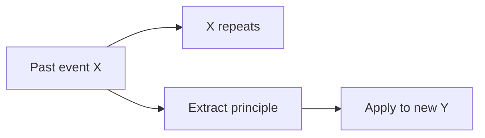
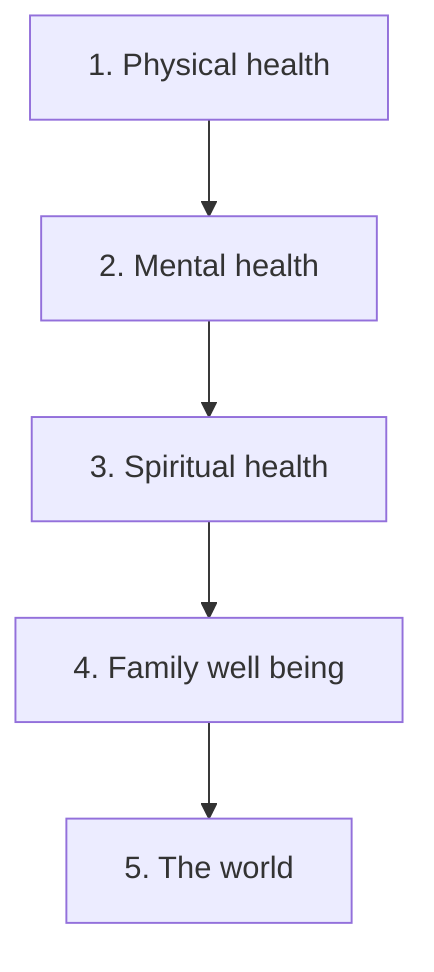

## Why this episode matters

This is the most-viewed episode of The Knowledge Project: 763,971 views as of October 2026. It runs over two hours. It anchors the whole track. Every later episode adds one instrument to an orchestra that starts here. The central claim: you can train yourself to see reality more clearly, decide more rationally, and need less. No other episode in the track covers all four moves: reading, deciding, unlearning habits, and redefining happiness.

Naval Ravikant is the CEO and co-founder of AngelList. The episode intro notes he invested in more than 100 companies, including Uber and Twitter. He calls himself, in effect, a rational Buddhist. That pairing is the thesis of the episode. Evolution explains why your mind works the way it does. Buddhism trains the internal state. Neither requires belief in anything you cannot verify yourself.

## Reading: the foundation

### Read like a free person

Naval was a latchkey kid in New York City, raised by a single mother who worked multiple jobs and went to school at night. After school he went straight to the library and stayed until it closed. Reading was his first love.

Definition: a latchkey kid is a child who comes home to an empty house after school because the parents are at work.

The key accident: nobody forced him to read anything. He read comic books, mysteries, fantasy, science fiction, science, mathematics, philosophy. He calls the early material mental junk food. He argues the ladder works: start with junk, develop the taste, climb. Parents and teachers who ban the junk food often kill the habit itself. The habit is the whole game.

Decision rule from the episode: never force the reading list. Let curiosity set the order. Interest is the engine. Force is the brake.

### Treat books like blogs

In the late 1990s Naval noticed he read fewer books and more blogs. Blogs gave him smart people distilling ideas into a few pages. The Kindle let him treat books the same way. He skims, jumps forward and back, reads only the interesting part, and drops the book without guilt. A book is a blog archive: you read the 5 posts you need out of 300.

Why this works: most nonfiction books carry one good idea wrapped in hundreds of pages of examples. He reads two chapters, takes the idea, and stops. He estimates he skips two thirds of most books. He also drops a book fast if the author makes a claim he knows is false. His test: if the author says thermodynamics is not true, close the book. You can no longer separate truth from fiction inside it.

Failure mode: the social rule that you must finish books. Friends tell him they started a book. Ask again in a month. They are still on the same book. They are not reading. The rule killed the habit.

### One hour a day puts you in the top 0.1 percent

Naval says he reads one to two hours a day. He estimates that alone puts him in the top 0.1 percent of readers. He credits reading for any material success and intelligence he has. Most people read a minute a day or less, in his estimate.

Figure 1. Reading time and rank, per the episode. AI Podcast Curriculum, ep01 (Naval Ravikant, 2019-08-17). Source: original toy, from episode claims.
| Daily reading | Naval's estimate of your rank |
|---|---|
| ~1 minute or less | Average person |
| 1 to 2 hours | Top 0.1 percent |

The argument has a second half. He spends about ten times more on books than he finishes. He might buy 200 dollars of books and read 20 dollars worth. That is a 10 percent completion rate. He calls every dollar an investment, not an expense. A 10 or 20 dollar book can change a life. The habit matters, not the completion rate.

Decision rule: the best book is the one you will actually read every day. This matches the workout rule: the best workout is the one you will do daily. Method debates miss the point. Daily execution is the point.

### Notes are optional. Distillation is the note.

Naval does not take notes. He compares note-taking to a tourist with a camera on a trip. Both pull you out of the present moment. Nobody reviews trip photos years later. His note-taking is Twitter: when an insight strikes, he distills it into 140 characters and posts it as an aphorism. Strangers attack the exceptions. The attacks sharpen the idea.

He highlights passages in the Kindle. Rarely, he rereads the highlights of a favorite book until one passage pulls him back in. He says stopping highlights tomorrow would change nothing. The absorption happens at a deep level. He often cannot quote a passage. The ideas weave into his thinking anyway.

Practical skill: the distillation test. If you cannot compress an idea into one short post, you have not absorbed it. Compression is the test of understanding.

## Decision making: models over prediction

### Your brain is a memory-prediction machine

Definition: a memory-prediction machine takes memories of what worked in the past and projects them onto the future.

The lousy version of prediction: X happened before, so X will happen again. That version keys on specific circumstances. The better version: extract principles. Principles transfer across circumstances. Specifics do not.

This is where mental models enter. A mental model is a reusable principle about how the world works. Naval loads his head with models from evolution, game theory, and Charlie Munger. Munger was Warren Buffett's partner. Different situations call up different models. He does not run a checklist. The models fire by pattern match.

Figure 2. Two ways to predict. AI Podcast Curriculum, ep01 (Naval Ravikant, 2019-08-17). Source: original toy, from episode claims.

One claim per plate. The arrow from C to D is the rule: principles transfer, specifics do not.

### Delete options instead of predicting outcomes

Naval believes humans are ignorant and bad at predicting the future. He does not try to say what will work. He tries to eliminate what will not work. Success is not making mistakes, not making brilliant calls.

The arithmetic of the multiplier: someone who decides correctly 80 percent of the time, versus 70 percent, gets paid hundreds of times more. With modern technology, one decision reaches billions of people and dollars. Ten extra points of accuracy on a billion-dollar decision is worth a hundred million dollars. Small accuracy gains compound through a large multiplier.

His investing system applies this. He does not try to pick 10 winners from 100 companies. He looks at 10,000 companies, picks 500 that have a shot at being huge, and keeps the option to double down on the 5 winners. Individual decisions matter less. The system makes the outcome likely across many universes.

Definition: an asymmetric bet risks little on the downside and keeps large upside. Angel investing loses 1X on the downside and can make 10,000X on the upside.

Figure 3. The funnel system. AI Podcast Curriculum, ep01 (Naval Ravikant, 2019-08-17). Source: original toy, from episode claims.
| Stage | Count | Rule |
|---|---|---|
| Companies seen | 10,000 | Look widely |
| Funded with a shot | 500 | Keep optionality |
| Winners doubled down on | 5 | Let winners run |

### Systems beat goals. Being you beats copying.

Naval sets systems, not goals. A goal is a target. A system is an environment where success is statistically likely. He asks: in a thousand parallel universes, in how many is this version of Naval successful? He wants 999 out of 1,000. He does not want to be the most successful person on the planet. He wants to be the most successful version of himself with the least effort.

He rejects checklists borrowed from others. Checklists built on someone else's life make you a worse version of them. Nobody beats you at being you. Your combination of DNA, development, knowledge, and desire is unique. The task is to find the people, business, and project that need exactly that combination.

Steve Case said vision without execution is hallucination. Naval applies it to founders. The best founders combine three things: deep understanding of the space, passion that survives a decade, and execution skill. Steve Jobs did not invent the smartphone idea. Many people had it. He had a high design bar, understood manufacturing, rallied resources, took a 1 dollar salary, and kept going until it worked. Ideas are commodities. Judgment plus execution is rare.

## Habits: the operating system

### You are your habits, so audit them

Humans are creatures of habit. A child is born with almost no habits. Habits form by conditioning. Good habits let you background-process routine things. That frees the conscious mind for new problems.

The trap: you bundle accidental habits into identity. "I am Shane, this is the way I am." A habit picked up as a toddler to get parental attention becomes a personality trait at 40. Naval's practice: uncondition. Take each habit apart. Ask: is it serving me now? Is it making me happier, healthier, closer to what I want? Keep it or drop it on evidence, not on history.

Definition: unconditioning means deliberately examining a habit and deciding whether to keep it, instead of inheriting it forever.

### You can break habits. Desire is the fuel.

A popular book claims you cannot break habits, only replace them. Naval calls that false. He says he broke habits completely. It takes work and effort. Big habit changes need strong desire attached.

His case study: alcohol. Two roots: availability (out at night where alcohol is served) and desire (drinking to survive social situations he was not enjoying). He cut it by attacking both. The morning workout became a checkpoint. Drink at night, and the next morning's workout is measurably worse. The checkpoint made the cost visible daily. Then he asked why he drank: to numb his brain in rooms he disliked. Fix: stop attending those rooms. Narrow the friend circle to people he can be around sober. Substitution helped too: red wine is self-limiting for him. Two glasses give him a headache. Two cocktails invite a third.

He rejects absolute words like never and always. Absolutes are a straitjacket. He wants to be naturally in a position of not needing it, not white-knuckling a rule.

### Priority is a number, not a list

"I do not have time" means "it is not a priority." If something is your number one priority, you find the time. If you carry ten to fifteen fuzzy priorities, you get none of them.

Naval made physical health his number one priority. Above happiness, family, and work. Then mental health. Then spiritual health. Then family well-being. Then the world. Concentric circles, starting with himself. Because health is number one, he never skips the morning workout. The world can wait 30 minutes.

His trainer's line: easy choices, hard life. Hard choices, easy life. Eat the junk now, pay with sickness later. Do the hard workout now, live easy later. The same applies to values, saving, and relationships.

Figure 4. The priority circles. AI Podcast Curriculum, ep01 (Naval Ravikant, 2019-08-17). Source: original toy, from episode claims.

## The mind: servant, not master

### Run your brain in debug mode

Naval's big project: turn off the monkey mind. The monkey mind is the internal voice that narrates, judges, replays yesterday, and rehearses tomorrow. As children we lived in the moment. At puberty, desire arrives. We start long-range planning. Planning builds identity and ego. The voice takes over. Walk down a street of 2,000 people. He estimates all 2,000 talk to themselves in their heads.

Try suppression and you fail. The mind suppressing the mind is a game. Tell yourself not to think of a pink elephant. You just did.

His method: run the brain in debug mode. Definition: debug mode means watching your thoughts as they pass, like a programmer watching instructions execute, and questioning each one.

His example: brushing his teeth, he caught himself rehearsing the podcast in a fantasy. He asked: why am I future-planning? Can I just brush my teeth? He went back to the toothbrush. Noticed how good it felt. Then caught the next thought. He estimates 95 percent of what the brain runs off to do does not need tackling at that moment.

### Awareness is the OS. The monkey mind is an app.

Think of the brain as layered. The base kernel is awareness: calm, peaceful, content. Applications run on top. The monkey mind is an application: worried, frightened, anxious. Useful for survival and problem-solving. Terrible as a 24/7 master.

Spirituality, in his reading, teaches one thing: you are more than your mind. You are more than your habits and preferences. You are the awareness underneath. Modern humans live in the internal monologue, which society programmed into them. DNA plus childhood environment wrote the program. Preferences recorded as good or bad became runaway trains controlling your mood.

He wants the trains to weaken with age, not strengthen. Then he can accept nature as it is instead of chasing happiness through external circumstances.

### Meditation shows you the mad monkey

Meditation does not give you control on day one. Its first gift is a diagnosis. You sit for 30 minutes and discover your mind is a monkey flinging feces around a room. Uncontrollable. Once you see the mad creature, you start separating from it. Separation is liberation.

Practical protocol from the episode: if you get an angry email, do not respond for 24 hours. Emotions subside. Hormones drop. The response you write tomorrow comes from a better state. He reports most people already know this. Society rewards the external games (fitness, money) and ignores the internal one. Happiness is a single-player game. You are born alone. You die alone. Your interpretations are alone. Three generations later, nobody cares.

Warren Buffett's test for inner versus outer scorecard: would you rather be the world's best lover and known as the worst, or the world's worst lover and known as the best? Your answer reveals which scorecard you play for.

## Happiness: the absence of desire

### Happiness is the default state

Naval's current definition: happiness is what remains when you remove the sense that something is absent. When nothing is absent, the mind stops running to the future or the past. You get internal silence. In that silence you are content.

The subtlety: positive thinking is not the path. Every positive thought contains a negative one. "I am happy" means "I was sad." Attractive implies unattractive. The Daodejing says this better than he can, in his words. So do not chase positive thoughts. Reduce desire, especially desire for external things. Accept the present as it is. Nature has no concept of happiness. A tree has no right or wrong. Everything follows cause and effect from the Big Bang. It is only your desires that make the moment wrong.

Trap: the moment you say "I am happy, I want to stay happy," you lose it. The mind grabs a temporary state and tries to make it permanent. Attachment restarts the motion.

### Insignificance is a relief, not a threat

If you believe you are the most important thing in the universe, the universe must bend to your will. When it does not, something is wrong. That belief manufactures suffering.

Alternative: view yourself as a microbe, your works as writing on water or castles in sand. Then you expect nothing from life. Life is the way it is. The neutral state is not bland. It is how little children live: immersed in the moment, no preferences about how things should be. Children are, on balance, happy.

### Jealousy has a test

Naval carried heavy jealousy when young. The cure was one realization. You cannot cherry-pick. You cannot take his body, her money, his personality. You must take the whole person: their reactions, desires, family, happiness level, self-image, outlook. All of it, 24/7. If you would not do a wholesale swap, jealousy has no point.

Worked example. You envy a founder's wealth. The swap test asks: do you also want his 4 a.m. anxiety, his broken marriage, his fear of losing it all, his enemies? If not, you do not want his life. You want one slice of it. The slice is not for sale separately. Jealousy dissolves.

### Freedom from beats freedom to

Young Naval valued freedom to: do anything, anytime. Older Naval values freedom from: freedom from reaction, from anger, from sadness, from being forced. Money served the first definition. It became an anchor under the second: something to fear losing, something others want from him.

His line on anger: it is a hot coal you hold while waiting to throw it at someone. Buddhist saying, in his telling. He cut angry people from his life. He does not judge them. He went through his own angry years. He just will not be around it.

## Reality: the ego blocks the signal

### Suffering is the moment you see things as they are

Definition: a moment of suffering is the moment you see reality exactly as it is, after a long period of hiding it from yourself.

Example: your business fails. You ignored the signs for months. When the truth lands, you suffer. The suffering is the truth arriving. The good news: only from the truth can you make real change.

The blocker is ego plus desire. The more you want an outcome, the less clearly you see the facts. The fix: shrink the ego, drop the desired outcome, look at the facts. Naval's business habit: acknowledge bad news publicly, in front of cofounders and friends. If you are not hiding it from others, you cannot hide it from yourself.

This explains the friends paradox. A friend's breakup looks obvious to you. Your own looks impossible to them. Same facts. Different desire. Desire collides with reality and reality loses until the suffering moment.

## Values: the non-negotiables

### Foundational values are chosen, then never compromised

Definition: a foundational value is a way of living you examined and chose, and will not compromise. Not a preference. A law.

Naval lists his. Honesty: he must be able to say what he thinks and think what he says. If he disconnects speech from thought, his mind splits into threads: what he said, what he meant, what he must remember. He leaves the moment. So he avoids people around whom he cannot be honest.

No short-term dealing. All benefits in life come from compound interest: money, relationships, love, health, habits. He only does business with long-term thinkers. If someone deals short-term with others, he will not deal with them at all.

Pure peer relationships. No hierarchy. He will not be above anyone or below anyone. If the relationship cannot be peer to peer, he skips it.

Values are how you pick people. Find people whose values line up with yours. Then the small things do not matter. When people fight about small things, the values do not line up.

### Test integrity by watching how they treat others

Warren Buffett's test for people: intelligence, energy, integrity. Integrity is the hardest to judge. Naval's method: watch how someone treats people they do not need. If a person brags to you about taking advantage of someone else, with a wink, believe the behavior, not the wink. They will redefine "friend" when it suits them.

High-integrity people have an internal compass. They avoid unfair deals because it would stain their own self-image. They could not sleep. Negotiations with them are easy: both sides give things to keep the deal fair, because unhappy deals get unwound and lose all compounding.

Telltale sign of the opposite: people who talk a lot about how honest they are. He learned this from a book called The Art of Manipulation, about con men. Cons push the deal too hard, sell too hard, and advertise their honesty. His policy: warn a friend once about a shady move. Nobody changes. Then distance himself. His rule: the closer you want to get to me, the better your values have to be.

### Explain it to a child or you do not know it

Real knowledge is intrinsic and built from the ground up. You cannot understand trigonometry without arithmetic and geometry. The mark of a charlatan: explaining simple things in complicated ways. The mark of a genius: explaining complicated things simply.

Richard Feynman's Six Easy Pieces builds mathematics from counting to precalculus in an unbroken chain. No memorized definitions. Understanding is about algorithms and connections, not names. Calling a bird by its name tells you about naming systems, not about the bird.

Randall Munroe's Thing Explainer proves the point at scale. He explains rockets, submarines, and climate using only the 1,000 most common English words. A Saturn V rocket becomes an "up goer." Children get it immediately. Naval catches himself using big words to sound smart. If the audience does not know the word and you do not correct yourself, that is dishonesty.

## Changed minds: what he stopped believing

### Macro is junk. Micro is law.

Naval studied economics and once planned a PhD in it. He now calls macroeconomics junk science. His charge: it makes no falsifiable predictions. Falsifiable means testable: a claim that could be proven wrong. You cannot run two US economies as a control experiment. So macroeconomists cherry-pick data for political narratives. Watching Fed forecasts is no better than astrology, and less entertaining.

What survives: microeconomics and game theory. Supply and demand. Labor versus capital. Tit for tat. He applies the same split everywhere. Not macro charity: micro charity. Not macro environmentalism: micro environmentalism. Not "change the world": change yourself, then your family, then your neighbor. Grand abstractions are unfalsifiable. Local action is testable.

He also stopped identifying with labels. He used to call himself libertarian. Then he caught himself defending positions he had not thought through, because they came with the package. If all your beliefs arrive in ten neat bundles, they were prepackaged. Be suspicious.

### The singularity is religion for nerds

Definition: the singularity is the idea that accelerating technology hits a point of runaway change: general AI that improves itself, immortality, the end of humanity as we know it.

Naval calls it religion for nerds. It is unfalsifiable until it happens. It has the chosen who will be saved. It promises immortality. The structure matches scripture.

His evidence: physics cannot solve the three-body problem. Three billiard balls collide and we cannot predict the outcome. We cannot model the weather next week. We cannot cure most chronic diseases. Nature's complexity dwarfs us. Current AI is data processing, not understanding: dump enough images into a network and recognition improves. The algorithms have not advanced. The brain remains far beyond our machines. He expects no singularity in his lifetime.

The deeper charge: the singularity is pernicious like the afterlife. It moves you out of the present. You live for tomorrow's salvation instead of today's reality. Hope for the future destroys happiness now.

## Meaning: three answers

Shane asks for the meaning of life. Naval gives three answers.

Answer one: it is personal. Find your own. Any wisdom from Buddha or Naval or anyone will sound like nonsense to you. The question matters more than the answer. Sit with it for years or decades.

Answer two: there is no meaning. Osho's image: life as words on water, castles in sand. You were dead for the 10 billion years before you were born. You will be dead for the 70 billion years until the heat death of the universe. Everything fades: you, the human race, the planet, the galaxy. No one remembers you past a few generations. So there is no intrinsic purpose. You must create your own meaning. And any meaning you name invites the next "why," turtles all the way down.

Answer three: maybe physics offers one, but it will not satisfy you. The arrow of time comes from entropy. Entropy only rises. Disorder increases. Concentrated energy decreases. Living things locally reverse entropy: they build order with action. But they globally accelerate entropy: the waste heat speeds the universe toward heat death. So life's cosmic role might be to speed the arrival of a uniform, indistinguishable everything. Complex systems: civilizations, art, families, computers: all push toward that state faster.

## Time: authenticate your calendar

Present Naval commits future Naval to things future Naval will hate. Present Naval is tired and wants sleep. Future Naval is imagined as energetic and eager. The fix he wants: two-factor authentication for the calendar. Every commitment gets written down, then re-checked 48 hours later. Better: only commit to what you would do right now. That is Derek Sivers' rule: accept only the hell-yes offer, and give everything else a no.

He also notes his phase: exploration is over, exploitation has begun. He is not looking for new things. The hard part is to refuse the old machine that keeps signing him up.

## Questions and answers

**Q1: Explain the whole episode to me like I am new. What is Naval actually saying?**
Four trainable moves. Read daily and let curiosity choose the books. Decide with principles instead of predictions, and build systems instead of setting goals. Audit your habits and break the ones that serve your past, not your present. Want less and the happiness you chase shows up on its own. The connecting thread: see reality as it is. Every move removes a distortion: boredom removes reading, ego removes decisions, identity removes habit change, desire removes happiness.

**Q2: Why does he say reading one hour a day puts you in the top 0.1 percent? Is that a real statistic?**
It is his estimate, not a measured statistic. Mark it [uncertain] as a precise number. The mechanism underneath is solid: almost nobody reads daily with attention. A habit almost nobody keeps is a massive edge by default. The follow-up matters more than the number: the habit beats the method. Exercise works the same way. Debating weights versus tennis misses the point if you skip both.

**Q3: Applied: I am stuck on a business book I hate. What would Naval do?**
Drop it today. He skims for the interesting part, reads that, and stops. He estimates he skips two thirds of most books. The social rule "finish what you start" is a tax on curiosity. The only exception: if the book is great, keep going. Boredom is data. It tells you the book delivered its one idea or has none.

**Q4: What is the difference between his "systems" and "goals"?**
A goal is a target: become a billionaire. A system is an environment where good outcomes are likely: see 10,000 companies, fund 500 with a shot, double down on 5. Goals depend on individual decisions, and individual decisions are unreliable. Systems depend on structure, and structure repeats. His test: in how many of 1,000 parallel universes does this system make me successful? He wants 999.

**Q5: What does "run your brain in debug mode" mean in practice?**
Catch a thought and inspect it instead of obeying it. His example: brushing his teeth, he noticed he rehearsed the podcast in fantasy. He asked why. He returned to the toothbrush. That is the whole practice. You do not stop thoughts. You watch them pass and question the urgent ones. He estimates 95 percent can wait.

**Q6: Why does he say you cannot break the monkey mind by suppressing it?**
Suppression is the mind fighting the mind. It is one more thought about thoughts. Try not to think of a pink elephant. The instruction installs the image. Instead of fighting, he cultivates states that quiet the mind: presence, flow, exercise, honest conversation. You do not defeat the voice. You starve it of attention.

**Q7: What is his test for jealousy, exactly?**
No cherry-picking. You must accept the entire person: their body, money, personality, reactions, desires, family, anxiety, self-image, all of it, 24 hours a day. If you would not trade your whole life for their whole life, the jealousy is irrational. You want one slice. Slices are not sold separately.

**Q8: He says macroeconomics is junk but microeconomics is fundamental. What is the actual distinction?**
Falsifiability. Micro makes testable claims: raise the price, watch demand fall. Macro cannot run the control experiment: you cannot replay the US economy with different interest rates. Without falsifiable predictions, a field becomes politics with equations. He extends the rule: prefer the testable version of everything. Micro charity over macro charity. Change yourself before changing the world.

## Memory aids

Mnemonic for the four moves: **R-D-H-W**. Read daily. Decide with models. Habits audited. Want less.

Never-confuse pairs:
- Systems versus goals: a goal is a wish with a deadline, a system is a machine that keeps running. Naval wants the machine.
- Freedom to versus freedom from: freedom to is the young definition (do anything), freedom from is the older one (no reaction, no anger, no compulsion).
- Prediction versus elimination: predicting what will work is arrogance, eliminating what will not work is humility.
- Notes versus distillation: notes store, distillation proves you understood.

Trap cards:
- Trap: "I must finish this book." Reality: the book delivered its idea in chapter two. The rest is examples. Move on.
- Trap: "I do not have time." Reality: it is priority number nine. Either promote it to number one or admit it.
- Trap: "This external thing will make me happy." Reality: you are addicted to the desiring, not the thing. He caught himself forum-diving over a new car he knew would bore him in a week.
- Trap: "Macro forecast." Reality: unfalsifiable. Treat it as astrology with better suits.

## How to imbibe this

Concrete practices, this week.

1. Reading habit. Set a 60-minute daily reading block for 7 days. No method debates. Any material counts: books, blogs, papers. Track only whether you did it. After 7 days, decide whether to continue. Observable change: you stop discussing reading systems and start accumulating hours.
2. Book dropping. Pick the book you are stuck on. Give it 20 more pages. If nothing grabs you, shelve it today with zero guilt. Write one sentence on what its one idea was. Observable change: your "currently reading" pile shrinks and your finished-ideas count grows.
3. The 24-hour rule. The next angry or anxious email you want to answer, draft it and wait 24 hours. Then reread. Send the calmer version or nothing. Observable change: fewer messages you regret.
4. Debug mode, one session. Tomorrow morning during one routine task (shower, teeth, coffee), catch three thoughts and ask: does this need solving right now? Write down what you caught. Observable change: you notice the rehearsal habit in real time.
5. Priority audit. List your top 5 priorities. Circle exactly one as number one. For one week, that one gets the first hour of the day. Observable change: the number-one item moves, the others wait.
6. Jealousy test. Next time envy hits, run the wholesale swap: their anxiety, their marriage, their 4 a.m. thoughts, included. Write the result in one line. Observable change: envy episodes get shorter.
7. Calendar authentication. For every new commitment this week, write it down and re-check in 48 hours. Cancel anything that is not a hell yes. Observable change: fewer future obligations you resent.

## Think it yourself

Do these with your own brain before touching AI. Guided, with answers.

**Drill 1: the 10 percent rule.** Naval buys 200 dollars of books and reads 20 dollars worth. Compute his completion rate. Now compute yours: estimate what you spent on books last year and what fraction you finished. Write both numbers. Question: does a 10 percent completion rate mean the buying was wasteful? Argue both sides in three sentences each. Answer sketch: wasteful, because 180 dollars bought nothing, not wasteful, because the 20 dollars of reading may exceed the 200 in value, and optionality has value. The episode's answer: investment, not expense.

**Drill 2: multiplier arithmetic.** A fund manager runs 1 billion dollars. She is right 70 percent of the time. A rival is right 80 percent of the time. Assume each correct decision adds the same value. How many dollars of extra value does the 10-point edge create per decision cycle? Answer: 10 percent of 1 billion = 100 million dollars. Now explain in two sentences why small accuracy edges are worth more than big effort edges at scale.

**Drill 3: the funnel.** You want to find one great hire. Design a Naval-style funnel: how many candidates seen, how many interviewed, how many given a trial? Pick numbers and justify each cut with one rule. Then check: does your funnel depend on one brilliant judgment call, or on structure? Rewrite it until the answer is structure.

**Drill 4: desire autopsy.** Pick something you currently want (a gadget, a trip, a title). Write what you believe it will give you. Now write what Naval would say: you are addicted to the desiring. Describe the last thing you wanted this badly and how you felt about it one month after getting it. One paragraph. No AI.

**Drill 5: the wholesale swap.** Pick someone you envy. List five specific things about their life, including two you would not want. Would you trade your entire life for theirs, 24/7, no cherry-picking? Write yes or no and one sentence of reason. If no, write what the envy was really about.

**Drill 6: debug mode log.** For one day, carry a small card. Each time you catch yourself rehearsing a future conversation or replaying a past one, make a tick. Count the ticks at night. Write the three most common rehearsal topics. Ask of each: did this need solving today? This is the episode's toothbrush exercise, instrumented.

## Skills you can now use

- Drop any book guilt-free after extracting its one idea, and name that idea in a sentence.
- Convert a prediction problem into an elimination problem: list what will not work before guessing what will.
- Run the wholesale-swap test on any envy in under a minute.
- Apply the 24-hour rule to emotional messages.
- Audit a habit with the unconditioning question: does this serve my present or my past?
- Distinguish a system from a goal and redesign any goal as a system with a funnel.
- Catch the pink-elephant failure: notice when you suppress a thought instead of observing it.
- Authenticate calendar commitments with the 48-hour re-check.

## Go deeper

- The episode itself: https://www.youtube.com/watch?v=mGY2To_HW98
- Stoicism, the philosophy Naval's rational Buddhism draws on: https://en.wikipedia.org/wiki/Stoicism (HTTP 200, verified 2026-10-06)
- Farnam Street's podcast archive: https://fs.blog/podcast/ (HTTP 200, verified 2026-10-06)

## Figure audit

| Unit id | Claim | Before | After | Figure id | Medium | Source | Four tests |
|---|---|---|---|---|---|---|---|
| u01 | Reading rank from daily hours | Average person reads ~1 min | 1-2 hrs/day = top 0.1% | fig1 | table | episode claims | T1: 2-row comparison table / T2: comparison of values forces a table / T3: none, static plate / T4: none reused |
| u02 | Prediction via principles, not events | X happened, so X repeats | Extract principle, apply to Y | fig2 | mermaid | episode claims | T1: 4-node branching graph / T2: flow of a decision forces mermaid / T3: none, static plate / T4: the extract-and-apply arrow, echoed in the drills |
| u03 | The investing funnel | 100 companies, pick 10 winners | 10,000 seen, 500 funded, 5 doubled | fig3 | table | episode claims | T1: 3-row count table / T2: counting a toy forces a table / T3: none, static plate / T4: none reused |
| u04 | Priority order | Everything matters equally | Health, then family, then the world | fig4 | mermaid | episode claims | T1: 5-node ordered chain / T2: order forces mermaid / T3: none, static plate / T4: none reused |
| u04 | Priority as concentric circles | 10-15 fuzzy priorities | One number-one, then rings | fig4 | mermaid | episode claims |
