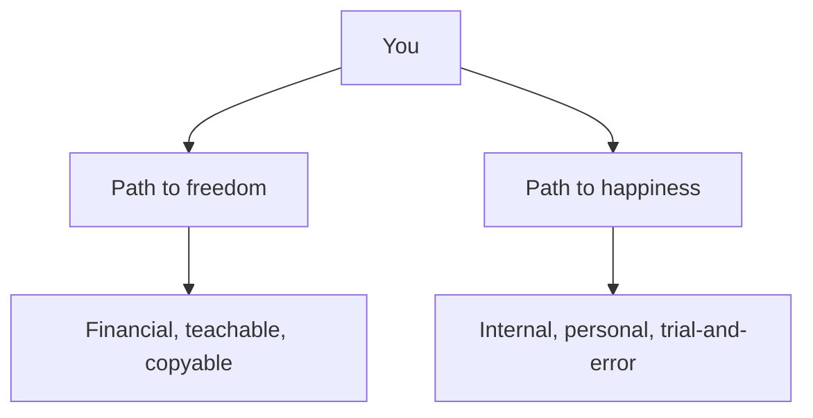
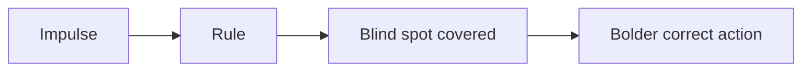

## Why this episode matters

This is the second most-viewed episode in the track: 142,008 views as of October 2026. No other episode shows the full arc of a high achiever rebuilding himself from the inside. Chamath Palihapitiya went from AOL to Facebook to billionaire founder of Social Capital by 32. From the outside it looked like a perfect life. From the inside, he says, it felt like nothing. This episode is his account of what he changed: lying, money, happiness, and the difference between the path to freedom and the path to happiness. It pairs with ep01 (Naval): Naval gives you the philosophy, Chamath gives you the confessional.

Note on the source: the transcript is YouTube auto-generated captions. Numbers and names below follow the transcript. Where the captions garble a name, it is marked [uncertain].

## Truth: the lie you learned to survive

### Lying starts as protection

Chamath grew up in a family shaped by mental health problems, alcoholism, depression, and poverty. The family loved each other, he says, but the love came in a distorted shape. As a child he learned to lie to cope. Are you okay? I am fine. Did you do it? I did not do it. Where were you? Nowhere. How was the test? Good. Evasion became a deep model. He calls lying one of the simplest psychological protection mechanisms humans have.

Definition: a protection mechanism is a behavior that shields you from pain in the short term and costs you in the long term.

The cost accumulated for decades. Half-truths and evasions piled up in personal life and business life. At some point, he describes something like an organ rejection. His system started rejecting the lies the way a body rejects a transplanted organ. He had to move to the opposite extreme to atone.

### The catharsis cycle

The first moment of clarity came when he left to work at Facebook. For the first time he was radically frank. It felt like catharsis. He overcorrected into a caricature of bluntness: the sharp, rough guy. Then at Social Capital, the old pattern returned. He felt like an impostor in venture capital. He felt he had not earned the right to open a fund. Uncertainty returned, and with it the evasions and the punching through with lies.

In 2016 and 2017 he felt the rejection again and recalibrated. He describes the person you see now: someone trying to tell the truth as often as possible, even when it is inconvenient. He believes people respond to it because they recognize their own evasions in his story. They wish they could say the inconvenient thing. Watching him do it gives them permission.

The lesson is structural, not moral. Lying is not a character flaw to confess. It is a trained response to an unsafe environment. Untraining it requires a safe environment plus repetition. His safe environment: his partner, close friends, and two therapists he sees weekly.

### Impostor syndrome is a dragon, not a phase

He still fights impostor syndrome constantly. The higher he climbs, the sharper it gets. He calls it a dragon he cannot slay, though he fights it his whole life. His tools: talk. Talk to his partner, who became his spiritual partner and co-pilot. Talk to two therapists. Talk to his children with radical transparency.

He was taught, as a husband and as an immigrant husband, that talking about emotions is weakness. Double weakness. His partner taught him otherwise, and he says he will be forever grateful.

His dental plaque analogy: not flossing does not stop 100 percent of plaque, but it prevents 90 to 95 percent. Talk is floss for the mind. It removes the buildup of negative energy, lets him rethink events constructively, and returns him to problem-solving with a healthier mind. The breakthrough insight: there is no separation between personal life and work life. They are intertwined at the subconscious level. Personal happiness is what makes everything else make sense.

## Happiness: the "oh wow" test

### Steve Jobs and the obituary

Shane asks how he defines happiness after the journey. Chamath points to the obituary of Steve Jobs written by his sister Mona Simpson in the New York Times. One paragraph stayed with him: Jobs kept saying "Oh, wow. Oh, wow. Oh, wow." as he died.

Chamath's interpretation: Jobs looked at his family, his life, and was happy. The happiness came from two things: a family that loved him and a family he loved, plus work that created happiness and direction for other people. Not the companies. Not the money. The shelter of love plus meaningful creation.

His version of a life worth living: enough "oh wow" moments that the dying version of you says it too.

### His three "oh wow" moments

He names three from his own life. They share a pattern: none involve business results.

First: a stressful morning at the office, pressure consuming his attention, feeling like crying. He went home, saw each of his four children, kissed them, kissed his partner. Pure happiness. He had built a shelter full of love for his family. Then he drove to the office. That was the "oh wow."

Second: summers in Italy with his partner's family. He never spent much time in Europe before. Four years of summers taught him to love the food, the culture, the loudness, the intensity, the energy.

Third: a poker group. They arrive at 4 p.m., play until 6:30, share a long family-style dinner, then play a few more hours. The pandemic stopped it. When they finally gathered again, his whole feeling was "I cannot wait to see them."

The rule he draws: when he presses too hard on the business metrics, he gets distracted and unhappy. When he focuses on the "oh wow" moments, he has more energy for the actual work. Happiness is not the reward for achievement. It is the fuel for it.

### The two paths: freedom and happiness

This is the episode's central distinction.

Figure 1. The two paths. AI Podcast Curriculum, ep02 (Chamath Palihapitiya, 2020-10-13). Shell 1. Show the toy. Source: original toy, from episode claims.

The path to freedom is financial. Money releases people. It buys freedom. It does not buy happiness. Racing for happiness with money is destructive: debt, drugs, losing everything. The cliches repeat every generation because the mechanism repeats.

But the path to freedom can be taught. He believes he accumulated knowledge about capital allocation that transfers cleanly to others. The path to happiness cannot be taught, because everyone's life experience differs. You can listen to others and then start your own walk. The answers are not obvious. It is constant trial and error.

Failure mode: confusing the paths. People try to buy happiness (path confusion one way) or try to meditate their way to financial security (path confusion the other way). Work both paths simultaneously, with different tools.

## Freedom: a plan anyone can copy

### The polarized middle

He describes a polarized society. On one side: people demanding absolute freedom of intention with no plan. On the other: people depending on the nanny state with no plan. Both sides lack an effective plan. In the middle: exhausted people. He sees this as fertile ground for inequality and disappointment.

His answer: give people a realistic plan. Work, study, and join a community of like-minded people willing to help each other for 5, 10, 15, or 20 years to accumulate capital. Any size. Just start. He believes people would be surprised how much they can achieve financially on their own.

### Financialization is the tailwind

He argues we put financial instruments around everything: creating financial instruments around anything imaginable. Sneakers: GOAT, the sneaker marketplace, announced a 200 million dollar raise at an almost 2 billion dollar valuation [uncertain: transcript says "announced today about attracting 200 million dollars with an estimate of almost 2 billions"]. Fractional ownership: Rally Road, Pipe. Crypto. The investment universe keeps expanding.

His 2015 example: Social Capital started paying attention to Tesla. They bought convertible bonds. They were not sure the shorts would lose or the company would survive bankruptcy risk. They were sure they wanted to bet on Elon Musk. It worked. But the deeper point: a community of physicists, chemists, and financiers united to understand Tesla deeply. They wrote research notes and made YouTube videos. Anyone who spent the time could understand what happened and participate by buying shares.

The pattern he wants to scale: communities that do real work to understand a company, then share the understanding so a teacher with 5,000 to 10,000 dollars or a graduate with 1,000 dollars can participate on equal terms with anyone. No intermediaries skimming. He invests his own money alongside. He is a principal, not an agent.

### Observe the present from first principles

Shane asks what it means to be an observer of the present. Chamath demonstrates with the 2020 election, walking through three layers.

Foreign policy: he lists Russia, North Korea, China, and the Middle East. His claim: both US parties see them the same way. Both distrust Russia. Both distrust North Korea. Both concluded the romance with China is over: globalization handed away semiconductors, rare earth metals, and healthcare supply chains. Both accept that energy independence shrinks the Middle East's strategic value as the world stops burning oil, then coal, then fossil fuels.

Monetary and fiscal policy: the Treasury and the Fed used to act separately. Now they are intertwined, in the US and across Western democracies. Both parties will spend tens of trillions over the coming decades, whether they call it a Green New Deal or infrastructure. Nobody will campaign on digging coal.

His conclusion: the election is style, not substance. On the critical questions, the two sides converge. What they actually fight about: political correctness versus cancel culture. He calls the observation controversial and says it takes mental toughness to hold it, because your prejudices will try to tear it apart.

The investor's use of this method: in 1980, rates were 15 to 16 percent. The first-principles bet: rates fall to zero before they rise to 50 percent. Anyone who held leveraged stocks through the 80s, 90s, 2000s, and 2010s made a fortune. Starting amount did not matter: 1 dollar or 10 million. Now rates sit near zero. The question: minus 5 or plus 5? His answer: build the portfolio that wins either way.

Figure 2. The rates bet. AI Podcast Curriculum, ep02 (Chamath Palihapitiya, 2020-10-13). Shell 2. Count or score the toy. Source: original toy, from episode claims.
| Era | Rate level | First-principles bet | Result |
|---|---|---|---|
| 1980 | 15 to 16 percent | Falls to zero before rising to 50 | Correct for 40 years |
| 2020 | Near zero | Minus 5 or plus 5: unknown | Build to win either way |

### The deflationary lesson and the either-way portfolio

His read of the last decade: technology taught billions of people that everything is deflationary. Wait until tomorrow and someone gives you more for less. Data storage: his own experience moved from one provider to Dropbox (more for less) to Google Drive (even more for even less). Facebook, Spotify, and Netflix did the same in their domains. People learned to delay gratification or switch cheaply.

So the base case is continued deflation, with inflation possible. His solution: pick sectors that win at minus 5 or plus 5 percent rates. His list, built from Maslow's hierarchy of needs: e-commerce (people buy things online), healthcare (people need care, and costs must fall), education and skills, clean sustainable energy, better food, and alternative assets as insurance against being wrong. Then bet on growth inside those sectors, because growth covers the noise of being wrong about rates.

His capital allocation hero: Jeff Bezos. Around 2014, his team analyzed Amazon's profit and loss statement line by line. Each expense line had become a product, then an income line. Bezos reinvests everything instead of paying dividends. Chamath sold all his Facebook shares in 2014 and invested in Amazon on that logic. His rule as an investor: if a CEO generates 30 percent free cash flow and offers dividends, he says keep it and reinvest. Growth compounds. Dividends do not.

## People: virtue and mental flexibility

### How he judges CEOs

Shane asks what patterns he looks for after interviewing thousands of CEOs. His old pattern recognition was fragile: obvious questions get rehearsed answers. Now he looks for two things: virtue and mental flexibility.

Virtue cannot be tested with one question. It reveals itself in small observations over a long time: 2, 3, 6, 9 months, a year. People are good at lying and evading, so you watch instead of asking. How do they treat a waiter? How do they react to small things? Are they open to different views? Trust, with smart reservations, and assume best intentions: that removes a pile of mental stress. Each interaction is one more data point confirming or denying integrity.

Mental flexibility is tested with open, absurd questions. His example: "What do you think about triangular offices?" A rigid mind freezes: what kind of question is that? A flexible mind engages out of curiosity and kindness: why are you interested in triangular offices? What does that make you think about structured resource allocation? Suddenly a random question becomes a real conversation about the business. The best CEOs, in his view, are deeply curious generalists who know a little about everything.

His 2020 list of the best public-company CEOs: Elon Musk, Jeff Bezos, Tobi Lütke of Shopify, and Jack Dorsey. He admits he was previously disrespectful toward Dorsey and changed his mind after watching decisions around Square, Cash App, and the move toward Africa.

### Behavioral rules beat willpower

Investing, he says, is mostly fighting yourself: panic, overreaction, underreaction, refusing to see reality, living in the past, over-believing the future. Data is available. The edge is behavioral: rules that protect you from your own psychology.

His rules: think about buying companies, not stocks. Judge the quality of the CEO and the business. Think long term. Do not check the price daily. Read annual reports, not quarterly ones. Each rule removes a blind spot. With blind spots covered, he can make bolder moves because he trusts the guardrails.

Figure 3. Rules as blind-spot removal. AI Podcast Curriculum, ep02 (Chamath Palihapitiya, 2020-10-13). Shell 3. Apply the one rule. Source: original toy, from episode claims.

### Go deep, then come home

His process for understanding a contrarian idea: allow himself to be fully captured by it. Believe what the other person believes, completely, to the end. Learn every detail. He cites Ender's Game: the moment you understand your enemy better than he understands himself, you love him and you win.

The danger: getting stuck inside the borrowed view. His return ticket: his team. He goes back to partners with extremely high integrity, tells them he got excited, and they defuse him. Or he naps. Or he talks to his friend Rob. The rule: go deep, then come home. Never skip the return trip. Intellectual laziness stops at the first confirmation: one meeting, one article, the first Google result.

## The asymptote

Shane asks how he measures getting better. Chamath's image: everyone approaches an asymptote on some trajectory. He estimates he is one to one-and-a-half orders of magnitude from his. He can see it but barely. He has the toolkit to close the distance. He wants to talk to Shane at 84 and say he is one step from the asymptote.

What "better" means for him now: believe in himself more. Take smarter, larger risks. Write checks for hundreds of millions calmly, learn to do it with billions and tens of billions. Only five or six people in the world do that well, in his estimate. Below 10 billion dollars, a company needs functional competence he does not have. Above 10 billion, it is all capital allocation, and that is his manic pursuit.

## Questions and answers

**Q1: Explain this episode to me like I am new. What is Chamath's message?**
Two paths, two jobs. Job one: become financially free with a teachable plan: earn, accumulate capital over 5 to 20 years, join a community that shares real research. Job two: become happy with a personal path nobody can copy: tell the truth, notice your "oh wow" moments, talk about your feelings, keep returning to what you love. Money buys freedom. It does not buy happiness. Confusing the two destroys people.

**Q2: What does "organ rejection" of lying mean?**
His body metaphor for hitting a limit. After decades of evasion learned in childhood, his system started rejecting lies the way a body rejects a transplanted organ. The point is physiological, not moral: the old strategy stopped working at a biological level. That forced the swing to radical honesty. The lesson: coping strategies have expiry dates. What saved you at 10 can poison you at 40.

**Q3: Applied: I feel like an impostor at work. What would Chamath do?**
First, normalize it: he feels it constantly, and it sharpens as he climbs. Second, talk: partner, trusted friends, therapist. He treats talking as dental floss: not 100 percent, but 90 to 95 percent of the buildup. Third, separate the feeling from the facts: the feeling says you have not earned your seat, the work record says otherwise. Fourth, keep one foot in the "oh wow" moments so the job does not become your identity.

**Q4: What is the difference between the path to freedom and the path to happiness?**
Freedom is financial and copyable: save, invest, compound, repeat. Happiness is internal and personal: your life experience differs from everyone else's, so your path differs. You can teach someone the first in an afternoon. The second takes a lifetime of trial and error. His error to avoid: using money tools on happiness problems, or meditation tools on money problems.

**Q5: How does his "observe the present" method work?**
Strip the labels and look at the mechanics. On the 2020 election: ignore party names, list what each side actually does on foreign policy, money, and spending. He finds convergence: same enemies, same intertwined Treasury and Fed, same tens of trillions in spending. The real fight is cultural, not policy. The investor's version: ignore narratives, find the first-principles bet (rates fall to zero), then build the portfolio that wins under every outcome.

**Q6: What are virtue and mental flexibility, and how does he test them?**
Virtue: integrity revealed in small things over months: how someone treats a waiter, reacts to setbacks, handles disagreement. No single question works. Mental flexibility: curiosity under surprise. Ask an absurd open question ("triangular offices?") and watch: the rigid mind dismisses it, the flexible mind plays with it and finds the real question inside. For a CEO, he says, these two are the only things that matter. Functional competence is table stakes.

**Q7: Why does he say talking is like dental floss?**
Flossing does not stop all plaque, but it prevents 90 to 95 percent. Talking does not solve everything, but it prevents most of the buildup: unspoken resentments, distorted stories, stagnant fears. He talks to his partner, friends, and two therapists weekly. The mechanism: speaking forces the vague into words, and words can be examined. Unexamined feelings run you. Examined feelings inform you.

**Q8: What is the asymptote image about?**
A personal growth curve that flattens. He is one to one-and-a-half orders of magnitude from his best possible self. Close enough to see it, far enough to keep working. The practice for closing it: bigger, calmer risks and less impostor noise. The honesty note: the asymptote is a direction, not a destination. At 84 he wants to be one step away, not arrived.

## Memory aids

Mnemonic for the episode: **T-F-P**: Truth (stop the evasion), Freedom (the teachable path), Presence (the "oh wow" moments).

Never-confuse pairs:
- Path to freedom versus path to happiness: money tools for the first, inner work for the second. Never swap the toolkits.
- Principal versus agent: he invests his own money beside you (principal). A fund manager investing yours while risking nothing is an agent. Prefer principals.
- Captured versus stuck: let a new idea capture you fully to learn it, then come home. Getting stuck means skipping the return trip.
- Virtue versus competence: competence answers "can they do the job", virtue answers "what will they do when nobody watches." He hires for the second.

Trap cards:
- Trap: "I will be happy when I am rich." Reality: money buys freedom, which is real and worth having, but the happiness path is separate and internal.
- Trap: "Everyone agrees with my politics, so my investing view is right." Reality: strip the labels. Both parties spent the same. Style is not substance.
- Trap: "I understood it after one article." Reality: that is intellectual laziness. Let the idea capture you, learn the details, then come home and decide.
- Trap: "Talking about feelings is weakness." Reality: he was taught this as an immigrant husband. Unlearning it was the highest-impact change of his life.

## How to imbibe this

1. The truth audit. For one week, notice every evasion: the softened answer, the dodged question, the "I am fine." Write each down at night. Do not fix them yet. Observable change: you see the protection mechanism running.
2. One "oh wow" inventory. List your last five "oh wow" moments. Tag each: family, friends, work, or other. If work dominates, your fuel mix is wrong. Schedule one non-work "oh wow" this week. Observable change: a calendar with at least one protected non-work joy.
3. The two-path check. Write your freedom number: the capital that makes work optional. Then write your happiness practices: the three things that reliably produce "oh wow." Work both lists weekly. Observable change: money and mood stop sharing one scorecard.
4. Start the floss. Have one honest conversation this week about something you usually evade: with a partner, friend, or therapist. Notice the 90 percent rule: most of the dread was buildup. Observable change: one relationship gets easier.
5. Build the either-way list. Pick one investing question you face. List the outcomes (rates up, rates down). Write the position that wins in both. If none exists, your position is a bet on one future. Observable change: fewer single-future bets.
6. The absurd question. In your next interview or deep conversation, ask one open, slightly absurd question. Watch for curiosity versus dismissal. Observable change: you start screening for mental flexibility, not rehearsed answers.

## Think it yourself

Guided drills, with answers.

**Drill 1: the evasion log.** For three days, count your evasions: times you said "fine" when not fine, dodged a question, or softened a truth. Total them. Chamath's claim: lying was his childhood protection mechanism. Write two sentences: what is each evasion protecting you from? Answer sketch: usually from conflict, judgment, or the effort of honesty. The protection had a reason once. Name whether the reason still holds.

**Drill 2: freedom math.** Pick a monthly spending number S. Multiply by 12 for annual spending A. Multiply by 25 for a rough freedom fund F (the 4 percent rule: F = 25 × A). Example: S = 5,000 dollars → A = 60,000 → F = 1,500,000. Compute yours. Now answer: at your current savings rate, how many years to F? Show the arithmetic. This is the path to freedom made concrete.

**Drill 3: the "oh wow" audit.** List 10 moments from the last year when you felt pure happiness. Classify each: people, place, achievement, purchase. Count the categories. Chamath's three were all people. Compute your ratio. If achievements and purchases dominate, write one paragraph on what that implies about your fuel mix.

**Drill 4: style versus substance.** Pick a current political or business debate. Make two columns: what each side SAYS (style) and what each side DOES with money and power (substance). Find one place where the columns converge despite the noise. Write it in two sentences. This is the "observe the present" exercise.

**Drill 5: the capture exercise.** Pick a view you strongly disagree with. For 20 minutes, argue it as if you believe it completely. Steelman it: make its best case. Then come home: write what you still believe and what changed. This trains "let it capture you, then return."

**Drill 6: virtue observation.** Pick one person you evaluate (hire, partner, friend). For two weeks, log small observations: how they treat service staff, handle a delay, react to disagreement. No big questions. At the end, write your virtue read in three sentences. Compare with your first impression. Note any change.

## Skills you can now use

- Separate any life plan into the freedom path (financial, teachable) and the happiness path (internal, personal).
- Run the "oh wow" test on a week: count moments of pure happiness and check their source.
- Strip a political or market narrative to mechanics: what do the actors DO with money and power, regardless of labels?
- Build an either-way position: find the asset or plan that wins under opposing futures.
- Screen people for virtue (small observations over months) and mental flexibility (the absurd open question).
- Use talking as maintenance: schedule the honest conversation before the buildup hardens.
- Apply the capture-and-return method to any contrarian idea.

## Go deeper

- The episode itself: https://www.youtube.com/watch?v=v9pipH75L_E
- Farnam Street's podcast archive: https://fs.blog/podcast/ (HTTP 200, verified 2026-10-06)

## Figure audit

| Unit id | Claim | Before | After | Figure id | Medium | Source | Four tests |
|---|---|---|---|---|---|---|---|
| u01 | Two paths: freedom vs happiness | One scorecard for life | Freedom: teachable, happiness: personal | fig1 | mermaid | episode claims | T1: 5-node split graph / T2: a split of dependencies forces mermaid / T3: none, static plate / T4: none reused |
| u02 | The 1980 rates bet | Narrative forecasting | First-principles bet: 15% falls to zero | fig2 | table | episode claims | T1: 2-row era table / T2: comparison of values forces a table / T3: none, static plate / T4: the minus-5-or-plus-5 pair, reused in the either-way portfolio |
| u03 | Behavioral rules as guardrails | Raw impulse investing | Rules cover blind spots, enable boldness | fig3 | mermaid | episode claims | T1: 4-node chain / T2: flow forces mermaid / T3: none, static plate / T4: none reused |
