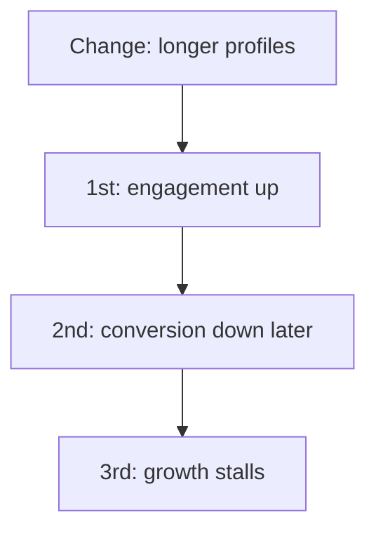
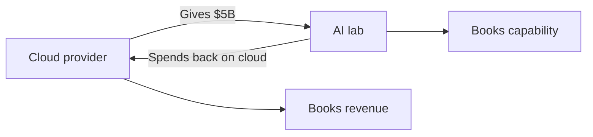

## Why this episode matters

Bill Gurley joined Benchmark on its third fund and became one of the most respected venture investors of his generation. This is the most recent episode in the track, recorded June 2026, and it reads like a field manual for thinking clearly in a noisy world. His method has three parts: think in systems, study the bedrock history of your field, and learn obsessively on the bleeding edge. The episode then applies that method live to AI models, China, circular deals, stablecoins, and the structure of his own firm. It sits third in the track because it turns ep01's models and ep02's first principles into a daily practice.

## Systems thinking: the first mental model

### Complex systems are multivariable and nonlinear

Shane opens by asking for the mental models Gurley keeps coming back to. His answer: systems thinking. He names the book "Thinking in Systems," which he read, and notes he sits on the board of the Santa Fe Institute, which studies complexity theory.

His definition: complex systems are multivariable nonlinear systems. They behave one way for a long time, then one variable switches and they behave another way. Weather. Stock markets. Consequences arrive at the first, second, and third derivative. You cannot think with a linear model or a single variable, because things go way off the path.

Definition: a second-derivative effect is a consequence of a consequence. The first derivative is the direct result of your change. The second is what the direct result causes later.

His example: a large dating site tested making profiles longer. Engagement rose. Simple heuristic, confirmed by test, rolled out. Many months later they discovered it was negative for conversion: when people knew more at that level, fewer converted. The first derivative looked good. The second derivative was bad. They found out way later.

The discipline: be conscious of consequences beyond the first. Never get too deterministic about a single metric or a single variable. Know what is important and what sits on top.

Figure 1. First, second, third derivative. AI Podcast Curriculum, ep03 (Bill Gurley, 2026-06-09). Shell 1. Show the toy. Source: original toy, from episode claims.

### How he learned investing: the bedrock

Gurley started on Wall Street, not in venture. His reading list, in order: Peter Lynch's "One Up on Wall Street" (the first investing book he read), Burton Malkiel's "A Random Walk Down Wall Street," all the Buffett letters, then Ben Graham ("once you read Buffett, you have to read Ben Graham"), then Howard Marks, whom he calls "just incredible."

Shane's push: that is value investing, but Gurley does seed-stage venture. How did Buffett translate? Gurley's answer: a firm understanding of the bedrock is super valuable, and when you need to innovate on top of it, the foundation holds you up.

Two people shaped the translation. Mike Mauboussin [transcript renders as "Mike Moeson"], a writer of financial books who started at First Boston a year or two ahead of him and became a lifelong friend. And Bill Miller, who ran Legg Mason through a famous 15-year run of beating the S&P. Miller claimed to be a value investor while being Amazon's largest shareholder for a long period. His definition: value just means the asset is underpriced relative to what you think it will be worth in the future. If you believe in network effects, Amazon can grow at an unreasonable rate for a very long period, and the math works. Gurley spent a lot of time talking with Miller about network effects.

His structural insight: Wall Street is the buyer of the product that venture capital creates. Liquidity comes through M&A or IPO, and the price is set by that group. So even at the earliest stage, two people and a PowerPoint, he thinks about what the public-market buyer will value when the company grows up. Trajectory matters more than the starting place.

### Know the bedrock of your industry

Shane asks what "knowing the bedrock" means in a world of skimmers who want the executive summary. Gurley answers with stories.

His Benchmark partner Alex Balkansky once bought a dinner with John Lasseter, the creative genius behind Pixar, at an Andre Agassi charity auction in Las Vegas. At Lasseter's house, in his viewing room, Lasseter served a 10-course meal. Each course was tied to a classic cartoon he considered essential to the craft of animation. He showed each one and talked through it. Gurley's reaction: "Holy crap, he knows more about the history."

More data points: at a world chess event, a trivia contest about the history of chess, and Magnus Carlsen wins it. Picasso was a wildly successful realist painter by age 14, the Barcelona museum proves it, though nothing in his cubist work suggests it.

The career application: imagine interviewing for a marketing job at P&G or Pepsi against 20 people. You are the one who understands the masters of marketing and can bring them up. That is wildly differentiating. A friend recommends college applicants do the same: applying to study physics, write about the forefathers of physics in the admissions essay. It creates instant contrast and signals passion.

His test: if studying the history of your field sounds tedious, you are probably not in the right lane. The tedium is the signal.

## The edge: obsessive learning

### The common trait of outliers

Asked whether knowing history is the common trait of the founders he worked with, Gurley says no. The more common related trait is obsessive, constant learning. Disruptions that let startups take share from incumbents are tied to something dynamic happening on the edge. Every entrepreneur exploiting it, AI right now, goes home at night and reads everything they possibly can, because the edge moves and they need to be a top-1-percentile person on the new thing.

This was true of the mobile wave: no engineers wrote mobile apps, and a few people got on the edge and figured out what it meant. It is true of AI now.

The incumbent's problem: diving into the edge may mean giving up a previous decision or admitting you were wrong and going backward. That is the innovator's dilemma wearing work clothes.

### Play with everything

Gurley's personal practice: he plays with everything that appears. Right now he holds about five premium AI accounts because he does not want to miss something. He recommends everyone operate this way.

The power move he describes: know the old stuff AND the new edge. Understand the legends and history of marketing, and also really get TikTok. That combination is a power player in any field, and for a young person it is a devastating interview differentiator.

## AI: models, data, and China

### How he actually uses AI

Asked what would surprise Shane about his AI use, Gurley says people underestimate how much it can do. His technique: do not just ask for the top 10 of something and then study them yourself. Ask for the top 10, list their pros and cons, then rank-order them on one dimension, then rank-order them again on another. Build the later steps into the prompt. Early on he would ask for numbers and add them up himself, then he realized he could tell it to do that part too.

His model map: ChatGPT for the project structure, and the memory feature pulls him in (it knows who he is, useful for restaurants and personal context). Gemini for restaurants, because it has Google review data: not "which restaurants are good" but "what three plates do people rave about, and what do people warn against." He goes deep into menus. Coding people swear by Claude. A finance contact prefers Perplexity for finance, but finds Claude better for deep research on unfamiliar companies and countries. Still a mix.

One model or many? He says it depends. In verticals, especially coding (the largest vertical), people already swap models, Cursor lets the user pick. Price optimization is not the objective function now, but it will be in a few years, and then swapping increases. The counterforce: if regulation gets extremely difficult and expensive, it could produce oligopoly instead. Some players know this and plead for regulation as a protective moat, especially against Chinese open-source models.

### China's open-source system

China has about ten open-source models that are really good (Shane says four, Gurley corrects to ten). Gurley calls this a perfect systems-thinking question.

The competitive dynamic in China is more intense because everyone chose open source. That creates a system capable of innovating far faster than the Western system. All the models learn from one another. A model can train another model or test another model. They publish not just weights but how they figured things out: new techniques.

His metaphor: two agricultural societies. In one, farmers come to market, sell each other goods, and go home. In the other, farmers are forced to share best practices with all the other farmers. Which evolves faster?

The irony: startups all over Silicon Valley are quietly forking these models. He calls it a quiet secret: from a volume standpoint, companies use these models everywhere, though you will not read it on the front page of the journal. Whether regulation stomps this out is an open question.

### Will the models hit an asymptote?

On AI investing, the open question: if models become near-sentient, no vertical model is needed, one model does everything. Gurley comes down on the other side. Workflows and data moats matter: legal AI startups spending all their time ingesting case law and understanding legal processes will not simply be replaced by a general chatbot climbing the stack. Though the labs talk about going after verticals, so it is to be determined. He cites Microsoft: starting with the OS, then moving up the stack past Lotus 1-2-3 and WordPerfect. That could happen here.

On training limits: data may run out. He calls it "painting in the corners": everything is filled in. One powerful solution: hire experts at thousands of dollars an hour to ask very hard questions and fine-tune on them, but there has to be a limit at the edge of human knowledge.

Yann LeCun's side: the next AI is not LLMs, LLMs will hit an asymptote because they are language-based and language cannot capture everything, which is partly why they are not great with math and numbers. The famous AlphaGo move (the move number escapes him) is cited as proof models can innovate beyond their training, the counter is that Go is a constrained game where the computer can search a possibility field no human can, while the real world has effectively infinite paths. AlphaGo is not LLM-based anyway. Tesla full self-driving is also a constrained environment: inputs are visual data, outputs are brake, steering wheel, gas pedal. He would now sit comfortably in the back seat, but the corner cases of the random real world, humans who find it fun to test the cars by jumping in front of them, are impossible to fully fathom.

## Money: circular deals, tokenization, stablecoins

### Circular deals inflate everything

On whether the AI buildout is overfunded: five years ago he did not believe the Mag 7 would reach 3 trillion dollars and then take free cash flow from 50 to 100 billion a year down near zero to spend it all on capex. The investor community absorbed the lesson of increasing returns and power laws: once startups prove they can grow as a function of size, Google to Amazon to Meta, they end up worth far more than anyone thought. So investors invest "on the come" and take more risk. A chart shared with him that morning showed losses before going cash-flow positive: Amazon 2 to 3 billion, Uber about 15 billion, and the current AI companies far bigger.

Then the circular deals. At the DealBook conference, Dario (Anthropic's CEO) was asked about them. Gurley's retelling: imagine you are a cloud provider and Anthropic wants to build a model costing maybe 5 billion dollars, but they do not have the money. So you give them the money so they can spend it back on your services. "If you did not give it to them, they would not spend it." The growth of everything is enhanced because you fund spending that would not otherwise happen. You inflate what happens, push further ahead faster, and extend the time before any correction. A correction would weed out weak competitors, but circularity delays it.

Burn rate as risk: ten years ago, burning a million a month was super risky. Today companies burn five billion a year, a hundred million a month or more. At that aggression, he says, it is really hard to know what your unit economics are. That goes back to the financial bedrock.

Figure 2. A circular deal: the money loop. AI Podcast Curriculum, ep03 (Bill Gurley, 2026-06-09). Shell 3. Apply the one rule. Source: original toy, from episode claims.

### Tokenization versus the IPO machine

He calls the IPO process "insanely unfair" to companies: bankers pick the price and pick the shareholders. His thought experiment: give a freshman computer science student and a freshman finance student the problem of taking a company public. They would match supply and demand anonymously, like an auction, exactly the way an ICO works. Nobody would invent cherry-picking best customers for a sweetheart price. Direct listings used the auction mechanism, Wall Street went back to the controlled oligopoly because it cannot let go of the power grab.

Tokenization could disrupt the allocation step first. The risk: retail speculation and manipulation on assets without financial-disclosure regulation. GameStop and Palantir show how retail love can take valuations where institutions cannot follow. Robinhood's tokenization plans drew legal threats from the companies. One reason companies stay private: they negotiate liquidity-event prices one-on-one with trusted investors instead of living with wild public fluctuations. He notes the underlying asset moves around a lot anyway, private markets just never record it, which spares employees the chaos.

### Stablecoins versus the 2.5 percent tax

Most of the developed world built instant bank-to-bank transfer: UK Faster Payments did it 20 years ago, Argentina did it in the past six years and it quickly became 60 to 70 percent of transactions. The US never did, because of regulatory capture: banks pushed back in Washington, so the FedNow project stalled. Result: credit cards charging 2 to 2.5 percent, with a whole ecosystem living under that umbrella.

A stablecoin, for the naive: USDC is a cryptocurrency where the company holds a dollar-for-dollar backing in US Treasuries for each coin. Because it runs on crypto rails that are fast, global, and immediate, you can transfer a dollar to anyone within seconds for pennies. Contrast the US status quo: ACH takes three days, a same-day wire costs 25 dollars plus a page of forms.

Visa and Mastercard, he says, will be heavily threatened. The two companies have roughly 60 percent operating margins, among the highest in the history of business. They are a duopoly created by the banks, which hold stakes. The whole industry makes a lot of money because it is this way, but there is zero reason it should cost 2 or 3 percent. China shows the alternative: the government made transfer easy, and Alibaba and Tencent built WeChat Pay and Alipay on top. Walk around China and you scan a QR code for everything, from a street vendor's hat to a car. Their payment system innovated further because the base layer was fixed. His prediction: stablecoins get to instant transfer in the US faster than the government will.

Figure 3. Moving one dollar: the rails compared. AI Podcast Curriculum, ep03 (Bill Gurley, 2026-06-09). Shell 2. Count or score the toy. Source: original toy, from episode claims.
| Rail | Speed | Cost |
|---|---|---|
| US bank transfer (ACH) | 3 days | Not in source |
| US same-day wire | Same day | $25 plus a page of forms |
| US card payment | Instant | 2 to 3 percent |
| USDC stablecoin | Seconds | Pennies |

## Judgment: moats, index funds, and storytelling

### Moody's and the proxy-advisor heist

AI can already do the analysis Moody's sells. Moody's power, he argues, comes from being the trusted standard, the watermark everyone accepts. It could use AI on the back end and keep the standard. But everything is up for grabs.

Proxy advisors like ISS, which tell shareholders how to vote, are in his words "more of a heist than anything else." Index funds own so much stock but lack the time to evaluate each vote, so they rely on these services. The services score companies with a black box: they do not tell you how they score you. Guess how you learn more? You hire them. Paid on both sides.

Worse, they drifted from shareholder interest into risk mitigation and box-ticking. His example: the Tesla pay package for Elon. It basically says you make nothing unless the stock goes way up, and if it does, you make an obscene amount. He has said publicly he would agree to that deal for every company he ever worked with, most CEOs would not take it. The ISS-style evaluators opposed it, looking at the headline number instead of what it requires. They started from corporate governance as fraud prevention, and that legacy misfires on incentives that align pay with shareholder gains.

Second-order effects of passive indexing: one fix would be passive funds not voting at all, so active shareholders decide, or forcing them to vote in the same proportion as direct holders. Meanwhile, public investors got scared of deviating from the index and fell into closet indexing. Paradoxically, with so few active investors left, the edge may now be bigger. He is not sure he believes it. The buy side is a very hard job: QQQ has probably outperformed 80 or 90 percent of venture funds.

### Storytelling as a founder trait

Shane notes Gurley wrote about loving the craft of storytelling. Gurley traces his reading life: before business school he barely read, something flipped there. Business books first, then personal development (Dale Carnegie, "Seven Habits"), then biographies, then long-form nonfiction that reads like fiction: Malcolm Gladwell, Michael Lewis, John Krakauer. He even read the books about that art: "the new journalism" and "the new new journalism."

Two uses of writing. First, the memo does the thinking: to make it stand alone and cogent, you work through the corner cases. That is why Bezos demands the six-page narrative at Amazon instead of PowerPoint. Second, writing is a calling card: a founder who does not know you reads your knowledge of their business and reaches out. A magnet for deal flow.

Storytelling ranks in his top three founder traits because a founder sells all the time: recruiting employees and executives, raising money, closing customers and partnerships. "Selling all the damn time." The best are gifted at describing what they try to do. Listen to any Tobi Lütke podcast, he says, of course the world follows Daniel Ek the same way.

The other traits he names: product instincts (it took his whole career to learn how hard it is to hire someone not product-first and make them good at it, 5 percent or less succeed), and determination. He once asked Jeff Bezos how his angel portfolio succeeded with no free time. Bezos: "When I meet an entrepreneur, there's only one thing I ask myself. Is this person gonna do this no matter what? Come hell or high water, they do this." That level of determination is present in all great founders.

### Uber: no case study, no mentor

The Uber lesson you will not find in an HBS case study: everyone knew the category had winner-take-all dynamics and network effects, so investors funded it ad nauseam. One firm raises a billion, the rival gets handed three billion, and the only way to compete is to spend it. Burn rates exceeded anything any public company would spend attacking a new category.

The moment that horrified him: realizing no case study existed. Take the board members of Walmart, Costco, GM, GE, the top ten best companies: none had ever been in this situation. There was no one to call, no mentor to find. Now, he says, all the AI companies are in that situation. Uber was the first in mega-burn (Amazon had a big burn before, Uber took it to a new level), AI added a zero.

### The equal partnership

Benchmark's structure came from its founders' experience at hierarchical firms, where senior patriarchs took too much money and credit without doing the imperative work. They made it equal: no lead partner, no king, no president, five equal partners. Gurley joined on the third fund.

Second and third-order consequences, mostly positive. Recruiting: exceptional talent leaves hierarchical firms for the equal deal, matching offers on the way out prove the old firm never meant it. Development: you take an equal part of newcomers' success, so you invest in making them successful, in an up-or-out firm it feels lonely and competitive. Sharing: if one partner's company needs a CFO another partner knows, it gets shared immediately, one company's success is no different from another's. Politics: no annual comp review, no recutting the pie, the overhead just goes away.

The one huge negative: with no CEO, it is hard to scale and hard to start new initiatives. Nobody owns the orphan work. The website was the running joke: Matt Cohler built a complicated site with founders connected to partners, people complained, and one day Mac took it all down and put up a splash page. That was about 15 years ago, Benchmark still has a single page today. Gurley adds the honest caveat: plenty of highly successful firms are not structured this way. It is not the only way.

Figure 4. Benchmark's equal partnership: before and after. AI Podcast Curriculum, ep03 (Bill Gurley, 2026-06-09). Shell 3. Apply the one rule. Source: original toy, from episode claims.
| Mechanism | Hierarchical firm | Equal partnership |
|---|---|---|
| Leadership | Senior patriarch, the king | No lead partner, five equals |
| Compensation | Recut yearly, top-heavy | Equal shares, no comp review |
| Talent | Stays inside the hierarchy | Leaves for the equal deal |
| Sharing | Hoarded: my win is mine | Automatic: one win is every win |
| New people | Up-or-out, lonely | Developed: you share their upside |
| Orphan work | Owned by the CEO | No owner: the 15-year splash page |

Why founders choose a firm like Benchmark: success compounds into a stamp of approval that carries weight. Some call venture the only investing category with network effects: reputation becomes an unfair advantage in deal flow. Underneath, founders want to be around people who understand their craft and are excited by it. That is also how young people break in: they are the founder's age, they live inside the new technology. It would be easy for a young VC who spends 100 percent of their time on YouTube to know more about YouTube success than John Doerr, Mike Moritz, or Gurley himself. The industry bends toward youth because it is a hustle business: there is always a rock nobody checked, and age brings children, homes, and responsibilities that end the 80-hour study weeks.

### Success, redefined

The closing question: what is success? It changed over time. Looking back on venture capital, he made a specific decision to say "I am done," and he would not have done that if work remained. It was his dream job, he often said that in a socialist society where everyone worked for free, he would still take it.

The next chapter comes from Arthur Brooks's "From Strength to Strength": take the techniques that made him successful in venture, mostly the blog, understanding problems, and synthesizing, and apply them to bigger, broader problems in society. Dent the universe a little.

## Questions and answers

**Q1: Explain this episode to me like I am new. What is Gurley's message?**
Three practices. Think in systems: every change has second and third-order consequences, so never trust a single metric. Study the bedrock: learn the history of your field so deeply it differentiates you, if that sounds tedious, change fields. Learn obsessively on the edge: play with every new tool, hold five AI accounts if you must, and be a top-1-percentile student of whatever moves. Then apply the same lens to markets: follow where value actually flows.

**Q2: What is the dating-site story really teaching?**
That the first derivative lies by omission. Longer profiles raised engagement, the measured metric, and the change shipped. Months later, conversion fell: informed browsers converted less. The lesson is procedural: when you test a change, ask what the second derivative could be, wait long enough to see it, and distrust any single metric that declares victory early. Systems thinking is mostly this discipline repeated.

**Q3: Applied: I want to "know the bedrock" of my field. What do I do this month?**
Pick your field's equivalent of Lasseter's cartoons. List the ten classic works, deals, or products everyone references but few studied. Study one per week: the original, not the summary. Write a one-page note on each: what it did, why it worked, what it teaches now. Then use one in your next interview or meeting and watch the room change. If week two feels tedious, take Gurley's test seriously and reconsider the field.

**Q4: How does his AI prompting advice work?**
Push the work forward into the prompt. Do not ask for a list and then do the analysis yourself. Ask for the top 10, their pros and cons, and rank-orderings on each dimension you care about, all in one prompt. Then tell it to do the arithmetic too. His rule: you underestimate what it can do, so keep moving steps you planned to do later into the prompt until it breaks. Match the model to the job: ChatGPT projects and memory, Gemini for review-grounded local questions, Claude for code and deep company research, Perplexity for finance.

**Q5: Explain the farmers-market metaphor for China's open source.**
Two farming societies come to market. In one, farmers sell goods and go home. In the other, every farmer must share best practices with all the others. The second evolves faster. China's AI labs, all open source, are the second society: models learn from each other, weights and techniques publish openly, and the competitive intensity compounds. The West's closed labs are the first society. His uncomfortable conclusion: the forced-sharing system innovates faster, and Silicon Valley startups are quietly forking the shared work.

**Q6: What is a circular deal, and why does it delay the correction?**
A cloud provider gives a model lab 5 billion dollars that the lab immediately spends back on the provider's cloud. Without the gift, the spending would not happen. Growth numbers inflate on both sides: the provider books revenue, the lab books capability. Corrections normally arrive when spending must justify itself, circularity removes the justification step, so the weak survive longer and the eventual culling is bigger. His investor's rule: when growth is funded by the vendor, discount it.

**Q7: Why does he think stablecoins threaten Visa and Mastercard?**
The comparison is brutal. USDC: a dollar backed dollar-for-dollar by Treasuries, transferable globally in seconds for pennies. The US status quo: ACH takes three days, wires cost 25 dollars plus forms, and cards take 2 to 2.5 percent. Visa and Mastercard earn roughly 60 percent operating margins as a bank-created duopoly. The UK built instant transfer 20 years ago, Argentina did it in six years to 60 to 70 percent of transactions. China built WeChat Pay and Alipay on the same idea. His prediction: stablecoins deliver instant transfer in America before the government does.

**Q8: What does the Benchmark equal partnership actually cause?**
Second-order effects, good and bad. Good: recruits top talent from hierarchical firms, makes partners develop newcomers (equal share of their success), makes sharing automatic (your CFO introduction costs you nothing), and deletes comp-review politics. Bad: no CEO means orphan work has no owner, the website became a 15-year splash page. His honest caveat: many great firms are hierarchical. Structure is not destiny, it is a set of incentives. Pick the incentives that produce the behavior you want.

## Memory aids

Mnemonic: **S-B-E**: Systems (derivatives), Bedrock (history), Edge (obsessive learning).

Never-confuse pairs:
- First derivative versus second derivative: the measured result versus the consequence of the result. Optimize for the second.
- Value versus price: Miller's definition: value is worth relative to the future, not cheapness today. Amazon looked expensive and was value.
- Storytelling versus story-spinning: clarity that survives the details versus polish that hides them. His writing test: does it work through the corner cases?
- Open versus closed innovation: the farmers market that shares best practices evolves faster than the one that only sells goods.

Trap cards:
- Trap: "The metric went up, so the change worked." Reality: wait for the second derivative. The dating site learned this months late.
- Trap: "I know my field, I read the summaries." Reality: Lasseter watched the actual cartoons. Study the originals.
- Trap: "AI does my job, so I will use one model for everything." Reality: match the model to the job, the mix still wins.
- Trap: "Growth is growth." Reality: check whether the vendor funded it. Circular growth inflates and delays.

## How to imbibe this

1. The second-derivative habit. For one week, every time a metric improves, write down the likely second-order consequence before celebrating. Revisit each prediction a month later. Observable change: fewer early victories, fewer late surprises.
2. Bedrock study. Pick your field. List its ten classics. Study one original per week and write the one-page note. Observable change: you cite originals, not summaries, within a month.
3. The five-account rule. Sign up for the best tools in your field, even the paid ones, and play with each weekly. Log one surprising capability per tool. Observable change: you stop being surprised by what the tools can do.
4. Prompt forward. Take one analysis you do regularly. Rewrite the prompt to include every step you currently do by hand: rank-orderings, arithmetic, comparisons. Observable change: the output arrives finished.
5. The circularity check. Next time impressive growth numbers appear, trace who funded the spending. If the vendor funded it, discount the growth. Observable change: fewer inflated stories survive your first question.
6. The equal-partnership audit. Look at your team's incentives. Find the one that punishes sharing or honesty. Propose the structural fix. Observable change: collaboration stops depending on goodwill.

## Think it yourself

Harder than ep02. Work without AI first.

**Drill 1: derivative mapping.** Pick a recent change in your life or work (a new tool, a policy, a habit). Write the first-derivative effect (what you measured). Write two candidate second-derivative effects (what the first effect might cause). Write one third-derivative effect. For each, name how you would detect it and when. This is the dating-site discipline.

**Drill 2: bedrock interview.** Imagine you interview for your dream job against 20 equals. Write the three historical masters of your field you would cite and the one insight from each you would bring up. Now check: have you actually studied the originals, or only summaries? Close the gap on one this week.

**Drill 3: edge report.** Pick the fastest-moving edge in your field. Spend five hours this week as the obsessive learner: primary sources only. Write a one-page brief: what moved, what it means, what to watch. Grade yourself: could you defend it against a top-1-percentile student of the edge?

**Drill 4: the farmers-market test.** Pick a competitive situation you are in (market, team, industry). Ask: is this the sharing society or the selling society? Which side are you on? Write what changes if you switch sides. Be specific about what you would share and what it costs.

**Drill 5: circularity hunt.** Find a growth story in the news. Trace the money: who paid whom? Draw the flow. If money circles back to the funder, mark it circular and write the discounted version of the story. Compare with the headline version.

**Drill 6: structure design.** Describe a team or partnership you are part of. List its hierarchy and comp structure. Write the second-order effects: what does it encourage, what does it punish? Design one structural change toward the equal-partnership model (shared economics, no comp politics). Name the one thing that would get worse, honestly.

## Skills you can now use

- Map first, second, and third-derivative consequences of any change.
- Study a field's bedrock from originals and convert it into interview differentiation.
- Run the obsessive-learning protocol on a moving edge.
- Push multi-step analysis into AI prompts, and match the model to the job.
- Detect circular deals by tracing who funded the spending.
- Explain why stablecoins threaten card networks, with the numbers.
- Design team structures by their second-order incentive effects.

## Go deeper

- The episode itself: https://www.youtube.com/watch?v=yBBhd0-Os74
- "Thinking in Systems": the book Gurley names as his systems-thinking source.
- Farnam Street's podcast archive: https://fs.blog/podcast/ (HTTP 200, verified 2026-10-06)

## Figure audit

| Unit id | Claim | Before | After | Figure id | Medium | Source | Four tests |
|---|---|---|---|---|---|---|---|
| u01 | Derivative effects of a change | Single-metric thinking | First, second, third derivative mapped | fig1 | mermaid | episode claims | T1: 4-node chain of consequences / T2: flow of a change forces mermaid / T3: none, static plate / T4: the derivative chain, reused in Drill 1 |
| u02 | Circular deal mechanics | Growth read at face value | Money loops back to the funder | fig2 | mermaid | episode claims | T1: 4-node loop with two booking nodes / T2: a circular move forces mermaid / T3: none, static plate / T4: the $5B loop arrow, reused in Q6 |
| u03 | Stablecoin versus card rails | One price for moving money | Seconds-for-pennies versus 2 to 3 percent | fig3 | table | episode claims | T1: 4-row speed and cost table / T2: comparison of values forces a table / T3: none, static plate / T4: the seconds-for-pennies row, reused in Q7 |
| u04 | Equal partnership architecture | Hierarchical firm assumed | Equal shares reshape incentives | fig4 | table | episode claims | T1: 6-row before-and-after table / T2: architecture comparison forces a table / T3: none, static plate / T4: the equal-share row, reused in Q8 |
