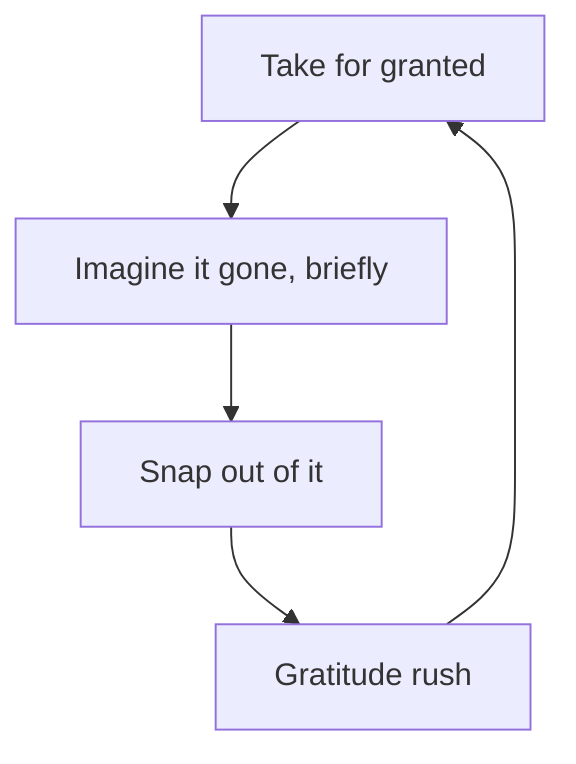
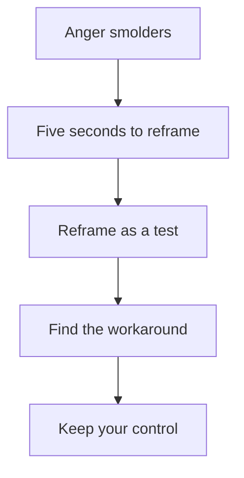

## Why this episode matters

William Irvine is a philosophy professor who set out at age 50 to become a Zen Buddhist and came out a Stoic instead. His book "A Guide to the Good Life," which he expected to sell 12 copies, helped launch the modern Stoic renaissance. This episode is the track's toolkit for the inner game: specific, testable psychological techniques for wanting less, fearing less, and staying steady. It follows ep03's systems thinking by turning the lens inward: your mind is the most complex system you will ever manage.

Note on the source: the transcript is auto-generated captions with some garbled words. Quotes below follow the transcript, uncertain renderings are marked [uncertain].

## What Stoicism is

### A philosophy of life, not a mood

Irvine defines Stoicism as a philosophy of life: an answer to "what is the grand goal in living, and how best to attain it?" The Stoic goal: a life full of positive emotions (delight, joy) and relatively free of negative ones (anger, anxiety, regret).

The founder was Zeno of Citium, around 300 BC. Back then there were no academic philosophers. You created a school, attracted paying students, and made your living, like a martial arts school mixing styles into your own. Most of Zeno's writings are lost. The Romans took Stoicism up, so the Stoics people know are Roman: Seneca, Marcus Aurelius, Epictetus, and Musonius Rufus.

They disagreed with each other. The widest gap: Musonius Rufus, the minimalist ("give me a cave to live in, that will do"), versus Seneca and Marcus Aurelius, who were vastly wealthy and powerful. Seneca, Irvine's current favorite, was counselor to an emperor, the greatest playwright of his time, and what Irvine calls "the first century A.D. equivalent of a billionaire."

The water-and-wine rule captures the common thread: asked what a Stoic needs to drink, the answer is water, it satisfies the need. Handed fine wine, the Stoic drinks it gladly. Take the wine away: "okay, do you have some water? I am thirsty." Enjoy what life offers without clinging to it. Always prepared for things to take a turn for the worse.

### Emotional preppers

Irvine calls Stoics emotional preppers. Physical preppers stockpile food for hard times and look foolish until the day everyone scrambles for toilet paper (his COVID example: the prepper with four years of toilet paper). Stoics stockpile psychological readiness: they rehearse losing what they value.

This sounds negative until you see the mechanism. If you prepare for loss, you stop taking everything for granted. What you have becomes vivid. Gratitude follows, and gratitude makes joy possible. The prepper's payoff is not survival. It is the savor of ordinary things.

### Lowercase-s stoics versus the real thing

The common image, the lowercase-s stoic, is someone who feels nothing and just takes it. Irvine says the actual Stoics were known to their households as cheerful. They were not anti-emotion. They aimed to prevent negative emotions and nip them early, while becoming connoisseurs of positive ones.

His examples of everyday delight: walk outside, the sky is blue. It did not have to be blue. It is a beautiful shade that changes hour to hour, day to day. You can say "yeah, it's a sky" or you can actually see it. Awe takes a little effort: he once picked up a rock near his home, realized it was a 400-million-year-old fossil from an ancient sea that once covered the land, and freaked out with joy while onlookers saw just a rock.

The ancestor test: view your life through your ancestors' eyes. Running water. A toilet. Toilet paper. A pocket device that can order pizza in Hong Kong. You live in their heaven, their dream world. And what do we do? "I do not have the latest model of that phone. Boohoo, pity me." Much unhappiness, he argues, is self-inflicted: a framing problem, not a circumstance problem.

## The hedonic treadmill: why satisfaction expires

### Wired by the savanna

Why does the new thing stop making us happy? Because we evolved that way. Irvine puts our ancestors on the savannas of Africa, roughly 200,000 to 70,000 years ago [transcript's rough numbers].

Imagine the ultimate cool dude among them. While everyone worried about lions and the next meal, he sat in the savanna admiring the blue sky, fully in the moment. He stayed in the moment for a moment. Then a lion ate him. [Irvine's joke, the transcript is unclear on the exact phrasing.]

The serious point: ancestors who were easily satisfied dropped out of the gene pool. The survivors were the dissatisfied ones: always thinking about the past to learn from it, always thinking about the future to control it, always wanting more. Dissatisfaction had survival advantage. It is in your family tree.

The mismatch: we live in a dramatically different world. Food is not the problem, overeating is. Our ancestors' possessions were limited to what they could carry in their hands. Ours fill houses. But the wiring persists: get something, raise the standard, fill in the blank after "if only I had ___." His image: thirsty people chasing mirages in a desert, working hard to reach each seeming pond, finding it dry, moving to the next.

### Why Stoicism enjoys a renaissance

Philosophers lost interest in "how to live" after antiquity, Irvine met Stoicism only in a logic class in the 1970s. When "A Guide to the Good Life" appeared, he found a handful of translations, a handful of scholarly books, and almost nothing for general readers. It started slowly, then accelerated. He recently spoke at a global Stoicon convention, and his research found books on Stoicism for general audiences now appearing at a rate of more than one per day.

His explanation for the boom: Stoicism is hackable. (He hates the word, uses it anyway.) It offers specific psychological techniques that are easy to learn, easy to test-drive invisibly, and cheap to adopt, unlike Zen Buddhism's long meditation project that might pay off tomorrow or in 30 years. People try the techniques, they work, word spreads.

## The techniques

### Negative visualization

His favorite starter technique. The two-minute exercise, as he walks Shane through it:

Step 1: think of something you rely on daily and take for granted. A person, your job, your health, your eyesight.
Step 2: imagine it gone. Fill in the details for a flickering moment. For eyesight: close your eyes, imagine they are glued shut, try to open them, realize you never will. Let it soak in.
Step 3: open your eyes. Look. Two minutes ago this was utterly taken for granted.

The twist that makes it safe: do not dwell. It is a flickering thought, not a meditation on doom. Dwelling would be a recipe for misery. Imagine the loss, fill in some detail, snap out of it, go on with life.

His domestic evidence: his wife hears him yell "thanks for existing" from the back bedroom. She knows he just imagined her absent and felt the rush of what that loss would mean. The technique converts "yeah, this is fine for now, if only I had something better" into its opposite.

Figure 1. Negative visualization. AI Podcast Curriculum, ep04 (William Irvine, 2021-11-02). Shell 3. Apply the one rule. Source: original toy, from episode claims.

### The trichotomy of control

Epictetus gets credit for the dichotomy of control: some things are up to us, some are not. Irvine's spin is the trichotomy: three categories.

1. Things you can control (near-complete control): the values you pick, the goals you pick, and with effort, how you respond to challenges.
2. Things you cannot control at all: if an asteroid hits the earth tomorrow, you cannot stop it.
3. Things you have some but not complete control over: the middle category, where most of life lives.

His example: a scheduled tennis match. You cannot control how hard your opponent trains, their strategy, or how hard they play. You can control how hard you practice, your strategy, your conditioning. Focus your attention there. Time spent worrying about the uncontrollable is wasted time and energy.

The anxiety connection: anxious people are often concerning themselves with things they cannot control. The technique does not remove the concern by argument. It removes it by reallocation: attention goes to the controllable slice.

A friend's case: someone focusing on something they could not control, recognizing it, unable to stop. Irvine's honest answer: he is a practicing Stoic of 20 years and still tosses and turns. Practice has two senses: making it part of ordinary life, and working to get better, like practicing an instrument. Progress, not perfection.

Figure 2. The trichotomy of control. AI Podcast Curriculum, ep04 (William Irvine, 2021-11-02). Shell 3. Apply the one rule. Source: original toy, from episode claims.
| Column | Rule | Example from the episode |
|---|---|---|
| 1. Can control | Spend energy here | Your practice, your strategy, your conditioning |
| 2. Partial control | Spend energy here | Most of life lives here |
| 3. Cannot control | Zero minutes: the asteroid test | Opponent's training, an asteroid hits earth |

### The five-second rule

From his book "The Stoic Challenge." The setup: you are locked inside your skull for life with two terrible roommates. One has anger issues and keeps nudging you: "that guy said that thing about you, you should be angry." The other is an emotional basket case who arrives at bedtime: "I am worried about this, you should worry too." COVID lockdown proved the metaphor: stuck in apartments with difficult people was bad, stuck with your own internal roommates is worse, because it never ends.

Why the roommates exist: ancestors who got angry when their status dropped survived and reproduced. Those who took it in stride did not. You are wired for both anger and anxiety.

The technique: notice the earliest smoldering of anger. You have about five seconds to reframe it before it bursts into flame. Once it flames, it stays, he notes that even people who have lost most of their memory can recount a 40-year-old insult in graphic detail. Anger has that power.

The reframe: treat the incident as a test. "Can I work around this? Can I repackage it so it does not trigger the feelings that wake me at night?" Passing the test has two parts: find a successful workaround to the setback, and more importantly, do not lose control while working around it.

The broken-pipe analogy: a broken water pipe is a setback, a plumber fixes it for a few hundred bucks. The harm is not the pipe. It is the flooding water: collapsed ceilings, flooded basements. With setbacks, the setback is the pipe, your response is the flood. An offhand remark about your appearance is tiny. Tossing and turning over it for nights is the flood. Most of the harm setbacks do is self-inflicted.

His Zoom-talk evidence: he stopped watching the chat during talks after noticing one negative comment would eat the next seven minutes of his speech while praise bounced off. A thousand positive comments do not stick, the one negative comment stays. That asymmetry is the wiring. The Stoic response is environmental design: remove the exposure you can control.

Figure 3. The five-second rule. AI Podcast Curriculum, ep04 (William Irvine, 2021-11-02). Shell 3. Apply the one rule. Source: original toy, from episode claims.

### Mentors and anti-mentors

On praise: be picky. Praise from a designated mentor is cause for celebration, because you chose that person as someone who understands something, when they talk, you shut up and take notes. Praise from strangers is noise: you do not know their values, and with social media, lives get taken over by the thumbs-ups of people whose values you might not share.

The anti-mentor: someone whose praise is a bad sign. You observed them, concluded they play a radically different game, usually the social-status game (the car, the house, the impression). If they approve of you, worry. If they look down on you, take it as confirmation you are not playing their game. His image: for them, what you do would be like bringing a hockey stick to a baseball game. Do not tell them their game is foolish, they feel the same about yours.

Practical forms: limited mentors (mentors in the sport, whose criticism of his technique he takes seriously, without hurt feelings), and the guiding question "what would Seneca do?" when stymied. Marcus Aurelius's version, which he quotes: "Is it my purpose here to lie and keep warm under these blankets?" No: get up, you have a social duty.

Related: people you are simply allergic to. "That's just Bob being Bob" is the working mantra. You can control your exposure to some of them, with relatives and coworkers you cannot fully, so you keep distance where possible and narrate the rest ("he can not control himself, that's just who he is"). He admits he is not there yet: check back in a decade.

Also: discount critics who are not in the arena. It is easy to sit in the stands lobbing grenades at anyone attempting something hard. If they have not done what you try to do, their comments add little.

### Failure as training

He is a fan of failure, with the clarification that he does not enjoy failing. The logic: failing in public signals you attempt things that are hard for you, which is admirable. Never failing gets the Stoic response: "do something hard, then."

His rowing: he competes, often places badly, sometimes last. But he plays a different game than the placement game. The game is: do not fear failure, grapple with the inner voices, do the physical training. Two-thirds through a race, the roommates come out: "Bill, would not it be nice to slow down? Why not quit altogether?" You tell them to shut up and push on. Coming last still beats the approximately 7.5 billion people who did not show up at the starting line. [Transcript's number.]

Shane's shortcut story makes the same point: on his 10-mile run, a shortcut at mile 3.5 turns it into 9. He took it once. For three months afterward, every pass made the shortcut harder to resist. Better to walk the full 10 than to take the shortcut once. Irvine's gloss: giving in to the voices once is like injecting them with adrenaline. They get superpowers. After that they own you.

And self-discipline, the episode's opening theme: it means controlling the one life you have to live. The follow-up question: if you are not controlling it, who or what is, and why would you allow that? What a waste.

### The psychological immune system

A biological immune system needs exposure to germs to stay healthy. The bubble boy: no immune system, raised in a plastic bubble with filtered air, no human contact. At 10 or 12 [transcript uncertain on the age], a bone-marrow transplant from his sister was supposed to cure him, one lurking germ in the marrow killed him. Irvine's pediatrician relative gives the official-flavored advice: a kid should eat a pound of dirt. Not literal, but exposure to germs growing up builds a healthy system. Left alone, kids do it naturally: sucking the TV remote, tasting the dog.

The psychological version: live in a psychological bubble, never challenged, never insulted, always smoothed over, and you become the bubble boy. The first real exposure crumbles you. He worries modern life puts many people in partial psychological bubbles, with protection that weakens. The Stoics, time-traveled to today, would prescribe a more challenging environment.

For kids specifically: the teen years are prime time for Stoicism, because you cannot escape other people. Teachable techniques: respond to an insult with a joke ("if that's the worst thing you have to say about me, you do not know me well enough"), or with no response at all. His observed sequence: say nothing, let them wonder if you heard, let them repeat it, then "yeah, I heard you the first time," and continue the conversation. It takes little effort and lands like a knockout, because their best shot did not register. (He wrote a follow-up book on insults.) The wiring runs deep: on the savanna, accepting an insult meant losing status, which meant less food and fewer mates. Teenagers feel everything deeply because the wiring is loudest then.

### Decisions: fragment and map

Stoic decision advice: fragment the decision into the part you can control and the part you cannot, and focus on the former. Then, as logicians, map the options. His teaching point: invest quality time in thinking about what your options are, including brainstorming, because the obvious option may not be the optimal one. The guarantee he offers: if you do not even consider the optimal option, you cannot pick it. With his wife, trip planning means laying out a bunch of options, some way out there, then choosing rationally. For him it is second nature.

### Skeptical and open-minded at once

His current project: being simultaneously skeptical and open-minded, the key to a mind full of true and useful beliefs.

Open-minded without skeptical: the mind fills with conspiracy theories and strange stuff, ideas flow in unfiltered. Skeptical without open-minded: the guard admits only true beliefs, but blocks other true and useful ones you never consider.

Confirmation bias is the enemy: believe something, and you seek confirming evidence while ignoring the rest. His image: one sugar crystal dropped into a supersaturated solution grows into a massive crystal. A tiny belief grows into a major obsession.

The practice: reach out to intelligent, articulate people on the other side of a debate. Listen to learn, not to refute. Talk without trying to display mastery. And the trap: "in this debate there are no intelligent articulate people on the other side." That sentence is itself a sign of closed-mindedness, and it marks you as precisely the person who most needs to find them. Almost invariably, they exist, and you can gain from talking to them.

Figure 4. The skeptical/open-minded matrix. AI Podcast Curriculum, ep04 (William Irvine, 2021-11-02). Shell 1. Show the toy. Source: original toy, from episode claims.
| | Open-minded | Closed-minded |
|---|---|---|
| Skeptical | True and useful beliefs grow | True but few beliefs |
| Uncritical | Conspiracy theories flood in | Beliefs freeze |

## Questions and answers

**Q1: Explain this episode to me like I am new. What is Irvine's message?**
You cannot control most of what happens, but you can control your framing, and framing is most of happiness. Practice three techniques. Negative visualization: briefly imagine losing what you take for granted, then feel the gratitude rush. Trichotomy of control: sort everything into can-control, cannot-control, and partial-control, and spend energy only on the first and third. Five-second rule: catch anger in its first five seconds and reframe the incident as a test. Underneath: want less, cling less, and expose yourself to enough difficulty to keep your psychological immune system working.

**Q2: Do the two-minute negative visualization exercise with me.**
Pick one thing: your eyesight is the classic. Close your eyes. Imagine they are glued shut and will never open. Hold the details for a few seconds. Now open them and look around. That rush is the technique working: two minutes ago, sight was background noise. Rules: keep it flickering, never dwell. Dwell and it becomes misery rehearsal. Do it routinely, the way Irvine's wife hears "thanks for existing" from the back bedroom, and the hedonic treadmill loses power over that thing.

**Q3: Applied: I am anxious about something. Walk me through the trichotomy.**
Write the worry at the top. Draw three columns: can control, partial control, cannot control. The asteroid test: anything in column three gets zero further minutes. Move every actionable piece into columns one and two. Example: the tennis match. You cannot control the opponent's training or strategy. You can control your practice, your conditioning, your game plan. Anxiety usually means attention is parked in column three. Move it.

**Q4: What is meta anger, and what do I do about it?**
Meta anger is anger aimed at your own anger. The practicing Stoic gets upset at a second level: "I let this get under my skin." Do not fight the meta layer directly. Go back to the five-second rule on the first layer: notice the smolder, reframe the incident as a test with two passing conditions (find the workaround, stay in control). The meta anger fades when the primary anger gets reframed early. And for repeat offenders, use the allergy protocol: "that's just Bob being Bob," plus reduced exposure.

**Q5: Someone insulted me. What are my Stoic options, in order?**
Best: no response. Continue the conversation as if nothing happened. If they repeat it: "yeah, I heard you the first time," and continue. Next: make a joke of it and turn it around. The principle: their best shot did not register, which is the ultimate put-down, and it costs you almost nothing. Remember the wiring: you care because savanna status once meant food and mates. The insult is words. Words only.

**Q6: How do mentors and anti-mentors change whose feedback I take?**
Sort feedback by the source's game, not its tone. Mentor: someone you designated as understanding something, their praise is celebration, their criticism is homework. Anti-mentor: someone playing the status game, their praise is a warning light, their criticism is confirmation you are not playing their game. Strangers: their values are unknown, so their praise and blame are both noise, do not let metrics from unknown people run your life. People outside the arena: discounted entirely.

**Q7: I never fail. Is that good?**
The Stoic answer: do something hard, then. Failure in public is evidence you attempt things at your edge. Irvine rows competitively, sometimes finishes last, and counts it as training: the real event is the two-thirds mark where the inner voices offer the shortcut and you refuse. One surrender gives the voices superpowers, so protect the streak of not quitting more than the placement. Scoreboard: last place among racers still beats 7.5 billion non-starters.

**Q8: How does this episode connect to the track's arc?**
Ep01 gave you models of the world, ep02 gave you first principles, ep03 gave you systems thinking for markets. Ep04 turns the same discipline inward. The trichotomy is systems thinking applied to your attention: sort variables by controllability. The five-second rule is second-derivative thinking applied to emotion: catch the cause, not the flood. The psychological immune system is antifragility for the mind. The track's arc from models to rationality runs through here: you cannot think clearly with a dysregulated mind.

## Memory aids

Mnemonic: **N-T-F**: Negative visualization, Trichotomy of control, Five-second rule.

Never-confuse pairs:
- Stoic versus lowercase-s stoic: the philosophy of minimizing negative emotion versus the caricature of feeling nothing. Real Stoics were cheerful.
- Mentor versus anti-mentor: designated teacher whose praise counts versus status-player whose praise warns. Sort by their game.
- The pipe versus the flood: the setback versus your response to it. Fix the pipe cheap, the flood is what destroys the house.
- Dwelling versus flickering: rehearsing loss at length (misery) versus touching it for a second (gratitude). Same exercise, opposite doses.

Trap cards:
- Trap: "I will be happy when I get ___." Reality: the treadmill guarantees the blank refills. Negative-visualize what you have instead.
- Trap: "I need to control this outcome." Reality: run the trichotomy. Most of the outcome is column three. Work columns one and two.
- Trap: "Their criticism must mean something." Reality: check whether they are in the arena and what game they play. Strangers' metrics are noise.
- Trap: "Protecting people from difficulty helps them." Reality: the bubble boy. The psychological immune system needs exposure.

## How to imbibe this

1. The morning flicker. Each morning, pick one thing you take for granted. Imagine it gone for ten seconds. Feel the rush. Move on. Observable change: within two weeks, "thanks for existing" moments start happening unprompted.
2. The trichotomy page. For your biggest current worry, draw the three columns tonight. Cross out column three. Schedule one action each for columns one and two. Observable change: the worry gets smaller because attention moves.
3. The five-second drill. This week, watch for the smolder: the first heat of anger. Name it silently: "test." State the two passing conditions: workaround, no loss of control. Observable change: at least one incident that would spoil an hour spoils five minutes.
4. The chat fast. Like Irvine's Zoom chat: identify one feedback stream you cannot stop reacting to (comments, metrics, notifications). Hide it for a week. Observable change: attention returns to the work.
5. The anti-mentor sort. List five people whose opinions move you. Label each: mentor, anti-mentor, stranger, or not-in-arena. Change one behavior per label this week. Observable change: less praise-seeking, less sting.
6. One hard thing. Attempt something this month where public failure is likely. Define the real game in advance (not placement). Observable change: the inner voices get quieter at the two-thirds mark.

## Think it yourself

Harder than ep03. No worked answers this time, the episode gives you the tools, not the solutions.

**Drill 1: the flicker log.** For seven days, do negative visualization on a different thing each morning. Log the thing, the vividness (1-5), and the gratitude duration. At week's end, find the pattern: which categories produce the strongest rush? Write what that tells you about what you actually value versus what you chase.

**Drill 2: trichotomy audit.** List your ten biggest time expenditures this week. Classify each activity's target into the three columns. Compute the share of time spent on column three (uncontrollable). Design next week with that share halved. Defend each remaining column-three minute in writing.

**Drill 3: anger autopsy.** Recall your last three anger incidents. For each: what was the pipe (the setback) and what was the flood (your response)? Estimate the damage ratio: how much harm came from the pipe versus the flood? Identify the five-second window you missed. Write the reframe you would use next time.

**Drill 4: the arena filter.** Pick the harshest criticism you received recently. Ask: is this person in the arena? What game are they playing? Rewrite the criticism as it would sound from a mentor, an anti-mentor, and a stranger. Notice how the same words change meaning by source. Decide what, if anything, to change.

**Drill 5: bubble check.** List the difficulties you engineered out of your life in the last five years (conveniences, avoided conflicts, smoothed paths). For each, ask: did removing it strengthen or weaken my psychological immune system? Pick one to reintroduce deliberately. Design the reintroduction so it challenges without overwhelming.

**Drill 6: belief crystal.** Pick a belief you hold strongly. Trace it back: what was the original sugar crystal? List the confirming evidence you collected and, harder, the disconfirming evidence you ignored. Find one intelligent, articulate person on the other side and steelman their case in a paragraph. Note what happens to the crystal.

## Skills you can now use

- Run negative visualization as a daily gratitude practice.
- Sort any worry with the trichotomy of control and reallocate attention.
- Catch anger in the five-second window and reframe incidents as tests.
- Separate the pipe (setback) from the flood (response) in any upset.
- Classify feedback sources as mentor, anti-mentor, stranger, or not-in-arena.
- Design your information environment to remove uncontrollable triggers.
- Hold skepticism and open-mindedness simultaneously when examining beliefs.

## Go deeper

- The episode itself: https://www.youtube.com/watch?v=lSIErua5q04
- "Thinking, Fast and Slow": https://en.wikipedia.org/wiki/Thinking,_Fast_and_Slow (HTTP 200, verified 2026-10-06)
- "Principles: Life and Work": https://en.wikipedia.org/wiki/Principles:_Life_and_Work (HTTP 200, verified 2026-10-06)
- Stoicism: https://en.wikipedia.org/wiki/Stoicism (HTTP 200, verified 2026-10-06)
- Farnam Street's podcast archive: https://fs.blog/podcast/ (HTTP 200, verified 2026-10-06)

## Figure audit

| Unit id | Claim | Before | After | Figure id | Medium | Source | Four tests |
|---|---|---|---|---|---|---|---|
| u01 | Negative visualization loop | Taking things for granted | Flicker of loss, gratitude rush | fig1 | mermaid | episode claims | T1: 4-node loop / T2: a step loop forces mermaid / T3: none, static plate / T4: the gratitude-rush node, reused in the imbibe practice |
| u02 | Trichotomy of control | Anxiety parked anywhere | Attention sorted into three columns | fig2 | table | episode claims | T1: 3-column sort with episode examples / T2: a split forces a table / T3: none, static plate / T4: the three columns, reused in Q3 and Drill 2 |
| u03 | Five-second anger reframe | Anger flames unchecked | Smolder caught, reframed as a test | fig3 | mermaid | episode claims | T1: 5-node chain with two passing conditions / T2: a step loop forces mermaid / T3: none, static plate / T4: the two conditions, reused in Q4 and Drill 3 |
| u04 | Skeptical/open-minded matrix | One-dimensional thinking | Two-axis belief hygiene | fig4 | table | episode claims | T1: 2-by-2 matrix / T2: comparison of values forces a table / T3: none, static plate / T4: none reused |
