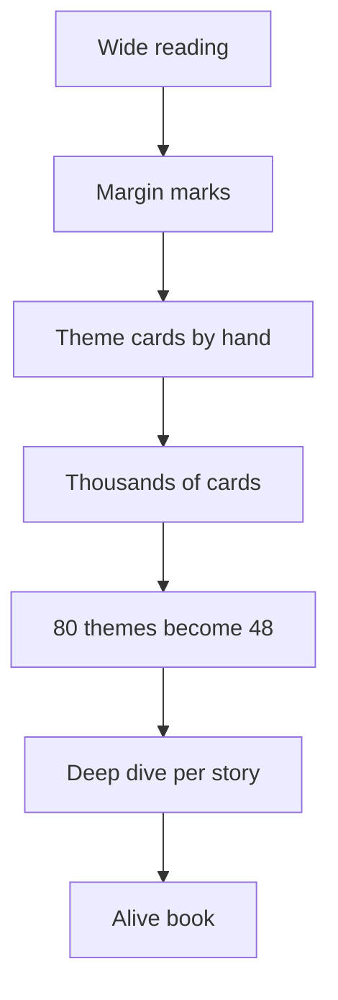

## Why this episode matters

Robert Greene wrote "The 48 Laws of Power" at 39, after years of unhappy work in Hollywood and journalism, and watched it sell steadily for two decades toward 2 million US copies. This episode is two masterclasses in one: how power actually works among people, and how deep research actually gets done. Greene reads roughly 2,000 books per project cycle and converts them into chapters through a note-card system he refined over decades since the 1990s. It sits fifth in the track because it teaches the outer game (reading people, strategy) and the work method (research as a physical system) that the earlier episodes' thinking tools require.

## The 48 Laws: why it lasted

### Designed to be timeless

Shane opens with the slow-burn question, and Greene corrects him: the book sold well from the start in 1998. It got press, which was unusual for him. Rappers picked it up. Wall Street picked it up. It spread through the culture. Then it just kept selling, steadily, for nearly 20 years, with spikes when articles appeared or when Trump got elected. Most books sell hard then die. This one never died.

His theory of the longevity: he designed it to be timeless. He mined all cultures and all periods of history to make it feel like he uncovered something real about power. He admits some literary license and that he may have made it harsher than reality. But the core appeal, he argues, is honesty about a taboo: people are manipulative in hidden ways, offices and politics run on a hidden language, and most books about power are too skittish to say so. Readers are hungry for the unvarnished version, especially in "correct" times. No sugarcoating, no moral lesson at the end of each chapter to make you feel better about human nature. Some readers hate it for exactly that reason. Many more find it delicious.

### What success changed

The book came out when he was 39. Before that: no success, no happiness, a decent living in Hollywood, worried parents. The radical change was attention and success, which repaired his self-esteem. The subtler change took years: powerful people in music, politics, and business sought his advice. He consulted for them (one he can name: 50 Cent, with whom he wrote a book). Watching his laws reflected through their harsher environments enriched his knowledge and made him more sophisticated. He calls his early self "a little bit green." The lessons went into the later books.

## The research machine

### Cast a wide net, keep it open

His research starts without a fixed destination. He casts a wide net because he does not know what the book will be, and keeping it open-ended keeps him excited and creative. Close the book early and the project dies on the vine. Early reading is broad: anthropology, psychology, psychoanalysis, human roots. Then biographies, lots of them.

His taste test for books: a good book shows the writer put in effort, knows the subject, thought deeply, and is not afraid to speculate. A bad book has one interesting idea in chapter one and repeats it, or grinds an axe of prejudice. He can tell from the back cover or the first five pages whether a book has "the juice."

Examples from the transcript: he likes Walter Isaacson but found the Steve Jobs biography rushed and shallow, skimming the surface without nailing Jobs's psychology. For Napoleon, the central figure of his war book, he read roughly 5,000 pages of biographies, none nailed what made Napoleon tick, so he formed his own interpretation. Robert Caro's "Master of the Senate" is his gold standard: a treatise on power full of interpretation and speculation. Ron Chernow's "Titan" on Rockefeller is good but not Caro-level. For the human-nature book he deliberately sought biographies of women: Coco Chanel (orphan who clawed to the top, her Nazi sympathy "a very large black mark"), Martin Luther King Jr. (an 800-page biography), Caterina Sforza ("Tigress").

He avoids most contemporary popular nonfiction on purpose. He does not read Malcolm Gladwell, though people compare them, because he does not want overlap, he wants originality. His formula: 95 percent from other writers, 5 percent from himself, and that 5 percent is the important part. Dead writers make originality easier. Exceptions: scientists and anthropologists, like Jared Diamond and the 1990s "War Before Civilization."

### The note-card system

The system, unchanged since "The 48 Laws of Power":

1. Read the book carefully (skip like hell if it is bad). Mark margins as you go.
2. Weeks later, revisit and transfer notes to cards, organized by theme. At the top of each card: the theme name (envy, grandiosity, irrationality).
3. Accumulate thousands of cards. His irrationality chapter drew on over 100 cards from over 50 books.
4. When writing a story (Rockefeller, Napoleon), pull the cards and go deeper into the books again, until he feels he knows the person non-superficially.

Why physical cards, not Evernote: handwriting with a fountain pen makes him think more deeply than typing, he feels it but cannot fully explain it. And a box of 2,000 cards can be flipped through with fingers at speed, several at once, backs included. A screen is flat: one thing at a time. The cards give a visceral, material feel for what the book actually is. He taught the system to Ryan Holiday, who does the same.

Themes emerge from the material, not from an outline. "The 48 Laws" began as roughly 80 recurring themes across Machiavelli, Sun Tzu, von Clausewitz, Nietzsche, and more. He whittled them down the way a cook reduces a sauce: not too strong, not too weak, until 48 remained. The human-nature book went from about 30 to 24 to 18. A good book, he says, feels alive and vibrating, you can sense the writer's brain flickering on the page. A dead book has no energy. Keeping the process open is what keeps it alive.

Figure 1. The Greene research pipeline. AI Podcast Curriculum, ep05 (Robert Greene, 2022-10-11). Shell 1. Show the toy. Source: original toy, from episode claims.

## Strategy and reality

### The flanking maneuver in daily life

For "The 33 Strategies of War," the hard problem was to render Napoleon practical. Napoleon's signature: the flanking maneuver, always attacking from the side or behind so the enemy is surprised and disorganized. How does that apply to a software firm in Silicon Valley?

The translation: approach people indirectly. The indirect approach has tremendous psychological power. No punch in boxing hits harder than the one from the side that you never saw. Hit a rival frontally and they deploy their best defenses, it becomes a slugging match. Surprise them, in seduction, in sales, from an unexpected angle, and you get Napoleon's psychology at Austerlitz.

With Sun Tzu he went further: months with annotated editions that explained the Chinese characters chapter by chapter, chasing what translations hide. The questions he pursued: what creates force in the world? What makes one action more forceful than another? What is momentum, really? He describes a euphoric feeling near the end: he uncovered something not covered before, or so it felt.

### The three zones of reality

Shane asks how he stays connected to reality. Greene's frame: 99 percent of what we perceive is our perspective, not reality. But suppose 95 percent of mental processes are unconscious and 5 percent conscious. Push the conscious share to 6 or 7 percent and you are a realist. Realism is a margin game.

Three zones to pierce:

Zone 1: yourself. You are the source of all reality and you do not understand yourself. You do not know why you like a book, why you are attracted to someone, why a film moved you, why you chose your field. You react like an automaton. Start asking why, trace it to childhood, and you uncover a slice of reality about yourself. The payoff is immense: choose work that fits your weirdness, avoid people who drain you. The Oracle of Delphi: know thyself.

Zone 2: other people. You can be married 30 or 40 years and not know your spouse, because you do not listen. Other people become projections of your emotions. Stop projecting, get inside their skin, see the world from their point of view. That slight connection gives you influence and builds empathy, a potential people rarely tap.

Zone 3: the world. The zeitgeist, the cultural climate, the business environment, the competition. Without it you cannot build a book or a business that taps into where people are.

### Asking questions as the greatest power

He was, at the time, planning an essay on a single claim: the greatest power any human can have is the power to ask questions. Asking yourself is easy. Asking others is an art, because blunt interrogation makes people hate you ("tell me about your mother and father" asked wrong is intrusive).

The method: people love to talk about themselves, it is, he says, law number one of human psychology. Everyone's favorite subject is themselves, because they never get to be the star of their own show. Find what each person wants to talk about: childhood, parents, desires, ambitions. There is always an elegant way in. Discover their values, because values determine psychology: if someone values their body and exercise, everything revolves around that, find out why and where it came from.

The Socratic stance: sit down with someone you have known for years and assume you do not know them. Throw out the assumptions. "The only thing I know is that I do not know anything." Ask like a child: weak, vulnerable, curious. Listen deeply. The worst sin of the modern mind: feeling you know everything because Wikipedia and the smartphone are in your pocket. The essay's goal: return you to your ignorance, because admitting it is what makes you ask, listen, and learn.

### Detecting bullshit

His radar, verbalized as far as it can be:

- Actions over words. What has this person actually accomplished? Cut the verbiage, check the record. Machiavelli called it the "effective truth": ignore what the Pope says about goodness, look at his actions. (His example: the Borgia pope as rapacious warlord.)
- Nonverbal signals. Body language reveals insincerity and facade confidence. Talking too much is a sign of insecurity. Quietness, seriousness, and admitting you are not always right mark the non-bullshitter.
- For hiring, the critical skill: study the resume for real achievement, then watch how they interact with people. That is where toxicity shows.

## The laws, applied

### Law 4: always say less than necessary

Shane reads Greene's own text back: the more you say, the more common you appear and the less in control, even the banal sounds original when vague and sphinx-like, powerful people impress by saying less, the more you say, the likelier a foolish remark.

Greene's expansion: heavy talkers signal nervousness and insecurity, they look weak. Say slightly enigmatic things and people wonder what else is in there, making people think about you is power. The less you say, the more others talk, the more they talk, the more you learn their weaknesses and hidden desires, the less they know about you, the easier you can surprise them.

The cultural counterpoint: the transparency culture of Facebook, where everyone broadcasts breakfast and opinions, makes people banal and familiar. Nobody finds your lunch interesting except you. Cultivate mystery. Withdraw sometimes. Get control of your tongue. The caveat: not silence, and not in romance, where honesty and being known matter. But in general, people are not mysterious enough, and there is tremendous power in talking less.

### Law 29: plan all the way to the end

The diagnosis: people are locked in the moment, reacting. He calls it "tactical hell": always responding to what people hand you, never rising to strategy, which requires thinking at least two moves ahead.

The method: fix the ending first. "In one year I will destroy them in sales and take the share." Then work backward: how do I get there? A plan built backward from the ending is power, because it stops being a reaction to the rival's moves. His larger claim: we are animals with consciousness, and we misuse it, spending it on reacting to every tweet and news cycle. The proper use of intelligence is to project into the future: imagine possibilities, options, consequences, in depth.

### Law 41: avoid stepping into a great man's shoes

The literal case: replacing a famous, successful CEO is fraught, you will be compared forever and swallowed by the shadow. Do not try to repeat what the predecessor did.

The metaphoric reach, which he stresses: wherever you enter, predecessors and famous names exist. Do not present yourself as "Malcolm Gladwell Jr." You will lose the comparison and vanish into the shadow. Set off in a fresh direction. Make it original, make it you. Then there is no shadow.

### Law 48: assume formlessness

Asked for the single most applicable law, he calls the question impossible, which makes the answer Law 48: formlessness. The other 47 laws can be nonsense in the wrong moment. Do not walk into a situation reciting laws. Be alive to the circumstance, flexible, willing to throw the book out.

Everything depends on position. He works for himself at home, the laws that matter to him differ from those for a middle manager or a 500-person CEO. A dozen laws transcend situations (keep people dependent on you, say less than necessary), but context rules: an MSNBC host should not say less than necessary. He notices readers' eyes gravitate to the chapters they violated: "learn not to put too much trust in friends... wow, I really violated that one." The book works as a mirror.

## Live time versus dead time

The closing idea, and the episode's most quoted. You own nothing in life, he argues. Not stock, not money, it all disappears. The only thing you own is time: say 85 years. That is yours.

Live time: time that is your own. Nobody commands how you spend it. You are urgent, a bit edgy, aware of each moment passing, not in a fog. Dead time: time others own. Flipping burgers at Burger King for someone else, no energy, no creativity, no thought of the future. "You might as well be dead."

The conversion: the same Burger King shift becomes live time if you bring ownership to it. Read Nietzsche's "Beyond Good and Evil" on break and think about it. Or set the plan: one year, quit, save money, night school, kick ass in the field. Study the customers at 2 a.m. Ask them questions. Go home and read and prepare. Now the dead time has a purpose, the purpose is yours, and you own the time again.

Figure 2. Dead time to live time. AI Podcast Curriculum, ep05 (Robert Greene, 2022-10-11). Shell 3. Apply the one rule. Source: original toy, from episode claims.
| | Dead time | Live time |
|---|---|---|
| Who owns the hours | Someone else | You |
| Mind state | Fog, no future | Urgent, aware, edged |
| The shift | Flipping burgers, owned | Same shift plus a plan and study |
| Conversion | None | Purpose you chose |

## The work behind the work

### Routines

The sixth book took nearly four years. The work is physically demanding: three or four hours of deep mental labor leaves him like a vegetable, fit only for cheap TV. His sustainment system:

- Meditate every morning: eight years of rigorous, long morning meditation. Clears the mind, stops the frantic.
- Exercise every day, even sick: swimming every third day, a mile and a half without stopping, rigorous hikes, a yoga/Pilates routine on the third day for the sitting body. Never lifted a weight in his life.
- Back rehab: after his back went out so badly he could not stand for days, a 20-minute morning stretch routine (down dog held intensely, each pose about a minute, on chiropractor's 40-second-minimum advice). He calls the result miraculous.
- Three hours of writing a day, about all he can stomach. The rest: notes, thinking, mindless online reading to decompress.

The unconscious rule, which he disclosed in "Mastery": the best ideas arrive when you are not thinking about them. Shower, sleep, dreams. So he protects mental space fiercely: no constant chatting, texting, or nights out. Vegging out, naps, and mindless TV are not laziness, they are when the brain processes in the background.

### Saying no

Protecting the space requires being "a bit of a tyrant." He says no constantly, gets grumpy and cranky about distractions once momentum builds, hides from the world, does almost no interviews. It gets lonely, the ego whispers that nobody thinks about him anymore. He accepts the cost. Cut the distractions or the process does not work.

### Mistakes and amor fati

His biggest mistake: choosing the wrong profession. Journalism in New York in his twenties cost him several creative years, Hollywood cost more. Plus 20 small ones: violating Law 1 (never outshine the master) three or four times before writing the book. As a TV researcher he was so good at finding stories that everyone hated him, instead of a raise he got fired.

His frame, via Ryan Holiday's "The Obstacle Is the Way" and his own "The 50th Law": amor fati, love of fate. You made the mistake, learn from it, there was a reason behind it. Mistakes are good if you glean the lesson.

Getting less emotional with age: partly age and perspective, mostly meditation. Ninety percent of his practice is Zen meditation: watching your own thinking as a spectator, seeing the anxieties and obsessions as if they belonged to another person. That distance reveals you as a programmed responder, and with distance comes the ability not to react. Hang back. "That's just life." Wait and see.

## Questions and answers

**Q1: Explain this episode to me like I am new. What is Greene's message?**
Two crafts. Reading people: assume you do not understand yourself or others, ask questions like a child, watch actions not words, and stay formless instead of reciting rules. Doing deep work: read widely, take notes by hand on cards, let themes emerge from the material, write three focused hours a day, protect the unconscious with rest, and say no to everything else. Underneath both: own your time. Dead time is any hour someone else owns, convert it with a plan and study.

**Q2: How do I start the note-card system this week?**
Pick one book you read. Read with a pen, mark anything worth revisiting. Two weeks later, revisit the marks and write each on a card (physical cards, handwriting matters) with a theme word at the top. After five books, spread the cards by theme and look for the pile that is biggest. That pile is your chapter, your essay, or your project's center. Do not start with the themes, let the cards reveal them.

**Q3: Applied: I want to detect bullshit in a hire. What do I do?**
First, the record: what has this person actually accomplished? Cut verbiage, check outcomes. Second, the room: watch how they interact with people, especially those with no power over them. Third, the nonverbals: constant talking signals insecurity, quiet seriousness and admitted fallibility signal the opposite. Fourth, toxicity: the interview is a performance, the interactions between performances are the data.

**Q4: What does "plan all the way to the end" look like in practice?**
Write the ending with a date: "in 12 months, X is true." Then write the step before the ending, and the step before that, until you reach today. If any step is "react to what the rival does," rewrite it as something you initiate. Check weekly: are you executing your plan or answering their moves? Tactical hell is the default, the backward plan is the exit.

**Q5: When should I break the 48 Laws?**
Whenever the situation demands it: that is Law 48. The laws are instruments, not commandments. Say less than necessary, unless you are a broadcaster. Never outshine the master, unless you have no master. The reader's test: notice which chapter your eyes stick to. That is the law you are currently violating or needing. Start there.

**Q6: How do the three zones of reality change a normal week?**
Zone 1: ask "why" about one of your own reactions each day, trace it back once. Zone 2: in one conversation, stop projecting and try to see the situation from the other person's side, note what changes. Zone 3: read one piece about your industry's current climate and ask what it means for your next move. Five percent to seven percent: that is the whole game.

**Q7: My job feels like dead time. What now?**
First, name it honestly. Then convert it: attach a plan (quit in a year, save, night school, new field) and a study practice (read on breaks, interrogate the 2 a.m. customers, observe people). Dead time with a purpose you chose is live time. The shift does not change, the ownership does. If no plan is possible, the honest answer is that the job is dead time and you spend your only currency on it.

**Q8: How does this episode connect to the track's arc?**
Ep04 gave you the inner game: control your framing. Ep05 gives you the outer game: read people, detect manipulation, stay strategic. The research system is the track's method made visible: ep01's models and ep03's bedrock both require exactly this kind of deep, original study. And "live time" is the track's thesis in miniature: attention is the only currency, spend it like you own it, because it is the only thing you do.

## Memory aids

Mnemonic: **R-P-L**: Research (cards), People (questions), Live time (ownership).

Never-confuse pairs:
- Timeless versus timely: mined from all of history versus tied to this news cycle. Timeless compounds, timely expires.
- Alive book versus dead book: the writer's energy on the page versus dutiful repetition. You can feel which one you write.
- Live time versus dead time: owned hours versus rented hours. Same job, different ownership.
- Formlessness versus lawlessness: adapting the laws to the circumstance versus ignoring all principles. Law 48 is mastery, not anarchy.

Trap cards:
- Trap: "I read the book, so I know the person." Reality: 5,000 pages on Napoleon and still no one nailed him. Depth beats coverage.
- Trap: "More transparency is always better." Reality: broadcasting everything makes you banal. Mystery is a feature.
- Trap: "I will start once I know the full plan." Reality: cast the net open, the themes emerge from the material. Certainty first kills it.
- Trap: "Their words sound good." Reality: Machiavelli's effective truth. Watch the actions.

## How to imbibe this

1. The card box. Buy index cards. Start the margin-mark system on your current book tonight. Observable change: in a month you own a searchable external brain.
2. The 5 percent rule. On your next project, aim for 95 percent sourced, 5 percent original. Write the 5 percent down explicitly. Observable change: you stop repeating and start contributing.
3. One Socratic coffee. Meet someone you think you know. Assume you do not. Ask like a child, listen deeply. Observable change: one relationship gets realer.
4. The backward plan. Take your biggest goal. Write the ending, work backward to today. Observable change: tactics stop driving.
5. Say less audit. For one week, halve your words in meetings. Watch what others reveal. Observable change: you learn more per meeting.
6. The dead-time conversion. Name your deadest weekly hours. Attach a plan and a study practice. Observable change: the hours start compounding.

## Think it yourself

No handrails now. These are Greene-grade problems.

**Drill 1: theme emergence.** Read three long articles or book chapters on one topic. Take handwritten notes, one theme word per note. Spread them. What themes emerge that you did not expect? Write the surprise in a paragraph. Do not force your original outline onto the material.

**Drill 2: the 5,000-page question.** Pick a historical figure relevant to your work. Read everything available for two weeks. At the end, write the psychological interpretation no biography quite nails. Defend it with three pieces of evidence. Notice how the depth changed your first impression.

**Drill 3: effective truth.** Pick a public figure you admire. List what they say about themselves. List what their actions show. Write the gap in one paragraph. Then do it for yourself: your stated values versus your calendar. Sit with the second gap longer.

**Drill 4: the backward plan.** Choose a rivalry or competition you face. Write the ending one year out. Plan backward to today in monthly steps. Mark every step that is reactive, convert at least half to initiatives. Execute the first initiative this week.

**Drill 5: live-time ledger.** Log every hour for three days. Mark each live or dead by the ownership test. Compute your live-time percentage. Design one conversion: the deadest block gets a plan and a study practice. Re-log in a month and compare.

**Drill 6: formlessness test.** Pick a rule you live by (a law, a habit, a principle). Describe a situation this month where following it would be wrong. Write the formless response. Practice noticing the difference between discipline and rigidity.

## Skills you can now use

- Run the note-card research system: wide reading to emergent themes.
- Judge books by the back-cover/five-page test and the alive/dead distinction.
- Translate historical strategy into modern action via the underlying psychology.
- Map the three zones of reality onto any decision.
- Ask Socratic questions that get people talking without interrogation.
- Detect bullshit via actions, record, and nonverbals.
- Convert dead time to live time with a plan and a study practice.

## Go deeper

- The episode itself: https://www.youtube.com/watch?v=hwqveKLfpfg
- "The 48 Laws of Power": https://en.wikipedia.org/wiki/The_48_Laws_of_Power (HTTP 200, verified 2026-10-06)
- Farnam Street's podcast archive: https://fs.blog/podcast/ (HTTP 200, verified 2026-10-06)

## Figure audit

| Unit id | Claim | Before | After | Figure id | Medium | Source | Four tests |
|---|---|---|---|---|---|---|---|
| u01 | Note-card research pipeline | Highlighting and forgetting | Emergent themes from thousands of cards | fig1 | mermaid | episode claims | T1: 5-node chain / T2: flow forces mermaid / T3: none, static plate / T4: none reused |
| u02 | Dead vs live time | Hours as hours | Hours as owned or rented | fig2 | table | episode claims | T1: 4-row before-and-after table / T2: a state comparison forces a table / T3: none, static plate / T4: none reused |
