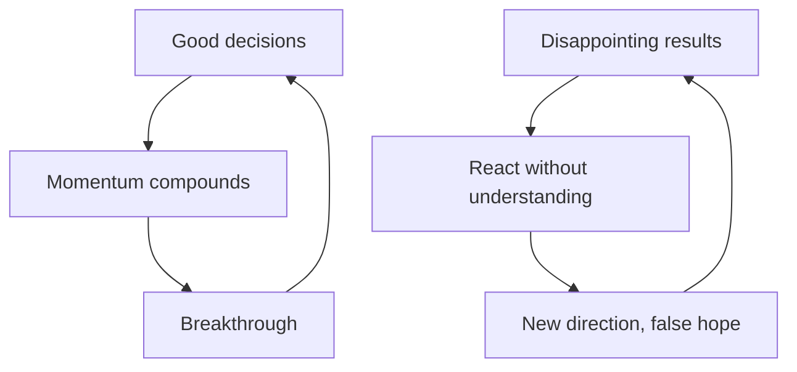

## Why this episode matters

Jim Collins has spent 30 years studying one question with his research teams: what makes a great company tick? The method is brutal: 6,000 years of combined corporate history, historical analysis done the way historians do it, and always a comparison company in matched circumstances. This is the longest episode in the track (over two hours) and the most concept-dense: Level 5 leadership, the flywheel, the 20-mile march, bullets then cannonballs, return on luck, and the five stages of decline. It sits sixth because it converts every earlier tool into organizational physics: models (ep01), first principles (ep02), systems (ep03), inner steadiness (ep04), and reading people (ep05) all show up inside these companies.

## Steve Jobs: a growth story, not a success story

### The wilderness meeting

At 30, Collins began teaching entrepreneurship at the Stanford Graduate School of Business. His mentor Bill Lazier [transcript renders as "Bill Azir"] helped him get the course. On impulse, Collins crossed out the syllabus's first line and replaced it with: "this will be a course on how to turn a new venture or small business into an enduring great company." He knew little about that. The frame launched 30 years of research.

To lend the course weight, he cold-called Steve Jobs. The context matters: it was 1988, about three years after Apple fired Jobs, and he was in the wilderness at NeXT. Jobs came to the class, sat cross-legged on the floor, and led a two-hour seminar on life, companies, and creativity. He said plainly that he got booted from his last company. No bitterness on display. What Collins saw: a man utterly driven by the quest of the work itself, not by what the work would bring, with no idea whether he would ever return to his former stature. At one point the top 500 Silicon Valley leaders met with the president, Jobs was not invited. That is the wilderness.

### Jobs 1.0 to Jobs 2.0

Collins's frame: there was a Steve Jobs 1.0, the young founder everyone knows from the images, and a Steve Jobs 2.0, the seasoned builder who returned to Apple. The wilderness built 1.0 into 2.0. Getting fired created a humility that had not been there, the indomitable will never wavered. By the end, the ambition was not about Steve Jobs. He wanted Apple to be an enduring great company whose ultimate proof would be not needing him, a machine for unleashing billions of people's creativity ("bicycles for the mind").

The general lesson Collins draws: people imagine entrepreneurs and company builders are different species, and that the founder must hand over to the builder type. The research says otherwise. The greatest company builders usually started as entrepreneurs and grew into builders: Herb Kelleher (Southwest), George Rathmann (Amgen), Gordon Moore and Robert Noyce (Intel), Sam Walton (Walmart), J. Willard Marriott Sr., Phil Knight (Nike), Fred Smith (FedEx), Bill Hewlett and Dave Packard (HP), Walt Disney, Wendy Kopp (Teach for America). Most did not have a crushing wilderness. The pattern is growth by choice, not species destiny.

Two portraits he lingers on. George Rathmann: corporate career at 3M and Abbott, recruited in his fifties into the birth of biotechnology, defended Amgen's patents "like General Grant," and ended his life as a patient receiving EPO, the very product he helped build. Katharine Graham of the Washington Post: never expected to run it, after her husband Phil Graham's suicide, with men asking which man she would bring in, she answered in effect "thanks, I think I will do this myself," then steered the Post through the Pentagon Papers and brutal labor strikes. Her memoir "Personal History" is his recommended window into a Level 5 leader's interior.

## Level 5 leadership

### Humility plus will

The "Good to Great" research asked how good companies became great and stayed great at least 15 years. At each inflection sat a Level 5 leader, the matched comparisons had Level 4 leaders. The essence of Level 5: personal humility combined with indomitable will, and ambition channeled into a cause bigger than the self.

The diagnostic question: what is the truth of your ambition? Strip away everything and look at decisions. Is it really about the work, the contribution, the exquisite thing being built? Or is it, in the end, about you: what you get, how you look, what people think of you? Level 5 leaders may be more ambitious than anyone, but the ambition points outward. They humble themselves to the ambition and serve it, with an iron will on the fundamentals. Many were uncharismatic, self-effacing, shy: "charisma bypass."

Collins believes Jobs migrated to full Level 5 before he died: the humility the wilderness taught, the will that never broke, the ambition finally aimed at an Apple that would outlast him.

### Who luck

He introduces "who luck": the luck of encountering people who change your trajectory. Bill Lazier betting on a 30-year-old. Jerry Porras, his research mentor, partnering as a pure colleague and putting names in alphabetical order on "Built to Last" despite a 25-year age gap. The lesson is not just gratitude. It is method: surround the work with people who make the work better, and credit them in the open.

## Disciplined thought

### Separate the decision from the outcome

Collins turns the tables and asks Shane what he learned about decision-making across hundreds of interviews. Shane's answer: there is no skill called decision-making, it is all contextual. What exists is intelligent preparation, and attention to process: cognitive-bias checklists explain mistakes in hindsight but rarely prevent them, because a smart person can always story-tell around each bias. Decision journals humble people: they read back why they were right and find the reasons were wrong.

Collins adds the statistician's rule: never confuse decision process with outcome. If he could require one high-school course, it would be probability and statistics, because we live in a probabilistic world our brains are not wired for. He learned to draw real decision trees during a loved one's cancer situation: choice nodes and probability nodes. Roll it back and you may have made the right call at every choice node while the probability nodes went against you. An adverse outcome does not mean a wrong decision. And the mirror danger: a bad process with a good outcome reinforces the bad process, which compounds in the wrong direction until it goes to zero.

### Confront the brutal facts

From "Good to Great": you do not start with vision. You start with the brutal facts. The Stoic discipline of getting the best possible accounting of reality first is what lets you see clearly. Starting from what you wish were true corrupts everything after.

The method behind the finding matters. Collins works like a historian: to understand Intel's decisions in the early 1970s, reconstruct what the world looked like to Grove and Moore then, not what it looks like now. Then add Porras's comparison: the same historical slices for a matched company (AMD), all the way through. Brutal work, years in a cave, but the only way to earn confidence.

The payoff case: Kroger versus A&P. Late 1960s, early 1970s, two grocery chains, same environment, same facts in front of them. The industry shifts to larger stores and scanning technology. By all rights A&P should be Kroger today. At A&P, leaders explain away the ugly facts and defend the model. At Kroger, leaders go into the teeth of the ugly facts: our stores are the wrong size, and that scares us, so let us wrestle with what it means. Same facts. One side revels in them, the other discounts them. Collins admits he has no psychology for why some can do this and others cannot. The pattern is empirical.

Figure 1. Brutal facts: Kroger vs A&P. AI Podcast Curriculum, ep06 (Jim Collins, 2019-10-05). Source: original toy, from episode claims.
| | Kroger | A&P |
|---|---|---|
| Same facts | Larger stores, scanning tech coming | Same |
| Response | Reveled in the ugly facts | Explained them away |
| Result | Became the industry leader | Faded |

### First who, then what

One decision rule from the research: change every "what" decision into a "who" decision. Not "what should we do about this cyber threat" but "who should we involve in it." Disciplined people first: the Level 5 leader, plus getting the right people on the bus before deciding where to drive it.

The hedgehog concept, from disciplined thought: the intersection of what you are passionate about, what you can be the best in the world at, and what drives your economic engine. Collins applies it personally when Shane asks why he never started a hedge fund on his insights. His hedgehog: learn what makes great companies tick, a fund is not his passion and not his encoding (though his math, computer science, and statistics background means he could have gone the financial path). Know your hedgehog, decline everything else.

## The flywheel

### Compounding, not breakthrough

The framework's outputs for a great company: superior results, distinctive impact (if you disappeared, would it leave an unfillable hole?), and lasting endurance. The inputs run in four stages: disciplined people, disciplined thought, disciplined action, and building to last, with return on luck as the multiplier.

The flywheel lives in disciplined action. The key insight: great results look instantaneous from the outside and are cumulative on the inside. His example: John Wooden's UCLA teams and their run of 10 championships in 12 years. It looked like a 1960s breakthrough. It was actually a decade-plus of pushing: the pyramid of success, recruiting, the fast break refined year after year, game after game. One slow turn, then four, then eight, then the flywheel spins and the breakthrough "comes out of nowhere."

The principle: durable results come from a long series of good decisions accumulating into massive compounding, like buying quality assets and letting them compound. Nobody skips the flywheel.

### The Doom loop

The inverse, from the comparison companies: the Doom loop. Disappointing results arrive (a random event, a mistake, whatever). Instead of understanding why, the company reacts: new direction, new program, new leader, new acquisition, new technology. The new thing produces a burst of false hope, like a sugar drink instead of training. No momentum accumulates. More disappointment, more reaction, another new fad. Down it goes, grasping for salvation.

The difference between the two loops is grasp of the momentum. The flywheel company that truly understands its momentum machine can look at a bad result clinically: the flywheel still works, improve execution. The Doom-loop company never understood the machine, so every setback triggers a lurch.

Figure 2. Flywheel vs Doom loop. AI Podcast Curriculum, ep06 (Jim Collins, 2019-10-05). Source: original toy, from episode claims.

### Amazon's flywheel

After "Good to Great" came out, Collins was invited to Amazon in the fall of 2001, dark days post-dot-com bust. He taught the framework to the executive team and board: no consulting, just teaching. To their credit, they took the flywheel principle and did something that changed how he thinks about it: they crystallized their specific flywheel.

Amazon's loop, as he sketches it: lower prices on more offerings → more customer visits → more third-party sellers → expanded store and extended distribution → revenue growth on fixed costs → back to lower prices on more offerings.

The crucial refinement: a flywheel is not aspirations drawn in a circle. It is an understanding of the inexorable underlying logic that drives the momentum machine. For each link you must be able to say why it almost inevitably drives the next. Lower prices on more offerings almost inevitably bring more visits, more visits almost inevitably attract sellers, and so on.

And the warning: the flywheel is also fragile at every link. Score your execution 1 to 10 on each component. Scores of 9, 8, 9, 10, 3, 9, 10 do not average out. Because of the linkages, one 3 multiplies the whole machine by zero. The entire flywheel slows or stops.

His investor's aside (not investing advice): you do not need to find the flywheel at 10 turns. Find it at a million turns, understand it, confirm the builders understand it, and ride it toward 10 billion. People underestimate how far a great flywheel can go.

### The personal flywheel

Collins runs one himself: curiosity about big questions → rigorous research (he cannot go straight to wisdom, he needs method) → genuine insight → writing and teaching → impact on the world → resources → back into the next big question. After "Built to Last" succeeded, he took all the money and threw it at the next question. He remembers writing the research checks, money flowing out with one successful project behind him, and his wife Joanne (married 39 years) saying, "I sure hope you find something."

The Joanne story, which Shane requests: they met through his climbing partner Roger Briggs [transcript renders "felony Roger breaks"], her high-school coach and teacher. Years later, in his senior year at Stanford, she invited him for a run. He arrived in a rugby shirt and climbing shorts, not running gear. She took him on 8 miles, the first three uphill, they walked five. Sunday was the run, Thursday they were engaged. May 1980. Both had hard childhoods, both felt the other could go all in and never blink. An anchor point in a world where little can be counted on.

## The 20-mile march

### The 292-to-1 quiz

Collins poses an investing quiz from "Great by Choice" (chapter 3). Two real companies, same industry, same base, two decades. Company A: 25 percent average annual net-income growth, standard deviation ±15 points, almost never above 30 percent, never once below 20 percent. Company B: 45 percent average, standard deviation ±115 points, above 30 percent two-thirds of the years, but ranging from +300 to −200.

Everyone picks B. The outcome was not close: 292 to 1 in favor of Company A.

Company A was the 20-mile marcher: 20 percent net-income growth, consecutive, every single year. The image: walking across the United States doing 20 miles every day, good weather or bad, versus doing huge days when conditions are fine and hiding in the tent when they are not.

The march takes many forms: Stryker under John Brown marching on consistent growth, Southwest Airlines marching on profitability every year, Intel marching on Moore's law, doubling components at affordable cost every 18 to 24 months like clockwork, no matter what, even while earnings swung wildly.

### Why it works: the word is "consecutive"

Collins admits he did not fully understand the mechanism when the book published. The key is the word "consecutive." Suppose Southwest commits to profitability for 40 consecutive years without a miss. That commitment changes today's decisions: you cannot maximize this year in ways that guarantee a miss in year 7 or 12. The streak forces you to invest ahead of disruptions constantly. The irony: the short-term demand (never miss) produces long-term behavior (always preparing). And the payoff steepens with turbulence: the more turbulent the environment, the greater the value of the march.

Figure 3. The 20-mile march arithmetic. AI Podcast Curriculum, ep06 (Jim Collins, 2019-10-05). Source: episode claims, "Great by Choice" ch. 3.
| | Company A (marcher) | Company B (erratic) |
|---|---|---|
| Average growth | 25% | 45% |
| Variability | ±15 points | ±115 points |
| Range | 20% to 30% | −200% to +300% |
| 20-year outcome | Wins 292 to 1 | Loses |

Shane's worry: does not relentless focus on the march blind you to disruption? Collins's answer: the consecutive commitment is precisely what keeps you ahead of disruption, because missing is not allowed and the future always arrives.

## Bullets, then cannonballs

### Calibrate before you commit

The metaphor: an enemy ship bears down. Fire all your gunpowder as one giant cannonball and miss, and you are done. Instead: fire a bullet, miss by 30 degrees, recalibrate, fire again, 10 degrees off, recalibrate, ping the hull. Then load the cannonball and fire down a calibrated line of sight.

The research finding (Morten Hansen's insight, credited generously): winners scale the right innovations, losers fire uncalibrated cannonballs. The comparison companies did three things wrong: fired too few bullets, failed to convert a validated bullet into a cannonball when the moment came, or fired big uncalibrated cannonballs. The last was the most consistent killer.

The iPod as the canonical case. From 1997 to 2003, Jobs's Apple did the disciplined thing: stop the bleeding, get the Macintosh right, keep the flywheel turning, fire bullets. One bullet: a little MP3 player, late to the game. In the 2002 or 2003 10-K, Apple gave the iPod about three sentences: a natural extension of the digital hub strategy. Nobody knew it was the future. Then the bullet showed promise, its own mini-flywheel, excitement inside Apple. The calibration step: put iTunes on Windows. Boom: non-Mac users flooded in, and the bullet was empirically validated. Then the cannonball. Note the discipline: fire the bullet excellently, or a miss teaches nothing. A sloppy test that fails tells you nothing about whether the idea was wrong.

The pattern across history: the second cannonball, fired from the bullet-cannonball process on top of an existing flywheel, usually becomes the biggest part of the company for decades. Marriott: restaurants → hotels. Intel: memory chips → microprocessors. Disney: films → theme parks. Apple: computers → handhelds.

On effort allocation, Shane asks whether to spend more energy on bullets or cannonballs. Collins's answer is situational, but the iPod case shows the shape: many well-fired bullets, ruthless conversion only on calibration, and the cannonball as flywheel extension, not a leap into the dark.

## Return on luck

### The three-test definition

"Great by Choice," with Morten Hansen, studied companies that went from startup to 10x their industries in the most turbulent sectors: semiconductors, biotech, airlines, medical devices. Turbulence made it the perfect lab for luck. The intellectual hole Collins refused to leave: maybe the whole framework is just "plus L," a giant luck variable worth 100 points.

Two years of work produced the method. First, Morten's insight: luck is an event, and events can be analyzed. Then the definition. A luck event meets three tests: (1) you did not cause it, (2) it has potentially significant consequences, good or bad, (3) it came as a surprise in timing, form, or occurrence. Clinical. Tag every event in the company histories that passes all three, sort into good-luck and bad-luck buckets, and compare.

The result: the 10x winners were not luckier. If anything the comparisons were luckier, but not strongly enough to claim. Call it a wash. You cannot argue from the data that winners had more luck on their side.

### The IBM PC story

What differs is return on luck. The classic case: IBM wants an operating system for its PC. Two small companies get the identical massive luck event. Digital Research in Pacific Grove actually has a PC operating system, IBM's instinct favors them. Microsoft in Seattle makes computer languages and has no OS. Gates recognizes the event's value, pursues it relentlessly, gets Q-DOS [transcript: "cue das thing"], and then does the thing that matters: builds the Windows flywheel on top of it, turn after turn, for 20 years. Early Windows versions were laughed at. They stayed with it.

The formula: a luck event is not a win. It is raw material. Return on luck means translating the event into a flywheel instead of treating it as a victory.

### Luck is asymmetric

The episode's opening line, and its deepest: luck is asymmetric as a cause. Good luck cannot make you great, no research supports luck as the cause of a great company. But bad luck can kill you. So luck management is mostly downside protection: never let the asymmetric negative knock you out of the game. He cites Howard Marks (the next episode's guest after this one in the track, ep10) making the same point in his Knowledge Project interview: stay alive through everyone's suffering so you can capitalize.

That reframes the whole framework. Productive paranoia, the 20-mile march, bullets before cannonballs: all are downside-protection machines that keep you alive for the luck events you cannot schedule.

## How the mighty fall

### Five stages

"How the Mighty Fall" came from an uncomfortable fact: some "Good to Great" companies, like Circuit City, later stumbled. Collins's response: the research was never "these companies are great forever." It studies episodes from which principles can be derived, violate the principles and you fall. The fall of the once-great became a new study, with the same comparative method.

Ascent is easier to understand than decline, he notes. Think of a pool table: few ways to rack the balls perfectly (the narrow path up), nearly infinite ways for them to scatter (entropy). The five stages:

1. Hubris born of success. Success converts to arrogance.
2. Undisciplined pursuit of more. The surprise: great companies rarely fall from complacency. They fall from overreaching: too much growth, acquisitions outside their game, big uncalibrated cannonballs, a new CEO needing to show mettle with something bold.
3. Denial of risk and peril. The facts mount, the leadership denies them.
4. Grasping for salvation. The fall becomes visible. The response is the Doom loop: lurching, panicky moves, more uncalibrated cannonballs, brief upturns then down again, like a gambler chasing losses.
5. Capitulation to irrelevance or death. The balance sheet runs out, the crossover point.

The terrifying part: through stages 1 to 3, you look healthy from the outside. Like cancer, undetectable until stage 4. If decline were obvious early, everyone would catch it.

### The counter-argument he accepts

Asked for the best counter-argument to "Good to Great": the study selected on stock returns, which was clinically right but narrow. Zoom out and the "Built to Last" companies showed greater endurance. Why? The earlier study put a premium on purpose beyond money: HP existing to make a contribution, Merck's "medicine is for the patient," Johnson & Johnson's 1920s credo, Disney never being just about profit, Apple never just about money. The good-to-great winners had the mechanics, the built-to-last winners had the mechanics plus a deep sense of responsibility to the world. He does not believe anything is permanent, but a five-decade run of excellence is real, and purpose is part of how you get it.

### Timeframe as the root cause

Why do smart companies get disrupted? Was Ken Olsen of DEC stupid? No. Ask about the decision timeframe instead. Manage for the quarter-century and you make different decisions than managing for the next two years. If runs of excellence grow shorter, short decision timeframes are a prime suspect. The long-term thinker has an arbitrage: do things that are first-order negative and second-order positive while competitors, under pressure, do the reverse.

## Leadership: learned, not taught

### West Point

In 2012-2013, Collins held the Class of 1951 Chair for the Study of Leadership at West Point. His empirical conclusion: with conscious attention, you can build leaders systematically, at young ages. His cadets were happier than his Stanford MBAs, he says, because of an ethos of service, communal success ("you never succeed alone"), and a designed relationship with failure: at West Point you will fail, and you learn to grow through it by helping each other. By 22 to 24, cadets carry real responsibility.

The distribution point: any group has a range of leadership capability, but West Point's distribution is phase-shifted far right of a random sample of 22-year-olds. That is what a leader-building institution does.

The school-principal studies showed the same pattern in civilian life: teachers growing into principals, building flywheels for student results. His example: Deb Gustafson [transcript spelling uncertain], an elementary school on a Kansas military base, taking reading rates from 33 percent to nearly 100 percent and holding them.

### The distinction

"I do not know if someone else can make someone a leader. I do not know if you can teach leadership. But I am pretty sure you can learn it." Teaching claims too much, learning puts the work where it belongs. Two seedbeds he names:

1. do not be a bystander. See what has to be done, and exercise the art of getting people to want to join you. Eisenhower's definition: "leadership is the art of getting people to want to do what must be done." His example: a superintendent who found low graduation rates, refused to be a bystander, took responsibility even for kids who left before his tenure, and walked into a local building to ask for space so dropouts can return. Different leaders are different artists, learn from others without copying them.

2. Stop taking care of your career, take care of your people. From a four-star general (General Austin [transcript uncertain]) who mid-career stopped managing his promotions and started caring for his people. "The moment I did that, everything changed, because they would not let me fail." Collins's advice to young people asking for career help: stop asking that question. Ask what you have done for someone else.

On context: leadership is partly contextual (Eisenhower: brilliant as Supreme Commander and President, struggled as a university president, Bill Gates: Microsoft to the foundation, two wildly different contexts, both successful). You can learn to cross contexts, but perhaps not infinitely. Know where you fit.

## Questions and answers

**Q1: Explain this episode to me like I am new. What is Collins's message?**
Greatness is not a breakthrough. It is the accumulation of disciplined decisions over decades: the right people, the brutal facts, a hedgehog you understand, a flywheel you keep pushing, a march you never break, bullets before cannonballs. Luck will arrive in equal measure for you and your rivals, what differs is your return on it. And decline is a choice made in five stages, starting with the arrogance that success whispers.

**Q2: What is Level 5 leadership in one paragraph?**
Ambition pointed outward plus humility plus unbreakable will. The Level 5 leader's burning question is "what is the truth of my ambition," and the answer is the cause, not the self. They serve the ambition, it does not serve them. In practice: hire people better than you, confront facts that hurt, credit others, and keep pushing when the world thinks you are crazy.

**Q3: Applied: how do I find my flywheel?**
Do what Amazon did. Do not draw aspirations in a circle. Write the components of your momentum and, for each link, state why it almost inevitably drives the next. Then score your execution 1-10 on each link. Any link at 3 multiplies the whole machine by zero, fix the lowest score first. Revisit quarterly: the flywheel is a machine you maintain, not a diagram you frame.

**Q4: Work the 292-to-1 numbers myself.**
Company A: 25% ± 15 → every year lands between 20% and 30%. Company B: 45% ± 115 → years range from −200% to +300%, above 30% two-thirds of the time. Over 20 years, compounding punishes the down years savagely: a −50% year needs +100% just to recover. The steady 20-30% never digs a hole. Result: 292 to 1. The lesson is arithmetic, not philosophy: volatility is a tax, and consistency compounds.

**Q5: I have a big bet I want to make. Bullet or cannonball?**
Ask three questions. Have you fired a bullet (a small, excellent test)? Did it calibrate (empirical validation, not theory)? Is the big bet an extension of a turning flywheel? Three yeses: fire the cannonball. Any no: you hold an uncalibrated cannonball, the move most correlated with decline. Fire the bullet first, and fire it well enough that a miss teaches something.

**Q6: How do I improve my return on luck?**
You cannot schedule luck events, so work the two things the research found. First, survive the bad luck: productive paranoia, cash buffers, the march, no uncalibrated bets. Bad luck can kill you, never give it the chance. Second, convert the good luck: when the event lands, recognize it fast (Gates recognizing the IBM opening), then translate it into a flywheel and push for years. Luck is raw material. The flywheel is the refinery.

**Q7: What stage of decline am I in?**
Run the checklist honestly. Stage 1: do successes get described as brilliance rather than luck and discipline? Stage 2: are you pursuing more (growth, acquisitions, bets) outside your hedgehog? Stage 3: what facts are you explaining away? Remember stages 1-3 look healthy from outside. If you cannot name a fact you are afraid of, you are probably in stage 3.

**Q8: Can leadership be taught?**
Collins's distinction: probably not taught, but certainly learned. The West Point evidence says institutions can phase-shift the whole distribution with conscious design: service ethos, communal success, designed failure, early responsibility. For yourself: pick the two seedbeds. Refuse to be a bystander about one thing that must be done, and get people to want to join you. Stop managing your career and start caring for your people. They will not let you fail.

## Memory aids

Mnemonic: **F-M-B-L-D**: Flywheel, March, Bullets, Luck, Decline. The five ideas in episode order.

Never-confuse pairs:
- Flywheel versus Doom loop: compounding from understanding versus lurching from reaction. Same setback, opposite response.
- Entrepreneur versus company builder: not different species. The great builders grew from entrepreneurs by choice.
- Taught versus learned (leadership): no one can install it in you, you can build it in yourself with the right institution and reps.
- Good luck versus return on luck: the event versus what you build on it. Everyone gets events, few build refineries.

Trap cards:
- Trap: "We need a breakthrough." Reality: breakthroughs are flywheel turns finally visible. Push the wheel.
- Trap: "Pick the higher growth rate." Reality: 292 to 1 says pick the march. Volatility taxes compounding.
- Trap: "Big bets show boldness." Reality: uncalibrated cannonballs are the signature move of stage 2 decline. Calibrate first.
- Trap: "We are successful, so we are safe." Reality: stages 1-3 look healthy. Hubris is stage 1, not safety.

## How to imbibe this

1. The ambition audit. Write the truth of your ambition in one paragraph. Mark every sentence that is about you versus about the cause. If "you" dominates, you are at Level 4. Observable change: decisions start referencing the cause.
2. Draw your flywheel. Components, inexorable links, 1-10 execution scores. Fix the lowest score this quarter. Observable change: effort concentrates on the binding constraint.
3. Set a march. Pick one metric to hit consecutively (profitability, learning hours, publishing cadence). Define it so missing is unthinkable, then let it force long-term investments. Observable change: short-term temptations lose.
4. Bullet list. List your open questions. Assign each a small excellent test with a calibration criterion. No test, no bet. Observable change: opinions become experiments.
5. Luck ledger. Log luck events by the three tests (not caused, significant, surprise). For each good one, write the flywheel it could feed. Observable change: luck stops being a story and starts being inventory.
6. Decline check. Quarterly, walk the five stages honestly. Name the stage. Name the fact you fear. Observable change: hubris gets caught in stage 1, not stage 4.

## Think it yourself

The hardest set so far. Collins-grade problems.

**Drill 1: ambition truth.** Write two versions of your five-year plan: one maximizing what you get (status, money, admiration), one maximizing the cause (the thing built, the people served). Compare the decisions each version implies for the next 90 days. Which decisions differ? What does the difference reveal?

**Drill 2: flywheel autopsy.** Pick a company or project that broke through. Reconstruct its flywheel historically: what were the turns before the breakthrough? Identify the decade of invisible pushing. Now pick one that flamed out in a Doom loop: map the lurches. Present both as diagrams.

**Drill 3: march design.** Design a 20-mile march for your own work: one metric, consecutive, unmissable. Stress-test it: what disruption in the next five years would break it? Redesign the march's supporting investments so the streak forces preparation for that disruption. Write the investment list.

**Drill 4: bullet portfolio.** List five uncertainties in your current plans. Design a bullet for each: small, excellent, with a clear calibration signal. Rank by cost of the test. Fire the cheapest this week. Define in advance what "converts to cannonball" looks like.

**Drill 5: luck event analysis.** Take your last three years. Tag events passing the three tests. Sort good and bad. For the good ones, grade your return: did you translate any into a flywheel? For the bad ones, did any threaten survival, and what protected you? Write the protection as a system, not a story.

**Drill 6: decline diagnosis.** Pick an organization you know well (employer, team, project). Walk the five stages with evidence. Write the stage, the evidence, and the one intervention that would reverse it. Be specific enough that someone could act on it Monday.

## Skills you can now use

- Diagnose leadership by the ambition test: Level 5 versus Level 4.
- Map any momentum machine as a flywheel with inexorable links and execution scores.
- Distinguish flywheel compounding from Doom-loop lurching in real time.
- Design a 20-mile march and use consecutiveness to force long-term investment.
- Run bullets-then-cannonballs: small excellent tests, calibration, then commitment.
- Tag luck events with the three tests and convert good luck into flywheels.
- Walk the five stages of decline as a diagnostic on any organization.

## Go deeper

- The episode itself: https://www.youtube.com/watch?v=7xIrgD6NxHI
- "Good to Great": https://en.wikipedia.org/wiki/Good_to_Great (HTTP 200, verified 2026-10-06)
- Farnam Street's podcast archive: https://fs.blog/podcast/ (HTTP 200, verified 2026-10-06)

## Figure audit

| Unit id | Claim | Before | After | Figure id | Medium | Source | Four tests |
|---|---|---|---|---|---|---|---|
| u01 | Brutal facts response | Same facts, vague outcomes | Kroger reveled, A&P discounted | fig1 | table | episode claims | T1: 3-row comparison table / T2: comparison of values forces a table / T3: none, static plate / T4: none reused |
| u02 | Flywheel vs Doom loop | Breakthrough thinking | Compounding vs lurching loops | fig2 | mermaid | episode claims | T1: two 3-node loops / T2: step loops force mermaid / T3: none, static plate / T4: the flywheel loop, reused in Q&A |
| u03 | 20-mile march arithmetic | Pick higher growth | 292:1 for the marcher | fig3 | table | episode claims | T1: 4-row count table / T2: counting forces a table / T3: none, static plate / T4: the 292-to-1 outcome, reused in the drills |
