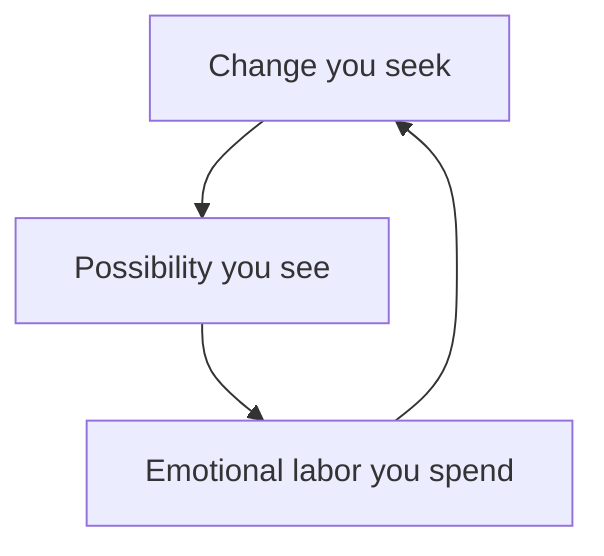

## Why this episode matters

Seth Godin wrote 19 books, published 7,500 daily blog posts in a row, and spent decades studying how creative work actually happens. This episode, built around his book "The Practice," answers the question the whole track circles: how do you do the work, every day, without guarantees? His answer is a system: decide once, practice forever, serve the smallest viable audience, and spend emotional labor on purpose. It sits eighth because it turns the thinker's toolkit into a maker's discipline.

## The three pillars

Shane asks for the pillars behind Godin's worldview. He says he has never said them out loud before.

### Pillar 1: the change you seek to make

Are you here to make a contribution or to take something? To do what you are told or to question and make things different? Answering honestly is hard because it runs through the story you tell yourself. Change the story and you can change the contribution.

He flips Dolly Parton's line. She said: "Find out who you are and do it on purpose." He reverses it: "Do it on purpose and you will find out who you are." Do not wait for a guarantee about identity before starting. Try the thing with intent, the fit reveals itself through the doing.

Two mornings: one person wakes asking "how do I double my net worth," another asking "how do I help the people in Bareilly, India get through another night without electricity?" Both are changes. Name yours.

### Pillar 2: what possibility do you see?

We are indoctrinated from birth about whether we are entitled, special, or hold an advantage. The pillar pairs possibility with reality: learn to see the world as it is. Millions read Ben Graham, almost none became Warren Buffett. The difference was not the reading. It was discipline, seeing the possibility, and choosing the 50-year journey.

Seeing reality matters because self-delusion is expensive. You can deny the laws of thermodynamics or how viruses work for a while, then reality bills you. His method: expose yourself to the data and the experiences, test whether an idea holds up under examination, and update. He cites Derek Sivers and Annie Duke as models of this discipline.

The empathy corollary: everyone tells themselves a different story. They do not believe what you believe or want what you want. Without the empathy to accept that, you cannot serve or work with them.

### Pillar 3: emotional labor

How much emotional labor are you able and willing to expend? The term comes from Arlie Hochschild (1963): emotional labor means show up when you do not feel like it, smile when you would rather grimace, being kind to the unkind customer. A hobby has no labor because you do it when you want. Paid work always involves some.

His marathon analogy: if you run a marathon you will get tired. Do not hire a coach to teach you to run one without getting tired. If you do emotional labor you will get afraid, fatigued, and tempted to quit. That is part of it, not a bug. The question is which emotional labor you sign up for, when, and what you get in return.

The pairing: emotional labor plus learning. Education is compliance, compulsion, coercion. Learning is serial incompetence on the way to mastery. Many things he could learn (a library book, 20 podcasts, practice) he has not learned at 60, and the honest reason is not talent. He does not care enough to spend the energy. Caring is the scarce input.

Figure 1. The three pillars. AI Podcast Curriculum, ep08 (Seth Godin, 2024-03-26). Shell 1. Show the toy. Source: original toy, from episode claims.

## Process and the practice

### Poverty of intentions

The sculptor Elizabeth King: "Process saves us from the poverty of our intentions." Wake in a bad mood, hit a speed bump, take a stray negative comment, and it is easy to spiral into deciding the work is not important. In those moments you are not your best self, but you are still yourself. A practice carries you through because the decision was already made: the blog post goes out tomorrow, the podcast ships on schedule. Make the decision once, have a practice forever.

"The Practice" decodes what separates creative people who ship from those who do not. Not hacks, not aphorisms, not best practices collected like charms. The pattern he found: someone who decided they want to change things, as opposed to the brainwashed mindset of "I will do what I am told." Years earlier, in "Linchpin," he made the parallel point: the only thing leaders have in common is that they are leaders, there is no checklist.

### Against hacks

The word "hack" now means several things: illegal cracking, the elegant engineering shortcut, and the original meaning: figuring out exactly what the audience wants and giving it to them. The etymology: Hackney, on London's outskirts, raised ordinary cheap horses for cab drivers, who became known as hacks. The Doobie Brothers on their 50th anniversary tour are hacks in this sense: the audience does not want new songs, they want the band as a cover band of itself. Anyone who sounded like the old records would do.

Why we crave shortcuts: industrial brainwashing. Frederick Taylor brought the stopwatch to the factory and weaponized capitalism around efficiency: save 30 seconds per part, make a million dollars a year. The incentive to cut corners is structural.

His counterexample: a mochi shop in Kyoto, a thousand years old. It bought a rice-kneading machine 20 years ago: the first major technological advance in a millennium. The shop's job is not to be the biggest or most profitable mochi store. It is to do the work the way they want to do it. A thousand-year business is not built on hacks.

## The smallest viable audience

### The Momofuku lesson

The story, with a celebrity angle. Years ago, before anyone knew it, Godin's family lunched at David Chang's Momofuku, 50 seats, possibly Chang himself behind the grill. Godin is vegetarian. Five or six Saturdays in a row, they happily made his brussels sprouts without bacon, which saved them the bacon's cost. The sixth week, Chang said: there is a restaurant a block away that really likes vegetarians, we have almost no vegetarian items, it would be better if you went somewhere else for lunch.

That was the day Momofuku became Momofuku. Plenty of people could be catered to. The question is whether catering to them helps you make the change you seek to make.

### For someone, not everyone

Nobody has everyone as their customer. Maybe the water company. The goal is the smallest viable audience, not the biggest possible audience. His test questions: can they live without it? Would they miss it if it were gone? Make that.

Harry Potter, the most successful book franchise in history, worth over a billion to its author, is for almost no one: precocious 12-year-olds and adults who remember being one. That is a tiny group. "It's for everybody" is fuel for evangelism, not a strategy, and it is also a hiding place: make it for everyone and you can never fail, because "everyone has not found it yet." Make it for someone specific and you are on the hook: if they hate it, you were wrong.

The internet's physics enforces this. The internet is not a mass medium, television was the last new mass medium. The internet is a micro medium: the best ever built for reaching specific people, terrible at reaching everyone. There is no homepage. You cannot reach a hundred million people in a day online, TV did it nightly. The luxury this buys: name your audience and exclude the rest. The common mistake: obsessing over feedback from people it was never for, instead of obsessing over the people it is for.

Figure 2. Smallest viable audience. AI Podcast Curriculum, ep08 (Seth Godin, 2024-03-26). Shell 2. Count or score the toy. Source: original toy, from episode claims.
| | Biggest possible audience | Smallest viable audience |
|---|---|---|
| Target | Everyone | Someone specific |
| Failure mode | Hidden ("not found yet") | Visible (they hate it) |
| Feedback | Noise from non-customers | Signal from the served |
| Example | "It's for everybody" | Harry Potter: precocious 12-year-olds |

## Sunk costs are gifts

### The gift from your former self

Business school's first lesson: ignore sunk costs. His reframing: a sunk cost is a gift from your former self. The law degree, the movie tickets, the vacation deposit, the big wedding: hard to earn, hard to release. The question is whether you must accept the gift.

The mason's signs: construction across from his house, the worker's signs read "quality masonry" with masonry misspelled. Told about it, the man said he knew, it cost him business, but he had already paid for 50 signs. Godin's point: if he found 50 misspelled signs by the road, he would not pick them up, they are not worth having for free. The old him paid for them. The current him pays every time he uses them. Same with his own too-small shoes: the younger him paid, keeping them punishes the current him.

Relationships need care here. A new relationship is fresh powder: exciting, but temporary. The real comparison: will your old relationship a year from now be better than your current old relationship? If yes, sunk-cost logic applies and you should invest. If no, you shop for novelty, not ignoring sunk costs.

The rationalization machine is spectacular: we dramatize the cost of telling others. "It will break my parents' heart if I quit law after they paid for school, so I will be unhappy for ten more years to spare them an hour." We stay hooked on the effort it took to align our neurons around who we thought we were.

The constructive hack, in the good sense: establish new sunk costs that keep you going. He wrote 7,500 blog posts in a row. On a Thursday with nothing to say, the streak's emotional cost gets him over the hump. The streak is also a gift from his former self, and if it ever stops giving joy long-term, he should stop. Until then, it is fuel.

Figure 3. Sunk costs as gifts. AI Podcast Curriculum, ep08 (Seth Godin, 2024-03-26). Shell 3. Apply the one rule. Source: original toy, from episode claims.
| | Before: sunk cost | After: gift |
|---|---|---|
| Test | "I paid, I continue" | "Would I pick it up free?" |
| 50 misspelled signs | Keep using (paid for 50) | Decline (not worth having free) |
| Too-small shoes | Keep wearing (younger me paid) | Decline (punishes the current me) |
| Blog streak | Endure the cost | Install deliberately, quit if joy stops |

## Decisions, spec, and the professional

### Walling off

At 12 he noticed his mild ADD was either curse or asset: novelty-seeking got him in trouble and made life interesting. The adaptation: willpower walls around areas of choice. No meat since about 1979/1981: decided, done, no cravings. No television. The specific wall does not matter, the narrowing matters. Limit the incoming and you cannot coast: with nothing left but the work, doing nothing becomes unbearable, and that hunger fuels the novelty-seeker.

Within the frame, his decision math: build in resilience, and see the dip ahead. If he is not willing to commit through the dip, the thing is not worth starting. Trivial decisions with no dominant choice (which car) can wreck him for weeks. Big ones get the format-first treatment: with the podcast, he set the media boundaries before the content, solved the format problem in his head for fun, and felt no need to actually make it. Then someone offered to pay him, saying yes was reactive and sloppy, but it bought a laboratory. Eight seasons later, the question is whether the podcast has a dip or is simply practice. His answer: as long as carrying the water satisfies him, it continues, the day it does not, it becomes a sunk cost and he walks away.

### Spec and quality

From Edwards Deming: quality is not luxury, not expensiveness, not love. Quality is one thing: it meets spec. Under an electron microscope, every part of a Lexus, among the highest-quality cars made, is full of defects. They are not defects that matter, they are within spec. So the work is to define the spec. Once the work meets spec, it is good enough, and good enough is a definition, not a slur. Ship it. Unhappy? Change the spec.

Lexus's original spec: a standard deviation better than Mercedes. That was the hard work. Perfection was never the target, it is not achievable.

The hiding place: we conflate good enough with perfect because a century of industrialism and schooling taught us that A beats B and tests have right answers. His college symbolic-logic exam was open-book, open-note, unlimited time. After 3.5 hours he decided he had met his spec and left, among the first out. Someone stayed 18 hours. The question: what did the extra 15 hours buy? He knows what he did with his.

His "Kind of Blue" test for any project: Miles Davis recorded one of the best-selling jazz albums ever in four days. Ask: if they spent four more days, what would result? Usually the answer is nothing worth the days.

If the work demands a massive shift, put it in the spec. The spec is where ambition belongs.

### The professional's promise

"Doing what you love is for amateurs. Loving what you do is for professionals." The surgeon: you want her to show up and operate beautifully in a bad mood, and to keep studying the state of the art, because she promised she would take care of you. A professional makes a promise and keeps it whether or not she feels like it. Amateurs get to be authentic and show up when they want. Keep your hobbies, do not sell them. But professional work carries obligations: know the state of the art, raise the bar, know who it is for and what change you seek.

His uniforms (a lab coat early on, lately a Japanese volunteer fireman's happi coat): putting one on sends a message. Do the work at the workspace, at the appointed hours. Never miss a deadline, never go over budget. Professionals do not miss deadlines, throw tantrums, or blow budgets. Every so often a hobbyist-breakthrough gets applauded for missing deadlines, then they fade, because industries want to work with professionals.

The "Permission Marketing" story: the phrase came in the shower, but not accidentally. He went in near a self-imposed deadline and stayed until he had the name, even as the 40-gallon hot water tank ran cold. He was in there to do work. As privileged work starts resembling hobbies, treating it as work is what keeps it good.

## Shame, criticism, and trust

### Take shame off the table

Shame was sharpened into a tool of cultural coercion, from Salem onward: press almost anyone's soft spot and they shrink and run away. It does not scale, is not humane, is not kind, and is unpredictable. "How dare you?" should be said more often to people who shame.

The internal version is worse. His "world's worst boss" rant: a boss who woke you at night, scolded you, criticized everything, and said you would never amount to anything would lose you fast. Yet most of us work for exactly that voice in our heads. If it shames you, rewrite the internal narrative, it extinguishes your work.

The method: cognitive behavioral therapy's core move. Catch the cascade early, once shame cascades it is hard to stop. Find the trigger phrases and moments, intercede, replace. The uniform and the professional identity help: the work is not personal. "In the resources I allocated, I did the best work I could to meet the spec. Here it is. If you do not like it, teach me so I can change my spec next time. I will not shame myself, nor let you shame me."

His evidence that feedback need not carry shame: his programs' participants exchange 400 to 600 pieces of feedback a month, more than most get in two years, and call it freeing, because it is information without shame. And his own training: his first book sold on day one, then 800 rejection letters in a row, some days five or ten or fifteen, each a paid-for letter saying "we do not like your idea." The developmental step separated "this idea is not working for us" from "you are a bad person."

### Coaching versus criticism

Coaching is not telling someone the answer. Telling a kid "you are so smart" does not help, helping them see what they are capable of, given what they said matters to them, does. (He recommends Michael Bungay Stanier's book on coaching.)

Criticism has three required parts: domain knowledge, no status-seeking through hurting, and the ability to show you the world as it is. Most criticism he received failed the second test: people who would feel better if he felt worse. The first test matters too: his Diane von Fürstenberg story. Hired to interview her, he read both autobiographies, then realized she had neither written nor read them. She could not explain in words why her successes worked or her failures failed: pure intuition, good taste without taxonomy. Hire such people if you can, do not work for them or take them as clients, because you will not get better. Contrast Michael Korda and John Boswell, the first two book-industry people who could explain in words why things worked: not always right, but they gave him a taxonomy to think with.

### The two voices

"Trust Yourself" was his book's original title, he owns the domain. The strangeness he points at: "I talk to myself" sounds normal, but who is "I" and who is "myself"? Two voices. One is hyperliterate, verbal, critical, optimized for fitting in: the monkey mind. The other is less verbal: curious, inquisitive, wanting to make things better, coloring outside the lines. The first voice usually runs the show. Practices like morning pages exist to calm the first voice so the second can present its agenda to the decision-making brain. Not to obey it blindly, to hear it.

### The remaining lessons

The expensive business lessons, summarized:

- People do not want what you want. Founders think equity motivates everyone, it is usually a demotivator, an uncashed prize-pool promise. Customers, employees, everyone: extend yourself to where they are.
- Money stories differ. "It's just business" is horrible and real. His Diplomacy game at Spinnaker in 1983: he double-crossed his mentor David Sisson in round five, it took a year to repair. He learned that people's money stories are their own.
- The board member who gave zero useful advice while maximizing his income: Godin took it personally instead of seeing it as Larry's consistent game. Assume people act from their story, not yours.
- Mistakes of omission dwarf mistakes of commission. People not helped, things not started, words not said, benefit of the doubt not given: an endless list.
- The first believers were his parents. After a brutal high school, their showing up with more than obligation gave him ten years of fuel.

His success compass, used daily: would they miss you if you were gone? Have you done something with few happy substitutes? Did you leave things better than you found them? Plus the data point: past about $70,000, happiness does not rise with income, while billionaires have bad days over numbers on screens.

On luck and trajectory: the "ovarian lottery" (Buffett's term) gives everyone a different push, but Hollywood trajectory-talk hides friction and luck. How many times must an adult get lucky to be called successful? Are you positioned to need luck again tomorrow? His own first internet company: everyone called him delusional (in print, in a bestseller), the plan failed, resilience plus a pivot plus Jerry Colonna and Fred Wilson's first investment as a team made it work, then near-wipeout. Luck, he says, matters far more than people credit.

## Questions and answers

**Q1: Explain this episode to me like I am new. What is Godin's message?**
Decide what change you seek, check it against reality, and spend emotional labor on it daily. Do not chase everyone, serve the smallest viable audience so well they would miss you. Treat sunk costs as gifts you may decline. Define the spec, meet it, ship. Be a professional: promise, then deliver regardless of mood. And take shame off the table: feedback is information, not a verdict on you.

**Q2: What is the smallest viable audience for my project?**
Write the sentence: "This is for people who ___." If the blank fits everyone, you hide. Shrink it until the people in it would miss the thing if it vanished. Harry Potter's blank: precocious 12-year-olds. Momofuku's blank excluded vegetarians deliberately. Your blank should feel uncomfortably narrow. That discomfort is the hook going in.

**Q3: Applied: I keep polishing and never ship. What do I do?**
Write the spec first: what must this do, for whom, to what standard? Lexus's spec was one standard deviation better than Mercedes. Yours should fit on an index card. When the work meets spec, ship, "good enough" is the definition of quality. If shipping feels wrong, the spec was wrong: change the spec, not the shipping. Ask the Kind of Blue question: what would four more days buy?

**Q4: How do I use sunk costs instead of being used by them?**
Two moves. First, the gift test: would you pick this up if you found it free by the road? The misspelled signs: no. The too-small shoes: no. Then stop paying for it. Second, the constructive hack: install new sunk costs deliberately. A daily streak, a public commitment, a prepaid course: make it emotionally expensive to quit the things worth continuing. Just remember the streak is also a gift, if it stops giving joy, decline it.

**Q5: What does "process saves us from the poverty of our intentions" mean in practice?**
Decide once, then let the calendar decide daily. Pick the practice (daily post, weekly review, morning pages), set the trigger, and remove the daily negotiation. On the bad-mood Thursday, you do not decide whether to write, you decided months ago. The practice is poverty insurance for motivation.

**Q6: How do I tell coaching from criticism?**
Three tests for criticism: domain knowledge (can they explain why things work?), no status-seeking (do they feel better when you feel worse?), and reality-showing (do you see the world more clearly after?). Coaching is different again: it never hands you the answer, it helps you see what you are capable of given what you said matters. Accept the first freely, seek the second, and discount everything else.

**Q7: I am afraid of looking stupid. What then?**
Godin's answer is blunt: that fear is the whole game. Creativity means extend yourself with empathy across space to the person you serve and across time into an uncertain future. That requires the emotional labor of risking embarrassment. "I have no questions" really means "I do not care enough to risk looking foolish." Caring enough is the choice. Make it.

**Q8: How does this episode connect to the track's arc?**
Ep07 built the decision machine, ep08 builds the shipping machine. The idea meritocracy tells you what is true, the practice ships it. Believability-weighting tells you whom to listen to, the smallest viable audience tells you whom to serve. And emotional labor is ep04's inner work with an invoice attached: the feelings are real, the showing up is the job.

## Memory aids

Mnemonic: **P-S-E**: Practice (decide once), Smallest viable audience (serve someone), Emotional labor (spend willingly).

Never-confuse pairs:
- Education versus learning: compliance and coercion versus serial incompetence toward mastery. Schooling usually delivers the first.
- Professional versus amateur: promise kept regardless of mood versus authenticity on demand. Keep the hobbies, do not confuse them with the work.
- Criticism versus shaming: information from domain knowledge versus coercion via the soft spot. One improves the spec, the other extinguishes the worker.
- Sunk cost versus investment: a gift from your former self versus a current choice. The test: would you pick it up free today?

Trap cards:
- Trap: "This is for everyone." Reality: everyone is no one. Narrow until they would miss it.
- Trap: "One more polish, then ship." Reality: write the spec, meet it, ship. Perfection is the hiding place.
- Trap: "I have paid so much, I must continue." Reality: the old you paid. The current you decides. Decline the gift.
- Trap: "Their criticism means I am bad." Reality: separate the idea's failure from your worth. Eight hundred rejections taught him the difference.

## How to imbibe this

1. The audience sentence. Write "this is for people who ___" for your main project. Narrow it twice. Observable change: feedback gets useful because it comes from the right people.
2. The spec card. For your current project, write the spec on an index card. Ship when met. Observable change: shipping speeds up, quality arguments become spec arguments.
3. The streak. Start one daily practice with a visible streak. Let the sunk cost pull you over Thursday humps. Observable change: output becomes continuous.
4. The no script. Write your thoughtful, quick, generous no. Use it three times this week. Observable change: your work gets its hours back.
5. The shame catch. Identify your cascade trigger phrase. Write the replacement. Practice the intercede once this week. Observable change: bad feedback stops costing days.
6. The wall. Wall off one area of choice (a food, a feed, a habit). Notice the freed attention. Observable change: fewer trivial decisions, more deep work.

## Think it yourself

The peak set. Godin-grade problems.

**Drill 1: audience narrowing.** Take something you made for "everyone." Write three progressively narrower audience sentences. For the narrowest, list ten real people. Ask three of them: would you miss it if it were gone? If fewer than two say yes, narrow further or change the thing.

**Drill 2: spec writing.** Pick an unshipped project. Write its spec: for whom, what change, what standard, what is explicitly out. Show the spec to someone in the audience. Ask: does this promise matter to you? Revise until yes, then ship to spec.

**Drill 3: gift audit.** List your five biggest sunk costs (degrees, projects, possessions, relationships). Apply the roadside test to each. For each keeper, write why the current you chooses it. For each decliner, write the letting-go plan with a date.

**Drill 4: the dip map.** List your active commitments. For each, mark: practice (no dip, continue while it satisfies) or project (dip ahead, commit through or quit now). For the projects, write the dip you foresee and the date you will reassess. Quit one thing this month via the sunk-cost logic.

**Drill 5: emotional labor budget.** List where your emotional labor goes weekly. Mark each: chosen or defaulted. For the defaulted ones, decide: choose it consciously or wall it off. Write the walls as decisions ("I do not ___ anymore"). Notice what the freed energy does.

**Drill 6: the two voices.** For one week, when stuck, write which voice talks: the critic (fitting in) or the curious self (making better). Give the curious self five minutes of morning pages before deciding. Log which voice was right more often.

## Skills you can now use

- Define the three pillars for any endeavor: change, possibility, emotional labor.
- Find and serve the smallest viable audience.
- Reframe sunk costs as declinable gifts and install constructive ones.
- Write specs, meet them, and ship without perfectionism.
- Operate as a professional: promises, uniforms, deadlines, budgets.
- Separate feedback from shame and criticism from status games.
- Say the quick generous no and defend the work's hours.

## Go deeper

- The episode itself: https://www.youtube.com/watch?v=gX-n8I2PAdY
- Farnam Street's podcast archive: https://fs.blog/podcast/ (HTTP 200, verified 2026-10-06)

## Figure audit

| Unit id | Claim | Before | After | Figure id | Medium | Source | Four tests |
|---|---|---|---|---|---|---|---|
| u01 | Three pillars | Vague creative ambition | Change, possibility, emotional labor | fig1 | mermaid | episode claims | T1: 3-node loop / T2: a step loop forces mermaid / T3: none, static plate / T4: none reused |
| u02 | Audience choice | Biggest possible | Smallest viable | fig2 | table | episode claims | T1: 4-row comparison table / T2: comparison of values forces a table / T3: none, static plate / T4: the Harry Potter row, reused in Q&A |
| u03 | Sunk costs reframed | Honor the payment | Judge the gift, decline or install | fig3 | table | episode claims | T1: 4-row before-and-after table / T2: a change forces before-and-after / T3: none, static plate / T4: the gift test, reused in Q4 and Drill 3 |
