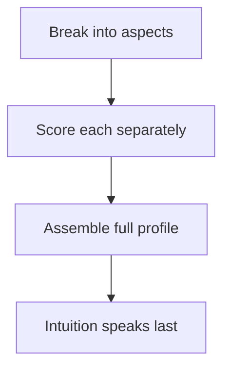

## Why this episode matters

Daniel Kahneman won the 2002 Nobel Prize in Economics for work on decision-making with Amos Tversky, and wrote "Thinking, Fast and Slow." This episode is the track's course in humility about your own mind. Its lessons are procedural, not inspirational: delay your intuition, measure the noise in your judgments, run a premortem, soften your predictions. It sits ninth because it stress-tests everything the track built: every model, principle, and flywheel is only as good as the judgment executing it, and judgment, Kahneman shows, is noisier and more biased than anyone admits.

Note on the source: the transcript is YouTube auto-generated captions, translated in places. Numbers and names below follow the transcript. Where the captions garble a name, it is mapped ("Paul Mill" = Paul Meehl, "Nick Nesbet" = Richard Nisbett) or marked [uncertain].

## Delay your intuition

### The opening instruction

The episode opens with Kahneman's core procedure, stated before the interview even begins: "Put aside your intuition. Do not try to form an intuitive solution quickly, as we usually do. Focus on individual points, and when you have a whole profile, then intuition will suggest the best option."

The origin story: at 22, a psychologist in the Israeli army, he was tasked with redesigning recruit interviews. The old system: interviewers chatted and formed an intuitive overall impression of combat-soldier potential. Having read Paul Meehl's book, Kahneman invented six traits, had interviewers ask questions per trait, and rate each trait independently before moving on. The interviewers, brilliant recruits a year younger than him, were furious, saying the procedure reduced them to robots

His compromise: do it his way, trait by trait, and then, at the end, close your eyes and put a number on it: how good a soldier will this man be? Two surprises followed. First, the structured scores significantly beat the old intuitive interviews. Second, the final intuitive judgments added information: they were as good as the six-trait average but not identical. The final system weighted them equally, half structured scores, half delayed intuition.

Fifteen years before the interview, visiting his old base, the research unit commander described their process and added: "And we also tell them: close your eyes." Fifty years later, the procedure survived. It is now, he says, the basis of the book he then wrote ("Noise").

The general rule: treat every decision like a candidate evaluation. Break it into aspects. Score each aspect separately. Only then look at the whole profile, and only then let intuition speak. Intuition first is fast and often wrong. Intuition last is informed.

Figure 1. Delay intuition. AI Podcast Curriculum, ep09 (Daniel Kahneman, 2019-10-12). Source: original toy, from episode claims.

### When to trust intuition at all

Intuition works under three conditions: a stable environment, many repeated attempts, and quick feedback. Chess masters, firefighters: yes. Most organizational decisions: no. Shane's summary is correct and Kahneman agrees: the conditions are rarely met where judgment is most used.

His rules for the gap. First, expect little: have low expectations for improving decision-making, overconfidence about debiasing is itself a bias. Second, slow down, especially when you feel momentarily certain, certainty is the warning light, not the green light. Third, where judgment can be replaced by rules and algorithms, use them. Algorithms will do better. There are social costs to trust in algorithms, but the decisions themselves improve.

## Noise: the hidden half of error

### The underwriter experiment

The idea that became the book "Noise" started as a consulting assignment at an insurance company. Underwriters quote premiums speaking for the company, clients expect any underwriter to give roughly the same number. Kahneman's test: assemble realistic cases (the underwriters built them), and ask about 50 underwriters to price each case from identical information.

Then he asked the executives: pick two underwriters at random. By what percentage do their premiums differ (difference divided by the average)? Everyone expected about 10 percent. The answer was about 50 percent. The company had not suspected any of it, the finding was a complete surprise.

The rule he draws: where there is judgment, there is noise, and there is more of it than you think.

Definition: noise is unwanted variability in judgments that should be identical. Bias is the average error, noise is the scatter around it. The underwriters were not systematically too high or too low. They disagreed with each other, expensively, at random.

### Useless versus useful variability

Not all variability is noise. Evolution runs on variability with selection and feedback: useful. The underwriters' scatter had no selection mechanism and no feedback: nothing was absorbed, nothing learned. That is useless variability, and it is expensive.

Noise reduction procedures, in his order:

1. Algorithms. Better than humans, better than judgment. "It's not intuitive, but it's really, really true."
2. Structured decomposition: the Israeli-army procedure. Break the judgment into independent scores.
3. Scale discipline. Teach people what the scale means. Underwriters should compare each case to other cases and share context with each other. Performance appraisal is "one of the scandals of modern business" partly for lack of this: common-criteria training on how to use the scale. Superforecasters are trained to think in probability units, the scale training is part of what makes them super.

### Why organizations resist

Decision journals and premortems surface an organizational truth: they identify people whose judgment is better than their managers'. That threatens leaders, and leaders block what threatens them. Anything threatening the leader "will definitely not be implemented." People are afraid of embarrassment at every level. Noise reduction is cheap technically and expensive politically.

## The premortem

### Legitimizing doubt

His favorite organizational procedure is Gary Klein's premortem. Timing: a group is close to a decision but has not made it. Gather the deciders and say: imagine two years pass, we made this decision, and it was a disaster. Write the story of the disaster in bullet points.

Why it works: near a decision, expressing doubt becomes socially costly. The person slowing the group looks annoying, the group wants them gone. The premortem legitimizes doubt and even encourages it, because everyone is now competing to write the best disaster story. It will not prevent big mistakes, he warns honestly, but it alerts the group to loopholes and to what would make the plan safer.

Related: protect the independence of evidence-gatherers from decision-makers' wishes. Analytics should not know what answer is wanted.

### The decision journal

His own decision journal, he admits, "would be a complete mess", he does not offer himself as the example. But the contents he recommends: the main arguments for and against, the alternatives considered, enough detail to analyze later, and a confidence rating where assessable. The journal's organizational value doubles as talent discovery: over time it calibrates who actually judges well, painlessly and consistently.

## Prediction without regression

### Julie

His favorite bias example. Julie is a university graduate. One fact: she started reading fluently at age four. What is her GPA?

Everyone gets a number instantly. The mechanism: reading at four creates an impression of ability, translatable to a percentile (say the 90th), and the predicted GPA lands at the same percentile. The prediction is as extreme as the impression.

Statistically, this is "idiocy," his word. The age a child learns to read is a weak predictor of college GPA. The correct move: start from the base rate (a GPA of 3.1 or 3.2 if you know nothing), then adjust slightly upward because she is smart. Not 3.7. A little above average, not at the 90th percentile.

The name for the error: non-regressive prediction. Intuitive prediction does not account for regression to the mean. The rule: the best guess is always less extreme than your impression. He can sometimes catch himself and soften a forecast deliberately, but "never when it matters": when he cares most, intuition wins.

His academic illustration: at Berkeley, a job candidate gave a mediocre talk but had awards for instruction. The committee concluded "he can not teach." They had the report, the error is the same shape as Julie. One vivid sample overwrote the base rate.

Figure 2. Regress your predictions. AI Podcast Curriculum, ep09 (Daniel Kahneman, 2019-10-12). Source: original toy, from episode claims.
| Step | Intuitive (wrong) | Statistical (right) |
|---|---|---|
| Impression | 90th percentile ability | 90th percentile ability |
| Base rate | Ignored | GPA 3.1-3.2 |
| Prediction | 90th percentile GPA (~3.7) | Slightly above average |
| Error | Non-regressive | Regressed to the mean |

## Behavior, situation, and restraining forces

### Lewin's springs

Asked what he wishes everyone knew about psychology, Kahneman names two lessons. The first is Kurt Lewin's, his "guru and hero": when you want to move behavior from A to B, do not push. Ask why they are not at B already.

Lewin saw behavior as an equilibrium: driving forces push one way, restraining forces push the other. The image Kahneman carried since age 20: a board held by two sets of springs. To move it, add a pushing spring or remove a restraining one. The striking result: push it to a new position and the system sits at higher tension (you compressed a spring, it pushes back harder). Remove a restraining spring and the system settles at lower tension.

Applied: to change behavior, weaken the restraining forces. This is why pressure, arguments, and threats backfire: they push tension up. In negotiation, the counterintuitive move is to ask what would make it easier for them to take your side.

The second lesson extends the first: behavior reflects the situation more than personality. The fundamental attribution error: you watch someone act strangely and blame character when the situation is the cause. Teaching psychology should make people less critical: more compassion, more patience. Condemnation leads nowhere.

### Change is hard

On changing behavior, his own or others': extremely difficult, and optimists about it "are just living in illusions." What works is structural: make beneficial actions easier and harmful ones harder. The marriage aside: trying to change a spouse is not the path to a good marriage, lower expectations would make everyone happier.

The ownership effect sharpens the point. He would demand more to sell you his sandwich than he would pay to buy it: giving hurts more than receiving. But an agent deciding for someone else has no loss fear and trades at one price: economically rational. Governments act as such agents: they see the end state, ignore that reforms create losers, and the losers fight harder than the winners push. So reforms usually fail, and when they succeed they cost far more than expected, because compensating losers was never budgeted. The sandwich scales to public policy.

### Environment and belief

Physical surroundings matter at the crude level: heat, irritation, noise degrade thinking. But there is no simple story, some people think better in a buzzing café. One caution he offers as minor: avoid red rooms for decisions, calming colors help at the margin.

The deeper obstacle to clear thinking: we arrive with ready-made answers to almost everything, and we cannot switch that off. Worse, reasons are not the sources of beliefs. Ask for his reasons and he will always produce some, but beliefs mostly come from trusting certain people and adopting their views. Scientists included: loyalty to old views, resentment of rivals. There is less clear thinking around than people like to think.

His climate-change example: he believes in it because he trusts the people who say it exists, deniers trust other people. Fake news works the same way: his camp's fake news is more believable to him. Public discourse degraded over the 10-15 years before the interview, polarization and source selection are the hard-to-discuss causes.

## Happiness versus satisfaction

### Two different things

Happiness is ambiguous, so he splits it. Happiness proper: the emotional coloring of life, how it feels to be you, moment to moment. Life satisfaction: the story you tell when you stop and evaluate. Most of the time you do not think about your life, you live it. Satisfaction is the occasional audit.

He started believing only the first mattered: reality is the felt experience, satisfaction is just stories. Research forced a reversal. The circumstances producing happiness differ from those producing satisfaction. Happiness is largely social: being with people you love who love you back. Satisfaction is more conservative: success, money, education, prestige.

Then the uncomfortable finding: people do not seem to care much about how happy they will be. They want the good story. They want to be satisfied with their lives. Defining well-being as felt happiness, when people want life stories, was "an untenable position." He stopped researching well-being shortly after, he says, having no idea what to do with it.

### The $70,000 threshold

With Angus Deaton at Princeton, he found: in emotional terms, money past about $70,000 (US, at the time) does not make people happier, while poverty makes people unhappy. But life satisfaction has no saturation point: more is always better, because money is an indicator of success, often subjective success. Billionaires working themselves to death are not buying happiness, they collect evidence that they are good at what they do.

Both correlate with longer life, he believes, with emotional happiness the clearer causal arrow: it is actually good for you.

## Questions and answers

**Q1: Explain this episode to me like I am new. What is Kahneman's message?**
Your mind produces instant answers, and they feel right, and they are often wrong in predictable ways. Do not try to fix the mind, install procedures around it. Break decisions into parts and score them before letting intuition speak. Measure how much your experts disagree with each other, the number will shock you. Before big decisions, write the disaster story. When predicting, pull your guess back toward average. And where a rule can replace a judge, let it.

**Q2: What is noise, and how is it different from bias?**
Bias is the average mistake: everyone shoots left of target. Noise is the scatter: shots land everywhere. The 50 underwriters were not systematically wrong in one direction, they disagreed with each other by 50 percent when everyone expected 10. Organizations obsess over bias and ignore noise, but noise is often the bigger and more fixable problem. Fix it with algorithms, structured scoring, and scale training.

**Q3: Applied: run a premortem on my current project.**
Gather the deciders before the decision is final. Say: it is two years from now and this failed disastrously. Everyone writes the disaster's bullet-point history privately, then shares. Collect the loopholes. For each, ask: what would make the plan safer against this? Note what the premortem cannot do: it will not stop a truly bad decision. It buys you the doubts that politeness suppressed.

**Q4: Work the Julie numbers with me.**
Fact: fluent reading at age 4. Impression: ~90th percentile ability. Intuitive prediction: ~90th percentile GPA, around 3.7. Statistical correction: the predictor is weak, so regress hard. Base rate GPA: 3.1-3.2. Adjusted prediction: a bit above average, maybe 3.3-3.4, definitely not 3.7. The discipline: whenever your prediction matches your impression's extremity, pull it back. Extremity of impression is not evidence of extremity of outcome.

**Q5: When should I trust my intuition?**
Only when all three hold: the environment is stable, you have had many repeated tries, and feedback was quick. Then intuition is recognition, and it is superb. Everywhere else, especially in organizational judgment, treat intuition as a hypothesis generator: useful after the structured work, dangerous before it. And when you feel certain, slow down, certainty is the signal to be careful, not to accelerate.

**Q6: How do Lewin's springs change my approach to people?**
Stop pushing. List the restraining forces: what makes it hard for them to do B? Remove one spring instead of adding pressure. In a negotiation, ask what would make agreement easy for them. In a team, ask what blocks the behavior you want before demanding more of it. Lower tension beats higher pressure: the board stays moved without fighting you.

**Q7: Happiness or life satisfaction: which should I optimize?**
Kahneman's honest answer: he does not know, and the research embarrassed his original view. The facts: happiness comes from people you love, satisfaction comes from the story of success, money buys the second past $70,000, not the first. His closing position is descriptive, not prescriptive: know which game you play, because they are different games with different scoreboards.

**Q8: How does this episode connect to the track's arc?**
It is the quality-control department for the whole track. Ep01's models need noise audits. Ep02's first principles need premortems. Ep06's flywheels need the underwriter test: do your managers agree on what they see? Ep07's idea meritocracy needs scale discipline to work. And ep04's inner work meets its match: you cannot meditate your way out of regression to the mean. Procedures beat intentions, that is the track's final lesson about thinking.

## Memory aids

Mnemonic: **D-N-P-R**: Delay intuition, Noise audit, Premortem, Regress predictions.

Never-confuse pairs:
- Bias versus noise: average error versus scatter. Fix bias with better models, fix noise with algorithms and structure.
- Intuition early versus intuition late: fast guess before evidence versus informed judgment after scoring. Same faculty, opposite reliability.
- Happiness versus life satisfaction: felt experience versus life story. Different causes, different measures.
- Driving versus restraining forces: pushing harder versus removing blocks. One raises tension, the other lowers it.

Trap cards:
- Trap: "My experts agree." Reality: test it. Fifty underwriters, 50 percent scatter, nobody suspected.
- Trap: "I feel certain, so I am right." Reality: certainty is the cue to slow down, not speed up.
- Trap: "This time the extreme prediction is justified." Reality: regress anyway. The best guess is less extreme than the impression.
- Trap: "More pressure will move them." Reality: pressure compresses the spring. Remove a restraining force instead.

## How to imbibe this

1. The close-your-eyes rule. For your next three judgments (hires, vendors, ideas), score the aspects first, then close your eyes and take the intuitive number. Compare. Observable change: you feel the two systems disagree.
2. The noise audit. Pick one repeated judgment in your work. Have two qualified people do it independently. Measure the scatter. Observable change: the 10-percent illusion dies.
3. The premortem. Run one before your next big decision. Write the disaster bullets. Observable change: at least one loophole surfaces that politeness hid.
4. The regression habit. For every prediction this month, write the base rate first, then your adjustment, then check the extremity. Observable change: predictions get less dramatic and more accurate.
5. The springs list. For one behavior you want changed, list restraining forces instead of pushing harder. Remove one. Observable change: movement without the tension spike.
6. The algorithm question. For one recurring judgment, ask: could a rule do this? Draft the rule. Observable change: at least one decision gets dumber-proofed.

## Think it yourself

The final and hardest set of the track.

**Drill 1: noise measurement.** Design a mini underwriter experiment for your work: 3 cases, 2+ judges, independent scoring. Compute the scatter as Kahneman did (difference over average). Present the number to the team. Write the one-paragraph reaction you expect versus the one you get.

**Drill 2: premortem portfolio.** Run premortems on your three biggest current bets. Collect all disaster bullets. Sort by preventability. For the top three preventable disasters, write the safeguard and its cost. Decide which safeguards to buy.

**Drill 3: Julie variants.** Create five Julie-style cases from your domain: one vivid fact, one requested prediction. Write your intuitive prediction, then the regressed one. Show both to a colleague and ask which feels right. Note how hard the regressed answer is to defend socially.

**Drill 4: intuition conditions audit.** List your ten most consequential recurring judgments. Grade each on the three conditions (stable environment? many reps? quick feedback?). For the ones failing two or more, design the structured procedure that replaces raw intuition.

**Drill 5: restraining-force map.** Pick a change initiative that stalled. Map driving forces (what you added) and restraining forces (what pushes back). For each restraining force, design a removal. Predict the tension change. Implement one removal and observe.

**Drill 6: the two-well-beings ledger.** For one month, log daily: momentary happiness (1-5, evenings) and life-story satisfaction (1-5, Sundays). At month's end, correlate each with what you actually did. Write which game you play and whether it is the one you want.

## Skills you can now use

- Delay intuition with the aspect-scoring procedure.
- Measure noise in any repeated professional judgment.
- Run a premortem that legitimizes doubt.
- Regress predictions toward the base rate.
- Replace replaceable judgments with algorithms and rules.
- Weaken restraining forces instead of adding pressure.
- Distinguish happiness from life satisfaction in your own planning.

## Go deeper

- The episode itself: https://www.youtube.com/watch?v=-10cairWi10
- "Thinking, Fast and Slow": https://en.wikipedia.org/wiki/Thinking,_Fast_and_Slow (HTTP 200, verified 2026-10-06)
- Farnam Street's podcast archive: https://fs.blog/podcast/ (HTTP 200, verified 2026-10-06)

## Figure audit

| Unit id | Claim | Before | After | Figure id | Medium | Source | Four tests |
|---|---|---|---|---|---|---|---|
| u01 | Delayed intuition procedure | Intuition first | Aspects scored, intuition last | fig1 | mermaid | episode claims | T1: 4-node chain / T2: flow forces mermaid / T3: none, static plate / T4: none reused |
| u02 | Regression discipline | Extreme predictions | Pulled back to base rate | fig2 | table | episode claims | T1: 4-row before-and-after table / T2: a comparison forces a table / T3: none, static plate / T4: the base-rate row, reused in the Julie example |
