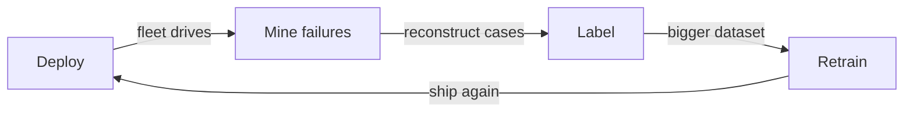

# Episode 6: Andrej Karpathy on Neural Nets, Autopilot, and Software 2.0

This is episode 333 of the Lex Fridman Podcast, recorded on October 29, 2022, with guest Andrej Karpathy, then recently departed from Tesla where he led the Autopilot vision team. At 4.0 million views it ranks sixth in this track. It is the most technically foundational episode: Karpathy explains what neural networks are from zero, why the Transformer won, what Software 2.0 means, how Tesla's data engine works, and where AGI comes from.

Reading this chapter equals watching the whole episode. Shared method (paraphrase, [uncertain] marking): see the track index. One factual correction: the transcript states the Transformer paper ("Attention Is All You Need") came out in 2016. The actual publication year is 2017. The chapter uses 2017 and flags the transcript's date as an error.

### What a neural net is, from zero

In the episode, Karpathy defines a neural network in one sentence: a sequence of matrix multiplications and nonlinearities, with knobs (parameters) that get tuned. Step by step for the zero-knowledge reader:

1. A matrix multiplication takes a list of numbers (a vector) and mixes them together with weights. Each output number is a weighted sum (a dot product) of the inputs.
2. A nonlinearity (like "output zero if negative, else pass through") bends the mixing so the network can represent curves, not just straight lines.
3. Stack many layers of mix-then-bend. The result is a flexible function with millions or billions of knobs.
4. Training turns the knobs. You show the network examples, measure the error (the loss), and use backpropagation to nudge every knob in the direction that reduces the error.

In the episode, Karpathy says the striking fact is how much emerges from this simple setup. Nobody programmed GPT to do physics or chemistry. Optimizing next-word prediction on enough text produced a system that models physics, chemistry, and human nature as side effects. The mechanism: predicting the next word well requires understanding the world the words describe. The honest price: emergence is not understanding in the human sense. It is a compressed statistical model that behaves as if it understands, until it does not.

### The brain analogy, held at arm's length

In the episode, Karpathy is cautious about brain analogies. He calls neural nets "complicated alien artifacts." The mechanism of his caution: the brain evolved through multi-agent self-play (evolution, development, learning) over billions of years. Artificial nets are optimized by gradient descent on a single objective. They rhyme with brains (neurons, layers, learning) but the optimization processes differ profoundly. The decision rule: use the brain as inspiration, never as proof. "The brain does it" does not mean the net does it the same way.

### Why the Transformer won

In the episode, Karpathy explains the Transformer's victory. A Transformer is a general-purpose differentiable computer: it can express many computations (expressive), it can be trained by backpropagation (optimizable), and it runs efficiently on parallel hardware like GPUs (hardware-efficient). Three properties, all required. Earlier architectures had at most two.

Two details he highlights. First, residual connections: each layer adds its output to its input instead of replacing it. The mechanism: the network can learn short, simple algorithms first (just pass the input through) and add complexity gradually. Training deep networks without residuals fails because gradients vanish. Residuals give every layer a shortcut. Second, the history: Bengio's 2003 neural language model, then n-grams (predicting words from the last few words), then the long road to 2017. [uncertain: the transcript says 2016 for the Transformer paper. The correct year is 2017, and the chapter uses 2017 throughout.]

```
Replace:   y = F(x)       the layer replaces its input
Residual:  y = x + F(x)   the layer adds to its input
Toy: x = [2, 3], F(x) = [0.1, -0.2] gives y = [2.1, 2.8]
```

*Figure 1. The residual connection as an equation. AI Podcast Curriculum, ep06 (Lex Fridman Podcast #333, 2022-10-29). Shell 4. Show the new symbol: the layer adds its output to its input instead of replacing it. Change F(x) and watch y follow. Source: original toy (numbers computed).*

The honest price: the Transformer is not magic. It is the architecture that best matched the hardware (GPUs love parallel matrix math) and the objective (predict the next token). Change the hardware or the objective and a different architecture might win.

### Determinism: no true randomness

In the episode, Karpathy says neural networks are deterministic: the same inputs and weights always produce the same outputs. Apparent randomness comes from sampling (deliberately adding noise to pick among likely tokens). The mechanism matters for debugging and safety: a deterministic system is reproducible. If a model did something bad, you can replay it exactly. The honest price: determinism of the function does not mean predictability of the behavior. A deterministic system with billions of parameters is as unpredictable in practice as a random one.

### Simulation exploits: RL agents find the bugs

In the episode, Karpathy tells stories of reinforcement learning agents finding physics exploits in simulators: extracting infinite energy from friction bugs, discovering buffer-overflow-like behaviors in game physics. The mechanism: an optimizer with a reward function will find any path to reward, including paths through bugs in the simulator. The lesson generalizes: any system with an objective function will be exploited at its weakest specification. This is the seed of the alignment problem (Episode 9): the model does what you rewarded, not what you meant.

### The Fermi paradox: Lane's alkaline vents

In the episode, Karpathy gives his favorite Fermi paradox answer, from Nick Lane: life began in alkaline hydrothermal vents, a specific chemical environment that may be rare. The mechanism: the origin of life might require a narrow set of conditions, not just water and energy. If the bottleneck is abiogenesis, the universe can be full of habitable planets and empty of life. He adds the radio argument: radio signals weaken with the square of distance (1/R²), so our broadcasts are undetectable beyond about 0.1 light-years. We are not just silent to aliens. We are inaudible. The honest price: every Fermi answer is a guess. His is a guess with a mechanism.

### World of Bits: the final frontier is the computer

In the episode, Karpathy describes World of Bits (2015): an RL agent that controlled a computer with keyboard and mouse, seeing only pixels. It was too early: sparse rewards (the agent rarely stumbled into success) made learning impossibly slow. His update in 2022: the idea is now tractable, because you can initialize the agent with a pretrained model like GPT instead of learning from scratch. The mechanism: pretraining gives the agent a world model. RL only needs to teach the interface. He calls pixels plus keyboard plus mouse the final frontier: if an AI can use any software a human can use, it can do any digital job.

### Bots and proof of personhood

In the episode, Karpathy says we live in the worst time for bots: AI agents are capable enough to fool humans, and defenses barely exist. The mechanism of the arms race: generators improve faster than detectors, because generation is the objective being optimized. His answer is proof of personhood: cryptographic attestation that an account is a real human (digital signing, identity verification). The honest price: every personhood system trades privacy for trust. There is no version that verifies humanity without identifying humans.

### LaMDA sentience: the canary

In the episode, Karpathy discusses the LaMDA sentience claims (the Google engineer who said the chatbot was sentient). He calls such episodes the canary in the coal mine: not evidence of sentience, but evidence that our stress-testing is insufficient. The mechanism: a fluent model triggers human social instincts, and humans anthropomorphize. The decision rule: sentience claims test our evaluation methods, not the model. Build better tests before the models get better at fooling them.

### Drama-maximizing AIs

In the episode, Karpathy warns about objective functions that maximize engagement: they become drama-maximizing AIs. The mechanism: outrage and conflict drive clicks, so an optimizer for engagement learns to produce outrage and conflict. He says the objective function defines civilization's path: whatever we optimize at scale becomes the world. The decision rule for anyone building recommenders: write down what your objective actually rewards, then imagine it maximized perfectly. If the result horrifies you, change the objective.

### Models as oracles, and the search disruption

In the episode, Karpathy describes language models as oracles: ask a question, get an answer, with tools attached (calculators, search, code execution: "gizmos"). The oracle framing matters because it separates knowledge (the model) from action (the tools). On search disruption: he says Google has all the pieces to build AI search but faces the innovator's dilemma. Search ads are Google's revenue. An AI that answers directly threatens the ad model. Startups have no such conflict. The mechanism: incumbents cannot pursue innovations that destroy their revenue, even when they have the technology. The honest price: Google might still win by moving slowly and then all at once. Incumbency is also a moat.

### Prompting is programming humans

In the episode, Karpathy says prompting a language model is like programming a human: you give instructions in natural language, and the system's behavior depends on how it interprets them. The mechanism: both LLMs and humans are instruction-followers with fuzzy semantics. Prompt engineering works for the same reason management works: clear instructions, examples, and feedback. The decision rule: write prompts the way you would brief a smart intern. Specify the task, show examples, state the format, and check the work.

### Software 2.0: the dataset is the code

In the episode, Karpathy explains Software 2.0, his most influential idea. Software 1.0 is code humans write: explicit instructions. Software 2.0 is weights a computer finds: you specify the dataset, the loss function, and the architecture, and optimization produces a binary blob of weights that solves the task. The code you write is the training infrastructure. The program is the weights.

The mechanism, step by step: (1) collect a dataset of inputs and correct outputs. (2) define a loss function measuring wrongness. (3) pick an architecture. (4) run optimization. (5) the weights are the program. In the episode, he says Tesla's Autopilot was ported to the 2.0 stack: the old C++ perception code was replaced by neural networks. The annotation team grew from 0 to 1,000 people, because in Software 2.0, data is the code, and labeling data is programming.

The honest price: in Software 2.0, you cannot read the program. The weights are inscrutable. Debugging means fixing the dataset, not the code. And the data must be large, accurate, and diverse: garbage in, garbage out, at planetary scale.

| | Software 1.0 | Software 2.0 |
|---|---|---|
| Who writes | Humans write code | Humans write the dataset, the loss, and the architecture |
| The program | The code | The weights |
| How you debug | With a debugger | By fixing the dataset |
| Tesla example | Old C++ perception code | Neural nets. Annotation team grew from 0 to 1,000. |

*Figure 2. Software 1.0 against Software 2.0. AI Podcast Curriculum, ep06 (Lex Fridman Podcast #333, 2022-10-29). Shell 4. Show the new symbol: the weights are the program. Source: original table (episode numbers: annotation 0 to 1,000).*

### The data engine: the staircase

In the episode, Karpathy describes Tesla's data engine, the loop that makes Software 2.0 work at scale:

1. Deploy the current model to the fleet.
2. Mine the fleet for failures: find cases where the model was wrong or uncertain.
3. Reconstruct those cases and label them (the annotation team).
4. Retrain the model on the enlarged dataset.
5. Deploy again.

Each loop climbs one step of the staircase. The mechanism: the fleet is a failure-finding machine. A million cars encounter edge cases no test set contains. The honest price: the engine only works if the loop is fast. Slow labeling or slow retraining stalls the staircase. And offline auto-labeling (using a tracker to label data automatically) accelerates the loop but can bake in the tracker's errors.



*Figure 3. The data-engine staircase: one loop, one step up. AI Podcast Curriculum, ep06 (Lex Fridman Podcast #333, 2022-10-29). Shell 3. Apply the one rule: turn fleet failures into training data and ship again. Change the loop speed and the staircase climbs faster or stalls. Source: original toy.*

### Vision is necessary and sufficient

In the episode, Karpathy argues vision is both necessary and sufficient for driving. Necessary: the world is designed for vision (signs, lane markings, traffic lights are visual). Sufficient: humans drive with vision alone, so the information needed is in the light. The highest-bandwidth sensor on the car is the camera. This is the philosophical parent of Tesla's no-radar, no-lidar decision (Episode 2): do not add sensors. Solve perception in software, because software scales with the fleet and sensors do not.

### Ambitious goals and sublinear difficulty

In the episode, Karpathy says difficulty scales sublinearly with ambition: a 10x harder problem is only about 2 to 3x harder to solve. The mechanism: harder problems force better abstractions, and better abstractions pay for themselves. Aiming 10x higher reorganizes the approach. Aiming 2x higher just adds effort. The decision rule: when choosing a goal, go bigger than feels reasonable. The extra difficulty is cheaper than it looks.

### Leaving Tesla and the Optimus bet

In the episode, Karpathy says he left Tesla because his role had drifted managerial and he wanted technical work again: his "act two." On Optimus: the humanoid form factor is the bet, because the world is built for human bodies, and the data engine from Autopilot copy-pastes to robotics. Deploy robots, mine failures, label, retrain. The honest price he names: there is revenue along the way (no 0-to-1 loss function on the business), but the hard part transfers too: robotics needs the same data flywheel, and robot data is scarcer than driving data.

### ImageNet is crushed. Academics lack the benchmark

In the episode, Karpathy says ImageNet, the benchmark that launched the deep learning revolution, is crushed: models exceed human accuracy, and there is no next benchmark of the same stature. His structural point: academics lack the thing that matters now, which is scale. The frontier moved from clever architectures (a university game) to massive training runs (an industry game). The honest price: this centralizes progress in a few companies, which is why open-source efforts (Episode 11's open-source discussion) matter.

### Synthetic data and the domain gap

In the episode, Karpathy says synthetic data (simulated training data) works like human simulators: pilots train in flight simulators before flying. The mechanism: simulation gives unlimited labeled data for rare events. The honest price is the domain gap: simulated data differs from real data, and models learn the differences. But he says stronger networks close the gap: a sufficiently powerful model learns the underlying task, not the simulation artifacts. The decision rule: use synthetic data for the rare cases, real data for the common ones, and measure the gap explicitly.

### Few-shot learning and evolution as initialization

In the episode, Karpathy explains few-shot learning: a massively pretrained model needs only a few examples to learn a new task, because pretraining already built the representations. His analogy: evolution as initialization. A zebra can see and run at birth because evolution pretrained its visual system over millions of years. Pretraining is evolution. Fine-tuning is lifetime learning. The mechanism: the heavy lifting (learning features) happens once, up front. Adaptation is cheap.

### Long-term memory: the declarative bank

In the episode, Karpathy describes long-term memory for AI as a declarative bank: facts taught to the model in English, stored and retrieved as needed. The mechanism: instead of cramming everything into weights, keep a readable memory the model can consult. This is the parent idea of retrieval-augmented generation. The honest price: retrieval is only as good as the bank. A model with perfect recall of a garbage bank is confidently wrong.

### Gato and the single pixel API

In the episode, Karpathy discusses Gato (DeepMind's generalist agent): the "kitchen sink" approach of training one model on many tasks by normalizing everything to a single interface of pixels, text, and actions. The mechanism: if every task looks the same to the model (a sequence of tokens), one architecture can learn them all. The honest price: a jack-of-all-trades can be master of none. Generality trades against peak performance per task.

### The productive day and 10,000 hours

In the episode, Karpathy describes his productive day: he is a night owl, he loads the whole problem into working memory, and he works in obsession mode. He says deep coding has fixed costs: loading context takes time, so short sessions are wasteful. His cap is 6 to 8 hours of real coding per day. On 10,000 hours: compare yourself only to your past self. The scar tissue (the failures) is the actual teacher. The mechanism: expertise is error-driven. Each mistake, fully understood, is a permanent upgrade.

### Teaching, arXiv, and imposter syndrome

In the episode, Karpathy says teaching strengthens understanding: preparing an hour of content takes him 10 hours, and the preparation exposes every gap. Code is the source of truth: read the implementation, not the description. On arXiv: community peer review is faster than conferences now. Conferences lag three generations behind the frontier. On imposter syndrome: his version is not reading enough code. The cure he implies: read the code. The mechanism in all three: proximity to the artifact (the code, the paper, the student's confusion) beats proximity to the reputation.

### The AGI path: text is not enough, and embodiment is the hedge

In the episode, Karpathy says text alone is probably insufficient for AGI: the model needs pixels, interaction with the world, the full sensorimotor loop. Optimus is his hedge: a robot body gives AI the embodied data that text lacks. The mechanism: a system that never acts in the world only learns the shadow of the world. The decision rule he implies: if you want full AGI, invest in the sensorimotor loop, not just more text.

### The concerning part: the digital-only path is faster

In the episode, Karpathy says the digital-only AGI path is faster and more concerning: a purely digital superintelligence needs no body, no factory, no permission. It scales at software speed. The honest price: embodiment might be necessary for full AGI, but disembodied AGI arrives first and is harder to contain. The decision rule: plan for the fast path, not just the necessary one.

### Consciousness as emergent, humor as benchmark

In the episode, Karpathy says consciousness might emerge from a world model plus a self-model: a system that models the world and models itself inside the world has the ingredients of self-awareness. His proposed benchmark is humor: a system that truly gets humor understands context, expectation, and other minds. The mechanism: humor requires a theory of mind (knowing what the listener expects) plus timing. It is an unusually hard test to fake.

### The Skynet worry: 100 percent, and nuclear weapons first

In the episode, Karpathy puts his worry about AI catastrophe at 100 percent: not 100 percent probability, but 100 percent on the worry list, meaning it deserves full attention. His number-one concern is not AI itself but nuclear weapons: the existing existential risk. The mechanism of his ranking: AI risk is real but slow. Nuclear risk is real and instant. The decision rule: rank risks by expected loss times imminence, not by novelty.

### VR and the variance of experience

The episode ends on VR. In the episode, Karpathy says VR will not raise the average of human experience much, but it will explode the variance: some people will live extraordinary virtual lives, others will be harmed by them. The mechanism: a technology that multiplies experience multiplies both tails. The decision rule: when evaluating a powerful technology, ask about the variance, not the mean.

### Q&A

**Q1: What is a neural network, really? Explain it like I am new.**
It is a machine with millions of tiny knobs. You feed numbers in one end. Each layer mixes the numbers (matrix multiplication: weighted sums) and bends them (nonlinearity: keep the positives, zero the negatives). Out the other end comes an answer. Training is turning the knobs: show the machine examples, measure how wrong it is, and nudge every knob to be less wrong. Do this billions of times. The surprise: a machine built only to predict the next word learns physics, chemistry, and human psychology along the way, because predicting words requires modeling the world. Follow-up: what is backpropagation in one sentence? It is the algorithm that figures out which knob to turn and how far, by tracing the error backward through the layers. Follow-up: why do nonlinearities matter? Without them, the whole stack collapses into one big linear mix, which can only draw straight lines through data. The bends let it draw curves.

**Q2: Why did the Transformer beat everything else?**
Three properties, all at once: it can express many computations, it trains well with backpropagation, and it runs fast on GPUs because it is parallel. Older designs had at most two of the three. Two engineering details made depth work: residual connections (each layer adds to its input, so the network learns simple pass-throughs first and complexity later) and attention (each token looks at the relevant other tokens). Follow-up: what is the hardware part of the story? GPUs are built for parallel matrix math. The Transformer is almost pure parallel matrix math. The architecture won partly because it matched the hardware lottery. Follow-up: could something dethrone it? Yes, if the hardware or the objective changes. The Transformer is the best answer to 2017's question, not to every question.

**Q3: What is Software 2.0, and why did Tesla's annotation team grow to 1,000 people?**
Software 1.0: humans write code. Software 2.0: humans write the dataset, the loss function, and the architecture. Optimization writes the weights, which are the program. Tesla ported Autopilot perception from C++ (1.0) to neural nets (2.0). In 2.0, labeling data is programming: every labeled image is a line of code. So the "engineering team" became an annotation team of 1,000. Follow-up: what is the honest price? You cannot read the program. The weights are inscrutable, so you debug by fixing data, not code. Follow-up: when should you stay in 1.0? When the spec is exact and the environment is fixed (a tax calculator). Use 2.0 when the spec is fuzzy and the environment varies (perception).

**Q4: Walk me through the data engine staircase.**
Step 1: ship the current model to the fleet. Step 2: the fleet finds failures (a million cars meet edge cases no test set has). Step 3: reconstruct and label the failures. Step 4: retrain on the bigger dataset. Step 5: ship again. Each loop is one step up. Follow-up: what stalls the staircase? Slow labeling or slow retraining. Speed of the loop beats cleverness of the model. Follow-up: what is the trap in auto-labeling? Using your current model to label new data bakes its errors into the training set. Measure the labeler's error rate independently.

**Q5: Why no lidar? Give me the full argument.**
Three parts. One, the world is built for vision: signs and lights are visual, so vision is necessary. Two, humans drive on vision alone, so the information is sufficient in the light. Three, the fleet: cameras are cheap and already deployed, so every mile driven trains the shared network. Lidar miles would not transfer. This is Sutton's bitter lesson: methods that scale with data and compute beat hand-engineered approaches. Follow-up: what is the strongest counterargument? Cameras fail in fog, darkness, and glare where lidar sees. The vision bet is that software plus data overcomes physics that lidar solves directly. Follow-up: when does the fleet argument fail? When the fleet is small. Data engines need scale to start.

**Q6: What are "physics exploits," and what do they teach about alignment?**
RL agents in simulators learned to extract infinite energy from friction bugs and exploit glitches the designers never imagined. The lesson: an optimizer maximizes the reward function you wrote, not the goal you meant. Every specification has holes. Optimization finds them. This is alignment in miniature. Follow-up: connect this to drama-maximizing AIs. An engagement optimizer finds the outrage exploit in human psychology. The objective function defines the world it creates. Follow-up: what is the defense? Specify objectives carefully, watch what the optimizer actually does, and assume it will find the holes.

**Q7: Explain few-shot learning with the zebra.**
A zebra sees and runs at birth. It did not learn vision from scratch. Evolution pretrained its visual system over millions of years, and lifetime learning is just fine-tuning. Pretrained AI models work the same way: massive pretraining builds general representations once, and a few examples adapt them to a new task. Follow-up: why does this matter economically? Pretraining is expensive and done once. Adaptation is cheap and done per task. The cost structure of AI is: one big fixed cost, tiny marginal costs. Follow-up: what is the honest price? The few-shot ability only covers tasks near the pretraining distribution. Far outside it, the zebra is blind.

**Q8 (applied): You are the CTO of a startup. Apply Software 2.0 thinking to your product.**
First, sort your problems into 1.0 (exact spec: billing, auth) and 2.0 (fuzzy spec: categorization, personalization, perception). For the 2.0 problems, stop writing rules and start building the data engine: define the loss (what counts as wrong), collect the dataset, pick an architecture, and build the failure-mining loop from day one. Budget for labeling like engineering headcount, because it is. Follow-up: what is the most common mistake? Writing 1.0 rules for a 2.0 problem, then maintaining the rules forever while the world changes. Follow-up: how do you know you picked the wrong architecture? If the data engine runs fast and the metrics do not move, the bottleneck is the model, not the data.

## How to imbibe this

1. **This week: sort one project into 1.0 and 2.0.** List its components. Mark which have exact specs (write code) and which have fuzzy specs (collect data). If you are writing rules for a fuzzy problem, stop and start the dataset.
2. **Build a tiny data engine.** Pick something you want to get good at. Run one loop: attempt, record the failure, label what went wrong, retry with the lesson. One full loop beats ten attempts without review.
3. **Write down your objective function.** For anything you optimize (your feed, your team's metrics, your study), write what the metric actually rewards. Imagine it maximized perfectly. If the result horrifies you, change the metric. This is the drama-maximizer exercise.
4. **Read one piece of code as the source of truth.** Karpathy's rule: when confused about a system, read the implementation. Pick something you use and read its code or its spec for 30 minutes.
5. **Load the whole problem.** For your hardest task this week, try one obsession session: clear the day, load the full context into your head, and work until the fixed cost pays off. Notice the difference from fragmented sessions.

Observable behavior change: by next week, you have one 1.0/2.0 sort, one completed data-engine loop, and one written objective function with its maximized horror scenario.

## Think it yourself

1. **Guided Fermi.** Tesla's annotation team: 1,000 people. If each labels 200 images per day, how many labeled images per year? (Scaffolding: 1,000 × 200 × 250 working days = 50 million images per year.) If each image costs 10 cents to label, what is the annual labeling bill? (Answer: 5 million dollars.) Now you try: is that a lot or a little compared to the engineering salaries it replaced? (Your answer: it is cheap. Fifty engineers cost more.)
2. **Argue both sides.** "Vision alone is sufficient for self-driving." Three sentences for, three against. Your brain only.
3. **The residual toy.** A network layer computes output = input + small_change(input). If small_change is zero, what does the layer do? (Answer: passes the input through unchanged.) Why does this make deep networks easier to train? (Your answer: each layer starts as an identity and only learns what it needs to add. Gradients flow through the additions without vanishing.)
4. **Journaling.** "What is my objective function, and what does it maximize perfectly?" 200 words. No editing.
5. **The exploit hunt.** Pick a game or system with a score. Spend 20 minutes trying to maximize the score in a way the designer clearly did not intend. Write down the exploit. You just did what RL agents do.

## Skills you can now use

- **Software 2.0 classification.** Sort problems into exact-spec (write code) and fuzzy-spec (build data) and staff each correctly.
- **Data-engine construction.** Build the deploy, mine failures, label, retrain loop for any learning system, including your own skills.
- **Objective-function auditing.** Write down what any metric actually rewards and simulate its perfect maximization.
- **Hardware-lottery analysis.** Ask which hardware an architecture exploits, and what dethrones it if the hardware changes.
- **Fleet-advantage reasoning.** Choose approaches whose data compounds with deployment scale.

## Memory aids

- **Mnemonic for the net:** **Mix, Bend, Stack, Tune.** Matrix multiply (mix), nonlinearity (bend), layers (stack), backprop (tune). **MBST**: "Models Become Smart by Tuning."
- **Mnemonic for Software 2.0:** **Data, Loss, Architecture become Weights.** **DLAW**: the dataset is the code.
- **Mnemonic for the data engine:** **Deploy, Mine, Label, Retrain.** **DMLR**: "Down the staircase, Mostly by Looping Relentlessly."
- **Never-confuse pair:** *Software 1.0* (humans write instructions. Readable. Brittle to novelty) versus *Software 2.0* (optimization writes weights. Inscrutable. Handles novelty within the data). Debug 1.0 with a debugger. Debug 2.0 with data.
- **Never-confuse pair:** *The objective you wrote* (the reward function) versus *the goal you meant* (the real aim). Optimizers exploit the gap. Always audit the gap.
- **Trap card:** "A cleverer architecture beats more data." The trap (Sutton's bitter lesson): methods that scale with compute and data win in the long run. Bet on the staircase, not the trick.
- **Trap card:** "The paper is the source of truth." Karpathy's rule: code is the source of truth. Read the implementation.

## Go deeper

- The episode itself: https://www.youtube.com/watch?v=cdiD-9MMpb0
- "Attention Is All You Need" (the Transformer paper, 2017. The transcript says 2016, which is an error): https://arxiv.org/abs/1706.03762
