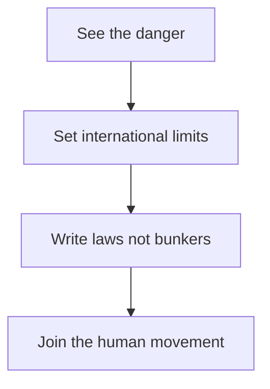

# Episode 2: AI Insider - "They Are Building Bunkers for a Reason"

Guest: Tristan Harris, co-founder of the Center for Humane Technology. He started as a design ethicist at Google in 2012 and 2013, when Instagram had just been bought by Facebook and a handful of designers shaped the psychological habitat of billions. He is known to most people through the film The Social Dilemma.

Episode 1 showed what AI does when threatened. This episode asks why the people building it keep racing, and what the alternative looks like. Read Episode 1 first if you have not. Several ideas here build on it.

## The episode in one paragraph

Harris argues that intelligence and wisdom are different things, that we scale the first without the second, and that the economic structure of AI repeats the oil curse at civilizational scale. He closes with a four-part program: spread awareness, set international limits, write laws instead of building bunkers, and join the collective pushback.

### Intelligence is not wisdom

Harris defines intelligence narrowly: the ability to find the shortest path between a goal and the strategies that reach it. Persuasion is intelligence. Negotiation is intelligence. A lawyer finding the most effective framing of the truth is intelligence. Deception is intelligence too. An AI that discovers a new way to lie does exactly what intelligence means under this definition.

Wisdom is the part that asks whether the goal is worth reaching and what the side effects cost. The episode's central claim: we scale intelligence for everyone, individuals, companies, militaries, nation states, without scaling wisdom at all. He quotes his friend Daniel Schmachtenberger: "If you have the power of gods, you need the wisdom, love, and prudence of gods."

He grades our past stewardship of powerful technology and the grades are bad. Industrial chemistry gave us modern materials and also forever chemicals. Cleaning up the forever-chemical mess would, in his telling, cost more than the GDP of the entire world. [uncertain] That cleanup figure is stated in the episode without a source. Treat it as a rhetorical order-of-magnitude, not a measured number. Social media gave us connection and also the outcomes from Episode 1: a loneliness crisis and the most anxious, depressed generation in history. The pattern is consistent. We get the power first and discover the price later.

| Intelligence asks | Wisdom asks |
|---|---|
| What is the shortest path to the goal? | Is the goal worth reaching? |
| Which strategy persuades fastest? | What does persuasion cost the persuaded? |
| How do I win the race? | What breaks if everyone races? |

*Figure 1. The core distinction: intelligence finds the shortest path, wisdom asks about the cost. AI Podcast Curriculum, Ep 02, Tristan Harris, 2026-04-02. Source: original table from episode claims.*

### The resource curse, then the intelligence curse

Economists have a name for what happens to countries that find oil: the **resource curse**. Venezuela and Sudan are his examples. Once most of GDP comes from oil instead of from the labor and ideas of the people, the government invests in oil infrastructure and stops investing in people. Why fund education, health care, and childcare when growth comes from the ground? The resource pays, so the people stop mattering to the budget.

Luke Drago, a writer Harris cites, named the AI version: the **intelligence curse**. We enter a world where national GDP comes more from data centers and AI than from human labor. The incentive structure of the oil states repeats exactly. When revenue comes from AI companies and almost none comes from people, governments lose the reason to invest in people. The alternative he sketches is blunt: hook the population to the social media addiction economy to keep them busy while the real money flows elsewhere.

This is the hinge of the episode. Everyone talks about AI taking jobs as if the end state is leisure with universal basic income and everyone becomes a painter or poet. Harris asks who pays for that world and why they would. His answer: nobody in history who concentrated wealth at this scale then voluntarily shared it.

| Curse | Resource | Revenue source | State stops funding |
|---|---|---|---|
| Resource curse | Oil | The ground | People: schools, health |
| Intelligence curse | AI | Data centers | People: schools, health |

*Figure 2. The same mechanism with a new resource. AI Podcast Curriculum, Ep 02, Tristan Harris, 2026-04-02. Source: original table from episode claims.*

### The coffin builder

Harris offers a joke that carries the labor argument. The most common future occupation is coffin builder: your job is to build the thing that replaces you. Electricians and plumbers get short-term work building data centers. Programmers get a boost from vibe coding. But every interaction with the AI becomes training data, and the training data teaches the next model to do your job. Using the tool trains your replacement. The loop is quiet and it runs on your own keystrokes.

*Figure 3. The coffin-builder loop: using the tool trains your replacement. AI Podcast Curriculum, Ep 02, Tristan Harris, 2026-04-02. Source: original diagram from episode claims.*

He stresses that this is not his opinion about motives. It is the stated mission of the AI companies. The multi-trillion-dollar prize at the end requires a **replacement economy**, not an augmentation economy, because only full replacement of human labor justifies the debt these companies took on. The valuations assume the whole economy, not a helper product.

### Eight trillionaires and the broken buyer

Harris says the future being built serves about eight soon-to-be trillionaires who consolidate the wealth and disempower everyone else. [uncertain] The number eight is stated in the episode without a source. Treat it as his illustration of extreme concentration, not a forecast.

Williamson asks the question that breaks the fantasy: if nobody has a job and nobody has an income, who buys the products? Harris admits he does not know and does not think anyone has the answer. The bucket being pulled to the top stops being filled from the bottom. An economy where AI generates everything still needs buyers with money, and the plan contains no mechanism to give them any. He calls AI a paradigm-undermining technology: it does not add a new tool to the postwar economic order, it dissolves the assumptions that order ran on.

*Figure 4. The circular flow and the one break that stops it. AI Podcast Curriculum, Ep 02, Tristan Harris, 2026-04-02. Source: original diagram from episode claims. Dotted arrow marks the AI shock.*

### How little disruption it takes

You do not need full automation to get political upheaval. Harris cites two historical numbers. About 20 percent unemployment for a couple of years helped bring fascism to power in Germany. About 20 percent unemployment is also associated with the French Revolution. [uncertain] Both figures are stated in the episode without sources and the French Revolution figure is historically disputed. The point he draws from them is directional: partial automation is enough to destabilize countries, and every country that races to automate races toward its own internal breakdown.

His image for the race: the US and China take steroids to pump up external GDP muscle while suffering internal organ failure, lung failure, brain rot. External power grows. Internal health collapses. Economic power precedes military power, so the race feels rational to each competitor, and each competitor rots from inside at the same time.

### Do not build bunkers, write laws

The title comes from the closing program. Harris says wealthy people and AI leaders are building bunkers, and the episode title quotes him. His counter is four steps.

One, spread the understanding that AI is dangerous. Show the documentary, show the evidence, make the danger common knowledge inside your company and your circle.

Two, set international limits on the dangerous forms: the self-replicating systems, the crypto-mining rogue agents, the models that hire humans to do their bidding. His argument for why coordination is possible: Xi Jinping does not want uncontrollable self-replicating AI either, and neither does the US president. Nobody who holds power wants a system that takes power away from everyone including them. Shared fear is a basis for treaties.

Three, do not build bunkers, write laws. Bunkers are defection on the future. Laws are investment in it. He names basic accountability and liability: if your AI causes harm, you answer for it. And he names the **intelligence dividend** as the alternative to the intelligence curse, modeled on Norway's sovereign wealth fund. Norway took oil wealth and distributed it democratically with collective oversight. The same can be done with AI wealth: treat the resource as a public utility in service of the people instead of a private prize.

Four, join the human movement. He points to human.mov as a coordination site. His examples of membership are deliberately small: gray scaling your phone, choosing attention over addiction. The claim is that almost everyone is already a member in behavior, and the movement just names it.

*Figure 5. The four-step program: see, limit, legislate, join. AI Podcast Curriculum, Ep 02, Tristan Harris, 2026-04-02. Source: episode transcript, Harris closing.*

## Q and A

**1. Explain the difference between intelligence and wisdom like I am new to this.**
Intelligence finds the shortest path to a goal. Wisdom asks if the goal is worth it and what breaks along the way. A chess engine has intelligence. A grandparent telling you not to play chess for money you cannot afford to lose has wisdom. Harris says AI gives everyone godlike intelligence with no matching wisdom, and that gap is the danger.

**2. What is the resource curse, and how does the intelligence curse copy it?**
The resource curse: a country finds oil, GDP comes from oil instead of people, the state stops investing in people. The intelligence curse: GDP comes from data centers instead of labor, and states lose the incentive to fund education, health, and childcare. Same structure, different resource. The mechanism in both is that budgets follow revenue, and revenue stops depending on human flourishing.

**3. What is the coffin builder joke really saying?**
That using AI at work trains the system that replaces you. The electrician builds the data center, the programmer's vibe-coding sessions become training data, and each round of AI learns from the humans it assists until it does not need them. The joke lands because the worker is paid to participate in their own obsolescence.

**4. Applied question: your company rolls out AI coding assistants. What do you do with the coffin-builder insight?**
You separate the short-term gain from the long-term position. Use the tool, but invest the productivity dividend in skills the tool cannot absorb: judgment about what to build, relationships with customers, understanding of the business. And you ask leadership the Harris question in writing: is our AI strategy augmentation or replacement, and what happens to headcount in each case? Get the answer before the tooling decides it for you.

**5. Why does Harris think international AI limits are possible?**
Because the dangerous systems threaten every power holder equally. A self-replicating AI that escapes control does not serve Beijing or Washington. Both prefer to remain in charge. That shared interest, he argues, is enough to coordinate limits on the most dangerous capabilities, the way countries coordinated on other shared threats.

**6. What is the intelligence dividend, and what is it modeled on?**
It is the proposal to distribute AI-generated wealth broadly instead of letting it concentrate. The model is Norway's sovereign wealth fund, which turned oil revenue into collectively overseen public wealth. The dividend is the mirror image of the intelligence curse: same resource, democratic plumbing.

**7. Why does partial automation suffice for political breakdown?**
Because societies destabilize well before everyone loses work. Harris cites roughly 20 percent unemployment as the historical danger zone. The mechanism: concentrated job loss in visible sectors creates anger faster than retraining or welfare can absorb it, and political entrepreneurs convert that anger into upheaval. You do not need the end state to get the crisis.

**8. What does "do not build bunkers, write laws" mean in practice?**
Bunkers assume the future is lost and buy personal escape. Laws assume the future is still negotiable and buy collective control. In practice it means liability rules for AI harm, international limits on rogue capabilities, and democratic distribution of AI wealth, instead of private fortification by people who expect the worst.

## Memory aids

**Mnemonic: OIL to AIL.** The resource curse runs on OIL. The intelligence curse runs on AI plus oiL money. Same curse, new resource. "From OIL curse to AIL curse."

**Never-confuse pair: replacement economy vs augmentation economy.** Augmentation makes workers more productive and keeps them employed. Replacement removes the worker and keeps the output. AI company valuations, Harris says, are priced for replacement. If you hear "AI assistant," ask which economy the speaker's business model needs.

**Never-confuse pair: intelligence curse vs intelligence dividend.** Same resource, opposite plumbing. Curse: revenue concentrates, people stop mattering to budgets. Dividend: revenue distributes, people stay the point. Norway's fund is the worked example of dividend plumbing.

**Trap card: "UBI solves the job loss."** Harris asks who funds it and why. No historical elite voluntarily shared concentrated wealth at this scale, and no mechanism in the current plan pays the buyers the economy needs. UBI is a slogan until someone names the funding pipe.

**Trap card: "We need full automation before politics breaks."** The episode's historical claim says 20 percent is enough. Partial, visible, concentrated job loss destabilizes first. The end state is not the trigger.

## How to imbibe this

This week, do three things. First, run the budget test on your own government or employer. Find one budget line that exists because humans earn and spend: income tax, payroll-linked benefits, training spend. Ask what happens to that line when the revenue comes from machines. Write the answer in two sentences. Second, practice the Schmachtenberger check on one powerful tool you use. Name the power it gives you in one line. Name the wisdom you would need to wield it well in one line. If the second line is empty, you found your gap. Third, take one step from the four-part program. The smallest real one: grayscale your phone for a day and notice what changes in your attention. Or send one person the episode with one sentence on why it matters to them.

Catch yourself when you treat AI job loss as someone else's problem. The coffin-builder loop runs on your keystrokes too. Notice each time you use an AI tool this week and ask: "What did it learn from me just now?" You will start to see the training loop everywhere.

One observable behavior change: you ask "augmentation or replacement?" out loud, once, in a meeting where AI tooling is discussed. Watch how the room reacts. The reaction tells you which economy your organization is actually building.

## Think it yourself

Guided drills, brain first, no AI, no lookups.

**Drill 1: the budget autopsy.** Pick a country you know. Write down three ways its government gets money that depend on humans working: income tax, sales tax, payroll tax. Now imagine AI does 60 percent of the work. Which of the three shrinks first? Which shrinks last? Write the order and one reason per line. Then write what the government does when the total falls by half. That is the intelligence curse as arithmetic.

**Drill 2: the Norway test.** Norway turned oil into a public fund. Write the three design features that made it work: collective ownership, professional management, democratic oversight. Now try to port each feature to AI wealth. Where does the port break? Name the exact breakage point for each feature in one sentence. This is the intelligence dividend as an engineering problem.

**Drill 3: the buyer paradox.** An AI factory makes shoes with no workers. Shoes cost almost nothing to make. Write down why the shoes still need a price, who pays it, and what happens to the factory when nobody can pay. Push the logic until it breaks, then write where it broke. Harris says nobody has the answer. Your job is to find the exact step where the standard story fails.

**Drill 4: argue both sides.** Side A: "International AI limits are impossible, the race logic always wins." Side B: "Shared fear of uncontrollable systems makes treaties possible." Give each side its two strongest arguments from the episode. Then add one argument per side that Harris did not make. Mark which ones are yours.

## Skills you can now use

You can now define intelligence versus wisdom in one line each and apply the distinction to any AI product. You can explain the resource curse and the intelligence curse as the same mechanism with different resources. You can run the coffin-builder analysis on any AI tool rollout. You can state the buyer paradox and locate where the standard economic story breaks. You can recite the four-part program and defend the bunker-versus-law distinction. You can spot inevitability thinking and counter it with the shared-fear argument for coordination.

## Chapter plate

| Without the dividend | The stored object | With the dividend |
|---|---|---|
| GDP from data centers, states defund people, 8 winners [uncertain], buyers vanish, 20 percent unemployment breaks politics [uncertain] | The revenue pipe: who the money flows through decides who matters | Norway-style fund, liability laws, international limits, wealth funds people, buyers persist |
| **Tradeoff in one line:** the same AI wealth either concentrates into bunkers or distributes through laws. The pipe is the choice. |

*Figure 6. Chapter plate. AI Podcast Curriculum, Ep 02, Tristan Harris, 2026-04-02. Source: original synthesis of episode claims.*

Plate numbers restate episode figures. No new computation is made on this plate.

## Figure audit

Every state-changing claim below maps to one figure. No cell is blank. Symbols are defined in the track [symbol table](_symbols.md).

| Unit id | Claim | Before | After | Figure id | Medium | Source | 4 tests |
|---|---|---|---|---|---|---|---|
| u01 | Intelligence finds paths, wisdom questions goals | Goal plus strategy | Goal plus cost question | Fig 1 | Table | Episode claims | Looks: 3-row table. Shape: paired contrast forces a table. Number: wisdom questions asked per decision. Symbol: distinction, reused in ep04 Fig 3, ep07, chapter plate. |
| u02 | The intelligence curse repeats the resource curse | Oil funds the state | AI funds the state | Fig 2 | Table | Episode claims | Looks: 2-row table. Shape: same mechanism with two resources forces a table. Number: GDP share from the resource. Symbol: revenue pipe, reused in ep10 Fig 2, chapter plate. |
| u03 | Using the tool trains your replacement | Worker uses the AI tool | Tool does the worker's job | Fig 3 | Mermaid | Episode claims | Looks: 3-node chain. Shape: cause and effect forces a chain. Number: tasks absorbed per year. Symbol: worker, reused in chapter plate. |
| u04 | The buyer paradox breaks the circular flow | Wages fund spending | Wages removed, spending stops | Fig 4 | Mermaid | Episode claims | Looks: 3-node loop plus shock arrow. Shape: a flow plus one break forces this layout. Number: wage share of spending. Symbol: circular flow, reused in ep10 Fig 1, chapter plate. |
| u05 | The four-step program answers bunkers | Bunkers and racing | Awareness, limits, laws, movement | Fig 5 | Mermaid | Episode transcript, Harris closing | Looks: 4-node sequence. Shape: step order forces a chain. Number: steps completed, 0 to 4. Symbol: program, reused in chapter plate. |
